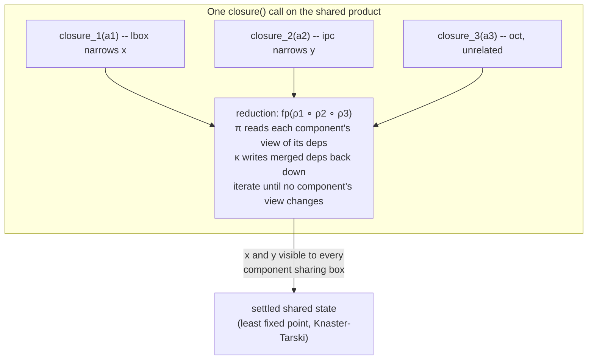

[[book-guidelines|↩ Back to guidelines]]

## Why you need something like this at all

By this point in the paper you have three ways to build new abstract domains from old ones: **logic completion** $L(A)$ (add connectives to one domain), the **direct product** $A_1 \times \dots \times A_n$ (run several domains side by side), and, from the previous two sections, **IPC** and the **delayed product** (two different ways to make sibling domains exchange information about shared variables). Each of these is itself a domain transformer — a functor from abstract domains to abstract domains — and the whole point of that design is that they should compose freely, the way you'd nest generic wrappers in a type system: `Product<IPC<Box>, DelayedProduct<Octagon, Box>>` should just work.

Except there's a wrinkle the paper surfaces with a small, deliberately awkward example. Take

$$c_4 \;\triangleq\; (x = 0 \lor x = 1) \land x \ast y \le 5$$

You can interpret $x = 0 \lor x = 1$ in $L(B)$ (logic completion needs disjunction; boxes alone don't have it) and $x \ast y \le 5$ in $IPC(B)$ (a nonlinear constraint, too general for boxes or octagons directly — this is exactly IPC's job). Both pieces genuinely want a box domain underneath. So you reach for the tool you already have: $L(B) \times IPC(B)$.

**What breaks:** the direct product is defined coordinatewise. Each component is a *separate* $B$ element. When $IPC(B)$'s propagator narrows $x$'s interval because of $x \ast y \le 5$, that narrowing lives entirely inside $IPC(B)$'s private copy of $B$. $L(B)$'s private copy of $B$ never hears about it, and vice versa. You've built two domains that both happen to be "about boxes," but they're not *the same* boxes — you've silently duplicated state and broken the property that made boxes a shared source of truth about the variables in the first place. This is a strictly worse case of the direct product's original problem (no cross-component information exchange, from the [[Domain-Transformers|Domain Transformers]] article): there, the components were genuinely different domains (boxes vs. octagons) that could plausibly stay separate; here, they're structurally the *same kind of domain*, wrapped by two different transformers, and keeping them separate is pure waste — there's no informational benefit to it, only lost propagation.

But — and this is the part that makes the fix nontrivial rather than "always merge everything" — sometimes you *want* two elements of the same domain kept apart. The paper's counterexample: two octagon elements, each over $n$ distinct variables. Octagon closure is Floyd-Warshall, $O(n^3)$. Two separate closures cost $O(n^3) + O(n^3)$. Merge them into one $2n$-variable octagon and closure costs $O((n+n)^3) = O(8n^3)$ — you pay a cubic penalty for variables that never actually interact. So the real requirement isn't "share everything" or "share nothing," it's: **let the person composing the domain decide, per component, whether it's a fresh copy or a named reference to something already declared** — and if named, wire the sharing so information actually flows both ways without either transformer having to know about the other's internals.

That's the **shared product**.

## The declaration syntax: naming and dependencies

The shared product changes the *notation* for building a product before it changes the underlying machinery. Instead of an anonymous tuple $A_1 \times \dots \times A_n$, you write a **list of named declarations**, where each declaration can name other declarations as its dependencies:

$$
\begin{aligned}
D_1 = \quad & B \; \mathit{box}; \\
            & L(B) \; \mathit{lbox}(\mathit{box}); \\
            & IPC(B) \; \mathit{ipc}(\mathit{box});
\end{aligned}
\qquad\qquad
\begin{aligned}
D_2 = \quad & L(B) \; \mathit{lbox}(\bot_B); \\
            & IPC(B) \; \mathit{ipc}(\bot_B);
\end{aligned}
$$

Read $D_1$ as: "declare a box called `box`; declare an $L(B)$ called `lbox` whose underlying box *is* `box`; declare an $IPC(B)$ called `ipc` whose underlying box is *also* `box`." Both `lbox` and `ipc` are said to have `box` as a **dependency**. $D_2$ is the same shape with the dependency parameter left as an unnamed $\bot_B$ instead — meaning "give this component its own private, unshared box." $D_1$ is exactly the fix for $c_4$: `lbox` and `ipc` are now provably talking about the same box, not two copies. $D_2$ is what plain direct-product nesting would have given you by default (each transformer silently allocating its own bottom element).

If you've built dependency-injection containers or an ECS (entity-component system), this declaration syntax should feel familiar: components are declared once, given a handle, and other components reference that handle instead of constructing their own instance. In Rust terms, the difference between $D_1$ and $D_2$ is the difference between

```rust
// D2: each transformer owns its box outright — no sharing possible.
struct LBox { inner: Box_ }          // Box_ is this file's Box abstract domain
struct Ipc  { inner: Box_ }

// D1: both transformers hold a handle to the *same* box.
use std::{cell::RefCell, rc::Rc};

let shared_box: Rc<RefCell<Box_>> = Rc::new(RefCell::new(Box_::bottom()));
struct LBox { inner: Rc<RefCell<Box_>> }
struct Ipc  { inner: Rc<RefCell<Box_>> }
let lbox = LBox { inner: Rc::clone(&shared_box) };
let ipc  = Ipc  { inner: Rc::clone(&shared_box) };
```

That's not just an analogy — the paper says explicitly that the production implementation realizes sharing "by using pointers," so $\mathit{Rc}\langle\mathit{RefCell}\langle \cdot \rangle\rangle$ (or, in a language with real mutable aliasing, a bare pointer) *is* the mechanism, not a simplification of it. The mathematics in the next section exists to justify that this pointer-sharing is sound — i.e., that reading and writing through the shared handle at different points in `closure` can't produce an inconsistent or incorrectly-ordered result.

## Making sharing precise: projection, join, and the reduction operator

Pointers alone don't tell you *when* to synchronize or *how* to merge conflicting information — that's what the formal machinery is for. The shared product needs two functions per component, generalizing what the delayed product already did informally for its own two-component case:

$$\pi : A \to A_1 \times \dots \times A_n \qquad\qquad \kappa : A \times A_1 \times \dots \times A_n \to A$$

$\pi$ (**projection**) reads a component's current view of its dependencies out; $\kappa$ (**join**) writes updated dependency information back in. You've already seen a concrete instance of this pair without the name: in the delayed product $DP(A_1, A_2)$, $\pi((a_1, a_2, c)) = (a_1, a_2)$ and $\kappa((a_1, a_2, c), d_1, d_2) = (a_1 \sqcup d_1, a_2 \sqcup d_2, c)$ — $\pi$ just reads the two sub-elements out of the triple, $\kappa$ joins in new information about them. The shared product generalizes this pattern to an arbitrary named, dependency-graph-shaped composition instead of a fixed pair.

**Definition 5 (Shared product).** The shared product $\langle A_1\, x_1(d_{11},\dots,d_{1m}) ; \dots ; A_n\, x_n(d_{n1},\dots,d_{nm}), \le\rangle$ is a direct product $A_1 \times \dots \times A_n$ in which `closure` is interleaved with a **reduction operator**. For each component $i$ with dependencies $\pi_i(a_i) = (b_j, \dots, b_k)$ (where $b_\ell = \bot$ if $d_{i\ell} = \bot$, i.e., that dependency wasn't shared), define

$$\rho_i(a_1,\dots,a_n) = (a_1,\dots,\underbrace{a_j \sqcup b_j}_{\text{merge dependency } j \text{ into the product}},\dots,\underbrace{a_k \sqcup b_k}_{\text{merge dependency } k},\dots,\underbrace{\kappa_i(a_i,a_j,\dots,a_k)}_{\text{write back into component } i},\dots,a_n)$$

Each $\rho_i$ does two things in one pass: it takes what component $i$ currently believes about its dependencies (via $\pi_i$) and joins that information *up into* the shared dependency's own slot in the product tuple (so other components sharing that same dependency see it too), and it takes $\kappa_i$ to write the now-current dependency state *back down into* component $i$ (so component $i$'s next `closure` call sees everyone else's contributions). $\rho_i$ is required to be **idempotent** and **monotone** — idempotent because re-running the same merge shouldn't change anything once things are settled, monotone because it must only ever add information (move up the lattice), never retract a fact.

Then $\rho \triangleq \mathrm{fp}(\rho_1 \circ \dots \circ \rho_n)$, the **fixed point** of composing all the per-component reductions, and:

$$\mathit{closure}((a_1,\dots,a_n)) \;\triangleq\; \rho(\mathit{closure}_1(a_1), \dots, \mathit{closure}_n(a_n))$$

i.e., run each component's own closure independently first (exactly as the plain direct product would), then run the reduction to fixpoint to propagate what each component learned to every other component that shares its dependencies.

**Why a fixed point and not one pass.** This is the crux, and it's worth deriving rather than just citing. Suppose `lbox` narrows `box`'s interval for $x$ during its own closure, and (independently, in the same round) `ipc` narrows `box`'s interval for $y$. A single application of $\rho_{\mathit{lbox}} \circ \rho_{\mathit{ipc}}$ merges `lbox`'s update into the shared `box` slot, then merges `ipc`'s update in — but by the time $\rho_{\mathit{ipc}}$ runs, has `lbox`'s already-merged $x$-update been written back down into `lbox` itself, in case `lbox`'s own state now also depends on the fresher `ipc`-derived value of `box`? Not necessarily, and definitely not transitively if a third component depends on `lbox`'s output. One pass propagates changes exactly one hop along the dependency graph; a chain of shared dependencies three components deep needs the update to ripple through in successive passes, exactly the same way a naive one-shot pass over a dataflow graph doesn't compute a full fixpoint, only advances it by one step. The paper's payoff line makes this precise: because each $\rho_i$ is monotone and idempotent, $\rho_1 \circ \dots \circ \rho_n$ is a monotone self-map on the product lattice, so by the **Knaster-Tarski fixed point theorem** it has a least fixed point, and iterating the composition converges to it — this is the same fixpoint-existence argument (monotone map on a complete lattice $\Rightarrow$ a well-defined least fixpoint) that underwrites `solve`'s use of `closure` everywhere else in the paper, just applied one level up, to *merging shared state* instead of to *eliminating inconsistent values within one domain*.



## What $\rho_i$ looks like on the worked example

The paper walks $D_1$ through one instance of this. Let $a = (\mathit{box}, \mathit{lbox}, \mathit{ipc}) \in D_1$. Then

$$\rho_2(\mathit{box}, \mathit{lbox}, \mathit{ipc}) = \big(\mathit{box} \sqcup \pi(\mathit{lbox}),\; \kappa(\mathit{lbox}, \mathit{box}),\; \mathit{ipc}\big)$$

Two moves, matching the two roles described above: first, $\mathit{box} \sqcup \pi(\mathit{lbox})$ pulls whatever `lbox` currently knows about its box out via $\pi$ and joins it into the shared `box` slot — so if `lbox`'s own closure narrowed something, that narrowing is now visible in the product's canonical `box`. Second, $\kappa(\mathit{lbox}, \mathit{box})$ writes the (now possibly-more-refined) shared `box` back into `lbox`'s own representation, so `lbox` is caught up on anything `box` learned elsewhere (e.g. from `ipc`, or a future $\rho_3$ pass touching `ipc`'s view of `box`). Running this to a fixpoint across all three components is what makes `box`, `lbox`, and `ipc` behave as one genuinely-shared box rather than three copies that occasionally get told about each other.

## Why this needs no cooperation from the transformer being shared

The line the paper is proudest of here, and worth calling out explicitly: **$L(A)$ and $IPC(A)$ did not have to be redesigned to support being shared.** Logic completion and IPC were both defined in isolation, in earlier sections, with zero awareness that a shared product might one day wrap them. The shared product only needs $\pi$ and $\kappa$ to exist for a component — and in the pointer-based implementation, $\pi$ and $\kappa$ are defined **implicitly and generically for every abstract domain** ("as in the former example, at any time a new information is available in `box`, it is automatically accessible to both $L(B)$ and $IPC(B)$ due to the sharing via pointers"). This is the abstract-domain-transformer analogue of a well-designed trait system: you don't need `LogicCompletion<A>` to know it might be aliased — aliasing is a property of *how the caller holds the reference*, not something the wrapped type has to opt into. That's what "fully compositional w.r.t. the shared product" means in the paper's own words: any transformer plugs in unmodified, and any two transformers can be combined this way without either being touched.

## Where this leads

The shared product is the paper's third and final domain-transformer mechanism, and it's what makes the case study in Chapter 4 actually buildable: FJS2's abstract domain $\mathit{PREC} = DP(IPC(B \times O), O)$ is itself embedded as a named, shared component inside a larger declaration (`prec(((box, oct)), oct)`) alongside `no_overlap` and `alternatives`, which only *share* `box` and `oct` rather than each allocating their own — without the shared product, that domain would either duplicate boxes and octagons across every sub-formula's transformer (losing propagation, exactly like the broken $c_4$ example above) or require hand-written glue code between every pair of transformers that happen to need the same underlying domain, which is precisely the "hard-wired cooperation" the paper opens by criticizing in SMT's Nelson-Oppen scheme.

For the standing project (`sat-smt-csp`, `static-analysis`): this is the cleanest instance in the whole paper of the **Galois-connection / abstract-lattice / domain-propagation** thread from the learning goals, because it's the one place the paper has to *prove* a fixpoint exists rather than just compute one within a single domain — the same Knaster-Tarski argument you'd invoke to justify merging abstract states at a CFG join point in a dataflow analysis, or to justify that repeatedly discharging a set of mutually-referential verification conditions against shared program-invariant lattices actually terminates at a well-defined answer, is exactly the argument used here to justify that `ρ`'s fixpoint is safe to compute and unique. If your CSP kernel's abstract-domain layer ever lets two solver components reference the same underlying store (e.g. two propagators both reasoning about the same variable's bounds, or a Horn-clause solver and a bounds-propagator sharing an interval store for the same program variable), this section is the template: define $\pi$/$\kappa$ once, generically, per domain — implemented as shared, interior-mutable pointers — and get correctness by the same monotone-map argument rather than reasoning about ad hoc synchronization by hand.
