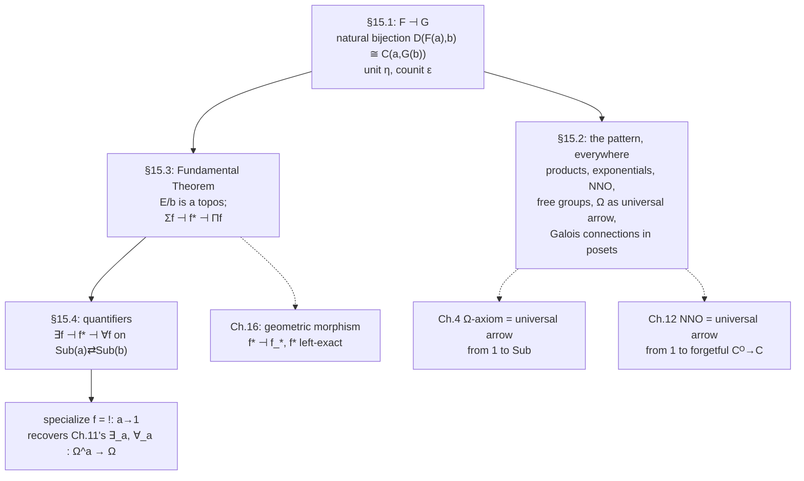

[[book-guidelines|↩ Back to guidelines]]

## Why one idea, this late

Every chapter so far has handed you a *bespoke* universal property. Products came with their own diagram (§3.8). Exponentials came with their own diagram (§3.16) and their own evaluation arrow. The subobject classifier $\Omega$ came with a pullback-square axiom that looked like nothing else in the book (§4.3). The natural numbers object came with a recursion diagram that looked like nothing *those* looked like (§12.2). Each one felt, at the time, like an ad hoc trick tailored to the object being defined — "here is the special shape of arrow that makes this a product," "here is the special shape that makes this a classifier."

Goldblatt opens Chapter 15 by quoting Saunders Mac Lane: adjoints "occur almost everywhere in many branches of Mathematics ... a systematic use of all these adjunctions illuminates and clarifies these subjects." The claim of this chapter is stronger than "here's one more construction." It's: *every one of those bespoke diagrams was already an instance of a single pattern*, and once you have the pattern, the diagrams stop needing to be memorized separately — they're all corollaries of "some functor has an adjoint." This is the payoff Goldblatt has been deferring since Chapter 3: the promised unification of "universal property" into one concept, general enough to swallow initial objects, products, exponentials, free groups, the subobject classifier, and the natural numbers object as five faces of the same fact.

**What breaks without it.** Without adjointness as a named concept, every new universal construction in mathematics requires reinventing its own uniqueness-and-existence argument from scratch, and — worse for this book's purposes — you have no vocabulary for the *quantifiers*. $\exists$ and $\forall$ look, on their surface, like nothing to do with products or free groups. Chapter 11 already built $\exists_a, \forall_a : \Omega^a \to \Omega$ as specific arrows using exponentials and image factorization, but that construction answers "what *is* the quantifier arrow" without answering "*why* does it behave like a quantifier — why does it validate $\exists$-introduction and $\forall$-elimination." Adjointness answers the "why": $\exists$ and $\forall$ are quantifiers, in the fullest logical sense, *because* they are adjoint to substitution, and adjoints automatically carry exactly the universal/existential introduction-elimination behavior a logician needs. That's the chapter's destination. Getting there requires building the general machinery first.

## §15.1 — Adjunctions

### The shape of the problem

Take two categories $\mathscr{C}$ and $\mathscr{D}$, and two functors running in opposite directions between them, $F : \mathscr{C} \to \mathscr{D}$ and $G : \mathscr{D} \to \mathscr{C}$. Given a $\mathscr{C}$-object $a$ and a $\mathscr{D}$-object $b$, you can push $a$ across with $F$ to land in $\mathscr{D}$ as $F(a)$, and pull $b$ back across with $G$ to land in $\mathscr{C}$ as $G(b)$. Now you have two objects sitting *in the same category* as $a$ and $b$ respectively, so you can ask about arrows between them:

- $\mathscr{D}$-arrows of the form $F(a) \to b$,
- $\mathscr{C}$-arrows of the form $a \to G(b)$.

**Adjointness is the assertion that these two collections of arrows are always in exact, natural correspondence** — a bijection between $\mathscr{D}(F(a), b)$ and $\mathscr{C}(a, G(b))$, for every choice of $a$ and $b$, that varies coherently ("naturally") as $a$ and $b$ vary. That's the entire idea. Everything else in this section is making "exact, natural correspondence" precise and extracting its consequences.

**Definition (adjunction).** A bijection
$$
\theta_{a,b} : \mathscr{D}(F(a), b) \cong \mathscr{C}(a, G(b))
$$
is called **natural in $a$ and $b$** when it preserves categorial structure as $a,b$ vary: formally, the assignment $(a,b) \mapsto \mathscr{D}(F(a),b)$ is a functor $\mathscr{C}^{\mathrm{op}} \times \mathscr{D} \to \mathbf{Set}$, the assignment $(a,b)\mapsto\mathscr{C}(a,G(b))$ is another such functor, and the $\theta_{a,b}$'s are required to be the components of a natural transformation $\theta$ between these two functors. (Goldblatt flags the exercise of checking why the *first* factor needs $\mathscr{C}^{\mathrm{op}}$ rather than $\mathscr{C}$ — the hom-functor is contravariant in its first argument, since precomposing with an arrow $a' \to a$ turns an arrow *out of* $a$ into one out of $a'$, reversing direction.)

When such a $\theta$ exists, the triple $(F, G, \theta)$ is called an **adjunction from $\mathscr{C}$ to $\mathscr{D}$**. $F$ is **left adjoint** to $G$, written $F \dashv G$; $G$ is **right adjoint** to $F$, written $G \vdash F$. Schematically, $\theta$ is displayed as the correspondence
$$
\frac{F(a) \to b}{a \to G(b)}
$$
— a "left-right" rule: an arrow out of an $F$-image on the left corresponds to an arrow into a $G$-image on the right. This bidirectional, structure-preserving correspondence between two entire families of arrows is what "adjoint" *means*; everything that follows just unpacks what that correspondence forces to be true.

### Unit and counit: the correspondence made concrete

The bijection $\theta_{a,b}$ is completely determined by what it does to two special, canonical cases, and those two cases turn out to be the two most important arrows in the whole theory.

**The unit.** Fix a $\mathscr{C}$-object $a$, and instantiate the bijection at $b = F(a)$. Apply $\theta_{a,F(a)}$ to the identity arrow $1_{F(a)} : F(a) \to F(a)$ (a legal element of the left-hand set $\mathscr{D}(F(a), F(a))$). The result is a $\mathscr{C}$-arrow
$$
\eta_a := \theta(1_{F(a)}) : a \to G(F(a)),
$$
called the **unit** of $a$. Naturality of $\theta$ forces $\eta_a$ to have a very strong property: for *any* $\mathscr{D}$-object $b$ and *any* $\mathscr{C}$-arrow $g : a \to G(b)$, there is **exactly one** $\mathscr{D}$-arrow $f : F(a) \to b$ making
$$
\begin{array}{ccc}
a & \xrightarrow{\ \eta_a\ } & G(F(a)) \\
& {\scriptstyle g}\searrow & \downarrow{\scriptstyle G(f)} \\
& & G(b)
\end{array}
$$
commute — namely $f = \theta_{a,b}^{-1}(g)$. This is exactly a *universal-arrow* property: $\eta_a$ is the "most efficient" way to get from $a$ into the image of $G$, in the sense that every other way to relate $a$ to some $G(b)$ factors uniquely through it. The $\eta_a$'s assemble (again by naturality) into a natural transformation $\eta : 1_{\mathscr{C}} \Rightarrow G \circ F$, the **unit of the adjunction**.

**The counit**, dually: fix a $\mathscr{D}$-object $b$, instantiate at $a = G(b)$, and apply $\theta^{-1}_{G(b),b}$ (the inverse bijection) to $1_{G(b)}$, giving
$$
\varepsilon_b := \theta^{-1}(1_{G(b)}) : F(G(b)) \to b,
$$
the **co-unit** of $b$. It has the mirror-image co-universal property: for any $\mathscr{C}$-object $a$ and any $\mathscr{D}$-arrow $f : F(a) \to b$, there is exactly one $g : a \to G(b)$ with $\varepsilon_b \circ F(g) = f$. The $\varepsilon_b$'s assemble into $\varepsilon : F \circ G \Rightarrow 1_{\mathscr{D}}$, the **counit**.

This is worth sitting with, because it is the single most reused pattern in the rest of the chapter: **an adjunction is completely reconstructible from its unit and counit alone.** Goldblatt states the equivalence explicitly — given $F$ and $G$, the following are all the same fact:

- (a) $F$ is left adjoint to $G$;
- (b) $G$ is right adjoint to $F$;
- (c) there is an adjunction $(F, G, \theta)$ from $\mathscr{C}$ to $\mathscr{D}$;
- (d) there exist natural transformations $\eta : 1_{\mathscr{C}} \Rightarrow G \circ F$ and $\varepsilon : F \circ G \Rightarrow 1_{\mathscr{D}}$ whose components have the universal/co-universal properties above.

In practice, (d) is how you *prove* an adjunction exists in the wild: you don't construct a giant bijection between two hom-sets by hand, you exhibit one arrow ($\eta_a$, or $\varepsilon_b$) per object and check it has the relevant universal property. Every worked example in §15.2 below is built exactly this way.

### Universal arrows, named on their own

Goldblatt isolates the pattern behind $\eta_a$ as a concept in its own right, because it shows up even when you don't yet know whether a *full* adjunction exists.

**Definition (free / universal arrow).** Let $G : \mathscr{D} \to \mathscr{C}$ be a functor and $a$ a $\mathscr{C}$-object. A pair $(b, \eta)$, consisting of a $\mathscr{D}$-object $b$ and a $\mathscr{C}$-arrow $\eta : a \to G(b)$, is **free over $a$ with respect to $G$** (also: a **universal arrow from $a$ to $G$**) iff for every $\mathscr{C}$-arrow $g : a \to G(c)$ there is exactly one $\mathscr{D}$-arrow $f : b \to c$ with $G(f) \circ \eta = g$.

Whenever $F \dashv G$, the pair $(F(a), \eta_a)$ is automatically free over $a$ with respect to $G$ — that's just the unit's universal property restated. But the converse direction is the practically useful one (Exercise 4 in the book): **if a universal arrow from $a$ to $G$ exists for every $\mathscr{C}$-object $a$, that assignment $a \mapsto b$ extends to a functor $F$ with $F \dashv G$.** This is how you *build* left adjoints in practice: check that a free object exists pointwise, and the functoriality (and the adjunction) comes for free.

Dually, a pair $(a, \varepsilon)$ with $\varepsilon : F(a) \to b$ is **co-free over $b$ with respect to $F$** — a universal arrow *from $F$ to $b$* — when every $f : F(c) \to b$ factors uniquely through $\varepsilon$ via a unique $g : c \to a$.

**[[Logical-Geometry#Grounding|Grounding]] — Rust.** The cleanest instance of a free construction a working programmer already knows is *free monoid = list*. Let $U : \mathbf{Mon} \to \mathbf{Set}$ be the forgetful functor from monoids to their underlying sets (forget multiplication and the unit, keep only the carrier). Its left adjoint $F$ sends a set/type $A$ to the free monoid on $A$ — concretely, `Vec<A>` under concatenation, with `Vec::new()` as the unit:

```rust
trait Monoid {
    fn unit() -> Self;
    fn combine(self, other: Self) -> Self;
}

impl<A> Monoid for Vec<A> {
    fn unit() -> Self { Vec::new() }
    fn combine(mut self, mut other: Self) -> Self {
        self.append(&mut other);
        self
    }
}

// the unit of the adjunction, η_A : A -> U(F(A))
fn singleton<A>(a: A) -> Vec<A> { vec![a] }
```

The universal property is exactly `Vec`'s defining feature as "the free thing": given *any* monoid `M` and *any* function `g: A -> M` (a `C`-arrow `a -> G(b)` in the abstract picture — here `G` is silently identified with `U`), there is exactly one monoid homomorphism `f: Vec<A> -> M` with `f(singleton(a)) == g(a)` for all `a` — namely, `fold` with `g` mapped over the elements. That `f = |v: Vec<A>| v.into_iter().map(g).fold(M::unit(), M::combine)` is *forced*, not chosen, is precisely the "exactly one $f$" clause of the universal-arrow definition; `fold` isn't an implementation convenience, it's the unique factorization the adjunction promises exists.

**Grounding — Lean.** The unit/counit vocabulary maps almost verbatim onto elaboration. Think of $G$ as "forget elaborated structure, keep only the raw surface syntax a metavariable is standing for," and $F$ as "elaborate." The unit $\eta_a : a \to G(F(a))$ is then the act of producing a *fresh metavariable* `?m : G(F(a))` standing for the not-yet-elaborated term — a placeholder arrow from the raw goal into "the shape of an elaborated answer, viewed through the forgetful lens." Its universal property — *any* other candidate solution $g$ factors uniquely through $\eta_a$ — is exactly what makes metavariable assignment *sound*: once `?m` is assigned, every other constraint mentioning it must be consistent with that one assignment, or elaboration fails. This is not a loose metaphor; Miller pattern unification's central theorem is precisely that certain metavariable-application patterns admit a *most general* (i.e., universal) unifier — the categorical fingerprint of a universal arrow.

## §15.2 — Some adjoint situations

Goldblatt now runs the definition through a gallery of examples, and the point of the gallery is cumulative: each one shows that a construction you already know under its own name is *nothing but* a left or right adjoint to some (usually very simple) functor.

### Initial objects, as an adjunction from the trivial category

Let $\mathscr{C} = \mathbf{1}$, the one-object category, and $G : \mathscr{D} \to \mathbf{1}$ the unique functor. If $F : \mathbf{1} \to \mathscr{D}$ is left adjoint to $G$, unwinding the definition at the unique object $0$ of $\mathbf{1}$ gives: for every $b$, "there is exactly one arrow $0 \to G(b)$" (trivially true, $\mathbf{1}$ has only identities) corresponds to "there is exactly one arrow $F(0) \to b$." So **$F(0)$ is an initial object of $\mathscr{D}$**. Dually (Exercise 1), $\mathscr{D}$ has a terminal object iff the unique functor $! : \mathscr{D} \to \mathbf{1}$ has a *right* adjoint. Initial and terminal objects — which Chapter 3 introduced as their own separate universal properties — are just the adjoints of the functor into (or out of) the trivial category.

### Products, via the diagonal functor

Let $\Delta : \mathscr{C} \to \mathscr{C} \times \mathscr{C}$ be the **diagonal functor**, $\Delta(a) = (a,a)$. Suppose $\Delta$ has a right adjoint $G$. Then for $c \in \mathscr{C}$ and $x = (a,b) \in \mathscr{C} \times \mathscr{C}$,
$$
\frac{c \to G(x)}{\Delta(c) \to x}
$$
and an arrow $\Delta(c) \to (a,b)$ in the product category is exactly *a pair* of arrows $c \to a$, $c \to b$. So the co-unit $\varepsilon_x : \Delta(G(x)) \to x$ is a pair of projections $p : G(x) \to a$, $q : G(x) \to b$, and its co-freeness says: for any $f : c \to a$, $g : c \to b$, there's a unique $h : c \to G(x)$ with $p \circ h = f$, $q \circ h = g$. That's the product's universal property, verbatim — **$G(x)$ is $a \times b$**, with $\Delta \dashv G$, and the unit $\eta_c : c \to c \times c$ is the diagonal arrow $\langle 1_c, 1_c \rangle$. Co-products, dually, are the *left* adjoint to $\Delta$ (Exercise 2).

Goldblatt notes this generalizes completely: the limit (or colimit) of a diagram of any shape in $\mathscr{C}$ arises from the right (left) adjoint of a diagonal functor $\mathscr{C} \to \mathscr{C}^J$, where $J$ is the "shape" category of the diagram (for products, $J$ is the two-point discrete category). **Limits and colimits, as a class, are just right and left adjoints to diagonal functors.** This is the single fact that retroactively unifies every universal-property construction from Chapter 3.

### Free/forgetful pairs across algebra and topology

The Rust `Vec<A>` example above is one instance of a template that recurs everywhere:

| Forgetful functor $G$ | Left adjoint $F$ (free construction) |
|---|---|
| $\mathbf{Grp} \to \mathbf{Set}$ | free group on a set |
| $\mathbf{Field} \to \mathbf{IntDom}$ (forget the field structure) | field of fractions of an integral domain |
| $\mathbf{Top} \to \mathbf{Set}$ | discrete topology on a set |
| $\mathbf{CMet} \to \mathbf{Met}$ (forget completeness) | metric completion of a metric space |

The *indiscrete* topology, interestingly, is the mirror image: it's the **right** adjoint to $U : \mathbf{Top} \to \mathbf{Set}$, not the left — a reminder that "free" and "forgetful" aren't symmetric labels, they're a genuine left/right distinction with real content (the discrete topology is the "smallest amount of extra structure consistent with any map out," the indiscrete topology the "largest amount consistent with any map in").

### Exponentiation

Chapter 3 already showed (§3.16) that having exponentials means a bijection $\mathscr{C}(c \times a, b) \cong \mathscr{C}(c, b^a)$ for all $a,b,c$ — which is now visibly an adjunction. Let $F = {-} \times a : \mathscr{C} \to \mathscr{C}$ (the "product with $a$" functor). Its right adjoint is $({-})^a : \mathscr{C} \to \mathscr{C}$, sending $b \mapsto b^a$ and $f : c \to b$ to the exponential adjoint $f^a : c^a \to b^a$ of $f \circ \mathrm{ev} : c^a \times a \to c \to b$. The counit $\varepsilon_b : b^a \times a \to b$ is exactly the **evaluation arrow** $\mathrm{ev}$, and its co-freeness *is* the axiom of exponentials from §3.16. So: **$\mathscr{C}$ has exponentials iff ${-}\times a$ has a right adjoint for every object $a$.**

### Relative pseudo-complement (a special case)

In a relative-pseudo-complemented (r.p.c.) lattice — a Heyting algebra, in the terminology of Chapter 8 — the defining condition $c \sqcap a \sqsubseteq b \iff c \sqsubseteq (a \Rightarrow b)$ is exactly the exponential adjunction specialized to a poset: **a lattice is r.p.c. iff ${-} \sqcap a$ has a right adjoint for every $a$**, and that right adjoint *is* $a \Rightarrow {-}$. Chapter 7's identification of Heyting implication as "the right adjoint to $\cap$" (§7.5) now has its official categorical home.

### Natural numbers objects, as free endomorphisms

This is the least obvious example, and the payoff is worth the setup. Call a $\mathscr{C}$-arrow $f$ **endo** if $\mathrm{dom}\,f = \mathrm{cod}\,f$, i.e. $f : a \to a$; write such an arrow as $a \circlearrowleft f$. The **category of endos** $\mathscr{C}^{\bigcirc}$ has these as objects, with an arrow from $a\circlearrowleft f$ to $b \circlearrowleft g$ being a $\mathscr{C}$-arrow $h : a \to b$ making the square $h \circ f = g \circ h$ commute. Let $G : \mathscr{C}^{\bigcirc} \to \mathscr{C}$ be the forgetful functor taking $f : a \to a$ to its domain $a$.

**Suppose $G$ has a left adjoint $F$.** Write $N \circlearrowleft s$ for the endo $F(1)$ (i.e., $F(1) = (N, s : N \to N)$), and write $0 : 1 \to G(F(1)) = N$ for the unit $\eta_1$. Freeness of $(F(1), \eta_1)$ over $1$ unwinds to exactly this: for *any* endo $A : a \to a$ and any arrow $x : 1 \to a$, there is a unique $h : N \to a$ with
$$
h \circ 0 = x, \qquad h \circ s = A \circ h.
$$
That is **the recursion theorem** verbatim — $(N, 0, s)$ is a natural numbers object. Conversely, given an NNO, defining $F$ by $F(a) = \big(a \times N \xrightarrow{1_a \times s} a \times N\big)$ produces a left adjoint to $G$, using Freyd's Theorem 13.2.1 (which needs $\mathscr{C}$ to have exponentials to guarantee the unique $h$ exists). **A cartesian closed category has a natural numbers object iff the forgetful functor $\mathscr{C}^{\bigcirc} \to \mathscr{C}$ has a left adjoint** — equivalently, iff there is a universal arrow from the terminal object $1$ to that functor.

**Grounding — Lean.** This is the categorical soul of induction-as-recursion-principle. Lean's `Nat.rec` *is* the arrow $h$ demanded by this universal property: give it a base case (a point $x : 1 \to a$, i.e. an element of the motive at zero) and a step function (an endo $A : a \to a$, i.e. `Nat → Motive n → Motive (n+1)` specialized to a non-dependent motive), and `Nat.rec` produces the *unique* $h : N \to a$ commuting with both — uniqueness here being exactly why two functions defined by the same recursive equations on `Nat` are propositionally (indeed definitionally, by `rfl`, since both reduce the same way on `Nat.zero`/`Nat.succ`) equal, without needing a separate induction proof.

### Adjoints in posets: Galois connections

Regard a poset $(P, \sqsubseteq)$ as a category (one arrow $p \to q$ iff $p \sqsubseteq q$). A functor between posets is just a **monotone** function. For monotone $f : P \to Q$, $g : Q \to P$:

- $g$ is **right adjoint** to $f$ ($f \dashv g$) iff for all $p \in P$, $r \in Q$: $\quad f(p) \sqsubseteq r \iff p \sqsubseteq g(r)$;
- $g$ is **left adjoint** to $f$ ($g \dashv f$) iff for all $p,r$: $\quad g(r) \sqsubseteq p \iff r \sqsubseteq f(p)$.

This *is* the definition of a **Galois connection** between two posets, stripped down to its bare categorical skeleton — the "hom-set bijection" of the general definition degenerates to a biconditional because a poset hom-set has at most one element.

**This is directly the mathematical object underneath abstract interpretation.** An abstraction/concretization pair $\alpha : C \to A$ (concrete lattice $\to$ abstract lattice) and $\gamma : A \to C$ satisfying the classical Cousot–Cousot condition $\alpha(c) \sqsubseteq a \iff c \sqsubseteq \gamma(a)$ is *exactly* Goldblatt's $\alpha \dashv \gamma$: **the abstraction map is the left adjoint, the concretization map is the right adjoint**, full stop — no analogy required, it is literally the same poset-adjunction pattern applied to the concrete/abstract-domain pair instead of to $P/Q$. The consequence noted at the end of §15.1 — *left adjoints preserve colimits (here: joins), right adjoints preserve limits (here: meets)* — is precisely why a sound abstract interpreter needs $\alpha$ to distribute over $\sqcup$ (to safely over-approximate a union of concrete states) while $\gamma$ needs to distribute over $\sqcap$: that's not a separate soundness lemma to prove from scratch each time, it's a free corollary of "this pair is a Galois connection," i.e. an adjunction in a poset.

### Direct image, inverse image, and a first glimpse of quantifiers

For an ordinary set function $f : A \to B$ and subsets $X \subseteq A$, $Y \subseteq B$: the direct-image functor $\mathscr{P}(f) : \mathscr{P}(A) \to \mathscr{P}(B)$ (taking $X \mapsto f(X)$) and the inverse-image functor $f^{-1} : \mathscr{P}(B) \to \mathscr{P}(A)$ satisfy
$$
\mathscr{P}(f)(X) \subseteq Y \iff X \subseteq f^{-1}(Y),
$$
so $\mathscr{P}(f) \dashv f^{-1}$. But $f^{-1}$ *also* has a right adjoint $f_+$, defined by $f_+(X) = \{y \in B : f^{-1}\{y\} \subseteq X\}$ — one checks $f^{-1}(Y) \subseteq X \iff Y \subseteq f_+(X)$. So along a single arrow $f$, the power-set construction gives an **adjoint triple**
$$
\mathscr{P}(f) \dashv f^{-1} \dashv f_+ .
$$
This triple is not window-dressing — it is, quite literally, $\exists$, substitution, and $\forall$ in disguise, and §15.4 will do nothing more than promote this exact pattern from $\mathbf{Set}$ to an arbitrary topos.

### The subobject classifier as a universal arrow

Recall $\mathrm{Sub} : \mathscr{C}^{\mathrm{op}} \to \mathbf{Set}$ (§9.1), sending $d$ to its subobjects and (contravariantly) $f : c \to d$ to pullback-along-$f$. In a topos, $\mathrm{true} : 1 \to \Omega$ is itself a subobject of $\Omega$, hence corresponds to a function $\eta : 1 = \{0\} \to \mathrm{Sub}(\Omega)$ picking out that one subobject. **Claim: $(\Omega, \eta)$ is free over $1$ with respect to $\mathrm{Sub}$.** Given any $g : 1 \to \mathrm{Sub}(d)$ — i.e., a chosen subobject $g_0 : a \rightarrowtail d$ — freeness demands a unique $\mathscr{C}^{\mathrm{op}}$-arrow $f : \Omega \to d$ (i.e. a $\mathscr{C}$-arrow $d \to \Omega$) with $\mathrm{Sub}(f)(\mathrm{true}) = g_0$. But that arrow is exactly the **character** $\chi_{g_0}$ of the subobject $g_0$ — the classifying arrow whose defining pullback square makes $\mathrm{true}$ pull back precisely to $g_0$ — and its *uniqueness* is exactly the uniqueness clause baked into the $\Omega$-axiom of §4.3.

So: **any category with pullbacks has a subobject classifier iff there is a universal arrow from $1$ to $\mathrm{Sub} : \mathscr{C}^{\mathrm{op}} \to \mathbf{Set}$.** The $\Omega$-axiom, which looked like a strange bespoke pullback condition when it was first introduced in Chapter 4, turns out to be nothing but "the functor $\mathrm{Sub}$ is representable" — a $\mathbf{Set}$-valued functor is **representable** when it's naturally isomorphic to a hom-functor $\mathscr{C}(d, {-})$, and representable functors are always characterized by possessing an object free over $1$. The whole apparatus of Chapters 4–7 — $\Omega$, characters, pullback-classifying — has just been folded into one sentence.

## §15.3 — The fundamental theorem

### Slices, and the two functors along an arrow

Let $\mathscr{C}$ be a category with pullbacks and $f : a \to b$ an arrow. Recall the **slice category** $\mathscr{C}/b$: objects are arrows into $b$, an arrow from $g : c \to b$ to $h : d \to b$ is a $\mathscr{C}$-arrow $k : c \to d$ with $h \circ k = g$. Then $f$ induces a **pullback functor**
$$
f^{*} : \mathscr{C}/b \longrightarrow \mathscr{C}/a,
$$
sending $g : c \to b$ to its pullback $f^{*}(g)$ along $f$ (an object of $\mathscr{C}/a$), and acting on arrows by the pullback's universal property — this is the direct generalization of the $f^{-1} : \mathscr{P}(B) \to \mathscr{P}(A)$ example above, and it is the categorical incarnation of **substitution**: an object of $\mathscr{C}/b$ is data indexed by (or "living over") $b$, and $f^*$ re-indexes it along $f$.

Composing with $f$ gives a functor the other way,
$$
\Sigma_f : \mathscr{C}/a \longrightarrow \mathscr{C}/b, \qquad \Sigma_f(g) = f \circ g,
$$
and the universal property of the pullback delivers, essentially for free,
$$
\frac{\Sigma_f(g) \to t \ \text{in}\ \mathscr{C}/b}{g \to f^*(t) \ \text{in}\ \mathscr{C}/a}
\qquad\text{i.e.}\qquad \Sigma_f \dashv f^{*}.
$$

In $\mathbf{Set}$, $f^*$ has a right adjoint too, $\Pi_f$, and its construction is worth walking through because it is the *concrete* picture behind the abstract theorem to come: for $g : X \to A$ regarded as a bundle over $A$, $\Pi_f(g)$ is the bundle over $B$ whose stalk over $b \in B$ is the set of **local sections of $g$ defined on $f^{-1}\{b\}$** — i.e. functions $h : f^{-1}\{b\} \to X$ splitting $g$. Checking the adjunction $f^* \dashv \Pi_f$ by hand confirms: an arrow $t : h \to \Pi_f(g)$ (a family of local sections, indexed compatibly) corresponds exactly to an arrow $t' : f^*(h) \to g$ (a single global map respecting the pullback).

### The theorem itself

> **Fundamental Theorem of Topoi** (Freyd 1972, Theorem 2.31). For any topos $\mathscr{E}$ and any object $b$, the slice category $\mathscr{E}/b$ is itself a topos, and for any arrow $f : a \to b$, the pullback functor $f^{*} : \mathscr{E}/b \to \mathscr{E}/a$ has **both** a left adjoint $\Sigma_f$ **and** a right adjoint $\Pi_f$.

$\Sigma_f$ needs only pullbacks to exist — it's the general-category story above, unchanged. $\Pi_f$ is genuinely special to topoi: its construction uses the **partial arrow classifier** $\eta_a$ from §11.8 (the arrow that lets a topos represent "possibly-undefined" functions internally, since a section over $f^{-1}\{b\}$ is exactly a *partial* function on the whole of $a$, undefined outside that fiber). Goldblatt sketches the construction — a pullback producing $k : a \to a^a$, its exponential-adjoint $h : b \to a^a$, and $\Pi_f(g)$ built as a pullback of $c^a \xrightarrow{h^a} \ldots$ against $g^a$ — and notes that $\Pi_f$ is *also* what verifies that $\mathscr{E}/b$ has exponentials at all: for $f : a \to b$ and $h : c \to b$ in $\mathscr{E}/b$, their exponential is $h^f \cong \Pi_f(f^*(h))$, matching exactly the "bundle of sections" picture in $\mathbf{Set}$. This closes the loop stated by the theorem: $\mathscr{E}/b$ has pullbacks (inherited), a subobject classifier, exponentials (via $\Pi_f$) — hence is a topos in its own right, at *every* slice.

**Why this is "fundamental."** Nothing about the base topos $\mathscr{E}$ was special — the theorem holds for *any* object $b$ of *any* topos, uniformly. So every topos secretly contains a topos "at each stage $b$," and moving from stage $a$ to stage $b$ along $f$ gives you re-indexing ($f^*$) with dependent-sum ($\Sigma_f$) and dependent-product ($\Pi_f$) always available as its adjoints. This triple — $\Sigma_f \dashv f^* \dashv \Pi_f$ — recurs, unchanged in shape, one level up in §15.4 as the semantics of the quantifiers, and one chapter later (Ch. 16) as the left-exactness condition on a geometric morphism's inverse-image functor. It is the load-bearing structural fact the rest of the book's second half runs on.

**Grounding — Lean and dependent type theory, directly.** This is not an analogy to draw carefully — it is, up to translation of vocabulary, *the same theorem* that appears in the categorical semantics of dependent type theory (locally cartesian closed categories, `Pi` and `Sigma` types). Read $\mathscr{E}/b$ as "the category of types dependent on a context/variable of type $b$," and:

- **$f^{*}$ (pullback along $f : a \to b$) is exactly *weakening/substitution*** — given a type family over $b$, reindex it along a term or context map $f$ to get a type family over $a$. In Lean, this is literally substituting a term into a dependent type: `motive (f x)` from `motive : B → Type`.
- **$\Sigma_f$ (left adjoint) is exactly Σ-type / dependent-sum formation** — `Σ_f(g)` packages a fiber-indexed family into a single bundle over $b$, precisely what `Sigma` (`⟨a, h⟩ : Σ x : B, Motive x`, existential witness plus proof) does: package a witness with fiber-data into one object living over the base.
- **$\Pi_f$ (right adjoint) is exactly Π-type / dependent-product formation** — a "section over each fiber, uniformly" is exactly a dependent function `(x : A) → Motive x`, and $\Pi_f$ is the functor computing "the type of sections," matching Lean's `∀ x, Motive x` / `(x : A) → B x` construction over the pullback.

That the *same* adjoint triple governs both "topos slice categories" and "how a dependently-typed kernel forms Σ- and Π-types" is not a coincidence Goldblatt is pointing at explicitly (locally cartesian closed categories as models of dependent type theory postdate this book), but it is the exact structure a type-theoretic kernel is built on, and recognizing $f^*$/$\Sigma_f$/$\Pi_f$ here means recognizing, on sight, the categorical semantics of `Σ` and `Π` formation, introduction, and elimination the next time they appear in a kernel's typing rules.

## §15.4 — Quantifiers

### First in $\mathbf{Set}$: quantifiers as image and its adjoints

Let $\mathfrak{A} = (A, \dots)$ be a first-order model. A formula $\varphi(v_1,v_2)$ of index 2 determines $X = \{(x,y) \in A^2 : \mathfrak{A} \models \varphi[x,y]\} \subseteq A^2$ (Chapter 11's satisfaction relation). The quantified formulas $\exists v_2\, \varphi$ and $\forall v_2\, \varphi$, of index 1, determine subsets of $A$ definable directly from $X$:
$$
\exists_p(X) = \{x : \text{for some } y,\ (x,y) \in X\}, \qquad
\forall_p(X) = \{x : \text{for all } y,\ (x,y) \in X\},
$$
where $p : A^2 \to A$ is the first projection, $p(x,y) = x$. Now notice: $\exists_p(X)$ is *exactly the image* of $X$ under $p$. Since image and preimage always satisfy $\mathrm{im}(X) \subseteq Y \iff X \subseteq p^{-1}(Y)$ for any function, this says
$$
\exists_p \dashv p^{-1}.
$$
And since $p^{-1}\{x\} = \{(x,y) : y \in A\}$, one computes $\forall_p(X) = \{x : p^{-1}\{x\} \subseteq X\} = p_+(X)$ — exactly the $f_+$ right adjoint from §15.2. So, in $\mathbf{Set}$, quantifying out the second coordinate of a two-place relation is:
$$
\exists_p \ \dashv\ p^{-1} \ \dashv\ \forall_p.
$$
For a general function $f : A \to B$, renaming $\mathscr{P}(f)$ as $\exists_f$ and $f_+$ as $\forall_f$ gives the general characterization
$$
\exists_f(X) = f(X), \qquad \forall_f(X) = \{y : \forall x\,(f(x) = y \implies x \in X)\}.
$$
$\exists$ is image (**"there's a witness"** = **"$y$ is hit"**); $\forall$ is the "totally covered fiber" condition (**"every witness that could produce $y$ already lies in $X$"**) — read off directly from the definitions, not asserted by analogy.

### Promoting this to an arbitrary topos

An arrow $f : a \to b$ in a topos induces $f^{*} : \mathrm{Sub}(b) \to \mathrm{Sub}(a)$, pulling a subobject of $b$ back along $f$ (pullbacks preserve monics, so this lands in $\mathrm{Sub}(a)$ and not just "some subobject-shaped arrow") — this is the $\mathrm{Sub}$-level shadow of the pullback functor $f^*$ from §15.3, and it *is* substitution: if $g \rightarrowtail b$ represents "the extension of a predicate $\psi$ on $b$," then $f^*(g)$ represents the extension of $\psi(f(-))$ — $\psi$ with $f$ substituted in.

**The left adjoint.** $\exists_f : \mathrm{Sub}(a) \to \mathrm{Sub}(b)$ is defined on $g : c \rightarrowtail a$ by
$$
\exists_f(g) = \mathrm{im}(f \circ g)
$$
— the image of the composite $c \to a \to b$ (the Chapter 5 epi-monic factorization is what makes "image" a well-defined subobject here). That this is functorial, and left adjoint to $f^*$, follows from the universal property of the image as *the smallest subobject through which an arrow factors* (Theorem 5.2.1) — exactly the same fact that made $\exists_p$ a left adjoint in $\mathbf{Set}$, now stripped of elements.

**The right adjoint.** $\forall_f : \mathrm{Sub}(a) \to \mathrm{Sub}(b)$ is built from $\Pi_f : \mathscr{E}/a \to \mathscr{E}/b$ of §15.3: assign to $g : c \rightarrowtail a$ the subobject $\Pi_f(g)$. (In $\mathbf{Set}$, recall, $f_+$ was already flagged as a special case of $\Pi_f$ — the "always-defined-section" bundle picture collapsing to a plain subset when the fiber data is 0-or-1-valued.)

**The adjunction itself**, derived directly from $\Sigma_f \dashv f^* \dashv \Pi_f$ of §15.3 restricted to subobjects:
$$
\exists_f \ \dashv\ f^{*} \ \dashv\ \forall_f : \mathrm{Sub}(a) \rightleftarrows \mathrm{Sub}(b).
$$
This triple, together with the "embed subobjects into the slice, and take the image back out" pair $\sigma_a \dashv \iota_a$ (where $\iota_a : \mathrm{Sub}(a) \to \mathscr{E}/a$ picks a representing monic and $\sigma_a : \mathscr{E}/a \to \mathrm{Sub}(a)$ sends $g$ to its image $\mathrm{im}\,g$), assembles into what Kock and Wraith call the **"doctrinal diagram"** for $f : a \to b$ — a square of four functors ($f^*$, $\Sigma_f$, $\Pi_f$, together with $\sigma$/$\iota$ at each end) whose commuting identity $\exists_f \circ \sigma_a = \sigma_b \circ \Sigma_f$ says, in words: "taking the image of a subobject and then quantifying it out along $f$" agrees with "pushing forward along $f$ in the slice and then taking the image" — $\exists$ computed at the level of predicates is compatible with $\Sigma$ computed at the level of the underlying arrows.

### Recovering the Chapter 11 quantifier arrows as a special case

Specialize $f$ to the unique arrow $! : a \to 1$. Then $\mathrm{Sub}(a)$ and $\mathrm{Sub}(1)$ are (via the classifier) $\mathscr{E}(a,\Omega) = \Omega^a$'s global sections and $\mathscr{E}(1,\Omega) \cong \Omega$ respectively, and — under the canonical isomorphism $\Omega^{1} \cong \Omega$ — $\exists_!$ and $\forall_!$ become arrows $\Omega^a \to \Omega$. These are, on the nose, the **$\exists_a$ and $\forall_a$ arrows** constructed directly (via exponential adjunction and image factorization) in [[Elementary-First-Order-Truth-in-a-Topos|Chapter 11's treatment of first-order truth]]. That chapter showed *what* those arrows were and verified they satisfy the right identities by hand ($(\forall_a \circ p_a) \wedge \mathrm{ev}_a = \mathrm{true}$, etc.); this chapter explains *why* those identities had to hold: they are the automatic consequence of $\exists_! \dashv {!}^* \dashv \forall_!$ being an adjoint triple, and adjoints automatically satisfy exactly the introduction/elimination behavior a quantifier needs — $\exists$-introduction is the unit, $\forall$-elimination is the counit, of the respective adjunctions.

### The most general version: quantifying "along a relation"

Even $f^*$ ranging over arbitrary $f : a \to b$ isn't the most general case. Given a relation $R \subseteq A \times B$ in $\mathbf{Set}$, define quantification *along $R$*:
$$
\exists_R(X) = \{y : \exists x\,(x \in X \text{ and } xRy)\}, \qquad
\forall_R(X) = \{y : \forall x\,(xRy \implies x \in X)\}.
$$
This subsumes the functional case ($R$ = graph of $f$) and handles genuinely relational quantification (existential/universal image along an arbitrary relation, not just a function). In a topos, given a monic $r : R \rightarrowtail a \times b$, Street and Brockway construct actual internal arrows $\Omega^a \to \Omega^b$ corresponding to $\exists_R, \forall_R$; specializing $f : a \to b$'s graph recovers $\forall_f, \exists_f$ as internal arrows, and specializing further to $! : a \to 1$ recovers the Chapter 11 quantifier arrows $\Omega^a \to \Omega$ used throughout that chapter's semantics — the same construction, at three levels of generality, closing the circle back to where §15.3 began.

**Grounding — the predicate-transformer connection (Hoare logic, symbolic execution, abstract interpretation).** The $\exists_f \dashv f^* \dashv \forall_f$ triple is *exactly* the adjoint structure underneath forward and backward program analysis, and recognizing it is what makes the soundness of both directions look inevitable rather than coincidental:

- **$f^*$ (substitution/pullback along $f$)** is the semantics of assigning: if $f$ models an assignment `v := e`, pulling a postcondition $\psi(v)$ back along $f$ gives $\psi(e)$ — ordinary substitution.
- **$\forall_f$ (right adjoint)** is the **weakest-precondition** direction: "for every $x$ mapping to $y$ under $f$, $x$ already satisfies $X$" is exactly `wp` for a possibly-many-to-one, angelically-resolved step — the precondition guaranteeing the property holds *no matter which preimage produced $y$*.
- **$\exists_f$ (left adjoint)** is the **strongest-postcondition** direction: "$y$ is reachable from some $x \in X$" is exactly `sp`'s forward-reachability computation — the smallest postcondition consistent with having started in $X$.

That $\exists_f$ and $\forall_f$ are *adjoint*, not just independently-defined transformers, is the categorical reason `sp` and `wp` are Galois-connected duals of one another (this is literally the poset-adjunction special case from §15.2, applied to $\mathrm{Sub}(a)$ as a lattice of predicates) — and it's the same structural fact a CEGAR loop leans on when it alternates forward reachability (build $\exists$-images of the current abstract state) with backward refinement (compute $\forall$-preconditions ruling out a spurious counterexample): both directions are legitimate quantifier operations along the *same* transition relation, adjoint to the *same* substitution functor, not two unrelated heuristics that happen to cooperate.

## Synthesis: one pattern, five earlier disguises



Structurally, this chapter depends on nearly everything before it — products and exponentials (§3.8, §3.16), the subobject classifier and image factorization (Ch. 4–5), Heyting implication (§7.5), the natural numbers object (§12.2), and the $\exists_a/\forall_a$ arrows of Chapter 11 — precisely because its entire content is *re-deriving* all of those as one recurring shape rather than introducing new machinery. In the other direction, it hands the rest of the book two things it didn't have before: the Fundamental Theorem's $\Sigma_f \dashv f^* \dashv \Pi_f$ triple, reused unchanged as the left-exactness condition defining a **geometric morphism** in Chapter 16 ($f^* \dashv f_*$, with $f^*$ required to preserve finite limits); and the adjoint characterization of $\exists,\forall$, which is what lets Chapter 16 talk precisely about which fragments of first-order logic ("geometric logic") survive being pushed through a geometric morphism — a fragment defined exactly as the connectives and quantifiers whose *adjoint* structure a left-exact functor is guaranteed to respect.

For the compiler/elaborator project specifically, three things here are directly load-bearing, not just suggestively similar:

1. **$\Sigma_f \dashv f^* \dashv \Pi_f$ on slice categories is the categorical semantics of Σ-types and Π-types**, substitution, and weakening — recognizing "pullback functor between slices" on sight as "context substitution," and its adjoints as "existential/dependent-sum witness packaging" and "dependent-function formation," is the single most transferable idea in this chapter for building a dependently-typed kernel.
2. **Universal arrows are the categorical shape of unification's most-general-solution guarantee.** Every place a construction was defined as "the object $b$ such that every other candidate factors through it uniquely" is a metavariable-assignment problem in miniature; recognizing the pattern (rather than re-deriving uniqueness by hand each time) is exactly the discipline a sound elaborator's unifier needs.
3. **$\exists_f \dashv f^* \dashv \forall_f$ is the same Galois-connected pair underneath `sp`/`wp` predicate transformers, abstraction/concretization in abstract interpretation, and CEGAR's forward/backward loop** — three techniques a refinement-type checker will need, unified by one adjunction rather than three separately-justified heuristics.

[[book-guidelines|↩ Back to guidelines]]
