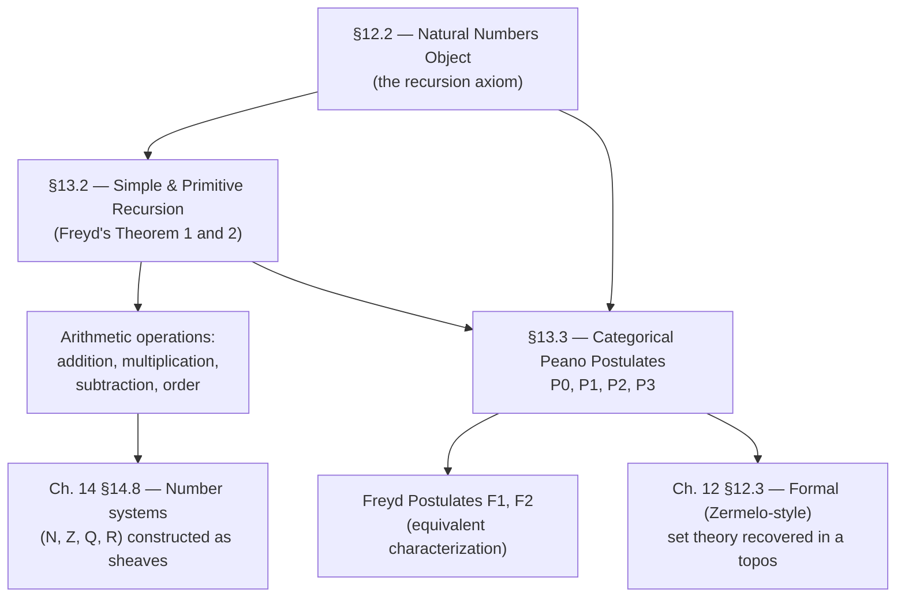

# Arithmetic Inside a Topos

[[book-guidelines|↩ Back to guidelines]]

## Why arithmetic needs its own axiom

Everything Goldblatt has built up to this chapter — finite (co)completeness, [[Adjointness-and-Quantifiers#Exponentiation|exponentiation]], the subobject classifier $\Omega$ — is finitary machinery. It talks about how objects relate to each other *right now*, via a fixed, bounded diagram. None of it, by itself, gives you an infinite process. $\mathbf{Finset}$, the category of finite sets and functions between them, satisfies every topos axiom perfectly well — it is finitely complete, finitely co-complete, cartesian closed, and has a subobject classifier — and yet it has no way to talk about "the natural numbers," because every object in $\mathbf{Finset}$ is, well, finite. You cannot build an infinite counting process out of purely finite limits and colimits; something has to be added.

That something is the **natural numbers object** (NNO), introduced in §12.2 as a diagram $1 \xrightarrow{0} N \xrightarrow{s} N$ satisfying a recursion/induction universal property. Chapter 13 is where Goldblatt cashes that abstract diagram out into actual arithmetic: primitive recursive functions (addition, multiplication, subtraction, order) and a categorical proof that the resulting structure really does satisfy the Peano postulates. The chapter's thesis, stated up front in §13.1, is blunt: *"By imposing natural conditions on a topos (extensionality, sections for epics, natural numbers object), we can make it correspond precisely to a model of classical set theory. Thus, to the extent that set theory provides a foundation for mathematics, so too does topos theory."* Arithmetic is the test case that makes this concrete — it's the first "real" mathematical theory (as opposed to structural bookkeeping) reconstructed purely from arrows and universal properties.

If you've built a compiler with an inductive `Nat` type, this chapter should feel oddly familiar by the end: the natural numbers object is exactly the categorical semantics of an inductive type's constructors, and the recursion theorem proved here is exactly the universal property that licenses a recursor like Lean's `Nat.rec`.

## §13.1 — Topoi as foundations: the arrow-centric worldview

Goldblatt's argument for taking topos theory seriously as a foundation rests on a philosophical point about what a "set" fundamentally *is*. In classical (ZF) set theory, a set is characterized by its potentially rich internal membership structure — a set can contain sets that contain sets, ad infinitum, and reasoning about a set means reasoning about that entire membership tree. Category theory (via Lawvere) offers a different picture: *"an abstract set $X$ has elements each of which has no internal structure whatsoever"* — a set is just an object $X$ together with its **generalized elements** $1 \to X$, points probed from the terminal object, with no further decomposition available or needed. What matters about $X$ is not what its elements "are made of," but how $X$ relates to other objects via arrows — its *universal property* — exactly the same move that replaced "$x \in y$" with "monic $f : a \rightarrowtail d$" back in Chapter 3.

**[[Logical-Geometry#Grounding|Grounding]].** This is precisely the difference between an *algebraic data type with visible constructors* and an *opaque handle*.

```rust
// A ZF-flavored "set": you can pattern-match its internal structure.
enum ZfSet {
    Empty,
    Insert(Box<ZfSet>, Box<ZfSet>), // element, rest — structure is visible
}

// A topos-flavored "abstract set": elements are just opaque generalized
// points 1 -> X. You cannot look inside an element; you can only compose
// arrows into and out of X.
struct Abstract<X>(std::marker::PhantomData<X>);
fn element_of<X>(probe: fn(()) -> X) -> X { probe(()) }
```

In Lean, this is the difference between reasoning by `cases`/`induction` on a term's *constructors* versus reasoning purely through a type's *eliminator* (its universal mapping-out property) without ever inspecting how a term was built. Chapter 13 commits fully to the second style: everything about $N$ will be proved using only the recursion diagram, never "look inside $n$."

Goldblatt also flags something worth keeping in mind throughout: a "natural number," i.e. a generalized element $1 \to N$, need not be anything like an intuitive integer. In a sheaf topos it might be a continuous section of a bundle; in a monoid-action topos it might be an equivariant map. The categorical development is agnostic to what $N$'s elements *are* — it only cares about the recursion property $N$ satisfies. This is the same discipline that later lets a single elaborator/kernel treat `Nat` uniformly regardless of what model it's ultimately interpreted in.

## §13.2 — Primitive recursion via the natural numbers object

### The base case: simple recursion (Freyd's Theorem 1)

Fix a topos $\mathscr{E}$ with an NNO $1 \xrightarrow{0} N \xrightarrow{s} N$. The defining universal property of the NNO (from §12.2) already gives you *simple* recursion: for any object $a$ with a "seed" $x : 1 \to a$ and an "iteration step" $g : a \to a$, there is a unique arrow $h : N \to a$ making

$$h \circ 0 = x, \qquad h \circ s = g \circ h$$

hold. Concretely, $h$ is the unique $\mathscr{E}$-sequence generated by starting at $x$ and repeatedly applying $g$ — Goldblatt calls this $h$ the **iterate of $g$**, since in $\mathbf{Set}$ it produces exactly the sequence $x, g(x), g(g(x)), g(g(g(x))), \ldots$

This already buys you the addition-by-a-fixed-successor idea, but Goldblatt immediately generalizes it, because most arithmetic functions ($m + n$, $m \times n$, $m \dot- n$) depend on *two* inputs — a "parameter" that stays fixed and an index that's being recursed on — not just one.

**Theorem 1 (Freyd).** If $\mathscr{E} \models \mathrm{NNO}$, then for any diagram $a \xrightarrow{h_0} b \xleftarrow{f} b$ there is exactly one $\mathscr{E}$-arrow $h : a \times N \to b$ such that

$$h \circ \langle 1_a, 0_a\rangle = h_0, \qquad h \circ \langle 1_a, s \rangle = f \circ h$$

commute, where $0_a$ is the composite $a \to 1 \xrightarrow{0} N$. In $\mathbf{Set}$ this says: $h(x, 0) = h_0(x)$ and $h(x, n+1) = f(h(x,n))$. Taking $h_0 = \mathrm{id}_N$ and $f = s$ recovers exactly the addition function, and — crucially — the *iterate of the successor arrow* $s$, applied "parametrically," **is** addition: $\oplus : N \times N \to N$ is *defined as* the iterate of $s$.

**Grounding.** This is the categorical version of the fold/accumulator pattern, but note the shape: $h$ *only* gets to see the previous output $h(x,n)$, not $x$ or $n$ themselves, at each step.

```rust
// Freyd's Theorem 1, specialized: h : N -> a, h(0) = seed, h(n+1) = g(h(n))
fn iterate<A: Clone>(seed: A, g: impl Fn(A) -> A, n: u64) -> A {
    (0..n).fold(seed, |acc, _| g(acc))
}

// Addition as "the iterate of successor, applied parametrically":
fn add(m: u64, n: u64) -> u64 {
    iterate(m, |acc| acc + 1, n) // h(m, n) = iterate of s starting at m, n times
}
```

```lean
-- Lean's Nat.rec *is* Freyd's Theorem 1, made executable.
-- Nat.rec : {motive : Nat → Sort u} →
--   motive Nat.zero →
--   ((n : Nat) → motive n → motive n.succ) →
--   (t : Nat) → motive t
def myAdd (m : Nat) : Nat → Nat
  | .zero   => m               -- h ∘ 0 = h₀  (here h₀ = id)
  | .succ n => .succ (myAdd m n) -- h ∘ s = g ∘ h, g = succ
```

The equations `h(x,0) = h₀(x)` and `h(x,n+1) = f(h(x,n))` in Lean are not propositions you have to prove after the fact — they are *definitional equalities*, holding by `rfl`, because the kernel's `Nat.rec` reduction rule (ι-reduction) computes exactly this way. That is the payoff of Freyd's *uniqueness* clause: because $h$ is the *unique* arrow making the diagram commute, any two ways of presenting "the function defined by this recursion" are forced to be equal — which is precisely what licenses treating the recursion equations as computation rules rather than as a theorem to prove.

### The general form: primitive recursion (Freyd's second theorem)

Simple recursion only lets $h(x, n{+}1)$ depend on the *previous output* $h(x,n)$. Real primitive recursive functions — multiplication, most notably — need $h(x, n{+}1)$ to also see $x$ and $n$ directly. Goldblatt builds up to this in two steps.

First, the **Primitive Recursion Theorem (Freyd)**: given $h_0 : a \to b$ and $f : a \times N \times b \to b$, there is a *unique* $h : a \times N \to b$ satisfying

$$h(x, 0) = h_0(x), \qquad h(x, n+1) = f(x, n, h(x,n)).$$

The proof constructs $h$ by first building, via ordinary simple recursion (Theorem 1) applied to the triple $\langle \mathrm{pr}_1, \mathrm{pr}_2, f\rangle : a \times N \times b \to a \times N \times b$, an auxiliary arrow $h'$ that recursively carries the whole triple $(x, n, h(x,n))$ forward, then projects $h'$ onto its $b$-component to get $h$. This is the standard trick of *strengthening the induction hypothesis*: to define a function that needs to see $x$ and $n$ at each step, you recurse on a tuple that carries $x$ and $n$ along for the ride, then throw them away at the end.

**Named special cases.** Goldblatt isolates four instances that cover essentially all of arithmetic:

- **(A) Independence of $n$:** $h_0 : a \to b$, $f : a \times b \to b$ — the step function ignores the recursion index.
- **(B) Independence of $x$:** $h_0 : a \to b$, $f : N \times b \to b$ — the step function ignores the fixed parameter.
- **(C) Dependence only on $n$:** $h_0 : 1 \to b$, $f : N \to b$ — no parameter at all, just a sequence indexed by $N$.
- **(D) Iteration:** exactly Theorem 1, recovered as the special case where $f$ also ignores $n$ and the "accumulator" $x$.

These are not idle bookkeeping — they are literally *which arguments a given primitive recursive definition uses*, and Goldblatt uses each one to define a specific arithmetic operation:

| Operation | Recursion equations | Built via |
|---|---|---|
| **Predecessor** $p : N \to N$ | $p(0) = 0$, $p(n{+}1) = n$ | Case C, from $0$ and $1_N$ |
| **Subtraction** $\dot- : N \times N \to N$ | the iterate of $p$ | $m \dot- n = p(p(\cdots p(m)\cdots))$, $n$ times |
| **Multiplication** $\otimes : N \times N \to N$ | $x \otimes 0 = 0$, $x \otimes s(n) = f(x, x\otimes n)$ | Case A, from $0_N$ and $\oplus$ |
| **Addition** $\oplus : N \times N \to N$ | $m \oplus 0 = m$, $m \oplus s(n) = s(m \oplus n)$ | The iterate of $s$ (Theorem 1) |

A small but instructive proof from this section: $p$ (predecessor) is monic. If $p \circ f = p \circ g$, composing further with $s$ and using $s \circ p = 1_N$ (which holds off zero — more precisely the diagram defining $p$ forces $s \circ p \circ x = x$ whenever $x \neq 0$) collapses to $f = g$ by the same trick used throughout the chapter: *push a suspected equality through enough of the recursion structure that the NNO's uniqueness clause forces it*.

Goldblatt also builds the **order relation** $\leq$ this way, and it's a nice illustration of image factorization from Chapter 5 doing real work: since $m \leq n$ iff $n = m + p$ for some $p$, the pairs $(m, m+p)$ are exactly the outputs of the arrow $\langle \mathrm{pr}_1, \oplus\rangle : N \times N \to N \times N$. Factor that arrow as epic followed by monic (§5.2); the resulting monic *is* $\leq$, viewed as a subobject of $N \times N$. Strict order $<$ is then built from $\leq$ by pulling back along $\langle s \times 1_N\rangle$.

**Grounding — why you need the parameter/index-carrying form, not just fold.** In Rust, `Iterator::fold` only gives you Freyd's Theorem 1 (simple recursion, no visibility into the index). The moment you need the index too — e.g. multiplication needs "$x$" at every step, not just the running product — you need `scan`, or an explicit recursive function with two parameters:

```rust
// Multiplication as primitive recursion (Special Case A: independent of n,
// but h(x, n+1) = f(x, h(x,n)), i.e. it needs x at every step):
fn mul(x: u64, n: u64) -> u64 {
    fn go(x: u64, n: u64) -> u64 {
        match n {
            0 => 0,                    // h(x, 0) = 0
            _ => x + go(x, n - 1),      // h(x, n+1) = f(x, h(x,n)), f = (+)
        }
    }
    go(x, n)
}
```

```lean
-- Lean's actual Nat.mul, structurally identical to Goldblatt's §13.2 definition:
def myMul (x : Nat) : Nat → Nat
  | .zero   => 0
  | .succ n => myMul x n + x   -- x ⊗ s(n) = f(x, x ⊗ n), f = (· + x)

-- Peano-style predecessor, exactly Goldblatt's Case C definition:
def myPred : Nat → Nat
  | .zero   => .zero
  | .succ n => n
```

The general Primitive Recursion Theorem (with the full triple $a \times N \times b \to b$) is what you need when the step function must see the parameter, the index, *and* the accumulator simultaneously — which is exactly the shape of a well-founded recursive definition over an inductive type with an accumulator argument, the pattern every dependently-typed language's termination checker has to recognize as structurally decreasing.

## §13.3 — The Peano postulates and their categorical proof

### The classical postulates, restated arrow-theoretically

In $\mathbf{Set}$, the system $1 \xrightarrow{0} \omega \xrightarrow{s} \omega$ satisfies three classical facts:

- **(A)** $s(x) \neq 0$ for all $x \in \omega$.
- **(B)** $s(x) = s(y)$ only if $x = y$ (injectivity of successor).
- **(C)** If $A \subseteq \omega$ satisfies (i) $0 \in A$ and (ii) $x \in A \implies s(x) \in A$, then $A = \omega$ — the **Principle of Finite Mathematical Induction**.

These three, the **Peano Postulates**, *characterize* $\omega$ in $\mathbf{Set}$: any other system $1 \to \omega' \to \omega'$ satisfying analogues of (A), (B), (C) is uniquely isomorphic to $\omega$ (injectivity of the induced $h$ comes from (A)′/(B)′; surjectivity comes from applying (C)′ to the image of $h$).

Goldblatt's project in §13.3 is to show that an NNO in an arbitrary topos automatically satisfies categorical translations of (A), (B), (C) — and, remarkably, that the converse also holds: a diagram satisfying the categorical Peano postulates *is* an NNO. Arithmetic and the NNO axiom turn out to be interchangeable.

### Translating the postulates into arrow language

Postulate (A), "$s(x) \neq 0$ for all $x$," first gets restated using the classifier-style "does not commute" idiom:

$$\textbf{P0:} \quad \text{for no } x : 1 \to N \text{ does } N \xrightarrow{s} N$$

(followed by comparison to $0$) commute — i.e. no generalized element of $N$ has $s(x) = 0$.

Since inverse images arise by pulling back an inclusion (§3.13), (A) is restated a second, sharper way as a genuine pullback condition:

$$\textbf{P1:} \quad \begin{array}{c} 0 \to 1 \\ \downarrow \qquad \downarrow 0 \\ N \xrightarrow{s} N \end{array} \text{ is a pullback}$$

(reading: the pullback of $s$ along $0$ is the empty object — nothing maps to $0$ via $s$; this is the strongest, "disjointness of $0$ and the image of $s$" reading of (A)).

Postulate (B), injectivity of $s$, becomes exactly:

$$\textbf{P2:} \quad s \text{ is monic}.$$

Postulate (C), induction, is the most interesting translation. The subset $A \subseteq \omega$ becomes a monic $f : a \rightarrowtail N$ (a subobject of $N$). Condition (i), $0 \in A$, becomes "$0$ factors through $f$." Condition (ii), $s(A) \subseteq A$, uses the image construction from §12.6: $s[f] := \mathrm{im}(s \circ f)$, and since both $s$ and $f$ are monic, this reduces to $s \circ f = s[f]$ as a subobject relation $s[f] \sqsubseteq f$ in $\mathrm{Sub}(N)$. Altogether:

$$\textbf{P3:} \quad \text{for any subobject } f : a \rightarrowtail N, \text{ if (i) } 0 \sqsubseteq f \text{ and (ii) } s[f] \sqsubseteq f, \text{ then } f \cong 1_N.$$

This is induction with the "predicate $\varphi(x)$" replaced by "subobject of $N$" — exactly the move you'd expect from a topos where predicates *are* subobjects (via the classifier $\Omega$, §4.2). There are also two variants stated for element-based (rather than subobject-based) induction — **P3A** (induction over generalized elements $x : 1 \to N$) and **P3B** (induction restricted to the *finite ordinals* $\underline{n} : 1 \to N$, defined as $s$ applied $n$ times to $0$) — with P3B $\implies$ P3A $\implies$ P3 in general, the reverse implications needing well-pointedness.

### Theorem 1: every NNO satisfies P0, P2, P3

Goldblatt proves this directly from the recursion universal property. The P0 argument is a good specimen of the style: suppose $s \circ x = 0$ for some $x : 1 \to N$; composing with the just-defined predecessor $p$ gives $x = p \circ s \circ x = p \circ 0 = 0$ (using $p \circ s = 1_N$-ish behavior from its recursive definition). Then define $h : N \to \Omega$ by simple recursion from `true` and the constant arrow to `false`; you get $h \circ 0 = \mathrm{true}$ two different ways, forcing $\mathrm{true} = \lnot \circ \mathrm{false} = h \circ 0 = \mathrm{false}$ — which would make the whole topos **degenerate** (every object isomorphic, $0 \cong 1$). Since a topos is assumed non-degenerate, P0 must hold. P2 was already shown (§13.2, the predecessor argument). P3 is proved by exactly the "push the candidate equality through the recursion structure until the NNO's uniqueness clause bites" technique used repeatedly in §13.2.

### Freyd's postulates F1 and F2 — an independent characterization

Before proving P1, Goldblatt develops two more facts true of $\omega$ in $\mathbf{Set}$, due to Freyd, that turn out to be *equivalent* to the Peano postulates:

$$\textbf{F1:} \quad N \xrightarrow{s} N \rightrightarrows N \xrightarrow{!} 1 \text{ is a co-equalizer diagram}$$

(the "quotient of $N$ collapsing $n$ with $s(n)$" is trivial — there's nothing left after identifying every number with its successor, because that identification collapses *everything* to one point, by induction on $f(n+1) = f(n)$).

$$\textbf{F2:} \quad [0, s] : 1 + N \to N \text{ is an isomorphism}$$

— i.e. $N$ decomposes as the disjoint union of $\{0\}$ and the image of $s$. This is a clean categorical restatement of "$\omega = \{0\} \sqcup \{1, 2, 3, \ldots\}$."

**Theorem 2:** F1 and F2 hold for any NNO (proved directly from the recursion property; F1's uniqueness step relies on $!: N \to 1$ being epic, itself a consequence of $N$ having at least one element, $0$).

**Theorem 3:** Any NNO satisfies P1 (the pullback postulate) — using F2's isomorphism $[0,s] : 1+N \cong N$ together with the co-universal property of coproducts, the P1 diagram is shown to be a pushout with $0$ monic, and a general lemma (pushouts along a monic are also pullbacks, proved via the Partial Arrow Classifier of §11.8) upgrades it to the required pullback.

**Theorem 4 (the converse direction):** P1, P2, P3 together *imply* F1 and F2 for any diagram $1 \to N \to N$ — proved by equalizer arguments dual in spirit to the direct proofs above.

### The equivalence theorem

Putting the pieces together, Goldblatt states the payoff as a **Corollary**: for any diagram $1 \xrightarrow{0} N \xrightarrow{s} N$ in a topos, the following are equivalent:

- **(A)** the diagram is a natural numbers object (the original §12.2 recursion axiom);
- **(B)** the diagram satisfies the Peano Postulates P1, P2, P3;
- **(C)** the diagram satisfies the Freyd Postulates F1, F2.

(A)⟹(B) is Theorems 1 and 3; (B)⟹(C) is Theorem 4; the hard direction, (C)⟹(A), is credited to Freyd and explicitly flagged as *"requir[ing] techniques beyond our present scope"* — Goldblatt cites the result without reproducing the proof. Freyd goes further still, showing the equivalence (in any topos) of NNO-existence with two more conditions: (b) a monic $f : a \rightarrowtail a$ and an element $x : 1 \to a$ with $\{0\} \to 1 \rightrightarrows a$ a pullback (i.e. an "infinite injective orbit" not hitting $x$'s starting point again), and (c) an isomorphism $1 + a \cong a$ — the object $a$ absorbing one more element without changing size, which is precisely why $\mathbf{Finset}$ (where $1+a$ always has *more* elements than $a$) can never have an NNO.

**Grounding — this equivalence theorem is the categorical justification for treating an inductive type by its recursor alone.** In Lean, you never *have* to reason about `Nat` via P0/P1/P2/P3-style pullbacks and pushouts directly — the kernel bakes in the recursor `Nat.rec` and derives everything else (including `Nat.succ_ne_zero`, the direct analogue of P0/A, and `Nat.succ.injEq`, the analogue of P2/B) as *lemmas*, exactly mirroring Goldblatt's Theorem 1 direction (NNO ⟹ Peano postulates):

```lean
-- These are literally P0 and P2, proved (in Lean's stdlib) from the recursor,
-- exactly as Theorem 1 proves them from the NNO axiom.
example (n : Nat) : n.succ ≠ 0 := Nat.succ_ne_zero n         -- P0
example (m n : Nat) (h : m.succ = n.succ) : m = n :=          -- P2 (injectivity)
  Nat.succ.inj h

-- Induction (P3) is the recursor itself, specialized to Prop:
example (motive : Nat → Prop) (h0 : motive 0)
    (hs : ∀ n, motive n → motive n.succ) : ∀ n, motive n :=
  Nat.rec h0 hs
```

The (C)⟹(A) direction — that satisfying Peano's postulates is *sufficient* to reconstruct the full recursor, not just consequence of it — is the deep, harder-than-it-looks fact that a soundness/completeness argument for an inductive-types kernel design has to establish once, and then never worry about again: it says the axiomatization (constructors + injectivity + disjointness + induction) really does pin down the type up to isomorphism, so any two "reasonable" encodings of `Nat` (Church numerals, unary, binary) that satisfy the postulates are provably the same object, and a proof-producing kernel built around one of them is not silently missing cases the others would catch.

## Where this leads



Chapter 13 closes a loop opened in Chapter 12: an NNO was postulated there as one of the "natural conditions" needed to make a topos correspond to a model of classical set theory; this chapter cashes that postulate out as *actual arithmetic*, and then proves — via the Peano/Freyd equivalence — that the postulate was exactly the right one, no stronger and no weaker than what elementary number theory demands. This matters going forward on two fronts. First, §12.3's reconstruction of Zermelo-style set theory inside a topos leans on having an NNO to build the transitive-set hierarchy; arithmetic is a prerequisite ingredient, not a downstream application. Second, Chapter 14 revisits number systems (§14.8, "Number systems as sheaves") in the more general setting of sheaf topoi, where an "element of $N$" can be a genuinely varying, stage-relative object — this chapter's purely formal, diagram-chasing development is what guarantees that whatever a sheaf-topos's version of $N$ turns out to look like concretely, it still obeys the same recursion and induction principles proved here abstractly.

For the compiler/elaborator project, this chapter is close to a direct blueprint: the NNO's recursion universal property *is* the categorical semantics of an inductive type's recursor/eliminator; the uniqueness clause in that universal property is precisely what justifies treating recursor-application equations as definitional (ι-reduction) rather than propositional; and the Peano/Freyd equivalence theorem is the abstract version of the soundness argument a kernel designer needs before trusting that "constructors + injectivity + disjointness + structural induction" is a complete and non-redundant specification of an inductive family — the same argument pattern that generalizes, in a dependent setting, to justifying the recursor for any strictly positive inductive type, not just `Nat`.
