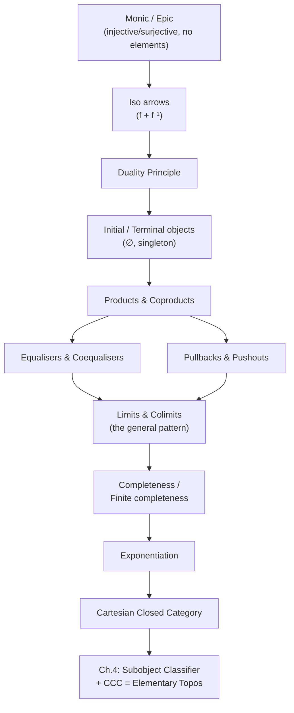

# Arrows Replacing Membership

[[book-guidelines|↩ Back to guidelines]]

## Why this chapter exists

Chapter 2 gave you the axioms of a category — objects, arrows, composition, identities — and showed that this skeleton is enough to talk about `Set`, `Grp`, `Top`, `Vect`, and dozens of other mathematical universes uniformly. But an axiom system that only knows about composition and identities looks, at first glance, too thin to *do* anything. Set theory has a rich toolkit: injections, surjections, bijections, the empty set, singletons, Cartesian products, disjoint unions, quotients by equivalence relations, subsets cut out by inverse images. All of that toolkit is defined by talking about the *elements* of a set — "$x \in A$", "for every $x \in A$ there exists a unique $y \in B$ such that...". Category theory has thrown away $\in$. So Chapter 3's job is to prove that throwing away $\in$ costs you nothing: every one of those constructions has a purely arrow-theoretic translation, stated only in terms of objects, arrows, and composition, that agrees with the set-theoretic original when you specialize to $\mathbf{Set}$, but which *also* makes sense in categories that have no elements at all — $\mathbf{Grp}$, $\mathbf{Top}$, a poset, a one-object monoid.

This matters for two reasons, one philosophical and one deeply practical for anyone building a type checker or verifier:

1. **Philosophically**, it is the chapter's title move: "arrows instead of epsilon" ($\epsilon$ being the traditional symbol for membership). Goldblatt is laying the groundwork for the thesis that *function*, not *membership*, is the more fundamental mathematical primitive — a thesis that culminates two chapters later in the definition of a topos, a category that can support its own internal logic without ever mentioning elements.
2. **Practically**, the pattern that emerges — "characterize a construction by a *universal property*, i.e. as the unique thing through which everything else factors" — is exactly the pattern you already use, perhaps without naming it, whenever you reason about a most-general unifier, a principal type, or an initial/terminal object in a category of proof terms. If you are building an elaborator with metavariable unification, you are constantly asking "is there a unique substitution making this diagram of types commute?" — that is a universal-property question, stated in exactly Goldblatt's vocabulary.

The chapter's throughline: **monic** and **epic** arrows recover injectivity/surjectivity without elements → **initial/terminal objects** recover $\emptyset$ and singletons → **duality** shows every definition secretly comes in pairs → **products, coproducts, equalisers, coequalisers, pullbacks, pushouts** are all instances of one master pattern, the **limit** (or dually, **colimit**) of a diagram → **completeness** packages "has all the limits you need" → **[[Adjointness-and-Quantifiers#Exponentiation|exponentiation]]** adds function-spaces, arriving at the notion of a **Cartesian closed category**, one step short of a topos.

---

## 1. Monic arrows: injectivity without elements

**What breaks without this.** The ordinary definition of injective — "$f(x) = f(y) \implies x = y$" — talks about elements $x, y \in A$. In a category like $\mathbf{Grp}$ or a poset, "elements of an object" isn't even a meaningful phrase in general (a poset object has no internal structure at all; it's just a point). So if category theory wants an "injective" that works everywhere, it cannot mention elements.

**The move.** Goldblatt's derivation is a small piece of technical elegance worth walking through, because it *is* the chapter's method in miniature. Take an injective set function $f : A \to B$ and two "parallel" functions $g, h : C \rightrightarrows A$ (same domain and codomain) with $f \circ g = f \circ h$. For any $x \in C$: $f(g(x)) = f(h(x))$, and since $f$ is injective, $g(x) = h(x)$. Since this holds for every $x$, $g = h$. So: *injective functions are left-cancellable* — $f \circ g = f \circ h \implies g = h$.

Goldblatt then shows the converse also holds in $\mathbf{Set}$: if $f$ is left-cancellable, feed it the two functions $g, h : \{0\} \to A$ picking out $x$ and $y$ respectively (a function out of a one-point set $\{0\}$ is exactly a "generalized element" — this trick of using arrows from $1$ as a stand-in for elements recurs throughout the book, culminating in the "generalized element" machinery of Chapter 5). Left-cancellation forces $g = h$, hence $x = y$. So in $\mathbf{Set}$, *injective = left-cancellable, exactly*.

Left-cancellability, unlike injectivity, is phrased entirely in terms of arrows and composition — so it generalizes:

> **Definition.** An arrow $f : a \to b$ in a category $\mathscr{C}$ is **monic** (written $f : a \rightarrowtail b$) if for every parallel pair $g, h : c \rightrightarrows a$, $f \circ g = f \circ h \implies g = h$.

The name comes from "monomorphism" (injective algebraic homomorphism), the classical case in $\mathbf{Grp}$, $\mathbf{Mon}$. In a preorder, *every* arrow is monic vacuously (there's at most one arrow $c \to a$ to begin with, so $g = h$ is automatic). In the category $\mathbb{N}$ (one object, arrows = natural numbers under $+$), every arrow is monic because addition is left-cancellable on $\mathbb{N}$.

**[[Logical-Geometry#Grounding|Grounding]].** In Rust, "monic" is the categorical shadow of what you'd call an injective map, but stated as a *property of composition*, not of elements — which is exactly the right shape for a trait-based or symbolic setting where you may never enumerate elements:

```rust
// A category as a trait: objects are types, arrows are morphisms you can compose.
// "monic" becomes a *property* you'd prove about a morphism, not something
// you check by iterating over inputs (which you often can't, e.g. if the
// "object" is an infinite type or an opaque term in your IR).
trait Category {
    type Obj;
    type Arrow<A, B>;
    fn compose<A, B, C>(g: Self::Arrow<B, C>, f: Self::Arrow<A, B>) -> Self::Arrow<A, C>;
}

// Left-cancellability as the defining law, stated point-free (no element access):
// forall g h. compose(f, g) == compose(f, h) => g == h
```
This is precisely the discipline your future elaborator needs: a substitution $\sigma$ applied during unification is "monic-like" exactly when it doesn't collapse two distinct metavariable assignments into the same term — you can't always check this by inspecting concrete values (the terms may contain unresolved metavariables), only by reasoning about when two derivations *must* agree.

In Lean, monic is `Function.Injective` when working concretely in `Type`, but category theory's `Mono` typeclass (in Mathlib, `CategoryTheory.Mono`) is defined exactly by left-cancellability, not by elements — this is the direct source-level analogue: `class Mono (f : X ⟶ Y) : Prop where right_cancellation : ∀ {Z} (g h : Z ⟶ X), g ≫ f = h ≫ f → g = h`. Note Mathlib's convention composes in diagrammatic order, but the content is identical to Goldblatt's.

---

## 2. Epic arrows: surjectivity, and duality's first appearance

By reversing every arrow in the definition of monic, Goldblatt obtains **epic**:

> **Definition.** $f : a \to b$ is **epic** (written $f : a \twoheadrightarrow b$), or right-cancellable, if for every parallel pair $g, h : b \rightrightarrows c$, $g \circ f = h \circ f \implies g = h$.

In $\mathbf{Set}$, epic = surjective (an exercise Goldblatt leaves to the reader). A subtlety worth flagging because it will matter for the definition of a topos later: **the converse — "epic $\implies$ surjective" — is category-dependent**. It holds in $\mathbf{Grp}$ but fails in $\mathbf{Mon}$: the inclusion $\mathbb{N} \hookrightarrow \mathbb{Z}$ is a monoid homomorphism (with respect to $+$) that is certainly not onto, yet it is right-cancellable in $\mathbf{Mon}$ (any two monoid homomorphisms out of $\mathbb{Z}$ agreeing on $\mathbb{N}$'s image must agree everywhere, since $\mathbb{N}$ generates $\mathbb{Z}$ under subtraction). This is the first hint that categorical notions can *diverge* from their `Set`-flavored intuitions — a theme the chapter closes on explicitly.

**What breaks without duality being made explicit.** Without formalizing this reversal-of-arrows move, you'd be proving "coproducts have property X" completely independently of "products have property X", doing twice the work for facts that are secretly the same fact viewed backwards.

---

## 3. Iso arrows and the Duality Principle

A bijective set function is invertible; categorically:

> **Definition.** $f : a \to b$ is **iso** if there is $g : b \to a$ with $g \circ f = 1_a$ and $f \circ g = 1_b$.

The inverse, when it exists, is unique (a two-line argument: if $g'$ also works, $g' = 1_a \circ g' = (g \circ f) \circ g' = g \circ (f \circ g') = g \circ 1_b = g$). Every iso is both monic and epic (a short calculation using the inverse). **In $\mathbf{Set}$, the converse holds: monic + epic $\implies$ iso.** Goldblatt flags — and this is a genuinely load-bearing fact for everything that follows in the book — that this converse is *not* true in every category (it fails, e.g., for the natural-number inclusion in $\mathbf{Mon}$ above: monic and epic, but has no inverse as a set function, hence not iso). Whether "monic + epic = iso" holds turns out later (§5.4, and the closing pages of this very chapter) to be one of the properties that singles out $\mathbf{Set}$-like categories, i.e. a hint toward what a topos will need to guarantee.

### Duality, formalized

Goldblatt now states the general principle behind the epic/monic mirroring:

> **Duality Principle.** For any category-theoretic statement $\Sigma$ (built from `dom`, `cod`, and composition), its **dual** $\Sigma^{op}$ is obtained by swapping `dom` $\leftrightarrow$ `cod` and reversing every composite ($h = g \circ f$ becomes $h = f \circ g$). If $\Sigma$ is a theorem provable from the category axioms alone, then $\Sigma^{op}$ is automatically a theorem too — because $\Sigma$, being generic, holds in *every* category, including $\mathscr{C}^{op}$ (the category with the same objects but all arrows reversed), and "$\Sigma$ holds in $\mathscr{C}^{op}$" is literally what "$\Sigma^{op}$ holds in $\mathscr{C}$" means.

This is why the book never separately proves "any two terminal objects are isomorphic" after proving "any two initial objects are isomorphic" — it's the same theorem, reflected. **This halves the chapter's proof burden**, and it is the single biggest reason category-theoretic textbooks read faster than they'd otherwise have to: every construction from here on (product/coproduct, equaliser/coequaliser, pullback/pushout, limit/colimit) is one concept stated twice, once each way, and you only ever need to internalize one half.

**What this buys you as a compiler engineer:** dualization is a *generic code-transformation* you can literally implement. If you build a small internal DSL for categorical diagrams in Rust (say, to reason about your type theory's structural rules), a `dual()` operation that flips arrow direction and swaps composition order gives you coproduct-shaped reasoning for free once you've implemented product-shaped reasoning. This is not just an analogy — Haskell/Rust "co-" constructions (e.g. `Cofree` being dual to `Free`) are literally instances of this principle.

---

## 4. Initial and terminal objects: $\emptyset$ and $\{*\}$ without elements

What characterizes $\emptyset$ purely by its arrows? There is exactly one function $\emptyset \to A$ for *any* set $A$ (the "empty function", vacuously well-defined since there's nothing to map). Dually, there is exactly one function $A \to \{*\}$ for any $A$ (send everything to the one point).

> **Definition.** $0$ is **initial** in $\mathscr{C}$ if for every object $a$ there is exactly one arrow $0 \to a$.
> **Definition.** $1$ is **terminal** in $\mathscr{C}$ if for every object $a$ there is exactly one arrow $a \to 1$.

These are dual to each other by inspection. A short, characteristic proof-style argument (worth internalizing because it's the template for every "unique up to iso" proof in the book): if $0, 0'$ are both initial, the unique arrows $f: 0' \to 0$ and $g : 0 \to 0'$ compose to $f \circ g : 0 \to 0$, which *must* equal $1_0$ (only one arrow $0 \to 0$, by initiality). Symmetrically $g \circ f = 1_{0'}$. So $f$ is iso — **any two initial objects are isomorphic**, and dually for terminal objects.

Notation: $!: 0 \to a$ (read "the unique arrow") — used constantly for exactly-one-arrow situations throughout category theory and, not coincidentally, throughout later chapters when discussing the *unique* map from an initial object encoding "no premises needed."

Concrete instances: in $\mathbf{Grp}/\mathbf{Mon}$, initial and terminal objects coincide (the trivial group/monoid $\{e\}$) — an object both initial and terminal is called a **zero object**, and "$0 \cong 1$" is one of the properties that will later disqualify $\mathbf{Grp}$ from being a topos. In a preorder, initial = minimum element, terminal = maximum element — a poset has *at most one* of each since isomorphism collapses to equality there (a **skeletal** category — one where isomorphic objects are literally equal — is defined right here, and posets are the running example).

**Grounding — Lean.** This maps directly onto `Init`/`Term` in `CategoryTheory.Limits`, but the more immediately useful correspondence for your project: in a dependently-typed kernel, the **empty type** `Empty`/`False` is initial in `Type`/`Prop` (there's a unique — vacuous — function `Empty → A` for any `A`, exactly `Empty.elim`), and the **unit type** `Unit`/`True` is terminal (`fun _ => ()` is the unique map into it, up to `Unit`'s own definitional equality). This is not a loose analogy: `Empty.elim` *is* the categorical `!: 0 → a` arrow, spelled out as Lean code, and the elaborator relies on exactly the "there is only one map, so any two occurrences agree" reasoning when it needs to show two derivations of an `Empty`-typed hypothesis are defeq.

---

## 5. Products and coproducts: the first genuine universal property

This is where the chapter's real machine starts. The Cartesian product $A \times B = \{(x,y) : x \in A, y \in B\}$ has two projections $\mathrm{pr}_A, \mathrm{pr}_B$. Goldblatt's key observation: given *any* set $C$ with maps $f : C \to A$, $g : C \to B$, there is exactly one map $\langle f, g \rangle : C \to A \times B$ (namely $x \mapsto (f(x), g(x))$) making both triangles commute — $\mathrm{pr}_A \circ \langle f,g\rangle = f$ and $\mathrm{pr}_B \circ \langle f,g\rangle = g$. That "exactly one" is doing all the work; it is the pattern.

> **Definition.** A **product** of $a, b$ in $\mathscr{C}$ is an object $a \times b$ with a pair of arrows $(\mathrm{pr}_a, \mathrm{pr}_b)$ such that for any $c$ with arrows $f : c \to a$, $g : c \to b$, there is exactly one $\langle f,g \rangle : c \to a \times b$ making the two triangles commute.

**What breaks without the "exactly one" clause.** If you only required *some* factoring arrow to exist (not a unique one), $a \times b$ wouldn't be pinned down at all — many wildly different objects could satisfy "existence" (e.g. any object admitting a surjection onto both $a$ and $b$ in some loose sense). Uniqueness of the factoring arrow is precisely what forces the product to be unique up to a *unique* isomorphism — Goldblatt proves this explicitly: if $d$ with $(p,q)$ also satisfies the product definition, the induced arrows $\langle p,q\rangle$ and $(\mathrm{pr}_a,\mathrm{pr}_b)$ composed together must be identities (again by the "only one arrow makes this commute" trick), so $d \cong a \times b$.

Products in other categories: in $\mathbf{Grp}$, the direct product with componentwise operation; in a preorder, the product of $p,q$ is their **greatest lower bound** — a poset with all binary g.l.b.'s is a *lower semilattice*, categorically restated as "a skeletal preorder category with all binary products." This is a genuinely nice payoff: lattice theory *is* preorder category theory with (co)products, no separate development needed.

**Coproduct**, by strict duality (reverse every arrow in the product definition):

> **Definition.** A **coproduct** $a + b$ comes with injections $(i_a, i_b)$ such that for any $c$ with $f: a \to c$, $g : b \to c$, there is exactly one $[f,g] : a+b \to c$ with $[f,g]\circ i_a = f$, $[f,g]\circ i_b = g$.

In $\mathbf{Set}$, this is disjoint union (not plain union — you tag elements as $(x,0)$ from $A$ or $(y,1)$ from $B$ to force disjointness even if $A, B$ overlap or are equal). In a preorder it's the **least upper bound**; a poset with all binary l.u.b.'s *and* g.l.b.'s is exactly a **lattice**.

**What breaks without this.** Note carefully: Goldblatt stresses that we speak of "*a* product of $a$ and $b$," never "*the* product" — because the universal property only pins the object down up to isomorphism, not on the nose. If your Rust type-checker's internal representation of a product type used *literal* structural identity rather than "isomorphic representations are interchangeable," you'd be unable to reconcile `(A, B)` produced by two different elaboration paths that are semantically the same pair type but built via different intermediate steps — exactly the discipline definitional equality is meant to handle.

**Grounding — Rust.** The product's universal property is *exactly* what a Rust tuple's constructor + projections give you, but stated abstractly it becomes the shape of `zip`/`unzip` or, more suggestively, the shape of a typestate-pattern's "combine two proofs into one":

```rust
struct Product<A, B> { fst: A, snd: B }

impl<A, B> Product<A, B> {
    // The projections pr_a, pr_b:
    fn pr_a(&self) -> &A { &self.fst }
    fn pr_b(&self) -> &B { &self.snd }

    // The universal arrow <f, g>: for any C with f: C -> A, g: C -> B,
    // there's exactly one map C -> Product<A,B>.
    fn pair<C>(c: C, f: impl Fn(&C) -> A, g: impl Fn(&C) -> B) -> Product<A, B> {
        Product { fst: f(&c), snd: g(&c) }
    }
}
```
The coproduct is Rust's `enum` — `enum Coproduct<A, B> { Left(A), Right(B) }` — and `[f, g]` is exactly a `match` expression, the unique arrow out of an `enum` being forced by requiring you to handle every variant (Rust's exhaustiveness checker is, in effect, enforcing the coproduct's universal property at compile time).

**Grounding — Lean.** `Prod`/`Sum` (or `PProd`/`PSum` for `Prop`-relevant versions) are the direct realizations; `Prod.mk`/`Prod.fst`/`Prod.snd` are $\langle f,g\rangle$/$\mathrm{pr}_a$/$\mathrm{pr}_b$ verbatim. More importantly for your project: this is the *type-theoretic* origin of $\Sigma$-types (dependent sums generalize the coproduct-with-varying-fiber idea) and non-dependent products generalize to $\Pi$-types' domain-side reasoning — Goldblatt's finite-product construction (§3.8, extending to $A_1 \times \cdots \times A_m$, and the $m$-fold power $A^m$ with $m$ projections satisfying one universal property) is the untyped-set-theoretic ancestor of a **telescope** (a dependent context $\Gamma = x_1 : A_1, \ldots, x_m : A_m(x_1,\ldots,x_{m-1})$) — the exact data structure your elaborator's context will be built from, minus the dependency.

---

## 6. Equalisers and coequalisers: carving out "where two arrows agree"

Given parallel $f, g : A \rightrightarrows B$ in $\mathbf{Set}$, let $E = \{x \in A : f(x) = g(x)\}$ with inclusion $i : E \hookrightarrow A$. Goldblatt shows $i$ is *canonical*: any other $h : C \to A$ with $f \circ h = g \circ h$ factors uniquely through $i$ (send $c \mapsto h(c)$, which must land in $E$ because $f(h(c)) = g(h(c))$).

> **Definition.** $i : e \to a$ **equalises** $f, g : a \rightrightarrows b$ if (i) $f\circ i = g\circ i$, and (ii) every $h : c \to a$ with $f\circ h = g\circ h$ factors uniquely through $i$.

**Theorem 1 (proved in the text).** Every equaliser is monic. *Proof sketch:* if $i \circ j = i \circ l$, set $h = i \circ j$; both $j$ and $l$ satisfy the "factors through $i$ as $h$" role, so by uniqueness $j = l$.

**Theorem 2.** An epic equaliser is iso. This is used immediately for a sharp negative example: in the category $\mathbb{N}$ (one object, arrows = naturals under $+$), $1$ is monic (everything is), yet $1$ *cannot* equalise any pair $(m,n)$ — because $\mathbb{N}$'s only iso is $0$, and Theorem 2 would force $1$ to be that iso if it were an epic equaliser, which it is (every arrow is epic there), contradiction. **This is the chapter's first hard proof that "monic" and "equaliser" are genuinely different concepts in general** — they coincide in $\mathbf{Set}$ (Goldblatt shows every injective $f$ is the equaliser of two specially constructed maps into $\{0,1\}$, an indicator/complement-indicator pair — a preview of the subobject-classifier machinery of Chapter 4), but *this coincidence is a special fact about $\mathbf{Set}$-like categories, not a theorem of category theory in general.* Whether "every monic is an equaliser" holds is one of the properties that gets promoted to a theorem-about-topoi in Chapter 5 (§5.1, "Monics equalise").

Coequalisers are the dual — and Goldblatt uses them to give a genuinely satisfying arrow-theoretic reconstruction of **quotienting by an equivalence relation**: the coequaliser $q : b \to e$ of a parallel pair identifies exactly the smallest equivalence relation containing $\{(f(x),g(x)) : x \in a\}$, and the natural quotient map $f_R : B \to B/R$ *is* that coequaliser. This is worth pausing on because it's a genuinely deep fact stated almost in passing: **quotient construction is a colimit**. If you ever implement congruence closure for a term-rewriting or e-graph system, the coequaliser is the exact categorical shape of what your union-find / congruence-closure procedure computes.

---

## 7. Limits and colimits: the pattern, made explicit

Goldblatt now names the pattern common to products and equalisers. A **diagram** $D$ in $\mathscr{C}$ is a selection of objects and arrows among them. A **cone** for $D$ is an object $c$ with an arrow $f_i : c \to d_i$ to every object $d_i$ in $D$, compatible with $D$'s own arrows. A **limit** is a cone through which every other cone factors uniquely.

> **Definition.** A **limit** for diagram $D$ is a $D$-cone $\{f_i : c \to d_i\}$ such that for any other $D$-cone $\{f_i' : c' \to d_i\}$ there is exactly one $f : c' \to c$ with $f_i \circ f = f_i'$ for all $i$.

Three worked examples nail the generality down (each in the text, verified explicitly):
- $D$ = two isolated objects $a, b$, no arrows → a limit is a **product** $a \times b$.
- $D$ = two parallel arrows $f, g : a \rightrightarrows b$ → a limit is an **equaliser** of $f, g$.
- $D$ = the empty diagram (no objects, no arrows) → a limit is a **terminal object**.

Every limit is unique up to isomorphism — same argument pattern as initial/terminal (the mediating arrow between two limiting cones is forced to be iso by the same "compose to the identity by uniqueness" trick, used now for the fourth time in the chapter). By strict duality: a **cocone** and **colimit** are defined by reversing arrows, and coproduct/coequaliser/initial-object all fall out as colimits of the dual three diagrams.

**Why this single definition matters more than any of its instances.** Once "limit" is available as a concept, you no longer need to separately prove uniqueness, functoriality, or preservation results for products, equalisers, and (as §3.13 shows) pullbacks one at a time — you prove them once, for limits in general, and every instance inherits the proof for free. This is the payoff category theory is famous for: a small number of very general theorems (here: "limits are unique up to unique iso," and later, "right adjoints preserve limits") subsume an unbounded number of concrete facts.

**Grounding — the elaborator angle (this is squarely load-bearing for your project).** When Miller-pattern unification solves a metavariable $\alpha$ applied to distinct bound variables $\alpha(x_1,\ldots,x_n) \doteq t$, the solvability condition and the resulting substitution are the *unique arrow into a limit* — you are asking "does a mediating map exist making this diagram of constraints commute, and if so is it unique?" That is not a metaphor; constraint-based type inference is, structurally, limit computation in the category of substitutions/contexts, which is precisely why unification algorithms terminate with *a* solution only when uniqueness (most-general-unifier-ness) can be established — exactly Goldblatt's "factors uniquely" clause.

---

## 8. The pullback: the chapter's centerpiece

Goldblatt calls this "certainly the most important limit concept ... in the study (and definition) of topoi," and the extraction bears that out — it gets by far the most worked examples of any section.

> **Definition.** A **pullback** of $a \xrightarrow{f} c \xleftarrow{g} b$ is a pair $a \xleftarrow{f'} d \xrightarrow{g'} b$ such that (i) $f \circ g' = g \circ f'$, and (ii) whenever $a \xleftarrow{h} e \xrightarrow{j} b$ satisfies $f\circ h = g\circ j$, there is exactly one $k : e \to d$ with $g'\circ k = h$, $f'\circ k = j$.

In $\mathbf{Set}$: $D = \{(x,y) \in A \times B : f(x) = g(y)\}$, a subset of $A \times B$ — hence the alternative name **fibred product**, $A \times_C B$. The eight worked examples (§3.13) are worth internalizing individually because each recurs later in the book:

1. **Fibred product** in $\mathbf{Set}$ — the general pattern above.
2. **Inverse image.** Pulling a subset $C \subseteq B$ back along $f : A \to B$ gives $f^{-1}(C)$ — "the dynamical quality of function is quite forcefully present" here, Goldblatt notes, because $f^{-1}(C)$ is defined by *acting* $f$ backwards, not by inspecting a static set of pairs.
3. **Kernel relation.** Pulling $f$ back along *itself* gives $R_f = \{(x,y) : f(x)=f(y)\}$, the equivalence relation underlying the First Isomorphism Theorem — flagged explicitly as the key to the epi-monic factorisation theorem of Chapter 5.
4. **Algebraic kernels** (in $\mathbf{Mon}$/$\mathbf{Grp}$/$\mathbf{Vect}$) as the pullback of $f$ along the unique arrow from the zero object.
5. In a preorder, a pullback square exists exactly when $s$ is a product (g.l.b.) of $p,q$.
6. In any category with a terminal object, a pullback along the unique maps to $1$ *is* a product.
7. In any category, an equaliser of $f,g$ arises as a pullback of $(f,g) : a \to b\times b$ along the diagonal $\Delta : b \to b\times b$.
8. **The Pullback Lemma (PBL)** — two adjacent commuting squares: if both small squares are pullbacks, so is the outer rectangle; and if the outer rectangle and the right square are pullbacks, so is the left square. Goldblatt flags this as "a key fact... used repeatedly in what follows" — a pattern you should expect to see re-derived for slice categories and geometric morphisms much later in the book (Ch. 15–16).
9. $f$ is monic iff the square with two copies of $1_a$ and $f$ (pulling $f$ back along itself) is a pullback with $d \cong a$ — pullbacks characterize monics purely diagram-theoretically, no elements needed.

**Grounding — this is the single most load-bearing construction in the whole chapter for your project.** A pullback square in $\mathbf{Set}$ is precisely the shape of a *substitution instance in context*: given a context $\Gamma \vdash T \; \mathrm{type}$ and a substitution $\sigma : \Delta \to \Gamma$, the substituted type $T[\sigma]$ over $\Delta$ is a pullback of $T$'s "fibration" along $\sigma$. This is not decorative — it is *literally* how dependent type theory is modeled categorically (locally cartesian closed categories, comprehension categories), and it's why Goldblatt promises ("the use of the word 'fibred' is explained in Chapter 4") that pullbacks reappear as the formal backbone of subobjects and the classifying-arrow construction that defines a topos. When your elaborator computes the type of an applied function `f x` by substituting `x` for the bound variable in `f`'s codomain, it is computing a pullback.

**Grounding — Rust.** Pullbacks show up whenever two independently-computed constraints must be reconciled against a shared target — e.g., unifying two inferred types against a common expected type is exactly a pullback-shaped diagram: `Inferred1 → Expected ← Inferred2`, and the pulled-back object is the most general common refinement (when it exists).

---

## 9. Pushouts

Strict dual of the pullback: a pushout of $b \xleftarrow{f} a \xrightarrow{g} c$ is a colimit for that diagram. In $\mathbf{Set}$, form the disjoint union $b + c$ then identify $f(x)$ with $g(x)$ for each $x \in a$ — i.e., a pushout is built from a coproduct plus a coequaliser, exactly dual to "pullback from product plus equaliser" (Goldblatt sets this up as an explicit exercise pairing with §3.15's Theorem). Pushouts are the categorical shape of "gluing two things along a shared piece" — the standard example outside this book is gluing topological spaces along a common subspace, but for a compiler the relevant instance is **module/namespace merging along a shared interface**, or merging two extended contexts that share a common prefix.

---

## 10. Completeness and finite completeness

> **Definition.** $\mathscr{C}$ is **complete** if every diagram in $\mathscr{C}$ has a limit; **co-complete** dually; **bi-complete** if both. $\mathscr{C}$ is **finitely (co-)complete** if this holds for diagrams with finitely many objects and arrows.

**Theorem (stated, proof deferred to the cited literature).** If $\mathscr{C}$ has a terminal object and a pullback for every cospan (pair of arrows with common codomain), then $\mathscr{C}$ is finitely complete. Goldblatt sketches *why*: (A) given terminal $1$ and pullbacks, $a \times b$ is recovered as the pullback of $a \to 1 \leftarrow b$ (Example 6 above, run backwards); (B) given pullbacks and products, an equaliser of $f,g : a \rightrightarrows b$ is recovered by pulling back the two product-induced arrows $\langle 1_a, f\rangle, \langle 1_a, g\rangle : a \to a\times b$ against each other. **This is the theorem that makes "finite completeness" a checkable, finite condition** rather than an unbounded "check every possible finite diagram" — you only ever need to verify: (1) a terminal object exists, and (2) every cospan has a pullback. Everything else (products, equalisers, and every finite limit built from them) follows for free. This economy is exactly why the topos axioms in Chapter 4 will state "finitely complete" as a single primitive requirement rather than enumerating products-and-equalisers-and-pullbacks separately — they're all equivalent once you have terminal objects and pullbacks.

---

## 11. Exponentiation and Cartesian closed categories

The last piece: function-*spaces*, i.e. making $B^A$ (the set of all functions $A \to B$) itself into an object, with an **evaluation arrow** $\mathrm{ev} : B^A \times A \to B$ sending $(f, x) \mapsto f(x)$.

The universal property: for any $g : C \times A \to B$, there is a unique $\bar{g} : C \to B^A$ ("curry $g$") making

$$\mathrm{ev} \circ (\bar{g} \times 1_A) = g$$

commute — $\bar g$ is defined pointwise by $\bar g(c) = g_c$ where $g_c(a) := g(c,a)$; Goldblatt verifies this establishes a genuine **bijection** between $\mathrm{Hom}(C\times A, B)$ and $\mathrm{Hom}(C, B^A)$, injective because $\mathrm{ev}\circ(\bar g\times 1_a) = \mathrm{ev}\circ(\bar h\times 1_a) \implies \bar g = \bar h$ by the uniqueness clause, surjective by taking $g := \mathrm{ev}\circ(h\times 1_a)$ for any given $h$. Two arrows related this way are called **exponential adjoints** — the word "adjoint" here is not decoration; Goldblatt explicitly flags that this bijection is the seed of the general adjoint-functor machinery developed in Chapter 15 (this *is* currying/uncurrying viewed as a natural bijection of hom-sets — precisely an adjunction $-\times a \dashv (-)^a$).

> **Definition.** $\mathscr{C}$ **has exponentiation** if it has all binary products and, for every $a,b$, an object $b^a$ and $\mathrm{ev} : b^a\times a\to b$ satisfying the universal property above. A finitely complete category with exponentiation is **Cartesian closed** (CCC).

**What breaks without this.** A category can have all products and still fail to be Cartesian closed — the internal "arrow object" $b^a$ doesn't automatically exist just because individual arrows $a\to b$ do; you need the *whole collection of them, packaged as a single object with an internal apply operation*. This is exactly the difference between "a compiler that can typecheck function application" and "a compiler whose type system treats function types as first-class values" — the latter requires exponentiation, categorically.

**Theorem 1** (with proof, one of only two fully-proved theorems in this chapter besides the equaliser ones) is a small but sharp cautionary result: in a CCC with initial object $0$,
(A) $0 \cong 0\times a$ for any $a$;
(B) if there's any arrow $a \to 0$ at all, then $a \cong 0$;
(C) if $0 \cong 1$, the whole category **degenerates** (all objects isomorphic to each other);
(D) any arrow with domain $0$ is monic;
(E, exercise) $c^0 \cong 1$, $a^0 \cong 1$, $1^a \cong 1$.

Goldblatt uses (C) to explain, in the chapter's closing paragraph, *why* $\mathbf{Grp}$ and $\mathbf{Mon}$ (which have $0 \cong 1$, the trivial group) cannot be Cartesian closed — degeneracy would follow, and they manifestly aren't degenerate. Meanwhile the finite ordinal poset $\underline{n} = \{0,\ldots,n-1\}$ is Cartesian closed (being a chain with a terminal object — worked out explicitly via the two-case exponential $q^p$) yet has monic epics that are *not* iso — showing Cartesian-closedness alone doesn't force $\mathbf{Set}$-like behavior either. **This closing tension is the chapter's real cliffhanger**: neither "monic-epic-implies-iso" nor "Cartesian closed" alone captures what makes $\mathbf{Set}$ special; you need one more ingredient (the subobject classifier), whose "nature will be revealed in the next chapter" — Goldblatt's own words, ending the chapter exactly at the threshold of the topos definition.

**Grounding — Rust.** Exponentiation is what makes `Fn`/`FnMut`/`FnOnce` closures first-class: `b^a` is `impl Fn(A) -> B` (or a boxed trait object), and `ev` is literally function call syntax `f(x)`. Currying is the standard Rust pattern of returning a closure:
```rust
// g : C × A -> B  becomes  ĝ : C -> (A -> B)
fn curry<C, A, B>(g: impl Fn(C, A) -> B + Copy) -> impl Fn(C) -> Box<dyn Fn(A) -> B> {
    move |c| Box::new(move |a| g(c, a)) // requires C: Clone in practice
}
```
This is exactly the exponential adjoint construction, spelled out operationally.

**Grounding — Lean.** `b^a` in a CCC is precisely a Lean function type `a → b`; `Function.curry`/`Function.uncurry` in Mathlib witness the bijection $\mathrm{Hom}(c\times a, b) \cong \mathrm{Hom}(c, a\to b)$ on the nose. But the version that matters most for your project is the **dependent** generalization: once you move from a plain exponential $b^a$ to a $\Pi$-type $\Pi x{:}a.\, B(x)$ (where the codomain can depend on the specific element of $a$), you have moved from "Cartesian closed category" to "locally Cartesian closed category" — precisely the semantic setting for dependent type theories, and precisely why Chapter 15's adjoint-functor treatment of quantifiers ($\exists_f \dashv f^* \dashv \forall_f$) is the mechanism your future elaborator needs for handling dependent function/pair types uniformly with $\exists$/$\forall$.

---

## Where this leads



Every construction in this chapter reappears, unmodified, as machinery inside the definition of a topos in Chapter 4: finite (co)completeness and exponentiation are two of the topos axioms verbatim; the pullback becomes the tool used to *define* what a subobject classifier even means (a monic $f: a\rightarrowtail d$ is classified by a pullback square against $\mathrm{true}: 1\to\Omega$); the "monic-epic-iso" tension flagged in §3.3 and again in the closing paragraph gets resolved once and for all as a theorem *about* topoi in Chapter 5 ("Monics equalise," "Images of arrows"). If you found the pullback section (§3.13) the most demanding, that was deliberate on Goldblatt's part — it is the construction the rest of the book leans on hardest.

For the compiler/elaborator project specifically: **the pullback is the piece to keep closest at hand.** Substitution-in-context, the semantics of dependent application, and later (Ch. 15) the adjoint characterization of $\exists$/$\forall$ as left/right adjoints to pullback-along-a-projection are all the same construction wearing different clothes. Miller-pattern unification's "does a unique mediating substitution exist" question is limit-computation in exactly Goldblatt's sense — internalizing "universal property = existence + uniqueness of a factoring arrow" here pays off directly when you get to writing the unifier.
