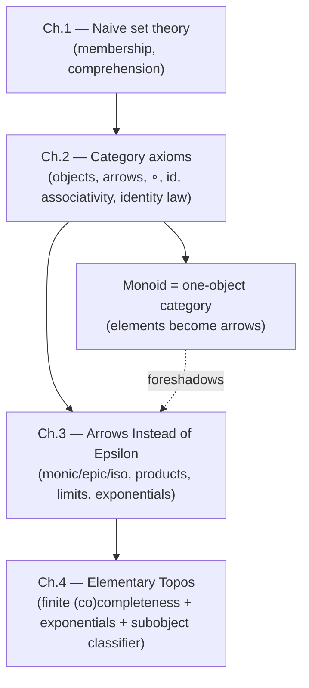

[[book-guidelines|↩ Back to guidelines]]

# Category Theory Fundamentals

## Why bother re-defining "function" at all?

Goldblatt opens with a deliberately annoying question: you already know what a function is — a set of ordered pairs $f \subseteq A \times B$ such that for every $x \in A$ there is exactly one $y \in B$ with $(x,y) \in f$. It's precise, it's foundational, it works. So why is an entire chapter about to tell you it's the wrong picture?

Here's what breaks without a better picture. Set theory forces every function to *be* something static — a fixed, already-existing collection of pairs sitting in the universe of sets. But the way you actually *use* functions is dynamical: you "apply" a function to an argument, it "acts" on a domain, you "compose" transformations, forces "act" on objects. Goldblatt is explicit about this mismatch (§2.1): "This dynamical quality... is an essential part of the meaning of the word 'function'... The 'ordered-pairs' definition does not convey this." The graph of $f$ — the set $\{(x, f(x))\}$ — is a *record* of the function's behavior, not the behavior itself, in the same way a table of input/output pairs for a Rust closure is a trace of what it does, not the closure.

There's also a sharper technical problem, and it's the one that actually motivates the categorical move: **a set of ordered pairs does not determine a codomain.** If $f = \{(x,y) : y = 6x\}$, you can recover the domain (all first coordinates) and the image/range (all second coordinates), but the codomain is arbitrary — any set containing the image will do. This sounds pedantic until you hit the identity function: the identity on a set $A$, $\mathrm{id}_A = \{(x,x) : x \in A\}$, is *set-theoretically identical* to the inclusion function $A \hookrightarrow B$ whenever $A \subseteq B$, even though conceptually these are different acts (one does nothing, the other embeds $A$ into something bigger). Goldblatt's fix — redefine a function as a triple $(A, B, R)$ with $R \subseteq A \times B$ the graph — patches this, but it's still fundamentally a *static object*, and that's the deeper complaint.

**What category theory does instead:** stop trying to say what a function *is* internally, and instead characterize it entirely by how it *behaves* under composition with other arrows. This is the same move a type-checker makes when it stops caring about a term's runtime representation and cares only about its typing judgments and how those compose — you characterize things by their interface, not their internals.

## Composition and the associative law

Given $f: A \to B$ and $g: B \to C$ — the target of one matching the source of the other — you get a new function $g \circ f : A \to C$ by "do $f$, then $g$": $(g \circ f)(x) = g(f(x))$.

The load-bearing fact Goldblatt proves by direct calculation (§2.2) is that composition of three functions doesn't care how you parenthesize it:

$$h \circ (g \circ f) = (h \circ g) \circ f$$

This is the **Associative Law for Functional Composition**. It's proved, not assumed — both sides compute to the same function $x \mapsto h(g(f(x)))$, so they have the same domain, codomain, and pointwise behavior, hence are the same function. Once you have it, you're licensed to drop the parentheses entirely and write $h \circ g \circ f$.

This law has a picture: a **commutative diagram**. Nodes are objects (sets, here), edges are arrows (functions). A triangle with edges $f: A \to B$, $g: B \to C$, $h: A \to C$ *commutes* when $h = g \circ f$ — i.e., both paths around the triangle, from $A$ to $C$, agree. A diagram is commutative when every sub-path between any two shared endpoints composes to the same arrow. This is the visual vocabulary category theory runs on for the rest of the book — a proof by "chase the diagram" is a proof by "every path here computes the same thing."

**What breaks without associativity:** without it, a pipeline of transformations wouldn't have a well-defined meaning independent of how you grouped the stages — the equivalent of a compiler pass pipeline where `(opt1 >> opt2) >> opt3` and `opt1 >> (opt2 >> opt3)` produced observably different programs. Every reasoning technique in category theory that says "just follow the arrows" silently depends on this law holding.

```rust
// The associative law is why `.map().map().map()` chains (Iterator, Option, Result)
// never need you to think about how they associate — composition of Fn(A) -> B
// closures is associative by construction, the same proof Goldblatt gives pointwise.
fn compose<A, B, C>(f: impl Fn(A) -> B, g: impl Fn(B) -> C) -> impl Fn(A) -> C {
    move |x| g(f(x))
}
```

## The identity law

Every set $A$ has an identity function $\mathrm{id}_A(x) = x$. Composing with it on either side is a no-op:

$$\mathrm{id}_B \circ f = f, \qquad g \circ \mathrm{id}_B = g$$

for $f: A \to B$ and $g: B \to C$. This is the **Identity Law for Functional Composition** — again proved by direct pointwise calculation, and again expressible as a commuting diagram (a triangle where one edge is an identity arrow).

Associativity plus identities are exactly the two properties Goldblatt singles out as common to a long list of concrete mathematical settings — $\mathbf{Set}$ (sets and functions), $\mathbf{Top}$ (topological spaces and continuous maps), $\mathbf{Vect}$ (vector spaces and linear maps), $\mathbf{Grp}$ (groups and homomorphisms), $\mathbf{Mon}$ (monoids and monoid homomorphisms), $\mathbf{Pos}$ (posets and monotone functions), and others. In every case: composites of structure-preserving maps are structure-preserving, composition is associative, and identity maps exist and are structure-preserving. That's the whole pattern — and abstracting it *is* category theory's founding move.

## The axiomatic definition of a category

Here's the definition (§2.3), stated precisely because the precision is the point — nothing in it mentions what the objects or arrows "really are":

> A category $\mathscr{C}$ comprises:
> - **(A)** a collection of $\mathscr{C}$-objects;
> - **(B)** a collection of $\mathscr{C}$-arrows;
> - **(C)** operations assigning to each arrow $f$ a domain $\mathrm{dom}\,f$ and a codomain $\mathrm{cod}\,f$, both $\mathscr{C}$-objects — written $f : a \to b$ when $a = \mathrm{dom}\,f$, $b = \mathrm{cod}\,f$;
> - **(D)** an operation assigning to each pair $(g, f)$ of arrows with $\mathrm{dom}\,g = \mathrm{cod}\,f$ a composite arrow $g \circ f : \mathrm{dom}\,f \to \mathrm{cod}\,g$, satisfying the **Associative Law**: $h \circ (g \circ f) = (h \circ g) \circ f$ whenever the composites are defined;
> - **(E)** an assignment to each object $b$ of an arrow $1_b : b \to b$, the **identity arrow** on $b$, satisfying the **Identity Law**: for any $f : a \to b$ and $g : b \to c$, $1_b \circ f = f$ and $g \circ 1_b = g$.

Notice what's absent: no mention of elements, membership, or what an "object" is made of. A category is a **pure interface** — objects are opaque nodes, arrows are opaque edges with only two properties (they compose associatively, and identities exist). This is the categorical analogue of programming to a `trait` instead of a concrete type: you specify the operations and the laws they must satisfy, and anything satisfying them is a legitimate instance, no matter how alien its internals look. In Rust terms, a category is essentially the specification a type would need to satisfy to implement something like:

```rust
trait Category {
    type Obj;
    type Arrow;
    fn dom(f: &Self::Arrow) -> Self::Obj;
    fn cod(f: &Self::Arrow) -> Self::Obj;
    fn id(a: &Self::Obj) -> Self::Arrow;
    // composable iff cod(f) == dom(g)
    fn compose(g: &Self::Arrow, f: &Self::Arrow) -> Self::Arrow;
    // laws (not checkable by the type system, but must hold):
    //   compose(h, compose(g, f)) == compose(compose(h, g), f)
    //   compose(id(&cod(f)), f) == f  and  compose(g, id(&dom(g))) == g
}
```
This is not idle analogy-hunting: it is close to literally how category theory gets used as a *design discipline* for typed languages — laws that a `Functor`/`Monad`/`Applicative` instance must obey (associativity, identity) are category axioms in disguise, unchecked by the compiler but assumed by every piece of code that composes them.

```python
# Python sketch: a category is just "a set of objects + a partial composition
# operation obeying two laws" — nothing more is assumed about what an object is.
class Category:
    def dom(self, f): ...
    def cod(self, f): ...
    def id(self, a): ...
    def compose(self, g, f):
        assert self.dom(g) == self.cod(f)
        ...
```

```lean
-- Lean's own Mathlib `CategoryTheory.Category` class is essentially a direct
-- transcription of Goldblatt's five clauses, with the laws as proof obligations:
class CategoryStruct (Obj : Type u) where
  Hom : Obj → Obj → Type v
  id  : (a : Obj) → Hom a a
  comp : Hom a b → Hom b c → Hom a c

class Category (Obj : Type u) extends CategoryStruct Obj where
  id_comp : ∀ {a b} (f : Hom a b), comp (id a) f = f
  comp_id : ∀ {a b} (f : Hom a b), comp f (id b) = f
  assoc   : ∀ {a b c d} (f : Hom a b) (g : Hom b c) (h : Hom c d),
              comp (comp f g) h = comp f (comp g h)
```
This is exactly the point where the book's formalism and a real proof assistant's kernel coincide: `id_comp`/`comp_id`/`assoc` above are definitional-equality-level obligations, the same status as `rfl` for the simplest instances (e.g. category $\mathbf{1}$ below, where composing the one arrow with itself is trivially reflexive).

## The pathology of abstraction

Goldblatt pauses (§2.4) to name the general mathematical move he's just performed: **abstraction** — noticing that several concrete situations share formal features, then isolating exactly those features as an axiomatic definition, discarding everything else. This is the same process that produced "group," "vector space," "topological space." Its mirror image is **specialisation**: given the abstract axioms, hunting for new models that satisfy them.

A useful measuring stick for how much an abstraction "costs" is the existence of **representation theorems** — results saying every model of some axioms is (isomorphic to) one of a specific concrete family. Cayley's Theorem is the classic example: every group is (isomorphic to) a group of permutations of some set. Every Boolean algebra is essentially an algebra of subsets of some set. The stronger the abstraction (the more structure you demand), the fewer, more constrained the models — the extreme case is a *complete ordered field*, which has exactly one model: the real numbers.

The category axioms are a genuinely **weak** abstraction — they demand almost nothing (associativity, identities), which is exactly why there's no representation theorem pinning categories down to look like $\mathbf{Set}$, $\mathbf{Top}$, $\mathbf{Vect}$, etc. Goldblatt's phrase is that we kept only "the bare bones... and so little of the flesh" that the axioms admit wildly pathological cases where objects aren't sets, arrows look nothing like functions, and $\circ$ has nothing to do with functional composition at all. That weakness is a feature, not a bug: it's precisely what lets category theory apply to settings that have no elements or points to speak of — which is exactly the situation you're in inside an arbitrary topos, and the reason this chapter's minimalism pays off later in the book.

## Basic examples worth internalizing

Goldblatt walks through a graded sequence of examples (§2.5) that force you to see the axioms as genuinely load-bearing rather than decorative.

**Example 1 — the category $\mathbf{1}$.** One object $a$, one arrow $f$. Since $f$ is the only arrow, it *must* be $1_a$, and the only composable pair is $(f, f)$, forced to give $f \circ f = f$. Every law holds trivially. The striking observation: it doesn't matter what $a$ and $f$ "are" — a set and its identity function, a number, a banana, the Eiffel Tower — the *category* they generate is structurally identical every time. This is the cleanest illustration of the interface-not-implementation point above: the category is entirely determined by its arrow-composition pattern, never by the identity of its inhabitants.

**Examples 2–3** — two objects/three arrows, three objects/six arrows, each with a unique forced composition, because between any two objects there's at most one arrow.

**Example 4 — preorders.** A category where between any two objects $p, q$ there is *at most one* arrow $p \to q$ is called a **pre-order**. This single structural property forces a binary relation $R$ on the objects (put $pRq$ iff an arrow $p \to q$ exists) that is automatically reflexive (identity arrows) and transitive (composition). Conversely, any reflexive-transitive relation on a set $P$ generates a pre-order category: objects are elements of $P$, and there's an arrow $p \to q$ exactly when $pRq$. Add antisymmetry ($pRq \wedge qRp \Rightarrow p = q$) and you get a **partial ordering**, denoted $\sqsubseteq$; a **poset** is a pair $(P, \sqsubseteq)$. The categories $\mathbf{1}, \mathbf{2}, \mathbf{3}, \ldots, \mathbf{n}, \omega$ correspond to the usual numeric orderings on $\{0\}, \{0,1\}, \{0,1,2\}, \ldots$, and the natural numbers under $\le$.

**Example 5 — discrete categories.** First a genuinely useful lemma: the identity arrow on an object is *uniquely determined* by the Identity Law itself (any arrow $1'$ satisfying the same defining property equals $1_b$). A category is **discrete** if identity arrows are the *only* arrows — which makes it a degenerate pre-order, and really nothing more than a bare collection of objects with no relation between them at all.

**Example 6 — $\mathbf{N}$, and Example 7 — monoids as one-object categories.** This is the example that should reorganize your intuitions the most. Take **one** object, call it $N$, and let the arrows $N \to N$ be *all the natural numbers* $0, 1, 2, 3, \ldots$ — an infinite hom-set on a single object. Define composition as addition: $m \circ n = m + n$. Associativity of composition is just associativity of $+$; the identity arrow $1_N$ is the number $0$, since $0 + m = m = m + 0$.

The general pattern: any **monoid** $M = (M, *, e)$ — a set with an associative binary operation and a two-sided identity — generates a one-object category where the arrows *are* the elements of $M$, composition *is* $*$, and $1_a = e$. Conversely, any one-object category's collection of arrows, under $\circ$, with $1_a$ as identity, *is* a monoid. This is not an analogy — it's a literal equivalence: **a monoid is exactly a category with one object.** The elements of the monoid stop looking like "things" and start looking like "transformations of the unique object" — arrows, not values. That reframing (elements-as-morphisms) is the single largest perceptual shift this chapter is training you to make, and it's the seed of everything the book will do later with arrows standing in for set-theoretic membership.

```rust
// Any monoid (associative op + identity) is *literally* a one-object category.
// Rust's std::ops + Default (when Default gives the identity) capture this shape:
trait Monoid {
    fn combine(&self, other: &Self) -> Self;
    fn identity() -> Self;
}
// e.g. (u64, +, 0), (String, concat, ""), (bool, &&, true) are all instances —
// each one *is* the arrow-set of a one-object category with that op as `compose`.
```

```lean
-- Mathlib's `Monoid` class, and the fact that `Monoid M` gives a
-- `SingleObj M : Category` (Mathlib literally has this construction,
-- `CategoryTheory.SingleObj`), is the formal mirror of Example 7.
class Monoid (M : Type) extends Semigroup M, One M where
  one_mul : ∀ a : M, 1 * a = a
  mul_one : ∀ a : M, a * 1 = a
```

## Synthesis: where this fits, and why it matters for a checker/elaborator

Structurally, this chapter is the foundation stone for the entire book:



Everything from Chapter 3 onward — monic/epic arrows replacing injective/surjective functions, products and limits replacing set-theoretic constructions, the subobject classifier replacing "$\in$" — is only possible because Chapter 2 established that *arrows and their composition* are a sufficient vocabulary to do mathematics in, without any reference to elements. The one-object-category-as-monoid equivalence is the first concrete proof that "elements" can be re-encoded as "arrows," which is precisely the trick topos theory needs to reconstruct membership itself as an arrow-theoretic notion (§4's subobject classifier) later in the book.

For the elaborator/checker project this vault is oriented around: the axiomatic-definition mindset here — specify behavior and laws, stay silent on internal representation — is the same discipline that makes typing judgments and definitional equality tractable to formalize (a judgment form doesn't care what a term "is," only how it composes with substitution and reduction). And the monoid-as-one-object-category equivalence is worth keeping in your pocket for later: it is the base case of the "categories model something with laws" pattern that recurs whenever a book represents proof obligations, substitutions, or contexts as arrows composing associatively with identities — watch for it every time a later chapter says "and this obeys the category axioms," because that phrase is doing real semantic work, not decoration.
