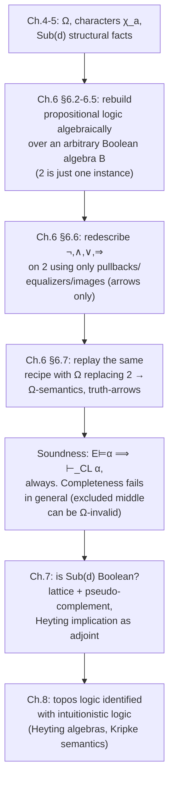

[[book-guidelines|↩ Back to guidelines]]

# Classical Logic Reconstructed Categorically

## 0. Why the book stops to re-derive logic you already know

Chapter 4 built the subobject classifier $\Omega$ and showed every subobject $a \rightarrowtail d$ corresponds to a unique **character** $\chi_a : d \to \Omega$. Chapter 5 showed $\mathrm{Sub}(d)$ behaves well structurally (every monic is an equaliser, every arrow factors epi-then-monic). What hasn't been shown yet is whether $\mathrm{Sub}(d)$, ordered and combined with intersection/union/complement, is a **Boolean algebra** — the algebra you'd expect if a topos's internal logic were just classical logic wearing a costume.

The answer, teased at the very start of the chapter, is: *not always*. And the strategy for finding out is deliberately roundabout. Goldblatt doesn't attack $\mathrm{Sub}(d)$ directly yet (that's Chapter 7). Instead he goes back to $\mathbf{Set}$ and re-derives, with excruciating explicitness, *why* $(\mathscr{P}(D), \cap, \cup, -)$ is a Boolean algebra in the first place — tracing it all the way down to the fact that $\mathrm{and}$, $\mathrm{or}$, $\mathrm{not}$ are **functions on the two-element set $2 = \{0,1\}$**. Once that dependency is exposed, the whole apparatus — propositional calculus, Boolean algebras, truth-functions as arrows — becomes a *template*. Chapter 6's punchline, planted right at the end (§6.6–6.7), is that you can rerun the entire template with $\Omega$ standing in for $2$, and get a genuine propositional calculus for *any* topos. Whether that calculus turns out classical or not is exactly the question the rest of the book answers.

This is the chapter's real payload: **logic, in the categorical account, is not a fixed background theory you interpret objects into — it's something a category generates internally, and $\mathbf{Set}$'s classical logic is just the case where the internal truth-value object happens to be $2$.**

---

## 1. Propositions and truth-values, made painfully precise (§6.2)

**What breaks without this.** "A sentence is either true or false" sounds too obvious to formalize. But the moment you want a *function* that computes the truth-value of a compound sentence from its parts, you need truth values to be actual mathematical objects you can feed into a function — not a philosophical stance about meaning. Goldblatt's move: identify the two truth-values with the elements of the set $2 = \{0, 1\}$ (true $= 1$, false $= 0$), and identify each connective with a **function on $2$**.

- **Negation** is a function $\lnot: 2 \to 2$ with $\lnot 1 = 0$, $\lnot 0 = 1$.
- **Conjunction** is $\land: 2 \times 2 \to 2$ with $\land(1,1)=1$ and $0$ otherwise.
- **Disjunction** is $\lor: 2 \times 2 \to 2$, $0$ only at $(0,0)$.
- **Implication** is $\Rightarrow: 2 \times 2 \to 2$, false only at $(1,0)$ — the classical "material conditional" reading: $\alpha \Rightarrow \beta$ can only fail by inferring something false from something true.

These are exactly the truth-tables you already know, but the reframing matters: **a connective is a function**, full stop, not a syntactic rule with a semantic side-note. This is what makes §6.6's later "connectives as arrows" move almost automatic — once you already think of $\land$ as a *function* $2 \times 2 \to 2$, asking "what's the topos-arrow version of that function" is a much shorter step than asking "what's the topos-arrow version of the *word* 'and'."

**Formal language, PL.** Goldblatt then builds an actual formal language: an infinite alphabet of sentence letters $\pi_0, \pi_1, \pi_2, \ldots$ (the atomic propositions — the leaves of a syntax tree, in compiler terms), the connective symbols $\lnot, \land, \lor, \Rightarrow$, and brackets. Formation rules generate the well-formed sentences $\Phi$ from the atoms $\Phi_0$ inductively — precisely a context-free grammar, or in Rust terms, an `enum` with recursive variants:

```rust
enum Sentence {
    Atom(u32),                                // π_i
    Not(Box<Sentence>),                       // ¬α
    And(Box<Sentence>, Box<Sentence>),        // α ∧ β
    Or(Box<Sentence>, Box<Sentence>),         // α ∨ β
    Implies(Box<Sentence>, Box<Sentence>),    // α ⇒ β
}
```

A **value assignment** $V: \Phi_0 \to \{0,1\}$ picks a truth-value for each atom; this then lifts *uniquely*, by structural recursion over the formation rules, to $V: \Phi \to \{0,1\}$:
$$
V(\lnot\alpha) = \lnot V(\alpha), \quad V(\alpha \land \beta) = V(\alpha) \land V(\beta), \quad \text{etc.}
$$
This is exactly a **denotational evaluator** — the same shape as `eval : Expr -> Value` in any interpreter, except the base semantic domain here is $\{0,1\}$ instead of, say, `i64`. In Rust:

```rust
fn eval(s: &Sentence, v: &impl Fn(u32) -> bool) -> bool {
    match s {
        Sentence::Atom(i) => v(*i),
        Sentence::Not(a) => !eval(a, v),
        Sentence::And(a, b) => eval(a, v) && eval(b, v),
        Sentence::Or(a, b) => eval(a, v) || eval(b, v),
        Sentence::Implies(a, b) => !eval(a, v) || eval(b, v),
    }
}
```

A sentence is a **tautology** ($\models \alpha$) if $V(\alpha) = 1$ for *every* $V$ — semantically, it's an assertion true purely by its logical shape, independent of any facts about the world.

---

## 2. Axiomatics: CL as a proof-search system (§6.3, "Axiomatics")

Semantic validity ("true under every assignment") is one way to characterize the tautologies. Goldblatt gives a second, syntactic characterization: an axiom system **CL** (Classical Logic) consisting of twelve axiom schemas (I–XII, closed under substitution of arbitrary sentences for $\alpha, \beta, \gamma$) and a single inference rule:

> **Modus ponens** (Rule of Detachment): from $\alpha$ and $\alpha \Rightarrow \beta$, derive $\beta$.

A **proof sequence** is a finite list of sentences, each either an axiom or obtained from earlier entries by detachment; a **theorem** ($\vdash_{CL} \alpha$) is the last sentence of some proof sequence. This is, precisely, a **proof search / trusted-kernel architecture**: a small, fixed, checkable rule set (here just one rule) generating an unbounded space of derivable facts. Two theorems then relate the syntactic notion (derivability) to the semantic one (validity):

- **Soundness**: $\vdash_{CL} \alpha \implies \models \alpha$. Proved mechanically — check the twelve axiom schemas are tautologies (a finite truth-table check), then check detachment preserves tautologyhood. "A computer could do it," Goldblatt notes — this is a decidable, syntax-directed proof, exactly the kind of thing a **trusted kernel** should be: small, mechanical, and independently checkable.
- **Completeness**: $\models \alpha \implies \vdash_{CL} \alpha$. This direction is *not* mechanical (first proved by Emil Post, 1921) — it requires constructing, for any non-theorem, a countermodel, which is a genuinely creative step, not a syntax check.

**Load-bearing connection (per the standing learning goals):** this Soundness/Completeness pairing is the propositional-logic ancestor of the soundness/completeness story your elaborator's type checker will need at a much larger scale — a **trusted kernel** (small, mechanically checkable rule set: here, twelve schemas plus modus ponens; in a dependent type theory, the typing/conversion rules) versus an **elaborator** or **proof search procedure** that may use arbitrarily clever heuristics to *find* a derivation, as long as everything it produces re-checks against the kernel. The asymmetry — soundness is cheap and mechanical, completeness is hard and creative — recurs identically when you get to unification and proof search for dependent types: checking a candidate unifier/proof is easy, *finding* one is where all the engineering difficulty lives.

---

## 3. Boolean algebra, defined properly (§6.4)

Goldblatt now gives the actual algebraic definition, building it in layers so each piece is independently meaningful:

1. A **lattice** $P = (P, \sqsubseteq)$ is a poset where every pair $x, y$ has a greatest lower bound $x \sqcap y$ (the **meet**) and least upper bound $x \sqcup y$ (the **join**). Categorically (recalling Chapter 3): meets are products, joins are coproducts, when $P$ is viewed as a category.
2. A lattice is **bounded** if it has a minimum $0$ (categorically: initial object) and maximum $1$ (terminal object).
3. A lattice is **distributive** if $x \sqcap (y \sqcup z) = (x \sqcap y) \sqcup (x \sqcap z)$ (and the dual law, which follows from it in any lattice).
4. In a bounded lattice, $y$ is a **complement** of $x$ if $x \sqcup y = 1$ and $x \sqcap y = 0$. A bounded lattice is **complemented** if every element has one. In a *distributive* bounded lattice, complements — when they exist — are automatically **unique** (Exercise 1, §6.4), which is why the notation $x'$ for "the complement of $x$" is well-defined at all.

$$
\textbf{Boolean algebra (BA)} := \text{complemented distributive lattice}.
$$

Goldblatt runs the same four running examples through all four definitional layers to show the pattern's reach: $(\mathscr{P}(D), \subseteq)$ (Example 1/6, complement = set complement, **always** works), $2 = \{0,1\}$ under the natural order (Example 2/7, complement = negation), the open sets of a topological space $(\mathcal{O}, \subseteq)$ (Example 3/8, complement fails *unless* every open set happens to be closed — a genuinely non-Boolean lattice, a first hint of what's coming), and left ideals of a monoid $L_M$ (Example 4/9, complement generally fails). **This is the chapter quietly telegraphing its own ending**: the topology example already shows a natural, everyday lattice that is a lattice but *not* Boolean — exactly the phenomenon $\mathrm{Sub}(d)$ will exhibit for sheaf/Kripke topoi in Chapter 7.

**Rust [[Logical-Geometry#Grounding|grounding]].** The lattice-with-complement structure is exactly what you'd encode as a `trait`, and the "complement may not exist" phenomenon is exactly why Rust's `Option` (or, categorically, why you'd want a `PseudoComplement` trait distinct from `Complement`) matters:

```rust
trait Lattice {
    fn meet(&self, other: &Self) -> Self;
    fn join(&self, other: &Self) -> Self;
    fn bottom() -> Self;
    fn top() -> Self;
}

trait Complemented: Lattice {
    fn complement(&self) -> Self;   // total: every element has one
}
// vs. a topology's open-set lattice, where you can only offer:
trait PseudoComplemented: Lattice {
    fn pseudo_complement(&self) -> Self;   // exists always, but x ⊔ x' ≠ 1 in general
}
```
That distinction — total complement vs. merely-a-pseudo-complement — is precisely the fork in the road between classical and intuitionistic (Heyting) logic that Chapter 7 formalizes.

---

## 4. Algebraic semantics: replaying §6.2's evaluator over an arbitrary BA (§6.5)

Once "Boolean algebra" is defined abstractly, Goldblatt observes that *any* BA $B = (B, \sqsubseteq)$ carries operations $\sqcap$ (meet), $\sqcup$ (join), and $'$ (complement) that behave exactly like $\land, \lor, \lnot$ on $2$. Implication is *defined*, not primitive, by
$$
x \Rightarrow y := x' \sqcup y,
$$
mirroring the classical logical equivalence $\alpha \Rightarrow \beta \equiv \lnot\alpha \lor \beta$ (Exercise 1, §6.5).

A **$B$-valuation** is a function $V: \Phi_0 \to B$, extended to all of $\Phi$ by the same structural-recursion rules as before, just landing in $B$ instead of $2$:
$$
V(\lnot\alpha) = V(\alpha)', \quad V(\alpha \land \beta) = V(\alpha) \sqcap V(\beta), \quad \ldots
$$
$\alpha$ is **$B$-valid** ($B \models \alpha$) if $V(\alpha) = 1$ for every $B$-valuation $V$. This is a genuine generalization: a 2-valuation is exactly a classical value assignment, and $2 \models \alpha \iff \alpha$ is a tautology. Goldblatt then proves the *soundness* half generalizes for free ($\vdash_{CL}\alpha \implies B \models \alpha$, same axiom-check proof as before) and — via the **Lindenbaum algebra** construction (Exercise 2) — that all four of "tautology," "$B$-valid for *some* $B$," and "$BA$-valid (valid in *every* BA)" turn out **equivalent**. The Lindenbaum algebra $\mathcal{B}_{CL} = (\Phi/\!\sim_{CL}, \sqsubseteq)$ quotients sentences by *provable* mutual implication and is itself proved to be a BA — this is the standard "syntax quotiented by its own theory is a semantic structure" move, structurally identical to how a term model or a Lindenbaum–Tarski algebra is built for any logic, including the ones underlying SMT and proof assistants' internal representations of propositions-up-to-provable-equivalence.

**Why this section is the hinge of the whole chapter:** it establishes that "interpret formulas into $2$" was never special — you can interpret them into *any* Boolean algebra and the machinery (soundness, the extension-by-recursion construction) survives unchanged. That's precisely the abstraction §6.7 needs: swap $2$ for $\Omega$, and everything up through soundness still typechecks, mechanically.

---

## 5. Truth-functions as arrows: the crucial re-description (§6.6)

This is where the chapter earns its keep. Every truth-function has codomain $2$, so — by the defining property of the subobject classifier from Chapter 4 — **each truth-function is the characteristic function of some subset of its domain.** Concretely:

- $\lnot: 2 \to 2$ is $\chi_{\{0\}}$ (the characteristic function of $\{0\} \subseteq 2$), and $\{0\} \hookrightarrow 2$ is exactly the arrow Goldblatt earlier called $\texttt{false}: 1 \to 2$. So $\lnot$ is defined by a **pullback**:
$$
\begin{array}{ccc}
\{0\} & \hookrightarrow & 2 \\
\downarrow & & \downarrow{\scriptstyle\lnot} \\
1 & \xrightarrow{\texttt{true}} & 2
\end{array}
$$
- $\land: 2 \times 2 \to 2$ is $\chi_{\{(1,1)\}}$, and $\{(1,1)\}$, as a one-element set, is identified with the arrow $(\texttt{true}, \texttt{true}): 1 \to 2 \times 2$. So $\land$ is defined by the pullback of $2 \times 2$ along $\texttt{true}: 1 \to 2$, pulled back through $(\texttt{true},\texttt{true})$.
- $\Rightarrow: 2 \times 2 \to 2$ is $\chi_{\le}$ where $\le\ = \{(0,0),(0,1),(1,1)\}$ is literally the natural order relation on $2$; using $x \sqsubseteq y \iff x \sqcap y = x$ in any lattice, $\Rightarrow$ turns out to be an **equalizer** of $\sqcap$ against the first projection $\mathrm{pr}_1$.
- $\lor$ is the trickiest: $D = \{(1,1),(1,0),(0,1)\}$ is built as the **image** of a coproduct map $2 + 2 \to 2 \times 2$ — a genuine epi-monic factorization, reusing Chapter 5's machinery.

**Every single connective is redescribed using only: pullbacks, products, coproducts, equalizers, and image factorization** — all universal-property constructions that exist in *any* topos, not just $\mathbf{Set}$. This is the entire point: none of these descriptions mention "the elements of $2$" anymore, only arrows and diagrams.

**Definition — Truth-arrows in a topos $\mathscr{E}$** (with classifier $\top: 1 \to \Omega$):

| Connective | Categorical definition |
|---|---|
| $\lnot: \Omega \to \Omega$ | the character of $\bot := \text{char}(!: 0 \to 1)$, i.e. the unique arrow making $\begin{smallmatrix}1 \to \Omega \\ \downarrow \quad \downarrow \lnot \\ 1 \to \Omega\end{smallmatrix}$ (via $\bot$) a pullback |
| $\land: \Omega \times \Omega \to \Omega$ | the character of the product arrow $(\top,\top): 1 \to \Omega \times \Omega$ |
| $\lor: \Omega \times \Omega \to \Omega$ | the character of the image of $[(\top_{\Omega},1_\Omega), (1_\Omega,\top_\Omega)]: \Omega + \Omega \to \Omega \times \Omega$ |
| $\Rightarrow: \Omega \times \Omega \to \Omega$ | the character of $e: {\le} \rightarrowtail \Omega \times \Omega$, the equalizer of $\land$ against $\mathrm{pr}_1$ |

This is a genuinely uniform, arrows-only recipe. Once you have *a* topos — any topos, with *its* $\Omega$ — this recipe manufactures a full propositional-connective structure on $\Omega$ automatically. Nothing about the recipe assumed $\Omega = 2$.

**Worked examples the book gives** (grounding the abstraction immediately, as the style guide asks):
- In $\mathbf{Set}$ and $\mathbf{FinSet}$: the truth-arrows *are* the ordinary truth-functions.
- In $\mathbf{Bn}(I)$ (bundles over $I$, i.e. sheaves on a discrete space), where $\Omega = (2 \times I, \mathrm{pr}_2)$: truth-arrows act **stalkwise** — literally a copy of the classical truth-functions running independently at each index $i \in I$. This is the first glimpse of a **fibered / indexed** semantics: $\Omega$ isn't one Boolean algebra, it's a *bundle of* Boolean algebras.
- In $M\text{-}\mathbf{Set}$ (monoid actions), where $\Omega = (L_M, \subseteq)$ is the lattice of left ideals of $M$: negation is $\lnot(B) = \{m : \forall n\; nm \in M \implies nm \notin B\}$ — no longer literal set-complement, but a genuinely different, ideal-theoretic operation. The book works out the concrete finite example $M_2$ (the two-element monoid) with full truth tables for $\lnot, \land, \lor, \Rightarrow$ on the three-element lattice $\{2, \{0\}, \emptyset\}$ — and these tables are **not** the classical ones.

**Connection to the standing project (metavariables / unification):** notice the structural shape here — $\lnot$, $\land$, $\Rightarrow$ are each defined as *the unique arrow making some diagram a limit* (pullback or equalizer). That's exactly the shape of definitional problems your elaborator will keep solving: "find the unique arrow/term satisfying this universal property" is precisely what a metavariable-solving step is, when the universal property is phrased as a system of definitional-equality constraints instead of a categorical diagram. The pullback square defining $\lnot$ is, at bottom, a system of two equations to be solved simultaneously — the categorical ancestor of constraint solving.

---

## 6. $\Omega$-semantics: doing propositional logic inside an arbitrary topos (§6.7)

Now everything from §6.2–§6.5 replays verbatim with $2 \to \Omega$. A **truth value** in topos $\mathscr{E}$ is an arrow $1 \to \Omega$; write $\mathscr{E}(1,\Omega)$ for the collection of these. An **$\mathscr{E}$-valuation** is a function $V: \Phi_0 \to \mathscr{E}(1,\Omega)$, extended over all sentences using the truth-arrows of §6.6:
$$
V(\lnot\alpha) = \lnot \circ V(\alpha), \qquad V(\alpha \land \beta) = \land \circ (V(\alpha), V(\beta)), \qquad \text{etc.}
$$
$\alpha$ is **$\mathscr{E}$-valid** ($\mathscr{E} \models \alpha$) if $V(\alpha) = \top: 1 \to \Omega$ for every $\mathscr{E}$-valuation. Immediately: $\mathbf{Set} \models \alpha \iff \mathbf{FinSet} \models \alpha \iff \alpha$ is a classical tautology (Exercise 1), and more subtly, $\mathbf{Bn}(I) \models \alpha \iff (\mathscr{P}(I), \subseteq) \models \alpha$ as a BA — which reduces right back down to classical validity, because $\mathscr{P}(I)$ is always Boolean regardless of $I$ (Exercise 2).

**The central theorem of the chapter (Theorem 2):**
$$
\mathscr{E} \models \alpha \implies\ \vdash_{CL} \alpha \quad \text{for every topos } \mathscr{E}.
$$
That is: **CL is sound for $\Omega$-validity in every topos, no matter how exotic.** The proof leans on a lemma about how the arrows $\top$ and $\bot$ propagate through the truth-arrows exactly as $1$ and $0$ do in $\mathbf{Set}$ — deferred formally to Chapter 7, but stated here as Theorem 1 (a set of "how $\top,\bot$ combine under $\lnot,\land,\lor,\Rightarrow$" tables that exactly mirror $2$'s tables).

**But the converse fails.** CL is *not* sound the other way — there exist topoi (the running example is $\mathbf{Set}^{\to}$, arrows-of-sets, foreshadowed for Chapter 10) where the **law of excluded middle**, $\alpha \lor \lnot\alpha$, is *not* $\Omega$-valid. This is the chapter's real destination: **$\Omega$-validity in an arbitrary topos is generally weaker than classical tautologyhood** — every classical tautology's *proof strategy* still produces something $\Omega$-valid (soundness holds), but not every classically-true schema survives the trip, because not every topos's $\Omega$ behaves like $2$.

A partial converse (**Theorem 3**) recovers equivalence when the topos is **bivalent** — when $\Omega$ has *exactly* two global elements $\top, \bot: 1 \to \Omega$ (no third or fourth truth value). But Goldblatt immediately undercuts the "bivalence is the whole story" reading with two counterexamples: $M_2\text{-}\mathbf{Set}$ is bivalent yet *not* classical in other respects (its $1+1$ isn't isomorphic to $\Omega$), while $\mathbf{Set}^2$ is *not* bivalent yet *is* fully classical (CL axiomatizes its valid sentences exactly). The chapter ends on this open question deliberately — it's the cliffhanger that motivates Chapter 7's deeper structural analysis of $\mathrm{Sub}(d)$ as a lattice, and eventually Chapter 8's identification of topos logic with **intuitionistic**, not classical, logic.

---

## Where this leads



This chapter is a **methodological rehearsal**, not just a review: it exists to establish that "propositional logic over a set of truth-values" is itself a *generic construction* — parametrized by which Boolean algebra (or, eventually, which non-Boolean $\Omega$-algebra) you plug in. Chapter 7 takes the question this chapter leaves open — *when exactly is $\mathrm{Sub}(d)$ Boolean?* — and answers it precisely, by showing $\mathrm{Sub}(d)$ is *always* a lattice with pseudo-complement and Heyting implication (defined as a right adjoint to $\sqcap$), Boolean only under an extra hypothesis. That right-adjoint characterization of $\Rightarrow$ is worth flagging now: it's the same "define the operation as a universal/adjoint solution to a constraint" move you saw in §6.6's pullback definitions, and it's the categorical seed of what Chapter 8 will identify, unmistakably, as **intuitionistic implication** — the logic that a proof-relevant, constraint-solving type checker (the kind this reading program is aimed at building) actually runs on, since a Curry–Howard-flavored elaborator generally wants *constructive* proofs, not classical excluded-middle appeals.
