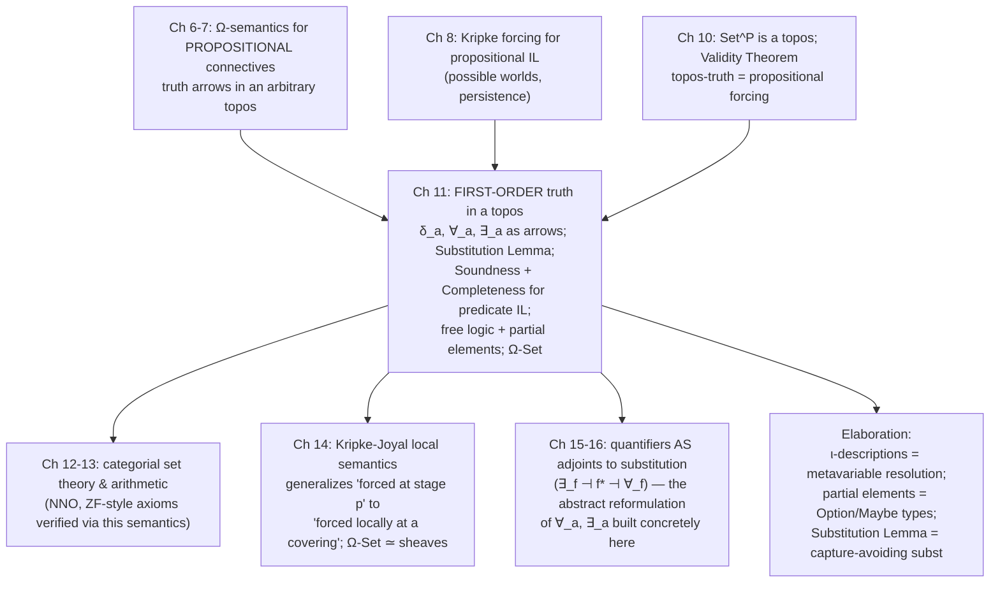

[[book-guidelines|↩ Back to guidelines]]

## Why propositional forcing isn't enough

Chapter 10 proved something remarkable: the internal logic of the presheaf topos $\mathbf{Set}^P$ *is* Kripke's forcing semantics, on the nose — $\mathbf{Set}^P \models \alpha \iff P \Vdash \alpha$ for every propositional sentence $\alpha$. But look at the sentences that theorem is actually *about*: atomic letters $\pi_1, \pi_2, \dots$ glued together by $\land, \lor, \Rightarrow, \lnot$. Nothing in that machinery lets you say "every element of $A$ is related to $c$" or "there is some $x$ to which $c$ is related." Those require quantifiers ranging over a domain, relation and function symbols naming structure on that domain, and — trickiest of all in a topos where "domain" is itself a variable, structured object — a coherent notion of what it even means for a *term* to denote, and for a *formula with free variables* to be satisfied.

Goldblatt opens this chapter with exactly this gap. Take a structure $(A, R)$ — a set $A$ with a binary relation $R \subseteq A \times A$ — and a constant $c \in A$. Consider "if every $x$ is related by $R$ to $c$, then something is related by $R$ to $c$." Schematize the antecedent as $\alpha$ ("$\forall x, xRc$") and consequent as $\beta$ ("$\exists x, cRx$"). Propositional logic can package this as $\alpha \Rightarrow \beta$, but it has no way to explain *why* it's true — $\alpha$ and $\beta$ are opaque atoms to it, exactly like the propositional letters $\pi_i$. Explaining that argument requires reasoning about the internal quantificational structure of $\alpha$ and $\beta$: if everything is $R$-related to $c$, then in particular $c$ is, so something is. That's a first-order argument, and it needs a first-order semantics.

This chapter is Goldblatt's word for word statement of his own agenda: build the *whole* model-theoretic apparatus that Alfred Tarski built for classical logic — terms, formulas, satisfaction, valuations, soundness, completeness — and redo every piece of it with $\mathbf{Set}$ replaced by an arbitrary topos and $2 = \{0,1\}$ replaced by $\Omega$. The reward, arriving in stages across the chapter's ten sections, is: (1) a rigorous $\Omega$-valued semantics for first-order formulas inside any topos, stated purely in arrow language; (2) a Soundness Theorem showing intuitionistic predicate logic is valid in every topos; (3) a recovery of Kripke's original first-order semantics as the special case $\mathscr{E} = \mathbf{Set}^P$; (4) a Completeness Theorem — the topos-valid formulas are *exactly* the intuitionistically provable ones; and (5) two extensions — free logic (for topos objects that can be "empty" without literally being $\emptyset$) and Heyting-valued sets (a full $\Omega$-graded notion of set with degrees of equality and existence) that turn out to be needed to make the whole picture honest once you leave $\mathbf{Set}$.

## §11.1–11.2 — First-order languages, and what a model actually is

### The alphabet

Goldblatt's **basic alphabet for elementary (first-order) languages** is fixed once and for all:

- an infinite list of individual variables $v_1, v_2, v_3, \dots$;
- propositional connectives $\land, \lor, \lnot, \Rightarrow$;
- quantifier symbols $\forall, \exists$;
- an identity symbol $\approx$;
- brackets.

A **first-order language** $\mathscr{L}$ is then, by definition, nothing more than a *choice of extra vocabulary* on top of this fixed core: a set of relation symbols, function symbols, and individual constants. For Boolean algebras you'd pick $\mathscr{L} = \{0, 1, f, g, h\}$ (constants for zero/unit, a unary function symbol for complement, binary symbols for meet and join). For categories, $\mathscr{L} = \{\mathrm{com}, C, D\}$ (a composition relation, codomain and domain function symbols) — Goldblatt shows in §11.1 that the *entire axiomatic theory of a category*, associativity included, is expressible as a handful of first-order sentences in this vocabulary, which is a nice sanity check that "first-order" really does mean "adequate to ordinary mathematical discourse," not some impoverished toy fragment.

Throughout the technical development the book fixes one small working language,

$$
\mathscr{L} = \{R, c\},
$$

a single two-place relation symbol and a single individual constant — just enough structure to illustrate everything without drowning in bookkeeping.

**Terms** are the variables together with the constant $c$. **Atomic formulas** are $t \approx u$ and $tRu$ for terms $t, u$. **Formulas** are built up by the usual inductive closure under the connectives and $(\forall v)\varphi$, $(\exists v)\varphi$. An occurrence of a variable is *bound* if it lies in the scope of a quantifier binding it, *free* otherwise; a **sentence** is a formula with no free occurrences; a formula with at least one free occurrence is **open**. Goldblatt writes $\varphi(v)$ to flag that $v$ occurs free in $\varphi$, extending to $\varphi(v_{i_1}, \dots, v_{i_k})$ for several free variables — notation used relentlessly for the rest of the book.

### Tarski satisfaction, done carefully

A **model** for $\mathscr{L}$ is a structure $\mathfrak{A} = (A, R, c)$: a nonempty set $A$, a relation $R \subseteq A \times A$, and a distinguished $c \in A$. To evaluate an *open* formula you first need to say what its free variables denote. An **$\mathfrak{A}$-valuation** is a function $x$ assigning to each positive integer $i$ an element $x_i \in A$ — think of it as an infinite sequence $x = (x_1, x_2, \dots)$, the $i$-th slot giving the interpretation of $v_i$. Write $x(i/a)$ for the valuation obtained by overwriting slot $i$ with $a$.

Tarski's satisfaction relation $\mathfrak{A} \models \varphi[x]$ ("valuation $x$ satisfies $\varphi$ in $\mathfrak{A}$") is then defined by structural recursion. On atomic formulas it just reads off $R$ and the valuation; on connectives it's classical truth-table logic lifted to sequences; on quantifiers:

$$
\mathfrak{A} \models (\forall v_i)\varphi[x] \iff \text{for every } a \in A,\ \mathfrak{A} \models \varphi[x(i/a)],
$$
$$
\mathfrak{A} \models (\exists v_i)\varphi[x] \iff \text{for some } a \in A,\ \mathfrak{A} \models \varphi[x(i/a)].
$$

Satisfaction of $\varphi$ only ever depends on the values $x$ assigns to $\varphi$'s *free* variables (Exercise 11.2.1) — which licenses talking about "$\varphi$ satisfied by the tuple $x_1, \dots, x_n$" rather than by a whole infinite sequence, and lets a *sentence* be unambiguously **true in** $\mathfrak{A}$ ($\mathfrak{A} \models \varphi$) or **false in** $\mathfrak{A}$, since a sentence is satisfied by either every valuation or none.

This is the classical picture the rest of the chapter has to generalize, arrow by arrow. Before doing that, though, Goldblatt needs one more classical landmark to generalize *against*: an axiomatic proof system.

## §11.3 — Axiomatics: what a proof of a first-order sentence looks like

The classical Hilbert-style system for $\mathscr{L}$ has three groups of axioms and a couple of rules. Writing $\varphi(v/t)$ for "the result of replacing every free occurrence of $v$ in $\varphi$ by the term $t$" (legal only when $v$ is **free for** $t$ in $\varphi$ — informally, substituting $t$ mustn't accidentally capture a variable of $t$ inside a quantifier of $\varphi$):

- **Propositional axioms**: every instance of the classical schemata I–XII from §6.3.
- **Quantifier axioms**: $(\forall v)\varphi \Rightarrow \varphi(v/t)$ — "universal instantiation," UI — and $\varphi(v/t) \Rightarrow (\exists v)\varphi$ — "existential generalisation," EG.
- **Identity axioms**: $t \approx t$ (I1), and $(t \approx u) \land \varphi(v/t) \Rightarrow \varphi(v/u)$ (I2).

The rules are Detachment (modus ponens: from $\varphi$ and $\varphi \Rightarrow \psi$ infer $\psi$), and two quantifier rules with side conditions guarding against illegitimate generalization over a variable that's already constrained elsewhere: from $\varphi \Rightarrow \psi$ infer $\varphi \Rightarrow (\forall v)\psi$ provided $v$ isn't free in $\varphi$; and dually for $\exists$.

Write $\vdash_{\mathrm{CL}} \varphi$ for classical derivability. **Gödel's Completeness Theorem** — first proved by Gödel for exactly this system — says $\vdash_{\mathrm{CL}} \varphi \iff \mathfrak{A} \models \varphi$ for every model $\mathfrak{A}$. That's the target the rest of the chapter is aimed at reproducing, with $\vdash_{\mathrm{CL}}$ replaced by intuitionistic derivability $\vdash_{\mathrm{IL}}$ (the same system, minus schema XII — the excluded-middle schema) and "every classical model" replaced by "every model in every topos."

## §11.4 — Models in a topos: from subsets to characteristic arrows

This is where the chapter's real work begins, and it's worth pausing on *why* the translation is nontrivial. In $\mathbf{Set}$, a formula $\varphi(v_1, \dots, v_m)$ (with $m$ **appropriate** to $\varphi$ — meaning every free *and* bound variable of $\varphi$ occurs among $v_1,\dots,v_m$) determines a subset

$$
\varphi^m = \{(x_1, \dots, x_m) \in A^m : \mathfrak{A} \models \varphi[x_1,\dots,x_m]\} \subseteq A^m.
$$

The propositional connectives correspond exactly to the Boolean set operations: $(\lnot\varphi)^m = A^m - \varphi^m$, $(\varphi \land \psi)^m = \varphi^m \cap \psi^m$, and so on. You might guess a topos-theoretic semantics could just interpret $\varphi$ as a *subobject* of $a^m$ and reuse the Heyting-algebra structure of $\mathrm{Sub}(a^m)$ from Chapter 7 — and this route has been carried out (by Robitaille-Giguère, following Reyes and Joyal's Montreal school). Goldblatt instead takes the **characteristic-arrow** route, replacing $\varphi^m$ by its classifying map

$$
\llbracket \varphi \rrbracket^m : A^m \to 2, \qquad \llbracket \varphi \rrbracket^m(\vec x) = \begin{cases} 1 & \text{if } \mathfrak{A} \models \varphi[\vec x] \\ 0 & \text{otherwise.}\end{cases}
$$

This is the natural continuation of the $\Omega$-semantics for propositional connectives from §6.7, and — crucially — it makes quantifiers *accessible from first principles*, because $\forall$ and $\exists$ turn out to be exponential-adjoint constructions, exactly the kind of thing arrow language is good at.

### Building $\forall$ and $\exists$ out of arrows, in $\mathbf{Set}$ first

Suppose $\llbracket \varphi \rrbracket^3 : A^3 \to 2$ is already defined (say $\varphi$ has free/bound variables among $v_1,v_2,v_3$) and we want $\llbracket (\forall v_2)\varphi \rrbracket^3$. Fix a triple $(x_1,x_2,x_3)$ and look at

$$
B_2 = \{x \in A : \llbracket\varphi\rrbracket^3(x_1, x, x_3) = 1\}.
$$

By the satisfaction clause for $\forall$, $\mathfrak{A} \models (\forall v_2)\varphi[x_1,x_2,x_3] \iff B_2 = A$. So the map $(x_1,x_2,x_3) \mapsto B_2$ is a function $A^3 \to \mathscr{P}(A) \cong 2^A$, which — by exponential adjunction (§3.16) — is the same data as a function $A^4 \to 2$, namely $\llbracket\varphi\rrbracket^3$ itself, precomposed with a coordinate-shuffling map $T : A^4 \to A^3$ that drops the third coordinate into the second slot. Define

$$
\forall_A : \mathscr{P}(A) \to 2, \qquad \forall_A(B) = \begin{cases}1 & B = A \\ 0 & B \neq A.\end{cases}
$$

Lawvere's own description of $\forall_A$ (cited by Goldblatt) is the cleanest: it is **"the characteristic map of the name of $\mathrm{true}_A$"** — i.e. $\forall_A$ classifies the single point $\{A\} \subset \mathscr{P}(A)$, the point picked out by $\ulcorner\mathrm{true}_A\urcorner : 1 \to 2^A$. Dually,

$$
\exists_A : \mathscr{P}(A) \to 2, \qquad \exists_A(B) = \begin{cases}1 & B \neq \emptyset \\ 0 & B = \emptyset,\end{cases}
$$

is the character of $\{B : B \neq \emptyset\}$, which Goldblatt shows is the *image* of the composite $p_A \circ \in_A$, where $\in_A \subset \mathscr{P}(A) \times A$ is the membership relation and $p_A$ its first projection. That "image of a projection of the membership relation" description is exactly what generalizes.

### The general definitions, arrow-only

Fix a topos $\mathscr{E}$ and object $a$. Four pieces of structure carry all the weight:

**Equality.** $\Delta_a : a \to a \times a$ is the diagonal (product arrow $\langle 1_a, 1_a\rangle$), and $\delta_a : a \times a \to \Omega$ is its character. This is the "Kronecker delta" arrow — the topos-internal equality predicate.

**Universal quantification.** $\forall_a : \Omega^a \to \Omega$ is the unique arrow making

$$
\begin{array}{ccc} 1 & \xrightarrow{\ \ulcorner\mathrm{true}_a\urcorner\ } & \Omega^a \\ \downarrow{\scriptstyle\mathrm{true}} & & \downarrow{\scriptstyle\forall_a} \\ 1 & \xrightarrow{\ \mathrm{true}\ } & \Omega \end{array}
$$

a pullback, where $\ulcorner\mathrm{true}_a\urcorner$ is the exponential adjoint of $\mathrm{true}_a \circ \mathrm{pr}_a : 1 \times a \to a \to \Omega$.

**Existential quantification.** $\exists_a : \Omega^a \to \Omega$ is the character of the image of $p_a \circ \varepsilon_a$, where $\varepsilon_a \rightarrowtail \Omega^a \times a$ is the membership subobject (the one whose character is the evaluation arrow $\mathrm{ev}_a$) and $p_a$ is projection onto $\Omega^a$.

**Reindexing.** For each $m$ and $1 \le i \le m$, $T_i^{m+1} : a^{m+1} \to a^m$ is the product arrow that drops the $(i{+}1)$-th coordinate of an $(m{+}1)$-tuple into the $i$-th slot of an $m$-tuple — the categorial incarnation of "substitute the freshly-quantified variable back where it belongs."

An **$\mathscr{E}$-model for $\mathscr{L} = \{R, c\}$** is a structure $\mathfrak{A} = (a, r, \kappa)$ where $a$ is a *non-empty* object ($\mathscr{E}(1,a) \neq \emptyset$ — i.e. it has at least one global element), $r : a \times a \to \Omega$ is an arrow, and $\kappa : 1 \to a$ is an element. (Non-emptiness matters for the same reason it does classically: without it, "true of everything" and "true of nothing" collapse together, and §11.8 is entirely devoted to what happens when you relax this.) Term interpretation $\rho_t^m : a^m \to a$ is a projection $\mathrm{pr}_i^m$ if $t = v_i$, or $\kappa \circ \, ! \,$ if $t = c$. Then $\llbracket\varphi\rrbracket^m : a^m \to \Omega$ is defined by structural recursion exactly mirroring the Tarski clauses, e.g.

$$
\llbracket t \approx u \rrbracket^m = \delta_a \circ \langle \rho_t^m, \rho_u^m \rangle, \qquad \llbracket tRu \rrbracket^m = r \circ \langle \rho_t^m, \rho_u^m \rangle,
$$

connectives via the propositional truth-arrows of Chapter 6–7, and

$$
\llbracket(\forall v_i)\varphi\rrbracket^m = \forall_a \circ \widehat{\llbracket\varphi\rrbracket^{m+1}}, \qquad \llbracket(\exists v_i)\varphi\rrbracket^m = \exists_a \circ \widehat{\llbracket\varphi\rrbracket^{m+1}},
$$

where $\widehat{(\cdot)}$ denotes the exponential adjoint of $\llbracket\varphi\rrbracket^{m+1} \circ T_i^{m+1}$. A short exercise-chain (Exercises 2–4 of §11.4) verifies this is independent of which appropriate $m$ and which "any-arrow-in-place-of-a-tuple" $g : a^n \to a^m$ you route through — so it's legitimate to define, for a sentence $\varphi$ (index $n = 0$, i.e. $a^0 = 1$, the initial-object-indexed power),

$$
\mathfrak{A} \models \varphi \iff \llbracket\varphi\rrbracket^m = \mathrm{true}_{a^m} \text{ (for any/every appropriate } m\text{)}.
$$

**Rust [[Logical-Geometry#Grounding|grounding]].** The whole point of doing this arrow-theoretically is that when $\mathscr{E} = \mathbf{Set}$ every piece collapses to ordinary code — this is the sanity check that the abstract machinery above is really "the same thing, done so it survives leaving $\mathbf{Set}$":

```rust
use std::collections::HashSet;
use std::hash::Hash;

/// An L-model (A, R, c) in Set. `omega` here is bool (Ω = 2 in Set).
struct Model<T: Eq + Hash + Clone> {
    domain: Vec<T>,
    r: HashSet<(T, T)>,
    c: T,
}

impl<T: Eq + Hash + Clone> Model<T> {
    fn delta(&self, x: &T, y: &T) -> bool { x == y }          // δ_a
    fn r_holds(&self, x: &T, y: &T) -> bool { self.r.contains(&(x.clone(), y.clone())) }

    /// ∀_a : for a predicate φ : A → bool, "is φ true of everything?"
    fn forall(&self, phi: impl Fn(&T) -> bool) -> bool {
        self.domain.iter().all(|x| phi(x))
    }

    /// ∃_a : image of the membership relation's projection — "is the
    /// extension of φ nonempty?"
    fn exists(&self, phi: impl Fn(&T) -> bool) -> bool {
        self.domain.iter().any(|x| phi(x))
    }
}
```

`forall`/`exists` here *are* $\forall_A, \exists_A$ specialized to $\Omega = 2$: `forall` checks "is the extension the whole domain" (matching $\forall_A(B) = 1 \iff B = A$) and `exists` checks "is the extension nonempty." The topos-theoretic definitions above are exactly what you get if you're forced to build these two functions **without ever branching on membership as a boolean** — using only pullbacks, characters, and images — because in a general topos there *is* no ambient "is this predicate true" test outside of $\Omega$-valued arrows. That constraint is precisely what makes the topos definitions transfer to $\Omega \neq 2$.

## §11.5 — Substitution and Soundness

### The Substitution Lemma — the categorical heart of variable capture

Before any axiom can be shown valid, Goldblatt needs to know that *substituting a term for a variable*, done set-theoretically as re-tagging a tuple's $i$-th slot, has a faithful arrow-theoretic counterpart. Define, for $t$ a term to which $m$ is appropriate, the arrow $\delta^m[i/t] : a^m \to a^m$ as the product arrow that copies every coordinate except the $i$-th, which it replaces by $\rho_t^m$ — literally "the categorical function that performs the substitution $v_i \mapsto t$ on tuples."

**Substitution Lemma.** In any topos, whenever $v_i$ is free for $t$ in $\varphi$,

$$
\begin{array}{ccc} a^m & \xrightarrow{\delta^m[i/t]} & a^m \\ {\scriptstyle\llbracket\varphi(v_i/t)\rrbracket^m}\searrow & & \swarrow{\scriptstyle\llbracket\varphi\rrbracket^m} \\ & \Omega & \end{array}
$$

commutes.

This single square is the categorical distillation of everything that makes substitution *sound*: "evaluate $\varphi$ after substituting $t$ for $v_i$" and "substitute $t$ for $v_i$ in the tuple, then evaluate $\varphi$" are the same map. It's worth flagging explicitly, since it's the load-bearing piece for anything you'll later build that needs a soundness proof for a substitution-based operational semantics: **this diagram is the arrow-theoretic form of the substitution lemma that underlies soundness of Hoare-logic assignment (`{φ[e/x]} x := e {φ}`) and of type-preservation-under-substitution lemmas in any typed calculus** — in both cases the content is "the semantics doesn't care whether you substitute into the syntax first or evaluate-then-substitute into the model," and both proofs proceed by exactly this kind of structural induction, with the "free for" side-condition playing the role of capture-avoidance.

### Building up to Soundness

An $\mathscr{L}$-formula is $\mathscr{E}$-**valid**, $\mathscr{E} \models \varphi$, if $\mathfrak{A} \models \varphi$ for *every* $\mathscr{E}$-model $\mathfrak{A}$. Theorem 1 of §11.5 shows Detachment preserves $\mathscr{E}$-validity (a short calculation in $\Omega(a^m, \Omega)$, the Heyting algebra of §7.5). Write $\vdash_{\mathrm{IL}} \varphi$ for derivability from the same axioms and rules as §11.3, *minus* schema XII (excluded middle) — this is precisely **Heyting's system of intuitionistic predicate logic**.

**Soundness Theorem.** If $\vdash_{\mathrm{IL}} \varphi$, then for any topos $\mathscr{E}$, $\mathscr{E} \models \varphi$.

Goldblatt doesn't grind through the full proof (deferring the quantifier-rule cases to Brockway's thesis) but sets up the two load-bearing technical results:

**Reflexivity/equality axioms.** Theorem 2: for any pair $f, g : b \to a$, $\delta_a \circ \langle f, g \rangle$ is the character of the equalizer of $f$ and $g$. Corollary: $\delta_a \circ \langle f, f \rangle = \mathrm{true}_b$ (the equalizer of $f$ with itself is all of $b$) — this is exactly what makes axiom I1, $t \approx t$, valid in every topos. A further lemma using the Substitution Lemma establishes that $\delta^m[i/t] \circ d_{tu} = \delta^m[i/u] \circ d_{tu}$ (where $d_{tu}$ is the subobject where $t \approx u$ holds), which by lattice reasoning in $\Omega(a^m, \Omega)$ delivers validity of I2.

**Quantifier axioms.** Theorem 4 establishes the two identities that make $\forall_a, \exists_a$ behave correctly:

$$
(\forall_a \circ p_a) \land \mathrm{ev}_a = \mathrm{true}_{\Omega^a \times a}, \qquad \mathrm{ev}_a \Rightarrow (\exists_a \circ p_a) = \mathrm{true}_{\Omega^a \times a}.
$$

In words: "if $\forall_a$ says a predicate holds of everything, it holds at each specific point" and "if a predicate holds at a specific point, $\exists_a$ says it holds of something" — the arrow-theoretic form of universal instantiation and existential generalization, respectively. From these plus Theorem 5 (a naturality square relating $T_i^{m+1}$ and $\delta^{m+1}[m{+}1/t]$) Goldblatt computes directly that UI is valid; EG is left as an analogous exercise, and the quantifier *rules* ($\forall$-introduction, $\exists$-elimination) are cited to Brockway [76] rather than proved in full.

**Lean grounding.** The Substitution Lemma is, almost word for word, what a dependently-typed kernel's substitution lemma has to prove before a `subst`/`Eq.mpr`-style rewrite is trustworthy:

```lean
-- Schematically: substitution commutes with evaluation/elaboration,
-- exactly the content of the Substitution Lemma above.
theorem subst_eval {Γ : Ctx} {φ : Formula} {v : Var} {t : Term} {a : Ω}
    (h : v.freeFor t φ) :
    eval Γ (φ.subst v t) = eval (Γ.subst v t) φ := by
  induction φ <;> simp_all [Formula.subst, eval, Ctx.subst]
```

This is precisely the shape of lemma a Lean kernel needs before `Eq.mpr`/`Eq.subst` can be trusted to preserve typing, and it's the same lemma a Hoare-logic verifier needs before the assignment rule is sound — "evaluate-after-substitute equals substitute-in-the-model-then-evaluate" is a single categorical fact reused across all three settings.

## §11.6 — Kripke models as topos models

### From one classical model to a poset of them

The natural place to *use* all this apparatus is the topos $\mathbf{Set}^P$ from Chapter 10 — and doing so recovers, and generalizes, Kripke's own 1965 semantics for first-order intuitionistic logic. An **$\mathscr{L}$-model based on a poset $P$** is:

- for each $p \in P$, a classical model $\mathfrak{A}_p = (A_p, R_p, c_p)$;
- for each $p \sqsubseteq q$, a transition function $A_{pq} : A_p \to A_q$, such that $A_{pq}(c_p) = c_q$; $xR_py \implies A_{pq}(x)R_qA_{pq}(y)$; $A_{pp} = 1_{A_p}$; and $A_{qr} \circ A_{pq} = A_{pr}$ for $p \sqsubseteq q \sqsubseteq r$.

That last clause of clauses says the family $\{A_p\}$ together with the transitions is exactly a **functor** $A : P \to \mathbf{Set}$ — i.e. an object of $\mathbf{Set}^P$. This functoriality is a *consequence* of getting the definition right, not something imposed for its own sake.

Here Goldblatt makes a genuinely subtle correction to Kripke's original setup. Kripke required $p \sqsubseteq q \implies A_p \subseteq A_q$ and $R_p \subseteq R_q$ — domains only ever grow by literal inclusion, individuals present at a stage stay themselves forever. As Richmond Thomason observed, if $\approx$ is read as literal identity under this scheme, it validates $(t \approx u) \lor \lnot(t \approx u)$ for *every* pair of terms — because inclusions never merge distinct individuals, "distinct now" implies "distinct forever," which is a classical, not intuitionistic, fact about identity. Goldblatt's fix — allowing $A_{pq}$ to be an arbitrary function rather than an inclusion — lets two individuals be genuinely distinct at $p$ yet collapse to the same individual at a later stage $q$ (formally: $x \ne y$ in $A_p$ but $A_{pq}(x) = A_{pq}(y)$). This is the honest intuitionistic reading: identity, like every other atomic fact, is something that can be *learned* — not resolved once and for all at the first stage where the individuals appear.

### Forcing, spelled out for quantifiers

The satisfaction relation $\mathfrak{A} \models_p \varphi[\vec x]$ ("$\varphi$ is satisfied at stage $p$") is defined exactly as you'd expect from the propositional case (Chapter 8) but now carrying per-stage domains. Writing $x^q$ for $A_{pq}(x)$:

$$
\mathfrak{A} \models_p \varphi \Rightarrow \psi[\vec x] \iff \text{for all } q \sqsupseteq p,\ \mathfrak{A}\models_q\varphi[\vec x^q] \implies \mathfrak{A}\models_q\psi[\vec x^q],
$$
$$
\mathfrak{A} \models_p (\exists v_i)\varphi[\vec x] \iff \text{for some } a \in A_p,\ \mathfrak{A} \models_p \varphi[\vec x, a],
$$
$$
\mathfrak{A} \models_p (\forall v_i)\varphi[\vec x] \iff \text{for every } q \sqsupseteq p \text{ and every } a \in A_q,\ \mathfrak{A} \models_q \varphi[\vec x^q, a].
$$

The asymmetry is the whole point: $\exists$ is checked *now*, using individuals present at $p$; $\forall$ is checked *forever*, over individuals that don't even exist yet at $p$ but might show up later. A universal claim can only be endorsed once you're sure no future arrival will refute it — which is exactly the philosophical content of intuitionistic universal quantification as "verified proof, not just absence of counterexample."

### The Truth Lemma, and why it matters

Given such a $P$-based model $\mathfrak{A}$, converting it into an honest $\mathbf{Set}^P$-model $\mathfrak{A}^* = (A, r, \kappa)$ is direct: $A$ is the functor just built, $r$ is the natural transformation with $p$-th component $r_p(x,y) = \{q \sqsupseteq p : A_{pq}(x)R_qA_{pq}(y)\}$ (a hereditary set — exactly $\Omega(p)$'s type from Chapter 10), and $\kappa$'s $p$-th component picks out $c_p$. Establishing $\delta_A, \forall_A, \exists_A$'s components explicitly (Theorems 1–3 of §11.6) and combining them gives the chapter's second centerpiece:

**Truth Lemma.** For any $\varphi$ and appropriate $m$, relative to $\mathfrak{A}^*$, $\llbracket\varphi\rrbracket^m : A^m \to \Omega$ has $p$-th component

$$
\llbracket\varphi\rrbracket_p^m(\vec x) = \{q \sqsupseteq p : \mathfrak{A} \models_q \varphi[\vec x^q]\}.
$$

This is *exactly* the pattern from Chapter 10's Validity Theorem, now carrying full quantificational content: **the topos-internal truth-value of a formula at a tuple, at stage $p$, is the hereditary set of future stages at which the formula is actually forced.** Topos-truth doesn't approximate Kripke forcing for first-order formulas — it *is* Kripke forcing, restated as a $\Omega$-valued arrow.

## §11.7 — Completeness, and the sharp shape of the failure of excluded middle

### The theorem itself

**Theorem 2** packages the Truth Lemma into the statement Goldblatt actually wants:

$$
\mathfrak{A} \models_P \varphi \iff \llbracket\varphi\rrbracket = \mathrm{true}_A \text{ in } \mathbf{Set}^P,
$$

i.e. classical (poset-indexed) Kripke truth of $\varphi$ coincides exactly with topos-truth in $\mathbf{Set}^P$. Using the canonical-model construction from Thomason and Fitting (a canonical poset $P_{\mathrm{IL}}$, built from the theory's own consistent extensions, with a canonical model $\mathfrak{A}_{\mathrm{IL}}$ such that $\mathfrak{A}_{\mathrm{IL}} \models_{P_{\mathrm{IL}}} \varphi \iff \vdash_{\mathrm{IL}} \varphi$), Goldblatt gets:

**Completeness Theorem.** If $\varphi$ is valid in every topos, then $\vdash_{\mathrm{IL}} \varphi$.

Together with the Soundness Theorem of §11.5, this pins the topos-valid formulas down *exactly*: a first-order sentence is valid in every topos if and only if it is a theorem of intuitionistic predicate logic — no more, no fewer. This is the culmination the whole chapter was building toward: topos semantics is neither too strong (it doesn't smuggle in classical facts) nor too weak (it validates everything intuitionistically true) as a semantics for $\vdash_{\mathrm{IL}}$.

### A concrete failure, and a sharp characterization

The Truth Lemma immediately hands you a countermodel to excluded middle. Take $P = \mathbf{2} = \{0 \sqsubseteq 1\}$, $A_0 = \{b, c\}$, $A_1 = \{c\}$, and $A_{01}$ the only map $\{b,c\} \to \{c\}$. The sentence $(\forall v_1)(v_1 \approx c)$ is true at stage $1$ (only $c$ is around) but false at stage $0$ (since $b \not\approx c$) — so $\mathfrak{A} \not\models_0 \varphi$, but also $\mathfrak{A} \models_1 \varphi$ means $\lnot\varphi$ fails at $0$ too, hence $\varphi \lor \lnot\varphi$ fails at $0$.

But this raises a sharper question: exactly *how much* excluded-middle failure does it take to break Booleanness? Chapter 7 already showed that $\mathrm{Sub}(1)$ can be a Boolean algebra (validating $\alpha \lor \lnot\alpha$ for closed *propositional* sentences) in a topos that is nonetheless not Boolean overall (e.g. $\mathbf{M}_2$). Theorem 3 nails down the first-order analogue precisely:

**Theorem 3.** If $\mathscr{E} \models \varphi \lor \lnot\varphi$ for *every* $\mathscr{L}$-formula $\varphi$, then $\mathscr{E}$ is Boolean.

The proof is a clean piece of arrow-chasing: take $\mathfrak{A} = (a, r, \mathrm{true})$ (interpreting $c$ as the truth-value $\mathrm{true} : 1 \to \Omega$ inside $a = \Omega$), and $\varphi(v_1) \equiv (v_1 \approx c)$. Then $\llbracket\varphi\rrbracket^1 = \delta_\Omega \circ \langle 1_\Omega, \mathrm{true}_\Omega\rangle$, whose equalizer is $\mathrm{true} : 1 \to \Omega$ itself (Exercise 5.1.2), so $\llbracket\varphi\rrbracket^1 = \chi_{\mathrm{true}}$. Assuming $\varphi \lor \lnot\varphi$ valid forces $\chi_{\mathrm{true}} \lor \lnot\chi_{\mathrm{true}} = \mathrm{true}_\Omega$ — and by §7.4's Theorem 3, that identity is *equivalent* to $\mathrm{Sub}(\Omega)$ being a Boolean algebra, i.e. to $\mathscr{E}$ being Boolean. So the two things you might think are different senses of "excluded middle holds" — "for propositions" versus "for open predicates with quantified variables" — turn out to differ sharply: the latter is *equivalent* to full Booleanness, the former is strictly weaker.

## §11.8 — Existence predicates and free logic

### Why non-emptiness is not a free assumption

Every model definition so far quietly assumed $\mathscr{E}(1, a) \neq \emptyset$. In $\mathbf{Set}$ the only object with no elements is $\emptyset$ itself, so "no empty models" is barely a restriction — you just never consider $A = \emptyset$. But general topoi have *many* non-isomorphic objects that are "empty" in the categorial sense (no global elements $1 \to a$) without being *the* initial object — a bundle $(A, f)$ over $I$ with even a single empty stalk $A_i = \emptyset$ has no global section at all, hence no elements $1 \to a$, even though $a$ itself is a rich, non-trivial object.

Andrzej Mostowski observed the actual danger: if you naively let $A = \emptyset$ be an admissible classical model, Detachment stops preserving validity. With $A = \emptyset$: $2^0 = \{*\}$, so $\forall_0 : \{*\} \to 2$ is constantly $\mathrm{true}$, while $\exists_0$ is constantly $\mathrm{false}$ — meaning every universally-quantified or open formula is vacuously "true of $\emptyset$" while every existential sentence is false. That vacuous-truth-of-everything is exactly the kind of asymmetry that breaks soundness proofs relying on Detachment.

### Two fixes, and the one Goldblatt develops

**Mostowski's fix** modifies Detachment itself: only detach $\psi$ from $\varphi$ and $\varphi \Rightarrow \psi$ if every variable free in $\varphi$ is also free in $\psi$ (equivalently, requiring $\exists v (v \approx v)$ to have been separately derived for each such variable). This route is the one taken by the Montreal school (Robitaille-Giguère, Boileau).

**Scott and Fourman's fix** — the one Goldblatt actually develops — introduces an **existence predicate** $E$, with $E(t)$ read "$t$ exists," and reworks satisfaction to accommodate terms that might simply fail to denote. This requires generalizing "element" itself.

### Partial elements, and the partial arrow classifier

Instead of an element $1 \to a$, consider a **partial element**: an arrow $d \to a$ whose domain $d$ is merely a *subobject* $d \rightarrowtail 1$ of the terminal object — "defined only on part of $1$." (This is the general topos notion of **partial arrow**: $f : a \rightsquigarrow b$ means $f$ is an arrow out of some monic subobject $\mathrm{dom}\, f \rightarrowtail a$.) In the bundle example, a global section requires every stalk to be inhabited; a *partial* section, defined only over some $D \subseteq I$, is exactly a partial element $D \rightarrowtail I \to a$ of the bundle.

**Partial Arrow Classifier Theorem.** For any object $b$ of a topos $\mathscr{E}$, there is an object $\widetilde b$ and a monic $\eta_b : b \rightarrowtail \widetilde b$ such that every partial arrow $f : a \rightsquigarrow b$ (i.e. a pair $(d \rightarrowtail a,\ f: d\to b)$) corresponds to a *unique total* arrow $\bar f : a \to \widetilde b$ making the obvious square a pullback.

This is precisely the topos-theoretic **Option/Maybe construction**: $\widetilde b$ is "$b$, lifted with an extra possibility of denoting nothing," and $\eta_b$ embeds the honest elements of $b$ as the "defined" cases. The construction (via the exponential adjoint $\{-\}_b : b \to \Omega^b$ of $\delta_b$, an equalizer trick to isolate the "singleton-or-nothing" subsets) is the internal-logic analogue of how you'd build `Option<T>` from `T` in a language with sum types — except a topos doesn't presuppose sum types exist as primitive, so the construction has to be earned from $\Omega$, exponentials, and equalizers alone. A clean special case: $\widetilde 1 \cong \Omega$ — lifting the terminal object gives *exactly the subobject classifier back*, because a partial element of $1$ is precisely a subobject $d \rightarrowtail 1$, i.e. precisely a truth value. $\Omega$ *is* "the type of a possibly-absent unit."

Interpreting $E$ as the character $e : \widetilde a \to \Omega$ of $\eta_a$, a partial element $\kappa : 1 \rightsquigarrow a$ satisfies $\mathfrak{A} \models E(c) \iff \mathrm{dom}\,\kappa \rightarrowtail 1$ is the whole of $1$ — i.e. $\kappa$ is a genuinely *total* element. In the bundle picture, if $\kappa$ is a local section defined on $D \subseteq I$, then $\llbracket E(c)\rrbracket$, read as a subset of $I$, is precisely $D$: **the existence predicate's truth-value is literally the section's domain of definedness.**

### Free logic's axioms, and a second characterization of Booleanness

Semantically, free logic interprets variables and constants over $A \cup \{*\}$ (a "null entity" $*\notin A$), with $E$ interpreted as membership in $A$ and quantifiers still ranging only over $A$. Detachment is sound again, but UI/EG need an existence guard:

$$
(\forall v)\varphi \land E(t) \Rightarrow \varphi(v/t), \qquad \varphi(v/t) \land E(t) \Rightarrow (\exists v)\varphi.
$$

The topos-theoretic payoff of pursuing this is another sharp Boolean characterization, dovetailing with Theorem 3 of §11.7:

**Theorem (§11.8).** The following are equivalent: (A) for every object $a$, $[\eta_a, 0_a] : a + 1 \to \widetilde a$ is iso; (B) $[\eta_1, 0_1] : 1+1 \to \widetilde 1 \, (\cong \Omega)$ is iso; (C) $\mathscr{E}$ is Boolean.

So "lifting adds *at most* one new element" (i.e. $\widetilde a \cong a + 1$, the ordinary disjoint-union `Option` you'd expect in $\mathbf{Set}$) turns out to be — yet again — *equivalent* to Booleanness. In a non-Boolean topos, $\Omega$ is strictly richer than $1 + 1$, so "lifting" a type doesn't just bolt on a single `None` case; it introduces a whole lattice of partial-truth grades between "totally defined" and "totally absent."

**Rust grounding.** The special case $\widetilde 1 \cong \Omega$, and its Boolean-topos degeneration to `Option<()>`, is worth making concrete:

```rust
// In Boolean topoi (e.g. Set itself), Ω ≅ bool, and the lift of the
// terminal object really is just Option<()>: "exists" or "doesn't."
type OmegaBoolean = Option<()>; // ≅ 1 + 1

// In a NON-Boolean topos (e.g. Set^P, sheaves), Ω is not bool — it's a
// whole Heyting algebra of "degrees of definedness." A closer model,
// specialized to Set^P over a poset of stages P, looks like:
struct PartialGrade<Stage: Ord> {
    // the hereditary set of stages at which this value has "become defined"
    defined_from: std::collections::BTreeSet<Stage>,
}
// E(c) is then "is `defined_from` the whole of [p) for the ambient stage p?"
// — not a single bit, but a set of future commitments, exactly Ω(p) from Ch. 10.
```

This is exactly the shape of "definedness" you want when a **refinement type's precondition is itself graded by context** — an existence predicate that's "true at this program point, might become false or true differently along different branches" is precisely a $\Omega$-valued (not `bool`-valued) existence check, and the partial-arrow-classifier construction is the general recipe for building such a graded-`Option` type once your ambient logic isn't classical.

## §11.9 — Heyting-valued sets: grading equality itself

### Two notions of sameness

Once elements can be partial, "are $x$ and $y$ equal" splits into two questions that classical logic collapses: are they equal *and both actually there*, or merely "not distinguishable given what's currently known about their existence"? Goldblatt sets out the axioms governing this directly, writing $x \approx y$ for strict equality and $x \simeq y$ for the weaker notion:

$$
(x \approx y) \Rightarrow E(x) \land E(y) \tag{equality implies existence}
$$
$$
(x \simeq y) \; := \; \big(E(x) \lor E(y)\big) \Rightarrow (x \approx y) \tag{equivalence: equal if either exists}
$$
$$
(x \approx y) \; := \; (x \simeq y) \land E(x) \land E(y) \tag{equality recovered from equivalence}
$$

In the bundle topos $\mathbf{Bn}(I)$, for partial sections $f, g$ of a bundle over $I$, $\llbracket f \approx g\rrbracket = \{i \in I : f(i) \text{ and } g(i) \text{ are both defined and equal}\}$ — a genuine subset-of-$I$-valued *degree* of equality, not a bit.

### $\Omega$-sets, abstractly

This pattern axiomatizes cleanly. Let $\Omega$ be a **complete Heyting algebra** (a Heyting algebra where every subset has a least upper bound $\bigsqcup$ and greatest lower bound $\bigsqcap$ — needed so infinite disjunctions/conjunctions, standing in for $\exists$/$\forall$, always exist). An **$\Omega$-valued set** ($\Omega$-set) is a set $A$ with a function $\llbracket \cdot \approx \cdot \rrbracket_A : A \times A \to \Omega$ satisfying symmetry and transitivity:

$$
\llbracket x \approx y\rrbracket \le \llbracket y \approx x\rrbracket, \qquad \llbracket x\approx y\rrbracket \land \llbracket y \approx z\rrbracket \le \llbracket x \approx z\rrbracket.
$$

Write $\llbracket Ex \rrbracket := \llbracket x \approx x\rrbracket$ — "degree of self-equality" *is* "degree of existence," a small but elegant identification. Arrows $A \to B$ in the resulting category $\Omega\text{-}\mathbf{Set}$ are $\Omega$-valued "graphs" $f : A \times B \to \Omega$ satisfying extensionality (compatible with $\approx$ on both sides), *functionality* ($f(x,y) \land f(x,y') \le \llbracket y \approx y'\rrbracket$ — "unique output, to the extent both outputs are claimed"), and *totality* ($\bigsqcup_{y \in B} f(x,y) = \llbracket Ex\rrbracket$ — "every existing $x$ has *some* image"). Composition is a **relational join**:

$$
(g \circ f)(x, z) = \bigsqcup_{y \in B} f(x,y) \land g(y,z).
$$

This is worth pausing on, because it's *literally* the semantic reading of resolving two Horn clauses by existentially eliminating a shared intermediate variable: "$g \circ f$ holds of $(x,z)$ to the extent that there's *some* $y$ witnessing both $f(x,y)$ and $g(y,z)$" is exactly the join-over-existential-witness step that CHC/Horn-clause solvers perform when composing verification-condition relations, just graded by a Heyting algebra instead of classical truth.

Goldblatt then works out $\Omega\text{-}\mathbf{Set}$'s full topos structure by hand — terminal object, products, pullbacks (with the pullback condition literally reading "$\exists c, f(x)=c \land g(y)=c$," i.e. "$f(x) = g(y)$," graded), subobjects (extensional, strict $\Omega$-valued predicates $s : A \to \Omega$), power objects $\mathscr{P}(B)$ (all such $s$, with $\llbracket s \approx t\rrbracket = \bigsqcap_x (s(x) \Leftrightarrow t(x))$), and the classifier — which turns out to be $\Omega$ acting on *itself*, with $\llbracket p \approx q\rrbracket_\Omega = (p \Leftrightarrow q)$. The category's own truth-value object is literally the algebra you started with; the construction is self-describing.

### Singletons as "partial elements," one more time

A subset $s : A \to \Omega$ is a **singleton** if $\llbracket x \in s\rrbracket \land \llbracket y \in s\rrbracket \le \llbracket x \approx y\rrbracket$ — "anything claimed to be in $s$ is equal to anything else claimed to be in $s$." The $\Omega$-set of all singletons of $A$ is precisely $\widetilde A$, the lifted object of §11.8: **"partial element of $A$" and "singleton subset of $A$" are the same idea**, viewed through two different constructions (partial-arrow classifier vs. power-object subobjects) that land on the same object. This equivalence — $\mathbf{Bn}(I) \simeq \mathscr{P}(I)\text{-}\mathbf{Set}$ for bundles, $\mathbf{Top}(I) \simeq \mathscr{O}\text{-}\mathbf{Set}$ for sheaves — is a special case of a theorem of D. Higgs: for any complete Heyting algebra $\Omega$, $\Omega\text{-}\mathbf{Set}$ is equivalent to "the category of sheaves over $\Omega$" (spelled out fully in Chapter 14).

### Direct elementary-logic semantics in $\Omega\text{-}\mathbf{Set}$

Rather than routing formulas through arrows abstractly, Goldblatt gives a direct inductive truth-value calculation for an $\Omega\text{-}\mathbf{Set}$ model $\mathfrak{A} = (A, r)$: atomic clauses read off $\llbracket \approx \rrbracket$ and $r$; connectives use $\Omega$'s operations; and quantifiers are **existence-guarded** meets and joins:

$$
\llbracket (\forall v)\varphi\rrbracket = \bigsqcap_{c \in A} \big(E(c) \Rightarrow \llbracket\varphi(v/c)\rrbracket\big), \qquad \llbracket(\exists v)\varphi\rrbracket = \bigsqcup_{c \in A} \big(E(c) \land \llbracket\varphi(v/c)\rrbracket\big).
$$

This is free logic's guarding baked directly into the algebra — quantifiers range formally over *all* of $A$, but the $E(c)$ guard silently restricts the effective range to what actually exists, which is exactly what §11.8's more roundabout topos-arrow route was aiming for. This direct semantics is what Chapter 14 uses to build the natural numbers, integers, rationals, and reals as sheaves.

## §11.10 — Higher-order logic, and definite descriptions as unification

The chapter closes with a brisk two-and-a-half pages gesturing at what happens if you let quantifiers range not just over elements but over sets of elements, sets of sets, and so on. In a topos, the analogues of $\mathscr{P}(A), \mathscr{P}(\mathscr{P}(A)), \dots$ are $\Omega^a, \Omega^{\Omega^a}, \dots$, so higher-order logic is interpretable directly — the *whole topos* becomes a model of a many-sorted language with one sort per object. The deep result here (Fourman for the free-logic-of-partial-elements version, Boileau for Mostowski's variant) is a genuine **equivalence of concepts**: "elementary topos" and "model of many-sorted higher-order intuitionistic free logic" pick out the same class of structures, in both directions — given a topos $\mathscr{E}$ you get a theory $\Gamma_\mathscr{E}$, and given a (consistent) theory $\Gamma$ you get a topos $\mathscr{E}_\Gamma$ realizing it, with the two operations mutually inverse up to equivalence. This is the precise cash-out of Lawvere's remark that a topos "summarizes in objective categorical form the essence of higher-order logic."

The one piece of this section worth dwelling on is the **definite description operator** $\iota v\, \varphi$, read "the unique $v$ such that $\varphi$." Its governing axiom,

$$
u \approx \iota v\,\varphi(v) \iff \varphi(u) \land (\forall v)(\varphi(v) \Rightarrow u \approx v),
$$

says $\iota v\,\varphi$ names the unique existing witness of $\varphi$, if there is one. Its topos semantics is built exactly the way you'd hope, given §11.8's machinery: form the name $\ulcorner \llbracket\varphi\rrbracket \circ \eta_a \urcorner : 1 \to \Omega^a$ (the power-object element corresponding to $\varphi$'s extension), pull it back along the singleton map $\{-\}_a : a \to \Omega^a$ to get $b \rightarrowtail a$, and — because $b$ is either the singleton $\{x\}$ (if $\varphi$ has a unique witness $x$) or empty (otherwise) — this $b \rightarrowtail 1 \rightsquigarrow a$ is precisely a *partial element* $g : 1 \rightsquigarrow a$, taken to be $\llbracket \iota v\,\varphi \rrbracket$.

**This is, almost literally, what a unification-based elaborator does when it resolves a metavariable.** A metavariable stands for "the unique term satisfying the constraints accumulated so far" — a definite description over the space of possible instantiations. If the constraint set pins down a unique solution, the description "resolves" (the pullback is a genuine singleton, $E$ holds, the metavariable gets assigned); if the constraints are contradictory, it's the empty pullback (assignment fails, backtrack); and if the constraints are merely *under-determined*, you're sitting on a partial element that isn't yet total — which is exactly the state of an unresolved metavariable mid-elaboration, something Miller-pattern unification is specifically designed to keep tractable by restricting which constraint shapes are guaranteed to yield a genuine (rather than merely partial) $\iota$-description. Comprehension ($\{v : \varphi(v)\}$, asserting the actual existence of the unique set of $\varphi$-satisfiers) and functional abstraction ($\lambda v \cdot \varphi'(v)$, built from $\iota$ applied to a functional relation) are then just $\iota$ applied at higher type — the same "resolve-the-unique-witness-or-fail" primitive, one level up.

## Where this leads



Structurally, this chapter is where the book stops being "category theory that happens to look like logic" and becomes genuinely bilingual: everything built here — models, satisfaction, soundness, completeness — is stated and proved in the vocabulary a working logician already has, just re-derived so that every step survives replacing $\mathbf{Set}$ by an arbitrary topos. What it *depends on* is essentially the whole first ten chapters: the topos axioms (Ch. 4), the algebra of $\mathrm{Sub}(d)$ and $\Omega$ (Ch. 6–7), the identification of that algebra with Heyting/Kripke semantics (Ch. 8), and the concrete worked example of $\mathbf{Set}^P$ (Ch. 10) that this chapter's Truth Lemma directly extends to full first-order formulas. What *depends on it* is substantial: Chapters 12–13 use this exact semantic apparatus (models "in a topos," satisfaction, soundness) to verify that Zermelo-style set-theoretic axioms and Peano-style arithmetic axioms genuinely hold internally to a topos with a natural numbers object; Chapter 14's Kripke–Joyal semantics is a direct generalization of the "forced at stage $p$" idea from a linear poset of stages to a full covering site; and Chapter 15's characterization of $\exists$ and $\forall$ as *adjoints to substitution along a pullback* ($\exists_f \dashv f^* \dashv \forall_f$) is the more abstract, coordinate-free restatement of exactly the $\forall_a$/$\exists_a$ machinery built concretely, by hand, in §11.4 here.

For the standing project, three threads from this chapter are directly load-bearing, not just analogous:

- **The Substitution Lemma is the categorical shape of every substitution-soundness proof you'll write** — for a Hoare-logic assignment rule, for a type-preservation lemma, for a definitional-equality checker's `subst`. The "free for" side condition is capture-avoidance; the commuting square is the theorem you actually have to prove, however it's dressed up syntactically.
- **Partial elements and the partial-arrow classifier are the general-topos account of `Option`/`Maybe`, existence predicates, and Hoare-style preconditions** — and the sharp theorem that "lifting only ever adds one case" $\iff$ Booleanness is a warning worth carrying into any refinement-type design: if your logic of preconditions is genuinely non-classical (as it will be under abstract interpretation with imprecise domains), "defined or not" is the wrong shape for definedness — you want a graded existence predicate, not a bit.
- **Definite descriptions ($\iota$) are metavariable resolution**, stated with total precision: resolve to the unique witness if the pullback along the singleton map is a genuine point, fail if it's empty, stay partial if it's neither — which is the exact three-way outcome space (assign / fail / postpone) a pattern-unification-based elaborator has to implement, and this section hands you the semantic object (a partial element of the power object) that names what "postponed" *means* formally.
