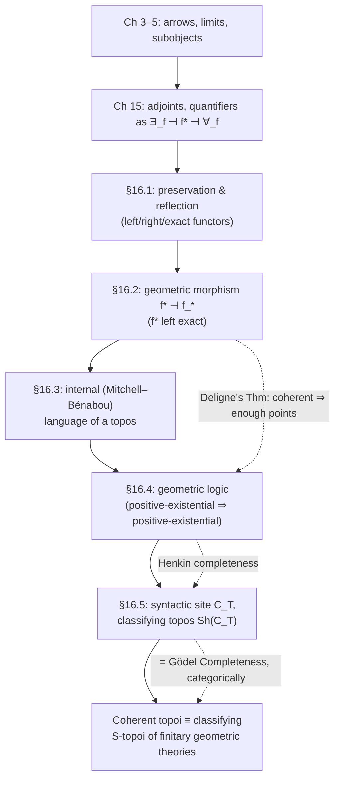

# Logical Geometry

[[book-guidelines|↩ Back to guidelines]]

## Why this chapter exists

Every chapter before this one moves in one direction: take a piece of geometry — open sets, sheaves, sites, Grothendieck topologies — and show that it secretly encodes a piece of logic. A sheaf topos turns out to have an internal Heyting algebra of truth values; covers turn out to be a notion of "local" forcing; the double-negation-like operator $j$ turns out to sieve out a sub-logic. Chapter 16, added in the second edition, runs the arrow the other way. It asks: if geometry gives rise to logic, can *logic* give rise to geometry? Given nothing but a theory — a set of axioms in some formal language — can you *build* a topos out of it, a genuinely geometric object (a category of sheaves over a site), such that the models of your theory correspond exactly to the "continuous" maps into that topos?

The answer is yes, and the construction is one of the most conceptually satisfying payoffs in the book. It rests on three pieces of machinery, each answering a specific question:

1. **Geometric morphisms** (§16.2) — what is the topos-theoretic analogue of a continuous function between spaces? This gives us a notion of *map between logical universes*.
2. **The internal (Mitchell–Bénabou) language of a topos** (§16.3) — how do you talk about first-order logic *inside* an arbitrary category, treating objects as sorts and subobjects as the interpretation of formulas?
3. **Geometric logic** (§16.4) — which fragment of logic survives translation along a geometric morphism, and hence deserves to be called "geometric"?

These fuse in §16.5: given a geometric theory $T$, you build a *syntactic site* $C_T$ out of its own formulas (a category whose objects are formulas up to variable renaming and whose arrows are provable functional relations between them), and the sheaf topos $\mathrm{Sh}(C_T)$ turns out to be the **classifying topos** of $T$ — a single topos that "contains" every possible model of $T$, universally, the way a free group contains every group generated by its generators. This is Goldblatt's capstone: it identifies "Grothendieck topos" with "classifying topos of a geometric theory" and shows that a genuinely deep classical result — the **Gödel Completeness Theorem** — is, from this vantage point, equivalent to a geometric fact about points of topoi (**Deligne's Theorem**).

If you are building an elaborator or a constraint solver, this chapter is not idle abstraction. The syntactic category $C_T$ is *exactly* the kind of canonical/generic model construction that underlies Henkin-style completeness proofs, Herbrand universes, and — as we'll flag explicitly — the sense in which a most general unifier is the "classifying object" for all unifiers of a constraint. Keep that analogy in the back of your mind; we'll cash it out at the end.

---

## 1. Preservation and reflection of structure by functors (§16.1)

### The "why"

A functor $F : \mathscr{C} \to \mathscr{D}$ is just a structure-respecting map between categories — but *how much* structure it respects is a spectrum, not a binary. Some functors preserve every limit you throw at them; some only preserve some; some destroy structure outright (the forgetful functor $\mathbf{Grp} \to \mathbf{Set}$ throws away the group operation entirely, yet still preserves injectivity of homomorphisms). Before we can define a geometric morphism, we need precise vocabulary for exactly which structural properties a functor carries across, and in which direction.

**What breaks without this vocabulary:** without a name for "preserves finite limits," you can't state the defining condition of a geometric morphism at all — "the inverse-image functor $f^*$ is left exact" is meaningless jargon until you know left exactness means "preserves all finite limits," and that in turn only matters because finite limits are exactly the categorical machinery needed to interpret conjunction, equality, and existential quantification (as §16.3 will show). This section is the toolbox; the rest of the chapter is what you build with it.

### The formalism

For a functor $F : \mathscr{C} \to \mathscr{D}$:

- $F$ **preserves** monics (epics, isos) if $f$ monic in $\mathscr{C}$ $\implies$ $F(f)$ monic in $\mathscr{D}$.
- $F$ **reflects** monics if $F(f)$ monic in $\mathscr{D}$ $\implies$ $f$ monic in $\mathscr{C}$.
- More generally, for a diagram $D$ in $\mathscr{C}$, $F$ **preserves $D$-limits** if it carries every limiting cone over $D$ to a limiting cone over $F(D)$; **reflects** them if the converse holds.
- $F$ is **faithful** if it is injective on each hom-set $\mathscr{C}(a,b)$.
- $F$ is **conservative** if, given monics $f, g$ representing subobjects of some $d$, $F(f) \sqsubseteq F(g)$ in $\mathrm{Sub}(F(d))$ implies $f \sqsubseteq g$ in $\mathrm{Sub}(d)$.
- $F$ is **left exact** if it preserves all *finite* limits (equivalently: terminal objects + pullbacks, or terminal objects + equalisers + binary products). Dually, **right exact** preserves finite colimits; **exact** means both.

Goldblatt proves a tight chain of equivalences for functors defined on a topos: a functor that preserves equalisers is faithful iff it reflects isos; one that also preserves pullbacks is faithful iff it is conservative iff it "preserves iso's". And crucially:

> **Theorem 1.** If $(F, G, \theta)$ is an adjunction $F \dashv G$ from $\mathscr{C}$ to $\mathscr{D}$, then the left adjoint $F$ preserves all $\mathscr{C}$-colimits, while the right adjoint $G$ preserves all $\mathscr{D}$-limits.

This is the single fact that makes everything downstream possible: adjoints are automatically structure-preserving in a predictable direction, so building a geometric morphism out of an adjoint pair *guarantees* the preservation properties we need for free.

### Grounding

**Rust — compiler passes as functors.** Think of $F$ as a compiler pass — say, monomorphization, or CPS conversion. "Preserves monics" is "distinct source terms stay distinct after the pass" (the pass doesn't accidentally collapse two different programs into the same output — that's exactly what *faithful* means, injective on the hom-set of "ways to get from $a$ to $b$"). "Preserves pullbacks" is the pass-level statement "if I lower two constraints that share a sub-expression, the lowered versions still agree exactly where the originals did" — i.e., the pass doesn't introduce spurious extra solutions or discard real ones when you conjoin two pieces of context. A pass that is not left exact can silently make an unsatisfiable pair of constraints look satisfiable after lowering, which is precisely the soundness bug you'd fear in a refinement-type checker's IR-lowering stage.

```rust
// A "left exact" functor between two toy IRs, expressed as a trait
// obligation: the pass must commute with forming the pullback
// (the "meet"/join of two constraints sharing free variables).
trait Ir {
    type Constraint;
    fn conjoin(a: &Self::Constraint, b: &Self::Constraint) -> Self::Constraint;
    fn terminal() -> Self::Constraint; // "no constraint" / trivially true
}

trait LeftExactPass<Src: Ir, Dst: Ir> {
    fn lower(c: &Src::Constraint) -> Dst::Constraint;

    // Left exactness, spelled out as an obligation the implementor
    // must uphold (Rust's type system can't check this for you —
    // it's a proof burden, exactly like preserving a pullback):
    //   lower(Src::conjoin(a, b)) == Dst::conjoin(lower(a), lower(b))
    //   lower(Src::terminal())    == Dst::terminal()
}
```

**Lean — preservation as a real mathlib class.** This is not just an analogy; Lean's `Mathlib.CategoryTheory.Limits.Preserves.Basic` literally defines `CategoryTheory.Limits.PreservesLimit`, `PreservesFiniteLimits`, and `CategoryTheory.Functor.Faithful`/`Conservative` as first-class structures, and `CategoryTheory.Adjunction` proves the left-adjoints-preserve-colimits / right-adjoints-preserve-limits theorem generically. If you ever formalize this chapter, you are quite literally instantiating `PreservesFiniteLimits f.op` for the inverse-image functor of a geometric morphism — the book's Theorem 1 above *is* `CategoryTheory.Adjunction.leftAdjointPreservesColimits` in mathlib's own vocabulary.

**Python — a quick sanity check.** For finite categories you can literally brute-force check preservation on a toy example (useful for building intuition before trusting the general proof):

```python
def preserves_monic(F, arrows, is_monic):
    return all(is_monic(f) <= is_monic(F(f)) for f in arrows)
```

---

## 2. Geometric morphisms between topoi (§16.2)

### The "why"

Goldblatt motivates the definition from ordinary topology, and it's worth walking the same path because the intuition transfers directly. A continuous function $f : X \to Y$ between topological spaces is *defined* by the property that pulling back an open set of $Y$ along $f$ gives an open set of $X$: $V \in \mathcal{O}_Y \implies f^{-1}(V) \in \mathcal{O}_X$. That pullback assignment $V \mapsto f^{-1}(V)$ is itself a functor $f^* : \mathcal{O}_Y \to \mathcal{O}_X$ between the poset categories of opens, and — this is the key move — it has a right adjoint $f_* : \mathcal{O}_X \to \mathcal{O}_Y$ (direct image). So "continuous function" is secretly "an adjoint pair of functors between posets of opens, with the left adjoint $f^*$ preserving finite meets ($\cap$), i.e. left exact." Lift this whole picture from posets of opens to full sheaf topoi, and you get the general definition.

**What breaks without this generalization:** without it, "map between logical universes" has no meaning beyond the trivial case of functors between the underlying categories, which do *not* in general respect the internal logic (they might not preserve $\Omega$, or might scramble finite limits). A geometric morphism is precisely the notion of map strong enough to guarantee that translating a theory's *models* along it makes categorical sense.

### The formalism

> **Definition.** A geometric morphism $f : \mathscr{E}_1 \to \mathscr{E}_2$ of elementary topoi is a pair $(f^*, f_*)$ of functors
> $$\mathscr{E}_1 \xrightarrow{f_*} \mathscr{E}_2, \qquad \mathscr{E}_2 \xrightarrow{f^*} \mathscr{E}_1$$
> such that $f^*$ is **left exact** and **left adjoint** to $f_*$ (written $f^* \dashv f_*$). $f^*$ is the **inverse image part**, $f_*$ the **direct image part**.

By §16.1's Theorem 1, $f^*$ automatically preserves all colimits too (it's a left adjoint), so — being left exact as well — $f^*$ is an **exact** functor: it preserves everything finite-limit-shaped *and* everything colimit-shaped. That combination is unusually strong, and it's exactly what makes geometric morphisms behave like continuous maps rather than arbitrary functors.

Key examples Goldblatt works through, in increasing generality:

- **Slice topoi.** For any arrow $f : a \to b$ in a topos $\mathscr{E}$, the pullback functor $f^* : \mathscr{E}/b \to \mathscr{E}/a$ (from the Fundamental Theorem of Topoi, Chapter 15) has a right adjoint $\Pi_f$, and $(f^*, \Pi_f)$ is a geometric morphism $\mathscr{E}/a \to \mathscr{E}/b$.
- **Points.** A **point** of a topos $\mathscr{E}$ is a geometric morphism $p : \mathbf{Set} \to \mathscr{E}$. This generalizes a point $y \in Y$ of a space: it gives a "stalk" functor $p^*$ extracting the fiber of every object of $\mathscr{E}$ over that point.
- **$\mathrm{Sh}(J) \hookrightarrow \mathrm{St}(J)$**, the inclusion of $j$-sheaves into presheaves, is the *direct image* part of a geometric morphism whose inverse image is sheafification — the left exact left adjoint to the inclusion.

### Sufficiency of points, and Deligne's / Barr's Theorems

A class $P$ of points is **sufficient** if any arrow $f$ with $p^*(f)$ iso in $\mathbf{Set}$ for every $p \in P$ is itself iso — i.e. points in $P$ jointly "see" everything. A topos **has enough points** if the class of *all* its points is sufficient. This is the topos-theoretic analogue of a completeness property: a semantics "has enough models" precisely when isomorphism (equivalently, provable equality) can always be witnessed by *some* model in the class.

Goldblatt builds up to two named theorems:

> **Deligne's Theorem.** Every *coherent* topos has enough points.

(A **coherent topos** is $\mathrm{Sh}(C)$ for a *finitary* site $C$ — a small, finitely complete site where every cover is a *finite* set of arrows.)

> **Barr's Theorem.** For every Grothendieck topos $\mathscr{E}$ there is a complete Boolean algebra $B$ and a *surjective* geometric morphism $\mathrm{Sh}(B) \to \mathscr{E}$.

("Surjective" here means the inverse-image part is faithful.) Barr's theorem generalizes Deligne's by dropping the atomicity/finiteness assumption, at the cost of landing in a possibly-huge Boolean-valued topos rather than a set-indexed power of $\mathbf{Set}$. Not every Grothendieck topos has enough *points* — Goldblatt gives Barr's own example, $\mathrm{Sh}(B)$ for an *atomless* complete Boolean algebra $B$ (e.g. the regular open sets of $\mathbb{R}$), which has **no points at all**. But by Barr's theorem it still has "enough generalized points" once you allow Boolean-valued ones.

**What breaks without sufficiency:** if a topos lacks enough points, you cannot verify an equation, or falsify a non-theorem, by "testing on elements" the way you can in $\mathbf{Set}$ — pointwise reasoning simply stops being valid. This is exactly the gap that the classical Completeness Theorem closes for first-order logic over $\mathbf{Set}$, and it's why Deligne's Theorem will turn out (§16.4) to *be* a categorical form of Gödel Completeness.

### Grounding

**Lean/type-theoretic reading — geometric morphism as elaboration in disguise.** If you think of a topos as "a mathematical universe with its own internal logic," a geometric morphism $f : \mathscr{E}_1 \to \mathscr{E}_2$ is a *sound translation of that logic* from $\mathscr{E}_2$'s universe into $\mathscr{E}_1$'s: $f^*$ takes objects/formulas of $\mathscr{E}_2$ and reinterprets them in $\mathscr{E}_1$, and left exactness is exactly the guarantee that this reinterpretation doesn't break conjunction, equality-testing, or existential witnessing (all finite-limit-built notions). That is structurally identical to what a sound elaborator must guarantee when it lowers surface syntax (with implicit arguments, unresolved metavariables) into a fully-elaborated core term: the translation must be an exact/left-exact functor from "surface-typing-derivations" to "core-typing-derivations" in the sense that judgmental equality and product/Σ-formation in the source are preserved, not merely resembled, in the target. Lean's own two-level architecture (elaborator emitting core terms checked by a small trusted kernel) is one concrete instance of "translate along a structure-preserving map into a smaller, more trusted universe" — precisely the shape of a geometric morphism into a coherent (finitary, hence tractable) topos.

**Rust — the adjoint pair as a bidirectional API.**

```rust
// f*  (inverse image): lowers a "spec" object from the target universe
// f_* (direct image):  lifts a "spec" object back, right-adjoint to f*
trait GeometricMorphism<Src, Dst> {
    fn inverse_image(dst_obj: &Dst) -> Src;   // f*  — must be left exact
    fn direct_image(src_obj: &Src) -> Dst;    // f_* — right adjoint to f*

    // The defining adjunction, as a law the implementor must satisfy:
    //   Hom_Src(inverse_image(d), s) ≅ Hom_Dst(d, direct_image(s))
}
```

The requirement that `inverse_image` be left exact is the same "meet-preserving" obligation from §1 — and it's the thing that makes composing two sound lowering passes still sound: geometric morphisms compose, so a pipeline of exact translations between successively "smaller" logical universes (surface syntax → elaborated core → SMT-checkable VC) is itself a single geometric morphism, provided every stage in the pipeline is left exact.

**Python — sufficiency of points as a testing strategy.** "Enough points" is the categorical shadow of a very concrete engineering habit: if you can't prove two things equal directly, check they agree under every "evaluation" (point) you have access to. A property-based test suite that only distinguishes two implementations by running them against a *sufficient* family of inputs is doing exactly what a sufficient class of points does for a topos — with the caveat (Barr's atomless example) that some universes have no honest "run it and see" points at all, and you're forced into more indirect (Boolean-valued) verification.

---

## 3. The internal logic of a topos as a formal language (§16.3)

### The "why"

Chapters 6–7 already showed that $\mathrm{Sub}(d)$, the subobjects of any object $d$ in a topos, form a Heyting algebra under $\cap, \cup, \Rightarrow$. But so far that's been used object-by-object, not as a *language*. What Goldblatt does here is scale that up into a genuine multi-sorted first-order logic whose sentences can be interpreted, uniformly, *inside any topos at all* — with sorts standing for objects, terms for arrows, and the truth-value of a formula being not `true`/`false` but a **subobject** of the object formed from its free variables. This is the **Mitchell–Bénabou language**, and it is what lets us later say things like "a formula holds in every model" without leaving category theory.

**What breaks without this:** without a formal language with a precise satisfaction relation $\mathfrak{A} \models \varphi$ *inside* an arbitrary topos, "geometric theory" (§16.4) has no interpretation to check soundness against, and the entire syntax-to-semantics bridge of §§16.4–16.5 collapses.

### The formalism

A **many-sorted language** $\mathscr{L}$ fixes a set of sorts, and for each sort $a$ a denumerable stock of variables $V_a$; operation symbols $g : (a_1,\dots,a_n) \to a_{n+1}$; relation symbols $R : \langle a_1,\dots,a_n\rangle$; and typed constants $c : a$. Terms and formulas are built up sort-respectingly as usual, with two extra atomic sentences $\top, \bot$ always present.

For an elementary topos $\mathscr{E}$, an **$\mathscr{E}$-model** $\mathfrak{A} : \mathscr{L} \to \mathscr{E}$ assigns:

1. to each sort $a$, an $\mathscr{E}$-object $\mathfrak{A}(a)$;
2. to each operation symbol $g$, an arrow $\mathfrak{A}(g) : \mathfrak{A}(a_1) \times \cdots \times \mathfrak{A}(a_n) \to \mathfrak{A}(a_{n+1})$;
3. to each relation symbol $R$, a **subobject** $\mathfrak{A}(R) \rightarrowtail \mathfrak{A}(a_1) \times \cdots \times \mathfrak{A}(a_n)$;
4. to each constant $c : a$, a global element $1 \to \mathfrak{A}(a)$.

Note carefully what this generalizes beyond §11.4: $\mathfrak{A}(a)$ is allowed to be *any* object, including the initial object $0$ or an object with no global elements — this is deliberately a **free logic**, admitting sorts that might be "empty."

Given a term $t$ of sort $a$ and an appropriate variable list $v$, an arrow $\mathfrak{A}(t) : \mathfrak{A}(v) \to \mathfrak{A}(a)$ is defined inductively (variables become projections, constants become the composite $\mathfrak{A}(v) \to 1 \xrightarrow{c} \mathfrak{A}(a)$, and compound terms compose with $\mathfrak{A}(g)$). Then, for a formula $\varphi$ with free variables $v$, its interpretation $\mathfrak{A}_v(\varphi) \rightarrowtail \mathfrak{A}(v)$ is defined by structural induction:

| formula | interpretation |
|---|---|
| $\top$ | the maximal subobject $1 : \mathfrak{A}(v) \rightarrowtail \mathfrak{A}(v)$ |
| $\bot$ | the minimal subobject $0 \rightarrowtail \mathfrak{A}(v)$ |
| $t \approx u$ | the equaliser of $\mathfrak{A}(t)$ and $\mathfrak{A}(u)$ |
| $R(t_1,\dots,t_n)$ | the pullback of $\mathfrak{A}(R)$ along $\langle \mathfrak{A}(t_1),\dots,\mathfrak{A}(t_n)\rangle$ |
| $\land, \lor, \lnot, \Rightarrow$ | $\cap, \cup, -, \Rightarrow$ in the Heyting algebra $\mathrm{Sub}_\mathscr{E}(\mathfrak{A}(v))$ |
| $\exists w\,\psi$, $\forall w\,\psi$ | $\exists_{\mathrm{pr}}(\mathfrak{A}(\psi))$, $\forall_{\mathrm{pr}}(\mathfrak{A}(\psi))$, using the adjoint quantifier functors of §15.4 along the projection $\mathrm{pr} : \mathfrak{A}(v,w) \to \mathfrak{A}(v)$ |

Truth in $\mathfrak{A}$, written $\mathfrak{A} \models \varphi$, means $\mathfrak{A}_v(\varphi)$ is the *maximum* subobject $\mathfrak{A}_v(\top)$.

**This is, precisely, the categorical semantics of a refinement type.** If $\varphi(v)$ is a predicate and $\mathfrak{A}(a)$ is the ambient object/type, then $\mathfrak{A}_v(\varphi) \rightarrowtail \mathfrak{A}(v)$ *is* the interpretation of $\{v : a \mid \varphi(v)\}$ — a subobject monic into its carrier, exactly the semantic reading refinement-type systems give to their subset types. The quantifier row is not a coincidence either: $\exists_f, \forall_f$ as adjoints to substitution/pullback along $f$ is exactly the categorical statement "$\exists$ generalizes over a variable that's about to go out of scope" — the semantic mirror of existential elimination and Skolemization in verification-condition generation, and of the weakening/strengthening steps a Hoare-logic VCGen performs when a local variable leaves its block.

### The language of a category itself — logic characterizing category axioms

Goldblatt then applies this machinery reflexively: every finitely complete category $\mathscr{C}$ has its own **canonical language** $\mathscr{L}_\mathscr{C}$ (sorts = objects of $\mathscr{C}$, one-place operation symbols = arrows of $\mathscr{C}$, no relations or constants) together with the tautological model $\mathfrak{A}_\mathscr{C} : \mathscr{L}_\mathscr{C} \to \mathscr{C}$. The punchline (Theorem 1 of §16.3) is that purely *categorical* facts about $\mathscr{C}$ — "this triangle commutes," "$f$ is monic," "$c$ is a product of $a,b$ with these projections," "this family is a cover" — become **truth of specific formulas** in this canonical model:

- $\mathrm{term}(a)$ ("there's a unique element") $\iff$ $a$ is terminal;
- $\mathrm{mon}(f)$: $(f(v) \approx f(w) \Rightarrow v \approx w)$ $\iff$ $f$ is monic;
- $\mathrm{ep}(f)$: $\exists w\,(f(v) \approx w)$ $\iff$ $f$ is epic;
- $\mathrm{equ}(h,f,g)$ $\iff$ $h$ equalises $f,g$;
- $\mathrm{prod}(f,g)$ $\iff$ $f,g$ exhibit their domain as a product;
- $\mathrm{cov}(C)$: $\bigvee_{x} \exists u_x\,(f_x(u_x) \approx v)$ $\iff$ $C = \{f_x\}$ is a cover.

And, generalizing: if $\mathfrak{A} : \mathscr{L}_\mathscr{C} \to \mathscr{D}$ is a model in another category $\mathscr{D}$, then $\mathfrak{A}$ is a *functor* $\mathscr{C} \to \mathscr{D}$ exactly when the identity- and composition-equations hold in $\mathfrak{A}$, and $\mathfrak{A}$ *preserves* a categorical property $P$ of a diagram $D$ exactly when the corresponding formula $\varphi_P$'s truth transfers — this is Goldblatt's Metatheorem: **$\mathfrak{A}$ preserves $P$ iff $\mathfrak{A} \models \varphi_P$.** In other words, all of §16.1's preservation vocabulary is *itself* expressible as first-order truth in the internal language. Logic has swallowed category theory whole.

### Grounding

**Rust — the many-sorted language as a typed IR signature.** A many-sorted language $\mathscr{L}$ is exactly a typed signature: sorts are types, operation symbols are typed function declarations, relation symbols are typed predicate declarations. Interpreting a formula as a subobject is exactly what a refinement-type checker does when it turns a predicate into "the subset of values of this type satisfying it":

```rust
// L: a many-sorted signature.
enum Sort { Nat, Bool /* ... */ }

struct OpSymbol { name: String, domain: Vec<Sort>, codomain: Sort }
struct RelSymbol { name: String, domain: Vec<Sort> }

// An E-model interprets each sort as a *carrier type with a
// refinement predicate slot* — exactly A(R) >-> A(a1) x ... x A(an).
struct Model<E> {
    carriers: std::collections::HashMap<String, E>,     // A(a)
    ops: std::collections::HashMap<String, /* E-arrow */ Box<dyn Fn(&[E]) -> E>>,
    // A(R): a subobject, concretely "a monic + its domain" —
    // in refinement-type terms, {v : A | R(v)}.
}
```

**Lean — this is literally how Lean's elaborator treats a `{x : A // p x}` (Subtype).** A `Subtype p` for `p : A → Prop` *is* a subobject of `A` in the topos `Type`: the inclusion `Subtype.val : {x : A // p x} → A` is monic, and its "characteristic map" is `p` itself viewed as a map into `Prop` (which plays the role of $\Omega$ in this topos). Reading Goldblatt's row "$\land,\lor,\lnot,\Rightarrow$ interpreted as $\cap,\cup,-,\Rightarrow$ in $\mathrm{Sub}(\mathfrak{A}(v))$" against Lean's `Subtype` combinators (`Subtype.map`, `And`, `Or`, `Exists` on subtypes) is a genuinely one-to-one dictionary — this is the precise sense in which dependent type theory's `Prop`-valued predicates and topos-theoretic subobjects are the same idea wearing different notation. The "canonical language of a category" idea is mirrored by Lean's own `CategoryTheory.Functor` API: proving `F.PreservesLimit` for a specific diagram is exactly proving the truth, in the internal sense above, of the corresponding `term`/`prod`/`equ` formula.

**Python — a toy interpreter for the internal language.** This is worth writing once to internalize the recursion, even at toy scale:

```python
# A model over Set (finite carriers), computing A_v(phi) as a set
# of tuples — the naive-Set special case Goldblatt's Exercise 1 asks for.
def interpret(model, phi, env_vars):
    match phi:
        case ("true",):
            return model.carrier_product(env_vars)          # A(v) itself
        case ("false",):
            return set()
        case ("eq", t, u):
            return {a for a in model.carrier_product(env_vars)
                     if model.eval_term(t, a) == model.eval_term(u, a)}
        case ("and", p, q):
            return interpret(model, p, env_vars) & interpret(model, q, env_vars)
        case ("exists", w, psi):
            # project out w after intersecting — this *is* the
            # left-adjoint-to-substitution reading of exists.
            return model.project(interpret(model, psi, env_vars + [w]), drop=w)
```

---

## 4. Geometric logic and geometric theories (§16.4)

### The "why"

Not every formula survives translation along a geometric morphism unscathed. Only $f^*$'s left exactness is guaranteed — it preserves finite limits and (as a left adjoint) arbitrary colimits, but there is no guarantee it preserves, say, universal quantification or negation, both of which are built from *right* adjoints ($\forall_f$) or from complementation, neither of which a merely-left-exact functor need respect. So the natural question is: **exactly which formulas are guaranteed to have their truth-value preserved by every geometric morphism?** The answer names the fragment: **geometric logic**.

**What breaks without isolating this fragment:** if you don't know which formulas are stable under geometric morphisms, you cannot safely transport a theorem proved about one topos-model of a theory (say, a $\mathbf{Set}$-model, where classical reasoning is available) to another (a Grothendieck topos, where it might not be). Theorem 3 below is precisely a "transfer principle," and transfer principles are only sound on the geometric fragment.

### The formalism

A formula is **positive-existential** ($\mathscr{L}^\exists_g$) if it uses no logical symbols beyond atomics, $\top, \bot, \land, \lor, \exists$ — crucially, **no** $\lnot, \Rightarrow, \forall$. A **geometric** (or **coherent**) formula is one of the form $\varphi \Rightarrow \psi$ with $\varphi, \psi \in \mathscr{L}^\exists_g$ (any positive-existential formula counts as geometric too, since $\varphi \equiv (\top \Rightarrow \varphi)$; negations $\lnot\varphi \equiv (\varphi \Rightarrow \bot)$ of positive-existential formulas are geometric as well). A **geometric theory** is a set of geometric formulas.

> **Theorem 1.** Let $f : \mathscr{F} \to \mathscr{E}$ be a geometric morphism and $\mathfrak{A}$ an $\mathscr{L}$-model in $\mathscr{E}$.
> (A) For positive-existential $\varphi$: $f^*(\mathfrak{A}(\varphi)) = (f^*\mathfrak{A})(\varphi)$.
> (B) For geometric $\theta$: $\mathfrak{A} \models \theta \implies f^*\mathfrak{A} \models \theta$.
> (C) If $f^*$ is faithful (the morphism is *surjective*), the implication in (B) is an *iff*.

Part (A) is a straightforward structural induction using exactly the preservation properties $f^*$ is guaranteed to have (pullbacks for $\land$ and atomics, coproducts + images for $\lor$, images for $\exists$) — and *no more*, which is precisely why the fragment stops exactly at positive-existential/geometric formulas: go one symbol further (add $\forall$ or unrestricted $\lnot$) and the inductive step has nothing to appeal to.

Combining this with Deligne's Theorem gives the chapter's semantic centerpiece:

> **Theorem 2.** If $\mathfrak{A}$ is an $\mathscr{L}$-model in a *coherent* topos $\mathscr{E}$, and $T$ a geometric theory, then $\mathfrak{A} \models T$ in $\mathscr{E}$ iff $p^*\mathfrak{A} \models T$ in $\mathbf{Set}$ for every point $p$ of $\mathscr{E}$.

— i.e., for geometric theories, truth in an arbitrary coherent topos reduces to truth in ordinary $\mathbf{Set}$-models, one point at a time. This is exactly the mechanism by which classical, pointwise reasoning can be soundly imported into a non-Boolean topos, *provided you stay in the geometric fragment*.

### Proof theory: the sequent system GL

Goldblatt then gives a genuine **sequent calculus**, $\mathrm{GL}$, for deriving geometric sequents $\Gamma \Rightarrow \varphi$ (finite $\Gamma$, single geometric conclusion) from a geometric theory $T$: axioms of identity, structural rules, and rules for $\land,\lor,\exists$ that are carefully restricted (free-variable side conditions on $\exists$-rules) to remain sound under "free logic" — models where a sort may be empty. One rule, $R_T$, is *theory-dependent*: it lets you invoke $\Gamma(v) \Rightarrow \varphi(v) \in T^=$ directly as an inference step. This is structurally a **Horn-clause resolution step** — "if this instance of a clause-body is derivable, conclude this instance of the clause-head" — and the whole $\mathrm{GL}$ system is, in essence, a **coherent-logic prover**: a sequent calculus over exactly the disjunctive-Horn-like fragment that shows up as the target logic for automated coherent-logic theorem provers (e.g. in the Bezem–Coquand style), and structurally close to the clause language solved by **CHC (Constrained Horn Clause) solvers** — the geometric restriction to $\land,\lor,\exists$ on the left/right of $\Rightarrow$ is what keeps proof search tractable and avoids the combinatorial blow-up that unrestricted $\forall/\lnot$ would bring into clause resolution.

Goldblatt then proves, in order:

- **Soundness Theorem.** $T \vdash \theta \implies$ $\theta$ true in every topos-model of $T$.
- **Classical Completeness Theorem** (for finitary geometric $T$). If $T \nvdash \theta$, there is a **Set-model** of $T$ falsifying $\theta$.
- **Compactness Theorem.** If every finite subset of $T$ has a Set-model, so does $T$ (an immediate corollary of finitary derivability + Soundness).

The completeness proof is via the classical **Henkin method**: enumerate formulas, build a maximal consistent extension $\Sigma$ of $\Gamma$ that faithfully decides every formula, quotient the terms of the language by "$t \sim u$ iff $(t \approx u) \in \Sigma$" to get the individuals of the model. Goldblatt is explicit that this construction is *entirely independent of category theory* — it's the ordinary Henkin proof, imported wholesale. What *is* new is what he does with it next: he uses Classical Completeness for finitary sites to give a purely proof-theoretic **proof of Deligne's Theorem**, by constructing, for any non-cover $C$ of a site, a consistent geometric theory whose Set-model witnesses that $C$ fails to be epimorphic — turning "enough points" into "consistency implies a model," which is Henkin's theorem wearing topos clothing.

### Grounding

**This is the mechanism, not just the metaphor, behind your CHC/Horn-clause thread.** The positive-existential fragment $\mathscr{L}_g^\exists$ (finite $\land$, arbitrary $\lor$, $\exists$, no $\forall/\lnot$) is *exactly* the fragment that is preserved (in the model-theoretic, not topos-theoretic, sense) under homomorphisms of classical structures — a classical theorem (the Łoś–Tarski-adjacent "preservation theorem" for existential-positive formulas) that geometric logic is the topos-theoretic generalization of. When you write a Horn clause `head :- body1, body2, ...` for a CHC solver, `body` is a conjunction of atoms (positive-existential) and the clause as a whole, `body ⇒ head`, is *literally* of the shape `φ ⇒ ψ` with both sides positive-existential — a geometric sequent. The $R_T$ rule of $\mathrm{GL}$ *is* clause application. Reading a CHC system as "a finitary geometric theory" and reading the search for a model as "constructing a point of the associated classifying topos" is not poetic license — it's the same object studied from two traditions.

```rust
// A GL-style sequent-calculus step, Horn-clause flavored.
struct Atom { pred: String, args: Vec<Term> }
struct Clause { body: Vec<Atom>, head: Atom }   // body => head, both positive-existential

// R_T: instantiate a theory clause and use it as an inference step —
// the categorical content is invisible here, but it's the same rule.
fn apply_theory_clause(clause: &Clause, subst: &Substitution, derived: &[Atom]) -> Option<Atom> {
    let instantiated_body: Vec<Atom> = clause.body.iter().map(|a| subst.apply(a)).collect();
    if instantiated_body.iter().all(|a| derived.contains(a)) {
        Some(subst.apply(&clause.head))
    } else {
        None
    }
}
```

**Lean.** Lean's own `Decidable`/`Prop`-level treatment of `∃`/`∨` versus `∀`/`¬` is the same asymmetry in miniature: `∃` and `∨` are *constructive* (you exhibit a witness or a disjunct), while `∀` and `¬` quantify over open-ended possibilities and are exactly the connectives whose interpretation needs the *right*-adjoint quantifier functor $\forall_f$ rather than the left-adjoint $\exists_f$ — which is why they are the connectives geometric logic excludes. This is not a coincidence: Bishop-style constructive mathematics and geometric logic pick out almost the same fragment for closely related reasons (evidence-producing content).

**Python — the Compactness Theorem as "finite unsat cores."** Compactness for geometric theories is the direct ancestor of the standard SMT-engineering fact that an unsatisfiable constraint set has a *finite* unsatisfiable core — both are consequences of proofs being finite objects:

```python
def compactness_witnesses_unsat(theory):
    """If every finite subset is SAT but the whole theory is claimed UNSAT,
    Compactness says that claim must be wrong for a finitary geometric theory —
    exactly the principle behind incremental SMT solving with assumption sets."""
    ...
```

---

## 5. Theories represented as sites — classifying topoi (§16.5)

### The "why"

We now have, in both directions: models of a geometric theory $T$ in a Grothendieck topos correspond to continuous morphisms out of a site (§16.3's Theorem 2, via the Reduction Theorem of §16.2); and geometric formulas transport soundly along geometric morphisms (§16.4). The missing piece is to go *from* a bare theory $T$ *to* an actual site, purely syntactically, so that "having a model of $T$" becomes literally the same statement as "having a geometric morphism into a specific topos." This closes the loop Goldblatt promised at the very start of the chapter (quoting Makkai–Reyes): geometry and logic, each reconstructing the other.

### The formalism: the syntactic site $C_T$

Given a geometric theory $T$ over language $\mathscr{L}$, define a category $\mathscr{C}_T$:

- **Objects** are equivalence classes $\{\varphi(v)\}$ of positive-existential formulas under *acceptable renaming of free variables* (this is deliberately reminiscent of, and a genuine extension of, the **Lindenbaum algebra** construction of §6.5/§8.3 — but now the equivalence classes are objects of a *category*, not elements of a poset).
- **Arrows** $\{\varphi(v)\} \to \{\psi(w)\}$ are provable-equivalence classes $[\alpha(v',w')]$ of formulas $\alpha$ satisfying three geometric conditions (functionality: $\alpha$ implies $\varphi \land \psi$; totality: $\varphi \Rightarrow \exists w\,\alpha$; and single-valuedness: $\alpha(v,w) \land \alpha(v,w') \Rightarrow w \approx w'$) — i.e. an arrow is a **provably functional relation** between formulas, the syntactic image of "the graph of an arrow $\mathfrak{A}(\varphi) \to \mathfrak{A}(\psi)$" in any model $\mathfrak{A}$.
- A finite family of $\mathscr{C}_T$-arrows is a **cover** ("provably epimorphic") precisely when its "joint image formula" is provably equivalent to the target — this gives a finitary **pretopology**, hence a site $C_T$.

The identity on $\{\varphi(v)\}$ is $[\varphi(v) \land (v \approx v')]$; composition of $[\alpha]$ and $[\beta]$ is $[\exists w\,(\alpha(v,w) \land \beta(w,z))]$ — literally relational composition, syntactically.

Goldblatt proves (Theorem 1, §16.5) that the canonical model $\mathfrak{A}_T := \mathfrak{A}_{E_{C_T}}$ obtained by feeding the Yoneda-embedding-like canonical functor $E_{C_T} : \mathscr{C}_T \to \mathrm{Sh}(C_T)$ through the construction of §16.3 satisfies, by structural induction over $\varphi$:

$$ \mathfrak{A}_T(\varphi) = E_{C_T}(\{\varphi^v\}) $$

and then the sharp semantic completeness result:

> **Theorem 3.** For geometric $\theta$: $\quad T \vdash \theta \iff \mathfrak{A}_T \models \theta.$

This is exactly what "classifying" means: $\mathfrak{A}_T$'s truths are *precisely* the theorems of $T$ — nothing more, nothing less. And because the pretopology on $C_T$ is precanonical, $E_{C_T}$ turns out to literally *be* the Yoneda embedding, exhibiting $\mathscr{C}_T$ as a full subcategory of its own classifying topos $\mathrm{Sh}(C_T)$.

### Classical Completeness from Deligne's Theorem — the converse route

With $\mathfrak{A}_T$ in hand, Goldblatt runs the argument that opened the chapter's introduction *backwards*: given $T \nvdash \varphi \Rightarrow \psi$, Theorem 3 gives a coherent topos $\mathrm{Sh}(C_T)$ and a model where $\mathfrak{A}_T(\varphi) \not\sqsubseteq \mathfrak{A}_T(\psi)$; Deligne's Theorem supplies a point $p : \mathbf{Set} \to \mathrm{Sh}(C_T)$ witnessing this failure at the level of an honest $\mathbf{Set}$-model. **So the classical Gödel/Henkin Completeness Theorem for finitary geometric theories is, quite literally, Deligne's Theorem in disguise** — the chapter's headline claim, now proven both ways: proof-theoretically (§16.4, via the direct Henkin argument) and topos-theoretically (§16.5, via $C_T$ + Deligne).

### The general concept: classifying topos

> **Definition.** Fix a base Grothendieck topos $\mathscr{S}$. A pair $(\mathscr{F}, \mathfrak{A})$ — a Grothendieck $\mathscr{S}$-topos $\mathscr{F}$ together with an $\mathscr{S}$-model $\mathfrak{A}$ of $T$ — is a **classifying $\mathscr{S}$-topos** $\mathscr{S}[T]$ with **generic model** $\mathfrak{A}_T$ if it is universal: for *every* $T$-model $\mathfrak{A}'$ over $\mathscr{S}$, there is a geometric morphism $g$ over $\mathscr{S}$, unique up to natural isomorphism, with $\mathfrak{A}' = g^*\mathfrak{A}_T$.

This is exactly the universal-property shape you already know from initial/free objects: *every* model factors through the generic one, uniquely up to isomorphism, by pulling back along a (unique) geometric morphism. Goldblatt's payoff line: **coherent topoi are precisely the classifying $\mathbf{Set}$-topoi of finitary geometric theories**, and (citing Tierney and the wider literature, without full proof) this extends to arbitrary Grothendieck topoi and arbitrary geometric theories once you allow infinitary disjunction. In algebraic geometry, the famous **Zariski** and **Étale** topoi turn out themselves to be classifying topoi for specific naturally-arising algebraic theories — the abstract machinery reproduces concrete, historically prior constructions.

He closes with two lighter applications: **forcing topologies** (given finitely many monics $m_1,\dots,m_n$ you want to force to become isomorphisms, there is a smallest Lawvere–Tierney topology $j$ that achieves this in the corresponding subtopos of sheaves — a purely categorical analogue of "adding a constraint and re-solving"), and the **logic of rings and fields** (why "$x=0 \lor \exists y\,(xy=1)$" — the *geometric* field axiom — is strictly stronger, in a non-Boolean topos, than its two classically-equivalent cousins "field of fractions" and "residue field"; and Kock's theorem that the *generic local ring* happens to satisfy the strongest, non-geometric field axiom, letting you transfer geometric consequences of that stronger axiom back down to all local rings for free via Soundness).

### Grounding — the deep connection to unification

**This is your most-general-unifier intuition, formalized.** The universal property of a classifying topos — every model factors, uniquely up to isomorphism, through the generic model via a unique geometric morphism — is structurally the *same* universal property that characterizes a most general unifier (MGU) in a unification algorithm: every unifying substitution factors through the MGU via a further substitution, uniquely. $C_T$'s construction is, quotienting formulas by provable equivalence and building the free relational category on them, exactly analogous to computing the MGU by quotienting a set of equational constraints by the theory of equality and reading off the most general solving substitution. Where a unification algorithm computes *one* substitution that is initial among solutions of a *finite* constraint set, the classifying-topos construction computes *one topos-with-model* that is initial among all models of a *theory*. Miller's pattern-unification fragment is, not coincidentally, also carved out by a syntactic restriction (on the shape of metavariable applications) whose *purpose* — keeping the "most general solution" computation total and unique — mirrors exactly why geometric logic restricts to $\land,\lor,\exists$: both restrictions exist to guarantee a well-behaved universal/generic solution exists and is computable.

```python
# The MGU / classifying-object analogy, made concrete:
#   every unifier factors through the MGU  <->  every T-model factors
#   through the generic model mathfrak{A}_T, via a *unique* mediating map.
def mgu_factors_all(constraints, candidate_substitution):
    mgu = most_general_unifier(constraints)
    # candidate_substitution = mgu ∘ (some further substitution)
    return exists_factoring_substitution(mgu, candidate_substitution)
```

```rust
// The syntactic category C_T, sketched: objects are formulas-up-to-
// renaming, arrows are provably-functional relations — a "term model"
// exactly like the Herbrand/Lindenbaum construction behind Henkin's proof.
struct FormulaClass { canonical: Formula }              // {phi(v)}
struct FunctionalRelation { rel: Formula, provably_functional: () } // [alpha]

// Composition = relational composition = literally exists-quantifying
// out the shared middle variable:  exists w. alpha(v,w) & beta(w,z)
fn compose(alpha: &FunctionalRelation, beta: &FunctionalRelation) -> FunctionalRelation {
    FunctionalRelation {
        rel: Formula::Exists("w".into(),
            Box::new(Formula::And(Box::new(alpha.rel.clone()), Box::new(beta.rel.clone())))),
        provably_functional: (), // proof obligation, discharged by the theory's soundness
    }
}
```

**Lean.** Lean's `Std`/`Mathlib` notion of an *initial object* in a category of algebras (e.g. the free monoid, the initial `CommRing`) is the finite-signature special case of a classifying topos's generic model: `ℤ` is the classifying object ("initial model") for the theory of commutative rings in exactly the sense that $\mathfrak{A}_T$ classifies $T$ — every commutative ring receives a unique ring homomorphism from `ℤ`, just as every $T$-model receives a unique (up to iso) pullback of the generic model along a geometric morphism. If you've ever proven `Int.cast` is the unique ring hom `ℤ →+* R`, you have already proven a one-object special case of this chapter's central theorem.

---

## Synthesis: where this sits in the book, and where it leads



**What it depends on:** everything. Chapter 16 is the point where every earlier thread — subobjects and $\Omega$ (Ch. 4–5), the Heyting algebra of $\mathrm{Sub}(d)$ (Ch. 7), intuitionistic and Kripke semantics (Ch. 8, 10), first-order truth-in-a-topos (Ch. 11), sheaves and sites (Ch. 14), and quantifiers-as-adjoints (Ch. 15) — gets assembled into a single working machine. Nothing here is derivable from a fresh start; it's the payoff of the whole book.

**What (if anything) would build on it:** within Goldblatt's text, nothing — this is the final chapter, deliberately positioned as a capstone rather than a foundation for further material. Its "downstream" is external: it's the entry point into the Grothendieck-school literature on classifying topoi ([SGA4], Makkai–Reyes's *First Order Categorical Logic*), and into applications in algebraic geometry (Zariski/Étale topoi as classifying topoi) and algebra (the logic of local rings and fields).

**For the compiler/elaborator project specifically:** three connections are load-bearing, not decorative:

1. **§16.3's internal language is the semantics you already assume when you write refinement types.** A subobject $\mathfrak{A}_v(\varphi) \rightarrowtail \mathfrak{A}(v)$ *is* $\{v : A \mid \varphi(v)\}$; the quantifier functors $\exists_f \dashv f^* \dashv \forall_f$ *are* the adjoint pair your VCGen invokes implicitly every time it existentially generalizes over a fresh symbolic variable or universally strengthens an invariant across a substitution.
2. **§16.4's geometric fragment is, essentially, your CHC/Horn-clause target logic**, and the $\mathrm{GL}$ sequent calculus's theory-dependent rule $R_T$ is a Horn-clause resolution step wearing a topos-theoretic coat. If you ever need to argue soundness of a translation from surface constraints into a solver's clause language, "is this translation a geometric morphism (equivalently: does it stay within the positive-existential fragment and preserve finite limits)" is the right question to ask.
3. **§16.5's classifying topos is the categorical ancestor of "most general solution."** The universal factoring property of the generic model $\mathfrak{A}_T$ through geometric morphisms is the same shape as an MGU's universal factoring property through substitutions — worth remembering the next time you're tempted to treat "compute the most general unifier" as *just* an algorithm rather than as *the* canonical solution to a well-posed universal problem.
