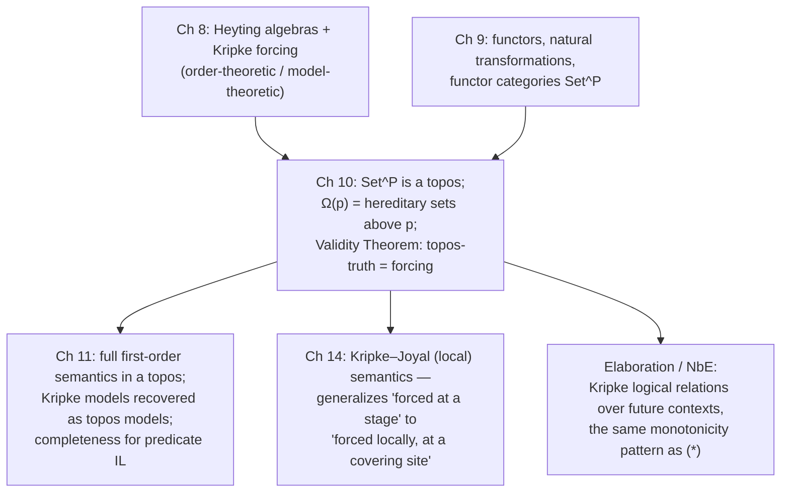

[[book-guidelines|↩ Back to guidelines]]

## Why a set needs a clock

Chapter 1 gave you the naive picture: a predicate $\varphi(x)$ carves out a set $\{x : \varphi(x)\}$, full stop. That picture quietly assumes truth is a static, timeless fact about $x$. Chapter 8 pulled the rug out from under that assumption: on the constructivist reading, truth is *known* at a stage of inquiry, and what's known grows as inquiry proceeds. Goldblatt opens Chapter 10 with a beautifully concrete example of what breaks if you insist on treating $\varphi$'s extension as a fixed set.

Let $\varphi(x)$ be "$x$ is an integer $> 2$ and there are no nonzero integers $a,b,c$ with $a^x + b^x = c^x$" — Fermat's Last Theorem, restated as a predicate on the exponent. In 1979, when Goldblatt wrote this, nobody knew whether $\varphi(x)$ held for *all* $x \geq 2$; it was known to hold for all $x \leq 25{,}000$ by exhaustive check. So "the set of $x$ for which $\varphi(x)$ is true" isn't one set — it's a moving target that grows (monotonically, since a proof at $x=25{,}001$ never gets *un*-proved) as mathematical knowledge advances. Write $\varphi_p$ for "the extension of $\varphi$ known at stage $p$." Then for stages $p \sqsubseteq q$ (q later than or equal to p),

$$
p \sqsubseteq q \implies \varphi_p \subseteq \varphi_q. \tag{$*$}
$$

That single monotonicity law is the entire content of what a **presheaf** (in Goldblatt's sense — a functor out of a poset of stages) *is*. A stage-indexed family of sets $\{\varphi_p\}_{p \in P}$ together with inclusion maps $\varphi_p \hookrightarrow \varphi_q$ whenever $p \sqsubseteq q$ is exactly a functor $\varphi : P \to \mathbf{Set}$. Chapter 9 built the general machinery of functor categories; this chapter's job is to show that $\mathbf{Set}^P$ — the category of all such "variable sets" over a fixed poset $P$ of stages — is itself a *topos*, work out its internal logic in full stagewise detail, and prove that this internal logic **is** Kripke's forcing semantics for intuitionistic logic, on the nose. That identification (the *Validity Theorem* of §10.5) is the payoff of the whole chapter, and arguably one of the most important theorems in the book: it is the bridge connecting "topos" (a purely categorical, algebraic notion) to "possible-worlds semantics" (a logician's semantic apparatus), and it is *the* concrete case study that makes the abstract topos machinery of Chapters 4–7 tractable.

Worth naming immediately, because it will resurface constantly in what follows: **this is precisely the semantic pattern behind Kripke logical relations used to prove normalization / decide definitional equality in a dependently-typed kernel.** A term's "meaning" there is also a family of behaviors indexed by future contexts (stages) with a monotonicity/naturality condition — exactly $(*)$. Keep that parallel in mind; it's the closing synthesis of this article, not a throwaway aside.

## §10.2 — The Heyting algebra hiding in a poset

Before touching $\mathbf{Set}^P$'s classifier, Goldblatt extracts the purely order-theoretic skeleton that will drive everything: **hereditary (upward-closed) subsets of a poset.**

For $p \in P$, write

$$
[p) = \{ q \in P : p \sqsubseteq q \}
$$

for the *principal hereditary set* generated by $p$ — everything at or after $p$. A subset $S \subseteq P$ is **hereditary** (also: $P$-hereditary, or a *sieve* on $p$ in the up-set convention Goldblatt uses) if $q \in S$ and $q \sqsubseteq r$ implies $r \in S$: once you're in $S$, you never fall back out as time advances. Write $P^+$ for the poset of all hereditary subsets of $P$, ordered by inclusion.

**Why this and not just "any subset"?** Because "known to be true" is required to persist — a fact proved at stage $p$ stays proved at every later stage. $P^+$ is exactly the collection of possible truth-value assignments compatible with that persistence requirement. Goldblatt already showed in §8.4 that $(P^+, \subseteq)$ is a Heyting algebra; here he needs the finer-grained fact that this remains true **locally**, at every stage simultaneously — and that these local Heyting algebras are compatible with each other via a specific homomorphism.

For $S \subseteq P$, define its **relativization** to $p$:

$$
S_p = S \cap [p).
$$

**Theorem 1** (§10.2) packages the basic facts: if $S \subseteq [p)$ already, $S_p = S$; relativizing a hereditary set gives a hereditary set of $[p)$; every hereditary subset of $[p)$ arises this way from some hereditary $S \subseteq P$ (relativization is *onto* $[p)^+$); and any hereditary $S$ can be recovered as the union of all its relativizations, $S = \bigcup_p S_p$.

**Theorem 2** is the one that matters most: relativization commutes with all the Heyting operations —

$$
(S \cap T)_p = S_p \cap_p T_p, \qquad (S \cup T)_p = S_p \cup_p T_p, \qquad (\lnot S)_p = \lnot_p (S_p),
$$

and similarly for $\Rightarrow$. In words: **"$p \mapsto S_p$" is a Heyting-algebra homomorphism $P^+ \to [p)^+$**, and by Theorem 1(C) it's surjective. This one fact is what lets Goldblatt later define the topos-theoretic connectives *globally* by giving formulas for their $p$-th components — because he already knows those components have to cohere via exactly this relativization map.

**What breaks without this:** if relativization didn't respect the lattice operations, you couldn't define a *natural transformation* $\Omega \times \Omega \to \Omega$ (the conjunction arrow) stagewise and expect naturality squares to commute automatically — you'd have to verify coherence by hand at every pair of stages, for every connective, forever. Theorem 2 buys naturality for free.

**Rust [[Logical-Geometry#Grounding|grounding]].** The cleanest way to see $[p)^+$ concretely is as upward-closed sets over a finite poset, represented as bitsets or `BTreeSet`s:

```rust
use std::collections::BTreeSet;

/// A finite poset of "stages"/"worlds", given by its covering
/// order compiled down to the full reflexive-transitive relation.
struct Poset {
    leq: Vec<Vec<bool>>, // leq[p][q] == true iff p ⊑ q
}

impl Poset {
    /// [p) = { q : p ⊑ q }
    fn up(&self, p: usize) -> BTreeSet<usize> {
        (0..self.leq.len()).filter(|&q| self.leq[p][q]).collect()
    }

    /// Is S hereditary (upward closed)?
    fn is_hereditary(&self, s: &BTreeSet<usize>) -> bool {
        s.iter().all(|&q| self.up(q).is_subset(s))
    }

    /// Relativization S_p = S ∩ [p)
    fn relativize(&self, s: &BTreeSet<usize>, p: usize) -> BTreeSet<usize> {
        s.intersection(&self.up(p)).copied().collect()
    }

    /// Heyting implication on hereditary sets: S ⇒ T = { q : [q) ∩ S ⊆ T }
    fn implies(&self, s: &BTreeSet<usize>, t: &BTreeSet<usize>) -> BTreeSet<usize> {
        (0..self.leq.len())
            .filter(|&q| self.up(q).intersection(s).all(|x| t.contains(x)))
            .collect()
    }
}
```

Note that `implies` is literally Goldblatt's formula for $\Rightarrow_p$ from §10.2, and `is_hereditary` is the guard that keeps you inside $P^+$ rather than an arbitrary subset lattice. If this reminds you of an **abstract-interpretation lattice with a Galois connection** — a set of "facts provable so far," monotone under refinement, closed under the analysis's join/meet — that's not a coincidence; $P^+$ *is* such a lattice, with $P$ playing the role of the abstraction-refinement order (think CEGAR: a stage is a level of abstraction refinement, and "known true at $p$" persists under further refinement exactly like $(*)$ demands).

## §10.3 — The subobject classifier of $\mathbf{Set}^P$

Chapter 9 gave the general formula for $\Omega$ in any functor category $\mathbf{Set}^{\mathscr{C}}$: $\Omega(c)$ is the set of *$c$-sieves* — subfunctors of the representable $\mathscr{C}(c,-)$. Specializing to $\mathscr{C} = P$ a poset (so there's at most one arrow $p \to q$, present iff $p \sqsubseteq q$), a $p$-sieve reduces to a subset $S$ of $[p)$ closed under "further composition," which — because arrows in a poset category are just the order relation — collapses to exactly: **$S$ is hereditary in $[p)$.** So:

$$
\Omega(p) = [p)^+ = \{\, S \subseteq [p) : S \text{ hereditary} \,\}.
$$

This is the central definitional fact of the chapter, and it's worth sitting with what it *says*: **the object of truth-values is not a fixed 2-element set, one truth-value per stage — it's a whole Heyting algebra of truth-values, freshly instantiated at every stage**, and these algebras are glued together (as $p$ varies) by exactly the relativization maps of Theorem 2. Concretely, for $p \sqsubseteq q$, the transition function $\Omega_{pq} : \Omega(p) \to \Omega(q)$ sends $S \mapsto S \cap [q)$ — relativization again.

The terminal object $\mathbf{1}$ is the constant functor at a singleton, and the classifying arrow $\mathrm{true} : \mathbf{1} \to \Omega$ has $p$-th component

$$
\mathrm{true}_p(*) = [p) \quad \text{(the top element of } [p)^+\text{)}.
$$

That's exactly what you'd want: "unconditionally true at $p$" should be represented by "true at every stage reachable from $p$" — the maximal hereditary set.

For a subobject $\tau : F \rightarrowtail G$ (each component $\tau_p$ an inclusion $F_p \subseteq G_p$), the classifying map $\chi_\tau : G \to \Omega$ has

$$
(\chi_\tau)_p(x) = \{\, q \in [p) : G_{pq}(x) \in F_q \,\} \quad \text{for } x \in G_p.
$$

Read this in words rather than symbols: *the truth-value assigned to $x$ at stage $p$ is the set of all future stages at which $x$'s image has entered $F$.* This is forcing, spelled out as a formula, before Goldblatt has even said the word "forcing" — an element's "degree of truth" is *which future worlds confirm it*, and Exercise 10.3.1 has you check this set is automatically hereditary (once confirmed, stays confirmed).

**Two worked examples ground the abstraction:**

- **$\mathbf{Set}^{\mathbf{2}}$** ($\mathbf{2} = \{0 \sqsubseteq 1\}$, i.e. the arrow category $\mathbf{Set}^{\to}$ from §4.4): $\Omega(0)$ has three elements — $\{0,1\}$, $\{1\}$, $\emptyset$ — matching the three subobjects of the terminal object in that topos, recovering §4.4's classifier by hand.
- **$\mathbf{Set}^{\omega}$** ("sets through time," following Maclane): $P = \omega$, the natural numbers under $\leq$. Every nonempty hereditary subset of $\omega$ is principal — $[m)$ for its least element $m$ — so $\Omega(m) \cong \{0,1,2,\dots,\infty\}$ (adjoining $\infty$ for the empty sieve), and $(\chi_\tau)_m(x)$ is literally **"the first later time at which $x$ enters the subobject"** — Maclane's "time till truth." This is the cleanest possible picture of what a presheaf's truth-value *is*: not a boolean, but a countdown.

**Lean grounding.** Lean's `mathlib` has both halves of this story as first-class citizens: `CategoryTheory.Sieve` for exactly the categorical-sieve notion Goldblatt specializes, and `Order.Heyting.Basic`'s `HeytingAlgebra` class for the algebraic side. The reduction Goldblatt performs by hand — "a $p$-sieve in a poset category is just a hereditary subset of $[p)$" — is the content of the (easy) lemma that in a thin category, `Sieve` on an object is definitionally a downward set of the slice, which under Goldblatt's up-set convention on $P$ is `UpperSet (Set.Ici p)`. If you're building a Rust verifier's own semantic model later, this is the shape you want: an indexed family of Heyting algebras with structure-preserving transition maps, i.e. a `Functor` into `HeytingAlgebra`-objects — which is *exactly* what a Kripke-style possible-worlds model of your logic looks like internally.

## §10.4 — The truth arrows, stage by stage

Having pinned down $\Omega$, Goldblatt derives every propositional connective as a natural transformation and computes its $p$-th component, using the general categorical recipes from Chapters 6–7 (false = character of the unique arrow $0 \to 1$; negation = character of false; conjunction = character of $\langle \mathrm{true},\mathrm{true}\rangle$; implication = character of the equalizer of $\land$ and $\pi_2$; disjunction from the union formula of §7.1). Each one, worked out stagewise, lands *exactly* on the corresponding operation on $[p)^+$ established in §10.2:

$$
\lnot_p(S) = \{q \in [p) : [q)_p \cap S = \emptyset\}, \qquad
\land_p(S,T) = S \cap T \cap [p),
$$
$$
\Rightarrow_p(S,T) = \{q \in [p) : S \cap [q) \subseteq T\}, \qquad
\lor_p(S,T) = S \cup T \cap [p).
$$

Every one of these is *literally* Theorem 2's relativized Heyting operation. This is the payoff Goldblatt was setting up in §10.2: the truth arrows of the topos (defined by abstract categorical universal properties — equalizers, characters, products) turn out, when you grind through the definitions in $\mathbf{Set}^P$, to coincide exactly with the Heyting-algebra structure that already existed on hereditary sets for purely order-theoretic reasons. Goldblatt's own comment (§10.4, closing remark) is worth quoting for the "why this matters" beat: *the truth arrows were defined long before intuitionistic logic and Heyting algebras were mentioned. They arose from a categorial description of classical truth functions in* $\mathbf{Set}$. *When interpreted in the particular topos* $\mathbf{Set}^P$*, they yield the intuitionistic truth functions.* Topos logic is a genuine *generalization* that specializes, in this one topos, to intuitionism — not a reformulation of intuitionism dressed up in category theory.

**What breaks without this coherence:** if the $p$-th components of, say, $\land$ didn't match $\cap_p$, you'd have two competing notions of "and" in play — the topos-theoretic one (character of $\langle\mathrm{true},\mathrm{true}\rangle$) and the order-theoretic one (meet in $[p)^+$) — and you'd need a *separate* proof, at every stage, that they agree, before you could say anything about validity at all. The chapter earns the right to talk about "the" logic of $\mathbf{Set}^P$ only because this coincidence is a theorem, not an assumption.

## §10.5 — The Validity Theorem: forcing *is* topos-truth

This is the chapter's centerpiece.

**Validity Theorem.** *For any poset $P$ and propositional sentence $\alpha$,*
$$
\mathbf{Set}^P \models \alpha \iff P \Vdash \alpha.
$$

The left side is *topos-validity*: $\alpha$'s canonical $\Omega$-valued interpretation, under every $\mathbf{Set}^P$-valuation, equals $\mathrm{true} : \mathbf{1} \to \Omega$ (topos semantics, §6.7). The right side is *Kripke validity*: $\alpha$ is forced at every world of every Kripke model on $P$ (§8.4's $\Vdash$). These are, a priori, two completely different kinds of object — one lives in categorical algebra, one lives in possible-worlds model theory — and the theorem says they're the same relation.

Goldblatt's proof strategy is a direct back-and-forth translation, not an appeal to some slicker abstract nonsense (he flags that other routes exist via $P^+ \cong \mathrm{Sub}(1) \cong \mathbf{Set}^P(1,\Omega)$, but chooses the concrete one):

1. Given a Kripke valuation $V : \Phi_0 \to P^+$, define a $\mathbf{Set}^P$-valuation $V'$ by $V'(\pi)_p(*) = V(\pi) \cap [p)$ — i.e., relativize the Kripke extension at every stage. *(This is definition $(*)$ in §10.5 — notice it reuses relativization from §10.2 verbatim.)*
2. **Lemma 1** (by induction on formula structure, using Theorem 2 at every connective step): $V'(\alpha)_p(*) = M(\alpha) \cap [p)$, where $M(\alpha) = \{q : M \Vdash_q \alpha\}$ is the Kripke model's forcing set.
3. **Corollary 2**: $\mathbf{Set}^P \models \alpha \implies P \Vdash \alpha$. (If $V'(\alpha) = \mathrm{true}$ globally, Lemma 1 forces $M(\alpha) = P$ for every induced model $M$ — i.e. $\alpha$ is forced everywhere.)
4. For the converse, run the construction backwards: given a $\mathbf{Set}^P$-valuation $V'$, recover a Kripke valuation by $V(\pi) = \bigcup_q V'(\pi)_q(*)$ (definition $(**)$), and **Lemma 3** shows $(*)$ and $(**)$ are mutually inverse — a genuine bijection between $P$-valuations and $\mathbf{Set}^P$-valuations.
5. **Corollary 4**: $P \Vdash \alpha \implies \mathbf{Set}^P \models \alpha$, by the same induction run in reverse.

Corollaries 2 and 4 together *are* the Validity Theorem.

**Why does this deserve to be called the chapter's main result?** Because it converts a hard-to-visualize categorical statement ("$\alpha$'s truth arrow equals $\mathrm{true}$ in this topos") into something with direct combinatorial content ("$\alpha$ is forced at every node of every monotone poset model") — and, crucially, it goes *both* ways, so results proved on either side transfer freely. In particular it means: **any completeness theorem for Kripke semantics of intuitionistic logic is automatically a completeness theorem for topos semantics**, for free, without redoing the model theory. That's exactly the move §10.6 cashes in.

**Python grounding.** A finite, brute-force forcing evaluator makes the bijection between Kripke models and $\mathbf{Set}^P$-valuations completely tangible — this is a five-line sketch, not load-bearing code, but it's the fastest way to *feel* what "$q \in V(\pi)$" means operationally:

```python
def forces(leq, V, world, formula):
    # leq: dict[(p,q)] -> bool ; V: atom -> set of worlds where it holds
    match formula:
        case ("atom", p):
            return world in V[p]
        case ("and", a, b):
            return forces(leq, V, world, a) and forces(leq, V, world, b)
        case ("or", a, b):
            return forces(leq, V, world, a) or forces(leq, V, world, b)
        case ("implies", a, b):
            # must hold at every FUTURE world too, or a fails there
            return all(
                (not forces(leq, V, w2, a)) or forces(leq, V, w2, b)
                for w2 in leq if leq[(world, w2)]
            )
        case ("not", a):
            return forces(leq, V, world, ("implies", a, ("false",)))
        case ("false",):
            return False
```

The `implies` clause is the one that matters: it quantifies over *all future worlds*, which is exactly the categorical content of $\Rightarrow_p(S,T) = \{q \in [p) : S \cap [q) \subseteq T\}$ — "no future stage confirms $S$ without also confirming $T$." Miss that future-quantification and you've silently downgraded to classical implication; this is precisely where excluded middle fails (see below).

## §10.6 — What the theorem buys you

Three applications, in increasing specificity:

**(A) Completeness for intuitionistic-logic validity.** Taking $P_{\mathrm{IL}}$ to be the canonical Kripke frame for intuitionistic logic (built in §8.4 from all consistent theories, ordered by inclusion), the Validity Theorem plus that frame's completeness gives: *$\alpha$ is valid on every topos iff $\vdash_{\mathrm{IL}} \alpha$.* Combined with the Soundness Theorem of §8.3, this pins down **exactly** which sentences are topos-valid: the theorems of intuitionistic propositional logic, no more, no fewer. Topos logic isn't just *similar to* intuitionistic logic — the class of topos tautologies coincides with the IL-theorems exactly.

**(B) A concrete failure of excluded middle.** $\mathbf{Set}^{\mathbf{2}} \not\models \alpha \lor \lnot\alpha$: §8.4's two-world countermodel for $\alpha \lor \lnot\alpha$ transports, via the Validity Theorem, directly into a topos-theoretic counterexample — no separate topos-side argument needed.

**(C) Linear time gives a specific intermediate logic.** $\mathrm{LC}$ — intuitionistic logic plus the extra axiom schema $(\alpha \Rightarrow \beta) \lor (\beta \Rightarrow \alpha)$ (Dummett's logic, an *intermediate* logic strictly between IL and classical logic) — turns out to be exactly the logic of $\mathbf{Set}^\omega$, the "sets through time" topos: $\vdash_{\mathrm{LC}} \alpha \iff \mathbf{Set}^\omega \models \alpha$. And this doesn't depend on time being discrete: the same logic $\mathrm{LC}$ governs $\mathbf{Set}^{\mathbb{Q}}$ and $\mathbf{Set}^{\mathbb{R}}$ (rational and real time) — in fact any topos built over an infinite *linearly ordered* poset gives $\mathrm{LC}$. The extra axiom is precisely what linearity buys you: at any two worlds on a chain, one is always "before" the other, which is exactly what licenses $(\alpha\Rightarrow\beta)\lor(\beta\Rightarrow\alpha)$ and nothing stronger.

## Where this leads



Structurally, this chapter is the payoff of Chapters 8 and 9 landing together: Chapter 8 built Heyting algebras and Kripke forcing as a *logician's* apparatus; Chapter 9 built functor categories as a *categorist's* apparatus; Chapter 10 shows they were secretly describing the same object the whole time. Everything downstream that needs concrete topos examples — the failure of excluded middle in Chapter 11's model theory, the Kripke-model recovery in §11.6, the generalization from "stage" to "covering site" in Chapter 14's Kripke–Joyal semantics — leans on the Validity Theorem as its base case.

For the standing project: this is precisely the mathematical shape of **Kripke logical relations**, the standard technique for proving normalization and deciding definitional equality in a dependently-typed kernel (what `isDefEq` is ultimately built on, and what a bidirectional elaborator's conversion check needs to be *sound*). A semantic value there is a family of behaviors indexed by "future" contexts/worlds — extensions of the current typing context — subject to a monotonicity condition that is exactly $(*)$: whatever a term does now, it keeps doing under context extension. The presheaf category $\mathbf{Set}^P$ *is* the category of Kripke logical relations over the preorder of contexts, and $\Omega$'s hereditary sets are exactly the "monotone" predicates a logical-relations proof is allowed to use. If you ever find your elaborator's definitional-equality checker implicitly quantifying over "all future metavariable instantiations" to stay sound under further unification, you are — whether or not the code says so — building an object of $\mathbf{Set}^P$ and checking its truth arrow.

On the abstract-interpretation side: $P^+$, the Heyting algebra of hereditary (upward-closed) subsets of a refinement order, is structurally identical to a monotone abstract-interpretation lattice under a Galois connection — "facts stable under further refinement" is the same closure condition as "facts persisting into later Kripke stages." CEGAR's refinement loop is, in this light, walking up the poset $P$ and asking, at each stage, whether a formula is forced yet.
