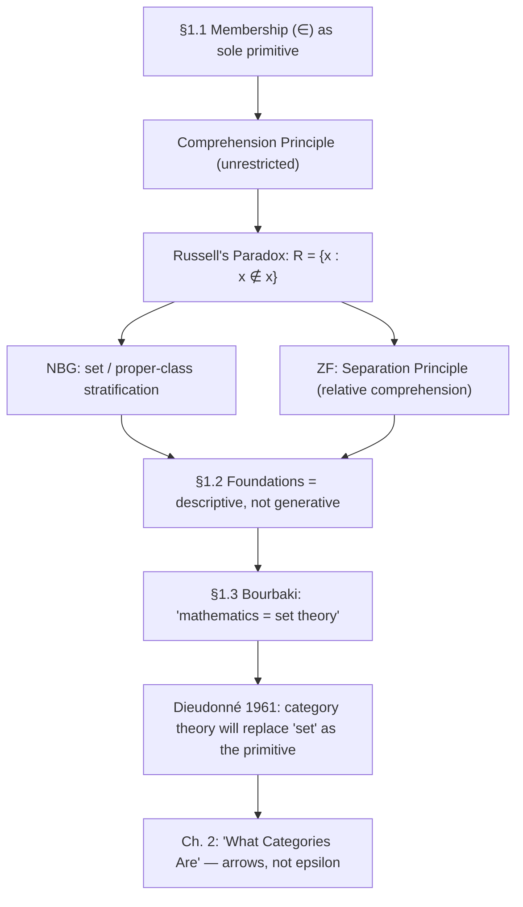

[[book-guidelines|↩ Back to guidelines]]

## Why the book starts here — and where it's secretly going

Goldblatt opens *Topoi* with a chapter that, on its face, is a standard tour of naive set theory: membership, comprehension, Russell's paradox, ZF and NBG. But the chapter title ends in a question mark — "Mathematics = Set Theory?" — and that question mark is doing real work. Goldblatt is not teaching you set theory so you can use it; he's teaching it to you so that later, in Chapter 2 onward, he can show you a *replacement* for it. The whole book's thesis (stated explicitly in the Prospectus, and echoed at the end of this chapter via a 1961 quote from Dieudonné) is that **function/arrow, not set membership, is the more fundamental mathematical primitive**. Chapter 1 exists to make you feel the weight of the orthodox position — "mathematics = set theory," per Bourbaki — before Chapter 2 starts dismantling it ("Arrows Instead of Epsilon").

So read this chapter with a double agenda: absorb the actual technical content (you'll need it — topos theory literally re-derives set-like structure from category axioms later in the book), but also notice *which parts of naive set theory turn out to be fragile*. That fragility — Russell's paradox — is the load-bearing fact of the chapter, and it rhymes strongly with a fragility you'll recognize from type theory: **Girard's paradox**, the fact that a naive "type of all types" is just as inconsistent as a naive "set of all sets." Keep that parallel in mind; it's the closing synthesis of this note.

## Membership: the one primitive everything else is built from

Goldblatt starts from a single relation, symbolized $\in$ (epsilon): "$x \in A$" reads "$x$ is a member (element) of $A$." Everything in the chapter — indeed, in classical set theory generally — is defined in terms of this one relation. Negation of membership is written $x \notin A$.

This is worth pausing on, because it's a genuinely minimal foundation: one binary relation, no other primitives. Compare this to how a type theory is built: a type theory doesn't start from a single relation either — it starts from **judgments** (`Γ ⊢ e : T`, "in context Γ, term e has type T") as the primitive notion, with membership-in-a-type ($e : T$) playing a role *structurally* analogous to $x \in A$, but crucially decorated with a *context* Γ and treated as a *syntactic, checkable judgment* rather than a semantic fact about a pre-existing universe of sets. That difference — judgment vs. relation-in-a-universe — is exactly the seed of the categorical program this book is building toward: a topos replaces "is $x$ a member of $A$?" with "is there an arrow $1 \to A$ picking out $x$?", which is a *judgment about existence of a morphism*, not a primitive metaphysical fact.

## Two ways to specify a set

Goldblatt gives two techniques for pinning down a set:

**(a) Tabular form** — list every element explicitly, in braces: $\{0, 1, 2, 3\}$ denotes the collection of whole numbers up to 3.

**(b) Set-builder form** — specify a *property* that all and only the elements share. This is the more powerful device, and it's codified in the chapter's central definition:

> **Principle of Comprehension.** If $\varphi(x)$ is a property or condition pertaining to objects $x$, then there exists a set whose elements are precisely the objects that have the property (or satisfy the condition) $\varphi(x)$.

Written: $\{x : \varphi(x)\}$, read "the set of all those objects $x$ such that $\varphi$ is true of $x$."

**[[Logical-Geometry#Grounding|Grounding]].** Tabular form is a Rust array or vector literal — an enumerated `Vec<T>` or a fixed `[T; N]`. Set-builder form is a *predicate closure* applied through `Iterator::filter`:

```rust
// Tabular form
let a: Vec<i32> = vec![0, 1, 2, 3];

// Set-builder form: {x : x ∈ universe ∧ φ(x)}
fn comprehend<T: Clone>(universe: &[T], phi: impl Fn(&T) -> bool) -> Vec<T> {
    universe.iter().filter(|x| phi(x)).cloned().collect()
}
```

Notice that Rust's version is *already* restricted — you must supply a `universe: &[T]` to filter over. You cannot write "all $x$ such that $\varphi(x)$" with no bound on where $x$ ranges, because Rust has no type that means "absolutely everything." This restriction is not a limitation of Rust; it is, as we'll see, exactly the fix that ZF set theory applies to Comprehension after Russell's paradox breaks the unrestricted version.

Goldblatt runs three worked examples of Comprehension building new sets from given ones:

- $\{x : x \in A \text{ and } x \in B\}$ — the **intersection** $A \cap B$
- $\{x : x \in A \text{ or } x \in B\}$ — the **union** $A \cup B$
- $\{x : x \notin A\}$ — the **complement** $-A$

## The empty set and extensionality

Applying Comprehension to a condition that no object can satisfy — $x \neq x$ — yields a set with no members, $\emptyset$. Goldblatt flags this as a genuine conceptual widening: you started thinking of sets as concrete collections *built up out of* their members, and now you must accept an object that has no constituents at all — a set as an abstract "thing-in-itself," not merely a container.

Uniqueness of $\emptyset$ follows from the chapter's second foundational principle:

> **Principle of Extensionality.** Two sets are equal if they have the same elements.

Two empty sets have (vacuously) the same elements — none — so there is only one empty set.

**Subsets**, defined via Extensionality: $A \subseteq B$ if every member of $A$ is also a member of $B$. This gives an equivalent, and very useful, formulation of set equality:
$$A = B \iff A \subseteq B \text{ and } B \subseteq A.$$
Proper subset: $A \subsetneq B$ means $A \subseteq B$ but $A \neq B$. Goldblatt proves $\emptyset \subseteq A$ for every $A$ by *vacuous truth* — if $\emptyset \not\subseteq A$, there would have to be an element of $\emptyset$ not belonging to $A$, but $\emptyset$ has no elements at all, so the antecedent of that implication can never be witnessed.

**Grounding.** Extensionality is precisely `PartialEq` derived structurally rather than nominally — two `HashSet<T>`s in Rust are `==` iff they contain the same elements, regardless of insertion order or internal representation. In Lean, extensionality for `Set α` (or `Finset α`) is a *theorem you must invoke explicitly* (`Set.ext`), because Lean's underlying equality is definitional/syntactic, not automatically "same elements ⟹ same set" — this is the first hint that "set" in a proof assistant is not a primitive the way $\in$ is here; it's *defined*, usually as a predicate `α → Prop`, and its equality has to be *proved* extensional, not assumed.

## Russell's Paradox: unrestricted Comprehension is inconsistent

Here is the chapter's central technical event, walked through exactly as Goldblatt presents it. Take the condition $x \notin x$ — "$x$ is not a member of itself." Most sets satisfy this ($\{0,1\}$ is not a member of itself). Comprehension licenses forming the **Russell set**:
$$R = \{x : x \notin x\}.$$
Now ask: does $R$ satisfy its own defining condition? I.e., is $R \notin R$?

- **Suppose $R \notin R$.** Then $R$ satisfies the condition "$x \notin x$," so by the very definition of $R$, $R$ belongs to the set defined by that condition — which is $R$ itself. So $R \in R$. Contradiction with the assumption.
- **Suppose $R \in R$.** Then $R$ is an element of $R$, so it must satisfy $R$'s defining condition, which is $x \notin x$. So $R \notin R$. Contradiction with the assumption.

Either assumption refutes itself and proves the other, so both $R \in R$ and $R \notin R$ are derivable — a direct contradiction. Discovered by Bertrand Russell in 1901, this broke Gottlob Frege's contemporaneous attempt to found arithmetic on a Comprehension Principle essentially identical to the one stated above, and precipitated what the chapter calls a foundational "crisis."

**Grounding — this is the paragraph the learning goals ask for.** This is *structurally the same argument* as **Girard's paradox** in type theory: if a type system has a type of all types that is a member of itself (a `Type : Type` rule, as early versions of Martin-Löf type theory and the original Automath briefly had), you can encode a Russell-style self-referential construction inside it and derive a term of the empty type — i.e., prove `False`. This is exactly why Lean, Coq, and Agda all reject `Type : Type` and instead use a **stratified, non-collapsing hierarchy** `Prop : Type 0 : Type 1 : Type 2 : ...`, where a term of `Type i` can never itself be a member of `Type i` — only of some strictly larger `Type j` with `j > i`. That stratification is doing *exactly* the job that ZF's Separation Principle and NBG's set/class distinction do below: it blocks the self-membership that the paradox needs, without needing to fully explain what a "condition pertaining to objects" is allowed to mean. If you're building a kernel type-checker, this is the reason your `Sort`/`Type` universe representation needs a level (a `Nat`, or more precisely a `Level` term with `max`/`imax` for universe polymorphism) attached to every `Type`, and needs universe-level constraints solved (an entire small constraint-satisfaction problem) during elaboration — that machinery exists *only* because Girard's paradox is Russell's paradox wearing a different notation.

```lean
-- Illegal in Lean (would need Type : Type, which Lean disallows):
--   axiom TypeInType : Type = Type  -- rejected by the kernel

-- Legal: a strict, non-collapsing hierarchy
#check (Type : Type 1)      -- `Type` (= `Type 0`) lives one level up, in `Type 1`
#check (Type 1 : Type 2)    -- and so on, forever — no level is ever a member of itself
```

```python
# A Python sketch of *why* you can't build R as an actual Python set:
# Python sets can't contain themselves (unhashable while under construction),
# so the paradox can't even be *stated* as a runtime object — it's blocked
# at the representation level, not by a proof. Naive set theory's Comprehension
# principle had no such representational guard, which is exactly the gap
# Russell exploited.
R = set()
try:
    R.add(R)          # TypeError: unhashable type: 'set'
except TypeError as e:
    print("blocked:", e)
```

## Two repairs: NBG's classes and ZF's Separation

Goldblatt sketches the two classical resolutions, both from the 1920s–30s:

**NBG (von Neumann–Bernays–Gödel).** Introduces a two-tier ontology: everything is a **class**; a class is a **set** specifically when it is itself a member of some other class. Classes that are not sets are **proper classes** — intuitively "too large" to be a member of anything. Comprehension is restricted to only quantify over *sets*:
$$\{x : x \text{ is a set and } \varphi(x)\}.$$
Redoing Russell's argument, $R = \{x : x \text{ is a set and } x \notin x\}$ turns out to prove only that $R$ is a **proper class** — not a set — so $R \notin R$ is simply *true*, with no contradiction, because the step that needed "$R$ is a set" to go through is now blocked.

**ZF (Zermelo–Fraenkel).** A one-sorted theory: everything is a set, all built up from $\emptyset$ by operations like $\cap$, $\cup$, complementation. Comprehension is replaced by the weaker:

> **Separation Principle.** Given a set $A$ and a condition $\varphi(x)$, there exists a set whose elements are precisely those members of $A$ that satisfy $\varphi(x)$: $\{x : x \in A \text{ and } \varphi(x)\}$.

You can no longer collect "all $x$ satisfying $\varphi$" from nowhere — you must already have a set $A$ to separate within. Redone: $R(A) = \{x : x \in A \text{ and } x \notin x\}$, and the only thing derivable is $R(A) \notin A$ — again no contradiction, because deriving one requires knowing $R(A) \in A$, which Separation never grants you for free.

Both repairs are the *same move* wearing different clothes: stop treating "collect everything satisfying $\varphi$" as unconditionally available. NBG stratifies by set-vs-class; ZF stratifies by "already inside a given set." This is precisely the shape of a **universe-level restriction** in a type checker, or a **stratified refinement-type system** that refuses to let a refinement predicate quantify over "all values of all types" — it must be indexed to a concrete, already-elaborated base type. If you're designing constraint generation for a refinement-type inference engine, this chapter is the ur-example of why unrestricted "form the set/type of all things satisfying this constraint" is the one move you must never allow your elaborator to perform without a bounding context.

Goldblatt closes this section by noting a genuine epistemic limit here, via Gödel (~1930): no proof of ZF's or NBG's consistency can be given using methods no more powerful than ZF/NBG themselves (this is exactly Gödel's second incompleteness theorem in miniature) — so freedom from *known* contradictions after 60+ years of study is evidence, not proof, of consistency. This is the same reason a **trusted kernel** in a proof assistant is designed to be small: you cannot get an internal certificate of the kernel's own soundness, so you minimize the amount of code you must trust externally rather than try to prove it away.

## §1.2 — What "foundations" is actually for

Goldblatt is careful to push back on a natural misreading: foundational systems are *not* the material out of which mathematics is literally constructed, chronologically. Mathematical content — his example is the real numbers, which can be *modeled* as infinite decimals, Dedekind cuts, or equivalence classes of Cauchy sequences, with none of these being "the" correct explanation — exists and is understood before any formal foundation is chosen for it. Axiomatization is **descriptive**, not generative: it clarifies the principles already implicitly governing mathematical practice, the way a grammar describes a language people already speak, rather than *creating* the language.

This matters for how you should read the rest of the book: when Goldblatt later gives an axiomatic definition of a topos, he is not asking you to accept sets-as-arrows on faith before you've seen why — true to the Preface's stated pedagogical stance ("move always from the particular to the general"), the definitions arrive only after the motivating examples.

## §1.3 — The Bourbaki thesis, and its refutation

Goldblatt then documents the high-water mark of "mathematics = set theory" as an actual historical program: Bourbaki's 40-year, multi-volume attempt (from 1935) at a "fully axiomatised presentation of mathematics in entirety," with *Book 1* devoted entirely to set theory as the framework for everything else. Paul Cohen (of continuum-hypothesis-independence fame) is quoted endorsing the same view: "the notion of 'set' is the most fundamental concept of mathematics."

But the chapter's final move is to undercut this from within, using the Bourbakistes' own later words. René Thom: the old Bourbaki hope that mathematical structures arise naturally from a hierarchy of sets "is, doubtless, only an illusion." And a 1961 quotation from Jean Dieudonné, reproduced in full, predicts a "second revolution" — after Cantor/Hilbert's revolution of axiomatizing everything via sets — that will *release mathematics from the too-narrow conditions of 'set'*, replacing it with "the theory of categories and functors." That is the book's actual thesis statement, planted at the very end of Chapter 1, and it is the reason Chapter 2 is titled to directly contradict Chapter 1's title: not "What Sets Are" but "What Categories Are."

## Where this leads



This chapter is the book's foil, not its foundation in the sense the title implies. Everything technical in it — $\in$, Comprehension, Extensionality, subsets — reappears later in the book *recovered categorically*: Chapter 3 shows how monic arrows recover injectivity without elements, and Chapter 4's subobject classifier recovers the subset/characteristic-function correspondence as a categorical universal property, with no primitive $\in$ anywhere in sight. What you should carry forward is not just the set-theoretic vocabulary (you'll need it as a point of comparison throughout) but the *shape* of the Russell's-paradox story: an unrestricted "collect everything satisfying a condition" primitive is always the crack a self-reference argument will find, whether the ambient theory calls its primitive $\in$ or `:`. Every stratification device you'll meet later — universe levels in Lean's kernel, the set/class split here, ZF's Separation, and eventually a topos's own internal restrictions on what counts as a legitimate "subobject" — is a variation on the same fix: comprehension must always be *relative to something already constructed*, never absolute.
