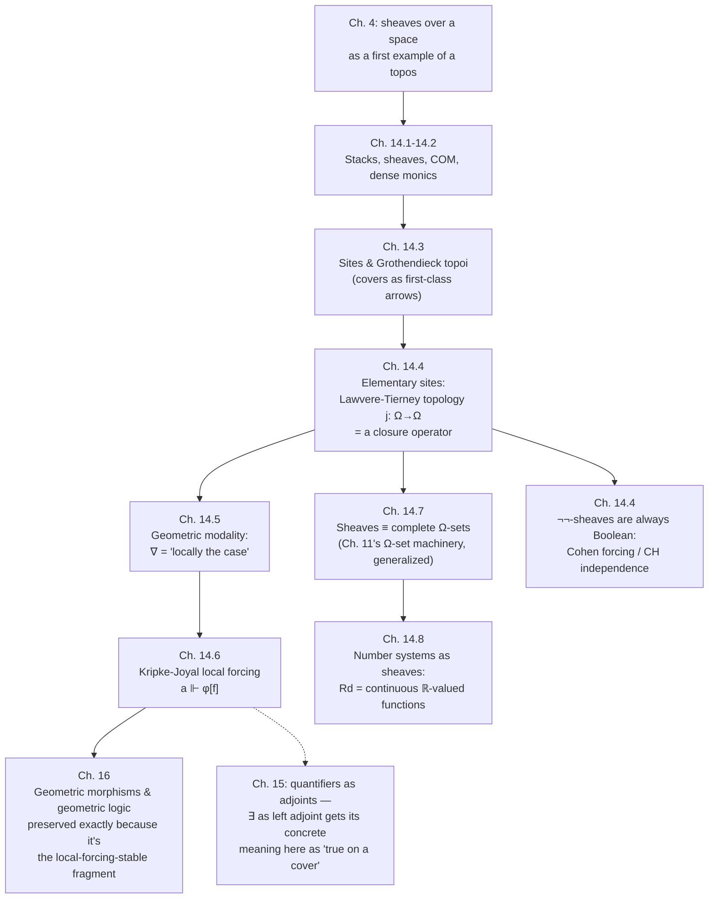

[[book-guidelines|↩ Back to guidelines]]

## Why "true" needs an address

Every topos-theoretic idea up to this point has treated truth as something a proposition simply *has*, evaluated once and for all against a fixed object $\Omega$ of truth-values. Chapter 10 already complicated that picture for presheaves over a poset — truth grew monotonically with the stage $p$ — but the poset there was an abstract index of "information states," disconnected from any concrete geometric intuition. Chapter 14 goes back to where sheaf theory actually came from — algebraic geometry and the topology of a space $I$ — and asks a sharper question: what does it mean for a statement to be true *on an open set*, when "true everywhere on a neighborhood of every point" and "true, full stop" can come apart?

Here's the concrete failure mode that motivates the whole chapter. Take a topological space $I$ and a property like "$f$ is locally constant" for a function $f$ defined on some open $V \subseteq I$. This is emphatically *not* the same as "$f$ is constant" — $f$ can take different values on different pieces of $V$, as long as each point has a neighborhood on which $f$ doesn't move. "Locally constant" is a statement that's true of $V$ exactly when $V$ can be *covered* by opens on each of which the plain, unlocalized statement holds. This pattern — a statement being verifiable by checking it on a cover, then gluing the local verifications into a single global fact — turns out to be *the* mechanism underneath sheaves, and Goldblatt's aim in this chapter is to show that mechanism is itself expressible as first-order topos-theoretic structure: a single arrow $j : \Omega \to \Omega$, called a **topology**, that reads "it is locally the case that."

This matters for the book's arc for a very concrete reason: it is where topos theory reconnects with its *literal historical origin*. Grothendieck topoi were invented to do algebraic geometry, not epistemic logic — sheaves of sections over open sets, glued from local data, are the primordial example, and everything from Chapter 4's "sheaves over a topological space as a topos" onward has been building toward this reunification. The chapter's epigraph, from F. W. Lawvere, states the punchline before proving it: *"a Grothendieck topology appears most naturally as a modal operator, of the nature 'it is locally the case that.'"*

## §14.1 — Stacks and sheaves over a base category

### The setup: opens as a category

Let $I$ be a topological space with $\mathfrak{O}$ its collection of open subsets. Ordering $\mathfrak{O}$ by inclusion turns it into a **poset category**: objects are opens, and there is exactly one arrow $U \hookrightarrow V$ whenever $U \subseteq V$.

**Definition (stack / presheaf).** A *stack* (or *presheaf*) over $I$ is a contravariant functor $F : \mathfrak{O} \to \mathbf{Set}$. So $F$ assigns to each open $V$ a set $F(V)$, and to each inclusion $U \subseteq V$ a *restriction* function
$$
F^V_U : F(V) \to F(U)
$$
(note the direction reversal — this is where "contravariant" earns its keep: a bigger open gets mapped to a *smaller* set of restricted data), satisfying
$$
F^V_V = \mathrm{id}_V, \qquad U \subseteq V \subseteq W \implies F^W_U = F^V_U \circ F^W_V.
$$

Think of $F(V)$ as "the data available over $V$," and $F^V_U$ as "throw away everything outside $U$." The canonical example: fix a sheaf of germs $f : A \to I$ (Chapter 4's bundle picture) and let $F_f(V)$ be the set of *local sections* of $f$ over $V$ — continuous $s : V \to A$ with $f \circ s = \mathrm{id}_V$. Restriction is literal function restriction, $s \mapsto s|_U$. This is the etymological origin of "stack": sections over $I$, layered by which open they live over.

### The gluing axiom: what makes a stack a *sheaf*

A stack alone doesn't guarantee you can reconstruct global data from local pieces — that's an extra condition, and it's the heart of the chapter. Suppose $\{V_x : x \in X\}$ is an **open cover** of $V$ (i.e. $V = \bigcup_x V_x$), and you're handed elements $s_x \in F(V_x)$ for every $x$. When do these patch into a single $s \in F(V)$ with $s|_{V_x} = s_x$ for all $x$?

Necessarily, whenever two of the pieces overlap they'd better agree there — $s_x$ and $s_y$ must restrict to the same thing on $V_x \cap V_y$. Goldblatt calls this being **pairwise compatible**:
$$
F^{V_x}_{V_x \cap V_y}(s_x) = F^{V_y}_{V_x \cap V_y}(s_y) \quad \text{for all } x, y \in X.
$$

**Definition (COM — the sheaf condition).** A stack $F$ satisfies **COM** if: for every open cover $\{V_x : x \in X\}$ of $V$, and every pairwise-compatible family $\{s_x \in F(V_x)\}_{x \in X}$, there is *exactly one* $s \in F(V)$ with $F^V_{V_x}(s) = s_x$ for all $x$.

A stack satisfying COM is a **sheaf**. Existence is the *gluing* half (local data assembles into global data); uniqueness is the *separation* half (global data is fully determined by its restrictions — no phantom ambiguity survives gluing). The full subcategory of stacks satisfying COM is written $\mathbf{Sh}(I)$.

**What breaks without COM.** Take $I = \{0,1\}$ with the discrete topology, so $\mathfrak{O} = \mathcal{P}(I)$. Let $F(U) = \{0,1\}$ for every open $U$, with every restriction map collapsing everything to $0$. Cover $I$ by $\{\{0\},\{1\}\}$ and pick $s_{\{0\}} = 0$, $s_{\{1\}} = 1$ — trivially compatible, since the overlap is empty. But no single $s \in F(I) = \{0,1\}$ restricts to $0$ on $\{0\}$ *and* $1$ on $\{1\}$ under a restriction map that's constant. This $F$ is a stack, but not a sheaf: it has local data that refuses to glue. (Goldblatt sets this as Exercise 3.)

The book proves (Exercises 5–14) that $\mathbf{Sh}(I)$ is equivalent to the category $\mathbf{Top}(I)$ of sheaves of germs from Chapter 4 — sheaves-as-sections and sheaves-as-étale-bundles are two faces of the same object, related by taking stalks (a colimit construction over neighborhoods of a point $i$) and taking sections back out. This equivalence is why "the topos of sheaves over a space" is unambiguous regardless of which picture you start from.

**[[Logical-Geometry#Grounding|Grounding]].** In Rust, model a presheaf as a trait over a poset of "regions":

```rust
trait Presheaf {
    type Region: PartialOrd + Clone;
    type Data: Clone + PartialEq;

    /// F(V): what data is attached at region V.
    fn at(&self, v: &Self::Region) -> Self::Data;

    /// F^V_U: restrict data from V down to a smaller U ⊆ V.
    fn restrict(&self, data: &Self::Data, from: &Self::Region, to: &Self::Region) -> Self::Data;
}

/// The sheaf condition COM, checked operationally for a finite cover.
fn glues<P: Presheaf>(
    presheaf: &P,
    cover: &[P::Region],
    pieces: &[P::Data],
    target: &P::Region,
) -> Option<P::Data> {
    // pairwise compatibility check omitted for brevity — in a real sheaf,
    // this is where COM either finds a unique glued value or the data
    // was never a legitimate section to begin with.
    presheaf.at(target).into() // placeholder: the real glue is COM's job
}
```

This is exactly the shape of an incremental compiler's module cache: `F(V)` is "the elaborated interface visible from module `V`," restriction is "what a submodule sees," and the sheaf condition is precisely *separate compilation is sound* — if two translation units agree on their shared interface, there is a unique consistent global view. A presheaf that fails COM is a build system where two files can each individually type-check against a shared header but produce mutually inconsistent global state — the exact failure mode incremental/modular compilation has to rule out.

In Lean, the closest literal analogue is a `Sheaf` in Mathlib's category theory library, built from `Presheaf` plus a `Sieve`-based sheaf condition — same shape as $\mathrm{COM}$, phrased categorically instead of point-set-theoretically; we'll meet sieves properly in §14.3.

## §14.2 — Classifying stacks and sheaves: two different $\Omega$'s

Every topos has a subobject classifier $\Omega$, and $\mathbf{St}(I) \simeq \mathbf{Set}^{\mathfrak{O}^{\mathrm{op}}}$ is a topos (a presheaf category, per Chapter 10), so it has one too — but $\mathbf{Sh}(I)$, sitting *inside* $\mathbf{St}(I)$ as the full subcategory of gluing stacks, needs its *own*, different $\Omega$. Working both out, and relating them, is the technical core of this section.

### $\Omega$ for stacks: cribles

**Definition (crible).** For open $V$, let $\mathfrak{O}_V = \{U \in \mathfrak{O} : U \subseteq V\}$. A collection $C \subseteq \mathfrak{O}_V$ is a **$V$-crible** (a.k.a. sieve on $V$) if it's downward closed: $U \in C$ and $W \subseteq U$ implies $W \in C$.

The classifier for stacks is
$$
\Omega(V) = \{C : C \text{ is a } V\text{-crible}\}, \qquad \Omega^V_U(C) = C \cap \mathfrak{O}_U,
$$
with $\mathrm{true}_V(0) = \mathfrak{O}_V$ (the largest crible on $V$). Given a monic $\tau : F \rightarrowtail G$, its character $\chi_\tau$ sends $x \in G(V)$ to the crible of all $U \subseteq V$ at which $x$'s restriction lands back in $F(U)$ — i.e. the crible records *exactly how far down you have to localize* before the ambient element $x$ becomes an element of the subobject.

$\Omega(V)$, ordered by inclusion, is a Heyting algebra (Exercise 4) — this is the same phenomenon as Chapter 10's up-sets: truth-values are *regions of validity*, not bare booleans.

### $\Omega$ for sheaves: opens themselves

In $\mathbf{Sh}(I)$ the classifier is simpler-looking but semantically richer:
$$
\Omega_j(V) = \mathfrak{O}_V, \qquad \mathrm{true}_{j,V}(0) = V,
$$
i.e. the truth-value of a subsheaf at $V$ *is* the largest open subset of $V$ on which membership actually holds. "Truth" here is literally geometric extent. (Applying the sheaf-of-sections $\to$ sheaf-of-germs functor to $\Omega_j$ recovers exactly the classifier for $\mathbf{Top}(I)$ from Chapter 4 — germs of open subsets.)

### The map that connects them: $j_\Omega$

Define $j_V : \Omega(V) \to \Omega(V)$ (note: landing back in *cribles*, not directly in opens) by
$$
j_V(C) = \bigcup C \quad \text{(the union of all opens belonging to the crible } C\text{)}.
$$
Exercises 8–18 establish a cluster of algebraic facts about $j_V$: it's inflationary ($C \subseteq j_V(C)$), idempotent ($j_V(j_V(C)) = j_V(C)$), and meet-preserving ($j_V(C \cap D) = j_V(C) \cap j_V(D)$, hence monotone). A crible fixed by $j_V$ is exactly a **principal crible** $\mathfrak{O}_U$ for some open $U$ — and $j_V(C) = \mathfrak{O}_V$ (i.e. $C$ is sent to the *top* element) precisely when $C$ *covers* $V$, i.e. $\bigcup C = V$.

**This is the crux.** $j_V(C)$ answers: "assuming everything in $C$, what's the largest open on which we're licensed to say membership holds?" And $j_V(C) = \top$ exactly when $C$ already covers $V$ — i.e. when the local witnesses in $C$ are, collectively, *as good as* a global witness. The equalizer of $j_\Omega$ and $\mathrm{id}_\Omega$ in $\mathbf{St}(I)$ is (isomorphic to) exactly $\Omega_j$: the sheaf classifier is the sub-object of the stack classifier consisting of cribles that are already principal, i.e. already "as good as an open."

### Density and the Lawvere characterization

**Definition (dense monic).** A monic $\tau : F \rightarrowtail G$ in $\mathbf{St}(I)$ is **dense** if $J(\tau) = 1_G$ in $\mathrm{Sub}(G)$, where $J$ is the closure operator on subobjects induced by $j_\Omega$ (pulling `true` back along $j_\Omega \circ \chi_\tau$). Concretely: $\tau$ is dense iff for every $V$ and every $x \in G(V)$, the crible $\{U : x|_U \in F(U)\}$ *covers* $V$ — every element of $G$ is *locally* an element of $F$, even if not globally.

**Theorem (Lawvere).** A stack $H$ is a sheaf iff for every arrow $\sigma : F \to H$ and every dense monic $\tau : F \rightarrowtail G$, there is a unique $\sigma' : G \to H$ with $\sigma' \circ \tau = \sigma$.

In words: $H$ is a sheaf exactly when every map *into* $H$ extends uniquely across any inclusion where the smaller domain is dense in the larger one. This is a purely arrow-theoretic reformulation of COM — no elements, no covers, just a universal-extension property — and it's *this* form of the sheaf condition that generalizes cleanly beyond topological spaces, which is exactly what §14.3 needs. Tierney showed the whole characterization theorem follows from three algebraic facts about $j_\Omega$ alone: $j_\Omega \circ j_\Omega = j_\Omega$ (idempotence), $j_\Omega$ order-preserving, and $j_\Omega \circ \mathrm{true} = \mathrm{true}$. Any operator on any Heyting algebra satisfying these three laws — Goldblatt names it a **local operator** — supports the same "sheaf via density" story. Exercise 23 flags a second example immediately: on *any* Heyting algebra, double negation $\neg\neg$ is a local operator. That's not a coincidence; it's foreshadowing §14.4's most important example.

## §14.3 — Grothendieck topoi: sites and pretopologies

Grothendieck's insight (with the SGA4 collaborators) was that everything in §14.1–14.2 only used three formal properties of "open cover," none of which mention topology per se:

- **(A)** $\{V\}$ covers $V$ (reflexivity — a cover of one thing by itself).
- **(B)** Covers compose: if $\{V_x\}$ covers $V$ and each $\{V^x_y\}_y$ covers $V_x$, the combined family covers $V$ (transitivity).
- **(C)** Covers pull back: if $\{V_x\}$ covers $V$ and $U \subseteq V$, then $\{U \cap V_x\}$ covers $U$ (stability — restricting a cover along an inclusion still covers).

**Definition (pretopology, site).** A **pretopology** on a category $\mathscr{C}$ assigns to each object $a$ a collection $\mathrm{Cov}(a)$ of families of arrows into $a$ ("covers of $a$"), satisfying the arrow-theoretic analogues of (A)–(C):

- $\{1_a : a \to a\} \in \mathrm{Cov}(a)$.
- If $\{f_x : a_x \to a\}_{x \in X} \in \mathrm{Cov}(a)$ and each $\{g_y : a_y^x \to a_x\}_{y \in Y_x} \in \mathrm{Cov}(a_x)$, then $\{f_x \circ g_y\} \in \mathrm{Cov}(a)$.
- If $\{f_x : a_x \to a\} \in \mathrm{Cov}(a)$ and $g : b \to a$ is any arrow, all the pullbacks $a_x \times_a b$ exist, and the projections $\{a_x \times_a b \to b\} \in \mathrm{Cov}(b)$.

A **site** is a pair $(\mathscr{C}, \mathrm{Cov})$. This is a strictly *category-theoretic* replacement for "topological space": instead of a lattice of opens with a fixed union-based notion of covering, you get to choose, arrow by arrow, which families count as "jointly surjective enough."

**Sheaves over a site.** A stack (presheaf) $F : \mathscr{C} \to \mathbf{Set}$ satisfies COM over the site if, for every cover $\{a_x \to a\} \in \mathrm{Cov}(a)$ and pairwise-compatible family $s_x \in F(a_x)$ (compatibility checked via the pullbacks $a_x \times_a a_y$), there's a unique gluing $s \in F(a)$. The full subcategory of sheaves is $\mathbf{Sh}(\mathrm{Cov})$.

**Definition (Grothendieck topos).** Any category equivalent to $\mathbf{Sh}(\mathrm{Cov})$ for some site.

### Cribles, generalized

The crible construction from §14.2 transplants verbatim: an **$a$-crible** is a collection $C$ of arrows into $a$, closed under precomposition ($f \in C \implies f \circ g \in C$ for any composable $g$). The classifier $\Omega(a) = \{a\text{-cribles}\}$, and the analogous map $j_{\mathrm{Cov}} : \Omega \to \Omega$ sends a crible $C$ to the crible of all $b \to a$ that become "covered from within $C$" after some further cover. The same three algebraic laws hold, and the same Lawvere-style characterization of sheaves goes through unchanged. Crucially, *different pretopologies can yield the same sheaf category* — but this happens exactly when they induce the *same* $j_{\mathrm{Cov}}$. So the truly canonical invariant isn't the pretopology itself but the arrow $j_{\mathrm{Cov}} : \Omega \to \Omega$ it induces — which is precisely the seed of the next section's elementary, topos-internal definition.

**Grounding.** A site is a Rust `trait` for "what counts as a covering set of sub-derivations":

```rust
trait Site {
    type Object;
    type Arrow; // an arrow into some Object — think "a witnessing derivation into a goal"

    /// Cov(a): which families of arrows into `a` count as jointly-exhaustive.
    fn covers(&self, a: &Self::Object) -> Vec<Vec<Self::Arrow>>;
}
```

The Lean-flavored reading is the more load-bearing one: a Grothendieck topology is what you'd reach for if you wanted to formalize "a proof obligation is discharged once you've produced *enough* sub-obligations, even without a single monolithic proof term" — case splits in a tactic proof are literally a cover of the goal by the case arrows, and soundness of `cases`/`rcases` is exactly the claim that the case-split family is a genuine cover (jointly exhaustive, pairwise well-typed on overlaps). This is not a stretch: Grothendieck topologies are the standard categorical semantics underlying *proof by cases* and, more generally, underlying the model theory of geometric theories that Chapter 16 will use to build classifying topoi for logical theories.

## §14.4 — Elementary sites: internalizing the topology

Everything so far quantified over covers — an *external*, set-theoretic apparatus. Goldblatt now strips it down to a single first-order-expressible arrow, staying entirely inside one fixed elementary topos $\mathscr{E}$.

**Definition (topology on a topos).** A **topology** on an elementary topos $\mathscr{E}$ is an arrow $j : \Omega \to \Omega$ satisfying:

$$
\textbf{(A)}\ j \circ \mathrm{true} = \mathrm{true} \qquad \textbf{(B)}\ j \circ j = j \qquad \textbf{(C)}\ j \circ \cap = \cap \circ (j \times j)
$$

(where the last says $j(a \wedge b) = j(a) \wedge j(b)$ using $\Omega$'s internal meet). The pair $\mathscr{E}_j = (\mathscr{E}, j)$ is an **elementary site**. This is the **Lawvere–Tierney topology** — the modern, minimal axiomatization that subsumes both $j_\Omega$ (§14.2) and $j_{\mathrm{Cov}}$ (§14.3) as special cases, and also captures examples with *no* covering-family intuition behind them at all.

Goldblatt proves (Theorem 1) that axiom (A) can be *simplified* to just $j \circ \mathrm{true} = \mathrm{true}$ without separately requiring the crible-style condition from Exercise 14.3.10 — a nice payoff of moving to the purely arrow-theoretic phrasing.

### Closure operators, dense monics, sheaves — the general pattern

Exactly as before: $j$ induces a **closure operator** $J$ on $\mathrm{Sub}(d)$ for every object $d$ — $J(f)$ is obtained by pulling `true` back along $j \circ \chi_f$ — satisfying $f \sqsubseteq J(f)$, $J(J(f)) = J(f)$, and monotonicity. A monic $f$ is **$j$-dense** if $J(f) = 1_d$; equivalently, $j \circ \chi_f = \mathrm{true}_d$. An object $b$ is a **$j$-sheaf** if every arrow $g : a \to b$ extends uniquely along every dense monic $a \rightarrowtail d$.

**Three worked examples of topologies:**

1. **$j = 1_\Omega$** (the identity). Every monic is trivially dense ($J(f) = f$), and *every* object is a $j$-sheaf — the "finest" topology, imposing no gluing discipline at all, recovers $\mathscr{E}$ itself as $\mathbf{sh}_j(\mathscr{E})$.
2. **$j = \mathrm{true} \circ !_\Omega$** (the constant-true map). Now $\chi_{J(f)} = \mathrm{true}$ *always*, so only the maximal subobject $1_d$ is dense over itself, and the only $j$-sheaves are the terminal objects — the "coarsest" nontrivial topology, collapsing everything.
3. **$j = \neg\neg$** — **the double-negation topology**, definable on *any* topos whatsoever (Exercise 5, foreshadowed by Exercise 14.2.23). A monic $f$ is $\neg\neg$-dense exactly when $f \vee \neg f = 1_d$ in $\mathrm{Sub}(d)$ — i.e. when $f$'s complement, together with $f$ itself, already exhausts $d$.

**Theorem (Lawvere–Tierney).** For any elementary site $\mathscr{E}_j$, the full subcategory $\mathbf{sh}_j(\mathscr{E})$ of $j$-sheaves is itself an elementary topos, and there is a **sheafification** functor $\mathscr{A}_j : \mathscr{E} \to \mathbf{sh}_j(\mathscr{E})$, left-adjoint-like in spirit (identity on sheaves, preserving all finite limits) that freely repairs any object into the best sheaf approximating it.

*(This is why every Grothendieck topos is automatically an elementary topos — §14.3's $j_{\mathrm{Cov}}$ is a Lawvere–Tierney topology on the presheaf topos, and $\mathbf{Sh}(\mathrm{Cov}) = \mathbf{sh}_{j_{\mathrm{Cov}}}(\mathbf{St}(\mathscr{C}))$.)*

The double-negation case is the star result: $\mathbf{sh}_{\neg\neg}(\mathscr{E})$ is **always a Boolean topos**, regardless of how non-Boolean $\mathscr{E}$ itself is — sheafifying with respect to double negation is a canonical, functorial way to *classicize* an intuitionistic universe. This is exactly the categorical machinery Tierney used to reprove the independence of the Continuum Hypothesis (mirroring Cohen's forcing) and that Marta Bunge later used for Souslin's Hypothesis — Cohen forcing, reinterpreted, *is* the passage from a presheaf to its associated double-negation sheaf.

**Grounding — the closure-operator connection to your project.** This is worth pausing on, because it's not a stretched analogy: **a Lawvere–Tierney topology $j : \Omega \to \Omega$ is, mathematically, exactly a closure operator on a Heyting/Boolean algebra of "truths"** — inflationary, idempotent, meet-preserving. That is *precisely* the definition of an abstract-interpretation closure operator (Cousot & Cousot): given a concrete lattice of properties, an abstraction is a monotone, idempotent, inflationary map that rounds a property up to the best representable over-approximation. The interval abstraction $\iota$ on $\mathcal{P}(\mathbb{Z})$ — sending a set of integers to the smallest enclosing interval — satisfies exactly (A)–(C) reindexed: $\iota(\{n\}) \supseteq \{n\}$ (inflationary/true-preserving), $\iota(\iota(S)) = \iota(S)$ (idempotent), and $\iota$ commutes with meet on the abstract side by construction of a Galois connection. In Rust:

```rust
/// A Lawvere–Tierney-style closure operator on a lattice of "known facts."
/// (A) j(true) = true   (B) j(j(x)) = j(x)   (C) j(x ∧ y) = j(x) ∧ j(y)
trait Topology {
    type Fact: PartialEq + Clone;
    const TRUE: Self::Fact;

    fn j(&self, x: &Self::Fact) -> Self::Fact;
    fn meet(&self, a: &Self::Fact, b: &Self::Fact) -> Self::Fact;

    fn is_dense(&self, x: &Self::Fact) -> bool {
        self.j(x) == Self::TRUE
    }
}

/// Interval abstraction as a topology on subsets of i64.
struct IntervalAbstraction;
impl Topology for IntervalAbstraction {
    type Fact = std::ops::RangeInclusive<i64>;
    const TRUE: Self::Fact = i64::MIN..=i64::MAX;
    fn j(&self, x: &Self::Fact) -> Self::Fact { x.clone() } // already closed
    fn meet(&self, a: &Self::Fact, b: &Self::Fact) -> Self::Fact {
        (*a.start()).max(*b.start())..=(*a.end()).min(*b.end())
    }
}
```

The double-negation topology's role as "the canonical classicizer" is the exact categorical shadow of what a *sound-but-incomplete* abstract interpreter is doing every time it widens: it's sheafifying with respect to a coarser closure operator to guarantee termination/decidability, at the cost of collapsing some genuinely intuitionistic (undecidable, path-sensitive) distinctions into a Boolean (decidable, over-approximated) ones. When your invariant-generation engine picks an abstract domain, it is — in this precise categorical sense — picking a Lawvere–Tierney topology on the lattice of program facts, and the sheaves for that topology are exactly the *representable* (i.e. algorithmically checkable) invariants.

## §14.5 — The geometric modality: "locally the case that"

With $j$ established as a closure operator, Goldblatt reads it as a **modal operator**. Extend the sentential language of Chapter 6 with a new connective $\nabla$ ("it is locally the case that"), interpreted on an elementary site $\mathscr{E}_j$ by
$$
V(\nabla \alpha) = j \circ V(\alpha).
$$
The resulting logic $J$ (Detachment plus the intuitionistic axioms of Chapter 8 plus modal schemata including $\nabla \nabla \alpha \Rightarrow \nabla \alpha$, matching $j \circ j = j$) is complete for validity across *all* elementary sites — a genuine modal logic riding on top of intuitionistic propositional logic, where necessity means "true after localizing."

Two concrete instances make "locally" precise:

- **Point-based reading.** Introduce a "closeness" relation $p \prec q$ ("$q$ is close to $p$") on a poset of stages, with $\nabla \alpha$ true at $p$ iff $\alpha$ holds at every $q$ close to $p$ — literally "$\alpha$ holds throughout an infinitesimal neighborhood of $p$," made rigorous via Abraham Robinson's non-standard topology (the *monad* of a point, the set of points infinitely close to it).
- **Cover-based reading.** Assign to each stage $p$ a collection $\mathrm{Cov}(p)$ of "covers," with $\nabla \alpha$ true at $p$ iff $\alpha$ holds throughout *some* cover of $p$. Instantiated at $j_\Omega$ this recovers exactly §14.2's "true on a covering crible" reading; instantiated at $\neg\neg$ it recovers Lawvere's own gloss on that topology as **"it is cofinally the case that"** — $S$ cofinal in $[p)$ meaning every stage after $p$ has a further stage in $S$, which is the *forcing*-flavored reading of double negation familiar from set-theoretic independence proofs.

Both readings validate the same axiom system $J$, and the point-based structure is shown to embed canonically into the cover-based one — the two notions of locality Goldblatt has been building since §14.1 (germs-at-a-point vs. sections-over-an-open) turn out to be *definitionally* the same modality, just approached from opposite ends.

## §14.6 — Kripke–Joyal (local) semantics

This is the payoff that makes all the machinery *usable*: a recursive semantic clause set, due to André Joyal, that tells you how to evaluate any first-order formula "locally" at a stage of a site — generalizing both Kripke's forcing (Chapter 8) and the sheaf-theoretic sense of local truth from §14.1–14.5 into one recipe.

The seed observation: an equation "$s = t$" between sections of a sheaf over $V$ is true iff it's *locally* true — true on some cover of $V$. And more strikingly, existential statements inherit this: given a map of sheaves $h : A \to B$ and a section $t \in F_g(V)$, the statement "$\exists s\, (h \circ s = t)$" holds over $V$ **precisely when** there's a cover $\{V_x\}$ of $V$ and local witnesses $s_x \in F_f(V_x)$ with $h \circ s_x = t|_{V_x}$ on each piece — you need not find *one* global witness, only a *jointly-covering family of local ones*.

Joyal generalizes this to arbitrary sites $(\mathscr{C}, \mathrm{Cov})$. Write $a \Vdash \varphi[f, g]$ for "the formula $\varphi(v_1, v_2)$, instantiated by arrows $f, g$ into $a$, is forced at stage $a$." The clauses:

$$
a \Vdash \exists v_2\, \varphi[f] \iff \text{there is a cover } \{a_x \to a\} \text{ and arrows } g_x \text{ with } a_x \Vdash \varphi[f \circ f_x, g_x] \text{ for all } x
$$
$$
a \Vdash \varphi \vee \psi\,[f] \iff \text{there is a cover } \{a_x \to a\} \text{ with, for each } x,\ a_x \Vdash \varphi[f \circ f_x] \text{ or } a_x \Vdash \psi[f \circ f_x]
$$
$$
a \Vdash \varphi \Rightarrow \psi\,[f] \iff \text{for any } a_x \xrightarrow{f_x} a,\ a_x \Vdash \varphi[f \circ f_x] \implies a_x \Vdash \psi[f \circ f_x]
$$
$$
a \Vdash \forall v_2\, \varphi[f] \iff \text{for all } a_x \xrightarrow{f_x} a \text{ and all } g_x : a_x \to c,\ a_x \Vdash \varphi[f \circ f_x, g_x]
$$

and, tying it all together, the **local character of truth** itself:
$$
a \Vdash \varphi[f] \iff \text{for some cover } \{a_x \to a\},\ a_x \Vdash \varphi[f \circ f_x] \text{ for all } x.
$$

This last clause is the deepest one: it says forcing at $a$ is *itself* determined by forcing at any cover of $a$ — truth is entirely a local phenomenon, recursively, all the way down. Goldblatt notes the family resemblance to **Beth models** (which use one fixed domain $A$ with existentials witnessed only "eventually," across a *bar* — a covering-like structure on stages — rather than Kripke's per-stage-varying domain), and suggests "Beth–Joyal semantics" might be the more accurate name, since $\vee$ and $\exists$ get this genuinely non-Kripkean, cover-relative reading.

**Why this is load-bearing for your project.** Kripke–Joyal forcing is the semantic template for *any* checking discipline where "is this obligation discharged" is answered not by a single monolithic derivation but by "yes, modulo refining the problem into subgoals that jointly cover it, each individually dischargeable." This is exactly the shape of:

- **CEGAR** (counterexample-guided abstraction refinement): a claim is "locally forced" at the current abstraction; if it fails, you refine — pass to a *finer cover* of the state space (split the abstract region) — and re-check locally there. The Kripke–Joyal clause for $\exists$ is literally "produce a cover and a local witness on each piece," which is the CEGAR loop's spatial-splitting step stated in one line of category theory.
- **Case-based proof search / tactic combinators**: `∨`'s forcing clause — true at $a$ iff some cover splits $a$ into pieces each individually forcing one disjunct — is the semantic justification for why splitting a goal into cases and discharging each case separately is *sound*, without needing one uniform proof across all cases.
- **Metavariable-driven elaboration**: when an elaborator can't yet decide which branch of an implicit resolution to commit to, "locally valid modulo further constraint-solving" is precisely a forcing-style judgment — $a \Vdash \varphi$ where $a$ ranges over not-yet-fully-solved metavariable contexts, refined (covered) as unification proceeds. The recursive local-character clause is the semantic reason partial elaboration states can be treated as provisionally, locally correct.

## §14.7 — Sheaves as complete $\Omega$-sets

Chapter 11 (§11.9) introduced **$\Omega$-sets**: a set $A$ equipped with an $\Omega$-valued (partial) equality $[\![x \approx y]\!] \in \Omega$ for a complete Heyting algebra $\Omega$, generalizing Boolean-valued models of set theory. This section reveals that *sheaves are exactly the complete $\Omega$-sets* — turning the geometric picture of §14.1 into pure order theory.

**Definition (singleton).** For an $\Omega$-set $A$, a **singleton** is a function $s : A \to \Omega$ satisfying (numbering follows §11.9's conditions (vii)–(x)):

$$
\text{(i)}\ s(x) \sqsubseteq [\![x \approx x]\!], \qquad \text{(ii)}\ s(x) \sqcap [\![x \approx y]\!] \sqsubseteq s(y), \qquad \text{(iii)}\ s(x) \sqcap s(y) \sqsubseteq [\![x \approx y]\!]
$$

for all $x, y \in A$. Intuitively, $s(x)$ is "the degree to which $x$ is *the* element being picked out" — a fuzzy, extent-valued pointer. Each genuine element $a \in A$ gives the *actual* singleton $\{a\}$, defined by $\{a\}(x) = [\![x \approx a]\!]$.

**Definition (complete $\Omega$-set).** $A$ is **complete** if every singleton is $\{a\}$ for a *unique* $a \in A$ — i.e. every "fuzzy pointer" resolves to an actual element.

**Worked example.** Let $\Omega = \mathfrak{O}$, the opens of a space $I$. For any topological space $X$, form the $\mathfrak{O}$-set $C_X$ of continuous *partial* functions $f : V \to X$ (any open $V$), with $[\![f \approx g]\!]$ the largest open on which $f$ and $g$ agree. Goldblatt shows directly that $C_X$ is complete: given a singleton $s : C_X \to \mathfrak{O}$, restrict each $f$ to $s(f)$; conditions (ii)–(iii) force these restrictions to be pairwise compatible in the COM sense, so they *glue* (this is literally the sheaf gluing axiom, now derived from the $\Omega$-set axioms alone) into a single $a_s \in C_X$ with $\{a_s\} = s$. Completeness of an $\Omega$-set is COM in disguise.

This lets Goldblatt define an abstract **restriction operation** purely algebraically: for $a \in A$ complete and $p \in \Omega$, $\{a\} \restriction p$ (meaning $x \mapsto s(x) \sqcap p$) is again a singleton, so there's a unique $a \restriction p \in A$ realizing it — "restricting $a$ to the sub-extent $p$," with no reference to opens or spaces at all. This operation satisfies laws that are exactly the abstract shadow of restriction maps: $(a \restriction p) \restriction q = a \restriction (p \sqcap q)$, $a \restriction \mathrm{extent}(a) = a$, etc. Two elements $a, b$ are **compatible** ($a \between b$) when $a \restriction \mathrm{extent}(b) = b \restriction \mathrm{extent}(a)$ — the $\Omega$-set analogue of pairwise-compatible sections — and a **join** $\bigvee B$ of a pairwise-compatible set $B$ exists exactly when $B$ glues, recovering COM abstractly:

> **Every subset of a complete $\Omega$-set whose elements are pairwise compatible has a unique join.**

**[[Arithmetic-Inside-a-Topos#The equivalence theorem|The equivalence theorem]].** From a complete $\Omega$-set $A$ one builds a presheaf $F_A(p) = \{x \in A : \mathrm{extent}(x) = p\}$ over the poset $\Omega$ itself (with the "cover" of $p$ being any subset with union $p$); conversely, from a sheaf $F$ over $\Omega$ one builds $A_F$ as the disjoint union $\bigcup_p F(p)$. These constructions are mutually inverse on objects, and extend to arrows, giving an **equivalence between $\mathbf{Sh}(\Omega)$ and the complete $\Omega$-sets**. Even more strikingly (a result due to D. Higgs): *every* $\Omega$-set $A$ is isomorphic, inside $\Omega\text{-}\mathbf{Set}$, to a complete one $A^*$ — the set of *all* singletons of $A$ — so $\mathbf{Sh}(\Omega)$ is equivalent not merely to a subcategory but to the *entire* topos $\Omega\text{-}\mathbf{Set}$. Every fuzzy-equality structure secretly *is* a sheaf, up to the canonical completion $A \hookrightarrow A^*$.

**Grounding.** Model an $\Omega$-set as a Rust struct pairing a domain with a graded-equality function, and completion as "materializing" every consistent fuzzy-pointer into a genuine value:

```rust
/// An Ω-set: elements with a lattice-valued (partial, graded) equality.
trait OmegaSet {
    type Omega: Lattice; // meet, join, top, bottom
    type Elem;

    fn eq_degree(&self, x: &Self::Elem, y: &Self::Elem) -> Self::Omega;
    fn extent(&self, x: &Self::Elem) -> Self::Omega { self.eq_degree(x, x) }
}

/// A singleton: a "fuzzy pointer" into an Ω-set, satisfying (i)-(iii) above.
struct Singleton<'a, S: OmegaSet> {
    set: &'a S,
    degree: Box<dyn Fn(&S::Elem) -> S::Omega + 'a>,
}
```

This is precisely the algebraic skeleton behind confidence-scored unification in a constraint solver that doesn't commit eagerly: instead of `Option<Metavar>` (found / not found), a solver tracking *partial* progress toward resolving a metavariable is carrying around exactly a singleton — a function from candidate solutions to "how consistent is this candidate with everything constrained so far," and "the solver is complete" (in Goldblatt's technical sense) means every such partial-confidence state either resolves to one canonical answer or is provably inconsistent. In Lean's elaborator terms: a not-yet-assigned metavariable together with its accumulated unification constraints *is* a singleton on the $\Omega$-set of candidate terms, and `isDefEq`'s job is to push that singleton toward being realized by an actual term — completion, performed incrementally.

## §14.8 — Number systems as sheaves

The closing section shows the payoff is not just abstract nonsense: internalizing $\mathbb{N}, \mathbb{Z}, \mathbb{Q}, \mathbb{R}$ inside a sheaf topos produces genuinely different, geometrically meaningful objects.

**Integers and rationals** internalize exactly as expected via the natural numbers object $N$ (Chapter 12): $\mathbb{Z} = N + N^+$ (a coproduct), $\mathbb{Q}$ a quotient of $\mathbb{Z} \times N^+$. In $\Omega\text{-}\mathbf{Set}$ these come out as the **rigid** structures — literally the classical $\omega, \mathbb{Z}, \mathbb{Q}$, carrying trivial (all-or-nothing) $\Omega$-valued equality — while in $\mathbf{C}\Omega\text{-}\mathbf{Set}$ (complete $\Omega$-sets) they become the corresponding **simple sheaves** — for $\Omega = \mathfrak{O}$, sheaves of *locally constant* functions $I \to \mathbb{Q}$.

**Reals split in two.** Classically, "Cauchy sequences modulo equivalence" and "Dedekind cuts" define the *same* real numbers. Internally to a topos they generally don't — you get two non-isomorphic objects, $R_c$ (Cauchy reals) and $R_d$ (Dedekind reals), with only $R_c \rightarrowtail R_d$ in general. In $\mathfrak{O}\text{-}\mathbf{Set}$:

- $R_c$ stays the rigid classical $\mathbb{R}$ (Cauchy sequences of rationals behave the same regardless of ambient $\Omega$).
- $R_d$ is built by directly transcribing the Dedekind-cut axioms — nonempty, disjoint, open, mutually approximating cuts $(U, L)$ of $\mathbb{Q}$ — as a subobject of $\mathcal{P}(\mathbb{Q}) \times \mathcal{P}(\mathbb{Q})$, cut out via topos-internal Comprehension. Unwinding the $\Omega$-valued truth conditions for the defining sentence $S(r)$ over $\Omega = \mathfrak{O}$, Goldblatt derives that a Dedekind real *is precisely a continuous function* $f : I \to \mathbb{R}$: the upper/lower-cut sets $U_f, L_f$ built from $f$ via $U_f(c) = f^{-1}(c,\infty)$, $L_f(c) = f^{-1}(-\infty,c)$ satisfy the internalized cut axioms exactly when $f$ is continuous, and this correspondence is a bijection (Exercise 3, marked "Compulsory").

So: **in the sheaf topos over a space $I$, "the real numbers" *is* the sheaf of continuous $\mathbb{R}$-valued (partial) functions on $I$.** A "real number varying continuously over $I$" is a completely natural, intuitive picture once you have the topos machinery — and it explains geometrically why $R_c \hookrightarrow R_d$ isn't onto: the globally constant functions (Cauchy reals) are a strict subsheaf of *all* continuous functions (Dedekind reals), since plenty of continuous functions genuinely vary.

**A concrete failure of classical structure.** Order-completeness — every bounded-above set of reals has a least upper bound — can *fail* for $R_d$. Stout's counterexample: take $I = [0,1]$ and $r : I \to \mathbb{R}$, the step function that's $1$ on $[0, \tfrac12)$ and $0$ on $[\tfrac12, 1]$ — discontinuous, hence *not itself* a Dedekind real. Let $B \subseteq R_d$ be all continuous functions pointwise $\leq r$. $B$ has upper bounds (the constant function $1$), and $r$ can be approximated arbitrarily closely from below by continuous members of $B$ — but $r$'s jump discontinuity means *no* continuous function is the least upper bound; the l.u.b. that "should" exist has a hole where $r$ would go. The fix — order-completing $R_d$ into $R_d^*$ — is possible but produces an object with no elementary reason to still look like "the reals." The moral, stated plainly by the book: *"it is by no means determinate what object the term 'the real-number continuum' denotes in a topos"* — a sharp illustration that internalizing classical mathematics inside a non-Boolean, sheaf-theoretic universe is not just a formal exercise; the objects you get back can be geometrically rich and genuinely inequivalent to their classical namesakes.

**Grounding.** This section's central move — "a real number is a continuous function of a parameter, restriction is what you'd expect, and equality is graded by how much of the domain the two functions agree on" — is precisely the shape of a Rust type carrying a *validity region* alongside its value, the pattern behind partial/staged evaluation:

```rust
/// A "Dedekind real over I": a continuous ℝ-valued partial function.
/// Equality is graded by the open set on which two functions agree —
/// exactly Ω-valued equality with Ω = opens of I.
struct SheafReal {
    domain: OpenSet,          // the "extent" — how much of I this is defined on
    value: fn(Point) -> f64,  // must be continuous on `domain`
}
```

which is the same discipline that shows up in incremental/differential dataflow systems: a value "known so far" that's valid over a shrinking or growing region of the input space, restricted along region maps, and only meaningfully compared to another such value *on their common region of definition* — never globally, unless both happen to be globally defined (i.e. both are $R_c$-style rigid constants).

## Synthesis: where this sits, and what it feeds



This chapter is a hinge, not a detour. Structurally, it depends on almost everything before it — Chapter 4's first glimpse of sheaves as a topos, Chapter 9's functor-category machinery, Chapter 10's presheaf/Heyting-algebra classifier pattern (transplanted verbatim to $\Omega(V)$ = cribles), and Chapter 11's $\Omega$-sets (revealed here to secretly *be* sheaves). In the other direction, it sets up two threads the book pulls on later: Chapter 15's adjoint characterization of $\exists$ and $\forall$ gets its *intuition* here — "$\exists v\,\varphi$ holds at $a$ iff true after passing to some cover" is quantification-as-local-solvability, made precise later as an adjoint to pullback. And Chapter 16's entire program — geometric morphisms, geometric logic, theories as classifying sites — is explicitly the fragment of logic *stable under exactly the kind of localization* this chapter defines; a geometric morphism's inverse image functor is required to be left-exact precisely so it respects Kripke–Joyal forcing.

For the compiler/elaborator project specifically, three things here are directly load-bearing rather than merely analogous:

1. **The Lawvere–Tierney topology *is* the categorical form of a closure operator**, which is the standard mathematical object underneath abstract-interpretation domains. Reading a Grothendieck/elementary topology as "choice of abstraction" gives a precise vocabulary for what an abstract domain *is*, categorically: a sub-topos of sheaves for that topology, with sheafification as the best-approximation (widening) operation.
2. **Kripke–Joyal semantics is the semantic justification for treating case-splits, CEGAR refinement loops, and partially-solved metavariable states as locally, provisionally valid** — "true modulo a covering refinement" is exactly the invariant a sound incremental/speculative checker needs to maintain, and this chapter is where that invariant gets its first fully general, recursive definition.
3. **Sheaves as complete $\Omega$-sets** gives the cleanest available bridge between "graded/fuzzy equality with a completion property" (§14.7) and "unification with partial confidence that resolves to a canonical answer" — the algebraic skeleton (singleton axioms, extent, restriction, join of compatible data) is worth remembering by name the next time a solver's internal state looks like "a function from candidates to how-consistent-so-far."
