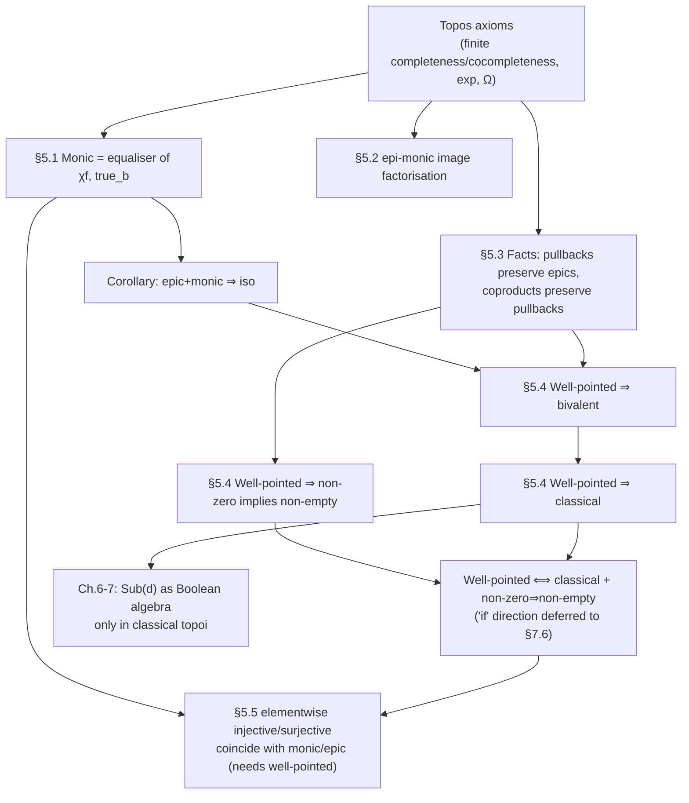

[[book-guidelines|↩ Back to guidelines]]

# Structural Theorems in an Arbitrary Topos

Chapter 4 handed you four axioms — finite (co)completeness, exponentials, and a subobject classifier $\Omega$ — and asserted that any category satisfying them "looks like $\mathbf{Set}$." That's a promissory note. Nothing in the axioms *says* that monics behave like injections, that arrows factor into a surjective-then-injective pair, or that a proposition can only be true or false. Chapter 5 is where Goldblatt starts cashing that note: four theorems, proved from the axioms alone, that recover set-like behavior in an arbitrary topos — and, crucially, expose the *one* extra assumption (well-pointedness) that recovers the rest.

This matters for you specifically because every one of these results has a load-bearing analogue in how a real type checker or elaborator is built. Monic-as-equaliser is subtyping-by-predicate. Epi-monic factorisation is quotient-then-embed, exactly the shape `Quotient` types and image types take in Lean. Well-pointedness and bivalence are the precise categorical statement of "classical reasoning is a *choice*, not a given" — which is exactly the tension between `Prop` in a topos-of-sheaves world and `Prop` in Lean's classical core.

---

## 5.1 Monics as equalisers

**The problem.** In $\mathbf{Set}$, an injective function $f : A \hookrightarrow B$ is not just "a function that doesn't collide" — it's *characterized* by the subset it picks out. You already know this move if you've ever written a Rust newtype around a validated subset of a type: the injection *is* the inclusion of the valid values, and "which values are valid" is exactly the predicate $\chi_f : B \to \{0,1\}$ that's $1$ on $\mathrm{im}(f)$ and $0$ elsewhere. Goldblatt's first theorem says this correspondence — monic arrow $\leftrightarrow$ characteristic predicate $\leftrightarrow$ equaliser — is not a $\mathbf{Set}$-specific coincidence. It's forced by the topos axioms in *any* topos.

**What breaks without it.** If monics weren't equalisers, "subobject" would be a purely structural notion (an equivalence class of monics into $d$) with no guaranteed connection to $\Omega$-valued predicates — you'd lose the ability to reason about subobjects *as* propositions, which is the entire point of building a logic out of $\mathrm{Sub}(d)$ in Chapters 6–7.

**Theorem 1 (§5.1).** If $f : a \rightarrowtail b$ is monic in any topos $\mathscr{E}$, then $f$ is an equaliser of $\chi_f$ and $\mathrm{true}_b = \mathrm{true} \circ !_b$.

Recall from Chapter 4 that every monic $f : a \rightarrowtail b$ has a *unique* characteristic arrow $\chi_f : b \to \Omega$ making

$$
\begin{array}{ccc}
a & \longrightarrow & 1 \\
\downarrow{\scriptstyle f} & & \downarrow{\scriptstyle \mathrm{true}} \\
b & \xrightarrow{\ \chi_f\ } & \Omega
\end{array}
$$

a pullback. The theorem's proof is a clean diagram chase: since $\chi_f \circ f = \mathrm{true} \circ !_a = \mathrm{true}_b \circ f$ (using $!_a = !_b \circ f$), $f$ *equalizes* $\chi_f$ and $\mathrm{true}_b$. Given any other $g$ with $\chi_f \circ g = \mathrm{true}_b \circ g$, the perimeter of the pullback square commutes, so by the universal property of the pullback, $g$ factors uniquely through $f$ — which is exactly what "$f$ is the equaliser" means.

**Corollary.** In any topos, an arrow that is both epic and monic is iso.

*Proof sketch:* an epic monic is an epic equaliser, by the theorem — and an epic equaliser is always iso (§3.10, general category theory: an equaliser is monic by construction, and a monic epic equaliser is forced to be the identity-like universal witness).

This corollary is small but structurally important: it means "epic + monic ⇒ iso" needs *no* extra topos axiom — it's already implied by the four base axioms. Contrast this with $\mathbf{Ring}$ or other categories where epic+monic does *not* imply iso; a topos is well-behaved enough to rule that pathology out.

> **[[Logical-Geometry#Grounding|Grounding]] — Rust.** A monic in $\mathbf{Set}$ is a Rust injection; the "characteristic predicate" move is precisely a validating constructor:
> ```rust
> struct Even(i64);
>
> impl Even {
>     // this IS the characteristic function χ_f : i64 -> bool,
>     // and Even::new IS the equaliser universal-property witness:
>     // any g: X -> i64 that always lands on evens factors uniquely
>     // through Even::new.
>     fn new(n: i64) -> Option<Even> {
>         if n % 2 == 0 { Some(Even(n)) } else { None }
>     }
> }
> ```
> `Even`'s inclusion into `i64` is monic (distinct `Even` values give distinct `i64`s); `Even::new` is the "test membership, then embed" recipe the theorem says is *always* available for any monic in a topos, not just for this hand-rolled example.

> **Grounding — Lean.** This is Lean's `Subtype` (`{x : α // p x}`) *exactly*. The inclusion `Subtype.val : {x // p x} → α` is monic, and `p : α → Prop` is its characteristic arrow — Lean's `Prop` playing the role of $\Omega$, and `Subtype.val` being an equaliser of `fun a => p a` against `fun _ => True` (up to `Iff`/`propext`). Goldblatt's Theorem 1 is the categorical justification for why refinement types can *always* be presented this way: the subtype-as-predicate encoding isn't a convenient trick, it's forced by any topos structure.

---

## 5.2 Images of arrows

**The problem.** In $\mathbf{Set}$, every function factors as a surjection onto its image followed by the inclusion of that image: $A \twoheadrightarrow \mathrm{im}(f) \hookrightarrow B$. This is bread-and-butter set theory. The question Goldblatt is actually answering is subtler: *how do you even define "image" without elements to collect into a set* $\{f(x) : x \in A\}$? An arbitrary topos has no primitive notion of "the set of values $f$ hits." The image has to be built from limits and colimits alone.

**The construction.** Goldblatt's route (dualizing the more obvious "coequalize the kernel pair" idea, for technical reasons tied to §5.1) is:

1. Form the **pushout** of $f : a \to b$ along itself:
$$
\begin{array}{ccc}
a & \xrightarrow{\ f\ } & b \\
\downarrow{\scriptstyle f} & & \downarrow{\scriptstyle q} \\
b & \xrightarrow{\ p\ } & r
\end{array}
$$
2. Let $\mathrm{im}\,f : f(a) \rightarrowtail b$ be the **equaliser** of $p$ and $q$. (This is monic automatically, by Theorem 3.10.1 — every equaliser is monic.)
3. Since $q \circ f = p \circ f$, there's a unique $f^* : a \to f(a)$ making the whole thing commute — $f^*$ is $f$ "corestricted" onto its image.

**Theorem 1.** $\mathrm{im}\,f$ is the *smallest* subobject of $b$ through which $f$ factors: if $f = v \circ u$ for monic $v$, then $\mathrm{im}\,f$ factors uniquely through $v$ too, i.e. $\mathrm{im}\,f \sqsubseteq v$ in $\mathrm{Sub}(b)$.

This is the categorical cash value of "image": not "the collected values," but "the *smallest* predicate that $f$ satisfies." That reformulation is exactly what lets it survive without elements.

**Corollary.** $f^* : a \to f(a)$ is epic. (Proved by re-running the image construction on $f^*$ itself and showing the resulting extra factor collapses to iso.)

**Theorem 2.** $\mathrm{im}\,f \circ f^* : a \twoheadrightarrow f(a) \rightarrowtail b$ is an epi-monic factorisation of $f$, unique up to unique commuting isomorphism.

*Proof sketch:* the epic corollary plus $\mathrm{im}\,f$ monic gives existence; uniqueness comes from the corollary's "$k$ epic and monic $\Rightarrow$ $k$ iso" via §5.1.

So: **every arrow in a topos factors, uniquely up to iso, as epic followed by monic** — proved from nothing but pushouts, equalisers, and Theorem 1's corollary. That's the promised recovery of "surjection then injection," derived, not assumed.

> **Grounding — Rust.** Epi-monic factorisation is *quotient, then embed* — precisely the shape of grouping-then-deduplicating:
> ```rust
> use std::collections::BTreeSet;
>
> // f : Vec<i64> -> i64  (e.g. "sign of each element")
> fn sign(x: &i64) -> i32 { x.signum() }
>
> fn factor(xs: &[i64]) -> (BTreeSet<i32>, /* inclusion is just identity/is-a */ ()) {
>     // f* : a -> f(a), the epic corestriction onto the image
>     let image: BTreeSet<i32> = xs.iter().map(sign).collect();
>     (image, ())
>     // the monic half, im f : f(a) -> B, is just BTreeSet<i32> ⊆ i32 —
>     // trivial here because i32 already "is" its own superset,
>     // but in general this second arrow is where a genuine embedding lives.
> }
> ```
> The kernel-pair/pushout machinery Goldblatt uses to *define* the image without elements is precisely what a Rust `HashMap<K, Vec<V>>` grouping-by-key or a union-find data structure is computing operationally: collapse everything related by "same output," then re-embed the distinct classes.

> **Grounding — Lean.** This is `Function.factorization` territory: `Quotient (kernel relation) ≃ Set.range f`, i.e. every function factors through its `Quotient` by the kernel equivalence, landing injectively in the codomain. Goldblatt's pushout-of-$f$-with-itself *is* the categorical dual presentation of the kernel-pair coequaliser (he says so explicitly, §5.2) — so this theorem is the general-topos justification for why Lean's `Quotient.mk` / `Quotient.lift` pattern (define on representatives, prove respects the relation, get a well-defined map on the quotient) is not just a convenient API but the *only* way epi-monic factorisation can be built when you don't have raw elements to work with.

---

## 5.3 Fundamental facts

Two structural lemmas, stated without proof (they come from the deeper "Fundamental Theorem of Topoi" — every slice category $\mathscr{E}/a$ is itself a topos — whose proof needs machinery not yet built):

- **Fact 1 — pullbacks preserve epics.** If the square is a pullback and $f$ is epic, then $g$ (the pulled-back copy of $f$) is epic too.
- **Fact 2 — coproducts preserve pullbacks.** Pulling back a coproduct of arrows is the coproduct of the pullbacks.

These read as bookkeeping, but they're the two facts §5.4 actually leans on to prove that $[\mathrm{true}, \mathrm{false}]$ is always monic and that well-pointedness forces bivalence. Treat them as load-bearing lemmas, not throwaway remarks — this is a common pattern in this book (and in Lean's own library): a deferred, "cited from elsewhere" fact quietly underwrites the next three theorems.

---

## 5.4 Extensionality and bivalence

**The problem.** A topos is supposed to "look like $\mathbf{Set}$." In $\mathbf{Set}$: the empty set has no elements; two functions are equal iff they agree on every input; and $\Omega = \{0,1\}$ has exactly two elements, so every proposition is true or false. None of these are automatic in an arbitrary topos. This section works out exactly which extra assumption is needed for each — and shows, via a genuinely non-classical example, that dropping the assumption breaks things in a controlled, examinable way.

### The initial object and "elements"

Recall an **element** of $a$ (a *generalized element*, in the sense the book will keep using) is an arrow $x : 1 \to a$. If $\mathscr{E}$ is **non-degenerate** (not every pair of objects isomorphic), the initial object $0$ has no elements — because an arrow $1 \to 0$ would force $\mathscr{E}$ degenerate (§3.16, from the interaction of $0$ with cartesian closure). So far, so $\mathbf{Set}$-like.

But **"non-zero" (not $\cong 0$) and "non-empty" (has an element $1 \to a$) can come apart.** Goldblatt's example: in $\mathbf{Set}^2$ (pairs of sets, arrows are pairs of functions), the object $\langle 0, \{0\}\rangle$ is not isomorphic to the initial object $\langle 0, 0\rangle$ — so it's non-zero — yet an element $\langle f,g\rangle : \langle\{0\},\{0\}\rangle \to \langle 0,\{0\}\rangle$ would need $f : \{0\} \to 0$, which cannot exist. So $\langle 0,\{0\}\rangle$ is **non-zero but empty**. This is the first crack: element-based reasoning about a topos can silently fail to see objects that are "there" in every structural sense.

### Extensionality Principle for Arrows

> If $f, g : a \to b$ are distinct parallel arrows, then there is an element $x : 1 \to a$ of $a$ such that $f \circ x \neq g \circ x$.

Category theorists read this as "**1 is a generator**." It holds in $\mathbf{Set}$ (this is just function extensionality — two functions differ only if they differ *somewhere*), but fails in $\mathbf{Set}^2$: there are two distinct arrows $\langle 0,\{0\}\rangle \to \langle 0,2\rangle$, but $\langle 0,\{0\}\rangle$ has *no* elements at all to witness the difference.

A non-degenerate topos satisfying this is called **well-pointed**.

**Theorem 1.** Well-pointed $\Rightarrow$ every non-zero object is non-empty.

*Proof idea:* if $a \not\cong 0$, then $0_a : 0 \to a$ and $1_a : a \to a$ have different domains, hence are distinct arrows out of... wait, more precisely: their characteristic arrows $\chi_{0_a}, \chi_{1_a} : a \to \Omega$ are distinct (equal would force $0 \cong a$). Extensionality then produces an element $x : 1 \to a$ distinguishing them — and that $x$ is exactly a witness that $a$ is non-empty.

So well-pointedness *repairs* the $\langle 0,\{0\}\rangle$ pathology: in a well-pointed topos, non-zero really does imply non-empty, just like $\mathbf{Set}$.

### `false` and bivalence

Define $\mathrm{false} : 1 \to \Omega$ as the characteristic arrow of the (unique) monic $0 \rightarrowtail 1$ — i.e. the unique arrow making

$$
\begin{array}{ccc}
0 & \longrightarrow & 1 \\
\downarrow & & \downarrow{\scriptstyle \mathrm{false}} \\
1 & \xrightarrow{\ !\ } & \Omega
\end{array}
$$

a pullback (so $\mathrm{false} = \chi_{0 \rightarrowtail 1}$). Goldblatt also writes this arrow "$\bot$". A topos is **bivalent (two-valued)** if $\mathrm{true}$ and $\mathrm{false}$ are the *only* elements of $\Omega$.

**Theorem 2.** Well-pointed $\Rightarrow$ bivalent.

*Proof idea:* take any element $f : 1 \to \Omega$, pull it back against $\mathrm{true}$ to get $g : c \to 1$. Either $c \cong 0$ (forcing $f = \mathrm{false}$) or $c$ is non-zero — and by Theorem 1, well-pointedness gives $c$ an element, which is then leveraged to show $g$ is epic *and* monic (hence iso, by §5.1's corollary), forcing $c \cong 1$ and $f = \mathrm{true}$.

### `[true, false]` and classicality

In $\mathbf{Set}$, $1+1 \cong \Omega = 2$ via the coproduct arrow $[\mathrm{true}, \bot] : 1+1 \to \Omega$. In an arbitrary topos this arrow always exists (coproducts are an axiom); the question is whether it's iso. A topos where $[\mathrm{true},\bot]$ *is* iso is called **classical**.

**Theorem 3.** $[\mathrm{true}, \bot]$ is *always* monic — in every topos, not just well-pointed ones.

This uses a genuinely nice lemma: if $f : a \rightarrowtail b$ and $g : c \rightarrowtail b$ are **disjoint monics** (their pullback is $0$ — i.e. no overlap, the categorical statement of $\mathrm{Im}\,f \cap \mathrm{Im}\,g = \emptyset$), then $[f,g] : a+c \rightarrowtail b$ is monic. Applying this to $\mathrm{true}$ and $\bot$ — which are disjoint essentially *by definition* of $\bot$ as the characteristic arrow of $0 \rightarrowtail 1$ — gives Theorem 3 for free.

**Theorem 4.** Well-pointed $\Rightarrow$ classical.

Given Theorem 3, this reduces to showing $[\mathrm{true},\bot]$ is epic: if $f \circ [\mathrm{true},\bot] = g \circ [\mathrm{true},\bot]$, then $f$ and $g$ agree on both $\mathrm{true}$ and $\bot$ — and since (by bivalence, Theorem 2) those are the *only* elements of $\Omega$, extensionality forces $f = g$.

**Theorem 5 (the converse, partial).** A topos is well-pointed **iff** it is classical *and* every non-zero object is non-empty. ("Only if" is Theorems 1 and 4 combined; "if" needs machinery deferred to §7.6.)

This is the chapter's real payoff: **well-pointedness factors into two independent conditions** — classicality (a purely algebraic/logical statement about $\Omega$) and "non-zero implies non-empty" (a statement about whether objects have enough elements). Neither alone suffices, and the book proves this with an explicit counterexample rather than leaving it as an assertion.

### The counterexample topos $M_2$

Take $M_2 = \{0,1\}$ under multiplication (a monoid, *not* a group — $0$ has no inverse). The category $M_2\text{-}\mathbf{Set}$ (monoid actions) is:

- **Not classical**: Goldblatt proves (Theorem 6) $M$-$\mathbf{Set}$ is classical iff $M$ is a *group*; $M_2$ isn't one. Explicitly, the arrow $[\mathrm{true},\bot]$ in $M_2$ fails to be epic — witnessed by an equivariant map $f_\Pi : \Omega \to \Omega$ with $f_\Pi \circ \mathrm{true} = 1_\Omega \circ \mathrm{true}$ and $f_\Pi \circ \bot = 1_\Omega \circ \bot$, yet $f_\Pi \neq 1_\Omega$.
- **Yet still bivalent**: $\Omega$ in $M_2\text{-}\mathbf{Set}$ is the set $L_2$ of left ideals of $M_2$, which has exactly three elements $\{2, 0, \{0\}\}$ (i.e. $L_2$-as-a-set has three points, but only two of them, $2$ and $0$, are hit by *equivariant* elements $1 \to \Omega$) — a direct proof shows every $M_2$-arrow $1 \to \Omega$ is either $\mathrm{true}$ or $\bot$.
- **Not well-pointed**: the same $f_\Pi$ witness shows *no* element of $\Omega$ distinguishes $f_\Pi$ from $1_\Omega$, even though they're different arrows — extensionality fails outright.
- **But every non-zero object is still non-empty** (Exercise 5 / the follow-up discussion): elements of an $M$-set correspond to *fixed points* of the action, and in $M_2$ every non-zero object has one.

So $M_2$ is the minimal witness that Theorem 5's two conditions are genuinely independent: it has "enough elements" (non-zero ⇒ non-empty) but fails classicality, and that alone is enough to break well-pointedness. This is the kind of controlled counterexample that earns its keep — it's not just "a weird topos," it's *engineered* to isolate exactly one of the two hypotheses.

> **Grounding — Lean / Prop.** This section is the precise categorical anatomy of a fact you've probably felt but not seen proved: Lean's `Prop`, under `propext` (propositional extensionality: logically equivalent propositions are *equal*), behaves like $\Omega$ in a **classical, bivalent** topos — `propext` plus `Classical.em` together are the working analogue of "$[\mathrm{true},\mathrm{false}] : 1+1 \cong \Omega$." A topos of sheaves, by contrast, typically has $\Omega$ = "the lattice of open sets" — many truth values, non-classical — which is the semantic home of *intuitionistic* type theory. When you later choose whether your refinement-type checker's proposition layer is classical (decide everything, use `Classical.em` freely) or constructive (require a witness/proof term, no excluded middle), you are choosing, in Goldblatt's terms, whether your "logic topos" is bivalent-and-classical like $\mathbf{Set}$, or genuinely $\Omega$-valued like a sheaf topos. This is *the* fork in the road for how your embedded theorem prover will be allowed to close goals.

> **Grounding — Rust.** `M_2`-actions are a clean model for **capability/permission monoids** acting on state: think of `0` as an absorbing "revoked" capability and `1` as "granted." An `enum Cap { Granted, Revoked }` with `Revoked * x = Revoked` for any `x` is exactly $M_2$; the fact that $M_2\text{-}\mathbf{Set}$'s $\Omega$ is bivalent-but-not-classical is the categorical shadow of a familiar operational fact: a two-valued permission system can still have "hidden" distinctions between morphisms that no single test/query can observe — precisely what $f_\Pi \neq 1_\Omega$, indistinguishable by every element, is telling you.

---

## 5.5 Monics and epics by (generalized) elements

**The problem.** Everything above quietly used elements $1 \to a$ as stand-ins for "points of $a$." This section makes that precise by *defining* injectivity/surjectivity element-wise, categorically, and then asking: does this element-wise notion coincide with the arrow-theoretic monic/epic?

**Definitions** (for a category with a terminal object $1$): $f : a \to b$ is **surjective** if for every $y : 1 \to b$ there's some $x : 1 \to a$ with $f \circ x = y$; $f$ is **injective** if $x, y : 1 \to a$ and $f\circ x = f \circ y$ implies $x = y$.

**Theorem 1.** If $\mathscr{E}$ is well-pointed, then $f$ epic $\Rightarrow$ $f$ surjective, and $f$ monic $\Rightarrow$ $f$ injective.

*Proof idea for (i):* suppose $f$ epic but (for contradiction) not surjective in the naive right-cancellation sense fails — actually the direct argument: given $y : 1 \to b$, pull back $y$ against $f$ to get $q : c \to a$. Fact 1 (§5.3) makes the other leg $p$ epic; if $c \cong 0$ then $p$ would be monic too (hence iso), forcing degeneracy — so $c$ is non-zero, hence (Theorem 5.4.1) non-empty, giving $z : 1 \to c$; then $x = q \circ z$ satisfies $f \circ x = y$.

The converses (injective $\Rightarrow$ monic, surjective $\Rightarrow$ epic) hold in *any* category with enough structure and don't need well-pointedness — it's specifically the "monic/epic force the elementwise property" direction that needs it. The $M_2$ counterexample bites again here: $f_\Pi : \Omega \to \Omega$ in $M_2$ is *surjective but not epic*, and *injective but not monic* — living proof that without well-pointedness, "arrow-level" and "element-level" injectivity/surjectivity genuinely diverge.

> **Grounding — Rust/Lean.** This is exactly the gap between *extensional* equality-of-functions (`fn eq(f, g) = ∀x, f(x) == g(x)`, which is how you'd naively "test" two closures for equality by sampling) and *intensional* equality of morphisms in an arbitrary category. In Lean, `funext` is available unconditionally as an axiom, so Lean's `Type`-based function spaces behave as if permanently well-pointed. Goldblatt's theorem is telling you that's a *choice* baked into set-theoretic/classical foundations, not a free structural fact — a sheaf-topos-flavored type theory (think: a parametricity-respecting or synthetic-cohesion type theory) would need to track this distinction explicitly, the way $M_2$ does.

---

## Where this leads



Two threads pick up directly from here. First, Chapter 6–7 rebuild classical propositional logic ($\land,\lor,\lnot,\to$ as arrows) as the special case that happens when a topos is **classical** in exactly the sense proved here — a non-classical $\mathrm{Sub}(d)$ (like $M_2$'s) is what makes intuitionistic, non-Boolean internal logic *necessary* rather than a stylistic choice. Second, and more directly relevant to your compiler project: the monic-as-equaliser theorem (§5.1) is the categorical justification for encoding refinement types as "predicate + proof of membership" (Lean's `Subtype`/`Fin`-style types), and the well-pointedness dichotomy (§5.4–5.5) is the precise fork between *classical* and *constructive* proof search in your embedded theorem prover — whether your elaborator is entitled to assume `Classical.em`-style bivalence when discharging a verification condition, or must track $\Omega$-valued (not just Boolean) truth the way a genuinely intuitionistic checker does. When you get to designing whether your Hoare-triple discharger closes goals classically (SMT-style, decide-everything) or constructively (proof-term-producing, kernel-checked), you're re-deciding, in modern dress, exactly the question §5.4 answers for topoi in general.
