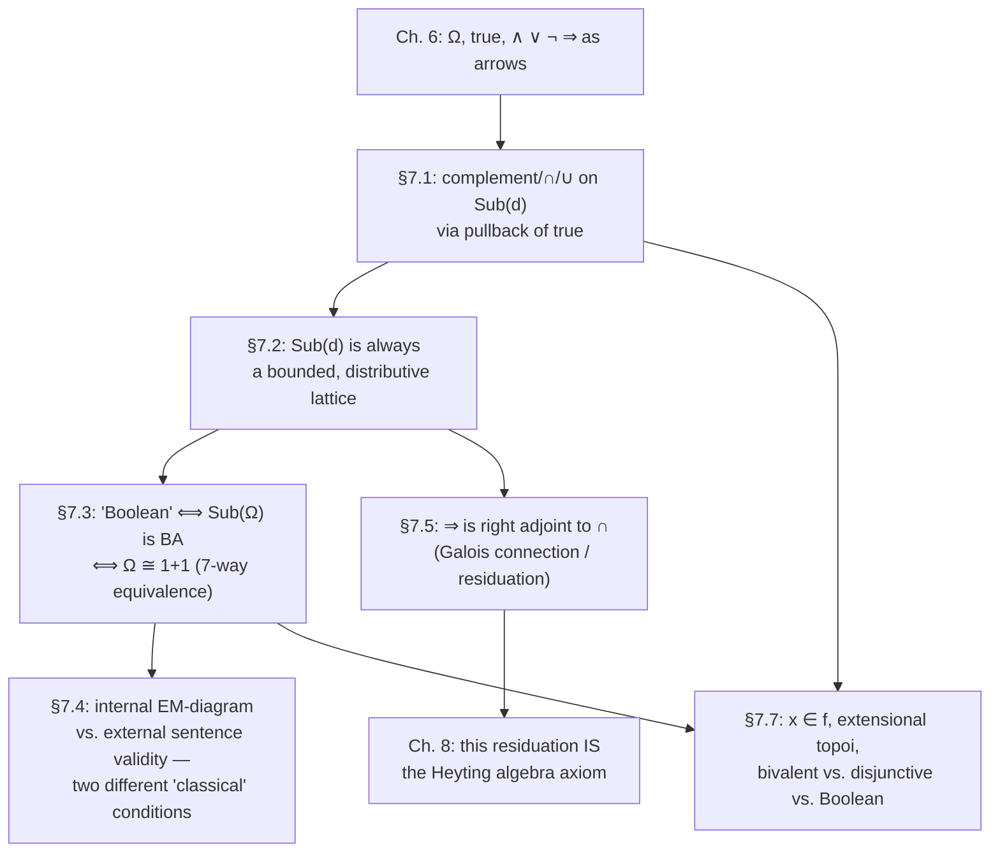

[[book-guidelines|↩ Back to guidelines]]

# The Algebra of Subobjects

## 0. Why this chapter has to exist

Chapter 6 ended on an uncomfortable note. In $\mathbf{Set}$, the subsets of a set $D$ form a Boolean algebra $(\mathscr{P}(D), \cap, \cup, -)$ — that's just classical propositional logic wearing a set-theoretic costume, since $A \cap B$ *is* "$A$ and $B$", $-A$ *is* "not $A$", and so on. Chapter 6 also showed that this whole apparatus can be rebuilt using the subobject classifier $\Omega$ in place of the two-element set $2 = \{0,1\}$: connectives become arrows $\Omega \times \Omega \to \Omega$ (or $\Omega \to \Omega$ for negation), defined by their behavior on the single distinguished element $\mathrm{true} : 1 \to \Omega$.

But an arrow $\wedge : \Omega \times \Omega \to \Omega$ existing is not the same claim as "$\mathrm{Sub}(d)$, for an arbitrary topos-object $d$, is a Boolean algebra." Chapter 6 built the *connectives*; Chapter 7 has to check what *algebraic laws* they actually obey once you leave $\mathbf{Set}$. This is the chapter where the book's central thesis — that topos logic is intuitionistic, not classical, by default — gets its first hard proof rather than just a suggestive analogy. Concretely, Goldblatt will show:

- $\mathrm{Sub}(d)$ is **always** a lattice, for any object $d$ in any topos.
- It is **not always** a *Boolean* lattice — pins down exactly one condition ($\top \sqcup \neg\top = 1_\Omega$) that decides whether it is.
- The implication connective $\Rightarrow$ built in Chapter 6 satisfies a defining property that will turn out, in Chapter 8, to be exactly Heyting's intuitionistic implication — and this property is a **Galois connection**, the same structure abstract interpretation uses to relate concrete and abstract semantics.

If you're building a type checker with a constraint solver behind it, this chapter is where "the type system's logic might not admit the law of excluded middle" stops being a slogan and becomes a theorem with a proof you can point to.

---

## 1. Complement, intersection, union — defined by pullback (§7.1)

### 1.1 The warm-up: what Boolean structure looks like through characteristic functions

Before generalizing, Goldblatt nails down *why* $\mathscr{P}(D)$ is Boolean, in a form that survives the trip to an arbitrary topos. For $A, B \subseteq D$ with characteristic functions $\chi_A, \chi_B : D \to 2$:

$$
\chi_{-A} = \neg \circ \chi_A, \qquad \chi_{A \cap B} = \wedge \circ \langle \chi_A, \chi_B\rangle, \qquad \chi_{A \cup B} = \vee \circ \langle \chi_A, \chi_B \rangle.
$$

In words: the characteristic function of a compound set is the corresponding truth-function composed with the characteristic functions of the parts. This is **Theorem 1** of §7.1, and its proof is a direct element-chase ($x \in {-A} \iff x \notin A \iff \chi_A(x) = 0 \iff (\neg \circ \chi_A)(x) = 1$, etc.). The point of proving it is that the right-hand side of each equation — composing $\Omega$-valued truth-arrows — makes sense verbatim in *any* topos, even where "$x \in A$" doesn't.

### 1.2 The pullback definitions

Let $\mathscr{E}$ be a topos, $d$ an object, and $f : a \rightarrowtail d$, $g : b \rightarrowtail d$ subobjects (monic arrows into $d$, taken up to isomorphism, as fixed in Chapter 4). Goldblatt defines three new subobjects of $d$ purely by specifying their **classifying arrow** and taking the pullback of $\mathrm{true} : 1 \to \Omega$ along it — the same recipe that defined the subobject classifier in the first place:

**A) Complement.** $\neg f : \neg a \rightarrowtail d$ is the pullback of $\mathrm{true}$ along $\neg \circ \chi_f$:
$$
\chi_{\neg f} = \neg \circ \chi_f.
$$

**B) Intersection.** $f \cap g : a \cap b \rightarrowtail d$ is the pullback of $\mathrm{true}$ along $\wedge \circ \langle \chi_f, \chi_g \rangle$:
$$
\chi_{f \cap g} = \chi_f \wedge \chi_g.
$$

**C) Union.** $f \cup g : a \cup b \rightarrowtail d$ is the pullback of $\mathrm{true}$ along $\vee \circ \langle \chi_f, \chi_g\rangle$:
$$
\chi_{f \cup g} = \chi_f \vee \chi_g.
$$

Notice the pattern: **every Boolean-looking operation on subobjects is manufactured by (i) building a compound $\Omega$-valued formula out of the classifying arrows of the parts, using the truth-arrows $\wedge, \vee, \neg$ from Chapter 6, and (ii) pulling $\mathrm{true}$ back along it.** Nothing here mentions elements. This is the arrow-theoretic engine that will later turn out to sometimes disobey Boolean laws — because $\wedge, \vee, \neg : \Omega \to \Omega$ (or $\Omega^2 \to \Omega$) were themselves only guaranteed to behave like the *internal* logic's connectives, and that internal logic need not be classical.

**What breaks without this.** If you tried to define $A \cap B$ in a general topos the way you would in $\mathbf{Set}$ — "the object of things that are in both" — you'd have no starting point, because a general topos object has no "things in it" you can quantify over externally. Routing everything through $\Omega$ and pullbacks is what lets these operations exist at all outside $\mathbf{Set}$.

### 1.3 Two constructions of $\cap$ and $\cup$ that have to be shown equal

In $\mathbf{Set}$ there is a second, more geometric way to describe $A \cap B$ and $A \cup B$: $A \cap B$ is literally the *pullback* of the two inclusions $A \hookrightarrow D \hookleftarrow B$ (their fibered product), while $A \cup B$ is the *image* of the coproduct arrow $[f, g] : A + B \to D$ under epi-monic factorization. Goldblatt's **Theorem 2** and **Theorem 3** prove — via careful pullback-lemma (PBL) diagram chases, not by assumption — that these geometric constructions coincide with the $\Omega$-arrow constructions of §1.2:

- $f \cap g$ (the pullback-of-inclusions description) has classifying arrow $\chi_f \wedge \chi_g$.
- The image of $[f,g] : a + b \to d$ has classifying arrow $\chi_f \vee \chi_g$.

This is a genuinely nontrivial fact: it says a topos gives you *no choice* between "intersection as fibered product" and "intersection as the $\Omega$-formula pullback" — they're forced to agree. That agreement is what licenses calling $\cap, \cup$ the meet and join of a lattice in the next section, rather than two unrelated operations that happen to share a symbol.

**Rust [[Logical-Geometry#Grounding|grounding]].** Think of $\Omega$ as a small enum of "truth values internal to this topos" (in $\mathbf{Set}$, `enum TwoValued { True, False }`; in the Kripke/sheaf topoi from later chapters, something richer). A classifying arrow $\chi_f : d \to \Omega$ is a function `fn classify(x: D) -> Omega`. Complement, intersection, and union are then *literally function composition with a fixed combinator*, exactly like combining boolean predicates by composing with `and`/`or`/`not`:

```rust
enum TwoValued { True, False }

fn not_(x: TwoValued) -> TwoValued {
    match x { TwoValued::True => TwoValued::False, TwoValued::False => TwoValued::True }
}
fn and_(x: TwoValued, y: TwoValued) -> TwoValued {
    match (x, y) { (TwoValued::True, TwoValued::True) => TwoValued::True, _ => TwoValued::False }
}

// chi_f : D -> Omega, chi_g : D -> Omega
fn chi_intersection<D>(chi_f: impl Fn(&D) -> TwoValued, chi_g: impl Fn(&D) -> TwoValued)
    -> impl Fn(&D) -> TwoValued
{
    move |x| and_(chi_f(x), chi_g(x))
}
```

The topos-theoretic content that this snippet *doesn't* capture is exactly the interesting part: in $\mathbf{Set}$, `TwoValued` really is two-valued, so `and_`/`not_` behave classically. Swap in a richer $\Omega$ (three-valued, or an infinite lattice of "stages" as in a presheaf topos) and the same combinator-composition recipe still typechecks and still defines $\cap, \cup, \neg$ — but the algebraic laws they satisfy change, because they're inherited from whatever $\wedge, \vee, \neg : \Omega \to \Omega$ happen to be for that $\Omega$. The Rust type system enforces nothing about *which* laws hold; that's exactly the gap this chapter closes categorically.

---

## 2. $\mathrm{Sub}(d)$ as a lattice (§7.2)

### 2.1 Meet and join, for free

**Theorem 1** of §7.2: $(\mathrm{Sub}(d), \sqsubseteq)$ is a lattice, in which $f \cap g$ is the greatest lower bound (meet) of $f$ and $g$, and $f \cup g$ is the least upper bound (join). The meet direction is nearly immediate from $f \cap g$ being a pullback (pullbacks *are* categorical products in the slice, hence g.l.b.'s). The join direction is more work — it uses the epi-monic factorization characterization of $f \cup g$ from Theorem 3 of §7.1, together with the universal (co-universal) property of the coproduct $[f,g] : a+b \to d$, to show any upper bound $h$ of $f$ and $g$ factors $f \cup g$ through it.

A useful **Corollary**, worth internalizing because it recurs constantly:
$$
f \sqsubseteq g \iff f \cap g = f \iff f \cup g = g \iff (\chi_f, \chi_g) \text{ factors through the equalizer of } \cap \text{ and } \mathrm{pr}_1.
$$
This is the exact categorical mirror of the familiar set-theoretic fact $A \subseteq B \iff \chi_A \le \chi_B$ (pointwise).

**Theorem 2**: $(\mathrm{Sub}(d), \sqsubseteq)$ is a *bounded* lattice — it has a top element $1_d$ (the identity subobject, "all of $d$") and a bottom element $0_d$ (the subobject of the initial object, "nothing"). This is immediate: every $f$ factors through $1_d$ trivially, and $0_d$ factors through every $f$ (there's a unique arrow out of the initial object into anything).

Goldblatt also notes $\mathrm{Sub}(d)$ is **distributive** ($f \cap (g \cup h) = (f \cap g) \cup (f \cap h)$), but *defers* the proof — it will fall out of a more detailed structural description of $\mathrm{Sub}(d)$ developed in Chapter 8 (§8.3). Flagging this now matters: distributivity holds unconditionally, in *every* topos, even the non-Boolean ones. The thing that fails in non-Boolean topoi is specifically complementation, not distributivity.

### 2.2 Half of complementation always works — the other half doesn't

This is the chapter's central surprise, and it's proved in two pieces.

**Theorem 3** (always true, in every topos): $f \cap \neg f = 0_d$.

That is, "$f$ and not-$f$" is always empty — no contradictions live anywhere in a topos's subobject algebra. The proof is a PBL chase showing the square witnessing $f \cap \neg f$ factors uniquely through the initial object.

**Theorem 4 / Theorem 5** (the surprise): it is *not* generally true that $f \cup \neg f = 1_d$ — "$f$ or not-$f$" does not always cover everything. Goldblatt proves the specific fact $\neg\top = \bot$ (Theorem 4: $\chi_{\neg\top} = \neg \circ \chi_\top = \neg \circ \mathrm{true} = \chi_\bot$), then exhibits the topos $\mathbf{Set}^{M_2}$ (a monoid-action topos from Chapter 4, used as the book's running counterexample) where, concretely, $\top \cup {\neg\top} = \top \cup \bot \neq 1_\Omega$ in $\mathrm{Sub}(\Omega)$. **Theorem 5** then shows this is not a fluke of one construction: *if* $\top : 1 \to \Omega$ has *any* complement in $\mathrm{Sub}(\Omega)$, that complement is forced (uniquely, by distributivity) to be $\bot$ — so the failure of $\top \cup \bot = 1_\Omega$ in $\mathbf{Set}^{M_2}$ isn't just "wrong choice of complement", it's a genuine proof that $\top$ has *no* complement there at all.

**What breaks without this distinction.** If both halves of complementation held automatically, every topos would be Boolean and there'd be nothing left for the rest of the book to do — Chapters 8–11 on intuitionistic and Heyting semantics would be vacuous. The asymmetry $f \cap \neg f = 0$ (free) vs. $f \cup \neg f = 1$ (not free) is *exactly* the categorical shadow of intuitionistic logic proving $\neg(\varphi \wedge \neg\varphi)$ (non-contradiction) unconditionally while refusing to prove $\varphi \vee \neg\varphi$ (excluded middle) in general.

---

## 3. Boolean topoi (§7.3)

Since complementation can fail, Goldblatt *defines*: $\mathscr{E}$ is **Boolean** if $(\mathrm{Sub}(d), \sqsubseteq)$ is a genuine Boolean algebra for every object $d$. The chapter's sharpest result is that this global, seemingly expensive-to-check condition collapses to a single local fact about the classifier object $\Omega$ alone — you never have to check every $\mathrm{Sub}(d)$ individually. **Theorem 1** of §7.3 gives seven equivalent characterizations:

$$
\begin{aligned}
\text{(A)} \quad & \mathscr{E} \text{ is Boolean} \\
\text{(B)} \quad & \mathrm{Sub}(\Omega) \text{ is a Boolean algebra} \\
\text{(C)} \quad & \top : 1 \to \Omega \text{ has a complement in } \mathrm{Sub}(\Omega) \\
\text{(D)} \quad & \bot : 1 \to \Omega \text{ is that complement} \\
\text{(E)} \quad & \top \cup \bot = 1_\Omega \text{ in } \mathrm{Sub}(\Omega) \\
\text{(F)} \quad & \mathscr{E} \text{ is \emph{classical}, i.e. } [\top, \bot] : 1+1 \to \Omega \text{ is iso} \\
\text{(G)} \quad & i_1 : 1 \rightarrowtail 1+1 \text{ is itself a subobject classifier for } \mathscr{E}
\end{aligned}
$$

The chain A⇒B⇒C⇒D⇒E⇒F⇒G is mostly bookkeeping (each condition literally restates the previous one). The hard direction is **G ⇒ A**: if $1+1$ can serve as the classifier, then *every* object's subobject lattice is Boolean, not just $\Omega$'s. The proof constructs, for arbitrary $f : a \rightarrowtail d$, an explicit iso witnessing $f \cup \neg f = 1_d$, using a lemma that $0 \to 1$ (into either coproduct injection $1 \rightrightarrows 1+1$) is a pullback, plus the fact that coproducts preserve pullbacks (Fact 2, §5.3).

Read condition **(F)** as the crispest intuition: **a topos is Boolean exactly when its classifier $\Omega$ has no "third value" — it collapses to something isomorphic to the two-element $1+1$.** $\mathbf{Set}$ and $\mathbf{FinSet}$ satisfy this ($\Omega = 2$, literally); the sheaf and Kripke/presheaf topoi that dominate the rest of the book generally do not, because their $\Omega$'s carry a whole poset's worth of "degrees of truth."

**Lean grounding.** This equivalence is the categorical ancestor of a fact every Lean user runs into immediately: Lean's core type theory (like the internal logic of a general topos) does **not** validate `p ∨ ¬p` for an arbitrary `Prop`. Lean's `Classical.em` is an *axiom*, not a theorem — logically the exact role played by "$\mathscr{E}$ is Boolean" here. When you write `open Classical` or invoke `Decidable` instances, you are locally asserting the equivalent of condition (F): "treat this `Prop`'s truth-object as if it were the two-element classifier." Conversely, `Decidable p` in Lean is precisely a *constructive witness* that a specific proposition (not all of them) sits in the well-behaved, classically-complemented part of the logic — the same way a specific $\mathrm{Sub}(d)$ can happen to be Boolean even in a non-Boolean topos overall (Chapter 6 already noted $\mathbf{Set}^{M_2} \models \alpha \vee \neg\alpha$ for its *sentences*, even though the topos as a whole isn't Boolean — see §3 below).

---

## 4. Internal versus external (§7.4)

This section resolves a puzzle that might already be nagging: in $\mathbf{Set}$, $\mathrm{Sub}(1) \cong \mathscr{P}(1) \cong 2$ — trivial, two elements, no special role. So why does the classifier $\Omega$'s own subobject lattice $\mathrm{Sub}(\Omega)$ carry so much weight in Theorem 1 above?

Goldblatt's answer separates two levels of description:

- $\mathrm{Sub}(d)$, the *external* collection of subobjects — a construction the mathematician studying the topos performs, from outside, using the ambient set theory to collect equivalence classes of monics. It is generally not itself an object living inside $\mathscr{E}$.
- The **power object** $\Omega^d$ (previewed in Chapter 4), the *internal* analogue — an actual $\mathscr{E}$-object that a "topos-dweller," reasoning only with individuals that exist inside the topos, would recognize as "the object of subsets of $d$."

**Theorem 1**: if $\mathscr{E}$ is Boolean, then $\mathscr{E} \models \alpha \vee \neg\alpha$ for every sentence $\alpha$ — validity (an *internal* notion, defined via truth-arrows and valuations $V$) inherits Booleanness from the algebra. But the converse is exactly where the internal/external gap bites: **Theorem 2** proves the sharper, correct condition is not "$\mathscr{E}$ is Boolean" but merely "$\mathrm{Sub}(1)$ is a Boolean algebra" — a strictly weaker requirement, witnessed by $\mathbf{Set}^{M_2}$ itself, which validates $\alpha \vee \neg\alpha$ *internally* for every sentence while its full subobject algebra (e.g. $\mathrm{Sub}(\Omega)$) is *not* Boolean. The **Corollary** states this bluntly: "$\mathrm{Sub}(1)$ is a BA" does *not* imply "$\mathscr{E}$ is Boolean."

The mechanism behind this gap: excluded middle has an internal formulation as a commuting-diagram condition (labeled **EM** in the text),
$$
\Omega \xrightarrow{\langle \mathrm{id}_\Omega, \neg\rangle} \Omega \times \Omega \xrightarrow{\vee} \Omega \quad = \quad \Omega \xrightarrow{\mathrm{true}!} \Omega,
$$
i.e. "$p \vee \neg p$" composed at the level of $\Omega \to \Omega$, versus the constant-true map. **Theorem 3**: this diagram commutes exactly when $\mathrm{Sub}(\Omega)$ is a Boolean algebra — i.e. this internal EM-diagram is *equivalent to full Booleanness*, not to the weaker $\mathrm{Sub}(1)$-is-BA condition. So there are two distinct "excluded middle" conditions in play: validity of $\alpha \vee \neg \alpha$ for *sentences* (weak — tracks $\mathrm{Sub}(1)$), and the EM diagram commuting for the *object* $\Omega$ *itself* (strong — tracks full Booleanness). $\mathbf{Set}^{M_2}$ satisfies the first and fails the second, and that mismatch is precisely why it "looks classical from the outside" (bivalent externally) while genuinely being non-Boolean.

**What breaks without this distinction.** Without separating internal from external, you'd conclude — wrongly — that a topos validating every classical tautology as a *sentence* must have a fully classical subobject algebra, and be baffled by counterexamples like $\mathbf{Set}^{M_2}$. The internal/external split is what lets the book later develop a semantic theory (valuations, forcing, Kripke models — all *external* constructions) that faithfully tracks an *internal* logic that can be strictly weaker than classical.

---

## 5. Implication and its implications (§7.5)

### 5.1 The definition, and why it's not just "$\neg f \cup g$"

Chapter 6 built an implication arrow $\Rightarrow : \Omega \times \Omega \to \Omega$ the same way as $\wedge, \vee$. Goldblatt now defines, for subobjects $f : a \rightarrowtail d$, $g : b \rightarrowtail d$:
$$
f \Rightarrow g : (a \Rightarrow b) \rightarrowtail d \quad \text{is the pullback of } \mathrm{true} \text{ along } \Rightarrow \circ \langle \chi_f, \chi_g \rangle.
$$

The natural guess — that $f \Rightarrow g$ should just be $\neg f \cup g$, mirroring classical material implication — is checked and found **false in general**. The counterexample is immediate from the $\mathbf{Set}^{M_2}$ facts already on hand: $\top \Rightarrow \top = 1_\Omega$ always (trivially, by the theorem below), but $\neg\top \cup \top = \bot \cup \top \neq 1_\Omega$ in $\mathbf{Set}^{M_2}$. So $\Rightarrow$ is doing something genuinely different from $\neg(-) \cup (-)$ whenever the topos isn't Boolean.

### 5.2 The defining property — a Galois connection

**Theorem 1** of §7.5 is the load-bearing result of the whole section:
$$
h \sqsubseteq (f \Rightarrow g) \iff f \cap h \sqsubseteq g, \qquad \text{for all } h \in \mathrm{Sub}(d).
$$

Stop and look at the shape of this. For a *fixed* $f$, the map $g \mapsto (f \Rightarrow g)$ is characterized as the unique operation satisfying
$$
f \cap h \sqsubseteq g \iff h \sqsubseteq (f \Rightarrow g).
$$
That is exactly the defining equation of a **Galois connection** (equivalently, a monotone right adjoint) between the maps $(-) \mapsto f \cap (-)$ and $(f \Rightarrow -)$ on the poset $\mathrm{Sub}(d)$: **$f \Rightarrow (-)$ is right adjoint to $f \cap (-)$.** This is not a coincidence Goldblatt calls out explicitly at this point in the text (he saves the "adjoint" vocabulary for Chapter 15), but the property is stated in exactly this residuation form, and it is *the* structural fact that Chapter 8 will recognize as the defining axiom of a **Heyting algebra**: a lattice with $0,1$ and a relative pseudo-complement $\Rightarrow$ satisfying $a \sqcap b \sqsubseteq c \iff a \sqsubseteq (b \Rightarrow c)$.

From this adjunction, Theorem 1 derives immediately:
- (B) $f \sqsubseteq g \iff f \Rightarrow g = 1_d$ — implication is trivial exactly when the premise already entails the conclusion.
- (C) $f \sqsubseteq f \Rightarrow g \iff \top$ instantiates correctly — the reflexivity check.

**Lemma 2** then pins down precisely *when* this general residual $\Rightarrow$ degenerates into the familiar Boolean $\neg(-) \cup (-)$: it's characterized abstractly (in any lattice, $m$ is the *unique* element satisfying both "$a \sqcap x \sqsubseteq b \implies x \sqsubseteq m$" and its converse) and shown, in a genuine Boolean algebra specifically, that this unique $m$ *is* $a' \cup b$. **Theorem 2** assembles this into another A–D equivalence chain: $\mathscr{E}$ is Boolean $\iff$ $f \Rightarrow g = \neg f \cup g$ always $\iff$ (specializing to $f=g=\top$) $\top \Rightarrow \top = \top \cup \top$... down to the single check $\top \Rightarrow \bot = \bot$. So *every* Boolean-vs-non-Boolean question in this chapter — complements, unions, implications — keeps bottoming out in one single fact about how $\top$ and $\bot$ interact in $\mathrm{Sub}(\Omega)$.

**Why this is the deepest fact in the chapter for your project.** A right adjoint characterized by a "solve the inequality" universal property is *exactly* the shape of a **Galois connection between an abstract and a concrete lattice** in abstract interpretation: given a concretization/abstraction pair $(\gamma, \alpha)$, $\alpha(x) \sqsubseteq_{\#} y \iff x \sqsubseteq \gamma(y)$. Here the roles are played by $f \cap (-)$ (intersecting with a fixed premise — "restricting to the cases where $f$ holds," a form of *projection*) and $f \Rightarrow (-)$ (its residual — "the weakest thing that, combined with $f$, gets you to $g$," which is exactly a **weakest-precondition-shaped** operator). Concretely: $f \Rightarrow g$ is the internal-logic analogue of "the weakest condition $h$ such that assuming $f$ and $h$ together guarantees $g$" — which is precisely the shape of a Hoare-logic weakest-precondition computation, or of computing the most general constraint an SMT-based verifier would need to discharge to prove $g$ given $f$. The fact that this operator is forced to be a *residual* (an adjoint), rather than an arbitrary derived combinator, is what guarantees it behaves lawfully (monotone, satisfies currying/uncurrying identities) even when the underlying logic is only intuitionistic — exactly the setting a refinement-type checker with a custom constraint solver has to operate in, since refinement predicates are typically checked, not assumed classically decidable.

### 5.3 Truth tables (§7.6)

Goldblatt closes two loose ends left from Chapter 6 by computing, purely from the lattice structure of $\mathrm{Sub}(1)$ (unit $1_1$, zero $0_1$, with $\chi_{1_1} = \top$, $\chi_{0_1} = \bot$), the truth tables for $\cap, \cup, \Rightarrow$ restricted to just $\{\top, \bot\}$:

$$
\begin{array}{c|cc}
\cap & \top & \bot \\ \hline
\top & \top & \bot \\
\bot & \bot & \bot
\end{array}
\qquad
\begin{array}{c|cc}
\Rightarrow & \top & \bot \\ \hline
\top & \top & \bot \\
\bot & \top & \top
\end{array}
$$

These reproduce exactly the classical two-valued truth tables — as they must, since $\{\top,\bot\}$ with these operations is always a two-element Boolean algebra regardless of whether the ambient $\Omega$ has more values. The subtlety the chapter has been building toward is that **$\Omega$ itself can have more than two "values"** (more than just $\top$ and $\bot$), and it's exactly on those extra values that Boolean laws can fail — a fact these two-row/two-column tables can never show you, which is precisely why $\mathbf{Set}^{M_2}$ needed a bespoke 3- or 4-valued analysis in §7.3–7.4 to exhibit the failure.

---

## 6. Extensionality revisited (§7.7)

### 6.1 Recovering "membership" from subobjects

Chapter 5 introduced *well-pointedness* as one categorical stand-in for extensionality. Here Goldblatt gives the more direct route: for $f : a \rightarrowtail d$ a subobject and $x : 1 \to d$ a generalized element, define
$$
x \in f \iff x \text{ factors through } f, \text{ i.e. } x = f \circ k \text{ for some } k : 1 \to a.
$$

**Theorem 1**: $x \in f \cap g \iff x \in f \text{ and } x \in g$ — intersection agrees with elementwise "and", unconditionally, in every topos. A topos is called **extensional** if this element-based membership *determines* the subobject order entirely:
$$
f \sqsubseteq g \iff \big(\forall x : 1 \to d,\; x \in f \implies x \in g\big).
$$

**Theorem 2**: every **well-pointed** topos is extensional (and conversely the "only if" half holds in any topos at all — it's the "if" direction, using bivalence, that needs well-pointedness). This closes the loop back to Chapter 5: well-pointedness was defined there as "elements distinguish parallel arrows"; here it's shown to *entail* the more familiar-sounding "subobjects are determined by their elements," recovering ordinary set-theoretic extensionality as a theorem rather than a fresh axiom. Goldblatt flags this as a genuine improvement over Lawvere's earlier axiomatic treatment of $\mathbf{Set}$-like categories, which had to posit extensionality directly (via a version of the axiom of choice) rather than derive it.

### 6.2 Where the "obvious" element-facts stop being true

Theorem 1 (for $\cap$) is unconditional. Its analogues for complement and union are *not*:
$$
\text{(a)}\ x \in {\neg f} \iff x \notin f, \qquad \text{(b)}\ x \in f \cup g \iff x \in f \text{ or } x \in g
$$
can both fail. The witnessing example is any Boolean-but-not-bivalent topos (the book's example: $\mathbf{Set}^2$, pairs of sets) — Boolean, so $f \cup \neg f = 1_d$ always holds *as subobjects*, yet a third truth-value $x \neq \top, \bot$ can exist with $x \notin {\top}$ and $x \notin {\neg\top}$ individually, while $x \in \top \cup \neg\top$ trivially (since $\top \cup \neg\top = 1_\Omega$). The subobject-level union covers everything; the elementwise disjunction of membership claims does not. **Booleanness of the lattice and bivalence of the topos are independent conditions**, and this is where that independence becomes visible at the level of elements rather than just abstract algebra.

This motivates two further named properties, each characterized precisely:
- **Bivalent**: every truth value is $\top$ or $\bot$ (**Theorem 3**: equivalent to condition (a) holding in every $\mathrm{Sub}(d)$).
- **Disjunctive**: the truth-arrow satisfies $y \vee z = \mathrm{true} \iff y = \mathrm{true}$ or $z = \mathrm{true}$, for truth-values $y,z : 1 \to \Omega$ (**Theorem 4**: equivalent to condition (b) holding everywhere).

**Theorem 5**: a Boolean, non-degenerate topos is disjunctive iff it is bivalent — so among Boolean topoi specifically, these two extra properties coincide; the gap only opens up once you allow more truth-values. The chapter's closing remark is a preview hook: $\mathbf{Set}^{P}$-style presheaf topoi (Chapters 9–10) supply an infinite family of topoi that are disjunctive but *not* bivalent and *not* Boolean — proof that all three properties (Boolean, bivalent, disjunctive) are genuinely independent axes, not different names for the same thing.

---

## 7. Synthesis: what this buys, and where it points



Structurally: this chapter is the load-bearing beam between "topoi have a classifier $\Omega$" (Chapter 4–6) and "topos logic is Heyting/intuitionistic logic" (Chapter 8 onward). Everything in Chapter 8's definition of a Heyting algebra — the lattice, the bounded structure, and crucially the relative pseudo-complement satisfying $a \sqcap x \sqsubseteq b \iff x \sqsubseteq (a \Rightarrow b)$ — is *proved to already hold* for $\mathrm{Sub}(d)$ right here, before the name "Heyting algebra" is ever introduced. Chapter 8 is essentially: "here is the abstract theory of the structure you just built."

For the compiler/elaborator project this system is tracking: the Galois-connection shape of $f \Rightarrow g$ (§5.2) is the single most directly transferable idea in this chapter. A refinement-type checker computing weakest preconditions, or a Horn-clause solver propagating constraints through an abstract domain, is doing residuation in exactly this sense — solving "what is the strongest/weakest $x$ such that combining it with a known fact $f$ entails $g$" — and the proof here (Theorem 1, §7.5) is the categorical guarantee that such an operator is well-defined and lawful *without* assuming classical logic or decidability anywhere. Separately, the internal/external distinction of §7.4 is the same distinction a trusted-kernel architecture draws between what the kernel can internally verify (internal validity) versus what the meta-level elaborator/tactic engine merely asserts about its own soundness (external validity) — the kernel only needs to trust the internal side.

---

*Source: Robert I. Goldblatt,* Topoi: The Categorical Analysis of Logic *(2nd ed., Dover 2006), Chapter 7 "Algebra of Subobjects", pp. 146–172.*
