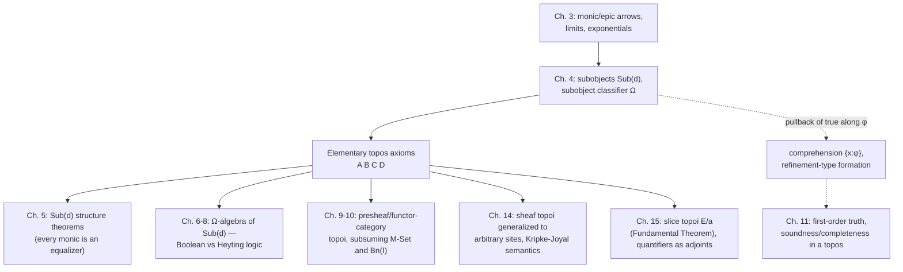

[[book-guidelines|↩ Back to guidelines]]

# The Definition and Basic Examples of a Topos

## 0. Why this chapter is the hinge of the book

Chapter 3 spent thirty-eight pages replacing every set-theoretic idea — injection, product, pullback, exponential — with an arrow-theoretic one, always by writing down a *universal property* rather than pointing at elements. Chapter 4 asks the one question that makes all of that machinery pay off: **can "subset" itself be rebuilt this way?**

That sounds like a strange thing to still be missing. Products, pullbacks, exponentials — all of those survived the translation into arrows just fine. But "subset" isn't just a structure, it's tangled up with *membership*, and membership is the one relation category theory pointedly refuses to have primitively. A category doesn't know what its objects are made of. So the categorical analogue of "$A$ is a subset of $B$" cannot be "every element of $A$ is an element of $B$" — there's no "element of" to appeal to. It has to be phrased purely in terms of arrows.

Once that's done — once "subset" becomes **subobject** and "is a member of" becomes a single distinguished arrow called **true** — the four axioms that define an *elementary topos* fall out almost mechanically. And they turn out to describe something you already know intimately, just from a different angle: a **universe with an internal object of propositions**. This is the chapter where category theory quietly builds the shape of a type theory, years before anyone in that community was using this vocabulary.

---

## 1. Subobjects: subsets without elements

### 1.1 What has to survive the translation

In $\mathbf{Set}$, if $A \subseteq B$, the inclusion map $A \hookrightarrow B$ is injective — categorically, **monic**. Conversely, any monic $f : C \rightarrowtail B$ has an image $\operatorname{Im} f = \{f(x) : x \in C\}$, and $f$ restricts to a bijection $C \cong \operatorname{Im} f$. So:

> Up to isomorphism, the domain of a monic arrow *is* a subset of the codomain.

That single observation is the whole move. Goldblatt defines (§4.1, p. 76):

> A **subobject** of a $\mathscr{C}$-object $d$ is a monic arrow $f : a \rightarrowtail d$.

No elements anywhere. This works verbatim in $\mathbf{Grp}$, $\mathbf{Top}$, or any category where "element" doesn't even make sense as a primitive notion.

**What breaks without it.** If you tried to define "subset of $d$" as a literal subset of the underlying elements of $d$, the definition would be meaningless the moment $\mathscr{C}$'s objects aren't sets — a group, a topological space, a sheaf, a monoid-action. You'd have to invent a separate, ad hoc notion of "part of a group" for every new category. Phrasing it via monics gives one definition that specializes correctly everywhere, because "monic" was already defined arrow-theoretically in Chapter 3 ($f \circ g = f \circ h \implies g = h$).

### 1.2 $\mathrm{Sub}(d)$: the poset of subobjects, and why it isn't quite a poset yet

In $\mathbf{Set}$, subsets of $D$ order themselves by inclusion, and $(\mathscr{P}(D), \subseteq)$ is a category in its own right (an arrow $A \to B$ exists exactly when $A \subseteq B$). Goldblatt lifts this ordering to arbitrary subobjects: given $f : a \rightarrowtail d$ and $g : b \rightarrowtail d$, define
$$
f \sqsubseteq g \iff \exists\, h : a \to b \text{ such that } f = g \circ h.
$$
Read this as "$f$ **factors through** $g$" — $a$'s image sits inside $b$'s image. (Exercise 3.1.2 in the book guarantees $h$ is automatically monic, so $h$ is itself a subobject of $b$ — the analogy with $\mathbf{Set}$ holds all the way down.)

This relation is reflexive and transitive for free (compose with identities, compose the witnessing arrows). But it is **not automatically antisymmetric**: you can have $f \sqsubseteq g$ and $g \sqsubseteq f$ — meaning the witnessing arrow $h : a \to b$ is iso — without $f$ and $g$ being the *same arrow*, merely isomorphic ones (e.g. two different-but-isomorphic four-element subsets embedded into a six-element set by different, equally valid, inclusions). Goldblatt's fix, reusing the quotient-by-isomorphism machinery from §3.12, is to stop talking about individual monics and instead define
$$
\mathrm{Sub}(d) = \{[f] : f \text{ is monic with codomain } d\},
$$
the set of monics **modulo isomorphism**, ordered by $[f] \sqsubseteq [g] \iff f \sqsubseteq g$ (well-defined on representatives — this needs checking, but goes through). *Now* $(\mathrm{Sub}(d), \sqsubseteq)$ is a genuine poset. In practice everyone (Goldblatt included, from this point on) says "the subobject $f$" meaning "the class $[f]$," and reserves "$f = g$" strictly for literal arrow-identity versus "$f \cong g$" for isomorphic-but-distinct representatives. This bookkeeping distinction matters later (Chapter 7, when $\mathrm{Sub}(d)$ becomes a genuine lattice with meets, joins, and a pseudo-complement) — it's the difference between "the same predicate" and "logically equivalent but syntactically different predicates," a distinction any type-checker has to make precisely too.

*Exercise 4.1.1 in the source: in $\mathbf{Set}$, $\mathrm{Sub}(D) = \mathscr{P}(D)$ exactly.*

### 1.3 Generalized elements

Chapter 4 also upgrades "element." A member $x \in A$ corresponds to the singleton-inclusion arrow $\{x\} \hookrightarrow A$, i.e. an arrow out of the *terminal* object. So for any category $\mathscr{C}$ with a terminal object $1$:

> An **element** of a $\mathscr{C}$-object $a$ is an arrow $x : 1 \to a$ (always monic — Exercise 3.6.3).

This is what topos theorists call a **generalized element**, and it is the single idea that lets every classical "for all $x \in A$..." statement be re-expressed and *proved* purely with arrows, later in the book (§5.5 gives the exact translation for characterizing monic/epic arrows this way).

### Grounding: subobjects and elements as code

**Rust.** The cleanest picture is `Option<T>` as the archetypal subobject: the inclusion `Some: T -> Option<T>` — or, more literally, a filter — is monic (injective) by construction.

```rust
// A subobject of `T` realized as a predicate-restricted embedding.
// `embed` is monic: distinct inputs that satisfy `pred` map to distinct outputs.
struct Subobject<T> {
    pred: fn(&T) -> bool,
}

impl<T: Clone> Subobject<T> {
    fn embed(&self, x: T) -> Option<T> {
        if (self.pred)(&x) { Some(x) } else { None }
    }
}

// Generalized element: an arrow 1 -> a, i.e. a value with no further
// structure needed to extract it — exactly `fn() -> T`, or in practice
// just a value `x: T` picked out of the unit type `()`.
fn element_of<T>(x: T) -> impl Fn() -> T
where
    T: Clone,
{
    move || x.clone()
}
```

Two `Subobject<T>` values with different `pred` closures but the same *image* are exactly the "$f \cong g$ but $f \ne g$" situation Goldblatt is careful about in §1.2 — same subobject up to isomorphism, syntactically different witnesses. Refinement-type systems hit this constantly: `{x: i32 | x > 0}` and `{x: i32 | x >= 1}` denote the same subtype extensionally but are different syntactic predicates until a solver proves them equivalent.

**Lean.** Lean's own `Subtype` is the categorical subobject made concrete: `{x : A // p x}` packages an element of `A` together with a *proof* that it satisfies `p`, and its coercion to `A` is definitionally the monic arrow.

```lean
-- A subobject of `A`, literally: a monic arrow into `A`.
def Subobject (A : Type) (p : A → Prop) := { x : A // p x }

-- The inclusion is the coercion `Subtype.val`, which is injective
-- (this is `Subtype.val_injective` in Lean's core library) — exactly
-- Goldblatt's "monic function determines a subset."
example (A : Type) (p : A → Prop) :
    Function.Injective (Subtype.val : {x : A // p x} → A) :=
  fun _ _ h => Subtype.ext h
```

This correspondence is not a loose analogy — it is literally the same universal-property statement specialized to $\mathscr{C} = \mathbf{Set}$ (more precisely, to the topos of Lean's `Type`-and-`Prop` layer, discussed further below).

---

## 2. Classifying arrows: turning membership into a single arrow

### 2.1 The motivating fact about $\mathbf{Set}$

In naive set theory, $\mathscr{P}(D) \cong 2^D$ — subsets of $D$ correspond bijectively to functions $D \to 2 = \{0,1\}$, via the **characteristic function**
$$
\chi_A(x) = \begin{cases} 1 & x \in A \\ 0 & x \notin A. \end{cases}
$$
This correspondence, Goldblatt observes (§4.2), is exactly captured by a **pullback square**. Writing $\mathrm{true} : 1 \to 2$ for the arrow picking out $1 \in \{0,1\}$:
$$
\begin{array}{ccc}
A & \longrightarrow & 1 \\
\downarrow{\scriptstyle i} & & \downarrow{\scriptstyle \mathrm{true}} \\
D & \xrightarrow{\ \chi_A\ } & 2
\end{array}
$$
is a pullback, and — crucially — $\chi_A$ is the *unique* arrow $D \to 2$ making this square a pullback. This uniqueness is what turns a fact about sets into a definition schema for any category.

### 2.2 The subobject classifier and the $\Omega$-axiom

> **Definition.** In a category $\mathscr{C}$ with a terminal object $1$, a **subobject classifier** is an object $\Omega$ together with an arrow $\mathrm{true} : 1 \to \Omega$ satisfying:
>
> **$\Omega$-axiom.** For every monic $f : a \rightarrowtail d$ there is exactly one arrow $\chi_f : d \to \Omega$ (the **character** of $f$) such that
> $$
> \begin{array}{ccc}
> a & \longrightarrow & 1 \\
> \downarrow{\scriptstyle f} & & \downarrow{\scriptstyle \mathrm{true}} \\
> d & \xrightarrow{\ \chi_f\ } & \Omega
> \end{array}
> $$
> is a pullback square.

Read the axiom operationally, not just diagrammatically: **the square being a pullback says $a$ is *exactly* the preimage of "true" under $\chi_f$** — nothing more, nothing less. This single square is doing two jobs at once: it says $\chi_f$ *agrees* with $f$ (the square commutes), and it says $a$ is the *largest* thing on which they agree (the universal property of the pullback: anything else commuting with $\chi_f$ and true factors uniquely through $a$). That second half is what rules out $\chi_f$ being merely "true somewhere on $a$" rather than "true exactly on $a$."

**What breaks without the pullback framing.** You could try to define $\chi_f$ just by the commuting triangle $\chi_f \circ f = \mathrm{true} \circ !_a$ (where $!_a : a \to 1$). But that only says $\chi_f$ is true *on* $a$ — it says nothing about $\chi_f$ being false *off* $a$, because a mere commuting triangle has no universal property forcing $a$ to be the *full* preimage. Uniqueness of $\chi_f$ and the "exactly" in "exactly the preimage" both come from insisting on a pullback, not just a commuting square.

The theorem that makes $\Omega$ worth its name:

> **Theorem (§4.2).** For $f : a \rightarrowtail d$, $g : b \rightarrowtail d$: $\ f \cong g$ (same subobject) $\iff \chi_f = \chi_g$.

So $\chi$ is a bijection $\mathrm{Sub}(d) \cong \mathrm{Hom}(d, \Omega)$ — subobjects of $d$ correspond exactly to predicates on $d$, i.e. to arrows into the classifying object. $\Omega$ is unique up to isomorphism whenever it exists (Goldblatt proves this directly from the Pullback Lemma, §3.13, Example 8 — two candidate classifiers $\Omega, \Omega'$ produce mutually inverse arrows $\chi_\top \circ \chi_{\top'} = 1_\Omega$ and vice versa).

### 2.3 Grounding: characteristic arrows as code

**Rust.** In $\mathbf{Set}$, $\Omega = \texttt{bool}$, and $\chi_f$ is literally a predicate closure — this is the "refinement" reading of a subobject classifier: a `fn(T) -> bool` *is* a characteristic arrow, and the pullback square says the refined subtype `{x: T | p(x)}` is *exactly* the preimage of `true`.

```rust
fn characteristic<T: Clone>(pred: impl Fn(&T) -> bool) -> impl Fn(&T) -> bool {
    pred
}

// The "pullback" of `true` along `chi` — the subobject `chi` classifies.
fn preimage_of_true<'a, T: Clone>(
    domain: &'a [T],
    chi: impl Fn(&T) -> bool + 'a,
) -> Vec<T> {
    domain.iter().filter(|x| chi(x)).cloned().collect()
}
```
Rust's `bool` is a *two*-valued $\Omega$ because Rust's logic is classical. Section 4.4 below shows a topos ($\mathbf{Set}^{\to}$) whose $\Omega$ has **three** elements — a first hint that "true/false" is a special case, not the general case, of what a subobject classifier can be. That is the seed of everything Chapters 6–8 build toward (Heyting algebras, intuitionistic logic).

**Lean.** This is where the connection becomes load-bearing for elaboration. Lean's `Prop` plays the role $\Omega$ plays in $\mathbf{Set}$: a term `p : A → Prop` is exactly a character $\chi_f : A \to \Omega$, and `{x : A // p x}` is exactly the subobject it classifies — the pullback of `True` (Lean's canonical inhabited proposition, playing the role of `true : 1 → Ω`) along `p`.

```lean
-- `p : A → Prop` is a character; `{x // p x}` is the subobject it classifies.
-- The pullback-square fact ("a is exactly the preimage") is witnessed by
-- `Subtype.property`, which is definitionally what makes membership work:
example (A : Type) (p : A → Prop) (x : A) (h : p x) :
    { y : A // p y } :=
  ⟨x, h⟩
```

When Lean's elaborator checks a term against a refinement/subtype goal, it is discharging exactly the "does the square commute" half of the $\Omega$-axiom: it must produce a proof `h : p x` — the arrow `1 → {y // p y}` — witnessing that this particular generalized element factors through the subobject. This is precisely the mechanism a Hoare-triple checker needs: checking `{P} e {Q}` at a value amounts to checking that a generalized element of the postcondition's classified subobject exists.

---

## 3. The axiomatic definition of an elementary topos

Having built $\Omega$, Goldblatt states the payoff (§4.3, p. 84):

> **Definition.** An **elementary topos** is a category $\mathscr{C}$ such that
> - (A) $\mathscr{C}$ is finitely complete,
> - (B) $\mathscr{C}$ is finitely co-complete,
> - (C) $\mathscr{C}$ has [[Adjointness-and-Quantifiers#Exponentiation|exponentiation]],
> - (D) $\mathscr{C}$ has a subobject classifier.

Each clause is doing specific, separable work, and it's worth naming what each one buys — especially for a reader thinking in terms of a type system rather than pure category theory:

| Axiom | What it provides in $\mathbf{Set}$ | Type-theoretic reading |
|---|---|---|
| (A) finite completeness | terminal object, products, pullbacks, equalizers | unit type, product/pair types ($\Sigma$-types without dependency), context formation, equality types |
| (B) finite co-completeness | initial object, coproducts, pushouts | empty type, sum/variant types |
| (C) exponentiation | function spaces $b^a$ | non-dependent function types $A \to B$ |
| (D) subobject classifier | $\Omega$, characters $\chi_f$ | an internal type of propositions, and refinement/subtype formation via pullback |

As noted in Chapter 3, (A) + (C) together are exactly the definition of a **Cartesian closed category**. Goldblatt records the historical fact that (A) can be replaced by the equivalent
$$
\text{(A}'\text{)} \quad \mathscr{C} \text{ has a terminal object and pullbacks},
$$
and dually (B) by
$$
\text{(B}'\text{)} \quad \mathscr{C} \text{ has an initial object and pushouts}.
$$
More strikingly, **C. Juul Mikkelsen showed that (B) is actually implied by (A), (C), and (D) together** (cf. Pare [74]) — finite co-completeness is redundant once you have finite completeness, exponentials, and a classifier. So the leanest correct statement is:

> A topos is a **Cartesian closed category with a subobject classifier.**

This is the definition Lawvere and Tierney originally proposed in 1969 when they abstracted "elementary" (first-order) axioms out of Grothendieck's much heavier sheaf-topos machinery — Lawvere's own words, quoted as this chapter's epigraph, name the target audience precisely: sheaf theory and algebraic geometry *as well as* Kripke semantics, proof theory, and independence results in set theory. That's an unusually wide net for four axioms to catch, and the rest of the chapter is Goldblatt's argument, by example, that the net really is that wide.

*A terminological note the book flags and defers: "elementary" doesn't mean "simple" here — it means **expressible in a first-order language**, in the precise sense that gets pinned down in Chapter 11. It is contrasted with the earlier Grothendieck-topos definition, which quantifies over all sheaves on a site and so is not first-order axiomatizable in the same way.*

---

## 4. Basic examples: what "topos" is wide enough to include

Goldblatt's strategy for the rest of the chapter is deliberately not exhaustive proof — for each example he identifies the terminal object, pullbacks, exponentials, and (with most care) the subobject classifier, since $\Omega$ is where each topos's character really shows.

### 4.1 The baseline: $\mathbf{Set}$, $\mathbf{Finset}$, $\mathbf{Finord}$

$\mathbf{Set}$ is the motivating example and, trivially, a topos: $\Omega = 2 = \{0,1\}$, $\mathrm{true}(0) = 1$. $\mathbf{Finset}$ (finite sets) inherits every construction from $\mathbf{Set}$ unchanged, since finite limits/exponentials/classifiers of finite sets are finite. $\mathbf{Finord}$ (finite ordinals as objects) is isomorphic to $\mathbf{Finset}$ as a category (every finite set of size $n$ is isomorphic to the ordinal $n$), so it transfers every construction too, with the same $\mathrm{true} : \{0\} \to \{0,1\}$.

### 4.2 $\mathbf{Set}^2$: doubling everything

$\mathbf{Set}^2$, the category of *pairs* of sets $(A,B)$ with pairs of functions as arrows, is a topos where every construction is literally "do it twice, componentwise" — terminal object $(\{0\},\{0\})$, pullbacks computed pairwise, exponential $(C,D)^{(A,B)} = (C^A, D^B)$, and classifier $\langle T,T \rangle : (\{0\},\{0\}) \to (2,2)$. Goldblatt notes the general fact this instantiates: **if $\mathscr{E}_1$ and $\mathscr{E}_2$ are topoi, then $\mathscr{E}_1 \times \mathscr{E}_2$ is a topos** — nothing about $\mathbf{Set}$ specifically was needed.

### 4.3 $\mathbf{Set}^{\to}$: the arrow category, and $\Omega$ with three elements

This is the example worth slowing down for, because it's the first place the classifier stops looking like a copy of `bool`. Objects of $\mathbf{Set}^{\to}$ are functions $f : A \to B$; arrows are commuting-square pairs $(i,j)$.

A subobject of $g : C \to D$ is (up to iso) an inclusion square: $A \subseteq C$, $B \subseteq D$, with $f$ the restriction of $g$ to $A$. Now take an element $x \in C$. There are **three**, not two, ways it can relate to the subobject $(A,B)$:

1. $x \in A$ (so automatically $g(x) \in B$, since $f$ is $g$ restricted),
2. $x \notin A$, but $g(x) \in B$ — "$x$ is missing, but its image is still present,"
3. $x \notin A$ and $g(x) \notin B$ — "$x$ and its image are both missing."

So $\Omega$ for $\mathbf{Set}^{\to}$ is a three-element set $\{0, \tfrac{1}{2}, 1\}$ (labeling the three cases in order), and the classifying arrow is a *pair* of functions $(\psi, \chi_B) : g \to (r : \{0,\tfrac12,1\} \to \{0,1\})$, with $\psi$ picking out one of the three cases per $x \in C$ and $r$ collapsing $\tfrac12,1 \mapsto 1$ and $0 \mapsto 0$ to recover the "downstream" classification of $B \subseteq D$ in ordinary $\mathbf{Set}$.

This is the chapter's first concrete demonstration that $\Omega$ need not be a Boolean two-point set — and it foreshadows exactly the material of Chapters 6–8: an arrow category's internal logic already has a natural "in between" truth value, long before Kripke models or Heyting algebras are introduced by name.

### 4.4 Bundles, $\mathbf{Set}/I$, and the Fundamental Theorem

A **bundle** over an index set $I$ is a collection of pairwise-disjoint "stalks" $\{A_i\}_{i \in I}$, packaged as a single function $p : A \to I$ (with $A = \bigcup_i A_i$ and $p^{-1}(\{i\}) = A_i$). Goldblatt shows this is *exactly* the comma category $\mathbf{Set} \downarrow I$ of functions with codomain $I$, which he names $\mathrm{Bn}(I)$. Every categorical construction in $\mathrm{Bn}(I)$ turns out to be "the corresponding $\mathbf{Set}$ construction, done stalk-by-stalk": products are fiberwise products, pullbacks are fiberwise pullbacks.

The classifier $\Omega$ for $\mathrm{Bn}(I)$ is the bundle $\mathrm{pr}_I : 2 \times I \to I$ — a bundle of two-element sets, one classical truth-value pair sitting over every index. So $\mathrm{Sub}(I) \cong \mathscr{P}(I)$: truth-values in $\mathrm{Bn}(I)$ correspond to arbitrary subsets of $I$, exactly as in ordinary $\mathbf{Set}$.

Goldblatt then states the **Fundamental Theorem of Topoi** (attributed to Freyd): *not only is $\mathrm{Bn}(I) = \mathbf{Set} \downarrow I$ a topos — for **any** topos $\mathscr{E}$ and object $a$, the slice category $\mathscr{E} \downarrow a$ is again a topos.* This single fact is what later (Chapter 15) powers the categorical treatment of quantifiers as adjoints to substitution along a pullback — slicing is the categorical shadow of "working under a context," and this is the first place the book proves it's always available.

### 4.5 Sheaves over a topological space: $\Omega$ shrinks to open sets

Restrict bundles by adding topology: a **sheaf** over topological space $I$ is a bundle $p : A \to I$ that is a *local homeomorphism* — every point of $A$ has a neighborhood mapped homeomorphically onto an open subset of $I$. The category $\mathrm{Top}(I)$ of sheaves over $I$ is a topos, called a **spatial topos**.

Here is the pivotal difference from $\mathrm{Bn}(I)$. The classifier is built from **germs of open sets**: at each point $i \in I$, define $U \sim_i V$ for open sets $U,V$ iff they agree on *some* open neighborhood of $i$ (i.e. "$U = V$" is locally true at $i$). The germ $[U]_i$ is the equivalence class, and the stalk of $\Omega$ at $i$ is $\Omega_i = \{[U]_i : U \text{ open}\}$ — literally the collection of open neighborhoods of $i$, modulo local agreement.

The consequence Goldblatt flags explicitly, because it's the through-line of the whole book: **truth-values in $\mathrm{Top}(I)$ correspond to *open* subsets of $I$, not arbitrary subsets** (whereas in $\mathrm{Bn}(I)$, they were *all* subsets of $I$). This is not a minor technical difference — open sets don't have complements that are open in general, only *interiors of complements* (a pseudo-complement, not a Boolean one). That single fact is the earliest, most concrete instance in the entire book of why topos-internal logic is intuitionistic rather than classical: **the algebra of truth-values is exactly the algebra of open sets, and the algebra of open sets is a Heyting algebra, not a Boolean one.** Everything Chapters 6–8 later prove in general, this section already exhibits by hand.

### 4.6 Monoid and group actions: $\mathbf{Set}^M$

An **$M$-set**, for a monoid $M = (M, *, e)$, is a set $X$ with an action $\lambda : M \times X \to X$ satisfying $\lambda(e,x) = x$ and $\lambda(m, \lambda(p,x)) = \lambda(m*p, x)$. Equivariant (action-preserving) functions between $M$-sets form a topos $\mathbf{M\text{-}Set}$. Goldblatt's examples span from the concrete (translation of reals under $(\mathbb{N},+,0)$; scalar multiplication of vectors; Euclidean transformations of the plane) to the computational: **$M$ = the monoid of input strings under concatenation, $X$ = states of a computing device, and $\lambda(m,x)$ = the state reached from $x$ after consuming input $m$**. This is literally a deterministic automaton, and $\mathbf{M\text{-}Set}$ is the topos whose objects are automaton-state-spaces and whose arrows are simulations that commute with every input word.

The classifier here is the most abstract-looking one in the chapter: $\Omega = (L_M, \omega)$ where $L_M$ is the set of **left ideals** of $M$ (subsets $B \subseteq M$ closed under $m * b \in B$ for $b \in B$, any $m$), with action $\omega(m,B) = \{n : n*m \in B\}$, and $\mathrm{true} : \{0\} \to L_M$ picks out the largest ideal, $M$ itself. A subobject inclusion $X \subseteq Y$ is classified at $y \in Y$ by the ideal $\{m : \lambda(m,y) \in X\}$ — "the set of future inputs that would push $y$ into $X$." This is worth pausing on if you're thinking about verification: it's a *reachability* predicate, phrased as an ideal of "words that reach the target region," which is exactly the shape of the automaton-theoretic side of symbolic execution and CEGAR-style reachability analysis, just recast in the classifier's clothing.

The exercises in this section make an important boundary case explicit: **$M$ is a group iff its only left ideals are $M$ and $\varnothing$** — i.e. $L_M$ collapses to a two-element set, and $\mathbf{M\text{-}Set}$ becomes a *Boolean* topos with classical logic, exactly when $M$ has no proper substructure to get lost in. Monoids with genuine substructure (non-invertible transitions) are precisely the ones whose internal logic is non-classical. Determinism-with-irreversibility is, quite literally, what breaks the law of excluded middle here.

---

## 5. Power objects

### 5.1 Motivating the power object via relations

$\Omega^a$, the exponential of $\Omega$ by $a$, is the topos analogue of $2^A = \mathscr{P}(A)$ in $\mathbf{Set}$. Goldblatt derives the categorical shape of "powerset" independently, starting from a fact about relations: functions $B \to \mathscr{P}(A)$ correspond bijectively to relations $R \subseteq B \times A$ (via $f_R(x) = \{y : xRy\}$, invertibly). The relation carrying *all* the membership information is the **membership relation**
$$
\in_A \ = \ \{(U,x) : U \subseteq A,\ x \in A,\ x \in U\} \ \subseteq \ \mathscr{P}(A) \times A,
$$
and its characteristic function turns out to be exactly the **evaluation arrow** $\mathrm{ev} : 2^A \times A \to 2$ — because $\mathrm{ev}(\chi_U, x) = \chi_U(x) = 1 \iff x \in U$. So $\in_A$ arises as the pullback of $\mathrm{true}$ along $\mathrm{ev}$, and — the stronger fact Goldblatt proves as an exercise — **$f_R$ is the *unique* function $B \to \mathscr{P}(A)$ that recovers $R$ this way**. That uniqueness is exactly the shape of a universal property, and it generalizes directly.

### 5.2 The definition, and the theorem that every topos has power objects

> **Definition.** A category $\mathscr{C}$ with products has **power objects** if for every object $a$ there are objects $\mathscr{P}(a)$ and $\in_a$, and a monic $\in_a \rightarrowtail \mathscr{P}(a) \times a$, such that for every object $b$ and relation $r : R \rightarrowtail b \times a$ there is exactly one $f_r : b \to \mathscr{P}(a)$ for which
> $$
> \begin{array}{ccc}
> R & \longrightarrow & \in_a \\
> \downarrow{\scriptstyle r} & & \downarrow{} \\
> b \times a & \xrightarrow{\ f_r \times 1_a\ } & \mathscr{P}(a) \times a
> \end{array}
> $$
> is a pullback.

> **Theorem 1.** Every topos has power objects.

*Proof sketch (Goldblatt, §4.7).* Set $\mathscr{P}(a) = \Omega^a$, and let $\in_a \rightarrowtail \Omega^a \times a$ be the subobject whose character is the evaluation arrow $\mathrm{ev}_a : \Omega^a \times a \to \Omega$. Given any relation $r : R \rightarrowtail b \times a$ with character $\chi_r : b \times a \to \Omega$, let $f_r : b \to \Omega^a$ be the **exponential adjoint** of $\chi_r$ (the currying isomorphism from Cartesian closure — this is exactly where axiom (C) gets used). Chasing the resulting diagram with the $\Omega$-axiom and the Pullback Lemma (§3.13) shows the square above commutes and is a pullback, and that $f_r$ is the *only* arrow with that property, because $\mathrm{ev}_a \circ (f_r \times 1_a) = \chi_r$ pins it down uniquely as an adjoint. $\blacksquare$

The construction directly recovers $\Omega$ itself as the special case $a = 1$: $\Omega \cong \mathscr{P}(1)$, and the monic $\in_1 \rightarrowtail \Omega \times 1$ is (up to the trivial isomorphism $\Omega \times 1 \cong \Omega$) exactly $\mathrm{true} : 1 \to \Omega$ again — the classifier and the power object of a point are the same data, viewed two ways.

### 5.3 A second, equally valid definition of topos

Anders Kock and C. Juul Mikkelsen went further and showed power objects can be used to *derive* exponentials, giving a third equivalent axiomatization:

> A category is a topos iff it is finitely complete and has power objects.

Goldblatt is explicit about why he does *not* lead with this more economical definition, and the reasoning is worth internalizing as a study in "shortest axioms are not always the best pedagogy": historically the concept of topos arose from examining subobject classifiers directly, so that path motivates the theory best; the $\Omega$-axiom is what actually does the structural work throughout the rest of the book, so it has to be introduced regardless; and each of $\Omega$ and exponentiation is *conceptually* simpler on its own than the power-object package. There is also a forward-looking technical reason: weak set theories connected to recursion theory (admissible sets) give rise to categories of sets *without* general powerset formation, so it's worth being able to state and study the $\Omega$-axiom in isolation, decoupled from any assumption that powersets exist.

### 5.4 $\Omega$ and comprehension: rebuilding ZF Separation categorically

Lawvere's own reading (cited by Goldblatt, §4.8) is that the $\Omega$-axiom *is* a categorical form of the **ZF Separation (Comprehension) principle**: given a property $\varphi$ on $B$, form $\{x \in B : \varphi(x)\}$. In $\mathbf{Set}$ this is exactly pulling back $\mathrm{true}$ along $\varphi$'s characteristic function. The topos-general statement: for any $\varphi : b \to \Omega$, define the subobject $\{x : \varphi\} \rightarrowtail b$ by pulling $\mathrm{true}$ back along $\varphi$ —
$$
\begin{array}{ccc}
\{x:\varphi\} & \longrightarrow & 1 \\
\downarrow{} & & \downarrow{\scriptstyle \mathrm{true}} \\
b & \xrightarrow{\ \varphi\ } & \Omega
\end{array}
$$
and, generalizing the notion of element from §4.1, say $x \in f$ for a generalized element $x : 1 \to b$ and subobject $f : a \rightarrowtail b$ when $x$ factors through $f$. Chasing the pullback then gives the clean closing fact of the chapter:
$$
y \in \{x : \varphi\} \iff \varphi \circ y = \mathrm{true}.
$$

This is, symbol-for-symbol, the mechanism a refinement-type checker needs: $\{x : \varphi\}$ *is* the refinement type `{x: B | φ(x)}`, and checking membership of a candidate term $y$ is exactly evaluating (or proving) $\varphi(y) = \mathrm{true}$ — a verification condition. What Chapter 4 shows is that this isn't a design choice specific to any one type system; it's forced by four axioms about limits, colimits, exponentials, and one classifying object.

---

## Where this leads



Every later chapter of the book is, in a precise sense, an elaboration of one clause of the four-axiom definition given here. Chapter 5 mines axiom (A)+(D) for structural consequences about $\mathrm{Sub}(d)$. Chapters 6–8 study $\mathrm{Sub}(d)$'s algebra in depth, and the sheaf/arrow-category examples of §4.4–4.5 are exactly the worked cases that motivate *why* that algebra need not be Boolean. Chapters 9–10 show that $\mathrm{Bn}(I)$ and $\mathbf{M\text{-}Set}$ are themselves instances of a single, more general functor-category construction. Chapter 11 promotes the comprehension mechanism of §4.8 into a full soundness/completeness theorem for first-order logic interpreted inside a topos.

For the standing project of building a Rust-based dependent/refinement-type checker with an embedded prover: this chapter is where the *formation rule* for refinement types gets its cleanest possible justification. `{x : B | φ}` is not an ad hoc syntactic device bolted onto a base type theory — it is what a subobject classifier's pullback construction produces automatically, in any category with the four topos axioms. The $\Omega$-axiom's uniqueness clause ("exactly one $\chi_f$") is the categorical reason a well-formed refinement predicate has one well-defined denotation; the membership fact $y \in \{x:\varphi\} \iff \varphi \circ y = \mathrm{true}$ is precisely the verification condition a checker discharges when it type-checks a term against a refinement goal. And the $\mathbf{Set}^{\to}$ and sheaf examples are the first hard evidence, worked by hand, for why an elaborator built on this foundation should not assume classical (excluded-middle) reasoning about $\Omega$ by default — a theme the book will make fully rigorous once Heyting algebras arrive in Chapter 8.
