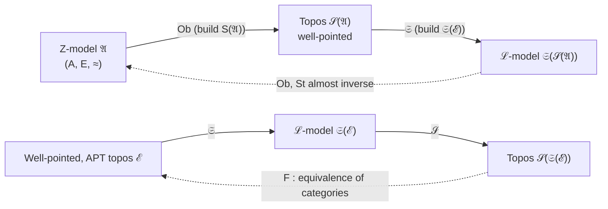

# Topos-Based (Categorial) Set Theory

[[book-guidelines|↩ Back to guidelines]]

## Why this chapter has to exist

By the end of Chapter 11, Goldblatt has shown that an arbitrary topos supports a full first-order (even higher-order) logic, and that this logic is sound and complete for intuitionistic predicate calculus. That is a *logical* achievement. But the book's larger claim is stronger: that topos theory is a rival *foundation* for mathematics, standing where Zermelo–Fraenkel set theory has traditionally stood. Logic alone doesn't get you there. A foundation for mathematics needs to be able to reconstruct the actual furniture of mathematics — numbers, functions, relations, and the cumulative universe of sets itself — from nothing but the topos axioms.

There's a subtler problem lurking underneath this, and Goldblatt is unusually candid about it at the chapter's opening. Ordinary mathematical practice talks blithely about "the category of all sets," $\mathbf{Set}$, as though everyone agrees on what it is. But once you've spent eleven chapters showing that wildly different categories (sheaves, presheaves, $M$-sets, Boolean-valued models) all satisfy the *same* four topos axioms while looking nothing like $\mathbf{Set}$, you can no longer take "the universe of sets" as a free-standing intuition. You have to say, precisely, in a first-order language, what property distinguishes $\mathbf{Set}$ from a general topos — and then ask which topoi have that property. This chapter is the answer. It builds a formal first-order theory of sets, $\mathrm{Z}_0$ (a fragment of ZF), and proves a genuine *equivalence*: models of this set theory correspond exactly to a certain well-behaved class of topoi. Set theory and topos theory turn out to be two syntactic presentations of the same semantic content.

Two pieces of apparatus are needed before that correspondence can be built, and the chapter develops them first: a categorial *axiom of choice* (§12.1) and a categorial *natural numbers object* (§12.2). Only then does it turn to the formal language (§12.3), the arrow-theoretic reconstruction of "transitive set" and "membership" (§§12.4–12.5), and finally [[Arithmetic-Inside-a-Topos#The equivalence theorem|the equivalence theorem]] itself (§12.6).

Before diving in: this chapter is dense with **well-founded recursion** — defining a function by cases on a relation that has no infinite descending chains. That's not incidental. It's the same mechanism that justifies structural recursion in Rust, `termination_by` obligations in Lean, and (not covered by Goldblatt, but worth flagging up front for where this connects to compiler/elaborator work) the well-foundedness arguments that justify a type checker's substitution and normalization procedures terminating. Keep an eye out for it — it appears at least three separate times under three different names (recursion on a natural numbers object, recursion on a well-founded relation, and the Mostowski Collapsing Lemma), and they are all literally the same idea.

---

## 12.1 — Axioms of choice

### The set-theoretic fact, arrow-theoretically restated

Start from the ordinary fact: if $f : A \twoheadrightarrow I$ is a surjection ("epic" in categorial language — an arrow that is right-cancellable, $g \circ f = h \circ f \implies g = h$), you can always choose, for each $i \in I$, some element of the fiber $A_i = f^{-1}(i)$, and thereby build a function $s : I \to A$ with $f \circ s = \mathrm{id}_I$. This $s$ is called a **section** of $f$; it is said to **split** the epic $f$. Producing $s$ requires making an unlimited number of arbitrary choices — hence "axiom of choice."

Goldblatt lifts this directly into arrow language:

$$
\textbf{ES (epics split):} \quad \text{Each epic } a \xrightarrow{f} b \text{ has a section } b \xrightarrow{s} a \text{ with } f \circ s = 1_b.
$$

This is already interesting as a *variable-strength* axiom: it holds in $\mathbf{Set}$, fails in most sheaf and presheaf topoi (a covering map need not have a continuous global section — that's the whole content of sheaf theory being nontrivial), and its truth or falsity in a given topos is a genuine structural question, not a triviality.

**[[Logical-Geometry#Grounding|Grounding]]: sections as `Result`-splitting.** If you model a surjective function as a Rust enum discrimination that always succeeds, a section is exactly a *canonical choice of preimage* — the same shape as picking a canonical representative out of an equivalence class.

```rust
// f : A -> I is epic ("onto"): every i has *some* preimage.
// A section s : I -> A picks one, uniformly, with f(s(i)) == i.
trait Epic<A, I> {
    fn f(a: &A) -> I;
}

// Splitting the epic means exhibiting this function — and in general,
// for an *arbitrary* infinite index type I, you cannot write it down
// without appealing to a choice principle: there's no algorithm that
// picks an element of an arbitrary nonempty set.
fn section<A, I>(i: I) -> A {
    unimplemented!("this is exactly where AC is doing invisible work")
}
```

Lean is more honest about this than Rust: the standard library's `Classical.choice` is precisely a term of type `Nonempty α → α` — an axiom, not a derived fact, and Lean forces you to either invoke it explicitly or restrict yourself to constructions that don't need it. Goldblatt's ES is the categorial mirror of `Classical.choice`.

### Support, and two weaker relatives (NE, SS)

Not every arrow into a topos's terminal object is a genuine "onto" map, and not every object is nonempty in the naive sense, so Goldblatt introduces two auxiliary notions.

The **support** of an object $a$ is obtained by epi-monic factoring the unique arrow $! : a \to 1$:

$$
a \twoheadrightarrow \mathrm{sup}(a) \rightarrowtail 1.
$$

In $\mathbf{Set}$, $\mathrm{sup}(a)$ is $\{*\}$ if $a \neq \emptyset$ and $\emptyset$ otherwise — it is the subobject of $1$ that records whether $a$ is nonempty. This gives two more choice-flavored axioms:

$$
\textbf{SS (supports split):} \quad \text{the epic } a \twoheadrightarrow \mathrm{sup}(a) \text{ always has a section.}
$$
$$
\textbf{NE:} \quad \text{every non-initial object } a \text{ has a "global element" } x : 1 \to a.
$$

Goldblatt proves (Theorem 1) that in a **bivalent** topos (one where $\mathrm{Sub}(1) = \{0_1, 1_1\}$ — only two truth-values classify subobjects of $1$) NE holds if and only if bivalence itself is preserved, and (Theorem 2) SS and NE are *equivalent* once bivalence is assumed. A useful corollary: **a topos is well-pointed iff it is Boolean, bivalent, and satisfies SS** — this is the arrow-theoretic characterization of "looks exactly like $\mathbf{Set}$" that the whole chapter is chasing.

### The strong version, and Diaconescu's theorem

The categorial version of the *usual* axiom of choice (a choice function selecting one element from every member of a family of nonempty sets) is:

$$
\textbf{AC:} \quad \text{if } a \not\cong 0, \text{ then for every arrow } a \xrightarrow{f} b \text{ there exists } b \xrightarrow{g} a \text{ with } f \circ g \circ f = f.
$$

AC is strictly the strongest of the choice-family axioms covered: Theorem 3 shows $\mathrm{AC} \Rightarrow \mathrm{NE}, \mathrm{ES}$, and bivalence. But the truly striking result — discovered by **Radu Diaconescu** — is:

> **Theorem 5 (Diaconescu).** If a topos satisfies ES, it is **Boolean**.

This is the categorial form of a fact that constructive mathematicians know well and that has real teeth for anyone doing dependent-type-theory work: **the axiom of choice implies the law of excluded middle.** Assuming *any* form of unrestricted choice forces classical logic; you cannot have both full topos-generality (intuitionistic internal logic) and unrestricted choice. The proof (§12.1, "the basis of Diaconescu's result") is a genuinely elegant five-step arrow-chase: form the coproduct $d + d$, take a subobject $f : a \rightarrowtail d$, coequalize the two composites $i_1 \circ f, i_2 \circ f : a \to d + d$, split that coequalizer using ES, and pull back the two coproduct injections along the splitting — the intersection of the two pullbacks is exactly the Boolean complement $\neg f$ of $f$ in $\mathrm{Sub}(d)$.

**Why this matters for elaborator/verifier work.** This is exactly the reason systems like Lean or Coq treat `Classical.choice` (or `Classical.em`, which is derivable from it via essentially this same Diaconescu argument) as an *opt-in* axiom rather than baked into the kernel: admitting it collapses your internal logic to classical logic, which is fine for ordinary mathematics but destroys the constructive content (extractability, canonicity, decidability of definitional equality in some settings) that a verified compiler's trusted kernel wants to preserve. When you see a Lean proof invoke `Classical.choice`, this theorem is *why* the proof is thereby marked as noncomputable / classical.

```lean
-- Diaconescu's argument in miniature: choice ⟹ excluded middle.
-- Lean's own axiom, stated exactly as Goldblatt's AC:
-- noncomputable def choice {α : Sort*} (h : Nonempty α) : α

-- em (p : Prop) : p ∨ ¬p is *derivable* from Classical.choice,
-- via the same "coequalize, split, pull back" idea specialized to
-- the two-element topos of Props. This is Diaconescu's theorem
-- transplanted from an arbitrary topos to Lean's Prop-topos.
example (p : Prop) : p ∨ ¬p := Classical.em p
```

Exercises 2–6 in §12.1 explore this from the other side: the topos $\mathbf{M}_2$ (an $M$-set topos for a 2-element monoid) and $\mathbf{Z}_2\text{-}\mathbf{Set}$ (group actions of $\mathbb{Z}/2$) both satisfy SS/NE while having epics that famously do *not* split — the group-equivariance requirement means "choosing an element of a fiber" has to be done uniformly across the whole orbit, and no such uniform choice exists. This is a clean, concrete illustration of why choice can fail even in reasonably well-behaved topoi.

---

## 12.2 — Natural numbers objects

### The universal property, motivated by "what a recursive definition actually is"

Take the ordinary construction of $\omega$: start with $0$, repeatedly apply "successor." Goldblatt's real interest is not $\omega$ itself but the **universal property** that the diagram

$$
1 \xrightarrow{\;0\;} \omega \xrightarrow{\;s\;} \omega
$$

has, discovered by **Lawvere**: given *any* object $a$ with a chosen point $x : 1 \to a$ and an endo-arrow $f : a \to a$, there is a **unique** arrow $h : \omega \to a$ making

$$
\begin{array}{ccc}
1 & \xrightarrow{0} & \omega & \xrightarrow{s} & \omega \\
{\scriptstyle x} \downarrow & & \downarrow{\scriptstyle h} & & \downarrow{\scriptstyle h} \\
a & = & a & \xrightarrow{f} & a
\end{array}
$$

commute. This is exactly the recursive definition $h(0) = x$, $h(n+1) = f(h(n))$ packaged as a universal property instead of an inductive clause-list. Uniqueness of $h$ is the inductive-uniqueness principle in disguise: any two functions agreeing at $0$ and commuting the same way with successor must be equal — that's proof by induction, stated without ever mentioning "induction."

$$
\textbf{NNO:} \quad \exists \, N \text{ with arrows } 1 \xrightarrow{0} N \xrightarrow{s} N \text{ such that for any } a, \; 1 \xrightarrow{x} a, \; a \xrightarrow{f} a,
$$
$$
\text{there is exactly one } h : N \to a \text{ making the square above (with } N \text{ for } \omega\text{) commute.}
$$

Exercise 1 establishes NNOs are unique up to isomorphism, in *any* category (the proof is the standard universal-property uniqueness argument, needing no topos structure at all).

### Grounding: this is a fold/catamorphism, and it's `Nat.rec`

The NNO's universal property is precisely what functional programmers call the **catamorphism** for the natural numbers, and precisely what a dependently typed kernel calls the **recursor**.

```rust
// The NNO universal property, specialized to Rust: h is uniquely
// determined by (x, f) — this is exactly `fold` on a Peano-style Nat.
enum Nat { Zero, Succ(Box<Nat>) }

fn fold<A>(n: Nat, x: A, f: impl Fn(A) -> A) -> A {
    match n {
        Nat::Zero => x,                  // h(0) = x
        Nat::Succ(m) => f(fold(*m, x, f)) // h(s(n)) = f(h(n))
    }
}
```

```lean
-- Lean's own recursor for Nat *is* the NNO's universal arrow, verbatim:
-- Nat.rec : {motive : Nat → Sort u} →
--           motive .zero →
--           ((n : Nat) → motive n → motive n.succ) →
--           (t : Nat) → motive t
-- Specializing motive to a constant type `a` recovers exactly
-- Goldblatt's h : N → a built from x : 1 → a and f : a → a.
def h (x : α) (f : α → α) : Nat → α
  | .zero   => x
  | .succ n => f (h x f n)
```

The soundness of Lean's kernel *for* recursive definitions on `Nat` (and inductive types generally) is literally an instance of this NNO uniqueness argument: the recursor is well-typed and terminating precisely because it factors uniquely through the universal diagram, and two definitionally-different-looking recursive functions are propositionally (sometimes definitionally) equal exactly when they induce the same $h$.

### Examples across topoi

- **$\mathbf{Set}^{\mathscr{C}}$ (functor category on any small category $\mathscr{C}$) has an NNO** (Theorem 1): take the constant functor $N(a) = \omega$ for every object $a$, with $\sigma$ the constant natural transformation whose every component is the ordinary successor function. This is a clean illustration of how "constant on the nose" can still satisfy a genuinely categorial universal property, because naturality of the unique factoring arrow $h$ (not just its existence) is what needs checking, and that's the nontrivial part left as an exercise.
- **$\mathbf{Bn}(I)$ (bundles over $I$):** $N$ is the bundle $I \times \omega \xrightarrow{\mathrm{pr}_1} I$ — a copy of $\omega$ sitting over every point of $I$, with successor acting fiberwise.
- **Sheaves $\mathbf{Top}(I)$ over a space $I$:** same underlying bundle as $\mathbf{Bn}(I)$, but now $I \times \omega$ carries the product topology with $\omega$ discrete — continuity of $\sigma$ and $0$ falls out because they are products of continuous maps, and (Exercise 5) any recursively-defined $h$ built from continuous $x, f$ is itself automatically continuous. This is genuinely nice: local constancy of natural-number-valued functions on $I$ is "for free" once you have the NNO.

Goldblatt flags that the NNO's arithmetic consequences (Peano-style induction, primitive recursion for $+, \times, \wedge$) are deferred to Chapter 13, and its *co-universal* dual-property role to Chapter 15 (adjoints).

---

## 12.3 — Formal set theory

### The language, and why the metalanguage/object-language split is the whole point

The formal language $\mathscr{L}$ has one binary predicate, $\in$, and nothing else — no function symbols, no constants. A **model** is $\mathfrak{A} = (A, E, \approx)$ where $E$ interprets $\in$ and $\approx$ interprets identity, and Goldblatt makes a deliberate, unusual choice: he does **not** require $\approx$ to be literal set-equality on $A$. This matches how the book has been treating equality of subobjects throughout — up to isomorphism, not on the nose — and it will let genuinely different-looking models turn out to present "the same" set theory.

The real conceptual weight of §12.3 falls on distinguishing **metalanguage** from **object-language**. We (living in ordinary informal set theory, the "metatheory") look at a model $\mathfrak{A} = (A, E, \approx)$ from outside: $A$ is, to us, just a set — an individual in our metauniverse of "metasets." But an imaginary person *living inside* $\mathfrak{A}$ (an "$\mathfrak{A}$-person") does not see $A$ as an object at all; $A$ *is* their entire universe. If $B \subseteq A$ is a metaset, $B$ need not correspond to anything the $\mathfrak{A}$-person can refer to — unless there happens to be some $b \in A$ whose $E$-members are exactly $B$'s elements, in which case $B$ "corresponds to an $\mathfrak{A}$-set." A model is **standard** when $E$ is literally the restriction of true meta-membership to $A$; even then, delicate gaps remain (an $\mathfrak{A}$-set can have metamembers the $\mathfrak{A}$-person simply doesn't see, if those members aren't themselves elements of $A$).

**This split is worth pausing on, because it's exactly the split between a proof assistant's trusted kernel and its elaborator.** The kernel's type-checking judgments are "object-level" — they only know about terms already fully elaborated, definitionally reduced within the object theory. The elaborator, metavariable-solving, and tactic layers operate at a "meta" level, reasoning *about* the object theory (which metavariables are still unresolved, which universe constraints are pending) without those reasoning steps themselves being object-level propositions the kernel ever sees. Goldblatt's warning that "we must be careful to distinguish metalanguage and object-language" is precisely the discipline that keeps a trusted kernel small: everything the elaborator does en route to a term is metatheoretic scaffolding; only the final, fully-elaborated term is checked against object-level rules.

### The axioms of $\mathrm{Z}_0$

Writing $u \subseteq v$ for $\forall w\,(w \in u \Rightarrow w \in v)$, the system collects:

- **Extensionality:** $\forall x\, \forall y\, (\forall z (z \in x \Leftrightarrow z \in y) \Rightarrow x \approx y)$.
- **Null Set:** $\exists u\, \forall v\, \neg(v \in u)$.
- **Pairs:** for any $x, y$ there is $\{x, y\}$.
- **Powersets:** for any $x$ there is a set of exactly $x$'s subsets.
- **Unions:** for any $x$ there is $\bigcup x$.
- **Separation ($\mathrm{Sep}_\varphi$):** for any $x$, $\{y : y \in x \wedge \varphi(y)\}$ exists — one axiom per formula $\varphi$.
- **Bounded (Δ₀-) Separation:** the same schema, but restricted to *bounded* formulas — every quantifier of $\varphi$ has the shape $\forall v\,(v \in t \Rightarrow \dots)$ or $\exists v\,(v \in t \wedge \dots)$, i.e. every quantifier ranges over the members of some already-given set. $\mathrm{Z}_0$ takes only this restricted schema as axioms.

$\mathrm{Z}_0$ is: classical first-order logic with identity, plus Extensionality, Null Set, Pairs, Powersets, Unions, Bounded Separation.

From Separation and Extensionality, one derives (uniquely-existing) sets $\{u : \varphi\}$, and Goldblatt introduces **class abstracts** as notational sugar, e.g. $u \cap v$ for $\{t : t \in u \wedge t \in v\}$, ordered pairs $(u,v)$ for $\{\{u\}, \{u,v\}\}$, and derived notions $\mathrm{Rel}$, $\mathrm{Fn}$, $\mathrm{Dom}$, $\mathrm{Im}$, function composition $v \circ u$. These are exactly the machinery needed for the punchline of §12.3:

> **Theorem 1.** If $\mathfrak{A}$ is a model of all the $\mathrm{Z}_0$ axioms, then the category $\mathscr{S}(\mathfrak{A})$ (objects = $\mathfrak{A}$-sets, arrows = triples $(a,k,b)$ where $k$ is an $\mathfrak{A}$-functional-relation from $a$ to $b$, built entirely out of class abstracts inside $\mathscr{L}$) is a **well-pointed topos**.

This is the first half of the equivalence the chapter is building toward: *any* model of a fairly weak set theory automatically gives rise to a topos, purely by formalizing the usual $\mathbf{Set}$-construction of pullbacks, exponentials, and the subobject classifier inside the model.

### Infinity, Choice, Regularity, Replacement — and ZF itself

The remaining classical axioms are added incrementally, each doing recognizable arrow-theoretic work later:

- **Infinity:** $\exists u\,(0 \in u \wedge \forall v\,(v \in u \Rightarrow v \cup \{v\} \in u))$. In $\mathrm{Z}_0 + \mathrm{Inf}$, the *least* such $u$ is derivable and, once formalized via §12.2's discussion, produces an NNO for $\mathscr{S}(\mathfrak{A})$ — Infinity is exactly what NNO becomes under this correspondence.
- **Choice:** formalizes AC of §12.1 directly as an $\mathscr{L}$-sentence.
- **Regularity:** $\forall u\, (u \not\approx \emptyset \Rightarrow \exists v\,(v \in u \wedge v \cap u \approx \emptyset))$. Intuitively: every nonempty set has a member disjoint from it, ruling out $x \in x$, descending membership chains $x_1 \ni x_2 \ni x_3 \cdots$, and generally guaranteeing sets are built "from the bottom up." This is the **well-foundedness** axiom, and it is what licenses recursive definitions on membership itself (§12.4 makes this precise).
- **Replacement:** if $\varphi$ defines a functional relation whose domain is a set $t$, then its range $\{f(u) : u \in t\}$ is a set. This is the axiom that pushes past what any topos can capture "for free" — Goldblatt is explicit that $\mathrm{ZF} = \mathrm{Z}_0 + \mathrm{Inf} + \mathrm{Reg} + \mathrm{Replacement}$ is strictly stronger than what's needed to build a topos; extending the correspondence to characterize which topoi correspond to full ZF models needs a categorial Replacement schema, referred to Osius's paper rather than developed in the text.

---

## 12.4 — Transitive sets

### The membership tree, and why "closed under $\in$" is the tractable case

A set $A$ is **transitive** if $x \in A \implies x \subseteq A$ — every member's members are themselves members. Picture $B$'s **membership tree**: level 0 is $\{B\}$, level 1 is $B$'s members, level 2 is members-of-members, and so on. The union of all levels except the root, $T_B$, is always transitive, and is the smallest transitive set containing $B$ — its **transitive closure**.

Transitivity matters because it collapses the "membership relation restricted to $A$" into an **inclusion** $A \subseteq \mathscr{P}(A)$: if $A$ is transitive, every $x \in A$ satisfies $x \subseteq A$, i.e. $x \in \mathscr{P}(A)$, so the relation $r_E(y) = \{x \in A : x \in y\}$ becomes literally a function $A \to \mathscr{P}(A)$ landing inside the powerset — an ordinary function, no residual "external" relation needed. This is the crucial simplification that makes membership arrow-expressible: in an arbitrary topos, a "candidate membership relation" on an object $a$ is an arrow $r : a \to \Omega^a$ (recall $\Omega^a \cong \mathscr{P}(a)$ is the power object), and the question of whether $r$ deserves to be called "membership" reduces to whether $r$ behaves the way $\in{\restriction}A$ does for transitive $A$.

### Mostowski's Collapsing Lemma — canonical representatives from well-foundedness

This is the technical crux of the section, and it's a genuinely load-bearing idea beyond set theory:

> **Collapsing Lemma (Mostowski).** Let $E$ be a relation on $A$. There is a transitive set $B$ with $(A, E) \cong (B, \in{\restriction}B)$ **if and only if** (a) $E$ is **extensional** (i.e. $r_E : A \to \mathscr{P}(A)$ is monic — distinct points have distinct "downsets") and (b) $E$ is **well-founded** (every nonempty subset of $A$ has an $E$-minimal element).

In words: *any* extensional, well-founded relation is, up to isomorphism, literal set-membership on some transitive set. Extensionality plus well-foundedness are jointly sufficient to produce a **canonical representative** — collapse the abstract relational structure down to a concrete transitive set that presents it uniquely.

**Why this is exactly the mechanism you already know under another name.** Producing a canonical representative from an equivalence-respecting, terminating process is *precisely* what a normalization procedure does for definitional equality, and what a union-find / congruence-closure structure does for term unification: given a relation with no infinite "justification chains" (well-foundedness) and no collapsed distinctions (extensionality — no two syntactically different things are secretly forced identical without a witness), you get a unique normal form. Mostowski's lemma is the set-theoretic ancestor of "every well-founded, extensional structure has a canonical model" — the same shape of argument that justifies, e.g., that two terms are definitionally equal iff their normal forms coincide, given the reduction relation is confluent and terminating (well-founded).

```python
# Mostowski collapse, concretely: given an extensional, well-founded
# relation E on a finite set A, compute its transitive-closure collapse.
# This is literally memoized structural recursion on E — the same shape
# as computing normal forms bottom-up in a term-rewriting system.
def collapse(A, E, memo=None):
    if memo is None:
        memo = {}
    def rep(x):
        if x not in memo:
            # well-foundedness guarantees this recursion terminates
            memo[x] = frozenset(rep(y) for y in A if E(y, x))
        return memo[x]
    return {x: rep(x) for x in A}
```

Goldblatt is careful to note the epistemic wrinkle: stated as a fact about the *metatheory*, Mostowski's lemma needs the full strength of ZF in the background (in particular Regularity, to get well-foundedness of $\in$ itself, and enough of the rest to carry out the collapse construction) — a nice illustration that even "obviously true" structural facts about sets rest on specific axioms.

### Well-founded recursion, stated as a universal property (Theorem 1 of §12.4)

Just as the NNO packaged ordinary recursion on $\omega$ as a universal-property diagram, Goldblatt does the same for recursion on an arbitrary well-founded relation:

> **Theorem 1.** $E$ is well-founded on $A$ **iff** for every set $B$ and function $g : \mathscr{P}(B) \to B$, there is *exactly one* $f : A \to B$ making
> $$
> \begin{array}{ccc}
> A & \xrightarrow{\;f\;} & B \\
> {\scriptstyle \mathscr{P}(f)} \downarrow & & \downarrow {\scriptstyle \mathrm{id}} \\
> \mathscr{P}(A) & \xrightarrow{\;g\;} & B
> \end{array}
> $$
> commute (i.e. $f(x) = g(\{f(y) : y\, E\, x\})$ for all $x$).

This is well-founded recursion exactly as it appears in any proof assistant's `termination_by`/`decreasing_by` machinery: to define $f(x)$ you're allowed to recursively call $f$ on anything strictly $E$-below $x$, provided $E$ has no infinite descending chains. What's elegant here is that Goldblatt states it as an *iff*: well-foundedness of $E$ isn't just *sufficient* for recursive definability, it's *equivalent* to it — a relation admits unique recursive definitions exactly when it is well-founded. This equivalence, and the fact that it can be formalized and proved already inside $\mathrm{Z}_0$ (no Regularity needed for this direction — only for concluding that $\in$ itself is well-founded), is one of the chapter's cleanest results.

---

## 12.5 — Set-objects

Having built the arrow-theoretic notion of "transitive," Goldblatt now defines what a "set" is, purely categorially.

### Transitive set-objects (tso's)

$$
\textbf{Definition.} \quad r : a \rightarrowtail \Omega^a \text{ is a \emph{transitive set-object} (tso) if}
$$
$$
\text{(A) it is \emph{extensional}, i.e. monic; and}
$$
$$
\text{(B) it is \emph{recursive}: for every } g : \Omega^b \to b \text{ there is exactly one } f : a \to b \text{ with } g \circ \Omega^f \circ r = f.
$$

Condition (B) is Theorem 1 of §12.4 transplanted verbatim into arrow language — a tso is a monic, well-founded-in-the-recursive-definability-sense relation living inside a topos. $0 \to \Omega^0$ and $\bot : 1 \to \Omega^1$ are both (degenerate) examples (Exercises 5–6).

Between two tso's $r : a \rightarrowtail \Omega^a$ and $s : b \rightarrowtail \Omega^b$, an **inclusion** $h : r \sqsubseteq s$ is an arrow $h : a \to b$ making the evident naturality square with $r$, $s$, and $\Omega^h$ commute — the categorial reading of "$A \subseteq B$ as transitive sets." Goldblatt proves such inclusions, when they exist, are **unique** (Theorem 1), and are always **monic** (Theorem 2A), with antisymmetry up to iso ($r \sqsubseteq s \sqsubseteq r \implies r \cong s$, Theorem 2B) — so $\sqsubseteq$ is a genuine partial order on isomorphism classes of tso's, matching the ordinary set-theoretic fact that transitive sets are partially ordered by inclusion. Intersections and unions of tso's are then built by pullback/pushout constructions (§12.5, "Osius then gives constructions...") that mirror the classical operations exactly.

### Set-objects, and their equality/membership

$$
\textbf{Definition.} \quad \text{A \emph{set-object} is a pair } (f, r) \text{ of arrows } b \xrightarrow{f} a \rightarrowtail_r \Omega^a \text{, } r \text{ a tso, } f \text{ monic.}
$$

Read $(f, r)$ as "the subobject $f : b \rightarrowtail a$, living inside the transitive-set-object $a$" — exactly parallel to how, classically, you localize "which set is this" to some fixed enclosing transitive set $T$ before comparing. **Equality** of set-objects $(f,r) \approx (g,s)$ is defined by finding a common enclosing tso $t$ with $r \sqsubseteq t$, $s \sqsubseteq t$, and checking $i \circ f = j \circ g$ in $\mathrm{Sub}(e)$ (where $i, j$ are the unique inclusions into $t$'s domain $e$) — and Osius shows this doesn't depend on the choice of enclosing $t$. **Membership** $(g,s) \in_{\mathscr{E}} (f,r)$ is defined the same way: $j \circ g$ factors through $t \circ i \circ f$.

This machinery yields an $\mathscr{L}$-model $\mathfrak{S}(\mathscr{E}) = (A_{\mathscr{E}}, \in_{\mathscr{E}}, \approx_{\mathscr{E}})$ out of *any* topos $\mathscr{E}$ — the reverse direction of Theorem 1 in §12.3. Osius's central theorem closes the loop:

> **Theorem 3.** If $\mathscr{E}$ is well-pointed, $\mathfrak{S}(\mathscr{E})$ models all of $\mathrm{Z}_0$, Regularity, and the Transitivity Axiom. If additionally $\mathscr{E} \models \mathrm{NNO}$, then $\mathfrak{S}(\mathscr{E}) \models \mathrm{Inf}$; if $\mathscr{E} \models \mathrm{ES}$, then $\mathfrak{S}(\mathscr{E}) \models \mathrm{AC}$.

Every ingredient built up over the chapter — well-pointedness (§12.1's corollary), NNO (§12.2), choice axioms (§12.1) — reappears here as exactly the hypothesis needed to recover the matching set-theoretic axiom.

---

## 12.6 — Equivalence of models

### Two constructions, and how close they come to being mutually inverse

We now have both directions:

- $\mathrm{Ob} : \mathfrak{A} \to \mathfrak{S}(\mathscr{S}(\mathfrak{A}))$ — from a $\mathrm{Z}$-model $\mathfrak{A}$ (where $\mathrm{Z} = \mathrm{Z}_0 + \mathrm{Reg} + \mathrm{TA} + \mathrm{ATR}$, adding the **Axiom of Transitive Representation** — the formalized statement of Mostowski's lemma itself, needed because we can't assume the metatheory satisfies full ZF), take an $\mathfrak{A}$-set $b$, form its $\mathfrak{A}$-transitive-closure $a$ with inclusion $f : b \hookrightarrow a$, and pair $(f, r_a)$ into a set-object of $\mathscr{S}(\mathfrak{A})$.
- $\mathrm{St} : \mathfrak{S}(\mathscr{E}) \to \mathscr{E}$-set — from a set-object $(f : b \to a, r : a \rightarrowtail \Omega^a)$, use ATR to find the (unique, by §12.4 Theorem 2) transitive representative $c \in A$ of $r$, and let $\mathrm{St}(f,r)$ be the $\mathfrak{A}$-image of $b$ under the composite into $c$.



These maps are shown (Exercises 1–2, and the surrounding text) to be **almost inverse**: they commute with $\in$ and $\approx$ both ways, and "normalizing" both sides by quotienting individuals by their $\approx$-equivalence classes turns "almost inverse" into genuinely mutually-inverse, fully isomorphic $\mathscr{L}$-models.

### From the topos side: the functor $F$, and partial transitivity

Symmetrically, starting from a well-pointed topos $\mathscr{E}$, define $F : \mathscr{S}(\mathfrak{S}(\mathscr{E})) \to \mathscr{E}$ by $F(f, r) = \mathrm{dom}(f)$. Osius extends $F$ to a genuine functor. Its image is the full subcategory of **partially transitive** objects — those $b$ admitting *some* monic $f : b \rightarrowtail a$ into a tso $a$. This motivates one final axiom:

$$
\textbf{APT:} \quad \text{Every object of } \mathscr{E} \text{ is partially transitive.}
$$

> If $\mathscr{E} \models \mathrm{APT}$, the functor $F$ is onto and is an **equivalence of categories** (Chapter 9's sense): $\mathscr{E}$ and $\mathscr{S}(\mathfrak{S}(\mathscr{E}))$ are equivalent, and — after identifying isomorphic objects on each side — literally isomorphic in $\mathbf{Cat}$.

### The final correspondence

Putting it all together:

$$
\boxed{\;\text{Models of } \mathrm{Z} \;\longleftrightarrow\; \text{well-pointed, partially-transitive topoi} \;}
$$

and strengthening slightly:

$$
\text{Models of } \mathrm{ZC} \;(= \mathrm{Z} + \text{Choice}) \;\longleftrightarrow\; \text{well-pointed topoi satisfying } \mathrm{ES}.
$$

The last equivalence uses a nice bootstrap: if $\mathscr{E}$ is well-pointed and satisfies ES, the classical set-theoretic proof that every set admits a well-ordering (hence a tso structure $A \rightarrowtail \mathscr{P}(A)$) lifts to show *every* object of $\mathscr{E}$ is automatically partially transitive — APT becomes redundant once you have choice.

Goldblatt's own summary is worth quoting for how deliberately deflationary it is: "the whole exercise can be treated as a syntactic one, the set-theoretic definition of 'function (arrow)' and the categorial definition of 'set-object' providing theorem-preserving interpretations of two formal systems in each other." Categorial set theory isn't a *replacement* for ZF, philosophically privileged over it — it's a *conservative, faithful reformulation*, provably interchangeable with it at the level of models, obtained purely by walking the arrow-theoretic reconstruction of $\in$, transitivity, and recursion through to its logical end.

---

## Where this leads

Structurally, this chapter is the hinge of the whole book:

- **It depends on:** Chapter 4's power objects and subobject classifier (every tso is literally an arrow into $\Omega^a$), Chapter 5's monic/epic machinery (extensionality = monic, "splitting" = section), Chapter 7's Boolean-vs-Heyting distinction (Diaconescu's theorem is meaningless without it), and Chapter 11's whole apparatus of first-order truth-in-a-topos (the formal language $\mathscr{L}$ and its topos-internal semantics are used wholesale).
- **What depends on it:** Chapter 13's arithmetic is a direct continuation of §12.2 — everything there (primitive recursion, the Peano postulates) is the NNO's universal property being exploited in detail rather than just stated. The choice-axiom hierarchy from §12.1 (ES, SS, NE, AC, and especially Diaconescu's theorem) becomes essential vocabulary again in Chapter 14, where sheaf topoi are the standard source of *models where choice genuinely fails* and the internal logic is honestly non-Boolean — this chapter is what lets you say precisely, rather than vaguely, in what sense those models "still have a foundation for mathematics" even without excluded middle.

For the standing compiler/elaborator project, three things here are directly load-bearing rather than merely analogous:

1. **Diaconescu's theorem** is the categorial *proof*, not just folklore, of why a proof assistant's kernel treats choice/excluded-middle as an axiom to be opted into rather than a built-in fact — admitting it is provably equivalent to giving up intuitionistic (constructive) internal logic.
2. **Well-founded recursion, stated as a universal property** (§12.4 Theorem 1, and the NNO of §12.2) is the exact shape of a termination obligation a kernel needs to discharge before accepting a recursive definition — the "recursive iff well-founded" equivalence is precisely what a `termination_by`/structural-recursion checker is verifying.
3. **The Mostowski Collapsing Lemma** is the abstract statement behind "canonicalize a well-founded, extensional relation into a unique normal representative" — the same shape of argument that justifies unique normal forms under a confluent, terminating reduction relation, i.e. that justifies decidability of definitional equality by normalization.
