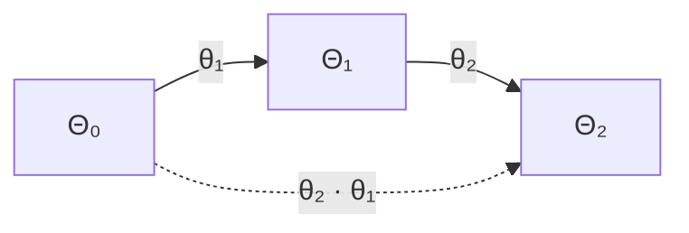
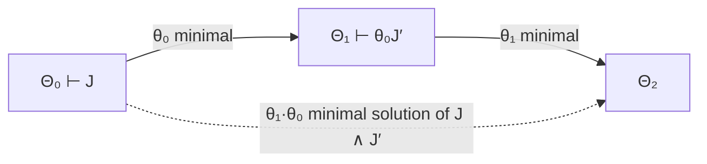

[[book-guidelines|↩ Back to guidelines]]

## Why unification needs a framework before it needs an algorithm

Before Gundry writes a single unification rule, he spends a whole section refusing to write one. That's the tell that something structural is being set up. The usual way unification gets taught is: variables are "unification variables," they live in a mutable substitution (a `Map<Var, Type>` or a union-find structure), and solving an equation means walking types and updating that map. This works, but it hides three questions that come back to bite you the moment you add anything harder than first-order unification (dependent types, units of measure, higher-order patterns — all treated later in this same thesis):

1. **What does a variable depend on?** If you just have a flat map from names to types, "occurs in" and "depends on" look identical — and they are identical for first-order unification. They stop being identical the moment a metavariable's *type* can itself mention other variables (dependent types), or when unification lives in an equational theory that doesn't preserve syntactic occurrence (units of measure, Chapter 3). So you need a representation where dependency is explicit and load-bearing, not something you re-derive from scanning the AST every time.
2. **When has "solving" actually made progress, and how do you know you haven't secretly thrown away generality?** An algorithm that returns *a* solution is easy; proving it returns the *most general* one requires a precise notion of "one solution is more general than another," stated once, reusable for every kind of statement (equations, typing judgments, subsumption) rather than re-proven ad hoc per algorithm.
3. **How do you compose partial solving steps?** Real algorithms don't solve one equation in isolation — they decompose a big constraint into many small ones and solve them one after another, updating the ambient state each time. You need a guarantee that this incremental, "solve one piece, move to the next" strategy doesn't lose generality overall, or your algorithm might be locally optimal and globally wrong.

Section 2.1 answers all three by fixing a single data structure — the **context** — and defining everything else (statements, information increase, minimality) relative to it. Everything downstream in the thesis — Hindley-Milner reconstruction, units-of-measure unification, [[Miller-Pattern-Unification|Miller pattern unification]], even elaboration into a typed core language — is an instance of *this* framework. This is the part of the thesis worth understanding slowly, because it is the part that generalizes.

## Contexts as dependency-ordered lists

Gundry's context grammar (Figure 2.2, book p. 12):

$$
\Theta ::= \cdot \mid \Theta, \alpha : * \mid \Theta, \alpha := \tau : * \mid \Theta, x : \sigma \mid \Theta\#
$$

Read left to right, a context is built by appending one of four kinds of entries onto a (possibly empty, $\cdot$) prefix:

- $\Theta, \alpha : *$ — declare a fresh **type metavariable** $\alpha$ (an unknown, still to be solved for). The "$: *$" is a kind annotation — $*$ is the kind of ordinary types, exactly the role Haskell's `Type` (née `*`) plays.
- $\Theta, \alpha := \tau : *$ — **define** a metavariable: $\alpha$ is no longer unknown, it stands for the type $\tau$.
- $\Theta, x : \sigma$ — an ordinary **term-variable binding** (a lambda-bound or let-bound program variable), with a type scheme $\sigma$ (types possibly wrapped in $\forall$).
- $\Theta\#$ — a bare **locality marker**, discussed below.

The detail that makes this more than bookkeeping: **the list is ordered, and later entries may depend on earlier ones, never the reverse.** A context is *valid* ($\Theta \vdash \mathrm{ctx}$, Figure 2.3) only if every declaration is well-scoped with respect to everything to its *left*. Concretely: $\alpha : *, \beta : *, x : \alpha \to \beta$ is valid (by the time you bind $x$, both $\alpha$ and $\beta$ already exist), but $x : \alpha, \alpha : *$ is not — $x$'s type mentions $\alpha$ before $\alpha$ has been introduced. This single ordering discipline is what lets the thesis later say precisely what it means for a variable to be "more global" or "more local": position in the list *is* the dependency relation. Entries on the right are "harder to depend on, and correspondingly easier to generalise" — a phrase that becomes load-bearing in Section 2.3's treatment of let-generalisation.

**What breaks without this:** if you instead kept metavariables in an unordered set (as many textbook presentations implicitly do, relying on a side-condition "no cycles"), you'd have no principled way to ask "can I safely move this variable's definition further left/right without invalidating something," which is exactly the question every step of the unification algorithm (Section 2.2) has to answer to decide where in the context to place a new definition.

### Grounding: a context as a data structure

The context is precisely the data structure a real elaborator's metavariable store has to be. In Lean's elaborator this is the `MetavarContext`/local context pair; in a hand-rolled Rust checker you'd model it directly as an ordered `Vec`:

```rust
enum Entry {
    MetaDecl(MetaVar),                  // α : *
    MetaDefn(MetaVar, Type),            // α := τ : *
    TermVar(Var, Scheme),               // x : σ
    Locality,                           // #
}

struct Context {
    entries: Vec<Entry>, // dependency order: index i may only mention indices < i
}
```

The invariant "index $i$ may only refer to entries at index $< i$" is exactly $\Theta \vdash \mathrm{ctx}$, and it is precisely the invariant a real implementation must maintain by construction (e.g. by only ever pushing new metavariables at the *current* rightmost position, or splicing them in leftward with an explicit dependency-respecting insertion routine — this is what "moving a variable through the context" concretely computes in Section 2.2).

In Lean, this correspondence is exact enough to be worth stating directly: Lean's `LocalContext` is a dependency-ordered list of free-variable declarations, and its metavariable context tracks, for each metavariable, the local context it was created in — which *is* a $\Delta$/$\Xi$-style dependency suffix (this reappears explicitly as $\alpha[\Delta]$ in Chapter 7's parameterised metavariables). Definitional equality checking in Lean's kernel (`isDefEq`) is unification over exactly this kind of ordered context, extended with universes and dependent types.

## Statements-in-context and sanity conditions

Having fixed what a context *is*, Gundry needs a uniform notion of what can be *asked* of one. A **statement** $J$ is anything judgeable in a context (Section 2.1.1):

$$
J ::= \mathrm{ctx} \mid \sigma : * \mid \tau \equiv \upsilon : * \mid t : \sigma \mid \sigma \sqsubseteq \sigma' \mid J \wedge J'
$$

— context validity, well-formedness of a scheme, type equality, term typing, [[Hindley-Milner-Type-Inference-Reconstructed#Generic instantiation|generic instantiation]], and conjunction. This grammar is the single move that lets one framework cover unification *and* type inference *and* (later chapters) subsumption and elaboration: they are all instances of "does $\Theta \vdash J$ hold, and if not, what's the least we can do to $\Theta$ to make it hold." Conjunction gets ordinary introduction/elimination rules, letting composite problems (like "unify these two equations, then check this term has this type") be expressed as a single statement.

The subtlety is that not every syntactically well-formed $J$ is *meaningful*. "$\tau \equiv \upsilon$" only makes sense if $\tau$ and $\upsilon$ are themselves well-formed types; "$t : \sigma$" only makes sense if $\sigma$ is a well-formed scheme. Gundry calls the necessary precondition for meaningfulness the **sanity condition**, $\mathrm{San}\ J$:

$$
\begin{aligned}
\mathrm{San}\ \mathrm{ctx} &\mapsto \mathrm{ctx} \\
\mathrm{San}\ (\sigma : *) &\mapsto \mathrm{ctx} \\
\mathrm{San}\ (\tau \equiv \upsilon) &\mapsto \tau : * \wedge \upsilon : * \\
\mathrm{San}\ (t : \sigma) &\mapsto \sigma : * \\
\mathrm{San}\ (\sigma \sqsubseteq \sigma') &\mapsto \sigma : * \wedge \sigma' : * \\
\mathrm{San}\ (J \wedge J') &\mapsto \mathrm{San}\ J \wedge \mathrm{San}\ J'
\end{aligned}
$$

**Lemma 2.1 (Sanity conditions)** states that $\Theta \vdash J$ *implies* $\Theta \vdash \mathrm{San}\ J$ — sanity is a theorem about the rules, not a side-condition you get to assume. This is the same move as Martin-Löf's distinction between a judgment being *meaningful* and being *true*: you have to establish meaningfulness (the type of a typing judgment is well-formed) before "true" (a term inhabits it) is even a question you can ask. **What breaks without this:** if you allow yourself to write inference rules that produce statements without checking their sanity conditions hold, you can derive nonsense — e.g. "prove" a term has an ill-scoped type, because nothing forced the type to make sense first. Sanity conditions are the thesis's way of making that structurally impossible: every rule that introduces a statement must independently establish, or inherit, its sanity condition.

This is precisely the shape of a **judgment form** as the shared ancestor of a type checker and a proof checker: "$\Theta \vdash J$" is uniform machinery, and the sanity-condition lemma is the well-formedness discipline that keeps a proof-term/type-checker (like a Lean-style kernel) from ever being asked to validate an object that was never well-formed to begin with — the trusted-kernel discipline of *check well-formedness before you check truth*.

## Information increase: metasubstitutions as an order on contexts

Now the central definition. Solving anything — a unification problem, a typing problem — means turning some declarations into definitions, or substituting concrete types for metavariables. Gundry wants one relation, $\theta : \Theta_0 \sqsubseteq \Theta_1$ ("$\theta$ is an information increase / metasubstitution from $\Theta_0$ to $\Theta_1$"), that captures *every* legitimate way $\Theta_1$ can be "more informative" than $\Theta_0$ while still being *the same problem*: same term variables in scope, same dependency skeleton, just some previously-unknown metavariables now pinned down.

Formally (Figure 2.4), $\theta$ is a finite map from $\Theta_0$'s metavariables to well-formed types in $\Theta_1$, defined by recursion on $\Theta_0$'s structure:

- On an empty context, $\theta$ can map into any $\Theta_1$ that merely adds metavariable declarations $\Xi$ ($[] : \cdot \sqsubseteq \Xi$).
- On $\Theta_0, \alpha : *$, extending $\theta$ requires giving $\alpha$ some well-formed $\tau$ in $\Theta_1$: $(\theta, \tau/\alpha) : \Theta_0, \alpha:* \sqsubseteq \Theta_1$.
- On $\Theta_0, \alpha := \upsilon : *$ (already-defined), extending $\theta$ requires the chosen $\tau$ to be *provably equal in $\Theta_1$* to the old definition pushed through $\theta$ — you're allowed to give a defined variable a more concrete presentation, but not to redefine it inconsistently.
- On $\Theta_0, x : \sigma$, $\Theta_1$ must still bind $x$, now at the substituted scheme $\theta\sigma$ (possibly with more metavariables $\Xi$ appended after it).
- On $\Theta_0\#$, the locality marker is preserved on both sides, again allowing extra metavariables $\Xi$ after it in $\Theta_1$.

Two facts about this order matter immediately:

- **Identity.** $\iota : \Theta \sqsubseteq \Theta'$ where $\Theta'$ just extends $\Theta$'s variables — "doing nothing" is always a valid (trivial) increase. This is the order's reflexivity.
- **Equivalence of metasubstitutions**, $\theta \equiv \theta' : \Theta_0 \sqsubseteq \Theta_1$, says two different metasubstitutions produce provably-equal results on every variable — this is what lets "most general solution" later be stated as uniqueness *up to* this equivalence, not literal syntactic identity.

### Grounding: this is exactly substitution-through-a-context, generalized

If you've implemented a type checker, you've written the special case of this already: applying an accumulated substitution map to a type before comparing it to another. What's new here is that the *substitution itself is typed relative to two contexts*, and its validity is checked structurally against both. In Rust terms:

```rust
// θ : Θ0 ⊑ Θ1 — a finite map with a validity proof obligation against both contexts
struct MetaSubst {
    mapping: HashMap<MetaVar, Type>, // domain ⊆ Θ0's metavariables
}

fn is_valid_increase(theta: &MetaSubst, theta0: &Context, theta1: &Context) -> bool {
    // structural recursion on theta0, mirroring Figure 2.4 rule-by-rule
    ...
}
```

The Lean analogue is more direct still: assigning a metavariable in Lean's `MetavarContext` (`assignExprMVar`) *is* extending such a $\theta$, and Lean's occurs-check / dependency-tracking on assignment (Lemma 2.7, discussed below) exists for exactly the reason this section exists — to guarantee the assignment is a genuine increase relative to the metavariable's declared local context, not a self-referential or out-of-scope one.

## Stability: why information increase can't retroactively break things

An information increase is only useful if it's *safe*: extending $\Theta_0$ to $\Theta_1$ should never invalidate something that was already established. Gundry calls a statement **stable** if it survives metasubstitution:

$$
\Theta_0 \vdash J \text{ and } \theta : \Theta_0 \sqsubseteq \Theta_1 \implies \Theta_1 \vdash \theta J
$$

**Lemma 2.2 (Stability)** proves every derivable statement is stable, by structural induction on derivations. The proof technique is worth internalizing on its own, independent of this thesis: Gundry designs the deduction system so that *the only rule permitted to consult the context directly* is a generic **lookup** rule,

$$
\dfrac{\Theta \ni J}{\Theta \vdash J} \quad \text{lookup}
$$

("if $J$ is literally an entry in $\Theta$, then $\Theta$ proves $J$"). Every other rule builds statements purely from *other statements*, never by peeking at $\Theta$ some other way. Given that discipline, showing stability reduces to: (a) lookup is stable, because metasubstitution acts on context entries the same way it acts on statements by construction, and (b) every other rule is stable *because its premises are*, by a routine "strictly positive occurrence" induction.

**What breaks without this discipline:** if you let a rule inspect the context in some ad hoc way (say, "succeed if this variable happens not to appear elsewhere in $\Theta$" without going through lookup), you lose the guarantee for free and have to reprove stability by hand for that rule, every time, forever. Gundry's point is structural: get the discipline right once, and every subsequent extension of the system (units of measure, dependent types, evidence terms) inherits stability automatically, as long as it keeps obeying the same discipline.

Stability is also precisely what licenses **composing** two solving steps: if $\theta : \Theta_0 \sqsubseteq \Theta_1$ solves $J$, applying a further increase $\theta' : \Theta_1 \sqsubseteq \Theta_2$ must still leave $\theta J$ solved (as $\theta'\theta J$) — otherwise "solve step 1, then solve step 2" wouldn't even be a coherent strategy. This is the seed of the Optimist's lemma below.

## Contexts as a category

Composition of metasubstitutions, $\theta_2 \cdot \theta_1$, is defined by applying $\theta_2$ to every type in $\theta_1$'s range. Given stability, this composition is well-typed:

**Lemma 2.3 (Category of contexts).** $\theta_1 : \Theta_0 \sqsubseteq \Theta_1$ and $\theta_2 : \Theta_1 \sqsubseteq \Theta_2$ imply $\theta_2 \cdot \theta_1 : \Theta_0 \sqsubseteq \Theta_2$.

Together with the identity $\iota$ and associativity of composition (routine), this literally makes **contexts the objects and information increases the morphisms of a category**. This isn't decoration — it's the guarantee that "solve, then solve further" is compositional in the strict categorical sense: you can chain any number of solving steps and the result is still a single well-formed information increase from where you started to where you ended up. If you're comfortable thinking of Rust traits or Haskell type classes in terms of functor laws, this is the same kind of "the operations I've defined actually satisfy the algebraic laws I'm implicitly relying on" check, just applied to a bookkeeping structure instead of a container type.



## Localities and the `#` marker

The `#` entry exists to encode a notion of *scope rank* directly in the context, rather than as separate bookkeeping alongside it. A **locality** is a maximal run of the context containing only metavariable declarations — term-variable bindings and `#` markers are the only things that end one. Concretely, in $\Theta \# \Theta'$, everything in $\Theta'$ is "local" relative to the boundary; everything in $\Theta$ is "global."

Two properties make this genuinely useful rather than cosmetic:

1. **It doesn't change provability.** $\Theta \# \Theta' \vdash J$ if and only if $\Theta, \Theta' \vdash J$ — the marker carries *no* logical content, only structural information about where solving is "allowed to commit."
2. **It makes commitment irrevocable in one direction.** Moving a metavariable from the right of a `#` to its left — i.e., $\Theta \# \alpha : *, \Theta' \sqsubseteq \Theta, \alpha : * \# \Theta'$ — is a valid information increase, but the reverse is *not*. Once a variable becomes "more global," it can't be pushed back local again.

**What breaks without this:** efficient Hindley-Milner generalisation algorithms (the ones used in real compilers, not the naive "generalise everything not free in the environment" specification) work by remembering a *rank* — roughly, "how deep in the let-nesting was this metavariable created" — so that generalising a `let` only has to inspect variables created since that `let`'s own rank, not the whole context. The `#` marker *is* that rank marker, made syntactically explicit inside the context itself instead of tracked as auxiliary mutable state. This directly answers one of the guidelines' own key questions for this chapter: the marker encodes rank *precisely* by making "everything right of my nearest `#`" the cheap-to-generalise set, and Section 2.3's algorithmic treatment of `let`-generalisation is literally "skim the metavariables in the current locality."

## Constraints, minimal solutions, and most general unifiers

With statements, sanity, and information increase in hand, Gundry can finally define what "solving a problem" means in full generality (Section 2.1.3):

- A **constraint problem** is a pair $(\Theta_0, J)$ such that $\Theta_0 \vdash \mathrm{San}\ J$ — a context together with a statement that at least *makes sense* in it (but need not yet hold).
- A **solution** is a context $\Theta_1$ and an information increase $\theta : \Theta_0 \sqsubseteq \Theta_1$ such that $\Theta_1 \vdash \theta J$ — the increase is exactly enough to make the (substituted) statement actually true.
- A solution $\theta$ is **minimal** if every other solution $\theta' : \Theta_0 \sqsubseteq \Theta'$ factors through it: there is some $\zeta : \Theta_1 \sqsubseteq \Theta'$ with $\theta' \equiv \zeta \cdot \theta$. In words: any other way of solving the problem is "$\theta$, plus possibly more."

A **unification problem** is the special case where $J$ is an equation $\tau \equiv \upsilon$; a solution is a **unifier**, and a minimal solution is, by definition, a **most general unifier (mgu)**. This is the payoff of the whole apparatus: "most general" stops being an informal adjective attached to one particular algorithm's output, and becomes a precise, algorithm-independent property (factor-through-every-other-solution) that you can ask of *any* constraint problem — typing, subsumption, unification, or a conjunction of all three.

Note the restraint in scope: information increase in general allows *either* defining a metavariable *or* substituting some other type for it wholesale, but Gundry states upfront that "the algorithms presented here exploit only the former" — solutions of the shape $\Theta_0 \sqsubseteq \Theta_1$ where $\Theta_1$ extends $\Theta_0$ purely by turning declarations into definitions, never by substituting into the fixed skeleton. The generality results still hold with respect to *arbitrary* information increases — definition-only solving is shown to already be as general as anything unrestricted substitution could achieve.

### Grounding: minimality as "no unnecessary commitment"

This is the formal version of an intuition every engineer who has hand-rolled a unifier already has: "don't specialize a type variable more than the equation forces you to." A Rust unifier's `unify(a, b)` that, given `Vec<T>` and `Vec<U>` with `T`, `U` both unbound, sets `T := U` (or vice versa) rather than inventing some concrete type is behaving minimally; one that defaults unconstrained variables to, say, `()` when it doesn't have to, is *sound* but not minimal — it forecloses solutions a caller might have wanted. The factor-through condition is exactly "my solution is a prefix of every other valid solution."

## Sequential solving: the Optimist's lemma

Stability licenses solving conjunctions piece by piece: if $\theta_0 : \Theta_0 \sqsubseteq \Theta_1$ solves $J$, and $\theta_1 : \Theta_1 \sqsubseteq \Theta_2$ solves $\theta_0 J'$ (the second statement, *updated* by whatever the first step learned), then $\theta_1 \cdot \theta_0 : \Theta_0 \sqsubseteq \Theta_2$ solves $J \wedge J'$. That much follows from stability alone and would hold for *any* sound solving strategy. The genuinely useful fact is that this greedy, sequential strategy also preserves *minimality*:

**Lemma 2.4 (The Optimist's Lemma).** If $\theta_0 : \Theta_0 \sqsubseteq \Theta_1$ is a *minimal* solution of $J$, and $\theta_1 : \Theta_1 \sqsubseteq \Theta_2$ is a *minimal* solution of $\theta_0 J'$, then $\theta_1 \cdot \theta_0$ is a *minimal* solution of $J \wedge J'$.

*Proof sketch (Gundry's, compressed):* take any solution $\zeta : \Theta_0 \sqsubseteq \Theta$ of $J \wedge J'$. It certainly solves $J$ alone, so by minimality of $\theta_0$ it factors as $\zeta \equiv \zeta_1 \cdot \theta_0$ for some cofactor $\zeta_1 : \Theta_1 \sqsubseteq \Theta$. That cofactor must itself solve $\theta_0 J'$ (because $\zeta$ solved $J'$, transported through $\theta_0$), so by minimality of $\theta_1$, $\zeta_1$ factors through $\theta_1$ too. Chain the two factorizations and $\zeta$ factors through $\theta_1 \cdot \theta_0$.

This is the lemma that makes a *practical* unification or type-inference algorithm possible at all: you never have to look ahead and jointly solve a whole conjunction of constraints at once to guarantee overall generality. Solve the first piece optimally, greedily commit to that answer, propagate it into the rest of the problem, solve the rest optimally against the *updated* state — and the composite is guaranteed optimal too. This is precisely the local-reasoning property a constraint-solving elaborator or a CSP-style backward-chaining search needs to be tractable: each subgoal can be discharged independently and its result trusted downstream, rather than requiring global backtracking to verify overall generality. (Compare the "footnote" name itself — after McBride's "optimistic optimisation": optimism here isn't recklessness, it's a *proven license* to commit early.)



**What breaks without it:** without a proof like this, "solve constraints left to right" is only ever a *heuristic* — you'd need a separate generality argument (or worse, a counterexample search) every time you introduced a new kind of composite constraint. This is exactly why Chapter 7's elaboration algorithm, built on the same framework, can reduce implicit-argument synthesis and subsumption checking to backward-chaining constraint solving and still claim the result is principal: it is standing on this lemma.

## Context replacement: the Isomorphism lemma

The last piece closes a loose end: minimal solutions are stated relative to a *specific* pair of contexts $(\Theta_0, \Theta_1)$, but real algorithms constantly present "the same" context in a different concrete form — reordered where order doesn't matter, or with bookkeeping variables renamed. Gundry needs minimality to survive such re-presentation.

Call $\zeta : \Theta \sqsubseteq \Theta'$ an **isomorphism** if it has a two-sided inverse: some $\zeta^{-1} : \Theta' \sqsubseteq \Theta$ with $\zeta^{-1} \cdot \zeta \equiv \iota$ and $\zeta \cdot \zeta^{-1} \equiv \iota$ — the categorical notion of isomorphism, instantiated at this category of contexts (Lemma 2.3's category, now put to use).

**Lemma 2.5 (Isomorphism lemma).** If $\theta : \Theta_0 \sqsubseteq \Theta_1$ is a minimal solution of $J$, and $\zeta : \Theta \sqsubseteq \Theta_0$, $\zeta' : \Theta_1 \sqsubseteq \Theta_0'$ are isomorphisms, then $\zeta' \cdot \theta \cdot \zeta : \Theta \sqsubseteq \Theta_0'$ is a minimal solution of $\zeta^{-1} J$.

In plain terms: minimality is preserved under transporting the whole problem across an isomorphism of contexts on *either* end. This is what licenses an algorithm to freely present a context in a convenient isomorphic shape mid-derivation (reorder independent declarations, rename metavariables, restructure a `Ξ` block) without invalidating the generality guarantees already established — you're allowed to change the picture, as long as the change is invertible.

**What breaks without it:** without this lemma, every step of a proof-by-induction on the unification algorithm's rules (Section 2.2, e.g. the `subs` rule, which literally substitutes through the context and re-presents it) would need a fresh, ad hoc argument that re-presenting the context didn't secretly lose generality. Gundry proves it once, generically, and every later appeal to "WLOG the context looks like this" cashes out through this lemma.

## Where this leads

Section 2.1's entire apparatus — contexts, statements, sanity, information increase, stability, localities, minimal solutions, the two composition lemmas — exists to make Section 2.2's unification algorithm and Section 2.3's type-inference algorithm both come out as straightforward *instances*: unification is just constraint-solving where $J$ is an equation, applying the Optimist's lemma equation-by-equation as a bigger equation decomposes structurally; let-generalisation (Section 2.3) is just "skim the locality," licensed by the `#` marker discussed above. Chapter 3 (units of measure) and Chapter 4 (Miller pattern unification for dependent types) both keep this same context/statement/information-increase skeleton and change only the equational theory or the shape of statements being solved — which is the strongest evidence the framework is doing real generalizing work rather than being restated by fiat each time.

For the standing compiler/elaborator project this vault is tracking (`type-theory`, `automated-reasoning`): this section *is* the blueprint for how a metavariable context should be represented in a Rust-based checker with a Miller-pattern-style unifier — dependency order enforced structurally (not just checked after the fact), an explicit stability discipline via a single lookup rule so that every extension to the type system (refinement predicates, Hoare-style contracts) inherits soundness of substitution for free, and the Optimist's lemma as the theoretical justification for implementing constraint solving as sequential, greedy, locally-verified steps rather than a global search — exactly the shape a backward-chaining proof-search kernel (in the spirit of Lean's elaborator) needs in order to scale. The `#`/locality mechanism is also the direct ancestor of Chapter 7's *parameterised* metavariables $\alpha[\Delta]$, which will matter again the moment the project's elaborator needs metavariables under binders — i.e., almost immediately once refinement types or dependent contracts are added.
