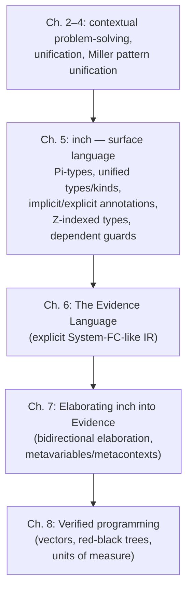

[[book-guidelines|↩ Back to guidelines]]

# Dependent Types in Haskell

## The problem: Haskell already "has" dependent types, badly

By the time Gundry writes this thesis (2013), Haskell programmers had spent a decade faking dependent types with generalised algebraic datatypes (GADTs), type families, and singleton libraries. All of these can express something like a length-indexed vector. None of them are actually pleasant to program in — the syntax is heavy, error messages are unreadable, and every construct is a workaround for a language feature that doesn't exist yet: a genuine dependent function type. Chapter 5 opens with the wish-list version of what programming with type-level numbers *should* look like:

```haskell
data Vec :: * -> N -> * where
  Nil  :: Vec a Zero
  Cons :: a -> Vec a n -> Vec a (Suc n)

append :: Vec a m -> Vec a n -> Vec a (m + n)
append Nil         ys = ys
append (Cons x xs) ys = Cons x (append xs ys)

replicate :: Pi (n :: N) -> a -> Vec a n
replicate Zero    = Nil
replicate (Suc n) x = Cons x (replicate n x)
```

`replicate`'s signature is the whole chapter in miniature: `n` has to be known *statically* (it determines the shape of the output type) and it has to exist *dynamically* (the function recurses on it at runtime, matching `Zero` versus `Suc n`). Neither GADTs nor type families nor singleton encodings give you that single, unified binder — each is a workaround that recovers only part of the behavior. `inch` (the language this thesis designs) is Gundry's answer: extend Haskell with real $\Pi$-types, unify types and kinds, use integers instead of naturals as the primitive index kind, and give the programmer fine-grained control over which arguments are implicit versus explicit. This is deliberately *not* an attempt to turn Haskell into Agda — the design stays close enough to Haskell's phase distinction (compile-time erasure of types) that more powerful, more automatic type inference stays possible, at the cost of expressivity a full-spectrum theory would give you.

The chapter is a *survey-by-contrast*: each `inch` feature is introduced by first showing the existing GHC/library-based simulation, diagnosing exactly what it can't do or does clumsily, and then presenting `inch`'s alternative. That structure is preserved below.

---

## 1. Promoted datatypes and the types/kinds identification

**What breaks without this.** Before datatype promotion, Haskell's kind system had exactly one interesting kind, `*` (the kind of types), plus function kinds built from it. If you wanted to index a `Vec` by a natural number, there was no kind of naturals to index by — you had to *fake* naturals as ordinary types (`data Zero`, `data Succ n`) and get no static guarantee that a `Vec`'s index position is actually filled by a number rather than, say, `Bool`. GHC's *datatype promotion* (Yorgey et al. 2012) fixes exactly this: an ordinary algebraic datatype like

```haskell
data Nat = Zero | Suc Nat
```

is automatically lifted so that `Nat` becomes usable as a *kind*, and `Zero`/`Suc` become usable as *types* of that kind:

```haskell
data Vec :: * -> Nat -> * where
  Nil  :: Vec a Zero
  Cons :: a -> Vec a n -> Vec a (Suc n)
```

This is real progress — it's now ill-kinded to index `Vec` by anything but a promoted `Nat`. But promotion is a one-way door with a hole in it: **GADTs themselves cannot be promoted.** This blocks a whole class of "doubly dependent" encodings. Gundry's example is the textbook well-typed-terms GADT, but with the context represented as a `Vec` of kinds rather than an ordinary list — you'd want to index `Tm` by a promoted `Vec`, and you can't, because `Vec` is a GADT:

```haskell
data Elem :: Vec k n -> k -> * where
  Top :: Elem (Cons a v) a
  Pop :: Elem v a -> Elem (Cons b v) a
data Tm :: Vec * n -> * -> * where          -- rejected: Vec can't be promoted
  Var :: Elem v a -> Tm v a
  Lam :: Tm (Cons a v) b -> Tm v (a -> b)
  App :: Tm v (a -> b) -> Tm v a -> Tm v b
```

`inch`'s move — following Weirich, Hsu, and Eisenberg (2013) — is more radical than promotion: **stop distinguishing types and kinds at all.** Adopt the rule $* : *$ (the kind of types is itself a type, classifying itself) instead of a stratified universe hierarchy. In a genuinely dependently typed setting $* : *$ is a well-known route to logical inconsistency (Girard's paradox; the same trap caught Martin-Löf's original 1971 type theory) — but Haskell has general recursion and non-termination anyway, so there is no logical soundness to lose. What you *do* still want — and still get — is **type soundness** in the programming-languages sense (progress and preservation): well-typed programs don't get stuck, even though the type system proves nothing in the logical sense. Collapsing types and kinds also means type-checking and kind-checking literally become the *same* algorithm, which is a real simplification for the compiler, not just an aesthetic one.

*Rust/Lean framing.* This is the PL-vs-logic distinction your elaborator design has to get right early: Rust's trait system deliberately has no such promotion story (a `struct` is never a "kind"), so there's no direct Rust analogue here — this is squarely a `type-theory` design decision about universe stratification. In Lean, this is exactly the question of whether `Type` itself has type `Type` (inconsistent, `Type : Type`) versus a cumulative hierarchy `Type 0 : Type 1 : Type 2 : ...` (what Lean actually does). `inch` knowingly takes Haskell into "Girard's paradox" territory and accepts it because Haskell was never trying to be a proof checker — a design point worth remembering when you decide how strict your own kernel's universe discipline needs to be: it depends entirely on whether the kernel is asked to certify proofs or just types.

---

## 2. GADTs and equality constraints — the mechanism inch replaces

The chapter treats GADTs as the load-bearing *existing* mechanism and is explicit about the translation that makes them work: **a GADT is sugar for equality constraints.** Take the naive numerically-indexed vector encoded without kind promotion at all (using bare, non-promoted types to stand for numbers):

```haskell
data ZeroType
data SucType :: * -> *
data VecGADT :: * -> * -> * where
  NilGADT  :: VecGADT a ZeroType
  ConsGADT :: a -> VecGADT a n -> VecGADT a (SucType n)
```

The **GADT translation** replaces each expression appearing in an index position of the constructor's result type with a fresh variable, and adds an equality constraint tying that variable back to the original expression:

```haskell
NilGADT  :: forall a m.   m ~ ZeroType         => VecGADT a m
ConsGADT :: forall a m n. m ~ SucType n => a -> VecGADT a n -> VecGADT a m
```

Pattern-matching on `NilGADT` or `ConsGADT` later *discharges* that equality constraint into scope, which is precisely how a GADT match lets you learn something about a type index. This is the mechanism your compiler's own definitional-equality machinery has to reproduce if it supports anything GADT-shaped: **a constructor pattern match is a local extension of the equality theory**, not just a value binding. It generalizes further into **associated type families** (type-level functions defined by pattern-matching equations, e.g. `type instance SucType m + n = SucType (m + n)`), and their multi-parameter-type-class/functional-dependency cousins. Both approaches share the same weakness Gundry flags: type-level programming with these tools is *untyped* in the sense that everything still has kind `*` — nothing stops you from writing `type instance Z + Bool = Z`, because there's no kind discipline distinguishing "numbers" from "arbitrary types" at the level these mechanisms operate. This is exactly the promotion problem from §1 wearing a different hat.

---

## 3. Singleton types as a term-type bridge

**What breaks without this.** A $\Pi$-type needs a value that's simultaneously a type index *and* a runtime-inspectable value. Without native $\Pi$-types, you need some way to connect a term-level `Nat` to a type-level `Nat`. The **singleton type** trick does this by defining, for each promoted datatype, a GADT with *exactly one inhabitant per index*:

```haskell
data SingNat :: Nat -> * where
  SingZero :: SingNat Zero
  SingSuc  :: SingNat n -> SingNat (Suc n)
```

Because `SingNat n` has exactly one possible constructor shape for each `n`, pattern-matching on a `SingNat` value simultaneously tells you the *runtime* shape (was it `SingZero` or `SingSuc`?) and refines the *type-level* `n` in the surrounding equality theory. `replicate` becomes:

```haskell
replicateSing :: SingNat n -> a -> Vec a n
replicateSing SingZero      = Nil
replicateSing (SingSuc n) x = Cons x (replicateSing n x)
```

This works, but at a real cost the chapter is careful to name: **duplication**. You now have three parallel representations of "a number" — the runtime `Nat`, the type-level promoted `Nat`, and the singleton `SingNat` connecting them — and converting between the runtime and singleton worlds needs its own conversion functions:

```haskell
forget   :: SingNat n -> Nat
remember :: Nat -> (forall n. SingNat n -> t) -> t
```

`remember`'s type is itself instructive: to go from an *erased* runtime `Nat` to a singleton whose index `n` is statically meaningful, you have to use a **rank-2, existentially-quantified continuation** — there is no way to just "return" a `SingNat n` for some unknown `n` without either an existential package or higher-rank polymorphism. That need for higher-rank types to simulate something a native $\Pi$-type gives you for free is the chapter's core complaint about the singleton approach, and it's why libraries like `singletons` (Eisenberg & Weirich) exist purely to auto-generate this boilerplate via Template Haskell.

*Grounding.* In Lean, this whole apparatus is unnecessary because a value like `n : Nat` already lives in both worlds at once — you can pattern-match on it (runtime behavior) and it can appear in a type like `Vec α n` (compile-time index) without ever needing a "singleton" shadow copy. That's precisely the gap `inch`'s $\Pi$-type is designed to close for Haskell. Structurally, the singleton pattern is the same shape as a Rust newtype wrapping a `PhantomData<N>` where `N` is a type-level marker — you get compile-time tracking but need explicit `From`/`Into`-style conversions to move between the runtime value and the phantom-typed wrapper, exactly mirroring `forget`/`remember`.

---

## 4. $\Pi$-types as dependent function spaces available at runtime *and* compile time

This is the chapter's central positive proposal, and its definition is precise: a $\Pi$-type is a function space where the argument is **both** statically available (for the type of the result to depend on) **and** dynamically available (for the function body to pattern-match on, recurse on, and otherwise compute with). `inch`'s native syntax needs no singleton detour at all:

```haskell
replicate :: Pi (n :: N) -> a -> Vec a n
replicate Zero    = Nil
replicate (Suc n) x = Cons x (replicate n x)
```

The variable `n` is bound the same way a universally quantified type variable would be in a type scheme, but it *also* shows up as a genuine constructor pattern in the equations defining the function — that dual role (binder in the type, scrutinee in the term) is exactly what "runtime and compile time" means here. It's worth contrasting this with Dependent ML's `Pi a : gamma . tau`, which the chapter is careful to distinguish: DML's `Pi` is a **parametric** quantifier over an *index* — the bound value `a` is never available at runtime and can never be eliminated by case analysis. DML's `Pi` corresponds to `inch`'s `forall`, not to `inch`'s `Pi`. This terminological trap is worth internalizing precisely because the same Greek letter is doing double duty across the literature for two genuinely different binders — one erased, one not.

*Grounding.* A Rust `enum` with a `const N: usize` generic parameter gets partway there (the parameter is available at both compile time, for array sizing, and can in principle drive runtime dispatch) but Rust's const generics are still far more restricted (no dependent pattern matching on `N` shaping the *type* of subsequent code) — this is a case where Rust's type system genuinely can't express the full construct, worth flagging explicitly rather than forcing an analogy. Lean's ordinary `Pi` binder `(n : Nat) -> Vec a n` *is* the literal target: this is precisely what `inch`'s `Pi` is trying to recover for Haskell, and it's the reason the `type-theory` framing throughout this chapter reads as "how do you retrofit Lean's basic binder into a language that started without it."

---

## 5. Dependent existential types

DML also supports *existentially* quantified dependent types directly — you can write "a vector of *some* length" as a first-class type, e.g. for `filter`, whose output length can't be predicted statically:

$$\texttt{filter} : (a \to \mathrm{Bool}) \to \mathrm{Vec}\ a\ n \to \exists m.\ \mathrm{Vec}\ a\ m$$

This is expressive but the chapter is blunt about the cost: combining full existential dependent types with parametric polymorphism "significantly complicates type inference." `inch` deliberately takes the weaker, Haskell-idiomatic route instead — Läufer and Odersky's (1992) trick of attaching the existential to a **data constructor**, so the existential package is closed when the value is built and reopened by pattern-matching:

```haskell
data Ex :: (k -> *) -> * where
  MkEx :: f x -> Ex f

unEx :: forall a f. (forall x. f x -> a) -> Ex f -> a
unEx g (MkEx x) = g x
```

`Ex (Vec a)` recovers "vector of existentially-quantified length" exactly, and elimination is safe because it only requires rank-2 polymorphism (`unEx`'s type), not a bespoke existential-elimination rule in the type theory. The tradeoff is explicit and deliberately accepted: this is *less flexible* than DML's genuine existentials (argument order to type constructors like `Ex` becomes bureaucratically significant — `Ex (Vec a)` versus the useless `Ex (Vec n)`), but it's *dramatically simpler* for type inference, and Haskell programmers already know it from ordinary `data ... = forall a. MkBox a` existentials. This is a running theme of the whole chapter: at every choice point, `inch` picks the option that keeps type inference tractable over the option that maximizes raw expressivity.

---

## 6. Implicit versus explicit arguments — and where Milner's coincidence breaks

This section is the chapter's sharpest piece of conceptual analysis. Milner (1978) achieved what Lindley and McBride call a "remarkable coincidence": three independent binary distinctions line up perfectly in ML-style languages.

| | Types | Terms |
|---|---|---|
| In source language | Implicit | Explicit |
| Abstraction | Dependent ($\forall$) | Non-dependent ($\to$) |
| Runtime | Erased | Present |

In other words: type arguments are always implicit, always introduced by $\forall$, and always erased before runtime — and term arguments are the mirror image on all three axes. This coincidence is so convenient that it's easy to stop noticing it's *three separate design choices* that merely happen to align in Hindley-Milner. Once you add richer type systems, they come apart:

- **Typeclasses** (Wadler & Blott 1989) give you implicit *term-level* arguments (dictionaries) that are *not* erased at runtime — implicit and erased have decoupled.
- **GHC's ambiguous-type problem** shows the opposite failure: sometimes you have a *static, unerased-in-spirit* argument that GHC insists must stay implicit and tries (and sometimes fails) to reconstruct by unification. The chapter's worked example is sharp:

```haskell
type family F a
f :: F a -> F a
f x = x
g :: F a -> F a
g = f          -- REJECTED by GHC
```

`g`'s type is syntactically identical to `f`'s, yet GHC rejects it: it freshens `a` to `a'` internally, then can't solve `a' ~ a` because `F` might not be injective. The folklore fix — a `Proxy` argument carrying the type explicitly —

```haskell
data Proxy (a :: k) = Proxy
f' :: Proxy a -> F a -> F a
f' x = x
g' :: forall b. F b -> F b
g' = f' (Proxy :: Proxy b)
```

works, but is invasive (you must rewrite the original definition) and syntactically noisy. `inch`'s answer is to make the implicit/explicit choice a first-class, per-argument annotation, borrowing Agda's convention: a **dot** after a binder means implicit quantification, an **arrow** means explicit. So $\forall a.\ \tau$ and $\Pi(n{:}{:}N).\ \upsilon$ are implicit, while $\forall (a{:}{:}*) \to \tau$ and $\Pi n \to \upsilon$ are explicit — and at application sites, named implicit arguments are supplied Agda-style: `f {a = b}`. This directly resolves the `F a` example without a `Proxy`:

```haskell
g'' :: forall b. F b -> F b
g'' = f {a = b}
```

The chapter also shows the class-based approximation of an *implicit* $\Pi$-type (combining typeclasses with the singleton encoding from §3), and is candid about its cost: now there are **three** parallel representations of a number in scope (`Nat`, `SingNat`, `ImplicitNat`), and switching between explicit and implicit modes requires writing `sing :: Sing x` in place of a bare `x` — exactly the boilerplate `inch`'s uniform annotation syntax is designed to eliminate.

*Why this matters for your elaborator.* This section is close to a direct blueprint for implicit-argument resolution in a bidirectional elaborator: `inch`'s per-binder dot/arrow annotation is a *source-level* declaration of which arguments the elaborator must synthesize via unification versus which the surface syntax always supplies — the same distinction your metavariable/pattern-unification design needs to resolve implicit arguments the way Lean's elaborator does. The `F a`/`g` example is also a clean, minimal illustration of *why* metavariable freshening interacts badly with non-injective type functions — a failure mode worth keeping in mind when your own elaborator decides when to generalize versus when to defer to explicit annotation.

---

## 7. Type-level natural numbers and integers

Most Haskell simulations of type-level numbers (and GHC's own `TypeNats` extension) use **naturals**. `inch` deliberately chooses **integers** as the primitive index kind instead, treating `N` (naturals) as sugar: a natural is just an integer paired with an inequality constraint $0 \le n$. The chapter gives three independent reasons for this reversal, and they're all mechanism-level, not stylistic:

1. **Group structure aids unification.** Integers under addition form an abelian group, which means the abelian-group unification algorithm from Chapter 3 (units of measure) applies directly to type-level integer arithmetic — naturals under addition are only a commutative *monoid*, with no subtraction, so this algorithm doesn't transfer as cleanly.
2. **Genuine use cases need negative numbers.** A units-of-measure library (developed later, in Chapter 8) represents a derived unit like $\text{m/s}$ as a vector of integer exponents over base units — metres get exponent $1$, seconds get exponent $-1$. There is no way to express "negative exponent" if the index kind is naturals-only.
3. **Naturals are recoverable, integers aren't (from naturals).** Going from integers to naturals only costs you one inequality constraint; going the other way (recovering negative numbers from a naturals-only kind) isn't possible at all. So integers are the more fundamental choice.

The chapter briefly surveys the competing design space — Zenger's polynomials over $\mathbb{C}$ with Gröbner-basis solving (rejected because it's *too* permissive: constraints solvable over $\mathbb{C}$ needn't have integer solutions, and it can't derive facts like "$n > 0$ implies $n \ge 1$" that only hold over $\mathbb{Z}$) — and settles on integers with an explicit acknowledgment that full nonlinear constraint solving is *out of scope* for this thesis; the emphasis is on the $\Pi$-type mechanism, with numeric constraints handled only as far as **addition and subtraction**, keeping the theory inside decidable Presburger arithmetic.

*Connection to your CSP/SMT kernel.* This is a direct, named precedent for a decision your own compiler will face: choosing $\mathbb{Z}$ (with derived $\mathbb{N}$ via a side constraint) rather than $\mathbb{N}$ as the primitive numeric index domain, specifically because it composes better with a group-based unification/constraint procedure and because units-of-measure-style domains are common downstream consumers. The explicit scoping-out of full nonlinear arithmetic in favor of Presburger-decidable linear constraints is also exactly the boundary your own `sat-smt-csp` component will need to draw somewhere — Gundry draws it at "addition, subtraction, and inequalities," which is a reasonable reference point before reaching for full nonlinear integer arithmetic.

---

## 8. Dependent pattern matching and "learning by testing"

Beyond ordinary constructor pattern-matching (which `inch` already supports, as seen in every `replicate` example above), the chapter introduces one further piece of syntax for **type-refining dynamic tests** — [[The-Evidence-Language#The idea|the idea]], attributed to Altenkirch, McBride, and Swierstra's "Observational equality, now!" line of work, that a runtime boolean test can also refine what the typechecker knows in each branch ("learning by testing"). The mechanism is a guard written in curly braces, in the constraint language itself:

```haskell
ifEq :: Pi (m n :: Z) -> (m ~ n => a) -> a -> a
ifEq m n x y | {m == n}  = x
             | otherwise = y
```

Operationally this is nothing exotic — "drop the curly braces and it's an ordinary Haskell guard" — but *type-theoretically* the curly-brace guard does real work: inside the `{m == n}` branch, the equality constraint `m ~ n` becomes available as a local hypothesis, exactly like the equality a GADT pattern-match would discharge (§2). This is dependent pattern matching's real payoff: the *branch structure of runtime control flow* directly extends the ambient equality theory the typechecker reasons under.

The chapter closes this section with a fallback mechanism for **incomplete constraint solvers** — a real engineering concern once you accept (as `inch` does) that full constraint solving won't be automatic. If the solver can't discharge a true constraint on its own, the programmer can supply a higher-rank "axiom" function as an unsafe coercion, e.g.

```haskell
commutes :: forall (m n :: Z) -> (m * n ~ n * m => a) -> a
```

quantifying *explicitly* (even though `m`, `n` are erased at runtime) over the extra hypothesis, because the typechecker has no way to guess suitable values for `m` and `n` on its own. This is presented candidly as a trusted-library escape hatch, not a general solution — precisely the shape of a **trusted computing base** boundary: a small set of axioms accepted without proof, sitting outside the kernel's own decision procedure.

---

## 9. Type-level constraint languages and inequality constraints

Equality constraints (the `~` used throughout) generalize naturally to a small **decision-procedure interface** for type-level equality:

```haskell
data Id m n where
  Refl :: m ~ n => Id m n
elimEq :: forall a m n. Id m n -> (m ~ n => a) -> a
elimEq Refl x = x

decideEq :: Pi (m n :: Z) -> Maybe (Id m n)
```

and its refinement into an actual decision procedure with a negative case, `Either (Id m n) (Id m n -> Void)` — encoding "definitely equal" or "definitely not equal, here's a refutation function" — with the caveat that in a non-total language like Haskell, `Void`-valued negation isn't fully trustworthy (every type, including `Void`, is technically "inhabited" by $\bot$/non-termination).

Beyond equality, `inch` supports **inequality constraints** ($<, \le, >, \ge$), which is what makes safe, bounds-check-free vector indexing expressible:

```haskell
index :: forall (m :: N). Pi (n :: N) -> n < m => Vec a m -> a
index Zero    (Cons x xs) = x
index (Suc n) (Cons x xs) = index n xs
```

And inequality constraints are precisely how the `N`/`Z` relationship from §7 is realized formally: quantifying over `N` is *defined* as sugar for quantifying over `Z` plus a side constraint, $\Pi(n{:}{:}N).\ t \;\equiv\; \Pi(n{:}{:}\mathbb{Z}).\ 0 \le n \Rightarrow t$. The chapter notes the kinship with — and simplicity relative to — DML's "subset sorts" (restricting an existing sort by an arbitrary constraint), while being explicit that `inch`'s inequality vocabulary is narrower and more special-purpose.

---

## Where this leads



Chapter 5 is deliberately the *design-by-contrast* chapter: it never gives `inch` a formal typing judgment — that's Chapters 6–7's job, where every surface feature introduced here (implicit/explicit binders, $\Pi$-types, dependent guards, integer constraints) gets a precise elaboration target in [[The-Evidence-Language|the Evidence Language]], and the informal "what should this do" narrative here becomes the actual bidirectional inference/checking judgments. Two things surveyed here are directly load-bearing for the `type-theory` focus area of this project:

- **The implicit/explicit annotation scheme (§6)** is the concrete surface syntax whose elaboration (Chapter 7) will require exactly the kind of metavariable-driven implicit-argument resolution your elaborator's unifier needs to perform — this chapter gives the *motivation and failure modes* (Milner's coincidence breaking down, GHC's ambiguous-`F a` rejection) that make clear why that resolution step can't be naive unification alone.
- **Integers-as-primitive-index-kind (§7)** is a direct precedent for the numeric domain choice in a CSP/refinement-type kernel: picking a group-structured domain because it composes with an existing unification algorithm, while explicitly scoping constraint solving to a decidable (Presburger) fragment rather than promising full nonlinear arithmetic up front.

The chapter is intentionally light on formalism — no inference rules, no proofs — because its job is to motivate *why* the machinery of the next three chapters (evidence terms, elaboration, bidirectional typing) needs to exist at all before it's introduced.
