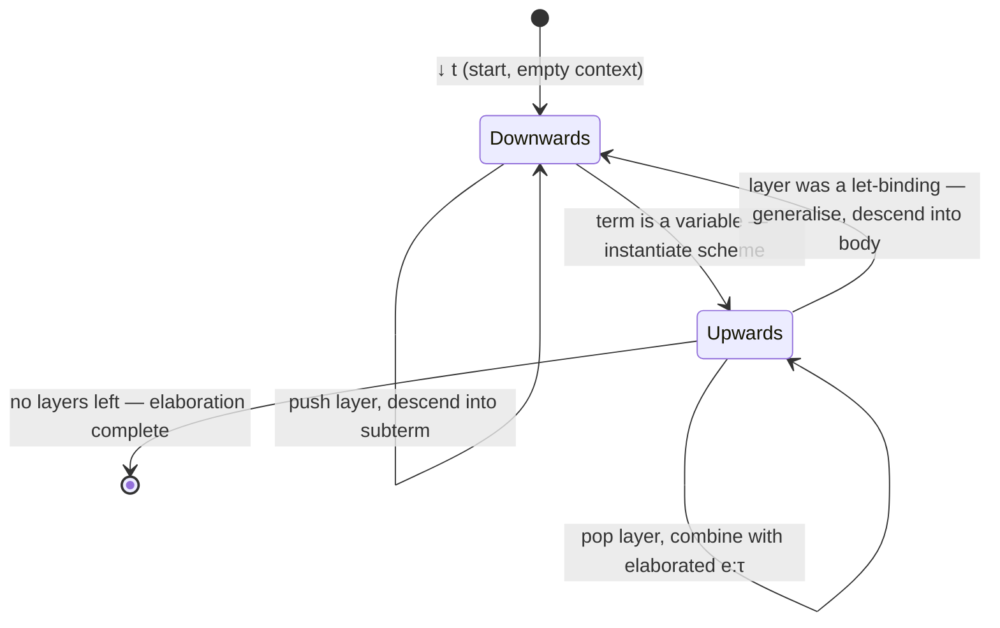

[[book-guidelines|↩ Back to guidelines]]

## Why type inference isn't enough

Everything up to this point in the thesis (the contextual framework of Section 2.1, the unification algorithm of 2.2, the type-scheme-aware inference judgment $\Theta_0 \vdash t : \tau \dashv \Theta_1$ of 2.3) answers one question: *does this term have a type, and what is it?* That's Algorithm W's whole job — it consumes a Hindley-Milner term and hands back a type. The term itself never changes shape.

That's fine as long as type-checking is the last thing that ever happens to the program. It isn't. A real compiler pipeline needs an *explicitly typed* intermediate representation downstream of the surface syntax — one where every polymorphic instantiation is visible, every generalisation point is marked, and nothing about types needs to be re-derived by later passes (optimisation, code generation, or — in richer systems — a trusted type checker that re-verifies the program). Implicit arguments, [[Hindley-Milner-Type-Inference-Reconstructed#Generic instantiation|generic instantiation]], and let-generalisation are exactly the things surface syntax hides and a later pass can't reconstruct without redoing inference.

**What breaks without this:** if you only keep the *type* on the way out of inference and throw away *how* it was derived, you cannot later distinguish `id` applied at `Int` from `id` applied at `Bool` — both erase to the same `App(Var "id", Var "x")`. Any pass that needs to know which instantiation happened (a specialiser, a dictionary-passing translation for type classes, a proof-carrying-code checker) is stuck. You'd have to re-run inference and hope it's deterministic enough to reconstruct the same choices — fragile, and outright impossible once inference involves search (as it will from Chapter 7 onward). The fix is to never throw the derivation away in the first place: **elaboration** produces an explicit term *alongside* the type, so the record of every instantiation, abstraction, and generalisation is part of the output, not something to be re-inferred later.

Gundry frames this explicitly as a stepping stone: doing it here, for boring Hindley-Milner terms, is deliberately low-stakes practice for the real target — elaborating a dependently-typed source language (`inch`, Chapter 7) into a fully explicit evidence calculus, where the gap between "has a type" and "is an explicit, re-checkable term" is existential.

## Elaboration as producing an explicit term alongside a type

Formally, elaboration replaces a bare type-inference judgment with one that also outputs a term in a second, more explicit language:

$$\text{surface term } t \;\longrightarrow\; \text{explicit term } e \;:\; \tau$$

The "more explicit" language here is **predicative System F**:

$$e \;::=\; x \mid \lambda x:\sigma.\,e \mid \Lambda\alpha:*.\,e \mid e\,e' \mid e\,\tau$$

Compare this to the *source* language it's elaborating:

$$t,s \;::=\; x \mid \lambda x.t \mid s\,t \mid \mathrm{let}\ x = s\ \mathrm{in}\ t$$

Every place where Hindley-Milner relied on an implicit, "morally there but not written down" operation, System F has an explicit syntactic form for it:

| Hindley-Milner (implicit) | System F (explicit) |
|---|---|
| $\lambda x.t$ — the argument's type is inferred | $\lambda x{:}\sigma.e$ — the type annotation is *in* the term |
| instantiating $x : \forall\alpha.\tau$ at some type | $e\,\tau$ — explicit type application, a real subterm |
| generalising a `let`-bound definition | $\Lambda\alpha{:}*.e$ — explicit type abstraction, wrapping the definiens |

This is the same relationship dependently-typed kernels have with their surface languages: a surface `id 5` in Lean elaborates to something that, at the kernel level, looks like `@id Nat 5` — the implicit type argument `Nat` is *filled in and recorded*, not left for the kernel to guess. Predicative System F is Gundry's miniature version of that same idea: a kernel-shaped, fully explicit calculus that a trusted checker (or a later compiler pass) can walk without needing to search for anything.

**Rust grounding.** Think of the surface AST and the explicit AST as two distinct `enum`s, with elaboration as a function between them — structurally identical to a compiler's desugaring/monomorphisation pass:

```rust
enum SurfaceTm {
    Var(String),
    Lam(String, Box<SurfaceTm>),
    App(Box<SurfaceTm>, Box<SurfaceTm>),
    Let(String, Box<SurfaceTm>, Box<SurfaceTm>),
}

enum FTm {                          // System F, fully explicit
    Var(String),
    Lam(String, Type, Box<FTm>),    // annotation is mandatory
    TyLam(String, Box<FTm>),        // Λα:*.e
    App(Box<FTm>, Box<FTm>),
    TyApp(Box<FTm>, Type),          // e τ
}
```

The interesting content of this section is *how* you write the function `SurfaceTm -> (FTm, Type)` so that it can also serve as the skeleton of a dependently-typed elaborator later — and that's where the zipper comes in.

## The zipper: fusing the syntactic and linguistic contexts

Up to Section 2.3, the context $\Theta$ did double duty implicitly. It recorded the "linguistic" context — term-variable bindings and metavariable declarations, i.e. everything Figure 2.3's judgments need — while the inference *algorithm itself* separately tracked its position in the term being processed (the recursive call stack of Algorithm W is the "syntactic" context: *which subterm am I currently inside?*). Gundry's move in 2.4 is to notice that a `let`-binding entry `x : σ` in $\Theta$ and a "we are currently under a `let`" marker are really the same kind of fact, and to fuse both into one data structure.

The tool for this is **Huet's zipper** (Huet, 1997): a way to represent "a location inside a tree" as a list of *layers*, one per step from the root down to the current hole, each layer recording the sibling subtrees that were *not* taken. McBride's refinement (2001; 2008) adds a left-to-right discipline: layers to the left of the current position hold work already finished (elaborated System F subterms); layers to the right hold source-syntax subterms not yet visited.

For this term grammar, the layers are:

$$\ell \;::=\; [\,]\,t \mid (e:\tau)[\,] \mid \lambda x{:}\tau.[\,] \mid \mathrm{let}\ x = [\,]\ \mathrm{in}\ t \mid \mathrm{let}\ x{:}\sigma = e\ \mathrm{in}\ [\,]$$

where $[\,]$ marks the hole — "the term currently being elaborated is *here*." Read each layer as "I am inside this constructor, at this argument position, and here's what's on the other side":

- $[\,]\,t$ — inside an application, elaborating the function; the argument $t$ (still source syntax) is waiting on the right.
- $(e:\tau)[\,]$ — inside an application, elaborating the argument; the function $e$ (already elaborated, with its type $\tau$) is finished on the left.
- $\lambda x{:}\tau.[\,]$ — inside a lambda body, with the bound variable's (guessed, to-be-solved) type $\tau$ recorded.
- $\mathrm{let}\ x=[\,]\ \mathrm{in}\ t$ — inside the definiens of a `let`; the body $t$ is still unvisited.
- $\mathrm{let}\ x{:}\sigma=e\ \mathrm{in}\ [\,]$ — inside the body of a `let`; the definiens has already been elaborated to $e$ at scheme $\sigma$.

Contexts are then redefined to hold these layers directly, in place of the old bare term-variable/`#`-marker entries:

$$\Theta \;::=\; \cdot \mid \Theta, \alpha:* \mid \Theta, \alpha:* := \tau \mid \Theta, \ell$$

This is the crux of "syntactic and linguistic context unification": there is now exactly *one* dependency-ordered list serving both jobs simultaneously — it is simultaneously "the metavariables and bindings currently in scope" (what Section 2.1's $\Theta$ was for) and "the call stack of the elaboration algorithm, made into data" (what used to live implicitly in the recursion of Algorithm W). Nothing is duplicated, and — critically for later chapters — nothing about "where we are in the term" needs bespoke plumbing separate from the metavariable context that unification already manages.

**What breaks without this:** if the syntactic position and the metavariable context are two separate pieces of state, an algorithm that needs to *pause* mid-elaboration (because a unification constraint can't be solved yet — exactly what happens once dependent types are in the picture, Chapter 7) has nowhere to put "the position I paused at" that's consistent with "the metavariables I've solved so far." You'd need continuations or exceptions bolted on separately, and keeping the two structures synchronized under backtracking becomes its own bug-prone project. Reifying position as *data* in the same list that already holds metavariables means pausing and resuming is just "stop touching this value, resume touching it later" — ordinary data, no special control-flow machinery required.

## Downwards and upwards modes

With the context now describing "where we are," elaboration becomes a small state-transition system — the automaton has exactly two modes, corresponding to the two possible directions to move through a zipper.

**Downwards, $\Theta \downarrow t$** — "descend into source term $t$, extending the context as we go":

$$
\begin{aligned}
\Theta \downarrow x &\;\longmapsto\; \Theta, \overline{\alpha_j{:}*} \;\uparrow\; x\,\overline{\alpha_j} : \tau &&\text{if } \Theta \ni x : \forall\overline{\alpha_j}.\tau\\
\Theta \downarrow s\,t &\;\longmapsto\; \Theta, [\,]\,t \;\downarrow\; s\\
\Theta \downarrow \lambda x.t &\;\longmapsto\; \Theta, \alpha{:}*, \lambda x{:}\alpha.[\,] \;\downarrow\; t\\
\Theta \downarrow \mathrm{let}\ x=s\ \mathrm{in}\ t &\;\longmapsto\; \Theta, \mathrm{let}\ x=[\,]\ \mathrm{in}\ t \;\downarrow\; s
\end{aligned}
$$

A variable is the only base case: there's nothing to descend into, so a variable immediately switches to upwards mode, having instantiated its scheme with fresh metavariables $\overline{\alpha_j}$ (exactly Algorithm W's instantiation step, but now literally producing the applied System F term $x\,\overline{\alpha_j}$ as evidence of which instantiation was chosen). Everything else — application, lambda, `let` — pushes a new layer recording "what's on the other side" and recurses into the one subterm it commits to visiting next.

**Upwards, $\Theta \uparrow e:\tau$** — "an elaborated subterm $e$ of type $\tau$ is in hand; consult the layer immediately to the left to decide what happens next":

$$
\begin{aligned}
\Theta, \lambda x{:}\upsilon.[\,], \Xi \;\uparrow\; e:\tau &\;\longmapsto\; \Theta,\Xi \;\uparrow\; \lambda x{:}\upsilon.e : \upsilon\to\tau\\
\Theta, \mathrm{let}\ x=[\,]\ \mathrm{in}\ t, \Xi \;\uparrow\; e:\tau &\;\longmapsto\; \Theta, \mathrm{let}\ x{:}\forall\Xi.\tau = \Lambda\Xi.e\ \mathrm{in}\ [\,] \;\downarrow\; t\\
\Theta, \mathrm{let}\ x{:}\sigma=e'\ \mathrm{in}\ [\,], \Xi \;\uparrow\; e:\tau &\;\longmapsto\; \Theta,\Xi \;\uparrow\; (\lambda x{:}\sigma.e)\,e' : \tau\\
\Theta, [\,]\,t, \Xi \;\uparrow\; e:\tau &\;\longmapsto\; \Theta,\Xi,(e:\tau)[\,] \;\downarrow\; t\\
\Theta, (e':\upsilon)[\,], \Xi \;\uparrow\; e:\tau &\;\longmapsto\; \Theta' \;\uparrow\; e'\,e : \beta \qquad \text{where } \Theta,\Xi,\beta{:}* \vdash \upsilon \equiv \tau\to\beta : * \dashv \Theta'
\end{aligned}
$$

($\Xi$ here is an accumulator of metavariables encountered while scanning leftward through the context — they get reinserted once the next problem is found, or, at a `let`-binding layer, $\Xi$ is *exactly* the set to generalise over. This is the same "skim metavariables off the locality" move as Section 2.3's let-generalisation, just now expressed as zipper navigation instead of a separate side computation.)

Read the five upward rules as "what does it mean to have just finished elaborating the thing that was inside this layer":
- finished a $\lambda$-body → wrap it as an explicit $\lambda x{:}\upsilon.e$, continue upward with its arrow type.
- finished a `let`-definiens → generalise ($\Lambda\Xi.e$, scheme $\forall\Xi.\tau$), then switch back to *downwards* mode to elaborate the body — this is the one rule that reverses direction, because there's a whole unvisited subterm waiting.
- finished a `let`-body → desugar into an explicit System-F application of a lambda (`let` has no primitive form in System F — it's sugar for immediate application).
- finished the function of an application → record it, switch to downwards mode on the argument.
- finished the argument of an application → this is where **unification actually fires**: check that the function's type $\upsilon$ is an arrow ending in something compatible with the argument's type $\tau$, using the *very same* unify judgment from Section 2.2 ($\Theta \vdash \upsilon \equiv \tau\to\beta : * \dashv \Theta'$), then continue upward with the resulting application and codomain $\beta$.

The whole automaton is invoked as $\cdot \downarrow t$ and runs until the upwards mode falls off the end of the context (no layers left) — at that point what remains is exactly the fully elaborated term and its type. Read left-to-right, this is nothing but Algorithm W; read as state transitions on an explicit data structure, it's tail-recursive and — this is the payoff — *interruptible*.



**Worked trace**, elaborating $\mathrm{let}\ x=\lambda y.y\ \mathrm{in}\ x\,x$ (the running motivating example from earlier in the chapter):

1. $\cdot \downarrow \mathrm{let}\ x = (\lambda y.y)\ \mathrm{in}\ x\,x \;\longmapsto\; \mathrm{let}\ x=[\,]\ \mathrm{in}\ x\,x \downarrow \lambda y.y$
2. $\longmapsto\; \mathrm{let}\ x=[\,]\ \mathrm{in}\ x\,x,\ \alpha{:}*,\ \lambda y{:}\alpha.[\,] \downarrow y \;\longmapsto\; (\text{same}),\ \beta{:}* \uparrow y : \beta$ (instantiating $y$'s trivial scheme with fresh $\beta$; here $\beta \equiv \alpha$ since $y{:}\alpha$ was bound directly, so really no fresh metavariable is needed — $y$'s type is read straight off the layer)
3. Upward through $\lambda y{:}\alpha.[\,]$: wrap as $\lambda y{:}\alpha.y : \alpha\to\alpha$.
4. Upward through the `let`-binding layer: generalise over $\alpha$ (nothing else in the locality depends on it) to get $x : \forall\alpha.\alpha\to\alpha$, elaborated definiens $\Lambda\alpha.\lambda y{:}\alpha.y$ — then switch to *downwards* on the body $x\,x$.
5. $\downarrow x\,x \longmapsto [\,]x \downarrow x \longmapsto \ldots \uparrow x\,\beta_1 : \beta_1\to\beta_1$ (instantiating $x$'s scheme fresh) — first occurrence of $x$ gets its own fresh metavariable $\beta_1$.
6. Upward through $[\,]x$: switch to elaborating the argument, another fresh instantiation $x\,\beta_2 : \beta_2\to\beta_2$.
7. Upward through $(e':\upsilon)[\,]$: unify $\upsilon = \beta_1\to\beta_1$ against $\tau\to\gamma$ where $\tau = \beta_2\to\beta_2$ — solving $\beta_1 := \beta_2\to\beta_2$ and $\gamma := \beta_2\to\beta_2$.
8. No layers remain: final result is the explicit term $\mathrm{let}\ x{=}\Lambda\alpha.\lambda y{:}\alpha.y\ \mathrm{in}\ (x\,(\beta_2\to\beta_2))\,(x\,\beta_2)$ at type $\beta_2\to\beta_2$ — precisely recording *which* instantiation of $x$'s polymorphic type was used at each of its two call sites, which the original untyped `let x = λy.y in x x` could never show.

## Why this matters beyond Hindley-Milner

Gundry is explicit that the payoff isn't this toy example — it's what the representation *enables* for harder settings. "This explicit representation of partial progress through an elaboration problem is very useful when constraints cannot always be solved immediately, as in a dependently typed setting. Elaboration is no longer a left-to-right march through the term structure, but may involve back-and-forth refocusing as the elaborator finds places where progress can be made" — citing Epigram's elaborator as the concrete precedent.

Concretely: once you allow a unification problem to get *stuck* (unsolvable right now, but solvable once some other metavariable downstream gets pinned down — exactly the situation with dependent-type constraints, and central to Chapter 4's pattern unification and Chapter 7's `inch` elaborator), a purely recursive, direct-style elaborator has no way to say "skip this, come back later." A zipper-based one does: the stuck subproblem is just a layer sitting in the context, and the algorithm can navigate elsewhere, solve other constraints, and revisit that layer once more information is available. The context *is* the suspended computation.

Appendix A.4 makes this concrete in Haskell: the layers become a `TermLayer` sum type (`AppLeft`, `AppRight`, `LamBody`, `LetBinding`, `LetBody`), the context a stack of `Entry = E Name Decl | L TermLayer`, and the two modes become two mutually-recursive functions `elab` (downwards) and `next` (upwards) — `next` explicitly accumulates a suffix `Ξ` of metavariables encountered while popping layers, reinserting them once a new problem is found or generalising over them at a `LetBinding`. This is a direct, line-for-line realisation of the rules above; nothing is lost in the translation from inference rules to code.

**Rust grounding.** The zipper-as-context is precisely an explicit, heap-allocated call stack — the same trick used to convert a recursive-descent interpreter into an interruptible bytecode-style state machine:

```rust
enum Layer {
    AppLeft(SurfaceTm),                 // []t
    AppRight(FTm, Type),                // (e:τ)[]
    LamBody(String, Type),              // λx:τ.[]
    LetBinding(String, SurfaceTm),      // let x = [] in t
    LetBody(String, FTm, Scheme),       // let x:σ = e in []
}

struct Elaborator {
    metas: MetaContext,      // fresh metavariables + solutions (unify's Θ)
    layers: Vec<Layer>,      // the zipper: the "call stack", made into data
}

enum Mode { Down(SurfaceTm), Up(FTm, Type) }

impl Elaborator {
    fn step(&mut self, mode: Mode) -> Mode { /* one rule of Figure 2.10 */ }
}
```

Running `step` in a loop until `layers` is empty and `mode` is `Up` *is* the elaboration algorithm — and because `layers` is ordinary heap data, nothing stops you from serialising it, pausing it, or splicing a new layer in the middle when a constraint needs deferring. That last capability is exactly what a Miller-pattern-unification-based elaborator (the shape this thesis is building toward, and the shape your own elaborator's metavariable-unification core will need) requires: the ability to solve constraints out of order and resume stuck ones.

**Lean correspondence.** This is worth dwelling on because it's the most direct throughline to elaboration as actually implemented in a modern dependently-typed proof assistant. Lean's elaborator also threads a single mutable state — its `MetavarContext` plus the surrounding `LocalContext` — through a recursive walk of the surface syntax, and it *also* has to suspend elaboration of a subterm when metavariable information isn't yet available (Lean calls these postponed elaboration problems `SyntheticMVars`, resolved once enough of the surrounding context is known — the direct descendant of "coming back to a layer once we have more information"). The downwards mode here (recurse into structure, extend context) is the shape of Lean's `elabTerm`; the upwards mode (having a value and a type, decide what the enclosing syntax needs from it — an application, a further instantiation, a generalisation) is the shape of what happens once `elabTerm` returns and the caller has to reconcile the result against what it expected. Gundry's zipper is a miniature, fully worked-out version of the state Lean's elaborator carries around implicitly in its monadic plumbing.

**Python sketch**, just to see the automaton with the recursion made fully explicit as a `while` loop over a list-as-stack (illustrative only, not load-bearing):

```python
def elaborate(term):
    layers, mode = [], ("down", term)
    while True:
        if mode[0] == "down":
            mode = step_down(mode[1], layers)
        else:
            if not layers:
                return mode[1], mode[2]   # (elaborated term, type)
            mode = step_up(mode[1], mode[2], layers)
```

## Where this leads

This zipper-based downwards/upwards elaborator is the direct ancestor of Chapter 7's elaboration algorithm for `inch`: the same discipline of a single context threading both metavariables *and* syntactic position, the same instantiate-then-navigate rhythm, generalised to bidirectional judgments for scheme assignment, inference and checking, with implicit-argument synthesis and subsumption reduced to constraint solving in exactly the unification machinery already built in Section 2.2. It's also the reason Chapter 4's pattern unification needs its own dedicated machinery for postponing and resuming stuck problems — the zipper here shows *why* that capability matters (elaboration can get stuck) before Chapter 4 shows *how* to build a unifier robust enough to support it.

**Synthesis for the standing project (`type-theory` focus area):** this section is the smallest complete example of the pattern your compiler's elaborator will scale up — a metavariable-aware context that is simultaneously "what's in scope" and "where in the AST we currently are," navigated by a two-mode (descend/ascend) automaton rather than raw recursion. The downwards/upwards split is a proto-bidirectional discipline (descending mirrors checking against an expected structural position; ascending mirrors synthesising a type and propagating it outward), and the explicit System F output is the same "elaboration produces a re-checkable explicit term, not just a yes/no answer" discipline your trusted kernel will depend on for proof-term reconstruction. The one capability this Hindley-Milner instance doesn't yet need — but that the zipper representation is specifically built to support — is *suspending* a stuck elaboration step and resuming it once other metavariables are solved, which is precisely the mechanism a Miller-pattern-style implicit-argument resolver requires.
