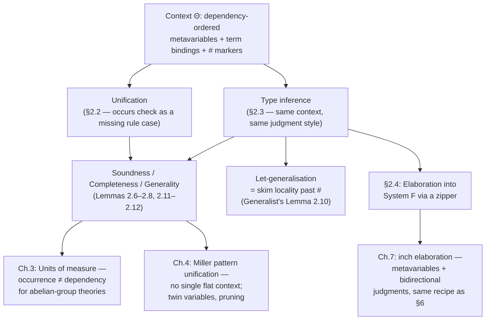

# Hindley-Milner Type Inference Reconstructed

[[book-guidelines|↩ Back to guidelines]]

## Why rebuild something that already works?

Algorithm W has worked, more or less unchanged, since Damas and Milner wrote it down in 1982. So why does Gundry spend a whole chapter re-deriving it? Because the classical presentation buries a design decision that later chapters need to see in the open: **the occurs check does two unrelated-looking jobs at once**, and nobody usually asks whether it should.

Job one: prevent infinite types. The equation $\alpha \equiv \alpha \to \beta$ has no finite solution, since the right-hand side mentions the very variable you're trying to define — so a unifier that didn't check for this would either loop or produce a "solution" that isn't a type. Job two, buried inside Algorithm W's `let`-rule: decide *which* type variables are safe to generalise into a $\forall$-quantified scheme. A variable is generalisable exactly when it doesn't occur free in the surrounding typing context — and checking that is, again, an occurs check, just run against the environment instead of against a type.

Standard textbook treatments present these as two separate uses of the same utility function. Gundry's claim is stronger: they are *the same question* — "does this variable structurally depend on that one?" — and the reason classical Algorithm W has to answer it twice, in two different places, with two different pieces of code, is that it has nowhere to *store* the answer. Unification variables float freely, unattached to any notion of scope; the only way to find out what a variable depends on is to inspect a type expression syntactically, on demand, at the exact moment you need to know.

The fix is to stop treating metavariables as free-floating names and instead put them in an explicit, **dependency-ordered context** — the same kind of structure you already use for typing environments — and to make *both* unification and generalisation into operations that thread a single context through, left to right. Once you do that, the occurs check for infinite-type prevention and the occurs check for generalisation turn out to be one lemma, not two, and — this is the payoff the rest of the thesis depends on — the exact same discipline scales to unification theories where the classical occurs check silently gives wrong answers (Chapter 3's units of measure) and to higher-order unification where there's no such thing as a single flat context at all (Chapter 4).

This article works through that reconstruction: type schemes and instantiation, the occurs check reframed as dependency detection, the algorithmic rules that replace Algorithm W, let-generalisation as "trimming" a context, the Generalist's Lemma that justifies it, and the soundness/completeness/generality results that tie it all together.

## The object language

Terms and (monomorphic) types are exactly what you'd expect from the simply-typed λ-calculus plus `let`:

$$
t, s ::= x \mid \lambda x.t \mid s\ t \mid \mathsf{let}\ x = s\ \mathsf{in}\ t
\qquad\qquad
\tau, \upsilon ::= \alpha \mid \tau \to \upsilon
$$

The function arrow is kept as the *only* type constructor throughout the chapter — not because Gundry thinks that's realistic, but because every complication he wants to isolate (dependency, generalisation, occurs-checking) is already fully present with just $\to$, and adding more constructors would just be bookkeeping.

## 1. Type schemes and generic instantiation

### The problem a monomorphic type can't express

`let x = λy.y in x x` type-checks; `λx. x x` doesn't. The difference is that `x` in the `let`-body gets used at two *different* types (`(β→β)→(β→β)` and `β→β`), while a λ-bound `x` is stuck with one type for its whole scope. A monomorphic type slot literally cannot record "this name stands for infinitely many types, one per instantiation" — so the language of types has to grow a new syntactic form for it.

A **type scheme** is a type wrapped in zero or more universal quantifiers:

$$
\sigma ::= \tau \mid \forall\alpha.\sigma
$$

Only *term*-variable bindings in the context carry schemes; metavariables (the things unification solves for) are always bound as plain, unquantified types. Gundry flags this explicitly as a simplification he's allowed to make in this chapter: morally, the $\forall$-bound variables of a scheme (**universal**, "for all instantiations") and metavariables (**existential**, "some specific but as-yet-unknown type") are different kinds of thing, but for ordinary Hindley-Milner there's no interaction between them subtle enough to matter. (That stops being true once dependent types and Miller-pattern unification enter the picture in Chapter 4 — parameterised metavariables there really do need to distinguish the two.)

### Generic instantiation

Using a polymorphic value means picking a *specific instance* of its scheme. The book calls this relation **generic instantiation**, $\sigma \sqsubseteq \sigma'$ — read "$\sigma$ is more general than $\sigma'$," i.e. every instance of $\sigma'$ is also an instance of $\sigma$:

$$
\dfrac{\Theta \vdash \tau \equiv \upsilon : *}{\Theta \vdash \tau \sqsubseteq \upsilon}
\qquad
\dfrac{\alpha \notin \mathrm{fmv}(\sigma) \quad \Theta, \alpha:* \vdash \sigma \sqsubseteq \sigma'}{\Theta \vdash \sigma \sqsubseteq \forall\alpha.\sigma'}
\qquad
\dfrac{\Theta \vdash \tau : * \quad \Theta \vdash [\tau/\alpha]\sigma \sqsubseteq \upsilon}{\Theta \vdash \forall\alpha.\sigma \sqsubseteq \upsilon}
$$

(Figure 2.7 in the book.) The base case says a monomorphic type is only "more general than" a type equal to it. The other two rules let you either push a fresh, unconstrained quantifier onto the right, or eliminate a quantifier on the left by substituting a concrete witness type $\tau$ for it. Chasing both rules to their conclusion, $\forall\alpha.\sigma \sqsubseteq \sigma'$ holds exactly when $\sigma'$ is obtained from $\sigma$ by substituting *some* type for each bound variable (up to further generalisation on the right) — the formal statement of "specialising $\sigma$ can produce $\sigma'$."

A convenient bookkeeping device the book introduces here (and reuses constantly): any scheme $\sigma = \forall\alpha_i^{\,i}.\tau$ can be read as *quantifying a context suffix* $\Xi$ (a list of metavariable declarations) over a type:

$$
\forall\cdot.\tau \mapsto \tau
\qquad
\forall(\alpha:*,\Xi).\tau \mapsto \forall\alpha.(\forall\Xi.\tau)
\qquad
\forall(\alpha:=\upsilon:*,\Xi).\tau \mapsto [\upsilon/\alpha](\forall\Xi.\tau)
$$

This turns "generalise a type" into "take a chunk of the context and fold it into quantifiers" — which is exactly the operation let-generalisation needs (§4 below), and it's why representing metavariables *in a context* rather than as free names pays off immediately.

**What breaks without schemes.** Without a distinct scheme layer, you're forced to choose: either every binding is monomorphic (no polymorphic `let`, `id` can only ever be used at one type per definition) or every binding is implicitly polymorphic (unsound — a λ-bound `y` in `λy. let x = y in x` would let you use `y` at two different types inside the body, contradicting the fact that the caller supplies one concrete argument).

**Grounding.**
- **Rust** doesn't have `let`-polymorphism in this ML sense at all — a `let x = ...` binding in a function body is monomorphic, and genuine polymorphism only exists at `fn`/`impl` boundaries via generics, which are elaborated (monomorphised) at every call site rather than represented as a runtime-shared value. `fn identity<T>(x: T) -> T` is the closest thing to $\forall\alpha.\alpha\to\alpha$: the compiler's type checker treats `T` exactly like a bound scheme variable — instantiated fresh, under the hood, at every call — which is precisely what $\sqsubseteq$'s third rule is doing.
- **Lean** has this distinction natively and names it almost exactly as the book does: `theorem id {α : Type*} (x : α) : α := x` binds `α` as a genuinely universally-quantified (auto-bound implicit) variable, and every application `id 3`, `id "s"` is Lean's elaborator running an instantiation step — literally the third $\sqsubseteq$ rule, substituting a witness for a bound scheme variable. Lean's own metavariables (`?m`), by contrast, play the role of the book's existential metavariables $\alpha,\beta,\gamma$ — never bound in a scheme, always waiting to be solved by unification. Keeping "elaboration-time unknown" and "user-facing polymorphic parameter" as two different sorts, the way both Lean and this chapter do, is exactly the discipline a bidirectional elaborator needs to avoid conflating "not yet solved" with "deliberately abstract."

## 2. The occurs check as a dependency-detection device

### Contexts, not free-floating variables

The chapter's central structural move: a **context** $\Theta$ is not a typing environment bolted onto a separate unification substitution — it's a single, ordered list mixing three kinds of entries, read left-to-right as "things established so far, in the order they were established":

$$
\Theta ::= \cdot \mid \Theta,\ \alpha:* \mid \Theta,\ \alpha := \tau : * \mid \Theta,\ x:\sigma \mid \Theta\#
$$

An entry $\alpha:*$ declares an as-yet-unsolved metavariable; $\alpha := \tau : *$ *defines* one (this is what a unification step actually does — the traditional "substitution," but recorded as a context entry instead of applied eagerly everywhere); $x:\sigma$ is an ordinary term-variable binding; and $\Theta\#$ inserts a **locality marker**, whose job is explained in §4. Crucially, order is meaningful: an entry can only mention variables declared *earlier* in the list. $\alpha:*, \beta:*, x:\alpha\to\beta$ is a valid context; $x:\alpha, \alpha:*$ is not, because $x$'s type mentions $\alpha$ before $\alpha$ exists. **This ordering constraint *is* the dependency graph** — nothing else is needed to track "what depends on what."

### Reframing the occurs check

With that structure in place, unifying a metavariable $\alpha$ with a type $\tau$ (the **instantiate** judgment, $\Theta_0 \mid \Xi \vdash \alpha \equiv \tau : * \dashv \Theta_1$) isn't "run a syntactic scan for $\alpha$ inside $\tau$ and reject if found" — it's a walk *through the context itself*, from most recently declared back towards $\alpha$'s declaration, sorting every metavariable it passes into "genuinely mentioned in $\tau$" (accumulated into $\Xi$) or "irrelevant, skip past it." The book states the precondition this walk must satisfy as an explicit definition:

> **Definition 2.1.** $(\Theta_0, \Xi, \alpha, \tau)$ satisfies the input conditions if $\Theta_0 \vdash \alpha:*$ ($\alpha$ a metavariable), $\Theta_0,\Xi \vdash \tau:*$ ($\tau$ not itself a metavariable), and $\Xi$ contains only declarations $\beta:*$ with $\beta \in \mathrm{fmv}(\tau)$.

The occurs check now falls out as a *missing case*, not a side condition you remember to bolt on: there is simply no rule in Figure 2.5 that lets you derive

$$
\Theta_0,\ \alpha:*\ \mid\ \Xi \vdash \alpha \equiv \tau : * \dashv \Theta_1 \qquad \text{when } \alpha \in \mathrm{fmv}(\tau)
$$

— the algorithm gets stuck because none of `inst-define`, `inst-subs`, `inst-depend`, `inst-skip-*` apply. Gundry states the underlying fact as its own lemma, independent of any particular algorithm:

> **Lemma 2.7 (Occurs check).** Let $\alpha$ be a metavariable and $\tau$ a non-metavariable type in $\Theta$ such that $\alpha \in \mathrm{fmv}(\tau)$. There is no context $\Theta'$ and metasubstitution $\theta: \Theta \sqsubseteq \Theta'$ such that $\Theta' \vdash \theta\,\alpha \equiv \theta\,\tau : *$.

*Proof idea:* if such a $\theta$ existed, expanding all definitions in $\Theta'$ would produce a type provably equal to a proper subterm of itself — impossible by induction on the definition of type equality. This is the finite-types fact underlying "occurs check," made precise and detachable from any specific algorithm.

The reframing matters because it separates **why** the check is sound (Lemma 2.7, a statement about *equality*, provable once) from **how** an algorithm implements it (a missing inference-rule case, checkable by inspection). That separation is exactly what breaks for units of measure in Chapter 3: there, a metavariable can *occur* in a type without being a *genuine dependency* of it (e.g. $\alpha$ occurs in $\alpha * \alpha^{-1}$, but that expression is equal to $1$ and doesn't actually depend on $\alpha$'s value) — so the syntactic occurs check and the semantic dependency notion, identical here, come apart there. You only notice they were doing separate jobs once you've named the job precisely enough to ask.

**What breaks without dependency-as-context-order.** You'd still be able to write *an* occurs check, but you'd be re-deriving "does this variable depend on that one" by syntactic inspection every time you need the answer, with no way to state — let alone prove — that the answer stays consistent as you accumulate more definitions. Lemma 2.7's proof leans on the context's definitions being expandable in a fixed, well-founded order; free-floating substitutions give you no such order to induct on.

**Grounding.**
- **Rust.** A context like $\Theta$ is naturally a `Vec<Entry>` (or, for real implementations, an arena with parent pointers) where `Entry` is an enum:
  ```rust
  enum Entry {
      MetaDecl(MetaVar),                 // α : *
      MetaDef(MetaVar, Type),            // α := τ : *
      TermVar(Name, Scheme),             // x : σ
      Locality,                          // #
  }
  ```
  The occurs check becomes: walking `ctx` from the end towards `alpha`'s index, collect every `MetaDecl` mentioned in `tau`'s free-metavariable set into `xi`; if you reach `alpha`'s own declaration and `alpha` is itself in that free-metavariable set, fail — there is no `inst-*` case for it, mirroring the missing-rule argument exactly. This is essentially union-find's "path must not create a cycle" check, generalised from disjoint sets to a full dependency-ordered list.
- **Lean.** Lean's actual kernel-adjacent metavariable context (`MetavarContext`) stores each metavariable together with the *local context* it's allowed to depend on, computed at the moment the metavariable is created — so "does $\alpha$ depend on $\beta$" is answered by comparing local contexts, not by re-scanning types. `isDefEq`'s assignment step (`Lean.Meta.isDefEq` → `assignExprMVar`) performs precisely Definition 2.1's occurs/scope check before committing an assignment, under the name `checkAssignment` internally — rejecting an assignment that would make a metavariable depend on itself or on a variable outside its recorded scope. Reading Definition 2.1 side-by-side with Lean's assignment-scope check is a good way to see that "cutting-edge dependent elaborator" and "1980s Hindley-Milner unifier" are running the *same* dependency discipline, just closed under vastly more type formers.

## 3. Algorithm W and its relationship to unification

### What Algorithm W actually does

Algorithm W is structural on terms: it walks the syntax tree, generating a fresh metavariable at every unknown (e.g. a λ-bound argument's type), and threading a substitution that grows monotonically as unification is invoked. Milner's declarative rules for the un-syntax-directed system (Figure 2.1 in the book) are:

$$
\dfrac{x:\sigma \in A \quad \sigma \sqsubseteq \tau}{A \vdash x:\tau}
\qquad
\dfrac{A \vdash t:\tau'\to\tau \quad A \vdash t':\tau'}{A \vdash t\,t':\tau}
\qquad
\dfrac{A_x \cup \{x:\tau'\} \vdash t:\tau}{A \vdash \lambda x.t : \tau'\to\tau}
\qquad
\dfrac{A \vdash t_0:\tau_0 \quad \sigma=\mathrm{gen}(A,\tau_0) \quad A_x\cup\{x:\sigma\}\vdash t:\tau}{A \vdash \mathsf{let}\ x=t_0\ \mathsf{in}\ t : \tau}
$$

where $\mathrm{gen}(A,\tau) = \forall\alpha_i^{\,i}.\tau$ quantifying exactly the variables free in $\tau$ but *not* free in $A$ (the surrounding assumptions). Computing that "free in $\tau$ but not in $A$" set is, syntactically, another occurs check — run against a whole *environment* rather than a single type. This is the "dependency panic" Gundry references in his discussion (§2.5): at the `let`-rule, Algorithm W has to freeze, scan the entire ambient environment to see which variables are safe, generalise, and then commit — a global, environment-wide computation squeezed into one local rule, precisely because unification variables carry no memory of their own scope.

### The contextual algorithm's answer

The contextual system (Figure 2.9) makes exactly the same commitments — the same variables get generalised, the same unifications happen — but *distributes* the work across the algorithm's normal left-to-right, structural traversal instead of concentrating it in a `let`-time panic. Concretely: because metavariables live *in the context at the position where they're introduced*, "which variables are safe to generalise" is no longer a global scan — it's just "everything to the right of the locality marker `#`" (§4). The dependency information that Algorithm W has to *reconstruct* on demand, the contextual algorithm has been *maintaining incrementally* the whole time, as an invariant of context validity.

### A worked unification, traced through the context

The book runs a concrete example (context $\alpha:*, \beta:*, \alpha':=\beta:*, \gamma:*$, solving $\alpha\to\beta \equiv \alpha'\to(\gamma\to\gamma)$) that is worth tracing in full, because it shows the "move right to left, updating or skipping" discipline in miniature. Decomposing the arrow gives two subproblems, $\alpha\equiv\alpha'$ and $\beta\equiv\gamma\to\gamma$, solved in sequence:

| Step | Context (most local on the right) | Action |
|---|---|---|
| start | $\alpha:*,\ \beta:*,\ \alpha':=\beta:*,\ \gamma:*\ \mid\ [\alpha\equiv\alpha']$ | solve flex-flex first |
| | $\alpha:*,\ \beta:*,\ \alpha':=\beta:*,\ [\alpha\equiv\alpha'],\ \gamma:*$ | $\gamma$ doesn't occur in the constraint — skip past it |
| | $\alpha:*,\ \beta:*,\ [\alpha\equiv\beta],\ \alpha':=\beta:*,\ \gamma:*$ | $\alpha'$ is *defined* as $\beta$ — substitute, updating the constraint |
| done | $\alpha:*,\ \beta:=\alpha:*,\ \alpha':=\beta:*,\ \gamma:*$ | define $\beta := \alpha$ |

Then the flex-rigid constraint $\beta \equiv \gamma\to\gamma$ must move $\gamma$ (a genuine dependency) *outward*, past everything it doesn't depend on:

| Step | Context | Action |
|---|---|---|
| start | $\alpha:*,\ \beta:=\alpha,\ \alpha':=\beta,\ \gamma:*,\ [\beta\equiv\gamma\to\gamma]$ | |
| | $\alpha:*,\ \beta:=\alpha,\ \alpha':=\beta,\ [\gamma:* \mid \beta\equiv\gamma\to\gamma]$ | $\gamma$ genuinely occurs — accumulate it into $\Xi$ |
| | $\alpha:*,\ \beta:=\alpha,\ [\gamma:*\mid\beta\equiv\gamma\to\gamma],\ \alpha':=\beta$ | skip past $\alpha'$'s definition (irrelevant) |
| | $\alpha:*,\ [\gamma:*\mid\alpha\equiv\gamma\to\gamma],\ \beta:=\alpha,\ \alpha':=\beta$ | skip past $\beta$'s definition, updating $\alpha\equiv\beta$ to $\alpha\equiv\gamma\to\gamma$ |
| done | $\gamma:*,\ \alpha:=\gamma\to\gamma,\ \beta:=\alpha,\ \alpha':=\beta$ | define $\alpha$, having pasted $\gamma$'s declaration in ahead of it |

Every step is *sound* (only replaces the context with an equivalent one) and, crucially, **general** — no step commits to anything not forced by the equation. This right-to-left "moving variables outward through localities, acquiring more global relevance" is doing, incrementally and locally, exactly what Algorithm W's `let`-rule does globally and all at once.

**What breaks without unifying the two.** If you keep unification and generalisation as separately-justified procedures (as classical presentations do), you have no shared vocabulary to state — let alone prove — that they interact correctly: does generalising after a partially-completed unification ever generalise over a variable another pending constraint secretly still depends on? Algorithm W's standard correctness proofs sidestep this by requiring unification to run to completion before generalisation ever looks at the environment. The contextual account doesn't need that ordering discipline, because "is this a genuine dependency" has one definition (context order) used by both processes.

**Grounding.**
- **Rust.** A minimal contextual unifier is a state machine over the `Entry` vector from §2, with a single `unify(ctx, tau, upsilon)` function that either decomposes structurally (recursing on `Type::Arrow` components) or delegates to `instantiate(ctx, xi, alpha, tau)`, which performs exactly the walk traced in the table above — this is a very close cousin of union-find with ranked/ordered parent pointers instead of plain equivalence classes, and it's the shape a Rust type checker's inference engine (e.g. an HM-style checker for a toy language) would actually take.
- **Lean.** Lean's elaborator doesn't literally run Algorithm W (it's bidirectional and constraint-postponing, closer to Chapter 7's machinery), but its core unifier's incremental, context-respecting assignment of metavariables — never eagerly substituting everywhere, always checking the target local context first — is the modern descendant of exactly the discipline this section reconstructs. Comparing Milner's `gen(A, τ)` (an eager, global environment scan) against `isDefEq`'s metavariable assignment (an incremental, per-assignment scope check) is a compact illustration of the historical shift this chapter is arguing for.

## 4. Let-generalisation via skimming metavariables from a locality

This is the payoff the previous three sections were building towards. The `#` marker divides a context into **localities** — think of each locality as one nested nesting level of nested `let`s (or one call frame, if you're thinking operationally). The rule is now almost too simple to look impressive:

> The metavariables that can be generalised at a `let` are *exactly* those to the right of the most recent `#` — i.e., everything declared inside the current locality that nothing outside it can possibly depend on, because context order forbids anything earlier from mentioning something declared later.

Concretely, the transformed `let`-rule (§5 below) opens a new locality before inferring the type of the definiens, and closes it afterwards by literally slicing that suffix of the context off and re-packaging it as a $\forall$-quantified scheme, using exactly the $\forall\Xi.\tau$ notation from §1:

$$
\dfrac{\Theta\,\#\,\Xi \vdash t:\tau \dashv \Theta_1\,\#\,\Xi_1}{\Theta \vdash t : (\forall\Xi_1.\tau) \dashv \Theta_1} \quad \text{(infer-gen, roughly)}
$$

Compare this to Algorithm W's `gen(A,τ)`, which has to *compute* "free in $\tau$ but not free in $A$" by inspecting types syntactically. Here, that same set is *already sitting at the end of the context*, because nothing could have been declared there except in service of inferring $t$'s type. "Skim off the locality" isn't a metaphor for an algorithm — it's a literal `split_off` on the context vector.

**What breaks without localities.** Without an explicit marker for "where the current sub-problem began," you'd need some other way to distinguish "metavariables introduced while solving this let-binding" from "metavariables that existed before it and might still be needed by an enclosing computation" — and that's exactly the distinction Algorithm W's occurs-check-against-the-environment is doing the hard way. This is also, not coincidentally, the formal justification behind the informal "rank"-based generalisation used in efficient ML implementations (Rémy 1992, used in OCaml): assigning a numeric rank to each type variable based on how many `let`/λ-bindings it's under, then generalising over sufficiently-high-rank variables, is doing the *same job* as the `#` marker, just represented as an integer counter instead of an explicit context position. Gundry notes this correspondence directly in the chapter's discussion (§2.5.1): "the algorithm I described manages ranks implicitly, by representing type variables in an ordered context, in which the `#` marker corresponds to increasing the rank."

**Grounding.**
- **Rust.** If `ctx: Vec<Entry>` and you record the index of the most recent `Locality` entry when you start elaborating a `let`'s definiens, generalisation is `let generalised = ctx.split_off(locality_index + 1);` followed by wrapping `generalised`'s `MetaDecl`s into a `Scheme::Forall(...)` — no environment scan required, because everything after that index was, by construction, created while solving this one sub-problem.
- **Lean.** Lean's `withNewMCtxDepth` and per-declaration metavariable-context save/restore points are a structurally similar idea: elaboration of one declaration's body runs at a fresh metavariable "depth," and generalisation-adjacent decisions (which metavariables must be resolved now vs. can be deferred, which local instances are visible) are scoped to that depth rather than requiring a scan of the whole elaboration state. It's the same "make scope a first-class, checkable position in a data structure, not an implicit fact you re-derive" move.

## 5. The Generalist's Lemma

Skimming a locality off the context is *cheap to state* but needs a proof that it's *correct* — that doing so still gives you the most general possible scheme, not merely *a* valid one. That's the content of:

> **Lemma 2.10 (The Generalist's Lemma).** If $\theta : \Theta_0\,\# \sqsubseteq \Theta_1\,\#\,\Xi$ is a minimal solution of the type inference problem for $t$ with output $\tau$, then $\theta : \Theta_0 \sqsubseteq \Theta_1$ is a minimal solution of the type *scheme* inference problem for $t$ with output $\forall\Xi.\tau$.

In words: solve the easier problem — find *some monomorphic type* $\tau$ for $t$, most generally — and if you do that by only ever extending the *current* locality (never touching anything to its left), then quantifying everything left behind in that locality automatically gives you the most general *scheme*, for free. You don't need a second, independent proof that generalisation is sound; it's a corollary of ordinary unification generality plus the shape of context extension.

The proof (sketched in the book, full details in Appendix D.1) leans on a fact worth stating explicitly because it's the load-bearing structural constraint behind the whole lemma: a solution can never make something in an *outer* locality depend on something in a *more local* one. Formally, any $\theta : \Theta\,\#\,\Xi \sqsubseteq \Theta'\,\#\,\Xi'$ restricts cleanly to $\theta|_\Theta : \Theta \sqsubseteq \Theta'$ — you can always throw away the "local" part of an information increase and still have a well-formed increase on the "outer" part alone. That's precisely because context order already forbids the outer part from mentioning the local part, so there was never anything for the local part's substitution to leak into.

This is also where the chapter's earlier apparatus — statements-in-context having explicit input/output **modes**, and the notion of a *minimal solution* to a constraint problem (§2.1.3 in the book) — pays for itself. A type inference problem takes $\Theta_0, t$ as input and produces $(\theta, \tau)$ as output; minimality means any other solution factors through it via a cofactor. The **Optimist's Lemma** (Lemma 2.4, used pervasively but not the direct subject of this topic) guarantees that solving two problems *in sequence* — first the definiens, then the body, as the `let`-rule does — still yields a jointly-minimal solution; the Generalist's Lemma is the analogous statement one level up, connecting minimality for a *monomorphic-output* problem to minimality for a *scheme-output* problem.

**Grounding.** This one resists a clean Rust/Python analogue, because "prove your algorithm's output is the most general possible, as a corollary of a structural invariant rather than a separate argument" is a proof-engineering move, not a runtime one — there's no code artifact that "is" the Generalist's Lemma the way there was an `instantiate` function for the occurs check. The closest real-world echo is in Lean and other elaborators that maintain a *metavariable-context invariant* (e.g., "no metavariable's local context mentions a metavariable created after it") specifically so that generalisation- or delayed-assignment-adjacent operations can be proven correct locally, without re-verifying global properties on every step — the payoff for maintaining an invariant like Definition 2.1's input conditions is exactly a lemma of this shape.

## 6. Transforming type assignment into a syntax-directed algorithm

Milner's rules (Figure 2.1, §3 above, or the equivalent Figure 2.6 restated with schemes) are *declarative*: they permit generic instantiation and generalisation to be inserted anywhere a typing derivation likes, which is exactly what makes them non-algorithmic — a checker following them doesn't know when to stop guessing. The book performs a well-known transformation (attributed to Clément et al. 1986) into an equivalent system where instantiation happens *only* at variable occurrences and generalisation *only* at `let`:

$$
\dfrac{\Theta\ni x:\sigma \quad \Theta\vdash\sigma\sqsubseteq\tau}{\Theta\vdash x:\tau}\ \texttt{var}
\qquad
\dfrac{\Theta,x:\tau\vdash t:\upsilon}{\Theta\vdash\lambda x.t:\tau\to\upsilon}\ \texttt{lam}
\qquad
\dfrac{\Theta\vdash s:\tau_0\to\tau \quad \Theta\vdash t:\tau_0}{\Theta\vdash s\,t:\tau}\ \texttt{app}
\qquad
\dfrac{\Theta\,\#\,\Xi\vdash s:\upsilon \quad \Theta,x:(\forall\Xi.\upsilon)\vdash t:\tau}{\Theta\vdash \mathsf{let}\ x=s\ \mathsf{in}\ t:\tau}\ \texttt{let}
$$

This is a genuinely different, *equivalent* proof system, not yet an algorithm — it still has outputs (the derived type $\tau$) sitting in premises as if they were known in advance. The final step is mechanical, and worth stating as a recipe because it's reused for every algorithmic judgment in the thesis (unification, elaboration, and later the `inch` elaborator in Chapter 7):

> Read each rule clockwise from the bottom-left. The conclusion's inputs determine the first premise's inputs; the first premise's *outputs* determine the second premise's inputs; and so on, until every premise's outputs together determine the conclusion's outputs. Wherever a premise needs an input that isn't yet known, insert a fresh metavariable to stand for it. Wherever the *declarative* rule pattern-matched on an output (e.g. requiring the argument to already have a known type), instead give it a schematic variable and reintroduce the needed fact as an equation to be unified.

Applying this recipe to `app` — which declaratively requires you to *already know* $s$'s type has the shape $\tau_0\to\tau$ — produces the algorithm's actual `infer-app` rule: infer $s$'s type as some $\upsilon$, infer $t$'s type as some $\upsilon'$, then *unify* $\upsilon$ with $\upsilon'\to\alpha$ for a fresh $\alpha$, and return $\alpha$:

$$
\dfrac{\Theta_0\vdash s:\upsilon\dashv\Theta_1 \quad \Theta_1\vdash t:\upsilon'\dashv\Theta_2 \quad \Theta_2,\alpha:*\vdash \upsilon\equiv\upsilon'\to\alpha:*\dashv\Theta_3}{\Theta_0\vdash s\,t:\alpha\dashv\Theta_3}\ \texttt{infer-app}
$$

— this is the moment unification and type inference visibly become the *same kind of judgment*, threading the same context, rather than type inference calling out to a unification "black box." `infer-let` opens a locality with `#`, infers a scheme for the definiens by delegating to `infer-gen` (which is exactly the Generalist's Lemma made algorithmic), and closes it by binding $x$ at that scheme before inferring the body.

**What breaks without the transformation.** Trying to implement the *declarative* rules directly means guessing, at each step, whether and how much to generalise or instantiate — there's no deterministic point in the derivation tree that tells you. This is precisely the non-determinism Chapter 7 has to re-confront (and re-solve, with metavariables and bidirectional judgments) for `inch`'s richer elaboration relation — the "structural vs. wrapping rules" split there is this same clockwise-reading discipline applied to a system where instantiation isn't the only source of implicit machinery.

**Grounding.**
- **Rust.** This recipe *is* how you write a type checker by hand: a recursive function `infer(ctx, term) -> (Type, Context)` with one match arm per term constructor, where `App` calls `infer` twice and then calls `unify`, exactly mirroring `infer-app`'s three premises threaded left to right.
- **Lean.** This declarative-to-algorithmic transformation is the ancestor of the general move from a *specification* type theory (checking judgments that permit instantiation/conversion anywhere) to a *bidirectional* one (explicit `infer`/`check` modes) that Lean's own elaborator implements at much greater scale — the `var`/`lam`/`app`/`let` split into explicit inference vs. checking obligations here is a miniature of Lean's `elabTerm`/`isDefEq`-driven bidirectional core.

## 7. Soundness, completeness, and generality of unification and inference

Four lemmas close the loop, and it's worth being precise about what each one promises, since "soundness," "completeness," and "generality" get used loosely elsewhere:

- **Soundness** — if the algorithm succeeds, the context it produces really is a solution (the equation holds, or the term really does have the derived type) in the ordinary declarative sense.
- **Generality** (sometimes folded into "soundness" statements, as the book does) — the solution found is *minimal*: every other solution factors through it via some cofactor $\zeta$. This is the formal meaning of "most general unifier" and "principal type," stated once (§2.1.3) and reused for every judgment in the thesis rather than re-derived per-system.
- **Completeness** — if a solution exists *at all* (even one the algorithm didn't find), the algorithm succeeds and finds one (which, combined with generality, must be at least as general).

> **Lemma 2.6 (Soundness and generality of unification).** (a) If $\Theta_0\vdash\tau\equiv\upsilon:*\dashv\Theta_1$ then $\Theta_0\sqsubseteq\Theta_1$ is a minimal solution of $\tau\equiv\upsilon$. (b) Likewise for the instantiate judgment.
>
> **Lemma 2.8 (Completeness of unification).** (a) If some information increase $\theta:\Theta_0\sqsubseteq\Theta'$ makes $\theta\upsilon\equiv\theta\tau$ hold, the algorithm succeeds on $\Theta_0\vdash\upsilon\equiv\tau$. (b) Likewise for instantiate, given the input conditions of Definition 2.1 hold.
>
> **Lemma 2.11 (Soundness and generality of type inference)** and **Lemma 2.12 (Completeness of type inference)** state the exact analogues one level up, for the `infer` and `infer-gen` judgments against the transformed declarative system of §6.

The soundness/generality proofs are structural inductions on derivations, using the Optimist's Lemma to combine sequentially-solved sub-derivations and the Generalist's Lemma at every `let`/`infer-gen` step. Completeness is subtler and depends on termination: the book observes (crediting McBride 2003) that the algorithm's termination is *evident* once dependency is exposed as context structure, because every unification or instantiation step provably does one of three things — shortens the overall context, shortens the "uninspected" prefix left of the instantiate judgment's bar `|`, or preserves the context while strictly decomposing a type. Completeness then reduces to a case analysis showing the algorithm's rules cover every case where a solution *could* exist, with the sole omitted case being exactly the occurs-check failure of Lemma 2.7 — which, having already been proven to have no solutions, is safe to omit.

Notice how load-bearing this makes the earlier design decisions: generality (Lemma 2.6) needs the Optimist's Lemma from §2.1.3, which needs stability under information increase from §2.1.2, which needs metasubstitutions to be well-defined operations on contexts — none of which is available if you unify against free-floating variables with no shared ordering.

**Grounding.** These four properties are exactly the questions you ask about any real type checker or proof kernel before trusting it: *soundness* (does it only accept truly well-typed/valid things — the property a trusted kernel cannot compromise on), *completeness* (does it accept everything it should — a usability property, sometimes deliberately sacrificed, as `inch` later does for local `let`-generalisation), and *generality/principal types* (does it infer the *best* answer, not just *an* answer — the property that makes downstream tools like typed-hole filling or automatic instantiation predictable). Lean's kernel prioritizes soundness above all else — it will reject a term rather than risk being wrong — while its *elaborator* trades away some completeness and even full generality (e.g. for higher-rank inference) for tractability, exactly the kind of trade-off Chapter 7 makes explicit for `inch`.

## Where this leads



Within the book, this chapter is the template everything downstream instantiates against a harder equational or type theory. The occurs-check-as-dependency reframing (§2) is exactly what *fails* to generalise cleanly to units of measure (Chapter 3, where "occurs" and "depends on" split apart) and to higher-order patterns (Chapter 4, where a flat context isn't even the right shape — you need twin variables and pruning instead). The declarative-to-algorithmic transformation recipe (§6) reappears nearly verbatim as the backbone of `inch`'s elaboration algorithm (Chapter 7), this time applied to a bidirectional judgment with implicit/explicit argument annotations instead of plain instantiation. And the zipper-style elaboration sketched in §2.4 is the direct ancestor of the "partial elaboration progress" data structures needed once constraints can get *stuck* rather than resolve immediately — which is the normal case, not the exception, once dependent types are in play.

For the standing project this vault is tracking — a Rust-based dependent/refinement-type compiler with a Miller-pattern-style elaborator and a CSP/abstract-interpretation backend — this chapter is close to maximally load-bearing, under both `type-theory` and `automated-reasoning`:

- The **context-as-dependency-order** discipline (§2) is the direct prerequisite for that elaborator's metavariable context — the same invariant (a metavariable's assignment can only mention things declared before it) is what any Miller-pattern unifier needs before it can even state its own occurs check for higher-order terms.
- The **soundness/completeness/generality** vocabulary (§7) is exactly the vocabulary you need to state what a trusted kernel is allowed to sacrifice (completeness, sometimes) versus never allowed to sacrifice (soundness) — this is the precise language for scoping your elaborator's proof obligations before you write a line of Rust.
- The **declarative-to-algorithmic transformation** (§6) is a reusable *method*, not just a one-off derivation — it's exactly the technique for turning your own refinement-type checking rules (which will look declarative and permissive on paper) into an actual bidirectional inference/checking algorithm, the same way it turns Milner's rules into Algorithm W's replacement here.
