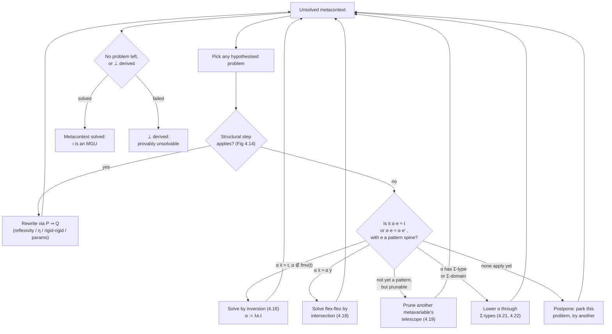

[[book-guidelines|↩ Back to guidelines]]

# Miller Pattern Unification

## Why unification gets hard the moment terms bind variables

First-order unification (Chapter 2's territory) solves equations between terms built from variables and constructors — `f(α, g(x)) ≈ f(y, g(z))` decomposes structurally, and the only real subtlety is the occurs check. Once terms are $\lambda$-calculus terms with real binding structure and a $\beta\eta$-equational theory, unification becomes a different and much harder problem: **higher-order unification**.

Two things break the old algorithm at once:

- **Scope.** A metavariable's solution can only mention variables it is legally allowed to depend on. $\lambda x.\alpha \approx \lambda x.x$ can be solved by $\alpha := x$ only if $\alpha$'s declaration permits depending on $x$ — this is no longer a syntactic accident, it's a scoping discipline the algorithm must track explicitly.
- **A nontrivial equational theory.** Terms are compared up to $\beta$ and $\eta$: $\lambda x.x \approx \lambda x.\lambda y.\alpha\, x\, y$ has solution $\alpha := \lambda z.z$, because $\lambda x.\lambda y.(\lambda z.z)\,x\,y \equiv_\beta \lambda x.\lambda y. x\, y \equiv_\eta \lambda x. x$. A structural comparison of the raw syntax trees would never find this.

**What breaks without a restricted fragment:** full higher-order unification is *undecidable* (Huet 1973) — a direct corollary of it being able to encode Post correspondence / Turing-machine questions through appropriately chosen equations over $\lambda$-terms with constants. Worse, even where solutions exist, most general unifiers need not exist at all, and the *set* of unifiers for one equation can be infinite. Huet's 1975 semi-decision procedure can enumerate them, but "enumerate an infinite search tree" is useless as the load-bearing mechanism inside a type-checker's elaborator, which must be complete, deterministic, and typically must answer *now*, not eventually.

Dana Miller's 1992 observation rescues the situation: restrict metavariables so that whenever one is applied to arguments, those arguments are a spine of **distinct bound variables**. Within this **pattern fragment**, unification is decidable and — critically — *unique* most general unifiers exist whenever a solution exists at all. This chapter (Gundry's Chapter 4, pp. 48–87) develops a dynamic version of pattern unification for a full-spectrum dependent type theory with $\Pi$- and $\Sigma$-types, reusing the "make only small, most-general, type-correct steps" discipline from Chapters 2–3's contextual problem-solving framework.

This is precisely the mechanism your project's elaborator needs for implicit-argument resolution: whenever a dependently-typed program omits an argument, the elaborator inserts a metavariable, and later unification problems (arising from typechecking) pin down what that metavariable must be. Lean, Agda, Coq, and Idris all run some descendant of this algorithm internally, many times per second, during ordinary type-checking.

## The pattern fragment and why it has unique most general unifiers

**Definition (informally).** A term is in the pattern fragment if every occurrence of a metavariable $\alpha$ is of the form $\alpha\; x_1 \cdots x_n$ where $x_1, \ldots, x_n$ are *distinct* (bound) variables. Gundry's Figure 4.17 (`t pat`) gives the formal judgment, extended to also permit projections `hd`/`tl` from $\Sigma$-types and structural recursion into the term.

The key intuition, stated directly in the source: *"Equations that look like definitions, are definitions."* Given $\forall \Gamma.\ \alpha\, \overline{x_i} \approx t$ where $\overline{x_i}$ is a list of distinct bound variables containing every free variable of $t$, and $\alpha$ does not occur in $t$, the *unique* most general solution is

$$\alpha := \lambda \overline{x_i}. t.$$

Why is this the **unique** MGU, rather than merely *a* solution? Because an application to variables "captures the whole nature" of the metavariable — every possible argument tuple the metavariable will ever be judged against is already accounted for by the abstraction. Contrast this with $\alpha\,\mathrm{tt} \approx t$: taking $\alpha := \lambda x. t$ solves the *particular* equation, but it is not the *most general* solution, because it makes an unforced choice about what $\alpha\, \mathrm{ff}$ should be. A later constraint $\alpha\, \mathrm{ff} \approx s$ (for $s \neq t$) would contradict it. This is the sense in which pattern unification differs from ordinary "solve one equation, hope for the best" reasoning: every step must be forced, i.e. compatible with *every* extension of the problem, not just the one currently in view.

**What breaks without linearity or the variables-only restriction**, in one canonical counter-example from the text: $\alpha\, x\, x \approx x$ has *two* incompatible most general solutions, $\alpha := \lambda x\,y. x$ and $\alpha := \lambda y\,x. x$ — the repeated argument makes "project the first" and "project the second" both valid and mutually exclusive, so no single MGU exists. This single example motivates two of the chapter's core restrictions simultaneously (linearity, discussed below, and the ban on non-variable arguments).

**Rust sketch — recognizing the pattern fragment.** Since your project's unifier will need to test this condition constantly (before ever attempting to solve an equation), it's worth seeing it as executable code rather than only as an inference rule:

```rust
/// A spine argument in an evaluation context: applications, and Sigma-projections.
enum Elim {
    App(Term),
    Hd,
    Tl,
}

/// Checks whether `elims` is a valid pattern spine for a metavariable:
/// only applications to *distinct* local variables (or their twins), or
/// pure projections, are permitted.
fn is_pattern_spine(elims: &[Elim]) -> Option<Vec<VarId>> {
    let mut seen = std::collections::HashSet::new();
    let mut vars = Vec::new();
    for e in elims {
        match e {
            Elim::App(Term::Var(x)) if seen.insert(*x) => vars.push(*x),
            Elim::App(_) => return None,      // non-variable, or repeated variable
            Elim::Hd | Elim::Tl => {}          // projections are fine on their own
        }
    }
    Some(vars)
}
```

The `seen.insert(*x)` check is exactly the linearity restriction below; the `Elim::App(_) => None` arm is exactly Miller's "application to a non-variable only partially determines a metavariable."

## Rigid, flexible, and strong rigid occurrences

To make the occurs check and pruning precise, the chapter classifies *where* a subterm occurs relative to metavariables:

- A subterm occurs **flexibly** if it sits inside the evaluation context (spine of arguments) of a metavariable — i.e. it could disappear if that metavariable is later instantiated to ignore that argument.
- A subterm occurs **rigidly** if it does not — a rigid occurrence is, in Miller's phrase, "permanent": no future metavariable solution can erase it.
- A rigid occurrence is **strong rigid** if it is additionally not inside the evaluation context of a *variable* — so no substitution for ordinary variables (only for metavariables, and even that cannot help) can remove it either.

In $\alpha\, x \to y\, z$: $\alpha$, $y$, and $z$ occur rigidly ($y\,z$ sits under a top-level arrow, not under any metavariable's argument list), while $x$ occurs flexibly (it's an argument to $\alpha$). Among the rigid occurrences, $y$ is strong rigid but $z$ is not, since $z$ sits inside the evaluation context of the *variable* $y$ (as an argument to $y\,z$).

This three-way classification exists purely to support a precise occurs check.

## The occurs check for higher-order problems

In first-order unification the occurs check is a binary yes/no gate: if $\alpha$ occurs in $t$ at all, $\alpha \approx t$ is unsolvable, full stop. Higher-order unification needs a finer instrument, because a metavariable occurring in its own candidate solution doesn't always doom the equation — it depends on *how* it occurs.

Gundry (citing Reed 2009b) gives two decisive failure conditions:

1. $\alpha$ occurs **strong rigidly** in its own candidate solution — e.g. $\alpha\, x \approx \alpha\,\mathrm{tt} \to \alpha\,\mathrm{ff}$ — is definitely unsolvable, since no substitution can ever unwind the self-reference.
2. An application of $\alpha$ to (some of) the very variables it's being solved for occurs **rigidly** — e.g. $\alpha\, x \approx x\,(\alpha\, x)$ — is likewise hopeless.

But a **weak** rigid occurrence, one buried under a variable's own arguments where those arguments aren't guaranteed to be variables, does *not* automatically kill the equation: $\beta\, y \approx y\,(\beta\,(\lambda x.x))$ is solvable (e.g. $\beta := \lambda y.\, y\, \mathrm{tt}$). The lesson repeats: Miller's pattern condition, not mere occurrence, is what determines whether a constraint pins a metavariable down completely.

**Lean correspondence.** This is precisely the shape of check Lean's kernel elaborator performs before committing to an assignment for a metavariable (`isDefEq` on a stuck application `?m x y z ≟ e`): it must both check that `?m` doesn't occur where it would create a cyclic/self-referential definition, *and* that the arguments form a valid pattern before "solving by definition" is attempted; if they don't, Lean falls back to postponing the constraint (see the dynamic unification discussion below) rather than declaring outright failure.

## Linearity of bound-variable arguments

We already met the reason: $\overline{x_i}$ in $\alpha\,\overline{x_i} \approx t$ must be **linear** — every variable that occurs must occur *exactly once* — or the solution is ambiguous. $\beta\,x\,x \approx x$ has no immediate unique solution because $\beta$ could project either copy of $x$. But repetition *elsewhere* in the spine, not tied to a single argument position, is harmless: $\gamma\, y\, x\, y \approx x$ has the perfectly good unique solution $\gamma := \lambda y_0\, x\, y_1.\, x$ — what matters is that the definition $\lambda \overline{x_i}. t$ makes sense as a function, and a function can certainly *ignore* a repeated parameter as long as the repetition doesn't create an ambiguity about which occurrence a use of $t$ "meant." Twin variables (below) count as equal for this linearity check.

## Twin variables for heterogeneous equality

Here is the load-bearing novelty of the chapter, and the part most worth dwelling on, because it's the piece that doesn't show up at all in the simply-typed setting.

**What breaks without them:** consider decomposing $(s : \Pi x{:}S.\,T) \approx (t : \Pi x{:}U.\,V)$. The natural move — apply both sides to a fresh variable $x$ and recurse — requires a *single* $x$ with a *single* type to plug into both $T$ and $V$. But $S$ and $U$ are not yet known to be equal (that's part of what we're trying to establish!). Naively writing $\forall x{:}S.\ (s\,x : T) \approx (t\,x : V)$ is simply ill-typed: $x$ can't simultaneously have type $S$ on the left and be used at type $V$ (which expects something of type $U$) on the right.

The fix: introduce a **twin variable** $\hat x : S \ddagger T$ that binds one name but remembers *two* types. Occurrences are tagged to say which type they're being used at — $\acute x$ ("acute", left twin, type $S$) or $\grave x$ ("grave", right twin, type $T$). The decomposition becomes

$$\forall \hat x : S \ddagger U.\ (s\, \acute x : T\{\acute x\}) \approx (t\, \grave x : V\{\grave x\}),$$

which type-checks unconditionally, because each side only ever uses "its own" twin at "its own" type. Semantically, $\acute x$ and $\grave x$ are simultaneously the *same* variable (for scoping and dependency purposes — later constraints in the metacontext are what will *eventually* force $S \equiv U$) and *provisionally different* (for typechecking purposes, until that equality is actually established). Definitional equality deliberately treats twins as *distinct* even once $S$ and $U$ are provably (propositionally) equal but not yet definitionally identified — this is not a bug in the presentation, it's required for soundness: a metavariable solution mentioning $\acute x$ where $\grave x$ was needed must remain rejected until the twin's two types are actually unified into one.

If and when $S \equiv T$ becomes definitionally established, the twin collapses back to a single ordinary variable (decomposition step 4.14 in the chapter, discussed under problem decomposition below).

**Lean correspondence.** Lean has no literal "twin variable" primitive, but the *problem* twins solve is one every dependently-typed elaborator hits: comparing two `Expr`s under binders whose domains aren't syntactically identical yet (e.g. unifying two `Pi` types during `isDefEq`). Lean's elaborator handles this more coarsely — it unifies domains first, then substitutes, effectively serializing what twins let Gundry's algorithm do *concurrently* (make progress on the codomain constraint even while the domain constraint is still open). Twins are best understood as Gundry's way of avoiding an artificial sequencing dependency between "solve $A \approx S$" and "solve $B \approx T$" that a naive presentation would otherwise impose.

```
data Term
  = Var Name
  | TwinL Name   -- x́ : "acute" twin, type S
  | TwinR Name   -- x̀ : "grave" twin, type T
  | Meta MetaId [Elim]
  | ...
```

Note also: computing free variables *ignores* the twin annotation — $\mathrm{fv}(\acute x) = \mathrm{fv}(\grave x) = \mathrm{fv}(x) = \{x\}$ — because for scoping and dependency purposes the two twins are one variable; only *typing* distinguishes them.

## The heterogeneity invariant and typing modulo

Once heterogeneous equations $(s:S)\approx(t:T)$ with $S \not\equiv T$ are admitted into the logic at all, something must stop the algorithm from ever type-checking nonsense. Gundry's answer is the **heterogeneity invariant**: every heterogeneous equation appearing anywhere in a well-formed metacontext must have its two types already provably equal from *preceding* problems (formally: `Θ | Γ ⊢ (S : Type) ≈ (T : Type)` must hold as part of well-formedness). Consequently, whenever a heterogeneous equation is finally *solved*, it's automatically also *homogeneous* — heterogeneity is a bookkeeping device for staged progress, never a permanent state of affairs.

This is contrasted directly against an alternative from the literature: Reed (2009a)'s **typing modulo**, a weaker invariant requiring only that both sides be well-typed *up to the equational theory of the constraints not yet solved*. Typing modulo is elegant but has a sharp cost: if the algorithm terminates with leftover unsolved constraints, some already-committed metavariable solutions may turn out ill-typed under the *true* (fully solved) definitional equality. Norell's thesis on Agda shows this can produce non-normalizing terms and hence a non-terminating type-checker downstream. Gundry's heterogeneity invariant is strictly more conservative — every metavariable it ever commits to is well-typed *given only what's already proven*, which is exactly the guarantee an elaborator interleaving unification with type-checking cannot do without.

This is the paper's version of a **soundness-vs-flexibility trade-off** you'll see again in your own elaborator design: the tighter invariant costs you some ability to make "obviously fine" progress early, but buys unconditional trustworthiness of every partial result — a prerequisite if a trusted kernel is ever going to re-check the elaborator's output, or if the elaborator's own further work depends on earlier metavariable solutions actually type-checking.

## Solving equations by inversion

This is the core "solve a metavariable" rule, already previewed above. Formally (step 4.16, roughly):

$$\Theta, \alpha : T, \Xi,\ ?\, \forall\Gamma.\ \alpha\, \overline{x_i} \approx t \quad\longmapsto\quad \Theta, \Xi_0,\ \alpha :=^{*} \lambda \overline{x_i}.\, t : T,\ \Xi_1$$

provided:

- $\overline{x_i}$ is a pattern spine (distinct variables) and $t$'s free variables are contained among them;
- $\Xi$ can be split into a dependency-respecting permutation $\Xi \cong \Xi_0, \Xi_1$, where $\Xi_0$ (everything $t$ and $T$ depend on) is moved *before* $\alpha$'s new definition and $\Xi_1$ (everything that may depend on $\alpha$) stays after;
- the candidate solution actually type-checks: $\Theta, \Xi_0 \mid \cdot \vdash T \ni \lambda\overline{x_i}.t$.

The permutation step deserves its own comment, because it's a genuinely tricky piece of *context surgery*, not just a syntactic substitution: metavariables are stored in a single dependency-ordered list (recall the $\exists\forall$-prefix design from Chapter 2/3 — all existentials strictly before all universals, no separate per-metavariable telescope needed since metavariables simply have $\Pi$-types). If $t$ mentions a metavariable declared *after* $\alpha$ in that list, that metavariable must be hoisted earlier — but only if nothing *between* them, other than $\alpha$ itself, depends on it in a way that would be violated. Gundry's worked example:

$$\Theta,\ \alpha:\mathrm{Set},\ \beta:\mathrm{Set},\ \gamma:\alpha,\ ?\,\alpha \approx \beta \to \beta$$

resolves to

$$\Theta,\ \beta:\mathrm{Set},\ \alpha := \beta \to \beta : \mathrm{Set},\ \gamma : \beta \to \beta$$

— $\beta$ hops in front of $\alpha$, and $\gamma$'s type gets rewritten by substitution (the definition of the $:=^{*}$ shorthand: writing a definition into the metacontext immediately substitutes it through everything after). If no such permutation exists, $\alpha$ cannot be solved *yet* — but that's not necessarily fatal; solving some other metavariable first might dissolve the dependency cycle. This dovetails directly with the postponement mechanism discussed below.

There's also a symmetric **failure** rule (step 4.17): if $t$ is not (an evaluation context of) $\alpha$ itself, and either $\alpha$ occurs strong rigidly in $t$, or an application $\alpha\,\overline{y_i}$ occurs rigidly in $t$, the whole problem collapses to $\bot$ — this is the occurs check from the previous section, wired directly into the algorithm.

## Solving flex-flex equations by intersection

A different shape of equation arises when the *same* metavariable appears applied to two different variable-spines on both sides: $\forall \Gamma.\ \alpha\,\overline{x_i} \approx \alpha\,\overline{y_i}$. Neither side is "smaller" — this isn't inversion, it's a genuinely symmetric problem. The most general move is to restrict $\alpha$'s domain to exactly those argument positions where the two spines *agree* (position-by-position variable identity, twins counted as equal).

$$\textsf{intersect}\; \Delta\; \overline{x_i}\; \overline{y_i}$$

walks the telescope $\Delta$ and the two argument lists together, keeping a binding $z : S$ only where $x_i \sim y_i$ at that position, discarding it otherwise. Given

$$\Theta,\ \alpha : T \to T \to T,\ ?\, \forall x{:}T.\,\forall y{:}T.\ \alpha\,x\,x \approx \alpha\,y\,x,$$

the two argument lists $(x,x)$ and $(y,x)$ disagree in the first position and agree in the second, so the solution restricts $\alpha$ to depend only on that second argument:

$$\Theta,\ \beta : T \to T,\ \alpha :=^{*} \lambda\_\_.\beta : T \to T \to T,\ ?\,\forall x{:}T.\,\forall y{:}T.\ (\beta\,x : T) \approx (\beta\,x : T).$$

The residual equation is now trivially true by reflexivity. Note carefully the caveat about **large elimination**: in a plain LF-style setting, intersection generalizes to *any* argument lists containing no metavariables. In a full-spectrum theory (this chapter's actual target) that generalization *fails*: $\alpha\,\mathrm{tt}\,x \approx \alpha\,\mathrm{tt}\,y$ does **not** license concluding $\alpha$ is independent of its second argument, because $\alpha$ could legitimately be defined by *case analysis on its first argument*, with genuinely different behavior on the second argument depending on that case. This is a recurring theme in the chapter: the presence of dependent case analysis (large elimination) repeatedly invalidates unification shortcuts that would be sound in a simpler, non-dependent LF setting.

## Pruning to remove out-of-scope dependencies

Pruning solves a different failure mode: an equation $\forall\Gamma.\ \alpha\cdot e \approx t$ can only be solved if *every* free variable of $t$ also occurs in $\alpha$'s argument list $e$ — otherwise those variables would be "out of scope" for any solution of $\alpha$ (which, being declared before $\Gamma$, cannot mention $\Gamma$'s variables except via its own arguments).

$$\Theta,\ \alpha : (T\to T)\to T,\ ?\,\forall x{:}(T\to T).\,\forall y{:}T.\ \alpha\, x \approx x\, y$$

is hopeless as written — $y$ is free in the right-hand side but doesn't occur in $\alpha$'s argument list $\{x\}$, and it occurs *rigidly*, so there's no way to erase it. But if the offending occurrence is instead **flexible** — hidden inside another metavariable's arguments — there may be a way out:

$$\Theta,\ \beta : T \to T,\ \alpha : (T\to T)\to T,\ ?\,\forall x{:}(T\to T).\,\forall y{:}T.\ \alpha\, x \approx x\,(\beta\, y)$$

Here $y$ occurs inside $\beta$'s spine, not $\alpha$'s. **Pruning** restricts $\beta$'s own telescope: if $\beta$ can be shown not to (need to) depend on that argument, it's rewritten as $\beta := \lambda\_\_.\gamma$ for a fresh $\gamma : T$, erasing the offending occurrence of $y$ and leaving a solvable residual $\alpha\, x \approx x\,\gamma$.

The `pruneTm`/`prune` relations (Figure 4.11) formalize this as a structural search through $t$ for occurrences of metavariables whose telescopes can be trimmed, subject to exactly the same discipline seen everywhere else in the chapter:

- an argument position is kept only if it's a **variable** in the allowed set $V$ (never a compound term — again, Miller's condition: only variable-arguments are "safe" to reason about positionally);
- an argument with a **rigid** occurrence of a disallowed variable forces that position to be *dropped*;
- an argument with a **flexible** occurrence of a disallowed variable makes pruning **fail outright** — it's genuinely ambiguous which of potentially several metavariables is responsible for the leak. The book's canonical unsolvable-by-pruning example: $\forall x{:}T.\ \alpha \approx \beta\,(\gamma\, x)$ — either $\beta$ or $\gamma$ could be the one ignoring $x$, and picking one would be an unforced (non-most-general) choice. The algorithm simply defers, hoping other constraints resolve the ambiguity later.
- pruning must also respect *type* dependencies: an argument can't be dropped from a telescope if a later argument's type still needs it (`fv(S) ⊂ vars(∆')` conditions throughout Figure 4.11) — pruning is a *type-preserving* operation, not merely a syntactic trim.

**Rust sketch.** Pruning is naturally a fallible, allowed-set-threading traversal — a shape any Rust engineer will recognize as "occurs check, but constructive":

```rust
/// Try to restrict `beta`'s telescope so that none of its retained arguments
/// can carry a variable outside `allowed`. Returns the new (shorter) telescope,
/// or None if pruning is genuinely ambiguous (a flexible leak) or impossible
/// (a retained argument's type needs a dropped one).
fn prune_telescope(
    telescope: &Telescope,
    args: &[Term],
    allowed: &VarSet,
) -> Option<Telescope> {
    let mut kept = Telescope::empty();
    for (binding, arg) in telescope.iter().zip(args) {
        match arg {
            Term::Var(x) if allowed.contains(x) => {
                if free_vars(&binding.ty).is_subset(&kept.vars()) {
                    kept.push(binding.clone());
                } else {
                    return None; // a later arg's type needs this one — can't drop it safely
                }
            }
            _ if occurs_rigid_outside(arg, allowed) => continue, // safe to drop
            _ if occurs_flex_outside(arg, allowed) => return None, // ambiguous — defer
            _ => kept.push(binding.clone()),
        }
    }
    Some(kept)
}
```

## Metavariable simplification via lowering through $\Sigma$-types

$\Sigma$-types introduce a third kind of non-pattern constraint that has nothing to do with occurs-checks or scope: a metavariable applied to a *projection*, like $\alpha\,\mathrm{hd} \approx s$ where $\alpha : \Sigma x{:}S.\,T$. Rather than extending the pattern fragment to specially handle projections (the route Duggan 1998 takes for $F_\omega$), Gundry takes the structurally simpler option: **eagerly lower** $\alpha$ into a literal pair of fresh metavariables before the projection constraint is ever reached.

$$\alpha : \Sigma x{:}S.\,T \quad\rightsquigarrow\quad \beta_0 : S,\ \beta_1 : T\{\beta_0\},\ \alpha := (\beta_0, \beta_1)$$

so $\alpha\,\mathrm{hd} \approx s$ immediately simplifies to $\beta_0 \approx s$ — a plain pattern equation. Soundness of this rewrite rests entirely on **surjective pairing** (the $\eta$-law for $\Sigma$-types): $(n\,\mathrm{hd}, n\,\mathrm{tl}) \equiv_\eta n$, which is baked directly into the pair rule of definitional equality (it always $\eta$-expands both sides being compared, per Figure 4.4).

The general case has to account for $\alpha$ sitting under a telescope of its own parameters, and — even hairier — a metavariable whose *domain* is itself a $\Sigma$-type needing "uncurrying":

$$\alpha : \Pi x{:}(\Sigma y{:}S.\,T).\,U \quad\rightsquigarrow\quad \beta : \Pi y{:}S.\,\Pi z{:}T.\,[(y,z)/x]\,U,\quad \alpha := \lambda x.\,\beta\,(x\,\mathrm{hd})\,(x\,\mathrm{tl})$$

which transforms the *non-pattern* constraint $\alpha\,(y,z) \approx t$ into the pattern constraint $\alpha\, y\, z \approx t$ — the pairing on the argument side is exactly what made the original spine non-linear-in-variables, and uncurrying dissolves it. This is a genuinely elegant move: it converts a syntactic obstruction (pairs aren't variables) into a *representational* change (don't use pairs as arguments at all), rather than complicating the unification rules themselves.

## Problem decomposition and postponement of non-pattern constraints

Everything above handles *pattern* equations. But real problems are conjunctions of many equations, most of which are not yet in pattern form individually, even though the *system* as a whole may be solvable. The chapter's decomposition relation $P \Rightarrow Q$ (Figure 4.14) collects the structural simplification rules that make progress regardless of pattern status:

- **Reflexivity** (4.1): a trivially-true equation collapses to $\top$.
- **$\eta$-expansion** (4.2, 4.3): functions get compared pointwise (introducing twins, since domains needn't be equal yet — this is where twins actually get *created*), pairs get compared component-wise via `hd`/`tl`.
- **Rigid-rigid decomposition** (4.4–4.7): if both sides share the same head constructor ($\Pi$, $\Sigma$, or a canonical constant), split into subproblems on the parts; if the heads are provably *incompatible* ($\mathrm{tt}$ vs. $\mathrm{ff}$, $\Pi$ vs. $\Sigma$, distinct variables) collapse straight to $\bot$ — this is the $s \mathrel{\bot\!\!\!\bot} t$ rigid-incompatibility relation of Figure 4.13.
- **$\eta$-contraction** (4.8, 4.9): opportunistically contract $\lambda x.\,n\,x \Rightarrow n$ or $(n\,\mathrm{hd}, n\,\mathrm{tl}) \Rightarrow n$ *inside* a problem, purely so that a subsequent pattern check has a better chance of succeeding (an argument $\lambda x.y\,x$ isn't syntactically a variable, but is $\eta$-equal to one).
- **Parameter simplification** (4.10–4.15): drop unused quantifiers, collapse twins with definitionally-equal types back into a single variable, and — reusing the $\Sigma$-lowering idea — split a parameter of $\Sigma$-type into two separate parameters.

**Why postponement, and not "solve in a fixed order":** the crucial design choice is that none of these steps commits to a *global* solving order. If a constraint isn't currently a pattern equation (or its metavariable can't yet be pruned/inverted for lack of information), the algorithm simply **postpones** it and works on something else — solving *other* constraints may later transform a non-pattern equation into a pattern one. The chapter's own motivating pair:

$$\alpha\, x \approx \beta \qquad \alpha\, y\, y \approx t$$

the second equation is non-linear (hence non-pattern) as written, but solving the first via $\alpha := \lambda x.\beta$ turns it into $\beta\, y \approx t$ — now perfectly patterned. Even in a *first-order* setting this "solve whichever is ready, not whichever comes first" discipline is necessary: $(\alpha + \beta,\, \alpha) \approx (3, 0)$ over natural-number metavariables gets stuck if you insist on left-to-right order (nothing determines $\alpha+\beta$ alone), but solving right-to-left first (giving $\alpha := 0$) immediately simplifies the left component to $\beta \approx 3$. (Gundry notes drily that Coq, used as a dependently-typed programming language, suffers from exactly this kind of order-sensitivity.) This dynamic, order-independent postponement — rather than a static, purely syntactic pattern-fragment restriction — is what **dynamic pattern unification** means in this chapter's title and content: constraints move fluidly between "patterned, can be attacked now" and "not yet, park it" as the metacontext evolves, and *no fixed strategy for choosing which to attack first affects the final answer* (Section 4.3.3, Generality) — only *whether* progress can still be made overall.



## Soundness, generality, and partial completeness of unification

The correctness story has three separate legs, and the chapter is explicit that they are of different strength:

**Soundness (Theorem 4.14).** If $\Theta \mapsto^{*} \Theta'$ and $\Theta'$ is solved, then the identity metasubstitution $\iota : \Theta \sqsubseteq \Theta'$ actually *is* a solution of the original $\Theta$. Proved step-by-step: every individual rewrite step (Lemma 4.12/4.13) is shown to only ever replace a hypothesis with something whose truth *implies* the truth of what it replaced, and every metavariable definition it commits to is well-typed at the moment it is made. This is the cheapest of the three properties to establish, because each step is locally checkable.

**Generality (Theorem 4.16).** This is the "no unforced choices" property made precise: if $\theta$ solves $\Theta_0$ and $\Theta_0 \mapsto \Theta_1$, there exists a *cofactor* $\zeta : \Theta_1 \sqsubseteq \Theta_0$ such that $\theta \equiv \zeta \cdot \iota$ — every solution of the *original* problem factors through the step just taken. In plainer terms: the algorithm never destroys solutions by committing early to something that turns out to be too specific. This is exactly what licenses calling its outputs *most general* unifiers rather than merely *some* unifiers, and it's the property that made the earlier worked examples ("this is the unique MGU," not "this is one possible answer") legitimate claims rather than hand-waving.

**Partial completeness (Theorem 4.18).** Full completeness is explicitly out of reach — the introduction already established that unrestricted higher-order unification is undecidable, so no complete decision procedure can exist for the general case. What *is* provable: restricted to the **static pattern fragment** (every metavariable occurrence is already a pattern, Figure 4.17's `t pat` judgment), the algorithm can *always* take a further step unless the metacontext is already solved or has failed (Lemma 4.17) — hence it never gets "stuck" wondering what to do next while genuine progress remains possible. This is a genuine completeness result for that restricted fragment, conditional on termination (next section). Note carefully what's *not* claimed: the algorithm handles more than the static pattern fragment in practice (it postpones and later solves non-pattern constraints, and it handles $\Sigma$-types beyond Miller's original formulation), but the *proof* of completeness only covers the syntactically-patterned case.

Underlying all three results is a prior **consistency** result (Corollary 4.11): if $\Theta$ is solved, $\bot$ is not derivable from it — i.e. the unification logic doesn't let you "prove" a contradiction out of a metacontext the algorithm considers successfully finished. This is essentially a cut-elimination/normal-form result: any proof that a problem holds can be reduced to one built purely from definitional equalities (Lemma 4.9), so a solved metacontext really is consistent, not merely syntactically unrefuted.

## The open problem of termination

The chapter is refreshingly candid here: **termination is not proved**, and is flagged explicitly as open for the full theory. Intuitively each step *should* shrink something — a unification problem decomposes into smaller subproblems, a metavariable gets solved outright, or a metavariable gets replaced by structurally smaller metavariables (as in $\Sigma$-lowering). The standard proof technique is to exhibit a well-founded measure on the size of terms/types in the context and show every step strictly decreases it; Abel and Pientka (2011) did exactly this for LF.

**What breaks specifically in the full-spectrum (this chapter's) setting, and not in LF:** LF is a *weak* type theory where types can't themselves be arbitrarily large or depend on runtime case-analysis. Here, with large elimination (type-level `if`) and metavariables that can themselves stand for *types*, solving a metavariable can make a *type* larger, not just a term — there's no LF-style guarantee that instantiating a metavariable shrinks anything. And if you instead try to measure a metavariable's size as the supremum over all its possible future instantiations, $\Sigma$-lowering (splitting $\alpha$ into $\beta_0,\beta_1$) does not obviously decrease that measure either.

The chapter includes a sharp cautionary example showing termination genuinely can fail, *if* the underlying type theory is inconsistent (specifically: if it admits $\mathsf{Set}:\mathsf{Set}$, the very axiom Martin-Löf had to abandon after Girard's paradox). Starting from

$$\alpha : \Sigma X{:}\mathsf{Set}.\,X,\quad ?\, \alpha \approx (\Sigma X{:}\mathsf{Set}.\,X,\, \alpha)$$

lowering $\alpha$ and solving its first ($\mathsf{Set}$-typed) component regenerates — verbatim — the *original* problem one level down, in an infinite loop. This isn't a bug in the algorithm; it's a symptom of $\mathsf{Set}:\mathsf{Set}$'s genuine logical inconsistency leaking into non-termination, exactly analogous to how an inconsistent logic lets you write a non-terminating well-typed program. Gundry's own type theory is properly stratified (only one universe, $\mathsf{Set}:\mathsf{Type}$, with $\mathsf{Type}$ itself not a well-typed term), so this specific loop doesn't apply to it — but a *general* termination proof, accounting for that stratification, is left as future work, alongside a footnote noting that termination failures for pattern unification are a known subtlety even in prior literature (Dowek et al. 1996).

**Why this matters for a compiler you actually ship:** an elaborator whose unifier might not terminate is a genuine liability, not an academic nicety — it means type-checking itself might not terminate, which is a much worse failure mode than "type error." Production systems (Lean, Agda, Coq) manage this with a mix of fuel/step limits, occurs-check-strength heuristics, and restricting which reduction strategies unification is allowed to trigger — pragmatic engineering responses to a problem that, as this chapter documents, doesn't yet have a clean theoretical closure even for a fairly disciplined dependent type theory.

## Where this leads

Structurally, this chapter is the odd one out among Chapters 2–4: Chapters 2 and 3 apply the *same* contextual-problem-solving discipline (ordered metavariable contexts, minimal information increase, most-general steps) to progressively richer *equational theories* over an essentially first-order term language (syntactic equality, then the abelian-group theory of units). Chapter 4 instead keeps a comparatively simple equational theory ($\beta\eta$) but moves to a genuinely richer *term language* — one with binding structure and dependent types. The throughline the thesis is making is that all three settings are instances of one discipline: represent partial knowledge as an ordered context, only ever take steps that are forced and most general, and let completeness/generality proofs follow from *that* discipline rather than from anything bespoke to the equational theory at hand.

Downstream, the thesis explicitly says (in its own closing lines) that this algorithm is the "base on which to build an elaborator for a full-spectrum dependently typed language" — and indeed Chapter 7's elaboration of `inch` reuses exactly this unification machinery (there reformulated with *parameterised* metavariables, since `inch`'s type language lacks first-class higher-order functions) as its constraint solver.

For the standing project in view here — a Rust-based dependent/refinement-type compiler with a Lean-style bidirectional elaborator — this chapter is close to a direct blueprint for the metavariable-unification core (`type-theory` and `automated-reasoning` connections both apply directly): the metacontext-as-ordered-list representation, the pattern-spine check, inversion/intersection/pruning as separate composable rewrite rules, and dynamic postponement of non-pattern constraints are exactly the mechanisms a Rust implementation of "resolve implicit arguments via metavariable unification" needs to get right, in that order of urgency. The twin-variable device is the one piece with no obvious shortcut: any elaborator that needs to compare dependent function/pair types *before* their domains are known to be equal will reinvent something twin-shaped, whether or not it's named that way — worth recognizing on sight in Lean's or Agda's own source if you go reading it. And the open termination question is a fair warning going in: a from-scratch unifier for a full-spectrum dependent theory should budget for pragmatic safeguards (fuel limits, careful heuristics for when to attempt inversion vs. postpone) rather than assuming a textbook termination proof is waiting to be ported in.
