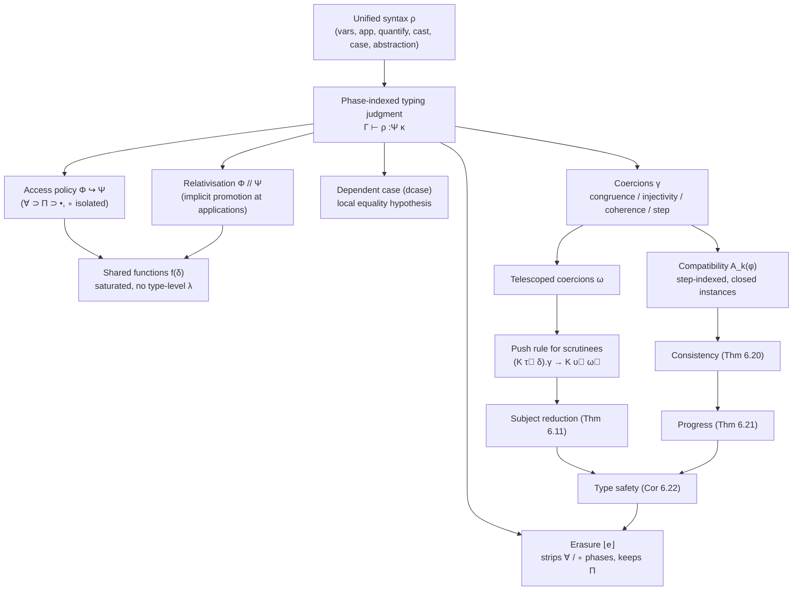

# The Evidence Language

[[book-guidelines|↩ Back to guidelines]]

## Why a compiler needs a proof-carrying core language

Suppose you're building a compiler frontend that elaborates a rich source language — implicit arguments, type inference, dependent pattern matching — into something a backend can consume. You have two options for the intermediate representation (IR): trust the elaborator to produce well-typed code, or make the IR *self-certifying*, so a small, dumb typechecker can independently confirm the elaborator didn't mess up.

GHC took the second path decades ago with System $F_C$: Haskell surface syntax elaborates into a tiny explicitly-typed core calculus, and every GADT match or type-family reduction that happens implicitly at the source level becomes an explicit, checkable proof term — a **coercion** — in the core. This is precisely the "de Bruijn criterion" from proof assistants like Coq: a complicated, bug-prone elaboration process is fine, as long as its output can be checked by a small trusted kernel. If your Rust-based verifying compiler has an elaborator doing metavariable unification and constraint solving (the kind of thing Chapters 2–5 of this thesis build), you want exactly this separation: a fast, untrusted "frontend" and a slow, trusted, structurally simple "kernel" that only has to check, never search.

Gundry's evidence language is System $F_C$ extended with $\Pi$-types (real, dependent function spaces usable at runtime *and* compile time) and a **phase distinction** — an explicit tag on every judgment saying which of four "worlds" (static types, dependent-product arguments, proofs, or runtime terms) an expression lives in. This chapter is Gundry's answer to a genuinely hard design question: once you let term-level data leak into types (as $\Pi$-types demand), how do you keep the type theory *decidable to check* while still allowing datatypes to be promoted to kinds and functions to be shared between compile time and runtime?

The chapter's core trick — and the thing worth understanding deeply before the notation — is this: **rather than having separate syntaxes and typing judgments for "terms," "types," and "coercions" the way System $F_C^\uparrow$ does, unify them into one syntax and one typing judgment, parameterized by a phase.** This is exactly the "unityped internal syntax, typed externally by an index" trick that shows up all over dependent type theory (e.g. Lean's `Expr` has one inductive type for terms *and* types — the type/term distinction is a fact about how an `Expr` is used, not a fact baked into its constructors). Once you see it that way, most of the rest of the chapter is "what invariants do we need on top of a unityped core to keep decidability and safety."

---

## 1. One syntax, one judgment, many phases

### The problem this solves

Consider `replicate`, `inch`'s running dependent-types example:

```
replicate :: Π (n :: N) → a → Vec a n
replicate Zero     = Nil
replicate (Suc n) x = Cons x (replicate n x)
```

The argument `n` is used **statically** (it appears in the return type `Vec a n`) *and* **dynamically** (the function pattern-matches on it at runtime). In GHC today you'd have to fake this: a type family `Replicate` for the static computation, plus a singleton-indexed term-level function `replicateSing` for the dynamic computation, with no formal connection between the two (Gundry shows exactly this duplication in the chapter, contrasting it with the unified $\Pi$-type version). What breaks without a unified treatment is exactly this duplication: two definitions, two termination arguments, and an elaborator that has to keep them in sync by convention rather than by construction.

Gundry's fix is to make `replicate` genuinely **one function**, checkable at both the type level and the term level, by erasing the term/type distinction from the syntax and pushing it into an index on the typing judgment.

### The grammar

All expressions — types, terms, coercions, kinds — are one syntactic category $\rho$:

$$
\rho ::= a \mid \rho^\Phi \, \rho' \mid (a :_\Phi \rho) \to \rho' \mid H \mid f(\delta) \mid \rho.\gamma \mid q \mid (\mathrm{d})\mathtt{case}\ \rho \ \mathtt{of} \ \overline{br_i}^{\,i} \mid \Lambda a :_\Phi \kappa.\rho
$$

Reading this in words:
- **Variable** `a` — one production covers type variables, term variables, and coercion variables; the thesis just adopts a naming convention (`a,b` for types, `c` for coercions, `x,y,z` for terms) for readability.
- **Application** $\rho^\Phi\,\rho'$ — applying one expression to another *at phase $\Phi$*. The phase annotation on the *arrow*, not a separate syntax form, is what distinguishes "applying a type constructor to a type" from "applying a function to a value."
- **Quantification** $(a:_\Phi\rho)\to\rho'$ — one construct subsumes $\forall a:\tau.\upsilon$ (which becomes $(a:_\forall \tau)\to\upsilon$) *and* the ordinary function space $\tau\to\upsilon$ (which becomes $(x:_\bullet \tau)\to\upsilon$, non-dependent because the typing rules simply never let $x$ occur free in $\upsilon$).
- **Constructor** $H$ — type constructors $D$, data constructors $K$, the kind of types $*$, and the built-in heterogeneous equality type $(\sim)$ are all "rigid constructors."
- **Saturated function** $f(\delta)$ — a distinguished syntactic form (not ordinary application) for calling a "shared" function with a full vector of arguments $\delta$ at once. More on why this must be syntactically distinct below.
- **Cast** $\rho.\gamma$ — explicitly change $\rho$'s type using a coercion $\gamma$ (a term-level proof of type equality).
- **Coercion evidence** $q$ — the various primitive proof-forming operators (axioms, congruence, injectivity, coherence — Section 3 below).
- **Case analysis** `(d)case` — ordinary or *dependent* case (`dcase`), which additionally binds a local proof that the scrutinee equals the matched constructor.
- **Abstraction** $\Lambda a:_\Phi\kappa.\rho$ — subsumes $\lambda$-abstraction over terms and $\Lambda$-abstraction over types; sugar lets you write the familiar `λx:τ.e`.

The phase index $\Phi,\Psi$ ranges over four values:

$$
\Phi,\Psi ::= \forall \mid \Pi \mid \circ \mid \bullet
$$

- $\forall$ — **static phase**, universal quantification (ordinary polymorphic types)
- $\Pi$ — **shared phase**, dependent-product arguments (usable both statically and at runtime)
- $\circ$ — **proof phase**, coercion quantification (arguments to a proof)
- $\bullet$ — **runtime phase**, the ordinary function space

There is a *single* judgment $\Gamma \vdash \rho :_\Psi \kappa$ — "$\rho$ has type $\kappa$, when checked at phase $\Psi$." Every subgrammar in the thesis (types $\tau,\upsilon,\kappa$ at phase $\forall$; coercions $\gamma,\eta$ at phase $\circ$; runtime terms $e$ at phase $\bullet$; shared terms $\varepsilon$ at phase $\Pi$) is not a separate syntax at all — it's just "the set of $\rho$'s that are well-typed at that particular $\Psi$." That's the punch line of unification: **the phase index on the judgment is doing the work that separate grammars used to do**, and a metatheorem (stated informally in the text) guarantees that a well-typed $\rho$ at phase $\Psi$ actually belongs to the subgrammar you'd expect for $\Psi$.

**Rust/Lean grounding.** This is exactly the shape of Lean's kernel `Expr`:

```rust
// A single unityped AST, exactly like Gundry's ρ.
enum Expr {
    Var(Name),
    App(Phase, Box<Expr>, Box<Expr>),        // ρ^Φ ρ'
    Pi(Phase, Name, Box<Expr>, Box<Expr>),   // (a :_Φ ρ) → ρ'
    Const(Name),                              // H
    Call(Name, Vec<Expr>),                    // f(δ)
    Cast(Box<Expr>, Coercion),                // ρ.γ
    Case(Scrutinee, Vec<Branch>),
    Lambda(Phase, Name, Box<Expr>, Box<Expr>),
}
```

There is no separate `Type` enum. "Is this a type or a term?" is answered not by pattern-matching the `Expr` but by asking the typechecker at what phase it type-checks — precisely how Lean's `Expr.sort`/`Expr.const`/`Expr.app` machinery treats `Prop`, `Type`, and ordinary terms uniformly, distinguishing them via *universe levels and the typing judgment*, not via separate ASTs. If you are designing the IR for your own verifying compiler, this is the single biggest design decision this chapter is arguing for: don't build a term AST and a separate type AST with an ad hoc "promotion" function between them (System $F_C^\uparrow$'s approach) — build one AST and let phases (or universes) do the separating.

---

## 2. Phase distinctions and the access policy

### What breaks without an access policy

If phases were totally separate worlds, you couldn't write `Just Bool True`, because `Just`'s type $(a:_\forall *, x:_\bullet a) \to \mathtt{Maybe}\ a$ expects a *static* argument then a *runtime* argument — but you also want to use `Just` purely at the type level, applying it only to static arguments, e.g. `Just ∗ Bool : Maybe ∗` (a promoted GADT). You need a principled way to say "a value that's known statically can *also* be used where a proof, or a shared-phase value, is expected," without conflating the phases entirely (a genuinely dynamic runtime value must **never** leak into a type — that's the whole point of a phase distinction; erasure at runtime, Section 6, would be unsound otherwise).

### The access policy relation

Gundry defines a partial order $\Phi \hookrightarrow \Psi$ ("data at phase $\Phi$ is accessible at phase $\Psi$") via the Hasse diagram:

$$
\begin{array}{c}
\forall \\
\uparrow \\
\Pi \\
\uparrow \\
\bullet
\end{array}
\qquad \text{and separately} \qquad \circ \ (\text{isolated})
$$

So $\Pi \hookrightarrow \forall$, $\Pi \hookrightarrow \bullet$, and $\circ$ is related to nothing but itself. In words: shared-phase ($\Pi$) data can be used both as a static type-level thing ($\forall$) and as a runtime thing ($\bullet$) — that's exactly the "shared" in "shared function." But nothing can be *promoted into* the coercion phase $\circ$, because coercions must stay decidable to check and must not be contaminated by potentially-nonterminating runtime computation.

The variable typing rule literally builds this relation in:

$$
\frac{\Gamma \vdash \mathtt{ctx} \quad \Gamma \ni a:_\Phi \kappa \quad \Phi \hookrightarrow \Psi}{\Gamma \vdash a :_\Psi \kappa}
$$

A variable bound at phase $\Phi$ is usable at any phase $\Psi$ reachable via $\hookrightarrow$. **Lemma 6.4 (Phase inclusion)** generalizes this from variables to *whole judgments*: if $\Gamma \vdash \rho :_\Phi \kappa$ and $\Phi \hookrightarrow \Psi$, then $\Gamma \vdash \rho :_\Psi \kappa$ too. This is the metatheoretic backbone that makes "promotion" a theorem rather than a separately-defined mechanism — exactly the property System $F_C^\uparrow$ has to bolt on as an ad hoc relationship between well-typed terms and well-kinded types, rather than get for free.

**What breaks without it:** without a monotonicity lemma like this, every place in the metatheory that needs to "promote" a fact from one phase to another (which happens constantly — e.g. proving subject reduction for the dependent case rule) would need a bespoke argument. The access policy turns "can $x$'s value be trusted here?" into a single reusable order-theoretic fact.

### Relativisation: $\Phi \mathbin{/\!/} \Psi$

The application rule needs to decide, given a quantifier's declared phase $\Phi$ and the phase $\Psi$ at which the whole application is being checked, *what phase the argument itself must be checked at*. That's the relativisation operator, "$\Phi$ for $\Psi$":

$$
\frac{\Gamma \vdash \rho :_\Psi (a:_\Phi\kappa_1)\to\kappa_2 \qquad \Gamma \vdash \rho' :_{\Phi \mathbin{/\!/} \Psi} \kappa_1}{\Gamma \vdash \rho^\Phi\rho' :_\Psi [\rho'/a]\kappa_2}
$$

with the table

$$
\begin{array}{c|cccc}
\mathbin{/\!/} & \forall & \Pi & \circ & \bullet \\\hline
\forall & \forall & \forall & \circ & \bullet \\
\Pi & \Pi & \Pi & \circ & \bullet \\
\circ & \forall & \forall & \circ & \forall \\
\bullet & \bullet & \bullet & \circ & \bullet
\end{array}
$$

(read as row $\Phi$, column $\Psi$; e.g. $\bullet \mathbin{/\!/} \forall = \forall$). Concretely: when checking a *runtime* term ($\Psi = \bullet$), $\Phi \mathbin{/\!/} \bullet = \Phi$ — arguments must literally be at the phase stated in the function's type, no promotion happens. But when checking in a *static* context ($\Psi = \forall$), $\bullet \mathbin{/\!/}\forall = \forall$: an argument declared at the runtime/shared phase gets **implicitly promoted** to static, because you're building a type, not running a program, so a value known statically is exactly what's needed. This is the formal mechanism that makes `Just ∗ Bool : Maybe ∗` typecheck even though `Just`'s second argument is declared at phase $\bullet$ in general — because we're constructing at phase $\forall$, and $\bullet \mathbin{/\!/} \forall = \forall$.

Crucially, $\circ \mathbin{/\!/}\Psi$ never lands anywhere but $\forall$ or $\circ$ itself, and nothing $\hookrightarrow \circ$ except $\circ$ — this is precisely why a runtime-phase variable can never sneak into a type expression: there is no route through relativisation or the access policy that lands you at $\circ$ except being $\circ$ already.

**Rust/Lean grounding.** Think of $\Phi \mathbin{/\!/}\Psi$ as a lookup table used by a "phase checker" pass that runs *before* or *alongside* your real typechecker — exactly analogous to how a Rust compiler decides whether a `const` context permits calling a particular function (`const fn`), except here the decision is total and compositional rather than an ad hoc whitelist. If you're building a refinement-type or dependently-typed Rust verifier, this table is the formal specification for "which arguments to a dependent function must be statically known" — the same question your elaborator has to answer when deciding whether an argument can be left implicit and solved by unification versus must be supplied as an explicit runtime value.

### Shared functions and saturation

A shared function like `(+) :: Π (m::N) (n::N) → N` needs to be usable both in terms and in types (e.g. in the type of `vsplitAt :: ∀ a (n::N). Π (m::N) → Vec (m+n) a → (Vec m a, Vec n a)`). The signature $\Sigma$ records function *declarations* $f[\Delta] :_\Phi \kappa$ (telescope of parameters, phase, result type) separately from *definitions* $f[\Delta] = \rho :_\Phi\kappa$ (so that a definition can call itself recursively — the declaration is visible to earlier signature entries, the definition need not be).

The typing rule:

$$
\frac{\Sigma \ni f[\Delta]:_\Phi\kappa \qquad \Gamma \vdash \delta : \Delta \mathbin{/\!/}\Psi \qquad \Phi \hookrightarrow \Psi}{\Gamma \vdash f(\delta) :_\Psi [\delta/\Delta]\kappa}$$

Two things are load-bearing here, and both are explicitly motivated in the text as *design decisions*, not accidents:

1. **Saturation.** $f(\delta)$ is syntactically distinguished from ordinary application $\rho^\Phi\rho'$ — you cannot partially apply a shared function, and there is **no type-level $\lambda$-abstraction** at all. Why this matters: injectivity of type-level application (used constantly in coercion decomposition — see `left`/`right` below) depends on function applications being fully saturated and syntactically rigid. If you allowed type-level $\lambda$s, you'd need to reason about definitional equality up to $\beta$-reduction of *arbitrary partial applications*, which is exactly the kind of unrestricted higher-order unification problem Chapter 4 spent 40 pages showing is undecidable in general. Saturation keeps the language of types "essentially first-order," which is precisely what keeps elaboration (Chapter 7) tractable.
2. **No termination requirement.** Because shared functions may not terminate, they're barred from the proof phase $\circ$ entirely (a proof can't contain a possibly-diverging function call — that would break decidability of coercion-checking). But term-level/type-level reduction is allowed to diverge, mirroring how type families in GHC can already loop the type checker. Type safety therefore cannot depend on strong normalization of the function layer — a genuinely different posture from a strongly-normalizing dependent type theory like a `Fin`-and-`Vec`-only fragment of Lean, and much closer to how GHC's own type family reduction is unrestricted today.

---

## 3. Dependent case analysis and local equality hypotheses

### The mechanism, from first principles

Ordinary case analysis tells you *which* constructor a value has. **Dependent** case analysis additionally tells you *what the scrutinee equals*, as a fact you can use in the type of each branch. This is "learning by testing": `replicate n x = dcase n of { Zero → Nil; Suc m → Cons x (replicate m x) }` type-checks because inside the `Zero` branch you get to assume `n ∼ Zero`, letting `Nil : Vec a Zero` unify with the expected `Vec a n`.

This is exactly a GADT pattern match's effect, but Gundry deliberately factors it differently: rather than the equality proof being an *implicit argument smuggled inside the data constructor* (as with GADTs), `dcase` **separately introduces** a fresh proof variable into scope for each branch. This decoupling is what lets the same mechanism support case analysis on ordinary (non-GADT) data too, and it's what makes the elaborator's job in Chapter 7 more tractable — implicit-argument reconstruction for the constructor's own arguments is handled by the general constructor-application machinery, while the *branch-local equational reasoning* is handled by a single, uniform rule.

### The typing rule

$$
\frac{\Delta' = [\vec\upsilon/\vec a]\Delta \mathbin{/\!/}\Pi,\ c:\varepsilon\sim(K\ \vec\upsilon\ \Delta) \qquad \Gamma,\Delta' \vdash \rho:_\Psi\tau \qquad \Gamma\vdash\tau:_\forall * \qquad \Phi\hookrightarrow \Pi\mathbin{/\!/}\Psi}{\Gamma \vdash K\ \Delta' \to \rho :_\Psi (\varepsilon:D\ \vec\upsilon) \Rightarrow \tau}$$

Reading this: a dependent branch for constructor $K$ binds its ordinary arguments $\Delta'$ (relativised to the surrounding phase $\Psi$, so they're available statically too) **plus** a fresh coercion variable $c$ witnessing $\varepsilon \sim K\ \vec\upsilon\ \Delta$ — "the scrutinee really is this constructor applied to these arguments." The scrutinee $\varepsilon$ must be checked at phase $\Pi \mathbin{/\!/}\Psi$, which by the access policy always lands at $\forall$ or better — precisely so that $\varepsilon$ is legal to mention inside an equality *type*.

Elaborated, `replicate`'s body becomes:

```
dcase n of
  Zero (c : n ∼ Zero)            → Nil a n c
  Suc (m :Π N, c : n ∼ Suc m)    → Cons a n m x (replicate (a, m, x)) c
```

where `Nil : (a:_∀ *, n:_∀ N, c: n ∼ Zero) → Vec a n` and similarly for `Cons` — the GADT-style constructors now carry their equality proof as an ordinary explicit argument, reconstructed by the elaborator (Chapter 7's job), not baked into the constructor's own typing rule.

**Connection to your project's elaborator.** This is a clean, minimal design for exactly the "local equality hypotheses from pattern matching" problem your Rust-based dependent/refinement-type compiler will need to solve — every dependent pattern match (or refinement-type narrowing on a discriminated union) needs to introduce a local fact of this shape into the typing context for the branch body, and the `dcase`/plain-`case` split (dependent case restricted to phase $\Psi\neq\circ$, ordinary case for genuinely runtime scrutinees) is a template for how to keep that machinery from leaking into your proof layer.

---

## 4. Coercions: explicit proofs of type equality

### Why casts, not a conversion rule

A classical dependent type theory has a **conversion rule**: if $\Gamma \vdash e : \tau$ and $\tau \equiv \upsilon$ (definitionally), then $\Gamma \vdash e : \upsilon$. This is elegant but only works if definitional equality is decidable — normally guaranteed by strong normalization. Gundry's evidence language has no strong normalization (general recursion at the type level is allowed!), so a raw conversion rule would make typechecking undecidable — you'd have to *search* for a computation path connecting $\tau$ and $\upsilon$, possibly forever.

The fix: replace the conversion rule with an explicit **cast** $\rho.\gamma$, where $\gamma$ is a coercion — a syntactic proof term whose type $\Gamma \vdash \gamma : \tau \sim \upsilon$ certifies the equality. Checking a cast is $O(1)$ modulo checking $\gamma$'s own type; no search, no normalization, ever. This exactly mirrors why System $F_C$ exists in the first place — GADT/type-family elaboration produces coercions instead of relying on the checker to rediscover equalities.

### Congruence, injectivity, coherence

The coercion sublanguage $q$ has a deliberately small, explicit set of primitive forms rather than deriving structural rules ("the lifting theorem" in older System $F_C$ literature) as admissible:

- **`resp ω Δ τ`** — the single general-purpose **congruence** rule. Given a telescoped coercion $\omega$ (pairs of related values across a telescope $\Delta$), it proves $[\overleftarrow\omega/\Delta]\tau \sim [\overrightarrow\omega/\Delta]\tau$ — "substituting the left-hand sides into $\tau$ is equal to substituting the right-hand sides." This single rule is powerful enough to *derive* reflexivity `⟨τ⟩`, symmetry `sym γ`, transitivity `γ₁;γ₂`, and congruence for ordinary functions (`cong η γ`) — see Figure 6.9's derivable rules, reproduced conceptually below. Making congruence one explicit primitive (rather than proving admissibility as a metatheorem) sidesteps an entire proof obligation that dogged earlier System $F_C$ papers.
- **`left γ` / `right γ`** — **injectivity**: from $\gamma : \tau\ \tau' \sim \upsilon\ \upsilon'$, extract $\tau\sim\upsilon$ (`left`) or $\tau'\sim\upsilon'$ (`right`); similarly for decomposing an equality between two non-dependent function spaces into equalities on domains and codomains. This is exactly what "saturated function applications are syntactically rigid" (Section 2) buys you: injectivity is *sound* only because you can't have two different saturated applications reduce to the same normal form via some hidden $\beta$-redex trick.
- **`congₐ`, `cong`, `γ@η`, `γ@(η₁,η₂)`** — congruence and instantiation for dependent quantification and application, needed because the generic `resp` rule (fixed telescope, no local binding) isn't expressive enough to state congruence *under a binder* — e.g. proving $(a:_\Upsilon\kappa_1)\to\tau_1 \sim (a:_\Upsilon\kappa_2)\to\tau_2$ from $\kappa_1\sim\kappa_2$ and a coercion $\tau_1\sim\tau_2$ that's allowed to *use* a proof that the bound variables are equal.
- **`coh γ η`** — **coherence**: casting doesn't change the identity of an expression, $\tau.\eta \sim \tau$ (present already in Weirich et al.'s work and Observational Type Theory).
- **`kind γ`** — because the equality type uses the "$\Sigma$-interpretation" of **heterogeneous equality** (an equation between differently-kinded expressions entails their kinds are equal too), this coercion extracts that kind-level proof from a term-level one.
- **`step ρ`** — genuinely novel to this chapter: turns a single reduction step $\tau \xrightarrow{\mathtt{kpush}} \tau'$ directly into a proof $\tau \sim \tau'$. This is what embeds the *operational semantics* inside *propositional equality* — computation is always finite evidence, never an infinite search, because `step` only certifies one concrete step that the checker has already performed.

**What breaks without injectivity as a primitive, checkable rule:** if type-level application weren't rigid/injective, you could not soundly decompose `Vec a n ∼ Vec a' n'` into `a ∼ a'` and `n ∼ n'` — which is exactly the operation your elaborator needs constantly when unifying two applied type constructors during constraint solving (this is literally what `left`/`right`/`nth` give you, and what a Lean-style `isDefEq` does implicitly when it recurses into subterms of two applications with the same head).

### Telescoped coercions $\omega$

A **telescope** $\Delta$ names a sequence of dependent bindings; a **vector** $\delta$ is a sequence of expressions substitutable for a telescope. A **telescoped coercion** $\omega$ packages *two* vectors $\overleftarrow\omega,\overrightarrow\omega$ (the left-hand and right-hand sides) plus, for each type-level entry, a coercion proving the two sides equal — but *no* proof obligation for term-level entries (since terms can't appear in types, no equality is needed there) and none for coercion-level entries (the system is proof-irrelevant, so any two coercions between the same types are interchangeable). This is the engine behind `resp`: it's precisely "simultaneous congruence closure evidence across an entire telescope of arguments," generalizing the single-argument congruence rule you'd see in a simpler system to the telescope-shaped applications this language actually has (constructors and shared functions always come with a whole telescope of arguments, not one at a time).

---

## 5. Operational semantics and the push rule for scrutinees

### The reduction relation

A single small-step relation $\rho \to \rho'$ applies uniformly at *all* phases (types, terms, and shared expressions all reduce the same way — the whole point of unifying the syntax). Values and value types are:

$$
v ::= H\,\delta \mid (a:_\Phi\kappa)\to\tau \mid \Lambda a:_\Phi\kappa.e \qquad\qquad \xi ::= H\,\psi \mid (a:_\Phi\kappa)\to\tau
$$

Coercions ($\circ$-phase expressions) are **not evaluated** — reduction only touches computational content. Ordinary rules: $\beta$-reduction $(\Lambda a:_\Phi\kappa.e)^\Phi\rho \to [\rho/a]e$, function unfolding $f(\delta)\to[\delta/\Delta]\rho$ (call-by-name, so recursive shared functions expand lazily), and case reduction on a matched constructor $\mathtt{case}\ K\,\psi\,\delta\ \mathtt{of}\ \overline{br_i}^{\,i} \to [\delta/\Delta]\rho$ when $K\,\Delta\to\rho \in \overline{br_i}$. Dependent case additionally substitutes the equality proof: $\mathtt{dcase}\ K\,\psi\,\delta\ \mathtt{of}\ \overline{br_i}^{\,i} \to [(\delta,\langle K\psi\delta\rangle)/\Delta]\rho$ — the branch body receives both the arguments *and* a reflexivity proof that the scrutinee equals this constructor application.

### The push rule — the chapter's real engineering problem

Here's the failure mode that motivates the whole apparatus of telescoped-coercion extension (Section 4 above): suppose $\gamma : \mathtt{Maybe\ Bool} \sim \mathtt{Maybe}\ a$ and consider the scrutinee `(Just Bool True).γ`. This is a *coerced value* — a value wrapped in a cast — and it **blocks** ordinary case reduction, because the outermost syntax is a cast, not a bare constructor application. But the coercion's existence proves the two types have the same head constructor (`Maybe`), so morally this scrutinee *should* still be able to drive a case split. Naively stripping the coercion off is unsound (you'd throw away the type information the branch needs); you need to **push the coercion inward**, past the constructor, onto its individual arguments: `Just Bool True . γ` steps to `Just a (True . right γ)`, an ordinary un-coerced applied constructor, now reducible.

The general push rule:

$$
\frac{\Gamma\vdash\gamma:D\,\vec\tau\sim D\,\vec\upsilon \qquad \Sigma\ni K:_\Phi(\vec{a:_\forall\kappa},\Delta)\to D\,\vec a \qquad \omega = \overline{(\tau_i,\upsilon_i,\mathtt{nth}_i\gamma)}^{\,i}: \vec{a:_\forall\kappa} \prec \delta:\Delta}{(K\,\vec\tau\,\delta).\gamma \xrightarrow{\mathtt{kpush}} K\,\vec\upsilon\,\overrightarrow\omega}$$

built via the **telescope-extension operation** $\omega:\Gamma \prec \delta:\Delta$, which threads an initial telescoped coercion for the constructor's *implicit* type arguments ($\overline{(\tau_i,\upsilon_i,\mathtt{nth}_i\gamma)}^{\,i}$, obtained by peeling `nth` projections off $\gamma$) forward through the constructor's remaining *explicit* arguments $\delta$, coercing each one along the way using `resp` on the accumulated telescoped coercion so far. **Lemma 6.10** proves this extension operation actually produces a well-formed telescoped coercion — this small technical lemma is exactly what makes subject reduction for the push rule provable in a couple of lines rather than a bespoke argument per constructor arity.

Crucially, this push step is **only available as a special sub-relation used while evaluating a case scrutinee** (`kpush`, distinct from the ordinary reduction relation `→`) — it's *not* a general-purpose reduction rule, because allowing it everywhere would make reduction nondeterministic: a term like `(K.γ) ρ` could reduce either by pushing the coercion through `K` or by some other rule, and confluence would be lost.

A parallel, simpler rule handles a coerced scrutinee of a **dependent** case: as the scrutinee steps ($\varepsilon \xrightarrow{\mathtt{kpush}} \varepsilon'$), every branch must be re-coerced (via `br.γ`, defined by threading the step coercion through the branch's local equality hypothesis) so branch bodies remain well-typed against the updated scrutinee.

### Subject reduction

**Theorem 6.11 (Subject reduction):** if $\Gamma\vdash\rho:_\Phi\tau$ and $\rho\xrightarrow{\mathtt{kpush}}\rho'$ then $\Gamma\vdash\rho':_\Phi\tau$.

The proof is genuinely easy *because* of all the preceding machinery — it's an induction on the reduction step, and each case is discharged by inversion plus the substitution lemmas (6.5, 6.8) already established. For instance, the $\beta$-case just inverts the application typing rule to recover $\Gamma,a:_\Phi\kappa\vdash e:\tau$ and substitutes. The scrutinee-push case is where Lemma 6.10 pays off directly. **The moral: front-loading the "coercion plumbing" work (Section 4–5's telescoped coercions, push rules) is what makes the metatheorem itself nearly trivial** — a recurring pattern in dependent type theory metatheory, and directly relevant if you're designing your own verifier's kernel: get the substitution/telescope infrastructure exactly right first, and preservation theorems become routine.

---

## 6. Consistency and progress: compatibility as a step-indexed alternative to joinability

### The problem with the obvious definitions

To prove **progress** (a well-typed closed term is either a value or can step), you first need **consistency**: no coercion should exist between genuinely different types, because if `· ⊢ γ : Bool ∼ (Bool → Bool)` existed, then `(True.γ) False` would be well-typed *and* stuck — violating progress outright.

The obvious way to define "same type" is **joinability** (two types reduce to a common term) or the reflexive-symmetric-transitive closure of reduction. But these are *too strong* for this system: Gundry exhibits a coercion between $(c:(D_1\sim D_2))\to D_1$ and $(c:(D_1\sim D_2))\to D_2$ (using `cong` and the fact that inside the function body you have a proof $c: D_1\sim D_2$ to cast with) — and these two types are **not joinable** if $D_1,D_2$ are distinct constructors, because the coercion's validity depends on a *hypothesis* ($c$) that might be false in some contexts but is locally assumable. Existing approaches (Weirich et al. 2013) solve this by **restricting which assumptions coercions may depend on** so they can never be built from potentially-false hypotheses — but this is provably over-restrictive, since there's no decision procedure for "is this set of assumptions consistent."

### Gundry's alternative: compatibility on closed instances

Instead, define compatibility $A_k(\varphi)$ **only on closed types**, extended to open types by considering all closed instances. In an *inconsistent* context there are no closed instances at all, so vacuously "everything is compatible" — the potential unsoundness of an inconsistent local context (e.g., a `dcase` branch reached only via a false equality hypothesis) simply never surfaces, because nothing closed ever gets built there.

$A_k(\varphi)$ is a **step-indexed** relation ("$\varphi$ cannot be falsified within $k$ steps of unfolding") — the standard technique from step-indexed logical relations, imported here to give the recursive definition (which must recurse under binders, at the *same* index $k$, in a way a naive structural induction can't validate) a well-founded induction principle. Reading the clauses in order of "kind of type expression":

- **Computational** (function calls $f(\delta)$, case expressions): both sides must be able to take a step, and their *reducts* must be $A_{k-1}$-compatible.
- **Structural** (rigid constructors, applications, function spaces, quantifiers): same head shape required, and substructures must be compatible ($A_{k-1}$ for kinds, $A_k$ for the immediate substructure, following the standard step-indexing discipline of not decrementing on every recursive call, only on genuinely "one layer deeper" moves).
- **Mixed** (one computational, one structural): the computational side must reduce (possibly many steps, $\to^*$) to something structural, then compare structurally.
- **Coerced** ($\tau.\eta$): ignore the coercion syntactically but demand its *type* ($\kappa_1\sim\kappa_2$) is itself compatible one index down, and the underlying expressions compatible.
- **Quantified propositions**: extended by taking all closed instantiations, again with the index dropping under the binder.

**Lemma 6.19 (Basic Lemma)** is the payoff: *every well-typed coercion's type is compatible*, proved by structural induction on typing derivations. **Theorem 6.20 (Consistency)** then falls out as a corollary at $k=1$: if `· ⊢ γ : ξ₀ ∼ ξ₁` then $\xi_0,\xi_1$ share a head constructor. This is genuinely the chapter's most novel technical contribution — it recovers full consistency **without restricting which hypotheses a coercion may use**, unlike prior work, because the vacuous truth of empty-closed-instance-sets absorbs the inconsistency risk automatically.

**Theorem 6.21 (Progress)** then follows in the usual structural-induction-on-typing-derivation style, using consistency exactly where a coerced value would otherwise block a case split — Theorem 6.20 guarantees the push rule always *has* somewhere to go. **Corollary 6.22 (Type safety)** is progress + subject reduction iterated, the standard "well-typed programs don't get stuck" package.

**Why this matters for a real verifier.** If you're building a trusted kernel for a dependently-typed or refinement-typed language, "does my equality/coercion system stay consistent even when local hypotheses might be false (e.g. an unreachable branch, a vacuously-true refinement)?" is exactly the soundness question your kernel's `isDefEq`/type-cast machinery has to answer. Step-indexed compatibility is a genuinely reusable technique here — closely related to (though independently motivated from) the step-indexed logical relations used in modern separation-logic soundness proofs (e.g. Iris) — worth knowing by name as an alternative to "just restrict the hypotheses," which is the easy-but-lossy answer most systems reach for first.

---

## 7. Runtime erasure of static information

### The idea

Once a program typechecks, the evidence language's static apparatus — coercions, type arguments, static-phase subterms — carries no computational content and can be stripped before running the program. **Erasure** $\lVert e \rVert$ (Figure 6.14) recursively deletes phase-$\forall$ and phase-$\circ$ subterms, replacing them with an inert placeholder `_` rather than removing them outright:

$$
\lVert e^\forall\tau\rVert \mapsto \lVert e\rVert\,\_ \qquad \lVert e.\gamma\rVert \mapsto \lVert e\rVert \qquad \lVert e^\Pi\varepsilon\rVert\mapsto\lVert e\rVert\,\lVert\varepsilon\rVert \qquad \lVert(\mathrm d)\mathtt{case}\ e\ \mathtt{of}\ \overline{K_i\Delta_i\to e_i}^{\,i}\rVert \mapsto \mathtt{case}\ \lVert e\rVert\ \mathtt{of}\ \overline{K_i\Delta_i\to \lVert e_i\rVert}^{\,i}$$

Note phase-$\Pi$ (shared) applications are **preserved**, not erased — a shared argument is genuinely needed at runtime (recall `replicate`'s `n` is pattern-matched dynamically), whereas a phase-$\forall$ (purely static) application really is compile-time-only and safely discarded.

Why keep the `_` placeholder rather than deleting the argument slot entirely? Because it makes **Lemma 6.23** — the correspondence theorem between the evidence language's reduction and the erased runtime language's reduction — clean to state and prove: for a well-typed closed $e$, either $e$ is a coerced value and $\lVert e\rVert$ is a value, or $e$ steps to $e'$ with $\lVert e\rVert = \lVert e'\rVert$ (an erased-away step) or $\lVert e\rVert \to \lVert e'\rVert$ (a step that survives erasure). The proof leans on erasure commuting with substitution, $\lVert[\delta/\Delta]e\rVert = [\lVert\delta:\Delta\rVert/\Delta]\lVert e\rVert$ — exactly the kind of "erasure is a syntactic homomorphism, not just a semantic coincidence" property you'd want to state and mechanically verify for your own compiler's static-to-runtime lowering pass.

Sometimes erasure can go further than blanking out subterms — datatype *indices* themselves can be erased, turning `Vec :: * → N → *` (length-indexed vectors) into ordinary `Vec :: * → *` (plain lists) once the length index is no longer needed, and $\Pi$-types degrade to ordinary non-dependent function types (`replicate :: Π(n::N) → a → Vec a n` erases to `N → a → Vec a`). This doesn't work in general — it fails for "large eliminations," where a *type itself* is computed via case analysis on a shared term — but it's exactly the mechanism that lets `inch` programs sometimes literally *become* plain Haskell programs after erasure, and lets an evidence-language program become an ordinary System-$F_C$-shaped runtime term.

---

## Structural overview



---

## Where this leads

This chapter is the fixed target for Chapter 7's elaboration algorithm: `inch` source programs, with their implicit arguments, higher-rank polymorphism, and dependent pattern matching, get translated into *exactly* this evidence language — every implicit argument reconstructed as an explicit phase-annotated one, every GADT-style pattern match compiled to a `dcase` with its explicit equality proof, every subsumption step compiled to an explicit coercion. The chapter's promise — that the resulting evidence term can be typechecked with no search, in a small trusted kernel, using only the rules given here — is what lets Chapter 7's much more complicated (non-deterministic, then bidirectional, metavariable-driven) elaboration algorithm be *untrusted*: if the elaborator has a bug, the evidence-language typechecker (this chapter) catches it, exactly the de Bruijn-criterion argument this article opened with.

For the standing project (`type-theory`, `automated-reasoning`): this chapter is close to a complete blueprint for the **trusted kernel** half of a verifying compiler split into "smart untrusted elaborator / dumb trusted checker." The phase-indexed unityped syntax is a strong argument for how to represent terms and types in a single Rust `enum` rather than two; the access-policy-and-relativisation machinery is the formal specification for when an implicit/refinement-relevant value may be treated as statically known (directly bearing on how your elaborator decides what needs metavariable solving versus what's available at compile time); the coercion sublanguage (congruence, injectivity, coherence) is a template for the proof-term representation your automated theorem prover would need to hand back to the kernel for cheap re-checking; and the step-indexed compatibility relation is a genuinely novel soundness technique — worth reaching for specifically when your refinement-type system's local hypotheses (from `dcase`-like pattern matches, or from path conditions in symbolic execution) might sometimes be locally false, and you don't want to pay for a full global consistency check to still get progress and type safety.
