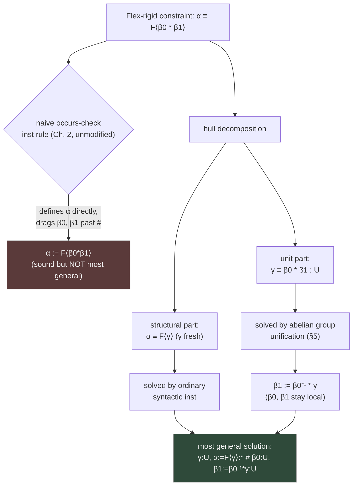
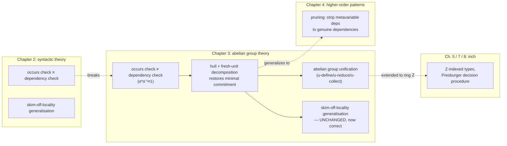

# Unification for Units of Measure

[[book-guidelines|↩ Back to guidelines]]

## 1. Why unification needs a second theory of equality

Every unification algorithm you've met so far — Robinson's, Algorithm W's, Chapter 2's contextual reconstruction of it — is built on one silent assumption: two type expressions are equal exactly when they're syntactically identical after substitution. `α * β` is only equal to `β * α` if you've already decided `*` doesn't commute, and in the *syntactic* theory it doesn't. That assumption is what makes the classic occurs-check work: if a metavariable `α` appears anywhere inside a type `τ`, then `α` is unavoidably a **dependency** of `τ` — you cannot finish solving for `τ` without first knowing what `α` is.

Units of measure break that assumption on purpose. Gundry's motivating example (after Kennedy) is a Haskell function

```
distanceTravelled t = velocity * t + (acceleration * t * t) / 2
  where { velocity = 2.0; acceleration = 3.6 }
```

whose "real" type isn't `Float -> Float` but something like `Float⟨s⟩ -> Float⟨m⟩` once you annotate `velocity :: Float⟨m·s⁻¹⟩` and `acceleration :: Float⟨m·s⁻²⟩`. Checking this requires unifying not raw types but *units*: `m * s⁻¹ * s` has to be recognized as the same unit as `m`, even though as syntax trees they don't match at all. Kennedy's solution — and the one Gundry formalizes — is to give units the equational theory of an **abelian group**, and then explain what unification and generalisation look like once "equal" no longer means "identical."

**What breaks without this.** If you unify units syntactically, you can't type-check `1/(m*s)` against `s⁻¹*m⁻¹` even though every physicist would accept them as the same unit. Worse, as we're about to see, naively bolting group-equality onto the existing occurs-check silently produces *wrong, non-principal* types rather than just failing loudly — which is the harder bug to catch.

## 2. Units of measure as an abelian group equational theory

Gundry extends the syntax of the Chapter 2 framework (contexts, statements, metasubstitutions — see [[Contextual-Problem-Solving]] if you want that background) with a second **kind**, alongside the kind `*` of types:

$$
\kappa ::= * \mid U
$$

A unit expression $\nu$ is built from atoms (metavariables or base units like $\mathrm{kg}, \mathrm{m}, \mathrm{s}$), a unit for the identity, a product, and an inverse:

$$
\nu ::= \alpha \mid b \mid 1 \mid \nu * \nu' \mid \nu^{-1}
$$

and the type language gets exactly one new constructor, a numeric type indexed by a unit: $F\langle\nu\rangle$ (think `Quantity<Meters>` in Rust terms). Contexts now carry variables of either kind, e.g.

$$
\alpha : {*},\ \beta : U,\ x : (\forall \gamma : U.\ \alpha \to F\langle \beta * \gamma\rangle)
$$

The equational theory (Figure 3.4 in the source) is exactly the axioms of an abelian group layered on top of the usual congruence/reflexivity/symmetry/transitivity rules for equality-in-context:

$$
1 * \nu \equiv \nu \qquad \nu * \nu' \equiv \nu' * \nu \qquad (\nu_0 * \nu_1) * \nu_2 \equiv \nu_0 * (\nu_1 * \nu_2) \qquad \nu * \nu^{-1} \equiv 1
$$

That's it — identity, commutativity, associativity, inverses. This is the entire "extra" equational content units bring: physically, it says units combine like exponents (multiplying quantities adds their unit-exponents, dividing subtracts them), which is exactly the additive group structure of $\mathbb{Z}$ hiding underneath a multiplicative notation.

**Rust grounding.** The clean way to represent a unit *value* in a compiler is not as a tree of `*` and `⁻¹` nodes but as its normal form: a finite map from atoms to nonzero integer exponents.

```rust
use std::collections::HashMap;

/// A unit in normal form: atom -> nonzero exponent.
/// Invariant: no entry maps to 0.
#[derive(Clone, Debug, PartialEq, Eq)]
struct Unit(HashMap<Atom, i64>);

#[derive(Clone, Debug, PartialEq, Eq, Hash)]
enum Atom {
    Meta(MetaVar),   // a unification metavariable of kind U
    Base(String),    // kg, m, s, ...
}

impl Unit {
    fn one() -> Self { Unit(HashMap::new()) }

    fn mul(&self, other: &Unit) -> Unit {
        let mut m = self.0.clone();
        for (k, v) in &other.0 {
            let e = m.entry(k.clone()).or_insert(0);
            *e += v;
            if *e == 0 { m.remove(k); }
        }
        Unit(m)
    }

    fn inv(&self) -> Unit {
        Unit(self.0.iter().map(|(k, v)| (k.clone(), -v)).collect())
    }
}
```

Two `Unit` values being group-equal is now literally `HashMap` equality after normalization — the group axioms are baked into the representation instead of being rules you apply at query time. This is the standard move for any nontrivial equational theory: don't unify syntax trees, unify canonical forms.

## 3. Loss of generalisation under nontrivial equational theories — the troublesome example

Here's where it gets interesting, and where a naive extension of Algorithm W actively goes wrong rather than merely getting stuck. Kennedy's example:

$$
\lambda x.\ \mathbf{let}\ y = \mathrm{div}\ x\ \mathbf{in}\ (y\ \mathrm{mass}, y\ \mathrm{time})
$$

with

$$
\mathrm{div} : \forall \alpha:U.\ \forall\beta:U.\ F\langle \alpha * \beta\rangle \to F\langle\alpha\rangle \to F\langle\beta\rangle, \qquad \mathrm{mass} : F\langle \mathrm{kg}\rangle,\quad \mathrm{time} : F\langle \mathrm{s}\rangle
$$

Read informally: `div` divides an `F⟨α*β⟩` by an `F⟨α⟩` to get an `F⟨β⟩` — ordinary division, but unit-tracked. `y = div x` should get a *polymorphic* type in the units, since we don't yet know what `x`'s unit is, and then `y mass` and `y time` should each instantiate that polymorphism differently.

If you bolt group-unification onto Algorithm W using the **same occurs-based generalisation rule** ("generalise exactly the metavariables that are free in the inferred type but not free in the environment"), the algorithm assigns `y` the *monotype*

$$
F\langle\alpha\rangle \to F\langle\beta * \alpha^{-1}\rangle
$$

with $\alpha, \beta$ left as un-generalised unification variables — and then fails outright, because it tries to unify $\alpha$ with both $\mathrm{kg}$ and $\mathrm{s}$ in the two uses of `y`. The *correct* principal type scheme is

$$
\forall \alpha:U.\ F\langle\alpha\rangle \to F\langle\beta * \alpha^{-1}\rangle
$$

i.e. exactly the same type, but with $\alpha$ properly quantified. This isn't a small oversight — F# itself, Kennedy's real implementation, rejects this exact program:

```
> fun x -> let y z = x / z in (y mass, y time) ;;
error FS0001: Type mismatch.
Expecting a float<kg> but given a float<s>
```

**What breaks without this:** an entire, well-typed, principal-typed program is rejected because generalisation — a purely bookkeeping step that has *nothing to do with the actual arithmetic* — silently miscounts which variables are safe to quantify.

## 4. Variable occurrence versus variable dependency

The diagnosis is precise, and it's the conceptual core of the whole chapter. In the *syntactic* equational theory (Chapter 2's world), two facts always coincide:

- **Occurrence:** $\alpha$ appears as a subterm of $\tau$.
- **Dependency:** you cannot pick a value for $\tau$ without first knowing $\alpha$.

The occurs check conflates them because in a syntactic theory they're the same fact viewed two ways. Abelian groups break the equivalence. Consider

$$
\alpha * \alpha^{-1} \equiv 1
$$

Read left to right, $\alpha$ *occurs* in $\alpha*\alpha^{-1}$. But the equation says this expression is *equal to* $1$ — an expression $\alpha$ doesn't occur in at all. So "occurs in $\tau$" is not stable under the theory's own equality, and a rule built on raw occurrence ("generalise everything not occurring in the environment") will sometimes generalise a variable that the environment *actually pins down via the equational theory* even though it isn't syntactically present, or — as in the troublesome example — fail to generalise a variable that genuinely is free, because some *other*, entangled variable's syntactic footprint hides the real dependency structure.

Gundry's technical name for the property that fails is that abelian groups do not have **regularity**: equivalent expressions need not have the same set of free variables (unlike the syntactic theory, and unlike some other theories Rémy 1992 studied). The fix therefore can't be "patch the occurs check" — it has to be a redesign of what "instantiating a flex variable" is allowed to commit to.

**Lean framing.** This is precisely the distinction Lean's elaborator has to make between *syntactic occurrence* of a metavariable in an expression and genuine *definitional* dependency once you have reducible definitions and defeq-preserving rewrites in scope — a metavariable can occur inside an expression that, after `whnf`/unfolding, doesn't actually depend on it (e.g. it cancels, or a `decide`-style rewrite eliminates it). Lean's occurs-check for metavariable assignment (`isDefEq`'s assignment path) has to be careful about exactly this for the same reason: naive occurs-checking against raw syntax is either too strict (rejects legitimate solutions) or, if relaxed carelessly, unsound.

## 5. The abelian group unification algorithm

### 5.1 Normal forms and powers of atoms

Since units are governed by group axioms, every unit expression has a canonical **normal form**: a finite product of distinct atoms (metavariables or base units), each raised to a nonzero integer power,

$$
\nu \equiv \prod_i \nu_i^{k_i}
$$

e.g. $\alpha * \alpha * \beta * 1 * \beta * \alpha$ normalizes to $\alpha^3 * \beta^2$. This normal form is exactly the `HashMap<Atom, i64>` from §2 — Gundry works with the mathematical notation, but it's the same data structure. All unification for units reduces to comparing and manipulating these exponent vectors; because inversion is available, $\nu \equiv \nu'$ is solved by solving the single normalized problem $\nu * \nu'^{-1} \equiv 1$.

Two derived operations drive the algorithm, both defined pointwise on exponents given a chosen power $k$:

$$
Q_k(\nu) = \prod_i \nu_i^{(k_i \operatorname{quot} k)} \qquad R_k(\nu) = \prod_i \nu_i^{(k_i \operatorname{rem} k)}
$$

("quotient-by-$k$" and "remainder-by-$k$" of every exponent, using truncated integer division) satisfying $\nu \equiv (Q_k(\nu))^k * R_k(\nu)$ — this is just polynomial-style division applied exponentwise. Also define $\mathrm{maxpow}(\nu)$ as the largest absolute exponent among the *metavariables* occurring in $\nu$ (constants don't count).

### 5.2 The algorithm as inference rules

The judgment form is $\Theta_0 \parallel \Upsilon \vdash \nu \equiv 1 : U \dashv \Theta_1$: starting from context $\Theta_0$ with a special suffix $\Upsilon$ (holding at most one "currently being processed" variable), solve $\nu \equiv 1$ to reach output context $\Theta_1$. The algorithm walks backward through the context one variable at a time, exactly like Chapter 2's syntactic unification, but the interesting step happens when it reaches a metavariable $\alpha$ that actually occurs in the problem, written $\alpha^k * \nu \equiv 1$ (where $\alpha$ is guaranteed not to occur in $\nu$ itself). There are four cases, corresponding to four rules:

**Case 1 — $k$ divides every exponent in $\nu$.** Then $\nu \equiv \nu_0^k$ for some $\nu_0$, and you can just define $\alpha$ outright:

$$
\dfrac{k \neq 0}{\Theta,\ \alpha:U \parallel \Upsilon \vdash \alpha^k * \nu \equiv 1 : U \dashv \Theta,\Upsilon,\ \alpha := \nu_0^{-1} : U} \quad \textbf{(u-define)}
$$

Check: $\alpha^k * \nu \equiv (\nu_0^{-1})^k * \nu_0^k \equiv 1$. This is the ordinary "solve for a variable" step, generalized to division instead of plain substitution — e.g. $\alpha^2 \equiv \mathrm{kg}^2$ solves to $\alpha := \mathrm{kg}$ (or $\mathrm{kg}^{-1}$, but the algorithm picks one).

**Case 2 — $|k| \le \mathrm{maxpow}(\nu)$ but case 1 fails** (some exponent isn't a multiple of $k$). You can't solve outright, but you *can* shrink the problem using the division identity: generate a fresh variable $\beta$ and define $\alpha := \beta * Q_k(\nu)^{-1}$, reducing the goal to the strictly smaller problem $\beta^k * R_k(\nu) \equiv 1$:

$$
\dfrac{|k| \le \mathrm{maxpow}(\nu) \qquad \beta\text{ fresh} \qquad \Theta_0,\Upsilon \parallel \beta:U \vdash \beta^k * R_k(\nu) \equiv 1 : U \dashv \Theta_1}{\Theta_0,\ \alpha:U \parallel \Upsilon \vdash \alpha^k * \nu \equiv 1 : U \dashv \Theta_1,\ \alpha := \beta * Q_k(\nu)^{-1} : U} \quad \textbf{(u-reduce)}
$$

This is a Euclidean-algorithm step in disguise: it's exactly how you'd solve $3x + 2y = 0$ over the integers by taking a remainder, and indeed the source's own worked example computes an lcm this way (below).

**Case 3 — $|k| > \mathrm{maxpow}(\nu)$.** Neither of the above applies, but $\alpha$ still isn't the variable with the largest exponent overall — so there's nothing productive to do with $\alpha$ yet. Move it further back in the context (make it *more* local, i.e. process it later) and continue with whatever variable does have the largest power:

$$
\dfrac{|k| > \mathrm{maxpow}(\nu) \qquad \Theta_0 \parallel \alpha:U \vdash \alpha^k * \nu \equiv 1 : U \dashv \Theta_1}{\Theta_0,\ \alpha:U \parallel \cdot \vdash \alpha^k * \nu \equiv 1 : U \dashv \Theta_1} \quad \textbf{(u-collect)}
$$

**Case 4 — $\nu$ has no variables at all** and $k$ doesn't divide the constant exponents. No rule applies — this is a genuine failure, e.g. $\alpha^2 * \mathrm{kg} \equiv 1$, or $\mathrm{kg}*\mathrm{s}\equiv 1$ (two distinct base units can never be equal).

### 5.3 Worked example

The source's own example: solve $\alpha^3 * \beta^2 \equiv 1$ in context $\alpha:U,\beta:U$.

1. $\beta$ has the largest exponent-magnitude ($2 < 3$, so actually $\alpha$ does — reading right to left, the algorithm processes $\beta$ first since it's more recent in the context). $2 \nmid 3$ so u-define fails for whichever is examined against the other's power; take $k=3$ for $\alpha$: $3 \nmid 2$ (the exponent of $\beta$), so case 1 fails.
2. Since $|3| \le \mathrm{maxpow}(\beta^2) = 2$... actually the algorithm picks $\beta$ (exponent 2) against $\mathrm{maxpow} = 3$ from $\alpha$: $2 \le 3$, so u-reduce fires on $\beta$ — introduce fresh $\gamma$, and $\beta := \gamma * \alpha^{-1}$ (this is $Q_2(\alpha^3) = \alpha^1$, so $Q_2(\alpha^3)^{-1} = \alpha^{-1}$), reducing to $\gamma^2 * R_2(\alpha^3) \equiv 1$, i.e. $\gamma^2 * \alpha \equiv 1$.
3. Now $\alpha$ has exponent 1, dividing evenly, so u-define fires: $\alpha := \gamma^{-2}$.

Final solution: $\gamma:U,\ \alpha := \gamma^{-2}:U,\ \beta := \gamma * \alpha^{-1}:U$. Check: $\alpha^3 * \beta^2 \equiv (\gamma^{-2})^3 * (\gamma * \gamma^2)^2 \equiv \gamma^{-6} * \gamma^6 \equiv 1$. ✓. Notice the algorithm has silently computed $\mathrm{lcm}(2,3) = 6$ along the way — the abelian-group unifier *is*, structurally, an extended-Euclidean-algorithm-style lcm/gcd computation threaded through a dependency-ordered context.

```rust
// The essence of u-define / u-reduce / u-collect as executable code.
// `problem`: exponent of the atom currently being eliminated plus the
// remaining unit (as a normal-form map); returns a substitution step.
fn solve_step(k: i64, rest: &Unit, maxpow: i64) -> Step {
    if rest.0.values().all(|ki| ki % k == 0) {
        // Case 1: u-define — exact division, solve outright.
        Step::Define(rest.pow_each(|ki| ki / k).inv())
    } else if k.abs() <= maxpow {
        // Case 2: u-reduce — Euclidean-style remainder step.
        let fresh = MetaVar::fresh();
        Step::ReduceVia { fresh, quotient: rest.pow_each(|ki| ki.div_euclid(k)) }
    } else {
        // Case 3: u-collect — not yet reducible, defer.
        Step::Postpone
    }
}
```

**Soundness and generality (Lemma 3.2)** and **completeness (Lemma 3.3)** are proved the same way as in Chapter 2 — the isomorphism lemma shows each rule preserves solutions and only ever adds *minimal* information, and a termination metric (the algorithm strictly shrinks $\mathrm{maxpow}$ or the size of the context on every recursive call) shows it always halts, succeeding exactly on the solvable cases identified above.

## 6. Hulls and type skeletons for flex-rigid decomposition

Group unification alone isn't the hard part — the hard part is *where the algorithm is invoked from*, i.e. how ordinary type unification decides to hand a subproblem to it. Suppose we're solving the flex-rigid constraint

$$
\alpha \equiv F\langle \beta_0 * \beta_1\rangle
$$

in the context $\alpha:{*}\ \#\ \beta_0:U,\ \beta_1:U$ (the `#` marks a locality boundary — everything after it is "more local," roughly "introduced in a narrower scope," borrowing Chapter 2's device for tracking generalisation rank).

The naive move — inherited unmodified from Chapter 2's syntactic `inst` rule — is: since $\alpha$ doesn't occur in the right-hand side, just move $\beta_0,\beta_1$ back past the locality marker and define $\alpha := F\langle\beta_0 * \beta_1\rangle$. This *works*, but it's needlessly committal: it drags $\beta_0,\beta_1$ out of their local scope, when a strictly more general solution exists that leaves them local:

$$
\gamma:U,\ \alpha := F\langle\gamma\rangle : {*}\ \#\ \beta_0:U,\ \beta_1 := \beta_0^{-1}*\gamma : U
$$

Here only a *fresh* variable $\gamma$ crosses the locality boundary, and $\beta_0,\beta_1$ stay put. Both solutions are valid (they agree after substitution), but the second one is more general because it commits less — it's a strictly smaller information increase in the sense of Chapter 2's ordering on contexts.

**The fix — decompose before you commit.** A rigid type $\tau$ splits into two independent pieces:

- its **hull** (Gundry also calls this the *type skeleton*): $\tau$ with every unit subterm replaced by a hole, e.g. $F\langle\nu_0\rangle \to F\langle\nu_1\rangle$ has hull $F\langle\_\rangle \to F\langle\_\rangle$;
- a batch of **fresh unit constraints**, one per hole, connecting a brand-new metavariable to the unit that was actually there.

So $\alpha \equiv F\langle\beta_0*\beta_1\rangle$ decomposes into two independent constraints:

$$
\alpha \equiv F\langle\gamma\rangle : {*} \qquad \wedge \qquad \gamma \equiv \beta_0 * \beta_1 : U
$$

Solving the first (purely structural, no equational theory involved) commits $\alpha$ to the hull and introduces $\gamma$; solving the second is now a call into the group unifier from §5, which is perfectly happy to leave $\beta_0, \beta_1$ local and define $\gamma$'s dependency the general way. The revised `inst` rule (schematically):

$$
\dfrac{\tau\text{ non-variable} \qquad \beta_i\text{ fresh} \qquad \Theta_0 \mid \beta_i{:}U \vdash \alpha \equiv \tau\{\beta_i\} : {*} \dashv \Theta_1 \qquad \Theta_1 \vdash \beta_i \equiv \nu_i : U \dashv \Theta_2}{\Theta_0 \vdash \alpha \equiv \tau\{\nu_i\} : {*} \dashv \Theta_2}\ \textbf{(inst)}
$$

captures exactly this two-phase commitment: structural hull-matching first, group-theoretic unit-solving second, threaded through the context so later constraints see the earlier ones' output. The revised **input conditions** (Definition 3.1) formalize the invariant this maintains — crucially, the new fourth clause: *if $F\langle\nu\rangle$ is a subterm of $\tau$, then $\nu$ must be exactly a fresh variable* $\beta$. This is the condition that guarantees every unit metavariable the instantiation step depends on is a *genuine* dependency, restoring the occurrence/dependency equivalence exactly at the boundary where it matters, by construction rather than by inspection.



**Lean framing.** This is the same discipline Lean's unifier applies when assigning a metavariable to a rigid head: it doesn't just check "does the metavariable occur syntactically," it computes the actual dependency telescope, and — for metavariables with a nontrivial local context — performs something structurally analogous to pruning/hull-matching (see also Chapter 4's `inst`-style *pruning* for higher-order patterns, which generalizes exactly this idea: strip a metavariable's dependence down to only what a rigid term genuinely needs).

## 7. Generalisers and recovering polymorphism

Gundry contrasts his approach with the one actually taken by Kennedy (1996a) and Rittri (1995): compute a **generaliser**, "a substitution that reveals the polymorphism available under a given type environment." [[The-Evidence-Language#The idea|The idea]] is to run ordinary (occurs-based) inference to completion, get a possibly non-principal monotype full of tangled unification variables, and then apply a *post-hoc* corrective substitution that rearranges the group variables so the standard "skim off the locality" generalisation rule can be applied after the fact. Gundry notes this is "specific to the equational theory and technically nontrivial" — and, tellingly, it isn't implemented in F# at all, which is precisely why Kennedy's own example is rejected by the real compiler.

The hull/skeleton decomposition of §6 is Gundry's alternative: instead of computing a generaliser to *repair* generality lost during solving, restructure the solving step itself so that generality is *never lost in the first place*. This is a recurring theme in the "contextual problem-solving" methodology of the whole thesis — minimality of each individual step is what buys you a most-general result globally, without needing a separate global repair pass. Once this discipline is in place, **type inference itself needs no new machinery**: Section 3.3 confirms that the ordinary "skim generalisable variables off the end of the locality" rule from Chapter 2, applied unchanged, now correctly infers

$$
y : \forall \beta_0:U.\ F\langle\beta_0\rangle \to F\langle\gamma * \beta_0^{-1}\rangle
$$

for Kennedy's troublesome example — the *correct* principal scheme, recovered as a byproduct of solving constraints properly rather than by a bespoke fixup.

## 8. Presburger arithmetic as a decidable numeric constraint theory

This subtopic looks a chapter ahead — Gundry returns to numeric constraint solving in Chapter 5 (design of `inch`, pp. ~102) and Chapter 8 (the `inch` prototype, pp. 173–194) — but it belongs conceptually with this material, because it answers the natural follow-up question: *the abelian-group unifier gives you unique most-general solutions for multiplicative unit expressions — what about the numeric side-conditions that show up once you generalize units to type-level integers (as in Chapter 7/8's `Quantity` library)?*

Once you move from "units form a free abelian group" to "indices are elements of $\mathbb{Z}$ with addition, and possibly inequalities," the constraint language you need to decide is exactly **Presburger arithmetic**: first-order arithmetic over the integers with addition and order, but *without* general multiplication. Gundry is explicit that this is the right stopping point: "with just addition (and perhaps subtraction) one can express multiplication by constants and many useful linear properties, while remaining within the theory of Presburger arithmetic. This theory is decidable (Presburger, 1930)... so complete constraint solving is feasible." The `inch` prototype's constraint solver is described as "based on the abelian group unification algorithm in Chapter 3, extended to the ring $\mathbb{Z}$. Any remaining purely numeric constraints are checked using a decision procedure for Presburger arithmetic (Diatchki, 2011)."

So the architecture is layered exactly the way you'd hope, and exactly the way a Rust-based refinement-type/CSP compiler would want to structure its own numeric backend:

1. **Linear equational reasoning** (this chapter's abelian-group unifier, generalized from a multiplicative group of units to the additive group $\mathbb{Z}$) handles unification-shaped constraints with unique most general solutions — cheap, deterministic, and complete for its fragment.
2. **Presburger decision procedure** is the fallback for constraints that survive unification but are still "just" linear arithmetic with quantifiers/order — decidable in the worst case doubly-exponential, but the fragment programmers actually write is almost always tractable in practice.
3. Genuinely **nonlinear** constraints (general multiplication, exponentiation — as in Diatchki's `TypeNats`) fall outside both layers and need either restriction, postponement, or user-supplied proofs (Xi's ATS approach, cited in the same discussion).

This is directly the shape of the constraint pipeline a refinement-type checker with an embedded CSP/SMT kernel needs: don't send everything to a general solver — peel off the fragment with unique principal solutions first (unification), then the fragment that's merely decidable (Presburger/linear arithmetic), and reserve full nonlinear constraint search for what's left.

**Rust/CSP grounding.** In a compiler pipeline this maps to a triage function:

```rust
enum Constraint { UnitEq(Unit, Unit), LinearArith(PresburgerFormula), Nonlinear(Expr) }

fn dispatch(c: Constraint) -> SolveResult {
    match c {
        Constraint::UnitEq(u, v)      => unify_abelian_group(u, v),        // §5: complete, unique mgu
        Constraint::LinearArith(phi)  => presburger_decide(phi),            // decidable, may be slow
        Constraint::Nonlinear(e)      => csp_search_or_postpone(e),         // needs domain propagation / proof obligations
    }
}
```

— exactly the tiered design named in the workbench's standing project (a CSP kernel handling integer/non-linear constraints alongside a decidable linear layer).

## 9. Synthesis — where this fits and where it leads



The load-bearing idea of this chapter, for the compiler you're building, is that **an equational theory changes what "occurs" and "depends on" mean, and unification has to be redesigned around genuine dependency, not syntactic footprint** — the exact same lesson resurfaces, in a much harder form, in Chapter 4's [[Miller-Pattern-Unification|Miller pattern unification]] (pruning a metavariable's telescope down to what a rigid term genuinely needs is the higher-order generalization of this chapter's hull decomposition), and again in any refinement-type elaborator that mixes unification with a background decision procedure: you always want to ask "is this variable a *real* dependency under the theory," never just "does it appear in the string."

Concretely, for the standing project:

- **`type-theory` / `automated-reasoning`:** this chapter is the smallest possible case study in what happens when a *unifier* has to reason modulo a nontrivial equational theory rather than free syntax — precisely the situation your elaborator's metavariable unifier will face the moment it needs to unify under `let`-bound or reducible definitions, or under any domain-specific theory (arithmetic, bitvectors) you bake into the type system. The hull/skeleton technique — decompose a rigid term into "the part that must match exactly" and "the part that goes to a theory-specific decision procedure" — is a general pattern for *combining* a syntactic unifier with a theory-specific one, which is exactly the Nelson–Oppen-flavored problem an SMT-backed elaborator has to solve.
- **`sat-smt-csp`:** §8's layering (unification → Presburger → general nonlinear CSP) is a direct blueprint for the constraint-dispatch architecture named in the standing project: cheap complete solvers first, decidable-but-expensive procedures next, full search last.

**[[Contextual-Problem-Solving#Where this leads|Where this leads]].** Chapter 4 takes the "occurrence isn't dependency" lesson to its hardest form — higher-order pattern unification, where pruning and pattern-matching under binders require exactly this kind of dependency discipline, but now the equational theory is $\beta\eta$-conversion instead of an abelian group, and unification is only *partially* complete instead of fully decidable.
