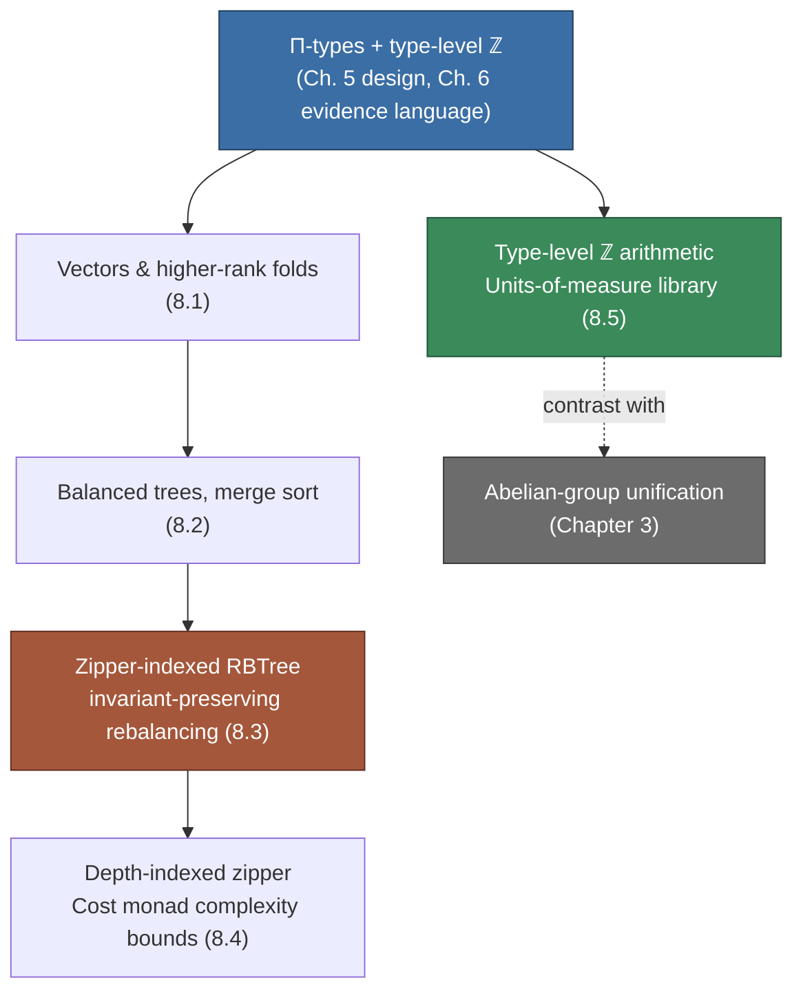

# Verified Programming with Dependent Types

[[book-guidelines|↩ Back to guidelines]]

## Why this chapter exists

Chapters 2–7 of the thesis build machinery: a contextual account of unification, a
pattern-unification algorithm for dependent types, an evidence language, and an
elaborator that turns `inch` source into evidence terms. None of that machinery is
worth anything if it can't survive contact with programs a working Haskeller
actually wants to write. Chapter 8 is Gundry's proof of usability — five case
studies of increasing structural difficulty (vectors, balanced trees, self-balancing
search trees, cost-annotated computation, physical units) that stress-test three
specific features the earlier chapters fought hard to deliver: genuine $\Pi$-types
(dependent function spaces where the argument is available both statically, for
the type checker, and dynamically, at runtime), integers as a first-class
type-level kind, and higher-rank polymorphism.

What breaks without these? Every one of these five programs has a well-known
"GADT + type families + singletons" encoding in ordinary GHC Haskell. Gundry's
point is not that those encodings are impossible — it's that they're miserable:
singleton values must be threaded everywhere a $\Pi$-type argument would suffice,
type families can't express something as simple as "abstract over the tail length
in a fold" without auxiliary newtypes, and invariant-preserving rebalancing
without a native way to talk about "the type of a hole in this indexed type"
forces you to either weaken your invariants or write proof terms by hand. `inch`
is the thesis's argument, made concrete, that a language with real dependent
types makes all of this natural.

A caveat carried through the whole chapter: the examples are checked against a
prototype preprocessor, not the full evidence-language design of Chapters 6–7.
The prototype keeps terms, types, and kinds separate (no promoted user
datatypes, no kind polymorphism), only supports integers as shared expressions,
and quantifies $\forall$ always implicitly and $\Pi$ always explicitly. So some of
the friction you'll see below (the `newtype Plus` workaround, the fixed-basis
units library) is an artifact of the prototype, not of the underlying theory —
Gundry is careful to flag exactly which limitations are load-bearing and which
are implementation debt.

---

## 1. Length-indexed vectors and fold-based recursion

### The motivating shape

The running example from the introduction (Chapter 1) is:

$$
\texttt{replicate} :: \forall a. \Pi\,(n :: \mathbb{N}) \to a \to \mathsf{Vec}\ a\ n
$$

Vectors are lists whose *length* is baked into the type as an index:

```haskell
data Vec :: * -> N -> * where
  Nil  :: Vec a 0
  Cons :: forall a (n :: N). a -> Vec a n -> Vec a (n + 1)
```

`head` and `tail` become total functions once their types demand a
non-empty vector (`Vec a (n + 1)`); there is no `Maybe` or partiality escape
hatch because the type of `Nil` simply doesn't unify with `n + 1`. `append`'s
type, `Vec a m -> Vec a n -> Vec a (m + n)`, documents the length-preservation
invariant directly in the signature rather than in a comment or a test.

**What's actually load-bearing here for the elaborator you're building**: this
is $\Pi$-types and inductive families doing exactly the job the thesis's Focus
Area on `type-theory` cares about — an indexed type whose *index* is
term-level data, checked by ordinary type inference machinery rather than a
separate "proof obligation" phase. The `reverse` helper needs a proof that
$(m+1)+n \sim m+(n+1)$ — an instance of associativity — which the constraint
solver from Chapters 2–3 discharges automatically because `+` on natural
numbers is defined structurally and the equational reasoning is decidable.
This is definitional equality doing real work silently: no `rewrite` tactic,
no explicit `cong`, just unification noticing the two type-level expressions
normalize to the same thing.

The `lookup` function is the clearest $\Pi$-type example in the chapter:

```haskell
lookup :: forall (n :: N) a. Pi (m :: N) . m < n => Vec a n -> a
lookup {0}     (Cons x _)  = x
lookup {k + 1} (Cons _ xs) = lookup {k} xs
```

The index `m` must be supplied *at runtime* (it's an actual integer used to
walk the vector) but the type checker statically knows `m < n`, so an
out-of-bounds lookup is a compile error, not a runtime exception. Braces
(`{x}`) mark terms in the "shared fragment" — expressions that occur in both
term and type position, per the phase distinction from Chapter 6.

### Higher-rank folds

```haskell
foldVec :: forall (f :: N -> *) a (n :: N).
              f 0 -> (forall (m :: N). a -> f m -> f (m + 1)) -> Vec a n -> f n
```

This is rank-2: the `Cons` case must be polymorphic in `m`, the length of the
tail it's about to receive, because that length isn't known until the fold
descends further. Without higher-rank types you cannot write this signature
at all — you'd need to monomorphize `m` to a specific value, which defeats
the point of a fold over an arbitrarily-indexed structure.

**A real limitation, honestly reported**: the obvious `append` via
`foldVec ys Cons xs` does *not* type-check, because `Cons` needs its second
argument's length to vary as the fold progresses, and `inch`'s prototype has
no type-level $\lambda$-abstraction to build the right motive `f`. The
workaround is a `newtype Plus a m n = Plus { unPlus :: a (m + n) }` used
purely to encode a partially-applied type function — this is a direct,
hands-on illustration of *why* full-spectrum dependent type theories need
$\lambda$ at the type level (the "defunctionalization" trick Haskell
programmers use with type families is exactly this same workaround, in
disguise).

**Rust grounding.** Rust's const generics get you part of the way (`[T; N]`
arrays with length-preserving APIs), but Rust has no dependent function space
where a runtime value simultaneously indexes a type — you'd simulate the
`lookup` example with a runtime bounds check plus a fallible `Option`, which
is precisely the "term inference vs. type inference" gap the thesis's
introduction (Chapter 1) opens with. The closest structural analogue to
`foldVec`'s rank-2 fold is a trait with a generic method:

```rust
trait VecFold<A> {
    type Out<const N: usize>;
    fn nil(&self) -> Self::Out<0>;
    fn cons<const M: usize>(&self, x: &A, tail: Self::Out<M>) -> Self::Out<{ M + 1 }>;
}
```

but generic associated types indexed by `const` arithmetic are still fragile
in stable Rust (`M + 1` in a type position requires the unstable
`generic_const_exprs`), which is a live version of exactly the "type-level
arithmetic needs its own decision procedure" problem Gundry solves with
Presburger arithmetic in Chapter 3's abelian-group unifier.

**Lean grounding.** This is the cleanest correspondence in the whole chapter.
Lean's `Vector α n` (or a hand-rolled inductive family) is definitionally
`Vec` with `Cons`/`Nil` renamed, and Lean's kernel discharges the
`(m+1)+n = m+(n+1)` obligation the same way `inch`'s solver does — by
`rfl`/`Nat.add` unfolding, since `Nat.add` is defined by recursion on its
second argument and the equation is literally definitional once both sides
normalize. Where `inch` needs an explicit call into the abelian-group/
Presburger solver, Lean's `simp [Nat.add_assoc]` or `omega` tactic is doing
the same constraint-solving job your compiler's unifier will eventually need
for refinement types with linear-arithmetic side conditions.

---

## 2. Balanced trees and merge sort via higher-rank folds

Gundry's merge sort (following Altenkirch et al.'s Epigram version) is the
chapter's demonstration that indexed types can carry *two* invariants at
once — size and order — for free.

```haskell
data Tree :: * -> N -> * where
  Empty :: Tree a 0
  Leaf  :: a -> Tree a 1
  Even  :: forall a (n :: N). 1 <= n => Tree a n -> Tree a n -> Tree a (2*n)
  Odd   :: forall a (n :: N). 1 <= n => Tree a (n+1) -> Tree a n -> Tree a (2*n+1)
```

The `Even`/`Odd` split *is* the balance invariant: a tree of size $n$ can only
be built from two subtrees whose sizes differ by at most one, and the
constructor indices enforce this structurally — there is no way to construct
an `Even` node whose children have mismatched sizes, because the type
`Tree a n -> Tree a n -> Tree a (2*n)` simply doesn't admit it. This is a much
stronger guarantee than a runtime `assert(balanced?)`: it is a *typing*
guarantee, checked once at compile time, that no function anywhere in the
program can accidentally build an unbalanced `Tree`.

The tree-fold mirrors `foldVec`'s rank-2 shape:

```haskell
foldTree :: forall (f :: N -> *) a (n :: N).
   f 0 -> (a -> f 1) -> (forall (m n :: N). f m -> f n -> f (m + n)) -> Tree a n -> f n
```

`mkTree = foldVec Empty insert` builds a balanced tree from a vector by
folding `insert`, which threads the balance invariant through each insertion
(`Even l r` becomes `Odd (insert i l) r`, alternating which side grows).
Ordered vectors, `OVec l u n`, carry lower/upper numeric bounds as additional
indices; `merge` combines two ordered vectors using *guards that introduce
local constraints* (`| {x <= y}`), a syntax that lets a pattern-match branch
also refine what the type checker knows about the compared values in that
branch — a lightweight form of the "dependent case analysis" and "learning
by testing" idea from Chapter 5's `inch` design. `flatten` (fold a tree into
an ordered vector, merging as it goes) and `sort = flatten . mkTree` compose
these pieces into: **the type of `sort` — `Vec (In l u) m -> OVec l u m` —
is itself the length-preservation and sortedness proof.** No separate
correctness lemma is stated or needed; it's read off the signature.

Gundry is explicit about the honest scope here: this shows *partial*
correctness (length preservation + sortedness of the *result*), not that the
output is a *permutation* of the input, and not termination (Haskell's type
system doesn't check totality). That's a genuinely useful calibration for
what "verified" means in this kind of lightweight dependently-typed
programming — a strong static guarantee about shape and order, stacked with
zero cost onto ordinary pattern matching, rather than a full functional
correctness proof of the kind you'd write in Lean's tactic mode.

**Rust grounding.** The balance invariant maps naturally onto a "typestate"
style enum where a phantom marker tracks structural shape, but Rust has no
type-level naturals with the `2*n`/`2*n+1` case split baked into a GADT
constructor — you would need `enum Tree<const N: usize>` variants gated by
`where` clauses on const generics, which stable Rust doesn't support for
arithmetic predicates like this. This is a case where "say so rather than
forcing a strained analogy" applies: the honest Rust story is that you'd
enforce balance with a smart constructor and a runtime debug-assertion, not a
static guarantee — precisely the gap `inch`'s $\Pi$-types close.

**Lean grounding.** `Tree`'s `Even`/`Odd` split is structurally identical to
an indexed inductive family in Lean with the same two size-dependent
constructors; Lean's dependent pattern matching (`match` compiling to
recursors) plays the role of `foldTree`, and the `1 <= n` side condition is
an ordinary `Nat.le` hypothesis carried in the constructor, exactly as
Lean would express it. This is a good worked example for your compiler's
refinement-type surface language: `Tree`'s indices are doing the job a
refinement type `{t : Tree a | balanced t}` would do via a separate
predicate, but here the balance predicate is *compiled into the inductive
structure itself* rather than checked post hoc — a design choice (invariant
in the index vs. invariant as a separate refinement) your compiler will have
to make explicitly for each data structure it supports.

---

## 3. Left-leaning red-black trees and zipper-based rebalancing

### What breaks without the zipper

This is the chapter's hardest example and its central methodological point.
Ordinary red-black tree implementations (functional or imperative) build an
unbalanced tree first, then rebalance — but if your type system enforces the
red-black invariants (no red node has a red child; both children of an
internal node have equal black height), you *cannot represent* the
intermediate, temporarily-invalid trees that this two-phase strategy
produces. Prior attempts (Xi in ATS) worked around this by indexing trees by
their *number* of colour violations and requiring zero violations only at the
end — a weaker invariant, tracked as a separate counter.

Gundry (following McBride and McKinna) instead represents *the path from the
root down to the point of insertion* as a **zipper** (`TreeZip`), a
Huet-style one-hole context. The insight: you never actually need to
represent a malformed tree, because a rebalancing step only ever needs (a) a
locally-invalid node and (b) *the typed context that would produce a valid
tree if you plugged a valid replacement in*. The zipper's type tracks exactly
that context, so the invariant is never actually violated anywhere in memory
— rebalancing is a sequence of well-typed replacements of the "current
subtree" as you walk back up a well-typed path.

```haskell
data RBTree :: Z -> Z -> Z -> N -> * where
  E  :: forall (i j :: Z). i < j => RBTree i j Black 0
  TR :: forall (i j :: Z) (n :: N). Pi (x :: Z) .
          RBTree i x Black n -> RBTree x j Black n -> RBTree i j Red n
  TB :: forall (i j c :: Z) (n :: N). Pi (x :: Z) .
          RBTree i x c n -> RBTree x j Black n -> RBTree i j Black (n + 1)
```

Four indices: lower bound, upper bound (search-tree ordering), colour, and
black height (the balance invariant). Every constructor bakes in its slice of
the red-black laws: `TR`'s result type fixes both children to `Black`
(no red-red violations by construction), and `TB` bumps the black-height
index by exactly one on the way up. The `Π`-quantified key `x` is the clean
payoff of a *real* dependent function space: the key is available to index
the subtrees' bounds *and* to be pattern-matched against at runtime, with no
singleton wrapper needed.

```haskell
data TreeZip :: Z -> Z -> N ->         -- root indices
                Z -> Z -> Z -> N ->    -- hole indices
                * where
  Root :: ... TreeZip i j n i j Black n
  ZRL  :: ... -- hole is the left child of a red node, etc.
  ZBL  :: ... -- hole is the left child of a black node
  ZBR  :: ... -- hole is the right child of a black node
```

`TreeZip`'s indices are doubled: one copy for what the *root* of the whole
tree looks like, one copy for what the *hole* (the current focus) must look
like. `plug` reassembles a full tree from a zipper and a replacement subtree,
and it type-checks precisely because the zipper's hole-indices were
constructed to match `RBTree`'s own indexing discipline — Gundry notes this
correspondence between a data type and its "one-hole context" type can even
be derived mechanically (à la McBride's differentiation-of-datatypes result).

### Search, insertion, deletion

`search` builds up a `TreeZip` by descending and comparing keys, producing
either `Found z t` (the zipper to this point, plus the subtree rooted here)
or `Missing z`. `insertRBT` calls `search`, and on a miss, hands an
`InsProb` — either `Level` (a replacement subtree of the right black height,
but possibly the wrong colour) or a `Panic{RB,BR}` (a red-red violation that
must be fixed *before* moving further up) — to the `ins` function, which
walks back up the zipper one layer at a time, re-establishing invariants at
each step exactly the way a hand-written rebalancing routine would, except
every intermediate state is a well-typed value.

Deletion (`del`/`delFocus`/`findMin`) is structurally harder — it must
"shrink" a subtree's black height by one and repair the deficit on the way
up — and Gundry is candid that this definition is "much easier to write than
to read": he prototyped it interactively in Agda (letting the `Agsy` proof
search tool fill in cases automatically) before transcribing the result to
`inch`. This is worth sitting with: the interactive, incremental
construction process (fill a hole, let the types narrow the remaining cases,
repeat) is qualitatively different from writing the whole function in batch
mode and hoping it compiles — a strong argument, if you're building your own
elaborator, for surfacing partial-program / hole-based interaction as a
first-class feature rather than an afterthought.

### Why this is the load-bearing example for your compiler project

This section is the most direct rehearsal, in the whole chapter, of what your
Rust verifier will eventually need to do: **represent a traversal position in
an indexed structure such that every intermediate state remains
well-typed, rather than "type-check the invariant, then hope the imperative
mutation preserves it."** The zipper is doing for tree-rebalancing exactly
what a well-scoped, dependency-ordered context (Chapter 2's $\Theta$) does for
elaboration: it's a structured representation of "what's fixed above me" that
lets local operations be checked without re-verifying the whole surrounding
structure. If your compiler ever needs to represent, say, an in-progress
tree-shaped constraint store being rewritten bottom-up by a solver, this
zipper-with-typed-holes pattern is the mechanism to reach for.

**Rust grounding.** The closest idiomatic Rust structure to a zipper is an
explicit *path stack* — `Vec<Frame>` recording, for each ancestor, which
child you descended into and the sibling subtree — used pervasively in
arena-based tree implementations to avoid parent pointers and borrow-checker
fights. The type-level guarantee Gundry gets for free (the frame's type
matches exactly what plugging back in requires) has no static Rust
counterpart without const-generic predicates; in practice a Rust
implementation would carry the same invariants as run-time-checked
`debug_assert!`s, which is the honest cost of the "fixed basis, weaker
guarantees" tradeoff this vault's learning goals keep surfacing wherever a
dependently-typed idiom meets Rust's current type system.

**Lean grounding.** Structurally, `TreeZip` is a derivative-of-a-datatype in
McBride's sense, and Lean programmers building verified balanced-tree
implementations (e.g. in `Std.Data` or teaching materials) use exactly the
same shape — a `Context`/zipper GADT with matching indices, and a `plug`-like
function proved to invert `unzip`. This is a genuinely good model for how
your elaborator might represent *partial elaboration progress* itself: Chapter
2's "zipper-style representation of partial elaboration progress" and this
`TreeZip` are the same construction applied to two different indexed
families (System F terms under construction vs. red-black trees under
repair) — recognizing that isomorphism is exactly the kind of "mechanism, not
just theory" transfer this vault's learning goals ask for.

---

## 4. Static tracking of computational time complexity

This subtopic switches from *structural* invariants (shape, order, colour) to
a *quantitative* one: an upper bound on the number of computation steps a
function takes, tracked in the type. It's adapted from Danielsson's `Thunk`
library (Agda), reimplemented with `inch`'s inequality constraints giving a
more flexible interface than the original.

```haskell
newtype Cost (n :: N) a = Hide { force :: a }

return :: a -> Cost 0 a
bind   :: forall (m n :: N) a b. Cost m a -> (a -> Cost n b) -> Cost (m + n) b
wait   :: forall (m n :: N) a. m <= n => Cost m a -> Cost n a
tick   :: forall (n :: N) a. Cost n a -> Cost (n + 1) a
```

`Cost n a` is a monad indexed by the *monoid* $(\mathbb{N}, +)$: sequencing
two computations (`bind`) adds their step counts, mirroring how sequential
composition composes costs in an amortized-analysis argument. `wait` is
subtyping-by-weakening — if something takes $m$ steps it trivially "takes at
most $n$" for any $n \geq m$ — implemented as the identity function at
runtime, since $\mathsf{Cost}$ is a zero-cost newtype (a `newtype` with a
purely phantom index, so `Hide`/`force` erase completely; this is the same
"runtime erasure of static information" mechanism as [[The-Evidence-Language|the evidence language]]'s
phase distinction in Chapter 6, applied here as a library-level discipline
rather than a compiler guarantee). `tick` is the one primitive the user must
remember to call at every step being counted — an unenforced discipline (the
type system can't currently *force* every line of a definition to call
`tick`), which Gundry flags candidly as a limitation of the methodology, not
just of the prototype.

Reworking red-black `search` with a depth-indexed zipper (`TreeZip0`, adding
an extra `N` index purely to state the complexity invariant) yields:

```haskell
searchCost :: ... RBTree i0 j0 Black n0 -> Cost (2*n0 + 2) (SearchResult0 x i0 j0 n0)
memberCost :: ... RBTree i j Black n -> Cost (2*n + 4) Bool
```

— a *type-checked proof* that membership testing is $O(n)$ in the tree's
black height (equivalently $O(\log |T|)$ in the number of elements, since
black height is logarithmic in size for a balanced tree), with the linear
arithmetic obligations along the way ($1 + 2n + d \le 2n_0$, etc.) discharged
automatically by the same constraint solver used for the ordering/balance
invariants elsewhere in the chapter. Insertion and deletion get analogous
bounds, `Cost (4*n+6) (RBT i j)` and `Cost (5*n+6) (RBT i j)`.

**Why this belongs in your verification project specifically.** This is a
Hoare-logic-shaped guarantee wearing a type-theory costume: the "precondition"
is the input tree's black height $n$, the "postcondition" is a numeric bound
on step count, and the proof obligation discharged at each `tick` call is
structurally identical to accumulating a resource-usage invariant in a
weakest-precondition calculus. If your compiler's contract language is meant
to express complexity bounds (or more generally resource bounds — allocation,
recursion depth), `Cost n a` is a minimal, concrete existence proof that
*indexed monads* are enough machinery to do it, without a dedicated
"cost-aware type system" — you get the guarantee compositionally, for free,
from ordinary indexed-monad `bind`/`return` laws plus a numeric-inequality
constraint solver.

**Rust grounding.** A phantom-typed cost wrapper is directly expressible:

```rust
struct Cost<const N: usize, A>(A);
fn ret<A>(a: A) -> Cost<0, A> { Cost(a) }
// bind needs const-generic addition in the return type — still unstable
fn bind<const M: usize, const N: usize, A, B>(
    c: Cost<M, A>, f: impl FnOnce(A) -> Cost<N, B>
) -> Cost<{ M + N }, B> { Cost(f(c.0).0) }
```

This compiles today only on nightly Rust (`generic_const_exprs`), which is
itself informative: Rust's const-generics story is presently at roughly the
same maturity `inch` was at in 2013 for *this specific pattern*
(type-level-integer arithmetic used purely for a phantom bookkeeping index) —
a good calibration point for how much type-level arithmetic support your own
compiler needs to prioritize early.

**Lean grounding.** This maps cleanly onto an indexed monad in Lean (or a
`WriterT` with a `Nat`-valued, monoid-under-addition log), and `tick`'s
obligation-discharge is exactly what `omega` or `simp` would do for the
linear-arithmetic side conditions if you encoded `Cost` with a `Nat` index
and proved `bind`'s type using `Nat.add`. It's a nice small case study for
why your project's CSP kernel needs at least linear integer arithmetic
support baked in early — everything here is linear, and `inch`'s
Presburger-arithmetic decision procedure (from Chapter 3) is precisely what
makes all of these obligations dischargeable without user-supplied proof
terms.

---

## 5. A units-of-measure library built from type-level integers

The final example returns, deliberately, to units of measure — the running
motivating problem of Chapter 3 — but shows a *second*, lower-tech way to get
the same guarantees, using only `inch`'s general-purpose integer-indexed
types rather than the bespoke abelian-group unification algorithm.

```haskell
data Unit :: Z -> Z -> Z -> *              -- powers of metres, seconds, kilograms
newtype Quantity u a = Q { value :: a }

times :: forall (m s g m' s' g' :: Z) a. Num a =>
   Quantity (Unit m s g) a -> Quantity (Unit m' s' g') a ->
     Quantity (Unit (m+m') (s+s') (g+g')) a
inv   :: forall (m s g :: Z) a. Fractional a =>
   Quantity (Unit m s g) a -> Quantity (Unit (-m) (-s) (-g)) a
```

Multiplying two quantities *adds* their unit exponents; inverting one
*negates* them — this is literally the free-abelian-group structure on units
(exponent vectors under addition) that Chapter 3 built a dedicated
unification algorithm for, but here it's realized just by ordinary type-level
integer arithmetic plus `inch`'s general constraint solver, no special-purpose
algorithm required. `pow {k}` scales all three exponents by $k$, `over` is
division (`times x (inv y)`), and `Prefix`-style combinators (`kilo`, `centi`,
`milli`) let you build `km`, `cm`, `mm` as thin wrappers.

**The cost of the simpler approach, stated explicitly.** The chapter closes
by directly answering "what did Chapter 3's specialized algorithm buy you
that this doesn't?" — Kennedy's troublesome generalisation example (from
§3.0.1, `\x -> let d = over x in (d mass, d time)`, which historically defeats
F#'s units-of-measure type inference because the two uses of `d` under a
non-generalised `let` create a spurious sharing constraint on the exponents)
is inferred *without difficulty* by `inch`:

$$
\texttt{trouble} :: \forall a\,(m\,s\,g : \mathbb{Z}).\ (\mathrm{Num}\ a, \mathrm{Fractional}\ a) \Rightarrow
$$
$$
\mathsf{Quantity}\,(\mathsf{Unit}\ m\ s\ g)\ a \to (\mathsf{Quantity}\,(\mathsf{Unit}\ m\ s\ (g{-}1))\ a,\ \mathsf{Quantity}\,(\mathsf{Unit}\ m\ (s{-}1)\ g)\ a)
$$

— because `inch`'s generalisation is just ordinary Hindley-Milner-style
let-generalisation over metavariables of kind $\mathbb{Z}$, not the
special-cased abelian-group generalisation of Chapter 3. But the price is a
**fixed unit basis**: three exponents are hard-coded into `Unit :: Z -> Z ->
Z -> *`, so extending the library to a fourth base unit means changing every
signature that mentions `Unit`, whereas Chapter 3's abelian-group algorithm
supports an open-ended, extensible set of units at the cost of the harder
unification algorithm. This is a genuinely illuminating tradeoff to sit with:
**a general-purpose dependent-type mechanism (type-level integers) can
reproduce a bespoke unification algorithm's *results* on a fixed-size
problem, at the cost of the extensibility a dedicated algorithm buys you.**

**Rust grounding.** This is one of Rust's best-supported dependent-type-flavored
idioms today, because `const N: i32` generics plus `typenum`/`dimensioned`-style
crates already implement almost exactly this design:

```rust
struct Quantity<const M: i32, const S: i32, const G: i32, A>(A);
// times: add exponents; today this needs the same nightly const-generic-exprs feature
```

The Rust ecosystem's `uom` crate sidesteps the const-generic-arithmetic
limitation by using a type-level Peano/typenum encoding instead of native
`const` integers — worth knowing if your compiler's own type-level-integer
support needs a fallback encoding while const-generic arithmetic matures.

**Lean grounding.** Represent `Unit` as `Int × Int × Int` at the type level
(or as three separate `Int`-indexed type parameters) and `times`/`inv` become
one-line proofs by `ring` or `omega` over integer arithmetic — the
`Quantity` library is a compact, complete worked example of "generalisation
under a nontrivial equational theory" (Chapter 3's own framing) reduced to
"generalisation under the *trivial* theory of independent integer
metavariables," which is exactly the kind of before/after contrast worth
keeping in your notes on when your compiler needs a specialized equational
unification procedure versus when plain metavariable generalisation
suffices.

---

## Synthesis: how this chapter closes the loop



Each subtopic exercises a different load-bearing piece of the thesis's
machinery: vectors and trees show $\Pi$-types and higher-rank folds doing
ordinary structural-invariant work (`type-theory` — indexed inductive
families, definitional equality discharging arithmetic side conditions); the
red-black tree's zipper is the chapter's deepest point, reusing the exact
"typed one-hole context" idea Chapter 2 introduced for partial elaboration
progress, now applied to invariant-preserving tree surgery — a direct,
concrete rehearsal for how your own elaborator or CSP kernel might represent
an in-progress rewrite of a structured value without ever holding an
ill-typed intermediate state; the `Cost` monad shows the same indexing
discipline generalizing from *structural* invariants to *quantitative* ones
(step counts), foreshadowing how a refinement-type compiler's contracts
might track resource bounds compositionally rather than via a bolted-on
analysis pass; and the units-of-measure library closes the book's own loop
back to Chapter 3, giving a direct, worked answer to "what do you gain from
a bespoke equational-theory unification algorithm, versus just having
general integer-indexed types" — extensibility, at the cost of complexity.

**[[Contextual-Problem-Solving#Where this leads|Where this leads]].** Chapter 8 is the last chapter before the conclusion; it
doesn't introduce new theory, but it is the empirical payoff the earlier six
chapters were building toward, and it's the chapter most directly reusable as
a source of design patterns (indexed families, zippers, indexed monads) for
building your own dependently-typed or refinement-typed compiler — the
zipper pattern in particular (§8.3) is worth returning to whenever your
elaborator needs to represent a partially-rewritten term or constraint store
under active repair.
