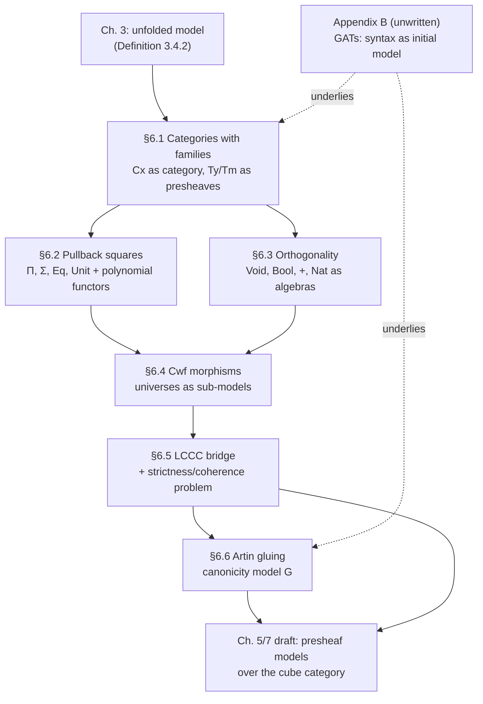

# Categorical Semantics of Type Theory

[[book-guidelines|↩ Back to guidelines]]

## Why repackage a model at all?

By the end of Chapter 3, "a model of type theory" already has a precise meaning: four families of sets — contexts, substitutions, types, terms — closed under a long list of operations (composition of substitutions, weakening, context extension, one clause per connective) subject to an even longer list of equations. It *works*. Every metatheorem in the book — consistency, canonicity, the undecidability results — is proved by exhibiting some such model and chasing its equations. The problem is that this definition is a nightmare to work with directly. Constructing a new model means writing down dozens of operations and checking dozens of equations by hand, most of which are just naturality in disguise.

Chapter 6 makes an observation that sounds almost too simple to matter: the composition and identity laws for substitutions are *exactly* the axioms of a category, and the compatibility of type-formation with substitution is *exactly* the functor laws for a presheaf. Nothing about the mathematical content changes — this is the same move as replacing the fully unfolded axioms of a ring with "an abelian group equipped with a multiplication $\cdot$ satisfying...": you get to reuse a huge amount of pre-packaged categorical machinery (limits, adjunctions, the Yoneda lemma) instead of re-deriving it every time. The book is explicit that there is nothing exotic about this "categorical semantics" — the category theory was already implicit in Definition 3.4.2; Chapter 6 just makes it visible and lets you compress the definition using it.

What breaks without this repackaging: nothing breaks *logically*, but everything becomes expensive. Every one of the constructions in this article — a hierarchy of universes built from an arbitrary category, a gluing model used to prove canonicity — would be a combinatorial slog of equation-chasing without the vocabulary this chapter builds. The categorical reformulation is what makes it *practical* to build new, non-syntactic models of type theory, which is exactly what's needed to prove that a *property* of type theory holds (consistency, canonicity, independence results) rather than just what its rules say.

This article works through the chapter's four main deliverables: (1) the compact definition of a **category with families / natural model**; (2) a uniform *pullback-square* recipe for connectives with mapping-in universal properties, and an *orthogonality* recipe for connectives with mapping-out universal properties; (3) the two-way bridge between categories with families and **locally cartesian closed categories**, and the **strictness/coherence problem** that bridge runs into; and (4) the **Artin gluing** construction used to prove canonicity. A closing note covers **generalized algebraic theories**, which the book gestures at throughout this chapter but whose dedicated appendix is not yet written in this draft.

---

## 1. Categories with families and natural models

### From four sets-and-operations to one categorical structure

Start with the cheapest possible observation (Lemma 6.1.1): if $M$ is a model, then $\mathrm{Cx}_M$ — contexts as objects, substitutions $\mathrm{Sb}_M(\Gamma, \Delta)$ as hom-sets — is *already* a category. Composition and the identity substitution are, by definition, exactly what a category needs. This alone collapses seven points of Definition 3.4.2 (two sets, two operations, three equations) into "a category."

The next two pieces are barely harder once you know what a presheaf is. A **presheaf** on a category $\mathcal{C}$ is a functor $X : \mathcal{C}^{op} \to \mathbf{Set}$: a set $X(c)$ for every object, and a *contravariant* restriction map $X(f) : X(c') \to X(c)$ for every $f : c \to c'$, satisfying the functor laws. Read the type judgment $\Gamma \vdash A\ \mathrm{type}$ as "$A \in \mathrm{Ty}(\Gamma)$," and substitution $A[\gamma]$ for $\gamma : \Delta \to \Gamma$ as exactly the restriction map $\mathrm{Ty}(\gamma) : \mathrm{Ty}(\Gamma) \to \mathrm{Ty}(\Delta)$ — the functor laws are precisely the equations $A[\mathrm{id}] = A$ and $A[\gamma \circ \delta] = A[\gamma][\delta]$. Lemma 6.1.4: **types are a presheaf over the category of contexts**, full stop.

Terms are one notch more subtle, because $\mathrm{Tm}(\Gamma, A)$ is indexed by *both* a context and a type in that context. It is not a presheaf over $\mathrm{Cx}$ alone; it's a presheaf over the **category of elements** $\int_{\mathrm{Cx}} \mathrm{Ty}$ (Definition 6.1.5) — objects are pairs $(\Gamma, A)$, and a morphism $(\Delta, B) \to (\Gamma, A)$ is a substitution $\gamma : \Delta \to \Gamma$ with $B = A[\gamma]$. There's a classical equivalence $\Pr(\mathcal{C})/X \simeq \Pr(\int_{\mathcal{C}} X)$ (Theorem 6.1.7) that lets you move terms back into the more convenient shape of a single map into $\mathrm{Ty}$: $\pi : \mathrm{Tm}^\bullet \to \mathrm{Ty}$ in the slice category $\Pr(\mathrm{Cx})/\mathrm{Ty}$, with $\mathrm{Tm}^\bullet(\Gamma) = \sum_{A : \mathrm{Ty}(\Gamma)} \mathrm{Tm}(\Gamma, A)$ and $\pi$ the obvious projection.

### Context extension is representability

The one piece that isn't "obviously" categorical is context extension $\Gamma.A$, together with weakening $\mathbf p$ and the variable $\mathbf q$. This turns out to be exactly the categorical notion of a **representable natural transformation** (Definition 6.1.9): $\alpha : X \to Y$ in $\Pr(\mathcal{C})$ is representable if every map $y(c) \to Y$ from a representable presheaf pulls back $\alpha$ to another representable presheaf — i.e. every fiber of $\alpha$, restricted along any $y(c) \to Y$, is itself (isomorphic to) a Yoneda-embedded object.

For $\pi : \mathrm{Tm}^\bullet \to \mathrm{Ty}$, unwinding this (Lemma 6.1.10, a genuinely careful Yoneda-lemma chase) says: for every $\Gamma$ and $A \in \mathrm{Ty}(\Gamma)$ there's a chosen context $\Gamma_A$ (this is $\Gamma.A$), a map $p_A : \Gamma_A \to \Gamma$ (this is $\mathbf p$), and a term $q_A$ over it (this is $\mathbf q$) such that the square

$$
\begin{array}{ccc}
y(\Gamma.A) & \xrightarrow{q_A} & \mathrm{Tm}^\bullet \\
{\scriptstyle y(p_A)}\downarrow & & \downarrow{\scriptstyle \pi} \\
y(\Gamma) & \xrightarrow{A} & \mathrm{Ty}
\end{array}
$$

is a **pullback**. The universal property of that pullback square, unwound one level further, is exactly the substitution-extension operation $\gamma.a$ and its defining equations. This is worth pausing on because it's the template for *everything else* in the chapter: a bundle of operations-plus-equations from Chapter 2 turns out to be *equivalent to* the existence of a pullback square with a specific shape.

### The definition, finally

**Definition 6.1.11 (category with families / cwf).** A category $\mathcal C$, a chosen terminal object $1$, a pair of presheaves and a natural transformation $\pi : \mathrm{Tm}^\bullet \to \mathrm{Ty}$, and a representability structure on $\pi$.

**Theorem 6.1.12:** a cwf is *equivalent* to a model of type theory with no connectives at all — what the book calls a **model of base type theory**. Every connective from here on is specified as *additional structure layered on top of a cwf* (Theorem 6.1.14): "a model with connectives $\Theta_1, \ldots, \Theta_n$" = "a cwf + categorical structure for $\Theta_1$ + ... + categorical structure for $\Theta_n$." This modularity is the entire payoff of the reformulation — connectives genuinely become orthogonal pieces of structure you can mix and match, mirroring how Chapter 2 built up ETT connective by connective.

> **Terminology note:** the book uses **cwf** (Dybjer's original formulation) and **natural model** (Awodey's presheaf-theoretic repackaging of the same idea) interchangeably; this article follows suit.

### Grounding

**Rust.** The cleanest engineering analogue of "$\mathrm{Ty}$ is a presheaf over $\mathrm{Cx}$" is an incremental, context-indexed query system — the shape used by `rust-analyzer`'s or `salsa`'s query database. A query `fn types_in_scope(ctx: ContextId) -> Vec<TypeId>` that is *stable under context restriction* (if you narrow the context, the answer restricts predictably) is precisely a presheaf; the restriction maps are the "project this result down to a smaller scope" operations, and functoriality is exactly cache-coherence under narrowing. Representability of $\pi$ is the fact that "extend the context by one more binding" is itself a first-class operation that the whole system understands — not an ad hoc side table.

**Lean.** A cwf is the categorical shadow of exactly the object Lean's kernel manipulates at every step: a `LocalContext` (contexts, substitutions = renamings/instantiations between them) together with `InferType : Expr → LocalContext → Expr` (the map into `Ty`) and `Expr` itself indexed by both context and type (`Tm`). `LocalContext.mkLocalDecl`, which extends a local context by one new hypothesis, is the elaborator-level incarnation of $\Gamma.A$; the fact that Lean can always synthesize the corresponding "weakening" and "the new variable itself" automatically is exactly representability of $\pi$ — it is not a coincidence that these operations always exist, it is a *theorem* that they must, once you know the kernel is implementing a cwf.

---

## 2. Pullback squares and polynomial functors — the mapping-in connectives

### The general pattern

Chapter 2's *mapping-in* connectives ($\Pi$, $\Sigma$, $\mathrm{Eq}$, $\mathrm{Unit}$) were each specified by a natural isomorphism internalizing some piece of judgmental structure. Under the cwf reformulation, "natural isomorphism" becomes "pullback square." Work through $\mathrm{Unit}$ first (trivial formation data) and then $\mathrm{Eq}$ (non-trivial formation data), and the pattern crystallizes as **Slogan 6.2.10**:

$$
\begin{array}{ccc}
I_\Theta & \xrightarrow{\mathrm{intro}_\Theta} & \mathrm{Tm}^\bullet \\
\downarrow & & \downarrow{\scriptstyle \pi} \\
F_\Theta & \xrightarrow{\mathrm{form}_\Theta} & \mathrm{Ty}
\end{array}
$$

$F_\Theta$ encodes the **formation data** (for $\mathrm{Eq}$: a type $A$ and two terms $a, b : A$), $I_\Theta$ the **introduction data** (for $\mathrm{Eq}$: just the case $a = b$, giving $\mathrm{refl}$), and the bottom/top maps are the formation and introduction *operations*. Naturality of these maps automatically bakes in every substitution equation you would otherwise have had to state by hand — you get the $\beta$/$\eta$-compatible behavior under substitution "for free" as a side effect of asking for a natural transformation rather than a bare function. And the fact that the square is a *pullback* — not just commuting — is precisely what encodes the elimination rule: it says every term of $\Theta(A)$ over any context factors uniquely through the introduction data, which is the categorical shadow of case analysis on a fully-applied constructor. This is worth sitting with: **one diagram shape replaces formation + introduction + elimination + every substitution/naturality equation simultaneously.**

### Polynomial functors: encoding "hypothesize over a variable"

$\Pi$ and $\Sigma$ are harder than $\mathrm{Eq}$ because their formation data hypothesizes over a *bound variable*: the formation data for $\Pi$ is "a type $A$ together with a type $B$ in the extended context $\Gamma.A$" — as a presheaf, $\Gamma \mapsto \sum_{A : \mathrm{Ty}(\Gamma)} \mathrm{Ty}(\Gamma.A)$. This isn't obviously a presheaf map out of anything familiar, and it's exactly the "hypothesize over a variable" operation that shows up throughout Chapter 2.

The fix is the **polynomial functor** construction (Definition 6.2.14). Given $f : X \to Y$ in $\Pr(\mathcal C)$, define
$$
P_f = Y_! \circ f_* \circ X^*
$$
as a composite: pull back along $X$, push forward along $f$ (right adjoint to pullback, which exists by Lemma 6.2.11), then forget along $Y$. Specialized to $f = \pi$, Lemma 6.2.15 proves $P_\pi(\mathrm{Ty})(\Gamma) \cong \sum_{A : \mathrm{Ty}(\Gamma)} \mathrm{Ty}(\Gamma.A)$ — exactly the formation data of $\Pi$, constructed entirely from categorical primitives (pullback, right adjoint, forgetful functor) rather than hand-rolled. With that in hand:

- **$\Pi$** (Lemma 6.2.20): the pullback square is $P_\pi(\mathrm{Tm}^\bullet) \to \mathrm{Tm}^\bullet$ over $P_\pi(\mathrm{Ty}) \to \mathrm{Ty}$; the bottom map is $\Pi$ itself, the top is $\lambda(-)$.
- **$\Sigma$** (Lemma 6.2.21): a slightly more elaborate presheaf $\mathrm{dom}(\pi \otimes \pi)$ built from $P_\pi(\mathrm{Ty}) \times_{\mathrm{Ty}} \mathrm{Tm}^\bullet$, whose pullback square has $\Sigma$ on the bottom and $\mathrm{pair}$ on top.

The technical machinery (adjoint functor pairs, the Yoneda lemma) is doing real work here, but the payoff is that "a type or term hypothesized under one more variable" is now a *reusable categorical gadget* ($P_\pi$) rather than something re-derived by hand for every binder-introducing connective.

### Grounding

**Rust.** Rust has no native dependent products, so the honest analogy is architectural rather than literal: $P_\pi$ is the categorical version of a **container's "shapes and positions" decomposition** (as in the `functor`/`traversable` design used by parser-combinator and IR-building libraries) — a polynomial functor is precisely the mathematical object underlying "a family of *shapes* $A$, each of which has some *positions* indexed by $A$." The closest thing you can build in Rust without real dependent types is a GAT-style trait: `trait Family { type Shape; fn fiber(s: &Self::Shape) -> /* the type at that shape */; }` — this is the "poor man's" polynomial functor, and the reason it's awkward in Rust (associated types can't easily depend on *values* of `Shape`, only on the type parameter) is a small, concrete instance of exactly the expressiveness gap that full dependent types close.

**Lean.** This is far more literal here: `Expr.forallE binderName binderType body bi` — Lean's internal representation of $\Pi$-types — quite directly *is* the polynomial-functor picture: `binderType` is the base ($A$), and `body` is a term *elaborated in the extended local context* (the fiber over $A$), i.e. exactly $B \in \mathrm{Ty}(\Gamma.A)$. The reason Lean's elaborator always has to push a new `LocalDecl` before elaborating `body` is a direct, code-level instance of "the fiber lives in $\mathrm{Ty}(\Gamma.A)$, not $\mathrm{Ty}(\Gamma)$" — the polynomial functor $P_\pi$ is the abstract shape of that entire "elaborate under a binder" discipline.

---

## 3. Orthogonality and inductive types categorically

### Why pullback squares fail

$\mathrm{Void}$ has empty formation and introduction data — its diagram would need $I_\mathrm{Void} = 0$ (the initial presheaf) and $F_\mathrm{Void} = 1$. Exercise 6.10 shows this square can *never* be a pullback: pullbacks preserve monomorphisms into the terminal-ish object in a way that's incompatible with $\pi$ being representable. This isn't a technical accident — it's the categorical restatement of an idea Chapter 2 already had informally: $\mathrm{Void}$ doesn't have a mapping-*in* universal property, it has a mapping-*out* one ("every type believes $\mathrm{Void}$ is empty"). Mapping-out types need a different categorical gadget entirely.

### Orthogonality: making "believes" precise

**Definition 6.3.3.** $i : A \to B$ is **left orthogonal** to $f : X \to Y$ (written $i \pitchfork f$, "$f$ is right orthogonal to $i$") if every commuting square from $i$ into $f$ has a *unique* diagonal filler:

$$
\begin{array}{ccc}
A & \longrightarrow & X \\
{\scriptstyle i}\downarrow & \nearrow & \downarrow{\scriptstyle f} \\
B & \longrightarrow & Y
\end{array}
$$

Read $i \pitchfork f$ as "$f$ believes $i$ is an isomorphism" — from $f$'s point of view, lifting across $i$ is always possible and always unambiguous, exactly as if $i$ actually were invertible. This is the precise, general form of "every type believes $\mathrm{Void}$ is empty" or "every type believes $\mathrm{Bool}$ has exactly two elements": the *gap map* measuring the difference between the naive union of constructors and the actual term set is not an isomorphism globally, but it becomes one once you restrict attention to what any *other* type can observe about it.

### Working through Bool in full

$\mathrm{Bool}$ has $\mathrm{true}, \mathrm{false} : 1 \sqcup 1 \to \mathrm{Tm}^\bullet$ over $\mathrm{Bool} : 1 \to \mathrm{Ty}$. The **gap map** $i : 1 \sqcup 1 \to \mathrm{Bool}^*\mathrm{Tm}^\bullet$ is never an isomorphism (there are non-constant, "stuck" boolean-typed variables in an open context) — but Property † (the requirement that `if`/case-split be a bijection $\mathrm{Tm}(\Gamma.\mathrm{Bool}, A) \cong \mathrm{Tm}(\Gamma, A[\mathrm{true}]) \times \mathrm{Tm}(\Gamma, A[\mathrm{false}])$) turns out, after a careful chase through representability and the Yoneda lemma, to be *exactly equivalent* to

$$
y(\Gamma) \times i \ \pitchfork\ \pi \quad \text{for every } \Gamma
$$

(Lemma 6.3.5/6.3.6). In words: the elimination principle for $\mathrm{Bool}$ — that you can always case-split, uniquely — *is* the statement that the gap map is orthogonal to context extension itself. Coproducts (+) replay this with non-trivial formation data (Lemma 6.3.12), landing on **Slogan 6.3.13**: a non-recursive inductive type is a commuting square (formation + introduction) plus one orthogonality condition on its gap map.

### Nat needs algebras, not just orthogonality

$\mathrm{Nat}$ is recursive, so orthogonality alone can't capture it — you additionally need the categorical notion of **algebra**: for $F : \mathcal C \to \mathcal C$, an $F$-algebra is $(C, a : F(C) \to C)$, with homomorphisms the evident structure-preserving maps (Definitions 6.3.17–18). $\mathrm{Nat}^*\mathrm{Tm}^\bullet$ becomes a $(- \sqcup 1)$-algebra via $\mathrm{zero}$/$\mathrm{suc}$ (Lemma 6.3.20), and Property † for $\mathrm{Nat}$ (the recursor and its $\beta$-laws) is equivalent to $y(\Gamma) \times \mathrm{Nat}^*\mathrm{Tm}^\bullet$ being **initial** among *representable dependent algebras* over it (Lemma 6.3.25) — the categorical version of Chapter 2's "$\mathrm{Nat}$ is the initial $(1 \sqcup -)$-algebra."

### Dropping $\eta$: stable weak orthogonality

Chapter 2 deliberately omitted $\eta$-rules for inductive types in the *official* rule set of ETT (they're derivable from equality reflection anyway, and including them primitively would sabotage normalization). Categorically, dropping $\eta$ means dropping *uniqueness* of the diagonal lift while keeping *existence* and *coherence under substitution* — a notion strictly between "no lift required" (weak orthogonality) and "unique lift" (orthogonality), called **stable weak orthogonality** ($\pitchfork^{st}$, Definition 6.3.27). This matters beyond bookkeeping: it's the exact mechanism used to specify the **intensional identity type** $\mathrm{Id}$ (Lemma 6.3.32) — $\mathrm{Id}$'s elimination rule ($J$) only fixes part of the formation data (the type, but not the two terms) in its motive, so it needs a stable weak orthogonality structure restricted to a partial slice of the formation data, rather than the full one $\mathrm{Eq}$ enjoys. This is the categorical fingerprint of the ETT/ITT distinction: it's not that $\mathrm{Id}$ is a fundamentally different *shape* of connective from $\mathrm{Eq}$, it's that it asks for the weaker of two closely related lifting properties.

### Grounding

**Rust.** Orthogonality's "unique diagonal filler" is precisely what an **exhaustive, non-overlapping `match`** guarantees: given arms for every constructor, the compiler produces exactly one function out of the enum, and adding or dropping a case is a compile error — that *is* unique lifting against the gap map of the enum's constructors. `Nat` as an initial $(1 \sqcup -)$-algebra is the categorical account of `Iterator::fold`/`itertools`-style catamorphisms: the "unique algebra homomorphism out of `Nat`" is exactly what makes `fold` well-defined and total rather than merely "a plausible recursive function." Rust's `enum` + exhaustive `match` gives you *orthogonality* (full $\eta$) automatically; if you wanted the *weak* version (some case analysis exists, but not necessarily unique/canonical, as in ITT-without-$\eta$) you'd be looking at something like a `dyn Trait` handled through `downcast`, where a valid dispatch exists but isn't syntactically forced to be unique.

**Lean.** Lean's auto-generated `.rec`/`.casesOn` for an inductive type is the operational realization of the orthogonality condition: the recursor is, by construction, *the* unique map satisfying the $\beta$-equations on each constructor — Lean's kernel does not merely check that *some* function typechecks against the recursor's type, it relies on the recursor *being* that unique lift. The ETT-vs-ITT distinction in $\S$6.3.4 maps directly onto why Lean (an intensional system) needs `Eq.mpr`/`Eq.rec` gymnastics that a hypothetical extensional Lean-with-reflection wouldn't: intensional identity types deliberately implement the *weaker* stable-weak-orthogonality shape rather than full orthogonality, and every piece of `Eq`-related friction in everyday Lean proofs is a symptom of that deliberate weakening.

---

## 4. Cwf morphisms and universes as sub-models

A **morphism of models** (Definition 3.4.3) was originally a long list of functions between corresponding sets, each required to commute with every operation — tedious in the same way the original model definition was. The reformulation (Lemma 6.4.5) is short: a morphism $F : M \to N$ is a functor between categories of contexts preserving the terminal object *on the nose*, plus a commuting square $\mathrm{Tm}_M \to F^*\mathrm{Tm}_N$ over $\mathrm{Ty}_M \to F^*\mathrm{Ty}_N$, plus strict preservation of context extension. Extending $F$ to respect a connective adds *no new data* — only extra commutation requirements shaped exactly like the connective's own pullback-square specification (e.g. Lemma 6.4.15 for $\Pi$, built from $P_\pi$ again). Crucially, you never need to separately require that the *elimination* form is preserved — Lemma 6.4.11 shows it follows automatically from preservation of introduction plus the $\beta$/$\eta$-laws.

This machinery pays off immediately for universes. A universe structure (Structure 6.4.17) is, at heart, a *smaller copy of the model's own closure conditions*, living inside the model as data. The chapter makes this literal (Corollary 6.4.20, Theorem 6.4.22): the representability structure on $y(\mathbf p) : y(1.U_0.\mathrm{El}_0) \to y(1.U_0)$ already assembles into a model of *base* type theory, call it $U_0$; closing $M$ under $\mathrm{pi}, \mathrm{sig}, \mathrm{eq}, \ldots$ codes is *exactly* equipping $U_0$ with connectives such that the canonical inclusion $I : U_0 \to M$ becomes a genuine morphism of models. **A universe is a sub-model, and the coding operations are what makes the inclusion structure-preserving.** A cumulative hierarchy (Lemma 6.4.23) is the same story iterated, with `lift` maps assembling the $U_i \hookrightarrow U_{i+1}$ chain.

**Grounding.** This is the categorical shadow of **reify/reflect** in a staged metaprogramming or partial-evaluation system: $U_0$'s codes are a *first-class, manipulable copy* of the ambient type formers, and $\mathrm{El}$ is the "reflect" operation turning a code back into a real type acting in the ambient model — precisely mirroring how `Type 0 : Type 1` in Lean/Agda lets you write functions that pattern-match on type *codes* as ordinary data, then `El`-like machinery (implicit in these systems) turns the result back into an actual type the kernel can check against.

---

## 5. Locally cartesian closed categories and the coherence/strictness problem

### From models to LCCCs

Fix a **democratic** model — every context is (isomorphic to) $1.A$ for some closed type $A$ (Definition 6.5.1; true of the syntactic model, Lemma 6.5.2, though not of every model). Democracy buys an equivalence $\mathrm{Cx}/\Gamma \simeq \mathrm{Ty}(\Gamma)$ (Corollary 6.5.5) — slices of the context category correspond to types in context, with $\Pi$/$\Sigma$/$\mathrm{Eq}$/$\mathrm{Unit}$ giving exponentials, products, equalizer-like structure, and a terminal object respectively (Lemma 6.5.7–6.5.9): **$\mathrm{Cx}$ is locally cartesian closed.** $+$ and $\mathrm{Void}$ give finite coproducts (Lemma 6.5.10); $\mathrm{Nat}$ gives a stably initial $(1 \sqcup -)$-algebra (Lemma 6.5.11). Universes become an internal axiomatic notion — a **bare universe**: a pullback-stable class of morphisms $S$ (Definition 6.5.14), refined by closure conditions matching $\mathrm{El}$ and the connective-closure of $U$ (Definition 6.5.16) — and each $U_i$ induces one (Lemma 6.5.17). All told (Theorem 6.5.20): **democratic model $\Rightarrow$ locally cartesian closed category with finite coproducts, a stably initial NNO-like algebra, and a hierarchy of universes.**

### The strictness problem

The converse — start with an abstract LCCC $\mathcal C$ with the right closure properties, and build a model of type theory whose contexts *are* $\mathcal C$ — is where the chapter earns its length. The obvious guess for $\mathrm{Ty}_M$, motivated by Lemma 6.5.3's slice-category correspondence, is
$$
\mathrm{Ty}_M(C) \overset{?}{=} \mathrm{Ob}(\mathcal C/C)
$$
This is not even a *functor*. Pullback in a general category only gives you $f^* g^* \cong (g \circ f)^*$ up to *coherent isomorphism*, not on the nose — choosing an actual pullback representative for every cospan simply doesn't compose strictly in general (Exercise 6.20 makes this concrete even for $\mathbf{Set}$). What you actually get is a **pseudofunctor** $\mathcal C/{-} : \mathcal C^{op} \to \mathbf{CAT}$. This mismatch — between the strict, on-the-nose functoriality a cwf's $\mathrm{Ty}$ presheaf demands and the merely-coherent, up-to-isomorphism functoriality that "the objects of a slice category" naturally gives you — is the **coherence** or **strictness problem** for dependent type theory, and it was famously overlooked by Seely's original 1984 "LCCCs model ETT" claim.

This is worth dwelling on as the "what breaks without this" moment of the whole chapter: type-checking needs $A[\gamma_1][\gamma_2]$ and $A[\gamma_2 \circ \gamma_1]$ to be the *literal same type*, not merely isomorphic types related by some coercion — otherwise every substitution introduces an invisible coercion that the type-checker has to track and that programs would have to be explicitly transported across. A merely-pseudofunctorial semantics is unusable as a semantics of a *syntactic* system whose whole point is that substitution is silent.

### Two fixes

**The universe construction, $U(\mathcal C)$** (§6.5.3). Assume $\mathcal C$ carries an $(\omega{+}1)$-indexed hierarchy of universes $S_0 \subseteq \cdots \subseteq S_\omega$, with $S_\omega$ containing all the others. Define $\mathrm{Ty}_{U(\mathcal C)}(\Gamma) = \hom(\Gamma, U_\omega)$ — this *is* strictly functorial, because it's literally a hom-functor, not "choose a pullback representative." The price: the resulting model isn't democratic in general (Warning 6.5.24), and worse, cumulativity/coding equations for the universe hierarchy inside this model (e.g. $\mathrm{lift}(\mathrm{pi}(c_0,c_1)) = \mathrm{pi}(\mathrm{lift}(c_0), \mathrm{lift}(c_1))$) simply may fail to hold on the nose — you've solved strictness for the *base* connectives at the cost of reintroducing a milder version of the same problem one level up, at universes.

**The local universes construction, $L(\mathcal C)$** (Lumsdaine–Warren; Awodey, §6.5.5). Instead of committing to one master universe, sum over *all* possible local universes at once:
$$
\pi_{L(\mathcal C)} = \sum_{\tau : E \to B} y(\tau) : \mathrm{Tm}_{L(\mathcal C)} \to \mathrm{Ty}_{L(\mathcal C)}
$$
A type is now a *pair* — a chosen local universe $\tau : E \to B$ plus a classifying map $\Gamma \to B$ — and crucially, **substitution is realized by pairing, not by choosing a pullback**: $A[\gamma] = (\tau, f \circ \gamma)$, which is trivially, strictly functorial because composition of functions *is* strictly associative. The price this time is redundancy: many distinct pairs $(\tau, f)$ classify isomorphic extended contexts, so $\mathrm{Ty}_{L(\mathcal C)}$ is far from a faithful copy of $\mathrm{Ob}(\mathcal C/\Gamma)$ — but that redundancy is exactly *why* it can afford to be strict. Connectives are built by manipulating local universes directly with $P_{\tau_A}$ (e.g. $\Pi$'s underlying local universe is literally $P_{\tau_A}(\tau_B)$, Lemma 6.5.34) — no top universe needed, at the cost of not (yet) supporting a fully cumulative hierarchy.

**Presheaf models with fiberwise-small universes** (Hofmann–Streicher, Theorem 6.5.28) give a third, concrete instantiation living specifically in $\Pr(\mathcal C)$: the class of maps whose every fiber is $V$-small (for a Grothendieck universe $V$) forms a bare universe with an explicit generic family built from $\mathrm{Ob}(\Pr_V(\mathcal C/C))$ — this is essentially a presheaf-level replay of the set-model construction from §3.5, with $\mathbf{Set}$'s "smallness" axiomatized away.

### Grounding

**Rust.** The strictness problem is, almost exactly, the reason compilers **intern** things. `rustc`'s `Symbol`/interned `Ty<'tcx>` values are a real-world "universe construction": rather than comparing types structurally every time (which would only ever give you "isomorphic," the analogue of the pseudofunctor), the compiler commits, once, to *one canonical representative per equivalence class*, after which equality is cheap pointer/id comparison — exactly what a strict $\mathrm{Ty}_M$ presheaf buys you over "the objects of a slice category." The local-universes fix is the more defensive engineering pattern: instead of one global canonicalization table (which can blow up or need a huge "big enough" bound chosen up front, like $U_\omega$), keep many small, *locally* scoped memo tables and pay a little redundancy for never needing a global commitment — the difference between a single global string-interning table and per-module/per-crate symbol tables that get merged lazily.

**Lean.** The coherence problem is the categorical explanation for why Lean's kernel needs `isDefEq` (definitional equality up to reduction) rather than raw term equality: definitional equality *is*, at the syntactic level, exactly the "merely coherent, not literal" isomorphism the pseudofunctor $\mathcal C/{-}$ produces — two syntactically different `Expr`s that both `whnf`-reduce to the same normal form are "the same type" only up to a *proof* (a reduction sequence), not up to `Expr.equal`. The universe-construction fix ("pick one canonical universe big enough to hold everything") is structurally the same move as Lean needing `Type u` polymorphism with `max`/`imax` level arithmetic to avoid Girard's paradox while still having "one big enough universe" available for constructions that need it; the local-universes fix is closer to how a *bidirectional* elaborator avoids committing to a normal form early, deferring reduction/unification decisions (via metavariables) until forced — "don't normalize until you have to" is the elaboration-level echo of "don't choose a pullback representative until you have to."

---

## 6. Artin gluing and canonicity models

### The three-step recipe

Section 3.4 reduced metatheorems to model-existence questions; this section cashes in that reduction for **canonicity**: every closed $\mathrm{Bool}$ term is $\mathrm{true}$ or $\mathrm{false}$. The recipe used is deliberately general and reused across the type-theory literature for consistency, canonicity, and normalization proofs alike:

1. Construct a model $G$ with extra structure baked in.
2. Exhibit a morphism of models $\pi : G \to \mathcal T$ back to the syntactic model $\mathcal T$.
3. **Initiality of $\mathcal T$** (Theorem 3.4.5 — syntax is the initial model) produces a *unique* morphism $i : \mathcal T \to G$, and $\pi \circ i = \mathrm{id}$ follows automatically from initiality applied to $\mathcal T \to \mathcal T$.

<svg viewBox="0 0 420 190" xmlns="http://www.w3.org/2000/svg" font-family="sans-serif" font-size="15">
  <defs>
    <marker id="arrhead" markerWidth="8" markerHeight="8" refX="6" refY="3" orient="auto"><path d="M0,0 L6,3 L0,6 Z" fill="#6b7280"/></marker>
  </defs>
  <circle cx="60" cy="100" r="28" fill="none" stroke="#6b7280" stroke-width="2"/>
  <text x="60" y="105" text-anchor="middle" fill="#6b7280">𝒯</text>
  <circle cx="300" cy="100" r="28" fill="none" stroke="#6b7280" stroke-width="2"/>
  <text x="300" y="105" text-anchor="middle" fill="#6b7280">G</text>
  <path d="M90 90 C 180 55, 220 55, 272 90" fill="none" stroke="#6b7280" stroke-width="2" marker-end="url(#arrhead)"/>
  <text x="180" y="45" text-anchor="middle" fill="#6b7280">i : 𝒯 → G  (from initiality)</text>
  <path d="M272 112 C 220 145, 180 145, 90 112" fill="none" stroke="#6b7280" stroke-width="2" marker-end="url(#arrhead)"/>
  <text x="180" y="168" text-anchor="middle" fill="#6b7280">π : G → 𝒯  (projection, constructed first)</text>
  <text x="180" y="103" text-anchor="middle" fill="#6b7280">π ∘ i = id</text>
</svg>

The trick is arranging $G$ so that $\mathrm{Tm}_G(1_G, \mathrm{Bool}_G) \cong \{0, 1\}$ with $\pi$ sending $0, 1$ to $\mathrm{true}, \mathrm{false}$ — then for *any* closed boolean $b$ in the syntactic model, $b = \pi(i(b))$, and $i(b)$ is forced to land on $0$ or $1$, so $b$ is forced to be $\mathrm{true}$ or $\mathrm{false}$. All the actual work is in steps 1–2.

### Where does $G$ come from? Artin gluing

Neither model already in hand does the job alone: the set model $\mathcal S$ satisfies $\mathrm{Tm}_{\mathcal S}(1,\mathrm{Bool}) \cong \{0,1\}$ but has no morphism to $\mathcal T$; the syntactic model $\mathcal T$ has an evident morphism (identity) but doesn't obviously satisfy the $\{0,1\}$ property on its own terms. $G$ has to be a genuine *hybrid*. **Artin gluing** (Definition 6.6.1) is the general categorical construction that builds exactly this kind of hybrid: given $F : \mathcal C \to \mathcal D$, $\mathrm{Gl}(F)$ has objects $(D \in \mathcal D, C \in \mathcal C, f : D \to F(C))$ — a $\mathcal D$-object *decorating* a $\mathcal C$-object via $F$.

Specialize $\mathcal C = \mathcal T$ (syntactic model), $\mathcal D = \mathbf{Set}$, and $F = \Gamma_{\mathcal T} = \hom(1, -)$, the **global sections functor**. An object of $\mathrm{Gl}(\Gamma)$ is a syntactic context $\Gamma^\circ$ together with a family of sets $\Gamma^\bullet$ indexed by *closed substitutions into $\Gamma^\circ$* — read as **proof-relevant predicates on global elements**, i.e. exactly the shape of a **logical relation** (the book flags this explicitly, Remark 6.6.2: gluing models are a categorical reconstruction of logical-relations arguments). Concretely:

$$
\mathrm{Ty}_G(\Gamma) = \sum_{A^\circ : \mathrm{Ty}(\Gamma^\circ)} \prod_{\gamma \in \hom(1_G,\Gamma)} \mathrm{Tm}(1, A^\circ[\gamma^\circ]) \to V_\omega
$$

A $G$-type is a genuine syntactic type $A^\circ$, *decorated* by a family of "canonicity evidence" sets, one per closing substitution and closed term. Context extension pairs up the syntactic and evidence halves the obvious way (§6.6.1); the projection $\pi : G \to \mathcal T$ is literally "forget the evidence, keep the syntax," which is trivially a morphism because the evidence-bearing operations were *defined* to strictly commute with it.

### Closing $G$ under connectives: $\mathrm{Bool}$ worked in full

$$
\pi_1(\mathrm{Bool}_G) = \mathrm{Bool} \qquad
\pi_2(\mathrm{Bool}_G) = \lambda \gamma\, b.\ \{0 \mid b = \mathrm{true}\} \cup \{1 \mid b = \mathrm{false}\}
$$

The evidence attached to a boolean-typed term at a closing substitution is a *proof that it's already canonical*. Verifying the orthogonality condition (Property †) for $\mathrm{Bool}_G$ is a mechanical unfolding chase — $\mathrm{Tm}_G(\Gamma.\mathrm{Bool}_G, A) \cong \mathrm{Tm}_G(\Gamma, A[\mathrm{true}]) \times \mathrm{Tm}_G(\Gamma, A[\mathrm{false}])$ — but the content is exactly what makes step 3 of the recipe deliver canonicity: because $\mathrm{Bool}_G$'s evidence is *literally* "which of the two canonical forms," extracting the evidence from $i(b)$ for a closed $b$ *is* the canonicity proof (Theorem 6.6.14).

$\mathrm{Unit}$ and $\mathrm{Eq}$ are similar but simpler (trivial or logically-derived evidence, §6.6.1); $\Pi$'s evidence is a *dependent product of evidence* — a proof-of-canonicity for $f$ has to supply canonicity evidence for $\mathrm{app}(f, a)$ at every canonical argument $a$, mirroring exactly how logical relations at function type universally quantify over related arguments. $U_0$ is the hard case: its evidence must be **proof-relevant** (not a mere yes/no predicate) because a code $c : U_0$ needs to carry not just "which former it's built from" but *the entire evidence structure of the type it classifies* — recursively. This forces reaching for a Grothendieck universe one level up ($V_\omega \supset V_0$) purely to have somewhere to store that recursive evidence, echoing exactly the $(n{+}1)$-hierarchy trick from the set model in §3.5.

### Deriving the theorem, and beyond

Once $G$ is closed under every connective (Theorem 6.6.13), Theorem 6.6.14 is three lines: unfold $b = \pi(i(b))$, note $\mathrm{Sb}_G(1,1)$ is a singleton (terminality), and read off that the surviving evidence component is literally an element of $\{b = \mathrm{true}\} \sqcup \{b = \mathrm{false}\}$. The same machine, run on $U_0$-evidence instead of $\mathrm{Bool}$-evidence (Exercise 6.26), proves every closed universe code is headed by one of the primitive formers — and running it on $\mathrm{Void}$ reproves *consistency* (no closed term of $\mathrm{Void}$) as a corollary, giving a second, purely semantic proof of a fact Chapter 3 obtained syntactically.

The chapter closes (§6.6.4) by noting the construction generalizes: **pseudo-morphisms of models** (Kaposi–Huber–Sattler) relax "preserve every connective" down to "preserve context extension up to canonical isomorphism," which is enough to run the same $\mathrm{Gl}(F)$-based recipe for a wide family of related metatheorems (normalization, decidability results for other type theories) without re-deriving the bureaucracy from scratch each time.

### Grounding — the highest-payoff section in this chapter for a verified-compiler project

**Rust.** The gluing model's shape — *pair every syntactic value with a witness object proving it satisfies a semantic property, and thread that pairing through every operation* — is precisely the architecture of an **instrumented/shadow interpreter** used to prove interpreter correctness: alongside your real `eval(term) -> Value`, you carry a parallel `eval_with_evidence(term) -> (Value, CanonicityWitness)` where `CanonicityWitness` is inductively defined exactly the way $\mathrm{Bool}_G$, $\Pi_G$, $U_G$ are defined here — by structural recursion on the type, universally quantifying evidence over all well-typed arguments at function types. If you ever write a soundness proof for a hand-rolled Rust type-checker/normalizer pair, this is the shape it will take: a logical-relations argument realized as "build a second, evidence-carrying model and show it projects onto the real one."

**Lean.** This section is the direct blueprint for proving your own kernel's `isDefEq` + normalizer combination sound: canonicity ("every closed term of a canonical type reduces to a canonical form") is *exactly* the property you need to guarantee your evaluator never gets stuck on well-typed closed input, and the gluing construction is the textbook recipe for proving it by logical relations rather than by a hands-on strong-normalization argument. The proof-relevance forced on $U_G$ — needing to carry the *entire* recursive evidence structure inside a universe code — is a direct preview of why metatheoretic proofs about dependently-typed kernels with universes (Lean included) are substantially harder than the same proofs for simply-typed systems: the logical relation itself has to be defined by induction on the *semantic* size of types, not just their syntactic structure, precisely because a code can quantify over an entire universe.

---

## 7. Generalized algebraic theories — a note on thin source coverage

The book's own Appendix B, "Generalized algebraic theories (draft)" (listed in the table of contents at printed p. 313, with subsections on generalized algebraic signatures and their models), is **not present in this pre-publication PDF** — direct extraction confirms the document jumps straight from the end of Appendix A's formal rule tables (printed p. 311) to Appendix C's exercise solutions, with no Appendix B content in between. This mirrors the "(draft)" stub pattern already seen at §4.4 (Observational Type Theory) and §5.3–5.4 ([[Cubical-Type-Theory|Cubical Type Theory]] drafts) elsewhere in the book. Consequently this section is necessarily a first-principles sketch built from what Chapter 6 itself says about GATs, rather than a re-reading of dedicated source material.

Chapter 6's opening paragraph is explicit about the connection: a model of type theory is "much closer in spirit to models in classical universal algebra such as groups, rings, or modules... [but] requires some of these sets to be indexed by elements of others, making it more general than an algebraic theory (more precisely, it is a **generalized algebraic theory** [Cartmell 1986; Dybjer 1996; Kaposi–Kovács–Altenkirch 2019])." Unpacking that first-principles: an ordinary algebraic theory (groups, rings, monoids) has a fixed, non-dependent list of sorts and operations between them — a group signature is "one sort, three operations," and every model interpretation is independent of the others. Type theory's four judgments are *not* independent in this way: $\mathrm{Ty}(\Gamma)$ genuinely depends on which context $\Gamma$ you're in, and $\mathrm{Tm}(\Gamma, A)$ depends on *both* $\Gamma$ and a specific $A$ drawn from $\mathrm{Ty}(\Gamma)$. A GAT is the generalization of "algebraic signature" that allows exactly this kind of dependency between sorts — later sorts in the signature may be indexed by elements of earlier ones, subject to well-formedness side-conditions tracking which indexings are even legal.

This is precisely the machinery that makes "the syntactic model is the *initial* model" (Theorem 3.4.5) a coherent, provable statement rather than a hopeful slogan — a theme this book returns to explicitly in both Chapter 3 (defining consistency/canonicity via initiality) and throughout this chapter (every gluing/coherence argument leans on initiality of $\mathcal T$). Cartmell's original **contextual categories** predate cwfs and are, in essence, the direct categorical model of a GAT presentation of type theory; Dybjer's cwfs (the formulation this whole chapter builds on) are widely understood as a cleaner, presheaf-theoretic repackaging of essentially the same underlying GAT — which means everything in §§6.1–6.4 of this article can be read as a specific worked instance of "what it looks like to reorganize one particular GAT (the GAT presenting dependent type theory) into a compact categorical shape."

**Grounding (brief, given the thin source material).** A GAT signature is the mathematical formalization of what you're implicitly doing whenever you define an AST as *mutually recursive datatypes with a well-formedness invariant baked into the indexing itself* — an **intrinsically-typed** representation (well-typed terms indexed by their type, as in Lean/Agda's `Expr` families indexed by `Ty`), as opposed to a "stringly-typed" or separately-validated AST. Plain Rust `enum`s cannot express this directly (an `enum Term` can't naturally carry "and this variant is only well-formed when indexed by a specific `Type` value" as a type-level invariant) — which is exactly the expressiveness gap that motivates reaching for GADT-style encodings, phantom types, or a genuinely dependently-typed host language when building a *trusted* representation of syntax rather than one whose well-formedness is checked separately at runtime.

---

## Where this leads

Everything in this chapter is infrastructure the rest of the book leans on rather than a self-contained detour. The presheaf-model techniques of §6.5 (LCCCs, universe/local-universes constructions) are exactly what makes the **cubical type theory** models sketched in Chapter 5's drafts possible — a model of cubical type theory is, structurally, a presheaf model over the cube category built by the same recipe as §6.5.4's Hofmann–Streicher construction, just with cubes standing in for an arbitrary index category. The **Artin gluing** technique of §6.6 is explicitly reused ("this style of gluing argument has become a widely used technique") for normalization proofs of other type theories cited in the chapter's closing remarks — this is not a one-off trick specific to $\mathrm{Bool}$-canonicity.

For the **type-theory** focus area this topic is tagged against: the cwf/natural-model reformulation is the cleanest available statement of the idea that *a type checker and a proof checker share one ancestor* — both are, underneath, evaluators for the same presheaf-of-judgments structure, differing only in which connectives their $\mathrm{Ty}$/$\mathrm{Tm}$ presheaves are closed under. "Syntax as the initial model" (leaned on constantly in §6.6, and the organizing idea behind the unwritten GAT appendix) is precisely the theorem that licenses writing an elaborator/kernel as *the* unique structure-preserving map out of a term AST — which is the architectural backbone any trusted kernel eventually relies on, whether or not it's stated in those words. And the canonicity-via-gluing construction is, concretely, the categorical blueprint for a logical-relations soundness proof: if a future Rust-based kernel's `isDefEq` and normalizer need a soundness argument (they never get stuck on well-typed closed terms), the shape of that argument — build an evidence-carrying shadow model, exhibit a projection to the real one, extract a section from initiality — is exactly what §6.6 works out in full for extensional type theory's $\mathrm{Bool}$.
