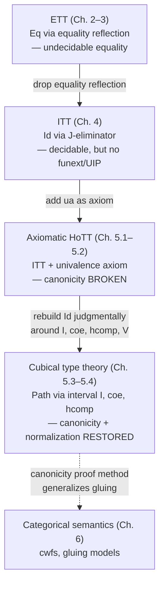

# Cubical Type Theory

[[book-guidelines|↩ Back to guidelines]]

## The problem this chapter has to solve

By the end of Chapter 5's first two sections, the book has done something slightly dishonest. It took intensional type theory (ITT) — which has canonicity, decidability, all the metatheoretic properties Chapter 3 worked so hard to secure for extensional type theory (ETT) and then had to give up — and bolted the univalence axiom onto it as a free-floating constant with no computation rule. `ua : A ≃ B → Id(U, A, B)` typechecks, but nothing tells you what `coe` or `J` do when they hit a `ua`-constructed identification. Concretely: you can construct a closed term of type `Σ (n : Nat), π₄(S³) = ℤ/nℤ` using univalence (Brunerie's example), but you cannot *run* it to find out what `n` is, because the identity type no longer has the property that every closed proof reduces to `refl`. Canonicity — the theorem that every closed term of `Bool` reduces to `true` or `false` — silently breaks the moment `ua` enters the picture.

This is not a small implementation gap you patch with one more reduction rule. The book tries the obvious fix first — "just add a definitional equality for `coe` through `ua`" — and shows it doesn't work: you'd also need equations for `J` interacting with `sym`, `trans`, and every other identity-type combinator applied to a `ua`-built term, and no such equation set is forthcoming, because `Id(A, a, b)` was built around the idea that *every* inhabitant is (propositionally) `refl` — a premise univalence directly falsifies.

So the book does something more radical: it throws away the intensional identity type's *judgmental structure*, not just its computation rules, and rebuilds identity from scratch so that `ua` is no longer an axiom but an ordinary, computing type former. That rebuild is cubical type theory. The rest of this article is the anatomy of that rebuild: a new judgment (the interval), a new type former (`Path`, a mapping-in reformulation of `Id`), and two new primitive operations (`coe` and `hcomp`) that every type must be equipped with so that `Path` actually behaves like equality. The payoff, stated as Theorem 5.3.13 in the book, is that cubical type theory recovers consistency, canonicity, *and* normalization — all while validating univalence computationally.

## Why functions-from-an-interval, and not a bespoke equality judgment

Before reaching for cubes, the book tries the most direct fix: add a new judgment `Γ ⊢ α : a = b : A` that *reifies* identifications as first-class syntactic objects, and define `Path(A, a, b)` to internalize it via the natural isomorphism `Tm(Γ, Path(A,a,b)) ≅ Id(Γ,a,b,A)`. This gets you a type, but not a *usable* one: nothing forces `α` to act like equality. You'd add `refl`-like introduction rules by hand, one per connective ("pairs get identified from identified components," etc.), and — critically — you immediately need *identifications between identifications* once univalence is on the table (since univalence implies `Id(A,a,b)` can have more than one, non-identical inhabitant). Chasing that regress by hand means inventing a new judgment at every "height": identifications of identifications of identifications of...

The way out is a change of representation, motivated by topology. Two points `x, y` in a space are path-connected when there is a *continuous function* `p : [0,1] → X` with `p(0) = x`, `p(1) = y`. This definition is free: reflexivity is `p := const x`, symmetry comes from precomposing with `1 - t`, transitivity from a map `[0,1] → [0,1] ∨ [0,1]` that splits the interval — and crucially, identifications-between-identifications are just functions out of `[0,1] × [0,1]` with the right boundary. No new judgment needed per dimension; you just add another copy of the interval to the domain.

Type theory has no reals and doesn't want them, but it can add a syntactic stand-in for `[0,1]` with just enough structure to make this work.

**What breaks without a genuine judgmental structure for the interval:** if `I` were an ordinary two-element-ish inductive type (like `Bool` with `0`/`1` as constructors), you'd get case-split/elimination for free — and that is exactly what must *not* happen, because the whole point of `coe` (below) is that a type depending on `I` is not allowed to vary discontinuously the way a type depending on `Bool` can (`if b then Nat else Unit` is perfectly fine `Bool`-indexed code, but nothing analogous should typecheck for `I`). So `I` is deliberately kept *weaker* than a type: no eliminator, no case rule. This is why the book calls it a **pretype**.

## The interval pretype and dimension variables

Formally, `I` is introduced not as a type but as a new sort with its own judgment `Γ ⊢ r I` ("`r` is a dimension term"), and contexts get a new extension form `Γ.I` alongside the familiar `Γ.A`:

$$
\frac{\vdash \Gamma\;\mathrm{cx}}{\vdash \Gamma.\mathbb{I}\;\mathrm{cx}}
\qquad
\frac{\vdash \Gamma\;\mathrm{cx}}{\Gamma.\mathbb{I} \vdash \mathsf{q} : \mathbb{I}}
\qquad
\frac{\Delta \vdash \gamma : \Gamma \quad \Gamma \vdash r : \mathbb{I}}{\Delta \vdash r[\gamma] : \mathbb{I}}
$$

with the expected substitution-calculus equations (weakening `p`, the "current dimension variable" `q`, functoriality of `-[-]`) mirroring exactly what Chapter 2 set up for ordinary type-indexed context extension. Two closed dimension terms `0, 1 : I` are added by a formation rule `Γ ⊢ 0, 1 : I`, and by convention informal notation uses `i, j, k` for dimension variables.

A term `Γ.I ⊢ a : A[p]` — a term depending on one interval variable — is visualized as a **line** in `A`; two dimension variables give a **square**, three a **cube**, and in general an `n`-fold `I`-context gives an `n`-cube in `A`. This is the payoff of the topological detour: identifications-of-identifications are *automatically* handled, because a "square" is just an ordinary term in a context with two interval variables — no separate judgment needed at each height.

`Path(A, a, b)` is then the type internalizing "a line in `A` from `a` to `b`" via a genuine mapping-in universal property:

$$
\mathrm{Tm}(\Gamma, \mathrm{Path}(A,a,b)) \;\cong\; \{\, p \in \mathrm{Tm}(\Gamma.\mathbb{I}, A[\mathsf{p}]) \mid p[\mathsf{id}.0] = a \ \wedge\ p[\mathsf{id}.1] = b \,\}
$$

with concrete rules for introduction (`λᴵ`, binding a dimension variable), elimination (`papp(p, r)`, "path application" at dimension `r`), and the boundary β-laws `papp(p,0) = a`, `papp(p,1) = b` holding *definitionally* — this is the crucial difference from the old `Id` type: `Path(A,a,b)`'s elements are literally functions `I → A` satisfying boundary conditions, not opaque proof terms manipulated only through `J`.

### Grounding: Path as a real function type

If you've ever written a normalizer or evaluator, `Path` should feel completely familiar the moment you stop reading it as "a proof of equality" and start reading it as "a function type with two extra definitional equations pinned to its endpoints."

```rust
// A term depending on one dimension variable, i.e. an element of Γ.I ⊢ A.
// papp is literally function application specialized to dimension r.
enum DimTerm { Zero, One, Var(usize) }

struct Path<A> {
    // the underlying "line": a closure from a dimension term to A,
    // required (by the *type former*, not by this struct) to satisfy
    // papp(p, 0) == a and papp(p, 1) == b definitionally.
    line: Box<dyn Fn(DimTerm) -> A>,
}

fn papp<A: Clone>(p: &Path<A>, r: DimTerm) -> A {
    (p.line)(r)
}
```

This is exactly what makes the mapping-in property earn its name: `Path(A,a,b)` isn't defined by what you can *do* to its inhabitants (a `J`-eliminator, mapping-out style, as `Id` was) — it's defined by an isomorphism identifying its inhabitants with a certain set of already-understood objects (`I`-indexed terms of `A`), the same pattern Chapter 2 used for `Π` and `Σ`. This is precisely why [[Extensionality-versus-Intensionality#Function extensionality|function extensionality]] and pair extensionality for `Path` come *for free*, without any special-cased rule: the book proves

$$
\mathrm{Tm}(\Gamma_0, \mathrm{Path}(\Sigma(A,B),x,y)) \;\cong\; \mathrm{Tm}(\Gamma_0,\mathrm{Path}(A,\mathrm{fst}\,x,\mathrm{fst}\,y)) \times \mathrm{Tm}(\Gamma_0,\mathrm{Path}(B,\mathrm{snd}\,x,\mathrm{snd}\,y))
$$

and, more strikingly, `Tm(Γ, Path(Π(A,B), f, g)) ≅ Tm(Γ.A, Path(B, app(f[p],q), app(g[p],q)))` — funext, derived, not postulated — by chasing the `η`-law for `Π` through a context isomorphism `Γ.I.A[p] ≅ Γ.A.I` (Exercise 5.18). In Lean/Cubical Agda terms, this is exactly why `funext` is `refl` under a cubical kernel: `f ≡ g` unfolds to `∀ i → (∀ x → f x ≡ g x) (i)`, and building that line is just abstracting over `i` on both sides of an already-pointwise-equal family — no axiom, no `postulate`.

## Coercion: `coe` as the type-directed engine behind `subst`

The interval alone gives you `Path`, but not yet a *use* for it: there is nothing playing the role of `subst`/`J`. The book's second big move is to add `coe` as a genuinely new primitive, not derivable from anything else, governed by type-specific computation rules.

$$
\frac{\Gamma.\mathbb{I} \vdash A\;\mathrm{type} \quad \Gamma \vdash r, s : \mathbb{I} \quad \Gamma \vdash a : A[\mathsf{id}.r]}{\Gamma \vdash \mathsf{coe}^{r\to s}_A(a) : A[\mathsf{id}.s]}
\qquad
\frac{\Gamma.\mathbb{I} \vdash A\;\mathrm{type} \quad \Gamma \vdash r : \mathbb{I} \quad \Gamma \vdash a : A[\mathsf{id}.r]}{\Gamma \vdash \mathsf{coe}^{r\to r}_A(a) = a : A[\mathsf{id}.r]}
$$

The reading: if `A` is a type varying over `I`, then for *any* two dimensions `r, s` — not just `0` and `1` — an element at `r` can be transported to an element at `s`. This is strictly more than `subst` gives you (`subst` only ever moves along `0 → 1`), and that extra generality (arbitrary `r → s`, not just `0 → 1`) turns out to be indispensable machinery, not a convenience: building `coe` for a compound type like `Σ(A,B)` requires *intermediate* coercions to variable dimensions, not just the endpoints (see the worked proof below).

Given `coe`, `subst` falls out immediately: a path `Γ ⊢ p : Path(A,a,b)` and a motive `Γ.A ⊢ C` give `Γ.I ⊢ C' = C[p.papp(p[p],q)]` by ordinary substitution, and `coe⁰→¹_{C'}` instantiated appropriately yields `C[id.a] → C[id.b]`.

**What makes `coe` better than `subst`:** you can now equip it with computation rules keyed to the *shape* of `A`, restoring the decidable, evaluation-driven equality check that `subst`-as-axiom never had. Closed types compute trivially (`coeᴮᵒᵒˡ(b) = b`), and compound types compute by recursing into their pieces. The two worked derivations the book carries out in detail (§5.4.1) are `coe` for `Σ` and `Π`:

**`coe` for `Σ(A,B)`** (Lemma 5.4.2): given `p = (a, b) : Σ(A,B)` at dimension `r`, you want an element at `s`. The first component is easy: `coe_A^{r→s}(fst p)`. The second component is where the extra flexibility of `coe` pays off — `B` isn't itself a line `I → U`, it's a *family* `(i:I) → A(i) → U`, so before you can `coe` along it you need to first fix *which* element of `A(i)` you're specializing `B` at, for every `i`, not just at `r` and `s`. The trick: define `ā := λi. coe_A^{r→i}(fst p)` — a full line through `A`, not just its endpoints — then `coe` the second component along `B` composed with `ā`. This "coerce to a variable dimension, then use the result to build a further coercion" pattern recurs throughout the chapter.

```rust
// Schematic: coe for Σ(A, B), following Lemma 5.4.2.
// coe_A(r, s, a): coerce a : A(r) along A to get a : A(s).
fn coe_sigma(
    coe_a: impl Fn(Dim, Dim, ValA) -> ValA,
    coe_b_at: impl Fn(/* line through A */ &dyn Fn(Dim) -> ValA, Dim, Dim, ValB) -> ValB,
    r: Dim, s: Dim, p: (ValA, ValB),
) -> (ValA, ValB) {
    let (a, b) = p;
    // a-bar: the *whole line* obtained by coercing `a` from r to every dimension i
    let a_bar = move |i: Dim| coe_a(r, i, a.clone());
    let a_s = coe_a(r, s, a);
    let b_s = coe_b_at(&a_bar, r, s, b);
    (a_s, b_s)
}
```

**`coe` for `Π(A,B)`** (Lemma 5.4.3) is the dual construction: given `f : Π(A,B)` at `r`, and a target `a : A(s)`, first coerce `a` *backwards* to `r` (`aᵣ = coe_A^{s→r}(a)`), apply `f` there to get `bᵣ : B(r, aᵣ)`, then coerce `bᵣ` forward along the line `λk. B(k, coe_A^{s→k}(a))`. The resulting closed-form term is:

$$
\lambda a.\ \mathsf{coe}^{r\to s}_{\lambda k.\,B(k,\,\mathsf{coe}_A^{s\to k}(a))}(f(\mathsf{coe}_A^{s\to r}(a)))
$$

Both proofs share a signature move: whenever `coe` for a compound type needs to coerce a *dependent* piece, it must first manufacture a full line through the *base* using `coe` to a variable dimension, and only then coerce the dependent piece along that line. This is not incidental complexity — it's the general recipe ("programming exercises," as the book calls them) by which `coe` is defined compositionally over every type former, all the way down to `Path` itself and, eventually, the universe.

## What `coe` alone cannot do: composing faces of a cube

`coe` handles transport *along a single line*, but path types expose a second problem it can't solve alone. What should `coe^{r→s}_{Path(A,a,b)}` compute to? Naively you'd want to "slide" the whole path `p` from dimension `r` to `s` by post-composing with `coe_A`, but the result only satisfies the boundary conditions of `Path(A[id.s], coe_A^{r→s}(a[id.r]), coe_A^{r→s}(b[id.r]))` — not `Path(A[id.s], a[id.s], b[id.s])`, because `coe_A^{r→s}(a[id.r])` and `a[id.s]` are merely *path-equal*, not definitionally equal. You have three "sides" of a square (the slid path, and two connecting lines) and need to fill in a fourth side that closes the shape into an actual path. That "filling" operation is `hcomp`, and formulating it correctly requires the ability to talk precisely about *which faces of a cube* you already have — which is what cofibrations are for.

## Cofibrations and faces of cubes

An `n`-cube `Γ.I...I ⊢ a : A[pⁿ]` has **faces**: the sub-cubes obtained by specializing some of its dimension variables to `0` or `1` (edges and vertices of a square, for `n=2`). `hcomp` needs a way to say "here are *some* of the faces of an `(n+1)`-cube — the ones matching on their overlaps — please extend them to the whole cube." Not every collection of faces should be extendable (asking to extend `{a, b}` to a full line is exactly asking whether `a` and `b` are identifiable, which obviously shouldn't hold unconditionally), so the book introduces a restricted grammar of propositions about dimensions, called **cofibrations**, to pick out exactly the well-behaved subsets of faces:

$$
\frac{}{\Gamma \vdash \top, \bot\;\mathrm{cof}}
\qquad
\frac{\Gamma \vdash \varphi, \psi\;\mathrm{cof}}{\Gamma \vdash \varphi \wedge \psi,\ \varphi \vee \psi\;\mathrm{cof}}
\qquad
\frac{\Gamma \vdash r, s : \mathbb{I}}{\Gamma \vdash r = s\;\mathrm{cof}}
\qquad
\frac{\Gamma.\mathbb{I} \vdash \varphi\;\mathrm{cof}}{\Gamma \vdash \forall\varphi\;\mathrm{cof}}
$$

Cofibrations are built only from dimension equalities, conjunction, disjunction, and universal quantification over `I` — deliberately weak, because a second judgment `Γ ⊢ φ true` (a cofibration *holding*) must stay **decidable**, on pain of losing decidable typechecking entirely. Two of its rules are the crux of the design:

$$
\frac{\Gamma \vdash r = s\;\mathrm{true}}{\Gamma \vdash r = s : \mathbb{I}}
\qquad\qquad
\frac{\Gamma \vdash \varphi, \psi\;\mathrm{cof}\quad \Gamma^\varphi \vdash \psi[\mathsf{p}]\;\mathrm{true}\quad \Gamma^\psi \vdash \varphi[\mathsf{p}]\;\mathrm{true}}{\Gamma \vdash \varphi = \psi\;\mathrm{cof}}
$$

The first is a miniature *equality reflection* rule (recall: the very rule ETT was built on, and the rule ITT abandoned in Chapter 4) — but scoped narrowly to dimension terms only, so it doesn't reintroduce ETT's undecidability. The second is a tiny univalence principle for propositions themselves: interprovable cofibrations are made definitionally equal, so `φ ∨ ψ` and `ψ ∨ φ` can be silently interchanged.

Given `Γ ⊢ φ true`, a new restricted context extension `Γ^φ` is added — the analogue of `Γ.A`, but where the "witness" that `φ` holds is not a real term the user supplies (unlike an ordinary hypothesis); it is simply *presupposed*, exactly the way the definitional-equality conversion rule lets you exchange convertible terms without any explicit coercion term. A term or type can then be assembled by disjunction-case-split — given `Γ ⊢ φ ∨ ψ true`, gluing together a type under `φ` and a type under `ψ` that agree under `φ ∧ ψ` yields a single well-formed type `[φ ↪ A_φ | ψ ↪ A_ψ]` — which is exactly the tool for stating "here are some faces of a cube; they cohere on overlaps."

**What breaks without cofibrations:** without a syntactic, decidable handle on "which faces of the cube are already given," `hcomp`'s premises would have to be stated as an arbitrary partial function on `I`-tuples, which has no hope of being typechecked algorithmically — the whole reason cofibrations exist is to make "a coherent collection of faces" a *syntactic*, checkable object (`Γ^φ ⊢ a_φ : A[p]`) rather than a semantic one.

### Grounding: cofibrations as a decidable proposition language

This is precisely the kind of "small logic embedded in a bigger typechecker" that a Rust-based verifier front-end will repeatedly need — a restricted term language kept deliberately weak so that truth is decidable by direct evaluation, not full SMT.

```rust
enum Cof {
    True, False,
    And(Box<Cof>, Box<Cof>),
    Or(Box<Cof>, Box<Cof>),
    DimEq(DimTerm, DimTerm),
}

// Deciding Γ ⊢ φ true is a straightforward recursive evaluator —
// exactly because the grammar excludes anything that could make this
// depend on type inhabitation (no ∃, no arbitrary predicates).
fn cof_holds(env: &DimEnv, phi: &Cof) -> bool {
    match phi {
        Cof::True => true,
        Cof::False => false,
        Cof::And(a, b) => cof_holds(env, a) && cof_holds(env, b),
        Cof::Or(a, b) => cof_holds(env, a) || cof_holds(env, b),
        Cof::DimEq(r, s) => env.resolve(r) == env.resolve(s),
    }
}
```

The restricted context `Γ^φ` corresponds to a checker mode where, having established `cof_holds(..., φ)`, you get to *assume* the associated definitional equalities (e.g. `r = s`) hold in every subsequent typing judgment for the remainder of that branch — structurally identical to how a Rust borrow-checker or refinement-type checker narrows a context under a proven fact, without the caller ever constructing an explicit proof object for it.

## Homogeneous composition: `hcomp`

With cofibrations available, `hcomp` can finally be stated precisely: given an `n`-cube `Γ ⊢ a₀ : A` and a `φ`-indexed partial line `Γ^φ.I ⊢ a_φ : A` agreeing with `a₀` appropriately, `hcomp` glues them into a full `(n+1)`-cube:

$$
\frac{\Gamma \vdash A\;\mathrm{type}\quad \Gamma \vdash r,s:\mathbb{I}\quad \Gamma \vdash \varphi\;\mathrm{cof} \quad \Gamma.\mathbb{I}\,^{(\mathsf{q}=r[\mathsf{p}]\vee\varphi[\mathsf{p}])} \vdash a : A[\mathsf{p}^2]}{\Gamma \vdash \mathsf{hcomp}^{r\to s}_A(\varphi, a) : A}
$$

with definitional β-laws collapsing `hcomp` to `a[id.s ★]` whenever `φ` already holds, and to `a[id.r ★]` when `r = s`. Two worked examples in §5.4.2 make the geometric picture concrete:

- **Path composition.** Given `p₁ : Path(A,a,b)` and `p₂ : Path(A,b,c)`, you want `p₂ • p₁ : Path(A,a,c)`. Picture a square with `p₁` on top, a degenerate line `const a` on the left, `p₂` on the right — `hcomp` "fills down" from `0` to `1` along the missing bottom edge, using `φ := i=0 ∨ i=1` to pin the left/right sides:
  $$(p_2 \bullet p_1)\,i \;=\; \mathsf{hcomp}^{0\to1}_{A,\varphi}\big(\lambda k,\_.\ [k{=}0 \hookrightarrow p_1\,i \mid \varphi \hookrightarrow [i{=}0\hookrightarrow a \mid i{=}1 \hookrightarrow p_2\,k]]\big)$$
- **Path inversion.** Given `p : Path(A,a,b)`, filling a square with two degenerate `const a` edges and `p` itself yields `p⁻¹ : Path(A,b,a)`.

These two constructions — composition and inversion of paths, obtained from a single primitive operator rather than postulated separately — are exactly the groupoid structure of equality (symmetry, transitivity) that ETT got for free from equality reflection and ITT had to work much harder for via `J`. Here it's a byproduct of one uniform filling operation.

**Closing the loop on `coe` for `Path`** (Lemma 5.4.4): with `hcomp` in hand, `coe^{r→s}_{Path(A,a,b)}(p)` is defined by filling a square whose "wavy" vertical sides are `coe_A` applied to `a` and `b` (not literal paths — the visualization is deliberately informal) and whose top is `coe_A^{r→s}` applied pointwise to `p`; `hcomp` composes from `r` to `s` (not `0` to `1` — using `coe`'s extra flexibility again) to produce the bottom edge, which is exactly the required element of `Path(A(s), a(s), b(s))`.

```rust
// hcomp, schematically: glue a partial line a_phi (defined when phi holds
// or when the dimension variable is r) into a full term of type A at s.
fn hcomp(
    a0: Val,                                   // the "seed" face at r
    phi: Cof,
    a_phi: impl Fn(Dim /* k */, Dim /* i */) -> Option<Val>,
    r: Dim, s: Dim,
) -> Val {
    if r == s { return a0; }               // β: r → r is the identity
    if cof_holds(&DimEnv::default(), &phi) {
        return a_phi(s, /* the boundary dim */ Dim::Zero).unwrap(); // β: collapse under φ
    }
    // general case: recurse structurally on the shape of A (Lemma 5.4.5/5.4.6
    // spell this out for Π and Path; every connective needs its own case)
    unimplemented!("type-directed, one case per connective")
}
```

`hcomp`, like `coe`, is defined *by recursion on the type former* — Lemma 5.4.5 gives the `Π` case (`hcomp` at a function type reduces to `hcomp` pointwise in the codomain), Lemma 5.4.6 the `Path` case (nest an `hcomp` inside a `λᴵ`, extending the cofibration with the path's own boundary faces `i=0`, `i=1`). The one connective that resists this pointwise recursion is the universe itself — and that's precisely where univalence becomes computational.

## Computational univalence via the `V` (Glue) type

Univalence says `idtoequiv : Id(U,A,B) → (A ≃ B)` is an equivalence. Concretely, to make `ua : (A ≃ B) → Path(U,A,B)` computational, you need an actual line `p : I → U` with `p(0) = A`, `p(1) = B` *definitionally*, and `coe^{0→1}_p = e` definitionally too. No composite of the existing type formers produces this — nothing currently in the theory can define a code that degenerates to two genuinely different types at its two endpoints. So the book adds one more primitive type, `V(A,B,e,r)` (this is Cubical Agda/CCHM's `Glue` type, specialized to the case that connects two full types rather than gluing a partial type onto a total one):

$$
\frac{\Gamma \vdash A,B\;\mathrm{type}\quad \Gamma \vdash e : A \simeq B\quad \Gamma \vdash r : \mathbb{I}}{\Gamma \vdash V(A,B,e,r)\;\mathrm{type}}
\qquad
\Gamma \vdash V(A,B,e,0) = A\;\mathrm{type}
\qquad
\Gamma \vdash V(A,B,e,1) = B\;\mathrm{type}
$$

with introduction `Vin(a,b,r)` pairing a *partial* element `a : A` (defined only when `r=0`) with a *total* element `b : B`, subject to `app(e[p],a) = b[p]` whenever `r=0`; and elimination `Vout(v) : B` collapsing to `app(e,v)` at `r=0` and to `v` itself at `r=1`. `ua(e) := λi. V(A,B,e,i)` is then, by construction, the unique path witnessing `coe^{0→1}_{ua(e)} = e`.

The asymmetry between the partial `a : A` and total `b : B` is not cosmetic — the book flags it as one of the theory's genuinely delicate points. If both were partial, you couldn't state that `e` connects them; if both were total, `coe` in `V` becomes impossible to specify, because there's no "free" endpoint left for coercion to act on. Getting this exactly right (rather than the seemingly-equally-valid `app(e⁻¹, b) = a` framing) matters because `e` and `e⁻¹` are only *path*-inverse, not *definitionally* inverse — using the wrong formulation would make `Vout` ambiguous depending on evaluation order, destroying confluence.

The exact same recipe — list the required boundary equalities, solve for the minimal type satisfying them — is reused to define `hcomp^{U}_{r→s}(φ, A)`, closing the last gap in making `hcomp` total over every connective including the universe itself. The book is candid that both constructions are genuinely intricate and defers full detail to Angiuli's thesis; what matters for this article is the *shape* of the strategy: (1) encode identity as `Path`, i.e. `I → A`; (2) equip every type with `coe`/`hcomp` so `Path` behaves like an equivalence relation; (3) implement univalence as one more `I`-indexed type family (`V`), rather than an axiom, so it participates in `coe`/`hcomp` like everything else.

### Grounding: Glue-as-representation is the real move here

If you squint, `V(A,B,e,r)` is a discriminated-union-like representation that *definitionally erases* to one of its two variants at the boundary but stays a genuine third thing in the interior — the type-theoretic analogue of a tagged coercion that becomes a no-op cast exactly at compile-time-known endpoints:

```lean
-- Schematic Lean-flavored sketch (not literal Lean/Mathlib cubical syntax,
-- which lives in a different kernel altogether — this mirrors the *shape*
-- of the V-type's introduction/elimination discipline).
structure VType (A B : Type) (e : A ≃ B) (r : Dim) where
  -- 'a' is only inhabited when r = 0; 'b' is always present.
  a : r = Dim.zero → A
  b : B
  coherent : ∀ (h : r = Dim.zero), e.toFun (a h) = b
```

This is worth dwelling on because it is exactly the shape of problem a refinement-type/verification compiler runs into constantly: a value that is "the same thing" under two different representations, where the isomorphism is known and total, but you want the compiler to treat the boundary cases as free (zero-cost) rather than as an explicit cast every time. `V`/`Glue` is the type-theoretic proof that this can be made to typecheck *and* compute, not just postulated.

## Canonicity and normalization for cubical type theory

The reward for all this machinery is:

> **Theorem 5.3.13.** Cubical type theory enjoys consistency, canonicity, and normalization.

The book is explicit that these three results were established across several papers and several variants of the theory: consistency in the original cubical type theory papers (Cohen–Coquand–Huber–Mörtberg; Angiuli–Favonia–Harper), canonicity by Huber and by Angiuli–Favonia–Harper, and normalization — the hardest of the three, and the last to fall — by Sterling and Angiuli. This is worth pausing on: it took roughly the lifetime of a PhD, working across multiple independent proofs, to fully re-establish for cubical type theory what Chapter 3 had already proven for ETT and Chapter 4 for ITT. The reason is exactly the machinery surveyed above — `coe` and `hcomp` are defined by structural recursion over *every* type former, including the universe, and proving that this recursion is well-founded, confluent, and terminating (i.e. that normalization holds) is a substantially harder metatheoretic argument than anything ETT or ITT required, precisely because the universe case (`V`, `Glue`) makes the recursion genuinely impredicative-feeling even though the theory itself stays predicative.

Put in the vocabulary Chapter 3 built: cubical type theory recovers a **normalization structure** — computable, injective normal-form functions on types and terms — that once again makes definitional equality (now including `coe`/`hcomp` reduction, cofibration-truth checking, and `V`/`Vin`/`Vout` β-laws) decidable by direct evaluation, exactly the property whose *absence* forced ETT's abandonment in Chapter 3 and motivated ITT in Chapter 4. The difference is that this normalization structure now has to account for an entire second judgmental layer (dimensions and cofibrations) that ITT never had.

## Where this leads



Within the book's own arc, this section is the payoff of the entire "notions of equality" throughline: ETT's equality reflection gave definitional power at the cost of decidability; ITT's `J` restored decidability at the cost of funext/UIP/univalence; axiomatic HoTT bought univalence back but broke canonicity outright; cubical type theory is the synthesis that keeps univalence *and* restores canonicity, by moving the "extra" structure out of axioms and into a genuinely new judgmental layer (dimensions, cofibrations) plus two new primitive operations (`coe`, `hcomp`) recursively defined over every connective. Chapter 6's categorical semantics generalizes exactly the canonicity-via-gluing technique that Huber and Angiuli–Favonia–Harper used here, so this section is also a direct prerequisite for reading that chapter's Artin-gluing construction with any real understanding of what's being generalized.

For the **type-theory** focus area specifically: the interval/cofibration apparatus is a second, *independent* judgmental layer sitting alongside the ordinary context/type/term judgments — precisely the "judgments and typing rules as the shared ancestor of a type checker and a proof checker" thread this project keeps surfacing. If a Rust-based verifier ever needs a *computational* equality proof object (rather than an opaque axiom) for some form of representation-independence or type-level isomorphism, the `coe`/`hcomp`/`V` recipe here is the reference design: don't postulate the isomorphism's behavior under substitution — build a type former whose *definitional* boundary conditions force the behavior you want, and make the compositional recursion (one case per connective) explicit and total. And the canonicity/normalization proof itself is the deepest illustration in the book of why a trusted kernel's `isDefEq` needs a normalization structure, not just a consistency argument: consistency alone (Chapter 3's cheaper property) would have been satisfied by axiomatic HoTT already — it's decidable, evaluation-based equality that cubical type theory had to work this hard to win back.
