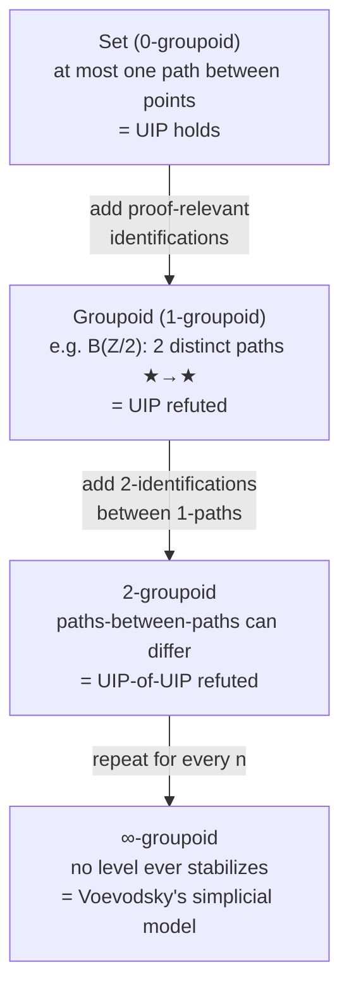

# Extensionality versus Intensionality

[[book-guidelines|↩ Back to guidelines]]

## The problem a type checker cannot dodge

Every dependently typed system eventually needs to answer one recurring question: *are these two types (or terms) the same?* A vector of length `n + m` needs to line up with a vector of length `m + n`; a proof obligation phrased as `P(f(x))` needs to match a goal phrased as `P(g(x))` whenever `f` and `g` happen to compute to the same thing. The type checker — or, if you're building one, your elaborator's `isDefEq` — has to settle this question, and it has to do so *automatically*, without the user manually walking it through every step.

There are two very different ways to build "settles this question" into a type theory, and Chapter 4 of this book is the story of why one displaced the other. Chapter 2 (§2.4.4) gave you the first attempt: **equality reflection**, the rule underlying **extensional type theory (ETT)**. Chapter 3 then proved something uncomfortable — reflection makes term equality *undecidable*. Chapter 4 is the recovery: strip reflection out, replace `Eq`-types with **intensional identity types**, and see exactly what you get back (decidability, normalization) and exactly what you give up (two principles you'd swear should be free: function extensionality and uniqueness of identity proofs). This tension — what a *type checker* can decide versus what a *mathematician* wants to be true — is the throughline of this whole topic, and it's also the throughline of anything you build that needs a trusted kernel: a proof assistant, a refinement-type checker, an SMT-backed verifier all face the identical fork in the road.

## Equality reflection: the strongest possible answer

Recall the shape of `Eq`-types from Chapter 2. They are a *mapping-in* connective — meaning they are defined by asserting a natural isomorphism with judgmental structure that already exists:

$$
\mathrm{Eq}_\Gamma : \left(\sum_{A \in \mathrm{Ty}(\Gamma)} \mathrm{Tm}(\Gamma, A) \times \mathrm{Tm}(\Gamma, A)\right) \to \mathrm{Ty}(\Gamma)
\qquad
\iota_{\Gamma,A,a,b} : \mathrm{Tm}(\Gamma, \mathrm{Eq}(A,a,b)) \cong \{\star \mid a = b\}
$$

In words: $\mathrm{Eq}(A,a,b)$ is inhabited *exactly when* $a$ and $b$ are already judgmentally equal, and it has at most one inhabitant. The formation, introduction ($\mathrm{refl}$), and $\eta$-rule follow directly. But there is a fourth rule, and it is the one that gives ETT its name:

$$
\frac{\Gamma \vdash a, b : A \qquad \Gamma \vdash p : \mathrm{Eq}(A,a,b)}{\Gamma \vdash a = b : A}
$$

This is **equality reflection**: from the mere *existence* of a term of type $\mathrm{Eq}(A,a,b)$, you may conclude the *judgmental* equality $a = b$. That's a strange rule to have in a type theory, and the book is careful to spell out exactly why it's strange:

1. Judgmentally equal terms are silently interchangeable *anywhere*, in any judgment, with no bookkeeping.
2. The witness $p$ that justified the interchange is not recorded anywhere after the fact.
3. $p$ can even be a bare variable — you can reflect an *assumed*, unproven equality into definitional status.

Point (3) is the killer. It means deciding "are $a$ and $b$ judgmentally equal" can require deciding whether some *open* term of `Eq`-type exists in context — a question that, as Chapter 3 §3.6 proves via two independent arguments (an encoding of SK-combinator convertibility, and Hofmann's construction using a type-theoretic Turing-machine interpreter and recursively inseparable sets), is **undecidable**. A theory whose type checking can fail to terminate is not implementable as an algorithm — full stop. That's the crisis Chapter 4 opens with.

**What breaks without deciding this:** if `isDefEq` isn't guaranteed to terminate, there is no type-checking algorithm, only a semi-decision procedure that might loop forever on a malformed program. Every proof assistant with a trusted kernel — Lean, Agda, Coq — needs its kernel's equality check to be a *total function*, not a search. Equality reflection is exactly what stands in the way.

## Removing reflection: what you actually lose

The tempting fix — just delete `Eq`-types — is too blunt. The book stresses that ETT's connectives are entangled: propositional equality doesn't just give you a type of proofs, it's used to *derive* other things. Without `Eq`, the $\eta$-rules for inductive types (provable via reflection in Chapter 2 §2.5) are no longer derivable, and disjointness of constructors (e.g. $\mathrm{true} \ne \mathrm{false}$) can't even be *stated*, because "not equal" needs an equality type to negate. So type theory needs *some* replacement for `Eq` — the question is which mapping-in or mapping-out property to give it.

Here's the subtlety that makes intensional identity types hard to design: `Eq`-types already claimed the natural mapping-in property (isomorphism with the judgmental-equality relation). There's no obvious *second* piece of judgmental structure to internalize instead. So the replacement is forced to be a **mapping-out** connective — like `Bool` or `Nat`, defined not by what its terms *are* but by what every other type can *do* with them.

## Intensional identity types: equality as an inductive type

### Constructing identifications informally

Before the formal rules, the book builds intuition with two combinators. Add an `Id`-type with only formation and a lone constructor:

```
refl : {A : U} → (a : A) → Id(A, a, a)
```

and a mapping-out principle for consuming it — `subst`, which lets you transport along an identification:

```
subst : {A : U} {a a' : A} → (B : A → U) → Id(A, a, a') → B a → B a'
subst B (refl a) b = b        -- the defining computation rule
```

Remarkably, `subst` and `refl` alone already derive symmetry, transitivity, and congruence (`cong`) — each by a clever choice of the motive `B` fed to `subst`. This is worth sitting with: an equality relation's usual axioms (reflexive, symmetric, transitive, congruence-respecting) all *fall out* of one constructor and one eliminator, rather than being separately postulated.

But `subst` alone can't reach *identifications between identifications* — e.g., given a variable `p : Id(A, a, b)`, you cannot prove `Id(Id(A,a,b), p, sym(sym p))`, even though it's obviously "true" by unfolding `sym` twice. The book's fix is the **singleton type** $[a] := \sum_{b:A} \mathrm{Id}(A,a,b)$ — "elements of $A$ identifiable with $a$" — together with a new primitive, **singleton contractibility**:

```
uniq : {A : U} {a : A} → (x : [a]) → Id([a], (a, refl a), x)
uniq (a, refl) = refl (a, refl a)
```

`uniq` says every element of $[a]$ is identified with the canonical one, $(a, \mathrm{refl}\,a)$ — this is the "ur-coherence" fact from which most higher coherence problems reduce.

### The formal definition: the J-eliminator

`refl`, `subst`, and `uniq` are informal scaffolding; the book's actual definition of an intensional identity type is the **J-eliminator**, derived from the mapping-out recipe of Chapter 2. Given a motive that depends on *both* endpoints and the identification itself,

$$
\Gamma.A.A[\mathbf p].\mathrm{Id}(A[\mathbf p^2], \mathbf q[\mathbf p], \mathbf q) \vdash C\ \mathrm{type}
$$

the elimination rule is a section of the substitution-by-$\mathrm{refl}$ map:

$$
\frac{\Gamma \vdash a : A \quad \Gamma \vdash b : A \quad \Gamma \vdash p : \mathrm{Id}(A,a,b) \quad C\ \text{as above} \quad \Gamma.A \vdash c : C[\mathrm{id}.\mathbf q.\mathrm{refl}]}{\Gamma \vdash j(c,p) : C[\mathrm{id}.a.b.p]}
$$

with the computation rule $j(c, \mathrm{refl}) = c[\mathrm{id}.a]$. Read informally, this is exactly pattern-matching on `refl`:

```
match (a, b, p) with
  (a, a, refl) → c a
```

— to build something for *every* $a, b, p$, it suffices to say what happens in the one case where $b$ definitionally equals $a$ and $p$ is $\mathrm{refl}$. The name `j` is (per Martin-Löf, and the book's footnote) not an acronym for anything — it's just the next free letter after `i` for `Id`.

The book proves `j` and the pair `(subst, uniq)` are **interderivable** (Lemmas 4.2.6–4.2.7, Exercises 4.7–4.10): each half can construct the other. In practice `j` is often more ergonomic because it avoids juggling `Σ`-types, as seen in the dependent-congruence lemma `dcong`, whose direct `subst`/`uniq` definition is described as "a headache" versus a one-line `j` proof.

> **Rust/Lean [[Categorical-Semantics-of-Type-Theory#Grounding|grounding]].** In Lean's kernel, `Id(A,a,b)` *is* `Eq a b` (technically `Eq.refl`/`@Eq.rec`), and `j` is exactly `Eq.rec` (what `induction`/`cases` on an equality proof compiles to, and what `rfl`-based rewriting ultimately bottoms out in). When you write `rw [h]` in Lean and it "just works" because both sides compute to the same normal form, that's ITT's definitional equality (β/δ/ι, decided by the kernel's `isDefEq`/`whnf` loop) doing the work `subst h` would do manually. There is no Lean analogue of equality *reflection* — that's precisely the rule Lean's kernel is designed never to need, because reflection is what would make `isDefEq` undecidable. In Rust, there's no native identity type, but the *encoding* of a decidable equality witness is familiar: a sealed marker type or a `PhantomData<(A,B)>`-tagged `Eq<A,B>` struct whose only public constructor is `Eq::refl() -> Eq<A,A>`, combined with a `cast` method implemented via `transmute` under that single witness — this is the standard "type-level equality" trick used in Rust GADT-style encodings (e.g. `type-eq` style crates), and it mirrors `subst` exactly: the *only* way to manufacture the witness is reflexivity, and the witness is the sole license to coerce.

Intensional type theory, defined this way, recovers everything ETT lost: **consistency, canonicity, normalization, and invertible type constructors** (Theorem 4.2.4) — including on *open* terms, which is what actually matters for elaborating under binders.

## What ITT can no longer prove

Having regained decidability, the book asks the sharper question: does ITT prove *strictly less* than ETT, or is it merely more bureaucratic (spelling out `subst` calls that reflection would do silently)? To make this precise, the book constructs a **translation** $\llbracket - \rrbracket$ from ITT into ETT (Theorem 4.3.2–Corollary 4.3.3): interpret every ITT type/term as itself in ETT, except `Id`-types, which get mapped to `Eq`-types. This works because ETT's `Eq` satisfies every rule ITT's `Id` requires — Eq is simply *stronger*. A **counterexample to inhabitation transfer** is then a closed type $A$ well-formed in ITT such that $\llbracket A \rrbracket$ is inhabited in ETT but $A$ is *not* inhabited in ITT. Since ITT is consistent, any such $A$ is a genuinely **independent** proposition of ITT (Lemma 4.3.6: neither $A$ nor $A \to \mathrm{Void}$ is provable).

Two such counterexamples matter enormously in practice.

### Function extensionality

$$
\mathrm{Funext} := (A:U)(B:A\to U)(f,g:(a:A)\to B\,a) \to \left((a:A)\to \mathrm{Id}(B\,a, f\,a, g\,a)\right) \to \mathrm{Id}((a:A)\to B\,a,\, f,\, g)
$$

Funext is trivially provable in ETT (Exercise 4.15) but **has no closed term in ITT** (Theorem 4.3.8, attributed informally to Martin-Löf/Turner, made explicit by Streicher's countermodel). The proof method is instructive: exhibit a model of ITT (unfolding a normalization proof's concrete characterization of $\mathrm{Tm}(1, \mathrm{Funext})$, or a realizability/gluing model) in which the set of closed terms of that type is literally empty.

**What breaks without it, concretely:** you can prove $(n\ m : \mathrm{Nat}) \to \mathrm{Id}(\mathrm{Nat}, n+m, m+n)$ pointwise, but *not* $\mathrm{Id}(\mathrm{Nat}\to\mathrm{Nat}\to\mathrm{Nat}, (+), (+)\circ\mathrm{flip})$ as functions. Two sort implementations, `mergeSort` and `bubbleSort`, that provably agree on every input cannot be proven *equal as functions* — so if `cong` needed to rewrite one into the other inside a larger proof, you're stuck manually threading pointwise equalities through, even though "swap the implementation" is semantically transparent. This is exactly why most working ITT users **postulate** `funext` as an axiom — an unproven free variable prepended to every context — which restores normalization-compatible usability (contexts still normalize) at the cost of **canonicity** (Exercise 4.16: a closed `Bool` term built using `funext` need reduce to neither `true` nor `false`).

### Uniqueness of identity proofs (UIP)

$$
\mathrm{UIP} := (A:U)(a,b:A)(p,q:\mathrm{Id}(A,a,b)) \to \mathrm{Id}(\mathrm{Id}(A,a,b),\,p,\,q)
$$

UIP says: propositional equality is itself a *proposition* — at most one proof per pair of points. Provable in ETT (Exercise 4.17), independent of ITT — but the countermodel here is historically significant on its own terms.

## The groupoid model: why UIP can fail

Hofmann and Streicher's **groupoid model** (1994/1998) replaces the sets of the set-theoretic model (Chapter 3 §3.5) with **groupoids**: a set $|X|$ of objects, a family $R(x,y)$ of "morphisms" for every pair, and identity/inverse/composition operations satisfying the group-like laws (associativity, two-sided identity and inverse) — categorically, exactly a category in which every morphism is invertible (Exercise 4.18).

The interpretive trick: read $R(x,y)$ as a **proof-relevant** notion of equality. A *set* corresponds to a **discrete** groupoid, $R_{\Delta A}(x,y) = \{\star \mid x = y\}$ — at most one morphism per pair, i.e. ordinary UIP-respecting equality. But not every groupoid is discrete. The book's key example is $B(\mathbb Z/2)$: one object $\star$, with $R(\star,\star) = \mathbb Z/2 = \{0,1\}$ under mod-2 addition. Interpret closed types of ITT as groupoids, closed `Id`-terms between $a,b$ as elements of $R(a,b)$, and the universe $U$ as the (large) groupoid $\mathcal G$ of all small groupoids. Feed a hypothetical closed term of `UIP` the groupoid $B(\mathbb Z/2)$, its unique point $\star$ twice, and the two *distinct* identifications $0, 1 \in R(\star,\star)$ — it would have to produce a proof that $0$ and $1$ (as identity proofs) are themselves identified, i.e. that $0 = 1$, which is false in $\mathbb Z/2$ (Theorem 4.3.17). So UIP is refuted: this model has types with *more than one way* to be equal.



This is why the book flags the groupoid model as historically pivotal beyond just refuting UIP: it is the first rung of a ladder — $U(IP)_n$, "uniqueness of identity proofs at level $n$" — that the $n$-groupoid models refute one level at a time, and which never stabilizes for *any* finite $n$ (Voevodsky's simplicial model realizes the $\infty$-groupoid limit). That ladder *is* the homotopy-levels hierarchy Chapter 5 develops in full.

## Hofmann's conservativity theorem: exactly two principles

Having found two independent counterexamples, the natural question is whether there's a *third* kind lurking. The book's answer is a clean and surprising **no** — Funext and UIP generate *every* gap between ITT and ETT:

> **Theorem (Hofmann's conservativity, 4.3.18).** Write $\Gamma_{ax} := (\mathrm{funext} : \mathrm{Funext},\ \mathrm{uip} : \mathrm{UIP})$. If $\Gamma_{ax} \vdash A\ \mathrm{type}$ in ITT and $\llbracket\Gamma_{ax}\rrbracket \vdash a : \llbracket A \rrbracket$ in ETT, then there *exists* a term $\Gamma_{ax} \vdash a' : A$ in ITT.

In other words: **ITT + Funext + UIP proves exactly what ETT proves** — no more, no less. This is genuinely good news for practitioners: ITT isn't "weaker than ETT" in some open-ended, unpredictable way; it's weaker by *precisely* two named, well-understood principles, and adding them back (as axioms) closes the gap exactly.

This immediately raises the natural follow-up: can you get Funext and UIP *without* sacrificing the good metatheorems? The book is candid about the tradeoff structure here (Remark 4.3.21) — **canonicity** wants "enough equations" (every closed term should reduce to a canonical form), **normalization** wants "not too many" (equality checking must terminate), and axioms buy the former at the cost of the latter. ETT itself is the extreme of canonicity-without-normalization; ITT + bare axioms is the extreme of normalization-without-canonicity. Finding theories that thread this needle — the topic teased at the end of Chapter 4 and developed properly in Chapter 5 — is exactly why [[Cubical-Type-Theory|cubical type theory]] and observational type theory exist.

### Axiom K: a partial, modest fix

If you're willing to solve *only* UIP (leave Funext for later), there's a targeted extension: **Axiom K**,

$$
K := (A:U)(a:A)(p:\mathrm{Id}(A,a,a)) \to \mathrm{Id}(\mathrm{Id}(A,a,a),\,p,\,\mathrm{refl})
$$

— "any self-identification is `refl`." K is UIP restricted to the diagonal case ($a=b$, one side fixed to `refl`); the book shows K $\Rightarrow$ UIP is the easy direction (Exercise 4.19), and the converse follows from a careful `j`-application. K can be phrased as its own eliminator `k(b,p)` with computation rule `k(b, refl) = b`, and — crucially — adding it to ITT **preserves consistency, canonicity, and normalization** while making UIP provable (Theorem 4.3.22). This is *not* subsumed by `j`: `j`'s motive quantifies over both endpoints of the identification, while `k`'s is restricted to the reflexive diagonal, and neither eliminator derives the other (`subst` genuinely needs `j`'s extra flexibility). This is the practical compromise several proof assistants ship by default — Agda's `--with-K` flag is a direct implementation of this axiom, and it is famously in *tension* with dependent pattern-matching in full generality (early pattern-matching formulations were found to derive K unintentionally, which is part of why more careful, K-free pattern-matching elaboration algorithms were later developed).

Funext remains the harder case: the book notes it is "significantly more challenging" to add in a canonicity-preserving way — the systems that manage it (observational type theory, cubical type theory) are substantially more sophisticated than plain ITT.

## Observational type theory (draft — thin coverage)

Section 4.4 is explicitly a stub in this pre-publication draft ("not yet drafted in this version of the book"), so there is little source material to work from here — worth flagging plainly rather than padding. What the book *does* say, scattered in its "Further reading" and in the Axiom K discussion, is enough to place it on the map: **observational type theory** (Altenkirch–McBride–Swierstra) is one of the systems that manages to validate function extensionality *and* UIP while retaining canonicity, by re-defining the identity type per type-former rather than via a single uniform eliminator (equality of functions is defined to *mean* pointwise equality, rather than being derived from a generic `Id`). It sits alongside cubical type theory (Chapter 5, which deliberately does *not* validate UIP) as one of the two serious research answers to "can we get Funext without breaking canonicity" — this book simply hasn't written that section yet.

## Where this leads

- **Backward dependency:** this whole chapter is the direct consequence of Chapter 3's undecidability results (§3.6) — equality reflection's cost is what forces the redesign, and the two undecidability proofs there (SK-combinator encoding; Hofmann's Turing-machine argument) are the actual reason "just keep `Eq`-types" was never on the table.
- **Forward dependency:** the groupoid model's $U(IP)_n$ hierarchy is literally the seed of Chapter 5's **homotopy levels** — sets are 0-groupoids/h-sets, groupoids are 1-types, and the question "is there a model that refutes $U(IP)_n$ for every $n$ simultaneously" is answered by Voevodsky's simplicial (∞-groupoid) model, i.e. univalent type theory itself. Hofmann's conservativity theorem also directly motivates the search (Chapter 5 onward) for a theory that proves everything ETT proves *while* retaining ITT's good metatheorems — univalence and cubical type theory are that search's payoff.
- **For the compiler/elaborator project (`type-theory`, `automated-reasoning`):** this topic *is* the design decision your kernel's `isDefEq` embodies. Equality reflection is precisely the feature a sound, terminating unifier cannot support — any elaborator doing metavariable unification (Miller's pattern-unification fragment included) is implicitly committing to an ITT-style, syntax-directed notion of definitional equality, not an ETT-style reflection rule, for exactly the decidability reason Chapter 3 proves. The `j`/`subst`/`uniq` interderivability is a template for how a **trusted kernel** should expose propositional equality: a single, total, computation-rule-respecting eliminator rather than an escape hatch into judgmental status. And the Funext/UIP axiom pattern — postulate what you can't derive, pay for it in canonicity, not normalization — is the same shape of tradeoff you'll face when deciding which refinement-type obligations your checker discharges automatically (decidable, kernel-level) versus which it defers to axioms or an external solver (undecidable in general, SMT-backed) — the sat-smt-csp boundary in your own design is a cousin of the ETT/ITT boundary studied here.
