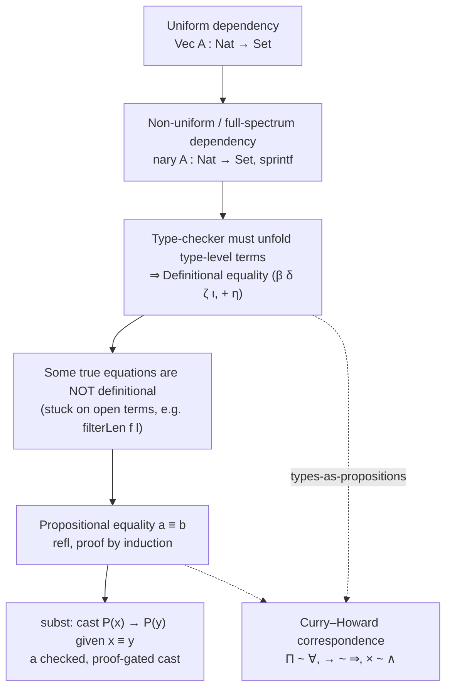

[[book-guidelines|↩ Back to guidelines]]

## Why a type system needs to "depend" on anything at all

A type system is a language's grammar, not an optional lint pass — the book is emphatic about this from its first paragraph. A parser rejects mismatched parentheses; a type-checker rejects `1 + "hi"` for the same structural reason: there is no way to evaluate it successfully, and the checker is refusing to run a program it can already see is nonsense. That framing matters, because it tells you what a *dependent* type system is for: not "extra safety," but a grammar expressive enough to rule out more nonsense programs without also rejecting the correct ones.

Ordinary types already buy you some of this. `Nat`, `String`, `A → B` partition well-formed expressions into sets by what they compute. But a type like `List A` — lists of `A`s — is already a small step past that: it's a *type parameterized by a type*, the same way a generic function is a *term parameterized by a type*. Push that one step further and you get *dependent* types: types parameterized not by other types, but by ordinary terms. `Vec A n`, the type of length-`n` vectors of `A`, is a family of types indexed by a natural number `n : Nat`. This single move — letting a term appear inside a type — is the entire subject of the chapter, and everything else (definitional equality, Curry–Howard, propositional equality, `subst`) is downstream machinery needed to make that move actually work.

## Uniform versus non-uniform dependency

### The easy case: uniform dependency

Start with `Vec`:

```agda
data Vec (A : Set) : Nat → Set where
  []   : Vec A 0
  _::_ : {n : Nat} → A → Vec A n → Vec A (suc n)
```

`Vec A : Nat → Set` is a *function* from naturals to types. But notice what it does *not* do: it never pattern-matches on `n` to switch what *kind* of type it produces. `Vec A 0` and `Vec A 5` are both "the vector type, instantiated at a length" — same head constructor, different index. The book calls this **uniform dependency**: the top-level shape of the type family doesn't vary across the index, only its "size."

This is exactly the shape Rust's const generics were built for:

```rust
struct Vec<T, const N: usize>([T; N]); // wait — arrays already do this natively:
// [T; N] IS Vec<T, N>: a type parameterized by a runtime-erased, compile-time term.

fn head<T, const N: usize>(v: [T; N]) -> T where [(); N - 1]: Sized {
    // N appears in the *type*, not just the value — this is Rust doing uniform
    // dependent typing, restricted to arithmetic over `usize`.
    v[0]
}
```

Rust's const generics are a genuine (if narrow) instance of uniform term-dependency: `[T; N]` really is a family of types indexed by a term `N`, and the compiler really does need to reason about *equality of index expressions* (`N + M` vs `N_PLUS_M`) to type-check code across them — this is a live pain point in Rust today, and it's a miniature of exactly the problem Section 1.1 is building up to. Dependent ML and Liquid Haskell generalize this idea into full **refinement types** — you don't get a real dependent type former, but you can attach an arithmetic predicate to an existing type, e.g. `{l : List A | length l = n}`, and discharge the constraint with an SMT solver instead of the type-checker itself. That buys you `head`/`tail` safety cheaply, but — and this is the chapter's pivot point — refinement types are a *subset* discipline layered on top of ordinary types, so they can only express dependencies expressible as decidable arithmetic constraints over an otherwise fixed, non-dependent type skeleton.

### The hard case: non-uniform (full-spectrum) dependency

Here is where uniform dependency runs out. Consider a family of types indexed by a natural number whose *head constructor itself changes*:

```agda
nary : Set → Nat → Set
nary A 0       = A
nary A (suc n) = A → nary A n
```

`nary Nat 0` is `Nat`; `nary Nat 1` is `Nat → Nat`; `nary Nat 3` is `Nat → Nat → Nat → Nat`. These are not "the same type former at different sizes" — one is a base type, the rest are progressively deeper function types. A type theory that permits this — non-uniform, case-splitting term-indexed families of types — is said to have **full-spectrum dependency**, and this is what the book's title is actually about: not dependent types generally, but this maximal, unrestricted form of them.

This is precisely the wall Rust hits. There is no way to write `nary` in Rust, because Rust's type-level computation (const generics, associated types) can index *within* a fixed type shape but cannot branch on a value to decide whether the *resulting type is a function type at all*. You can fake a slice of this with enums and trait objects, but you lose exactly the thing that made `nary` interesting — the type-checker knowing, at compile time, how many curried arguments `apply` needs and what they are:

```agda
apply : {A : Set} {n : Nat} → nary A n → Vec A n → A
apply x        []        = x
apply f        (x :: xs) = apply (f x) xs
```

`apply _+_ (1 :: 2 :: [])` type-checks and evaluates to `3` because the type-checker unfolds `nary Nat 2` down to `Nat → Nat → Nat` *during type-checking*, not at runtime. Lean can express `nary` directly and natively, because Lean's kernel — like the theory this book develops — supports exactly this: types are first-class terms, and a function returning a type may pattern-match on its argument:

```lean
def nary (A : Type) : Nat → Type
  | 0     => A
  | n + 1 => A → nary A n

def apply {A : Type} : (n : Nat) → nary A n → Vector A n → A
  | 0,     x, ⟨#[], _⟩ => x
  | n + 1, f, v        => apply n (f v.head) v.tail
```

The chapter's `sprintf` example (Figure 1.1) pushes this further still: `args : List Token → Set` computes the *type* of `sprintf`'s remaining arguments by recursing over a *parsed format string*, so `sprintf "%s %u" : String → Nat → String` while `sprintf "%u" : Nat → String` — two calls to the same function with genuinely different arities and argument types, resolved entirely at the type level from a runtime string. No refinement-type system can express this, because the type of `sprintf s` isn't a subset of some fixed non-dependent type — it doesn't have a single non-dependent "shape" to refine at all.

## Definitional equality: what the type-checker is allowed to know for free

Full-spectrum dependency immediately creates an obligation: if `args (natTok :: toks)` unfolds to `Nat → args toks`, the type-checker needs to know that these two type *expressions* denote the *same type*, or nothing built on `nary`/`args`/`Vec` will ever type-check. This is **definitional equality** — the book's single most load-bearing concept for everything that follows in the book (it's the hinge Chapters 2–4 turn on: ETT vs. ITT is entirely a disagreement about what definitional equality is allowed to contain).

Two things make this harder than "just run the program":

1. **It has to work on open terms.** `filterLen f (x :: xs) = if f x then suc (filterLen f xs) else filterLen f xs` needs to be recognized as equal to its right-hand side even when `f`, `x`, `xs` are free variables — there's no value to evaluate to, only a rewrite step that's valid regardless of what those variables denote. Ordinary evaluation is a relation on *closed* terms; definitional equality generalizes it into a congruence that also fires under binders and on stuck neutral terms.
2. **It's not the type-checker's job to prove semantic truths — only syntactic ones.** The book is careful about this distinction (Remark 1.2.2): "for every closed instantiation, both sides evaluate to the same thing" is a *necessary* condition for a sound definitional equality, but taking that (undecidable, semantic) condition *as the definition* would make type-checking undecidable. Definitional equality is instead defined syntactically, as the congruence closure of $\beta\delta\zeta\iota$-reduction (function application, `let`/definition-unfolding, `let`-inside-`let`, and inductive-eliminator computation rules respectively), plus $\eta$-equivalence at some types. It is a *decidable, algorithmic under-approximation* of "provably equal," in exactly the same spirit as a type-checker's approximation of "does not go wrong."

This is, concretely, what a proof assistant's kernel spends most of its time doing. A small illustrative sketch of "symbolic reduce-to-normal-form-and-compare," which is the algorithmic content behind `isDefEq`:

```python
# Minimal illustration only — not load-bearing, just enough to see the shape
# of "reduce both sides, compare heads, recurse on subterms" that a real
# defeq checker (Lean's `isDefEq`, Coq's `conv`) implements with far more care
# around unification, universe constraints, and metavariables.
def whnf(t):            # weak-head-normal-form: unfold just enough to compare heads
    while is_redex(t):  # beta/delta/zeta/iota-reducible at the head
        t = step(t)
    return t

def defeq(a, b):
    a, b = whnf(a), whnf(b)
    if head(a) != head(b):
        return False
    return all(defeq(x, y) for x, y in zip(args(a), args(b)))
```

Lean's own kernel `isDefEq` is exactly this algorithm, scaled up: it's the function the elaborator calls every single time it needs to check that an expected type and an inferred type "are the same" — which, once dependent types are in play, is *every* application, not just an occasional cast. If you are building a checker or elaborator (as the standing project behind this vault is), this is the single piece of machinery you cannot skip or approximate: get `defeq` wrong and either sound programs get rejected or unsound ones get accepted.

## The Curry–Howard correspondence: types read twice

Once `_≡_` (propositional equality, next section) enters the picture, the book makes an observation that reframes everything seen so far: a function like

```agda
lemma : {A : Set} {n : Nat} → (l : Vec A n) → filterLen (λ l → false) l ≡ 0
lemma []        = refl
lemma (x :: xs) = lemma xs
```

is simultaneously a *program* (a recursive function computing, for any vector, a value of type `filterLen (λ l → false) l ≡ 0`) and a *proof by induction* (base case `[]`, inductive step `x :: xs` reusing the inductive hypothesis via the recursive call `lemma xs`). Type-checking the function's clauses **is** checking the inductive argument. This is the **Curry–Howard correspondence** (also: propositions-as-types, proofs-as-programs, the Brouwer–Heyting–Kolmogorov interpretation): three readings of the same syntax, not three different things bolted together.

The dictionary the chapter builds:

| Type former | Program reading | Logical reading |
|---|---|---|
| `(x : A) → B(x)` | dependent function | $\forall x{:}A.\ B(x)$ |
| `A → B` | (non-dependent) function | $A \implies B$ |
| `A × B` | pair | $A \land B$ |
| `a ≡ b` | proof term (not data) | the proposition "$a$ equals $b$" |

Why does `f : (x : A) → B(x)` mean $\forall x{:}A.\ B(x)$? Because to *have* such an `f` is to have, for every possible `x`, a proof/value of `B(x)` — which is exactly what universal quantification demands. Why does `A → B` mean $A \implies B$? Because to know $A$ is to hold a proof `p : A`, and `f p : B` then hands you a proof of `B` — implication elimination is literally function application. This isn't an analogy the book is drawing for pedagogical color; it's a theorem (Howard's, 1969) that the natural-deduction rules for intuitionistic logic and the typing rules for functions are *formally identical*.

Lean is where this correspondence is load-bearing rather than decorative — a Lean `theorem` and a Lean `def` are the same syntactic category, and `#print axioms` on a completed proof shows you the actual term the kernel type-checked:

```lean
theorem sucInjective {m n : Nat} : Nat.succ m = Nat.succ n → m = n
  | rfl => rfl  -- literally a function `succ m = succ n → m = n`
```

Rust's type system, by contrast, is *not* a logic in this sense (no dependent function types, so no way to state or prove $\forall x. P(x)$ as a type) — the closest Rust gets is trait bounds standing in for restricted propositions (`T: Ord` roughly reads as "there exists a proof that `T` is ordered"), which is suggestive but not the real correspondence. This is worth being explicit about, because it's exactly the gap a Rust-hosted verifier has to close some other way — either by embedding a genuine dependent core calculus (the route this book's own theories take) or by outsourcing propositions to an external prover, which is closer to the refinement-types-plus-SMT approach Section 1.1 already flagged as strictly weaker.

## Propositional equality and proof by induction

Definitional equality is powerful but *purely syntactic and untunable from inside the theory* — you cannot prove your way into two terms being definitionally equal; either the type-checker's fixed reduction rules connect them or they don't. Many true equations aren't reachable that way. `filterLen (λ x → false) l ≡ 0` is true for *every* vector `l`, but `filterLen` recurses on `l`, so when `l` is a variable there's nothing to unfold — no amount of symbolic evaluation closes the gap.

The fix is to make equality itself a *type*, so that establishing an equation becomes an ordinary matter of constructing a term:

$$
\_\equiv\_ : \{A : \mathrm{Set}\} \to A \to A \to \mathrm{Set} \qquad\qquad \mathrm{refl} : \{A : \mathrm{Set}\}\{x : A\} \to x \equiv x
$$

This is **propositional equality**: `refl` is the only constructor, so a term of type `a ≡ b` exists only when the theory can be convinced `a` and `b` coincide — and unlike definitional equality, that conviction can be assembled by *induction*, not just unfolded by *reduction*. The `lemma` above is the pattern in full: induct on `l`, discharge `[]` because `filterLen (λ l → false) [] ` reduces (definitionally!) to `0` so `refl` suffices, and discharge `x :: xs` by falling back on the inductive hypothesis, itself obtained by recursive call. Every non-trivial propositional-equality proof in the book has this shape — inductive proof rendered as structurally recursive program, checked by the same machinery that checks any other recursive function.

```lean
theorem filterLen_false {A : Type} {n : Nat} (l : Vector A n) :
    (l.filter (fun _ => false)).length = 0 := by
  induction l with
  | nil        => rfl                     -- definitional equality closes the base case
  | cons x xs ih => simpa using ih        -- inductive step reuses the IH, same as `lemma xs`
```

The crucial asymmetry to hold onto: `refl : x ≡ x` only type-checks when its two occurrences of `x` are already *definitionally* equal. Propositional equality doesn't replace definitional equality — it's built as a thin, provable-by-induction layer *on top of* it, precisely to cover the equations definitional equality's fixed reduction rules can't reach on their own.

## `subst`: casting along a proof instead of trusting the compiler

Now the payoff. Recall the motivating failure:

```agda
filterAll : {A : Set} {n : Nat} → Vec A n → Vec A 0
filterAll l = filter (λ x → false) l   -- does not type-check
```

The right-hand side genuinely has type `Vec A (filterLen (λ x → false) l)`, and `filterLen (λ x → false) l` is *not* definitionally equal to `0` (it's stuck on the variable `l`) — but it *is* propositionally equal to `0`, and `lemma l` is exactly the proof. What's needed is an operation that, given a proof `x ≡ y`, upgrades a value of type `P(x)` into a value of type `P(y)` — a **dependent casting operation**:

$$
\mathrm{subst} : \{A : \mathrm{Set}\}\{x\ y : A\} \to (P : A \to \mathrm{Set}) \to x \equiv y \to P(x) \to P(y)
$$

```agda
filterAll {A} l = subst (Vec A) (lemma l) (filter (λ x → false) l)
```

`subst` takes the *motive* `P` (here `Vec A`, the family we're casting along), the proof `lemma l : filterLen (λ x → false) l ≡ 0`, and a value of `P` at the old index; it hands back a value of `P` at the new index. Nothing runs at runtime beyond, in most formulations, an identity function once compiled away — the entire weight of the operation is discharged at type-checking time by the proof argument. That's the property worth dwelling on: `subst` is a cast that *cannot* go wrong the way `unsafe { std::mem::transmute(x) }` can in Rust. A Rust transmute changes how bits are *interpreted* on the programmer's unchecked say-so; `subst` changes how a term is *typed*, and only compiles if you hand it a machine-checked proof that the change is justified. It's the dependent-type analogue of a checked downcast, not an unchecked one — the "escape hatch" language of Remark 1.3.1 is apt precisely because it's a hatch with a lock, not a hole in the fence.

```lean
-- Lean's `▸` notation is literally this `subst`, and `Eq.mpr` is its
-- proposition-only specialization used to rewrite goals during a proof.
def filterAll {A : Type} {n : Nat} (l : Vector A n) : Vector A 0 :=
  (lemma l) ▸ (l.filter (fun _ => false))
```

One more wrinkle the book flags (foreshadowing the extensional/intensional split in Chapter 4): `subst` is itself subject to a definitional equation, `subst P refl x = x` — when the proof argument happens to be `refl` (i.e., the equality was already definitional), the cast should vanish rather than leaving inert machinery in the normal form. Whether a theory's `subst` actually satisfies this equation, and how expensive it is to check, is one of the central design questions the rest of the book spends 300 pages answering differently for extensional, intensional, and [[Cubical-Type-Theory|cubical type theory]].

## Structure of the chapter's argument



## Where this leads

This chapter deliberately stays informal and Agda-flavored so the reader has intuition in hand before Chapter 2 rebuilds all of it as a precise mathematical object — four judgments, an explicit substitution calculus, connectives defined by universal properties. Every concept introduced here reappears there with teeth: definitional equality becomes a formal judgment `Γ ⊢ a ≡ b : A` whose exact reduction rules are pinned down (Ch. 2–3); propositional equality gets a real type former — first `Eq` with **equality reflection** in extensional type theory, then the `Id`-type-plus-`J`-eliminator formulation once equality reflection is removed in Chapter 4 (which is precisely what makes definitional equality *decidable* again, at the cost of `subst`'s vanishing equation no longer holding freely); and the Curry–Howard correspondence returns as a genuine open question in Section 2.7 — *which* types deserve to count as propositions, and why `Σ`-types are not quite existential quantifiers.

For the compiler/elaborator project this vault is organized around (`type-theory` and `automated-reasoning`), this chapter is where the two load-bearing mechanisms first appear in recognizable form, ahead of their formal treatment:

- **Definitional equality is what a kernel's `isDefEq`/`whnf` loop computes.** Every application of a dependently-typed function in your elaborator will require exactly the "reduce both sides, compare heads, recurse" procedure sketched above — this is not optional machinery, it's the majority of what a dependent type-checker spends its time doing, and Chapter 3's metatheory (normalization structures, decidability of equality) is the formal account of when and why that procedure terminates and is complete.
- **`subst` is unification and elaboration's silent partner.** Every time your elaborator needs to reconcile an *expected* type with an *inferred* type that are equal but not syntactically identical, it is either falling back on definitional equality (free) or needs the user (or itself, via tactic/unification search) to supply a `subst`-shaped coercion (not free — it needs a proof). Recognizing which case you're in, automatically, is a large part of what bidirectional type-checking and metavariable unification exist to automate — both of which the book takes up properly starting in Chapter 3.
