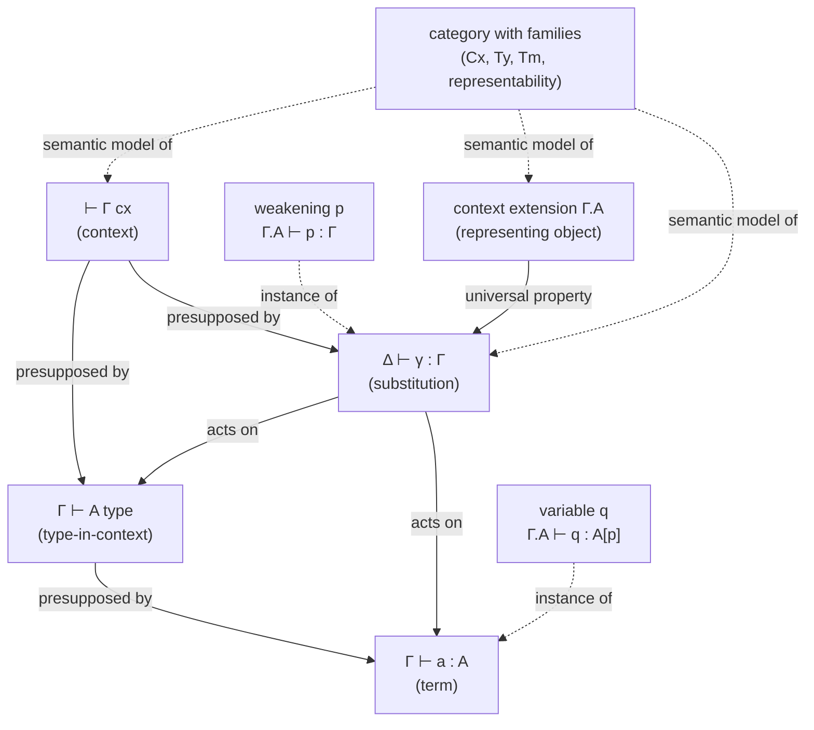

[[book-guidelines|↩ Back to guidelines]]

## Why judgments need a context, and why that breaks everything

In the simply-typed lambda calculus you can get away with something sloppy: define `A type` as a free-standing grammar, define `Γ ⊢ a : A` by induction on terms, and only afterward worry about which contexts `Γ` are legal. Gratzer's book does exactly this in Section 2.1, then spends the rest of Section 2.1.3 showing you the wreckage. The catch-all lemma you actually want —

$$\Gamma \vdash a : A \implies\ \vdash \Gamma\ \mathrm{cx} \ \text{ and } \ A\ \mathrm{type}$$

— fails to have an obvious proof, because the *base case* of the induction is the variable rule, and nothing forces `Γ` to even be well-formed at that point. The fix the book reaches for — add an explicit premise `⊢ Γ cx`, or just declare by convention that `Γ` always ranges over well-formed contexts — is a preview of a much bigger problem that appears the instant types are allowed to depend on terms.

Here is the problem in one sentence: **as soon as a type can mention a term variable, the judgment "`A` is a type" cannot be context-free.** Whether `Vec String (suc n)` is well-formed depends on whether `n : Nat` is available, which depends on the context, which is itself built from `Γ, x : A` pairs where `A` itself has to be well-formed *relative to* the context built so far. Contexts, types, and terms become simultaneously, mutually recursive — you cannot define any one of the three judgments

$$\vdash \Gamma\ \mathrm{cx} \qquad \Gamma \vdash A\ \mathrm{type} \qquad \Gamma \vdash a : A$$

without presupposing the other two are already meaningful. This is the actual reason full-spectrum dependent type theory needs a more careful judgmental apparatus than the STLC did — not pedantry, but a real well-definedness problem. Section 2.2–2.3 of the book is the resolution: instead of trying to define these judgments by a single simultaneous induction (painful, and the book says so explicitly — "rather than enduring proportionally more suffering, we will adopt a slightly different approach"), it promotes every context-shifting operation — weakening *and* substitution — to an explicit, rule-governed operation in the calculus itself. That explicitness is the substitution calculus, and it's the actual foundation every later chapter (connectives in 2.4, elaboration in Chapter 3, categories with families in Chapter 6) builds on.

## The five judgments, and the discipline of presuppositions

Once contexts and types are mutually dependent, the book fixes the ambiguity with a naming convention it calls **presuppositions** (Notation 2.2.1). The judgment `Γ ⊢ A type` is declared meaningful *only* when `⊢ Γ cx` already holds; `Γ ⊢ a : A` is meaningful only when `Γ ⊢ A type` (hence also `⊢ Γ cx`) already holds. Every later rule in the book implicitly carries these as unstated premises — if a rule's conclusion is `Γ, x:A ⊢ x : A[p]`, you're allowed to assume `⊢ Γ, x:A cx` is meaningful, i.e. that its presuppositions are already established elsewhere in the rule.

By the time the book reaches Section 2.3 it has stabilized into a fixed list of judgment forms — four basic, three "equality" companions (Notation 2.3.1):

| # | Judgment | Reads as | Presupposes |
|---|---|---|---|
| 1 | $\vdash \Gamma\ \mathrm{cx}$ | $\Gamma$ is a context | — |
| 2 | $\Delta \vdash \gamma : \Gamma$ | $\gamma$ is a substitution from $\Delta$ to $\Gamma$ | $\vdash \Delta\ \mathrm{cx}$, $\vdash \Gamma\ \mathrm{cx}$ |
| 3 | $\Gamma \vdash A\ \mathrm{type}$ | $A$ is a type in context $\Gamma$ | $\vdash \Gamma\ \mathrm{cx}$ |
| 4 | $\Gamma \vdash a : A$ | $a$ is a term of type $A$ in $\Gamma$ | $\vdash \Gamma\ \mathrm{cx}$, $\Gamma \vdash A\ \mathrm{type}$ |
| 2′,3′,4′ | equality versions ($\gamma = \gamma'$, $A = A'$, $a = a'$) | the two sides are judgmentally equal | both sides individually well-formed |

Judgment (2) — substitutions between contexts — is the one the STLC never needed, because in a non-dependent setting "moving a term from one context to another" is just renaming free variables. Once types depend on terms, that operation needs its own name, its own well-formedness conditions, and its own equational theory. That's the substitution calculus's namesake, and it's the subject of the rest of this article.

**What breaks without presuppositions as a discipline:** if you *don't* fix by convention which contexts each judgment quantifies over, rules like the variable rule become ill-typed at the meta level — you'd be asserting `Γ ⊢ x : A` for arbitrary `Γ`, including nonsensical ones, and every metatheorem (canonicity, decidability) you later try to prove by induction on derivations has to separately re-derive that its inductive hypothesis even type-checks. The presupposition convention front-loads that bookkeeping once, globally, instead of re-litigating it in every proof.

## Weakening as an explicit operation, not a lemma

Section 2.2 walks through a genuine catch-22 in trying to state the variable rule for dependent contexts. You want:

$$\dfrac{}{\Gamma, x:A \vdash x : A} \; ??$$

For this to be meta-well-typed under the presupposition convention, you need both `⊢ Γ,x:A cx` and `Γ,x:A ⊢ A type` to already hold. The first is fixable by adding premises `⊢ Γ cx` and `Γ ⊢ A type`. The second is the trap: `Γ ⊢ A type` does **not** imply `Γ,x:A ⊢ A type` — that's exactly a weakening lemma, and proving weakening as a *lemma* (by induction on the derivation of `Γ ⊢ A type`) requires it to already be available as a hypothesis inside that very induction, forcing one enormous simultaneous induction over well-formedness, weakening, and substitution all at once.

The book's resolution (and this is the crucial design choice of the whole chapter) is to **not** prove weakening as a derived lemma at all. Instead it adds explicit weakening as a first-class operation `−[p]` on types and terms:

$$\dfrac{\Gamma \vdash B\ \mathrm{type} \quad \Gamma \vdash A\ \mathrm{type}}{\Gamma, x:A \vdash B[\mathbf p]\ \mathrm{type}} \qquad \dfrac{\Gamma \vdash b : B \quad \Gamma \vdash A\ \mathrm{type}}{\Gamma, x:A \vdash b[\mathbf p] : B[\mathbf p]}$$

and *then* states the variable rule using that operation to patch the type:

$$\dfrac{\vdash \Gamma\ \mathrm{cx} \quad \Gamma \vdash A\ \mathrm{type}}{\Gamma, x:A \vdash x : A[\mathbf p]}$$

The type of the newly-bound `x` is not literally `A` but `A[p]` — `A`, weakened once to account for the extra variable in scope. To reach a variable further back in the context you compose weakenings: a variable that's `n` binders deep gets type `A[p]...[p]` (`n`-fold), and the book abbreviates the repeated application as `p^n`. This is not cosmetic — it's the mechanism that makes the *notation itself* self-documenting about how far back a variable sits.

**What breaks without this:** without an explicit weakening operation baked into the calculus, "the same variable" silently changes *type* as you move it across context boundaries (its type has to be reinterpreted in the bigger context), and nothing in the syntax records that reinterpretation happened. You'd need an external, unstated coercion at every use site — exactly the kind of hidden step that makes hand-written type-checkers buggy and makes formal metatheorems (which must track every step) unstatable.

## De Bruijn indices: deleting names, keeping precision

Once weakening is explicit and composable (`p^n`), the book notices a redundancy: a variable `x` used `n` levels down is written `x[p]...[p]` (`n` copies), and this expression encodes the variable's identity *twice* — once by the name `x`, once positionally by the count `n`. Section 2.2 draws the obvious conclusion: drop the names entirely. Contexts become anonymous lists of types, `Γ.A.B.C` (context extension `.` in place of named binders `Γ, x:A`), and there is a single, unambiguous name for "the most recently bound variable," which the book calls `q`. Any other variable is recovered positionally as `q[p^n]` — this *is* de Bruijn indexing [dBru72], and `n` is literally the de Bruijn index.

This isn't just an implementation trick — it's what lets the book delete an entire class of side-conditions. Named-variable presentations of substitution have to state "provided `x ≠ y`" or "provided `x` is not free in ..." conditions to avoid variable capture; those conditions are exactly the kind of thing that's easy to forget in an informal proof and easy to get wrong in an implementation. With de Bruijn indices, capture-avoidance is handled uniformly by the weakening/substitution equations themselves — there is no name to accidentally capture.

The trade-off, which the book is honest about (citing McBride's line about de Bruijn indices as a "Cylon detector" for who can tolerate them), is human readability: nobody wants to read `q[p][p][p]` in a worked example. So the book keeps named variables in prose and reserves de Bruijn form for the official rules — "translating between the two notations is purely mechanical."

## The calculus of substitutions proper

Section 2.3 generalizes weakening `p` (a substitution that adds one variable) to *arbitrary* substitutions `Δ ⊢ γ : Γ` — simultaneous, composable maps that can shrink a context (ordinary substitution), grow it (weakening), permute it, or duplicate/drop variables, all uniformly. The judgment `Δ ⊢ γ : Γ` is deliberately read as **"γ is a term of type Γ, in context Δ"** — contexts are treated as compound "types" whose "elements" are simultaneous assignments of terms to every variable in `Γ`, well-typed relative to `Δ`.

Substitution itself becomes two binary operations — one on types, one on terms — rather than a recursively-defined function on syntax:

$$\dfrac{\Delta \vdash \gamma : \Gamma \quad \Gamma \vdash A\ \mathrm{type}}{\Delta \vdash A[\gamma]\ \mathrm{type}} \qquad \dfrac{\Delta \vdash \gamma : \Gamma \quad \Gamma \vdash a : A}{\Delta \vdash a[\gamma] : A[\gamma]}$$

This is the "algebraic operation" framing the book's own guidelines flag: rather than defining `a[γ]` by structural recursion on `a` (the STLC style, where substitution is a *function*), the theory takes `−[γ]` as a *primitive constructor* subject to equations, the same way `+` on a ring is primitive and subject to axioms rather than "defined" in terms of something more basic. The equations that pin it down:

- **Category laws.** Contexts and substitutions form a category: `Γ ⊢ id : Γ` (identity), `Γ₂ ⊢ γ₀ ∘ γ₁ : Γ₀` (composition), both unital and associative. `A[id] = A` and `a[id] = a`; `A[γ₀ ∘ γ₁] = A[γ₀][γ₁]` and correspondingly for terms — substitution is a **presheaf** `Ty(−)` on the category of contexts, and `Tm(−, A)` a presheaf over its category of elements.
- **Terminal object.** The empty context `1` is terminal: any substitution `Γ ⊢ δ : 1` is forced to equal the unique empty tuple `!`.
- **Context extension / substitution extension.** A substitution into an extended context `Γ.A` decomposes uniquely as an `(n)`-tuple `γ₀ : Γ` plus one more term `a : A[γ₀]`, written `γ₀.a`:

$$\dfrac{\Delta \vdash \gamma : \Gamma \quad \Gamma \vdash A\ \mathrm{type} \quad \Delta \vdash a : A[\gamma]}{\Delta \vdash \gamma.a : \Gamma.A}$$

  governed by three equations: `p ∘ (γ.a) = γ` (dropping the last component recovers the rest), `q[γ.a] = a` (the last variable picks out exactly the adjoined term), and `γ = (p∘γ).q[γ]` (every substitution *is* some `γ₀.a` — this is the η-law for context extension, sometimes called the **surjective pairing** of substitutions).

Weakening `p : Γ.A ⊢ Γ` and the variable `q : Γ.A ⊢ A[p]` from the previous section are recovered as the special substitution and term generated by this machinery — `p` is literally `id ∘ p`-style projection out of `Γ.A`, and `q` is the "last component" of the identity substitution on `Γ.A`. Nothing new had to be introduced; Section 2.2's ad hoc fixes turn out to be instances of the general substitution-extension apparatus.

**What breaks without treating substitution algebraically:** if substitution is only ever a meta-level operation performed on the page (as in most intro treatments of the STLC), then every *equation* about how a connective interacts with substitution — "does `fst((a,b))[γ]` reduce the same way as `fst((a,b)[γ])`?" — has to be checked by hand, per connective, and re-verified whenever a new connective is added. Treating `−[γ]` as a primitive with fixed equations means each new type former only needs to state *its own* commutation-with-substitution law once, and the rest of the calculus (composition, identity) is inherited for free. This is precisely what makes Section 2.4's uniform "internalizing judgmental structure" story possible — it presupposes the substitution calculus is already airtight.

## Categories with families: the semantic residue of all these rules

The book closes Section 2.3 with a one-line but load-bearing observation: *all* of the rules just given — contexts and the terminal object, substitutions with identity/composition, context extension with its three governing equations — amount to describing a category (objects = contexts, morphisms = substitutions) equipped with extra representability structure. That extra structure has a name: a **category with families** (cwf) [Dyb96].

Concretely (this becomes fully precise only in Chapter 6, but the shape is already visible here): a cwf is a category `Cx` with a terminal object, together with presheaves `Ty` and `Tm` on `Cx` (types and terms, contravariant in substitution — which is exactly the `A[γ]`, `a[γ]` action above), such that context extension `Γ.A` satisfies a universal property making it the **representing object** for "substitutions into `Γ` paired with a term of type `A[−]`." That universal property is exactly Exercise 2.5's content: substitutions `Δ ⊢ γ : Γ.A` are in natural bijection with pairs `(γ₀ : Δ ⊢ Γ, a : Δ ⊢ A[γ₀])`. The equations governing `γ.a` in the syntax are *definitionally* the naturality/universal-property equations of that representability structure in the semantics.

This matters for two reasons. First, it's the reason the syntax was designed this way at all — the book is choosing rules that are *sound and complete* for cwf semantics by construction, not accidentally. Second, it is the bridge every later metatheoretic result crosses: Chapter 3's models of type theory, Chapter 6's coherence theorem relating cwfs to locally cartesian closed categories, and the canonicity gluing construction all operate on cwfs, not on raw syntax — because cwfs are precisely "whatever a model of these four judgments and their equations has to look like."



## Grounding: what this looks like as code

**Rust — de Bruijn terms and explicit substitution as a real data structure.** This is the part of the chapter most directly reusable as compiler code: a context-indexed term representation where weakening and substitution are operations you actually implement, not just reason about informally.

```rust
// Types and terms, de Bruijn-indexed — no variable names, matching
// Section 2.2/2.3's "q[p^n]" convention: `Var(n)` IS `q[p^n]`.
#[derive(Clone, Debug, PartialEq)]
enum Term {
    Var(usize),                 // de Bruijn index: 0 = nearest binder (q)
    Lambda(Box<Term>),
    App(Box<Term>, Box<Term>),
}

// A substitution Δ ⊢ γ : Γ, represented the way Section 2.3 builds one:
// either the identity, a weakening-by-one (`p` composed on), or an
// extension `γ.a` (push one more term onto an existing substitution).
#[derive(Clone, Debug)]
enum Subst {
    Id,
    Weaken(Box<Subst>),         // p ∘ γ  (shift everything up by one binder)
    Extend(Box<Subst>, Term),   // γ.a
}

// a[γ] — substitution as a primitive *operation*, defined once here,
// rather than re-derived per connective (mirrors the book's stance that
// substitution is algebraic, not merely a recursive function on syntax).
fn apply(subst: &Subst, term: &Term) -> Term {
    match (subst, term) {
        (Subst::Id, t) => t.clone(),                 // a[id] = a
        (s, Term::Var(0)) => lookup(s, 0),            // q[γ.a] = a
        (s, Term::Var(n)) => lookup(s, *n),
        (s, Term::Lambda(body)) => {
            // entering a binder: γ must itself be weakened and extended
            // with the new bound variable — this IS the γ.a / p machinery
            let extended = Subst::Extend(
                Box::new(Subst::Weaken(Box::new(s.clone()))),
                Term::Var(0),
            );
            Term::Lambda(Box::new(apply(&extended, body)))
        }
        (s, Term::App(f, a)) => Term::App(
            Box::new(apply(s, f)),
            Box::new(apply(s, a)),
        ),
    }
}

fn lookup(subst: &Subst, n: usize) -> Term {
    match (subst, n) {
        (Subst::Extend(_, a), 0) => a.clone(),        // q[γ.a] = a
        (Subst::Extend(rest, _), n) => lookup(rest, n - 1),
        (Subst::Weaken(rest), n) => shift(&lookup(rest, n), 1),
        (Subst::Id, n) => Term::Var(n),
    }
}

fn shift(t: &Term, by: usize) -> Term { /* implements −[p^by] */ unimplemented!() }
```

The `Extend`/`Weaken` split in `Subst` is a direct transcription of `γ.a` and `p`; `apply`'s `Lambda` case is doing exactly what the book's substitution-extension equations force: to push a substitution under a binder you weaken it (shift everything one level) and extend it with the fresh bound variable. This *is* the standard "lift" operation in any de Bruijn-based type-checker — you've now implemented it from the judgmental equations up, rather than copying it from a tutorial.

**Lean — the kernel's own de Bruijn representation.** Lean's `Expr` type is essentially this same design made load-bearing: `Expr.bvar (n : Nat)` is precisely `q[p^n]`, and the kernel's `Expr.instantiate`/`Expr.lift` are precisely the book's `γ.a` (extension, "plug a term for the last variable") and `p` (weakening, "shift free indices"). When Lean's elaborator produces a term under a binder and then needs to specialize it at a concrete argument, it is executing `a[id.t]` in this chapter's notation — literally the substitution-extension rule specialized to `γ = id`. Reading Section 2.3's rules *as* a specification for `Expr.instantiate` is not an analogy; it is the actual relationship between this chapter and any real dependently-typed kernel.

**Python — a five-line illustration of "substitution is not just evaluation."** Useful for seeing the shape without Rust's ceremony:

```python
def subst(term, depth, replacement):
    # term[replacement / var(depth)], purely structural — no evaluation
    match term:
        case ("var", n) if n == depth:
            return replacement
        case ("var", n):
            return term
        case ("lam", body):
            return ("lam", subst(body, depth + 1, shift(replacement, 1)))
        case ("app", f, a):
            return ("app", subst(f, depth, replacement), subst(a, depth, replacement))
```

Notice this sketch is exactly the STLC-style "substitution as a recursive function on terms" the book explicitly moves *away* from in Section 2.3 — it's shown here so the contrast with the Rust/`Subst`-as-data version above is concrete: one hard-codes the recursion; the other reifies substitutions as first-class values with their own equational theory, which is what lets a real type-checker cache, compose, and reason about substitutions instead of just running them.

## Where this leads

This chapter's apparatus is not a formality that Section 2.4 politely sets aside — it is the vocabulary Section 2.4 is written in. Every connective the book introduces next (`Π`, `Σ`, `Eq`, `Unit`, and later the inductive types) is defined by stating a formation/introduction/elimination rule *and* proving it respects `−[γ]` — the "internalizing judgmental structure" slogan only makes sense once judgments, contexts, and substitution are this precise. Chapter 3's elaboration algorithm operates on exactly these four judgments, now given algorithmic (`⇝`) readings. Chapter 6 takes the cwf sketched above and makes it the official definition of a model, proving the syntax built here is the *initial* one.

For the compiler-and-elaborator project this vault is tracking: this topic is the direct ancestor of two load-bearing pieces of machinery. First, **judgment forms and typing rules are the shared ancestor of "a type checker" and "a proof checker"** — the four judgments here (`cx`, `type`, `term`, `subst`) are not type-theory-specific; a Hoare-logic verification-condition generator is checking the exact same shape of judgment (context validity, well-formed assertions, well-typed proof terms) over a different signature. Second, **substitution and context management are the recurring plumbing under both elaboration and Hoare-triple soundness** — the `Subst`/`apply` machinery above, generalized, is what a metavariable unifier needs to instantiate metavariables soundly, and what a verification-condition generator needs to substitute program state into a postcondition without capturing a bound variable. Both threads are tagged `type-theory` and `automated-reasoning` in this vault's learning goals for exactly this reason: the substitution calculus is where "type checker" and "proof checker" turn out to be the same piece of code wearing different notation.
