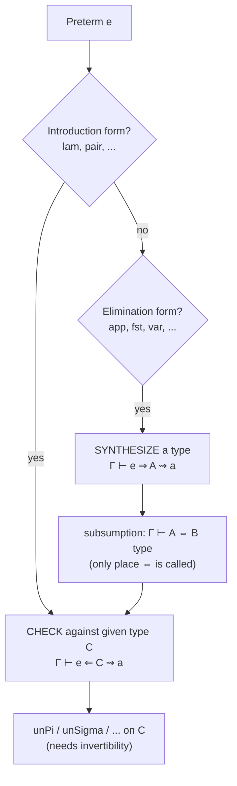
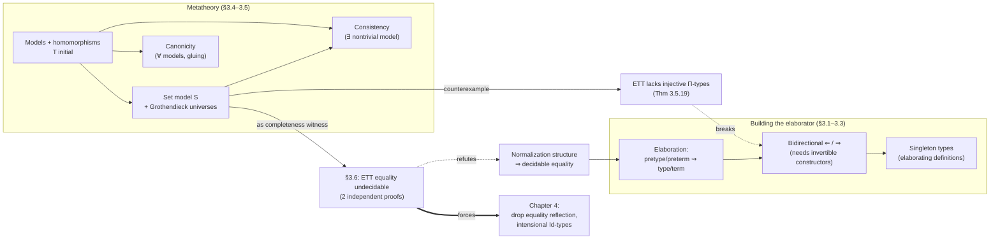

# Metatheory and Implementation of Type Theory

↩ [[book-guidelines|Back to guidelines]]

## The gap between a definition and an implementation

Chapter 2 defined Martin-Löf type theory the way an algebraist defines a group: as a family of sets $\mathrm{Ty}(\Gamma)$, $\mathrm{Tm}(\Gamma,A)$, $\mathrm{Cx}$, $\mathrm{Sb}(\Delta,\Gamma)$ equipped with operations ($\Pi$, $\Sigma$, weakening, substitution…) satisfying equations. That perspective is precise, but it is not something you can hand to a computer. A term $\lambda(b)$ in that world is a *particular mathematical element* of a particular set $\mathrm{Tm}(\Gamma,\Pi(A,B))$ — it presupposes that $\Gamma$, $A$, $B$ already exist and are well-formed. A type-checker cannot start from that presupposition. It starts from a string, or at best an unchecked syntax tree, and has to *decide whether it names anything at all*.

This is the chapter's real subject: not new type formers, but the machinery that turns the mathematics of Chapter 2 into an algorithm, and the theorems that machinery needs to be sound. Gratzer's own framing (Slogan 3.1.1) is blunt: **proof assistants are fancy type-checkers.** Everything else — tactics, unification, elaboration of implicit arguments — is sugar around a decision procedure for "is this input a well-typed term of this type." The chapter builds that decision procedure layer by layer, discovers the metatheorems it silently depends on (normalization, invertibility, consistency, canonicity), and ends by *proving two of ETT's variants of these theorems false* — the crack that forces the move to intensional type theory in Chapter 4.

If you are building an elaborator with a metavariable unifier (the `type-theory` / `automated-reasoning` project this vault is organized around), this chapter *is* the specification of the trusted core underneath that project: the algorithmic judgments here are what your kernel executes, and the models/canonicity apparatus is how you'd argue that kernel is sound.

---

## 1. Elaboration: type-checking is a partial function out of untyped syntax

**What breaks without this distinction.** If you conflate "the type $A$" with "the string the user wrote," you get a type error at the meta-level: types and terms are mathematical objects (elements of $\mathrm{Ty}(\Gamma)$), while a user's input is a string or an abstract syntax tree that only *possibly* denotes one. Type-checking, therefore, cannot be a membership query ("is $A$ a type?") — it has to be a partial function from untyped syntax into the sets of genuine types and terms. The book calls this process **elaboration**, and restates Slogan 3.1.1 more sharply as Slogan 3.1.4: *type-checkers for dependent type theory are elaborators.*

The book fixes a minimal grammar of **pretypes** $\tau$ and **preterms** $e$ (Figure 3.1) — s-expressions like `(Pi τ τ)`, `(lam τ τ e)`, `(app τ τ e e)` — and defines elaboration as two algorithmic judgments:

$$
\Gamma \vdash \tau\ \mathrm{type} \rightsquigarrow A \qquad \Gamma \vdash e : A \rightsquigarrow a
$$

read "elaborating pretype $\tau$ in context $\Gamma$ succeeds and produces the real type $A$," and "elaborating preterm $e$ against expected type $A$ succeeds and produces the real term $a$." These are *deterministic* — the book takes care that each judgment instance is derivable by at most one rule, i.e. the rules define a genuine (partial) function, not a search space.

Pretype elaboration is a direct translation of Chapter 2's formation rules:

$$
\frac{\Gamma \vdash \tau_0\ \mathrm{type} \rightsquigarrow A \quad \Gamma.A \vdash \tau_1\ \mathrm{type} \rightsquigarrow B}{\Gamma \vdash (\mathtt{Pi}\ \tau_0\ \tau_1)\ \mathrm{type} \rightsquigarrow \Pi(A,B)}
$$

Preterm elaboration is where the real difficulty appears. Elaborating `(lam τ0 τ1 e)` against an expected type $C$ means: elaborate $\tau_0 \rightsquigarrow A$, then $\tau_1 \rightsquigarrow B$ in the extended context, then $e \rightsquigarrow b$ against $B$ — and *only then* check that the annotation-derived type $\Pi(A,B)$ actually agrees with the type $C$ the caller expected:

$$
\frac{\Gamma \vdash \tau_0\ \mathrm{type} \rightsquigarrow A \quad \Gamma.A \vdash \tau_1\ \mathrm{type} \rightsquigarrow B \quad \Gamma.A \vdash e : B \rightsquigarrow b \quad \Gamma \vdash C = \Pi(A,B)\ \mathrm{type}}{\Gamma \vdash (\mathtt{lam}\ \tau_0\ \tau_1\ e) : C \rightsquigarrow \lambda_{\Gamma,A,B}(b)}
$$

That last premise, $\Gamma \vdash C = \Pi(A,B)\ \mathrm{type}$, is where "type-checking" actually happens — and it is where the trouble starts. If $C := \mathrm{El}(c)$ for some universe code $c$, deciding this equality requires *rewriting along the entire equational theory of terms*, possibly unboundedly far, before the two sides can even be compared head-to-head. Section 3.2 is entirely about making that equality check terminate.

**Rust [[Categorical-Semantics-of-Type-Theory#Grounding|grounding]].** The elaborator is a mutually recursive pair of functions over an AST enum — almost exactly what you'd write for any typed IR lowering pass:

```rust
enum Preterm { Var(usize), Lam(Box<Pretype>, Box<Pretype>, Box<Preterm>), App(..), /* … */ }

fn elab_ty(ctx: &Ctx, tau: &Pretype) -> Result<Type, ElabError> { /* Fig. 3.1, syntax-directed */ }

fn elab_tm(ctx: &Ctx, expected: &Type, e: &Preterm) -> Result<Term, ElabError> {
    match e {
        Preterm::Lam(tau0, tau1, body) => {
            let a = elab_ty(ctx, tau0)?;
            let b = elab_ty(&ctx.extend(a.clone()), tau1)?;
            let b_term = elab_tm(&ctx.extend(a.clone()), &b, body)?;
            check_ty_eq(ctx, expected, &Type::pi(a.clone(), b.clone()))?; // the hard step
            Ok(Term::lam(a, b, b_term))
        }
        // ...
    }
}
```

**Lean grounding.** This *is* what `Lean.Meta.isDefEq` plus `Lean.Elab.Term.elabTerm` are doing under the hood: `elabTerm e (expectedType? := some C)` recursively elaborates subterms and, exactly at the point the book's `lam` rule does, calls into `isDefEq` to reconcile the synthesized type with the expected one. Reading this section is close to reading a specification of Lean's elaborator's control flow before metavariables are added.

---

## 2. Normalization structures: the decidability of type equality

The type-equality check above is only *semidecidable* for free — derivation trees are recursively enumerable, so you can always search for a proof of $\Gamma \vdash A = B\ \mathrm{type}$, but a search that might never terminate is not an implementation strategy (Remark 3.2.2). What you actually need is a positive decision procedure, and the book isolates exactly the condition that suffices:

> **Definition 3.2.3.** A **normalization structure** for a type theory is a pair of *computable, injective* functions $\mathrm{nfTy} : \mathrm{Ty}(\Gamma) \to \mathbb{N}$ and $\mathrm{nfTm} : \mathrm{Tm}(\Gamma,A) \to \mathbb{N}$.

(In practice you'd target a discrete set of normal-form ASTs rather than literally $\mathbb{N}$, then Gödel-number them — the choice of $\mathbb{N}$ is just a canonical "any countable set with decidable equality.") Given such a structure, algorithmic equality is definitionally simple:

$$
\Gamma \vdash A \Leftrightarrow B\ \mathrm{type} \iff \mathrm{nfTy}(A) = \mathrm{nfTy}(B) \qquad \Gamma \vdash a \Leftrightarrow b : A \iff \mathrm{nfTm}(a) = \mathrm{nfTm}(b)
$$

**Why this is not overkill.** *Computability* gives you a terminating algorithm; *injectivity* gives you completeness — if the normal forms agree, the original types/terms were declaratively equal, because two different equivalence classes never collide. Soundness (equal terms get equal normal forms) is free, because $\mathrm{nfTy}$ is a genuine function *out of* $\mathrm{Ty}(\Gamma)$, the already-quotiented set of types-modulo-equality. Exercise 3.3 sharpens this into a biimplication: decidable judgmental equality and the existence of a normalization structure are equivalent (modulo some classical reasoning, e.g. Markov's principle) — this is not a convenient sufficient condition, it is *the* condition.

A natural question — why not just orient every equation ($\mathrm{fst}(\mathrm{pair}(a,b)) \leadsto a$, etc.) into a rewriting system and check confluence/termination? Remark 3.2.6 flags the obstruction directly: $\eta$-rules resist a canonical orientation. Which direction should $p \leftrightsquigarrow \mathrm{pair}(\mathrm{fst}(p),\mathrm{snd}(p))$ go? This is exactly why deciding equality for real dependent type theories needs a type-*directed* algorithm — **normalization by evaluation** (NbE) — rather than an untyped term-rewriting engine.

**Where this bites (foreshadowing §3.6):** the book flags upfront (Warning 3.2.5) that *extensional* type theory does **not** admit a normalization structure at all. Every construction in this section is provisional, pending Chapter 4's fix.

---

## 3. Bidirectional type-checking: checking vs. synthesis, and why invertibility matters

Assume normalization holds. The elaborator from §3.1 still has a usability problem: every application `(app τ0 τ1 e0 e1)` needs both the domain *and* codomain of its $\Pi$-type spelled out by hand. **Bidirectional type-checking** removes almost all of this redundancy by splitting elaboration into two mutually recursive judgments instead of one:

$$
\Gamma \vdash e \Leftarrow A \rightsquigarrow a \quad (\text{"check } e \text{ against } A\text{"}) \qquad \Gamma \vdash e \Rightarrow A \rightsquigarrow a \quad (\text{"synthesize } A \text{ from } e\text{"})
$$

The organizing principle (Slogan 3.2.7): **types are checked in introduction rules, and synthesized in elimination rules.** A variable's type lives in the context, so it synthesizes for free — no equality check needed at all:

$$
\frac{\Gamma = \Gamma'.A_i.\dots.A_0}{\Gamma \vdash (\mathtt{var}\ i) \Rightarrow A_i[\mathbf{p}^{i+1}] \rightsquigarrow \mathbf{q}[\mathbf{p}^i]}
$$

But `lam` has no type to synthesize from — you can't know what to add to the context without already knowing the domain. So `lam` is check-only, and it needs to recover $A,B$ from the given type $C$ rather than compute them from annotations. This is exactly the point where **injectivity** and **invertibility** of type formers become load-bearing:

> **Definition 3.2.8.** Injective $\Pi$-types: $\Gamma \vdash \Pi(A,B) = \Pi(A',B')\ \mathrm{type}$ implies $\Gamma \vdash A = A'\ \mathrm{type}$ and $\Gamma.A \vdash B = B'\ \mathrm{type}$.
>
> **Definition 3.2.9.** Invertible $\Pi$-types: injective, *plus* a computable function that either produces the unique $(A,B)$ witnessing $\Gamma \vdash C = \Pi(A,B)\ \mathrm{type}$, or reports that no such pair exists.

Injectivity alone isn't enough for an algorithm — you also need to be able to *compute* the inverse, not merely know it's unique. In practice, invertibility falls out almost automatically once you have normal forms: normalize $C$, pattern-match its head constructor, and project the components straight out of `TyNf`. With an `unPi` oracle in hand, the rules snap into place:

$$
\frac{\mathrm{unPi}(C) = (A,B) \quad \Gamma.A \vdash e \Leftarrow B \rightsquigarrow b}{\Gamma \vdash (\mathtt{lam}\ e) \Leftarrow C \rightsquigarrow \lambda(b)} \qquad \frac{\Gamma \vdash e_0 \Rightarrow C \rightsquigarrow f \quad \mathrm{unPi}(C) = (A,B) \quad \Gamma \vdash e_1 \Leftarrow A \rightsquigarrow a}{\Gamma \vdash (\mathtt{app}\ e_0\ e_1) \Rightarrow B[\mathrm{id}.a] \rightsquigarrow \mathrm{app}(f,a)}
$$

Notice `lam` has *no* synthesis rule — which means a bare $\beta$-redex `(app (lam e0) e1)` is unelaborable: you cannot synthesize `(lam e0)`. The book's fix, `(chk e τ)`, is a single deliberate annotation escape hatch that lets a checkable term become synthesizable by re-elaborating the annotation. And there is exactly one place the two directions cross over — the subsumption/catch-all rule, used only when no other rule applies:

$$
\frac{\Gamma \vdash e \Rightarrow B \rightsquigarrow a \quad \Gamma \vdash A \Leftrightarrow B\ \mathrm{type}}{\Gamma \vdash e \Leftarrow A \rightsquigarrow a}
$$

This is the *only* rule in the whole bidirectional elaborator that still calls the algorithmic equality decision from §3.2 — everything else was purchased precisely to avoid needing it.

**Load-bearing for the project.** This checked/synthesized split is the direct ancestor of implicit-argument elaboration. Once you allow "I don't yet know this type/term," you replace `unPi` failing outright with *deferring* an equation by introducing a **metavariable** and solving it later via unification — this is precisely the seam where Miller's pattern-unification fragment enters a real elaborator (Lean, Agda). The book stays with total, first-order `unPi`; a metavariable-based elaborator generalizes exactly this rule.



**Lean grounding.** Bidirectional flow is exactly `elabTerm` (checking mode, `expectedType? = some _`) vs. `elabTermEnsuringType`/synthesis mode (`expectedType? = none`) in Lean's elaborator; the `(e : T)` ascription is a first-class analogue of `(chk e τ)`.

---

## 4. Singleton types: elaborating `let` without breaking normalization

**What breaks without this.** Naively adding definitions `def i : τ_i = e_i` to the elaborator by treating each `def_i` as an ordinary fresh variable of type $A_i$ *loses the fact that the variable equals its definiens*. Concretely: `const : Nat := 2` elaborates fine, but then `proof : const ≡ 2 := refl` fails, because in the extended context `const` is just an opaque variable of type `Nat` — nothing says it reduces to `2`. (Remark 3.3.1: "`let` is no longer $\lambda$" — the classical $(\lambda x.b)\,a$ encoding of `let x = a in b` throws away exactly the fact you need.)

The book's fix avoids adding a primitive "defined variable" context former; instead it adds a new *type former*, the **singleton type** $\mathrm{Sing}(A,a)$, whose terms are exactly the elements of $A$ that are equal to $a$:

$$
\iota_{\Gamma,A,a} : \mathrm{Tm}(\Gamma,\mathrm{Sing}(A,a)) \cong \{b \in \mathrm{Tm}(\Gamma,A) \mid b = a\}
$$

with rules

$$
\frac{\Gamma \vdash a : A}{\Gamma \vdash \mathrm{Sing}(A,a)\ \mathrm{type}} \qquad \frac{\Gamma \vdash a : A}{\Gamma \vdash \mathrm{in}(a) : \mathrm{Sing}(A,a)} \qquad \frac{\Gamma \vdash s : \mathrm{Sing}(A,a)}{\Gamma \vdash \mathrm{out}(s) : A} \qquad \Gamma \vdash \mathrm{out}(s) = a : A
$$

A variable of type $\mathrm{Sing}(A,a)$ thus gives you `out(q) : A[p]` that is *judgmentally* equal to `a[p]` — you get a defined variable "for free," without touching the substitution calculus. (Remark 3.3.2: in ETT you could define $\mathrm{Sing}(A,a) := \Sigma(A, \mathrm{Eq}(A[\mathbf p],\mathbf q,a[\mathbf p]))$ using equality reflection, but singleton types also work as a primitive in theories *without* reflection — which is exactly why Chapter 4 keeps them.)

The elaborator extension threads a second environment $\Theta$ tracking which context slots are ordinary locals vs. declarations, elaborates each declaration into $\mathrm{Sing}(A_1,a_1)$ before moving to the next, and splits the variable rule so a reference to a declaration comes back wrapped in `out(−)`:

$$
\frac{\Gamma; \Theta \vdash \tau_1 \Leftarrow \mathrm{type} \rightsquigarrow A_1 \quad \Gamma; \Theta \vdash e_1 \Leftarrow A_1 \rightsquigarrow a_1 \quad \Gamma.\mathrm{Sing}(A_1,a_1); \Theta.\mathtt{decl} \vdash (\mathtt{decls}\ \dots) \ \mathrm{ok}}{\Gamma; \Theta \vdash (\mathtt{decls}\ (e_1\ \tau_1)\ \dots)\ \mathrm{ok}}
$$

**Grounding.** This is the type-theoretic version of a compiler's constant-folding/reference-transparency invariant: a `let`-bound name isn't just typed, it carries an *unfolding obligation* the definitional-equality checker must honor. In Lean/Rocq terms, `Sing(A,a)` is the mechanism underneath `def`/`let` unfolding during `isDefEq` — it's why a Lean kernel can `rfl`-prove `const = 2` even though `const` is "just a variable" at the surface.

---

## 5. Models, homomorphisms, and the syntactic model as initial

Having pinned down elaboration, the chapter turns to metatheorems that don't matter for building a type-checker per se, but matter for everything a type-checker is *for* (logic, program extraction). The tool for proving them is model theory. Because Chapter 2 phrased type theory's rules as a family of sets with structure-preserving operations, it is literally a **generalized algebraic signature** — and any implementation-like structure satisfying the same signature is a **model**:

> **Definition 3.4.2 (model).** $\mathcal M$ consists of sets $\mathrm{Cx}_\mathcal M$, $\mathrm{Sb}_\mathcal M(\Delta,\Gamma)$, $\mathrm{Ty}_\mathcal M(\Gamma)$, $\mathrm{Tm}_\mathcal M(\Gamma,A)$, an empty context, context extension, $\Pi_\mathcal M$, and every other operation in Appendix A — subject to all the same equations.
>
> **Definition 3.4.3 (homomorphism).** $f : \mathcal M \to \mathcal N$ is a family of functions on each of these sets commuting with every operation ($\mathrm{Cx}_f(\mathbf 1_\mathcal M) = \mathbf 1_\mathcal N$, etc.)

The syntax of Chapter 2 itself — $\mathrm{Cx}, \mathrm{Sb}, \mathrm{Ty}, \mathrm{Tm}$ with their operations — is *tautologically* a model, the **syntactic model** $\mathcal T$. And it is the smallest one possible:

> **Theorem 3.4.5.** $\mathcal T$ is **initial**: for every model $\mathcal M$ there exists a *unique* homomorphism $\mathcal T \to \mathcal M$.

Remark 3.4.6 reads this as a soundness/completeness pair for free: the map $\mathcal T \to \mathcal M$ is soundness (syntax interprets into any semantics); the fact that syntax itself is a model expresses completeness (anything true of *every* model is true of $\mathcal T$, since $\mathcal T$ is one). This mirrors $\mathbb N$'s initiality among $(1 \sqcup {-})$-algebras from Chapter 2 — type theory's syntax is "generated by its constructors" in exactly the same sense the naturals are generated by zero and successor.

**Grounding.** For a Rust/functional-programmer's ear: this is the *initial-algebra-as-free-construction* pattern, generalized. An AST datatype is the initial algebra of its constructor signature; a fold/catamorphism out of it is exactly "the unique homomorphism into any other algebra satisfying the same equations." $\mathcal T \to \mathcal M$ is a fold — and the fact that it's *unique*, not just *some* map, is what makes model-existence arguments (§5–7) work: you get to invent whatever convenient $\mathcal M$ you like, and initiality hands you a canonical comparison map into the real syntax for free, with no further proof obligation.

---

## 6. Consistency and canonicity

Two metatheorems concern only *closed* terms (empty context) and matter for type theory's use as a logic/programming language, but are not needed for a bare type-checker:

> **Definition 3.4.1.** Consistent: no closed term $\mathbf 1 \vdash a : \mathrm{Void}$.
>
> **Definition 3.4.9.** Canonicity: every closed $\mathbf 1 \vdash b : \mathrm{Bool}$ is judgmentally *either* $\mathrm{true}$ *or* $\mathrm{false}$, never both.

**Consistency is cheap to prove: exhibit any nontrivial model at all.**

> **Theorem 3.4.7.** If some model $\mathcal M$ has $\mathrm{Tm}_\mathcal M(\mathbf 1_\mathcal M, \mathrm{Void}_\mathcal M) = \varnothing$, type theory is consistent.

*Proof sketch:* initiality gives a homomorphism $\mathcal T \to \mathcal M$; applying it to a hypothetical closed term of `Void` would produce an element of an empty set — contradiction. One existential witness settles it for every model, including $\mathcal T$.

**Canonicity is a different shape of claim entirely** — it's a *universal* constraint over every model (Remark 3.4.13), not a fact witnessed by one. Exercise 3.9 makes this concrete: a model $\mathcal M$ with exactly two elements in $\mathrm{Tm}_\mathcal M(\mathbf 1,\mathrm{Bool})$ does **not** let you replay the consistency argument, because you need to show any closed Boolean *actually maps to* `true` or `false` under the homomorphism $\mathcal T \to \mathcal M$ — an ordinary model gives you a map, not a guarantee about which fiber a given syntactic term lands in. Canonicity needs a **gluing model**: a model constructed by *pairing* syntactic objects with data explaining how to place them in canonical form — a displayed model over $\mathcal T$ itself, not an independent one. (Theorem 3.4.12 defers the actual proof to the Artin-gluing construction of §6.6; this chapter only states the result: **extensional type theory enjoys canonicity**.)

```
                       CONSISTENCY                              CANONICITY
                  (existential over models)                (universal over models)

     ┌─────────────┐        f         ┌──────┐      every model M constrains
     │  T (syntax) │ ───────────────► │  M   │       which fiber a closed b:Bool
     └─────────────┘   (initiality)   └──────┘       lands in — a single arbitrary
            │                          any M with            M does not suffice;
            │ hypothetical             Tm(1,Void)=∅           need a GLUING model
            ▼                          is enough               displayed over T
     a : Void  ↦  f(a) ∈ ∅  ⇒  ⊥
```

Canonicity is what turns definitional equality into an *interpreter*: it guarantees a terminating decision of whether a closed Boolean is `true` or `false` (constructively, the proof itself is the algorithm; classically, Markov's principle plus recursive enumerability of derivations gives you the algorithm). This is the theorem underneath **program extraction** (Rocq/Agda emitting OCaml/Haskell) and **realizability-topos** models where closed `Bool` terms literally are Turing-machine equivalence classes — canonicity is the soundness argument for treating the kernel as computationally faithful, which is exactly the "proof-producing architecture" property a trusted kernel needs.

---

## 7. The set model: circumventing "the set of all sets" with Grothendieck universes

Section 3.4 promised consistency "by exhibiting a nontrivial model." Section 3.5 builds the actual witness $\mathcal S$: contexts as sets, substitutions as functions, types as indexed families of sets, terms as indexed families of elements. The obstruction is immediate — $\mathrm{Cx}_\mathcal S$ "should" be the collection of *all* sets, but Russell's paradox rules that out. The fix is the same move Chapter 2 made for $\mathcal U : \mathcal U$ (Girard's paradox): approximate "all sets" by a *set that is closed under the operations of set theory* without containing itself.

> **Definition 3.5.1 (Grothendieck universe).** A set $\mathcal V$ with: $\varnothing \in \mathcal V$; transitivity ($X \in \mathcal V, Y \in X \Rightarrow Y \in \mathcal V$); closed under powersets; closed under indexed unions; $\mathbb N \in \mathcal V$.

These four/five closure conditions bootstrap essentially every other set-theoretic construction — Lemma 3.5.2 derives closure under subsets, binary unions, products, function spaces, and both indexed coproducts and indexed products, purely from the primitive closures. And crucially, existence of Grothendieck universes is *independent* of ZFC but *consistent* to assume (equivalent to a strongly inaccessible cardinal — a mild large-cardinal axiom, yet strong enough that $\mathrm{ZFC}+\mathcal V \vdash \mathrm{Con}(\mathrm{ZFC})$; by Gödel this is *why* building this model necessarily needs a metatheory strictly stronger than type theory itself, Remark 3.5.4).

Just as Chapter 2 needed a hierarchy $\mathcal U_0, \mathcal U_1, \dots$ rather than one universe, modeling $n$ type-theoretic universes needs $n{+}1$ nested Grothendieck universes (Theorem 3.5.20); the book fixes an $(\omega{+}1)$-hierarchy $\mathcal V_0 \in \cdots \in \mathcal V_\omega$ (Axiom 3.5.6) and builds:

$$
\mathrm{Cx}^\mathcal S := \mathcal V_\omega \qquad \mathrm{Sb}^\mathcal S(\Delta,\Gamma) := \Delta \to \Gamma \qquad \mathrm{Ty}^\mathcal S(\Gamma) := \Gamma \to \mathcal V_\omega \qquad \mathrm{Tm}^\mathcal S(\Gamma,A) := \prod_{x \in \Gamma} A(x)
$$

$\Pi$ becomes the literal set-theoretic dependent product $\prod_{a \in A(x)} B(x,a)$; $\mathrm{Eq}(A,a,b)$ becomes the family sending $x$ to a singleton if $a(x)=b(x)$ and to $\varnothing$ otherwise (this is where equality *reflection* becomes literally true — an inhabitant forces the two sides to already coincide); $\mathrm{Void}^\mathcal S := \varnothing$; $\mathrm{Bool}^\mathcal S := \{0,1\}$; and the universe $\mathcal U_i$ is modeled by $\mathcal V_i$ itself, with `El` as literal subset inclusion $\mathcal V_i \subseteq \mathcal V_\omega$.

**Two payoffs, one negative.**

1. *Consistency of ETT* (Theorem 3.4.8, Martin-Löf) drops straight out of Theorem 3.4.7: $\mathrm{Tm}^\mathcal S(\mathbf 1,\mathrm{Void}^\mathcal S) \cong \varnothing$.
2. *A genuine counterexample.* Lemma 3.5.17 shows there is no closed type-theoretic term witnessing that $(\mathrm{Nat}\to\mathrm{Nat})\to\mathrm{Nat}$ is injective — because $\mathcal S$ interprets it as an actual set-theoretic function $f : (\mathbb N \to \mathbb N) \to \mathbb N$, and $\mathbb N \to \mathbb N$ is uncountable, so no such injection into $\mathbb N$ exists classically. This argument would be *unsound* if replayed against the syntactic model directly (closed terms of $\mathrm{Nat} \to \mathrm{Nat}$ are countable — Remark 3.5.18) — the whole trick is that $\mathcal S$ interprets types "too big," and that gap is exactly what lets it *refute* things the syntax alone can't.

   Building on the same idea, **Theorem 3.5.19: ETT does not have injective $\Pi$-types.** Using equality reflection and universes, one derives $1.\mathrm{Eq}(\mathcal U,\mathrm{pi}(\mathrm{unit},\mathrm{void}),\mathrm{pi}(\mathrm{bool},\mathrm{void})) \vdash \mathrm{Unit} = \mathrm{Bool}\ \mathrm{type}$ (both $\Pi(-,\mathrm{Void})$ interpret as $\varnothing$ in $\mathcal S$, so they're provably equal *as codes*) — but if $\Pi$ were injective this would force $\mathrm{Unit}=\mathrm{Bool}$ directly, hence (via $\eta$ for `Unit`) $\mathrm{true}=\mathrm{false}$, hence (Theorem 2.6.3) a closed term of `Void`. Since $\mathcal S$ interprets the premise context as inhabited (both sides really are $\varnothing$) but a map into $\varnothing$ from a one-element set cannot exist, this is contradictory — so injectivity must fail. **This is precisely the metatheorem §3.2.2 needed for bidirectional type-checking**, and ETT is shown not to have it.

**Grounding.** The set model is the direct set-theoretic analogue of denotational semantics for a programming language: `Ty(Γ) := Γ → V` reads exactly like a Python dictionary/function assigning a concrete `set`-like value to every point of a context, and $\mathrm{Tm}(\Gamma,A) := \prod_{x} A(x)$ is a dependent-function space you could literally sketch in five lines of Python (a dict comprehension checking `a(x) in A(x)` pointwise) — useful precisely because it makes the abstract $\mathrm{Ty}(\Gamma)$/$\mathrm{Tm}(\Gamma,A)$ notation concrete without any type-theoretic machinery. On the Rust/Lean side, the cautionary lesson generalizes past this chapter: "type-of-all-types" style unsoundness (Girard's paradox in Ch. 2, injective-$\Pi$ failure here) is the same family of bug as an unchecked `Type : Type` axiom in a dependently-typed kernel — one of the first soundness invariants any trusted-kernel implementation must protect.

---

## 8. Undecidability of extensional equality — two independent proofs

Section 3.2 assumed normalization; Section 3.6 shows **that assumption is false for ETT**, via two proofs with different hypotheses and different reach.

### Proof 1 (Castellan–Clairambault–Dybjer): encode SK-calculus convertibility

Fix a context $\Gamma_{SK}$ postulating an abstract set $A$, a binary operation $\bullet$, elements $s,k$, and the two SK-reduction axioms as equalities:

$$
\Gamma_{SK} := \mathbf 1,\ A:\mathcal U,\ {\bullet}: A\to A\to A,\ s:A,\ k:A,\ e_1 : (a\,b:A)\to \mathrm{Eq}(A,(k\bullet a)\bullet b, a),\ e_2 : (a\,b\,c:A) \to \mathrm{Eq}(A, ((s\bullet a)\bullet b)\bullet c,(a\bullet c)\bullet(b\bullet c))
$$

An encoding $\llbracket - \rrbracket : \Lambda \to \mathrm{Tm}(\Gamma_{SK},A)$ sends application/$S$/$K$ to $\bullet, s, k$. **Soundness** (Lemma 3.6.1) is easy: convertible SK terms map to judgmentally-equal encodings, directly by the axioms. **Completeness** (Theorem 3.6.2) is the interesting half, and it's exactly where the set model from §7 earns its keep: the homomorphism $f : \mathcal T \to \mathcal S$ sends $\Gamma_{SK}$ to the set of "SK-algebras," and combinators-modulo-convertibility $\Lambda/{\sim}$ *is* one such algebra. Applying $f$ to a hypothesized equality $\llbracket x \rrbracket = \llbracket y \rrbracket$ and evaluating at that specific algebra recovers $[x]=[y] \in \Lambda/{\sim}$ — i.e. judgmental equality of the encodings *is* SK-convertibility, not merely implied by it. Since SK-convertibility is undecidable, **Theorem 3.6.3: term equality in ETT is undecidable.**

### Proof 2 (Hofmann): a Turing-machine interpreter written in type theory

This proof needs *only* consistency (not the full set model), but does more work: it shows normalization itself fails, by separating two **recursively inseparable** sets of naturals (Theorem 3.6.5, Rosser/Trakhtenbrot/Kleene): $A = \{n \mid \phi_n(n){\downarrow}=0\}$, $B=\{n \mid \phi_n(n){\downarrow}=1\}$ — no total Turing machine can separate them. The book then writes, *inside type theory*, a small-step Turing-machine interpreter (`init`, `hasHalted`, `step` by primitive recursion) and a bounded-runtime probe `returnOne : TM → Nat → Bool` ("does machine $n$ halt within $t$ steps with result $1$?"). Fixing $H_0$ = the machine that always halts immediately with $0$:

- **Lemma 3.6.6:** if $\phi_n(n)=0$, then $1 \vdash \mathrm{returnOne}\,\bar n = \mathrm{returnOne}\,\bar{H_0} : \Pi(\mathrm{Nat},\mathrm{Bool})$ — provable by $\mathrm{Nat}$-induction, since both sides eventually stabilize to `false`.
- **Lemma 3.6.7:** if $\phi_n(n)=1$ *and* that same equality holds, ETT is **inconsistent** — because applying both (equal) functions at the witnessing step count would force $\mathrm{true}=\mathrm{false}:\mathrm{Bool}$.

Combine them (Theorem 3.6.8): if judgmental equality of closed functions were decidable, that decision procedure would separate $A$ from $B$ — contradicting Theorem 3.6.5. **Since ETT is consistent (Theorem 3.4.8), this equality genuinely cannot be decided.**

**What differs between the two proofs**, precisely because it's easy to conflate them: Proof 1 *assumes* the existence of a specific model (the set model $\mathcal S$) and *concludes* term equality is undecidable *by reduction to* an already-known-undecidable problem (SK-convertibility) — it is a completeness/faithfulness argument. Proof 2 *assumes only consistency* — a much weaker hypothesis — and derives undecidability directly from computability theory (recursive inseparability) using type theory's own internal Turing-machine simulation, without ever invoking a semantic model. Proof 2 is harder to set up (needs the interpreter and the inseparability theorem) but needs less machinery to trust.

**The consequence is total, not partial.** By the biimplication of Exercise 3.3/3.4, undecidable equality means **ETT admits no normalization structure at all** — not "hard to compute," but provably nonexistent. Every construction in §3.1–3.3 (the bidirectional elaborator, `unPi`, singleton-type unfolding) was silently conditioned on an assumption that fails for the very theory of Chapter 2. That is the crack Chapter 4 is written to repair, by removing equality reflection and replacing $\mathrm{Eq}$-types with intensional $\mathrm{Id}$-types defined by an eliminator instead.

---

## Synthesis: how this chapter's pieces depend on each other



The chapter has a deliberately ironic shape: it spends §3.1–3.4 building the theory of what an implementation needs (normalization, invertibility, models, canonicity), then spends §3.5–3.6 showing that *extensional* type theory — the very theory these tools were built to implement — fails two of the four (normalization, invertibility) outright. Consistency and canonicity survive; decidable equality and injective type formers do not. That asymmetry is precisely the argument for Chapter 4.

**[[Categorical-Semantics-of-Type-Theory#Where this leads|Where this leads]].** Chapter 4 keeps everything this chapter established as *general* apparatus — elaboration, bidirectional checking, singleton types, the model/homomorphism framework, the very notion of canonicity — and only replaces the *offending ingredient*, equality reflection, with intensional $\mathrm{Id}$-types built via a mapping-out eliminator. The payoff is exactly what §3.2 needed and §3.5–3.6 showed ETT couldn't deliver: intensional type theory recovers normalization, canonicity, consistency, and invertible type constructors simultaneously — at the cost of [[Extensionality-versus-Intensionality#Function extensionality|function extensionality]] and UIP becoming independent rather than free, which Chapter 4's groupoid model then makes precise.

**For the elaborator/unifier project (`type-theory`, `automated-reasoning`):** the algorithmic judgments in §3.1–3.2 are literally the type-checking core your kernel needs to implement, and §3.2.2's `unPi`/invertibility requirement is the first-order special case of what a metavariable-based unifier generalizes — once a type constructor is invertible, "does this problem have a solution" becomes "run the deterministic inverse"; once you add metavariables, it becomes "solve a first-order pattern-unification equation," the harder problem your compiler's elaborator will actually face. The initiality argument in §3.4 (Theorem 3.4.5) is the *template* for proving your own kernel sound: build a semantic model of your target theory, get a homomorphism out of the trusted syntax for free, and any property that holds in your model transfers back to every derivable term. And §3.4's consistency/canonicity distinction — one property witnessed by any model, the other constraining all of them — is worth keeping in mind whenever you're tempted to declare a verification pipeline "sound" from a single test model: soundness-by-example (consistency-style) is a much weaker claim than a canonicity-style universal guarantee, and conflating them is a classic trusted-kernel mistake.
