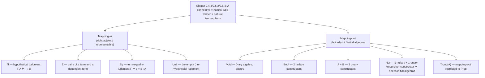

# Type Connectives via Universal Properties

[[book-guidelines|↩ Back to guidelines]]

## Why a *methodology* for type connectives at all?

By the time Chapter 2 of *Principles of Dependent Type Theory* reaches Section 2.4, it has already built the plumbing of extensional type theory (ETT): four judgments (contexts, substitutions, types, terms), an explicit substitution calculus, weakening, de Bruijn indices. What's still missing is the actual *content* — $\Pi$, $\Sigma$, equality, inductive types, universes. The naive way to add these is the way most textbooks (and most compilers) do it: write down formation, introduction, elimination, and equality rules for each connective, one at a time, and hope you haven't forgotten one, or written one that's redundant, or one that's secretly inconsistent.

This is exactly the failure mode the book is trying to avoid. If you design a type theory rule-by-rule, you have no way to know when you're *done specifying* a connective, and no systematic way to check that the rules you wrote are the ones semantics needs. Two rules can look individually reasonable and together be unsound (as we'll see with a naive universe of universes). What the book does instead is give you one recurring question to ask of every connective: **when you have a type $\Upsilon$, what does it mean, from the outside, to build a term of $\Upsilon$ or to consume a term of $\Upsilon$?** Answer that question precisely — as a *natural isomorphism* between terms of $\Upsilon$ and some already-understood piece of judgmental structure — and the introduction rule, elimination rule, $\beta$-rule, $\eta$-rule, and substitution laws for $\Upsilon$ all *fall out* of the answer rather than needing to be invented separately.

This is the "universal properties" of the title. It's the same idea a programmer already has some feel for from category theory jokes about products and coproducts, but the book runs it much further: not just $\Pi$ and $\Sigma$, but equality, `Unit`, inductive types, and (with some contortions) universes and propositions all turn out to be instances of one of two shapes:

- **Mapping-in connectives**: characterize $\Upsilon$ by how *maps into* $\Upsilon$ work. ("A term of $\Pi(A,B)$ is exactly a hypothetical term of $B$.")
- **Mapping-out connectives**: characterize $\Upsilon$ by how *maps out of* $\Upsilon$ work — an initial-algebra move. ("A map out of `Void` is exactly nothing at all — vacuously unique.")

If you're building a type checker or elaborator, this distinction is load-bearing, not decorative: mapping-in connectives (products, records) are the things your checker can eagerly reduce (`β`-normalize) whenever it sees a redex, while mapping-out connectives (sums, inductive types, and later `Prop`'s truncation) are exactly the things that drive your checker's *pattern-matching compiler* — the part that lowers `match` into iterated eliminators.



---

## Part 1: The mapping-in connectives

### $\Pi$-types internalize the hypothetical judgment

Start from the judgment you already have before any connectives exist: a **hypothetical term**, $\Gamma.A \vdash b : B$ — "$b$ is a term of $B$, granting a free variable of type $A$." This is exactly what a function body *is* before you've reified it into a value. The book's move is to ask: is there a type $\Pi(A,B)$ whose closed terms in $\Gamma$ correspond, naturally, to these hypothetical terms? Formally, naturally in $\Gamma$:

$$
\iota_{\Gamma,A,B} : \mathrm{Tm}(\Gamma, \Pi(A,B)) \;\cong\; \mathrm{Tm}(\Gamma.A, B)
$$

"Naturally" is doing real work here, not just decoration — it means this isomorphism commutes with every substitution $\Delta \vdash \gamma : \Gamma$, i.e. instantiating a $\Pi$-term at a substitution and then applying it agrees with substituting into the hypothetical term first and then applying. If you skip naturality, you could accidentally define something that "looks like" function types but doesn't compose predictably under argument instantiation — which is precisely the bug class an elaborator's `whnf`/substitution engine has to never exhibit.

Once you accept this isomorphism as *the definition*, the familiar rules are just its unfolding: $\iota^{-1}$ (backward direction) is $\lambda$-introduction, $\iota$ (forward direction) is elimination — concretely, weaken $f$ into $\Gamma.A$ and apply it to the fresh variable $\mathsf{q}$: $\mathrm{app}(f[\mathsf p], \mathsf q)$. The round-trip equations $\iota(\iota^{-1}(b)) = b$ and $\iota^{-1}(\iota(f)) = f$ are exactly $\beta$ and $\eta$. Nothing about $\beta/\eta$ was *postulated* separately — they are forced by "this map is an isomorphism."

**What breaks without naturality:** if you only demanded $\iota_{\Gamma,A,B}$ be a bijection *at each* $\Gamma$ individually, with no coherence across substitutions, you could build a "function type" whose behavior under argument-passing depends on which context you happen to be reasoning in — a checker built on that would give different typing answers for definitionally-equal contexts. Naturality is precisely the axiom that rules this out; it's the same condition category theorists call "no incoherent choices."

**Rust [[Categorical-Semantics-of-Type-Theory#Grounding|grounding]].** Rust's `fn` types and generic bounds only capture the *non-dependent* fragment (Exercise 2.8 in the book: $A \to B := $ the special case where $B$ doesn't depend on $\Gamma.A$). There is no first-class $\Pi(A,B)$ where $B$'s *type* varies with the value of the argument — that's the entire reason a refinement-type or dependently-typed surface language sitting on top of Rust's trusted kernel needs its own elaborator:

```rust
// Rust only gives you the "B does not depend on A" fragment of Π.
// This is Π(A, B) where B is a constant type family.
fn apply<A, B>(f: impl Fn(A) -> B, a: A) -> B { f(a) }

// To simulate a *dependent* Π(A, B(a)), e.g. Vec<T, N> whose element type
// or bound depends on a runtime value, Rust programmers fake it with:
//   - const generics (compile-time-only dependency, e.g. [T; N])
//   - GATs / associated types (type-level dependency without term dependency)
//   - or punt to a runtime check (the "refinement type" escape hatch your
//     compiler's checker exists to formalize).
trait Family { type At<const N: usize>; }
```

**Lean grounding — the literal translation.** Lean's `∀ (a : A), B a` (sugar `(a : A) → B a`) *is* $\Pi(A,B)$, and Lean's own `isDefEq`/WHNF engine is implementing exactly the $\beta/\eta$ round-trip above when it unifies a lambda against an elimination form:

```lean
-- Π(A, B) with B genuinely depending on the value of a : A
def Π_example : (n : Nat) → Fin n → Nat := fun n i => i.val

-- The introduction/elimination round trip (η) is what Lean's kernel
-- checks via `isDefEq` when you write `fun x => f x` and expect it
-- to be defeq to `f` itself.
example (f : (n : Nat) → Fin n → Nat) : f = fun n i => f n i := rfl
```

**Python sketch (illustrative, not load-bearing).** A five-line reminder of what the *hypothetical-judgment* reading of $\Pi$ feels like operationally — a function is just "a value of $B$, parametrically in an unknown $A$":

```python
def hypothetical_pi(A_values, body):
    # body : A -> B(A); Pi(A, B) := {body} up to naturality in the context
    return {a: body(a) for a in A_values}
```

### $\Sigma$-types internalize dependent pairs

Where $\Pi$ packages a *hypothetical* term, $\Sigma$ packages an *actual* pair: a witness $a : A$ together with $b : B[\mathrm{id}.a]$, naturally in $\Gamma$:

$$
\iota_{\Gamma,A,B} : \mathrm{Tm}(\Gamma, \Sigma(A,B)) \;\cong\; \sum_{a \in \mathrm{Tm}(\Gamma,A)} \mathrm{Tm}(\Gamma, B[\mathrm{id}.a])
$$

Unlike $\Pi$, here the introduction/elimination forms ($\mathrm{pair}$, $\mathrm{fst}$, $\mathrm{snd}$) correspond *exactly* to $\iota^{-1}$/$\iota$ — no weakening trick needed — so $\beta$ and $\eta$ are literally the round-trip equations. One subtlety worth internalizing (Remark 2.4.5 in the book): despite $\Sigma$'s elements *looking* like products (pairs), $\Sigma$ is categorically a *coproduct* (indexed sum) — an $A$-indexed disjoint union of the fibers $B_a$ — while $\Pi$, despite generalizing functions, is categorically a *product*. Programmers get this backwards constantly because "sum type" in ML-family languages means tagged union (which is $A + B$, not $\Sigma$).

**What breaks without dependency:** if $B$ can't depend on the witness $a$, $\Sigma(A,B)$ collapses to the non-dependent product $A \times B$ (Exercise 2.16) — you lose exactly the ability to write "a natural number $n$ together with a proof that $n$ is prime," which is the *entire* value proposition of a refinement/subset type. $\Sigma$-types over `Prop`-valued families are, in fact, how the book eventually defines subtypes (Exercise 2.48): if $B$ is a proposition, $\Sigma(A,B)$ is literally "the subtype of $A$ on which $B$ holds," with an *injective* first projection into $A$.

**Rust grounding.**

```rust
// Non-dependent Σ = struct/tuple. This is where Rust's story ends on its own.
struct Sigma<A, B> { witness: A, proof: B }

// A refinement type "n : Nat | n is prime" is exactly Σ(Nat, IsPrime),
// and fst/snd are the projection and the (erased-at-runtime, checked-at-
// compile-time) proof obligation your refinement checker discharges.
struct Prime { n: u64 /* invariant: n is prime, checked once at construction */ }
```

**Lean grounding.**

```lean
-- Lean's Σ is exactly Σ(A, B), and Subtype (the {x // p x} notation)
-- is precisely "Σ over a Prop-valued family" — Exercise 2.48's subtype
-- reading, made literal:
structure Sigma' (A : Type) (B : A → Type) where
  fst : A
  snd : B fst

def PrimeNat := {n : Nat // n.Prime}   -- Σ(Nat, IsPrime), B is a Prop
```

### Extensional equality: `Eq` internalizes the *equality judgment itself*

This is the connective that gives extensional type theory its name and its power (and, foreshadowing Chapter 4, its downfall). The idea: internalize the judgment $\Gamma \vdash a = b : A$ as a type:

$$
\iota_{\Gamma,A,a,b} : \mathrm{Tm}(\Gamma, \mathrm{Eq}(A,a,b)) \;\cong\; \{\star \mid a = b\}
$$

In words: $\mathrm{Eq}(A,a,b)$ has exactly one inhabitant when $a$ and $b$ are already judgmentally equal, and *no* inhabitants otherwise. The introduction rule is $\mathrm{refl} : \mathrm{Eq}(A,a,a)$. The distinctive rule is **equality reflection**:

$$
\frac{\Gamma \vdash a, b : A \quad \Gamma \vdash p : \mathrm{Eq}(A,a,b)}{\Gamma \vdash a = b : A}
$$

Read this rule carefully: it lets you go from the mere *existence of a term* of an equality type to a full judgmental equality — one that the type checker will silently use to rewrite $a$ into $b$ *anywhere*, without ever inspecting or recording $p$. This is what makes the theory "extensional": propositional and judgmental equality collapse into one relation.

**What breaks — foreshadowing.** This is the chapter's most important "load-bearing" fact for anyone building a real checker: equality reflection makes *type-checking undecidable* (proved properly in Chapter 3, Section 3.6, via an encoding of untyped SK-combinator convertibility into judgmental equality). A term $p : \mathrm{Eq}(A,a,b)$ can be a hypothesis — a free variable sitting in the context — and the checker must nonetheless treat $a$ and $b$ as interchangeable *at type-checking time*, with no way to bound how much work that substitution might trigger. This is precisely why every practical dependently-typed kernel (Lean, Agda, Rocq) uses **intensional** equality types instead — Chapter 4's subject — where equality is witnessed by an eliminator ($J$/`Eq.rec`) rather than assumed by reflection. If you are building a Lean-style elaborator, this is the single most consequential design decision in the whole book: extensional `Eq` gives you a beautifully uniform theory and an *undecidable* type checker; intensional `Id` gives you a decidable, algorithmic one at the cost of losing [[Extensionality-versus-Intensionality#Function extensionality|function extensionality]] and uniqueness of identity proofs "for free."

**Lean grounding.** Lean's `Eq` is intensional, decided via `rfl`/the `J`-eliminator, *not* extensional `Eq` as defined here — but Lean does expose a controlled, local form of equality reflection via `Eq.mpr`/`subst` at the tactic level, and `Decidable` instances are exactly the mechanism that keeps definitional equality checking terminating despite the theory having a general propositional-equality type. The book's `Eq` is closer to what you get if you make `propext`-style axioms *judgmental* rather than propositional.

```lean
-- Intensional Id/Eq: equality is witnessed, and the witness matters to
-- how the kernel unfolds computation (it doesn't get silently discharged
-- as a *judgmental* fact the way Eq-reflection would).
example (a b : Nat) (p : a = b) : a = b := p  -- p is data, not silently absorbed

-- Contrast: what ETT's equality reflection would let you do (informally) —
-- treat `p : Eq(A, a, b)` as license to substitute `a` for `b` anywhere,
-- including inside types, without ever pattern-matching on `p`.
```

### The unit type — the simplest connective

Internalizing the *empty-hypothesis* judgment (the judgment with nothing to prove beyond existence):

$$
\iota_\Gamma : \mathrm{Tm}(\Gamma, \mathrm{Unit}) \cong \{\star\}
$$

One constructor $\mathrm{tt}$, one $\eta$-law ($\Gamma \vdash a = \mathrm{tt} : \mathrm{Unit}$ for any $a$). It looks trivial, but it's the base case that later gets reused twice: as the terminal object making $\Sigma$-types degenerate to plain existence proofs, and (Corollary 2.7.12) as the *true proposition* under propositions-as-types.

---

## Part 2: Inductive types are mapping-out constructions (initial algebras)

### The interlude that reframes everything: mapping in vs. mapping out

Try to apply the $\Pi/\Sigma/\mathrm{Eq}/\mathrm{Unit}$ recipe to `Void` (the empty type) and it breaks immediately. The naive guess $\iota_\Gamma : \mathrm{Tm}(\Gamma,\mathrm{Void}) \cong \varnothing$ is simply false — the variable rule alone forces $\mathsf q \in \mathrm{Tm}(\Gamma.\mathrm{Void}, \mathrm{Void})$. `Void` is *not* always empty at the level of judgments (a context can carry an inconsistent hypothesis), even though every type "believes" it's empty.

The book's fix mirrors a classical piece of set-theoretic folklore: the zero-element set $0$ is best characterized not by maps *into* it, but by the fact that there's exactly one map $0 \to X$ for every $X$. Translated to type theory: characterize `Void` by maps **out** of it, quantified over an arbitrary target type $A$ in the extended context $\Gamma.\mathrm{Void}$:

$$
\rho_{\Gamma,A} : \mathrm{Tm}(\Gamma.\mathrm{Void}, A) \cong \{\star\}
$$

This unfolds to `absurd(b) : A[id.b]` — the "ex falso" eliminator — and, crucially, its uniqueness (the $\eta$-law) says any two maps out of `Void` agree, which is what lets the checker treat all terms in an inconsistent context as equal. The book updates its master slogan (2.4.4 → 2.5.2) to cover both directions:

> A connective is (1) a natural type-forming operation, and (2) *either* a natural isomorphism on maps in, *or* — for every extended-context target $A$ — a natural isomorphism on maps out.

**`Bool`, `+`, and the emerging pattern.** `Bool` extends this with two nullary constructors `true`/`false`; the mapping-out property says maps out of `Bool` are determined by, and freely chosen on, their values at `true` and `false` — i.e. the familiar `if`-eliminator, whose $\beta$-laws are the two evaluation equations and whose (usually-omitted) $\eta$-law says any two case splits agreeing on both branches are equal. `A + B` is the same story with *unary* constructors `inl`/`inr`.

### `Nat`: why recursion breaks the pattern and forces initial algebras

`zero` and `suc` look like just one more inductive signature — until you try to write the naive mapping-out isomorphism:

$$
(\;(\mathrm{id.zero})^*,\ (\mathsf p.\mathrm{suc}(\mathsf q))^*\;) : \mathrm{Tm}(\Gamma.\mathrm{Nat}, A) \cong \mathrm{Tm}(\Gamma, A[\mathrm{id.zero}]) \times \mathrm{Tm}(\Gamma.\mathrm{Nat}, A[\mathsf p.\mathrm{suc}(\mathsf q)])
$$

Look at the right-hand side: `Tm(Γ.Nat, ...)` appears on *both sides* of the isomorphism — because `suc` is recursive. This is no longer a *definition* of the left-hand side; it's an *equation the left-hand side must satisfy*, and such equations can have many solutions (imagine $\mathbb N \cup \{\infty\}$ with $\mathrm{suc}(\infty) := \infty$ — that also satisfies the equation) or none at all.

The fix is the categorical notion of an **initial algebra**. For a signature functor like $N \mapsto \{\star\} \sqcup N$, an *algebra* is a set $N$ with a point $z \in N$ and an endofunction $s : N \to N$; a homomorphism between algebras is a structure-preserving map; and an **initial algebra** is the least such structure — the one admitting a *unique* homomorphism into every other algebra of the same signature. $(\mathbb N, 0, +1)$ is initial: for any algebra $(X, z, s)$ there's a unique $f$ with $f(0) = z$, $f(n+1) = s(f(n))$ — which is exactly the universal property of `rec`.

Dependently, this generalizes to **displayed algebras**: a family $\{\tilde N_n\}_{n \in N}$ over the base algebra plus compatible $\tilde z$ and $\tilde s$, with the induction principle for `Nat` — $\forall P.\, P(0) \Rightarrow (\forall n.\, P(n) \Rightarrow P(n+1)) \Rightarrow \forall n.\, P(n)$ — falling out as the special case where every $\tilde N_n$ is `Prop`-valued.

`Void`, `Bool`, and `+` are retroactively seen to be initial algebras too, for the signatures $X \mapsto 0$, $X \mapsto \{\star\}\sqcup\{\star\}$, and $X \mapsto A \sqcup B$ — it's only `Nat`'s recursive constructor that forces the general algebra machinery out into the open. The book flags this as a preview of its own metatheory (Remark 2.5.7): type theory's own syntax, later chapters argue, is itself the *initial algebra* of the generalized algebraic theory given by its inference rules — "syntax as initial model" is the same pattern one level up.

**Rust grounding — folds are eliminators.** `Nat`'s `rec` is, up to currying, exactly `fold`/`Iterator::fold` or a hand-rolled catamorphism over an enum:

```rust
enum Nat { Zero, Succ(Box<Nat>) }

// rec(a_z, a_s, n) — the initial-algebra homomorphism out of Nat.
// This is precisely a fold: give the algebra (target type A, z-case, s-case).
fn rec<A>(zero_case: A, succ_case: impl Fn(&Nat, A) -> A, n: &Nat) -> A {
    match n {
        Nat::Zero => zero_case,
        Nat::Succ(m) => {
            let sub = rec(zero_case, &succ_case, m); // caveat: illustrative,
            succ_case(m, sub)                          // not tail/move-clean
        }
    }
}
```

The reason `enum` + `match` in Rust *feels* free, with no "is this really the smallest solution" worry, is that Rust's compiler enforces the initiality (no other constructors can sneak in extra values) via exhaustiveness checking on a closed `enum` — the same discipline the book's $\eta$-law for inductive types is encoding formally.

**Lean grounding — the literal translation.** Lean's `inductive` declarations generate exactly this: constructors, and a `rec`/`casesOn` eliminator whose type is the dependent-algebra homomorphism condition above, verbatim:

```lean
inductive Nat' where
  | zero : Nat'
  | succ : Nat' → Nat'

-- Nat'.rec IS ρ_{Γ,A,a_z,a_s} unfolded: give a displayed algebra
-- (motive, zero-case, succ-case), get the unique homomorphism out.
#check @Nat'.rec
-- {motive : Nat' → Sort u} → motive .zero →
-- ((n : Nat') → motive n → motive n.succ) → (t : Nat') → motive t
```

### Unicity for free — equality reflection derives the $\eta$-laws

Section 2.5.5 makes a sharp observation: the $\eta$-laws for `Void`/`Bool`/`+`/`Nat` (that maps out are not just *existent* but *unique*) don't need to be primitive rules at all — they're *derivable* from the mapping-out eliminator plus equality reflection. The proof for `Void` is a one-liner: given `b : Void` and two candidate maps, `absurd(b)` itself inhabits `Eq(A[id.b], absurd(b), a[id.b])` by `Void`-elimination, and reflection turns that term into the desired judgmental equality. This is why extensional type theory's official rule set *omits* these $\eta$-laws — they're redundant given `Eq`. Once equality reflection is removed in Chapter 4 (intensional type theory), this derivation no longer goes through, and the $\eta$-laws for inductive types have to be re-examined from scratch (generally: dropped, for the same implementability reasons that motivate dropping reflection in the first place).

---

## Part 3: Full-spectrum dependency — large elimination and universes

### Why `Π`/`Σ`/`Eq`/`Unit`/inductive types still aren't "full-spectrum"

Everything so far lets you define a term by cases on an inductive type's constructors. It does *not* let you define a **type** by cases — e.g., a `Bool`-indexed family sending `true` to `Nat` and `false` to `Unit`. Worse, without this ability the theory can't even prove `true ≠ false`: there's no term of `Π(Eq(Bool, true, false), Void)`, because nothing lets you build a type-valued function to derive a contradiction from a false boolean equation.

**Large elimination** is the direct fix: give `Bool` a *second* eliminator, `If(A_t, A_f, b) : type`, mirroring `if` but landing in the type judgment instead of a fixed type $A$. It works for `Bool`, `Void`, and non-recursive types — and with it, `disjoint : Π(Eq(Bool,true,false), Void)` becomes a three-line proof (build the type family $P(b) := \mathrm{If}(\mathrm{Unit},\mathrm{Void},b)$, observe $P(\mathrm{true}) = \mathrm{Unit}$ and, by reflection on the equality hypothesis, $P(\mathrm{true})=P(\mathrm{false})=\mathrm{Void}$, done).

**Where it breaks:** `Nat`'s large eliminator can't be stated at all. The recursive branch of ordinary `rec` binds a term-level variable for "the result on the predecessor" — but the type-valued analogue would need to bind a *type*-level variable in that position, and "a context extended by a type variable" isn't part of the theory as built so far (Exercise 2.37 dares you to add it as a genuine extension). Large elimination is a dead end for anything recursive — which, in practice, is almost everything interesting.

### Universes: reifying "type" as a term, à la Tarski

The standard fix is to stop trying to eliminate *into* the type judgment directly, and instead build a type `U` whose *terms* stand for types, together with a decoding operator `El`:

$$
\mathrm{El} : \mathrm{Tm}(\Gamma, U) \to \mathrm{Ty}(\Gamma)
$$

This is a **universe à la Tarski**: codes and types are different sorts, connected only via the explicit `El`. Each connective gets a matching code (`pi`, `sig`, `eq`, `unit`, `void`, `bool`, `nat`, `coprod`) with an equation saying `El` decodes it correctly, e.g. `El(pi(a,b)) = Π(El(a), El(b))`. Because the formation rule for `pi`'s second argument needs `Γ.El(a) ⊢ b : U`, the definitions of `U` and `El` are mutually recursive — the textbook example of an **inductive-recursive** definition.

**Why not just say `Tm(Γ,U) ≅ Ty(Γ)` directly, and let terms of `U` *be* types (à la Russell)?** This is the choice Rocq and Agda make at the surface-syntax level, and it's more convenient to write. But it's not free: if you additionally let `U` contain a code for *itself* — `code(U) : U` with `El(code(U)) = U` — the theory becomes inconsistent (Girard's paradox, next section). Tarski-style universes make this failure mode structurally impossible to even *state*, because codes and types are different sorts and nothing forces you to close `U` under a code for itself.

> **Elaborator note (`type-theory` focus area).** The Tarski/Russell distinction is not a stylistic footnote — it's precisely the design decision Lean's elaborator hides from you. Lean *presents* as à la Russell (you write `Type` and it "is" a type), but internally the kernel tracks universe levels and inserts the equivalent of `El`/`code` bookkeeping automatically during elaboration; user-facing Russell-style convenience is implemented on top of a Tarski-style kernel. If your own compiler's elaborator wants Agda/Lean-style surface ergonomics with a small trusted kernel, this section is the direct blueprint: keep the kernel's core judgment Tarski-style (explicit `El`), and do the code/type identification only in the elaborator layer, where insertion of `El`/`code` calls can be automated and audited.

**Rust/Lean grounding.**

```lean
-- Lean: Sort u / Type u *is* à la Russell — u : Type v really behaves
-- as if u : Type v and "u is itself a type" at once, at the surface level.
#check (Nat : Type)        -- Nat, as a *term* of Type, IS usable as a type
#check (Type : Type 1)     -- the universe hierarchy in Russell clothing

-- The book's à la Tarski presentation is what you'd get if you forced
-- an explicit decode step:
-- U : Type,  El : U → Type,  nat_code : U,  El nat_code = Nat  (by rule)
```

```rust
// Rust has no user-facing universe at all — `dyn Trait` and generics are
// the closest analogues, but there's no term you can pattern-match on
// that "is" a type the way U's codes are. This is exactly the gap a
// dependent-type elaborator embedded in a Rust toolchain has to bridge:
// your surface language needs its own U/El, compiled down to whatever
// erasure or vtable strategy Rust's own type system supports.
```

### Universe hierarchies, lifting, and cumulativity

A single `U` still can't quantify over itself (`Π(U, −)` is fine; `U`-indexed quantification whose *domain* includes `U` is not). The standard patch is a **tower** $U_0 \subset U_1 \subset U_2 \subset \cdots$, where $U_i$ additionally contains a code $\mathrm{uni}_{i,j} : U_i$ for every $j < i$. Because there's no induction principle for a universe, "$U_i$'s codes are a subset of $U_{i+1}$'s" isn't visible internally by default — you have to add an explicit **lift** operation $\mathrm{lift}_i : U_i \to U_{i+1}$ satisfying $\mathrm{El}_{i+1}(\mathrm{lift}_i(a)) = \mathrm{El}_i(a)$, and require it to commute strictly with every code (e.g. $\mathrm{lift}_i(\mathrm{pi}_i(a,b)) = \mathrm{pi}_{i+1}(\mathrm{lift}_i(a), \mathrm{lift}_i(b))$). A hierarchy equipped with such lifts is called **(strictly) cumulative** — note this is a genuinely different (and, per Remark 2.6.8, more honest) notion than the "material subset inclusion" $\mathrm{Tm}(\Gamma,U_i) \subseteq \mathrm{Tm}(\Gamma,U_{i+1})$ that "cumulativity" often informally suggests; codes-and-lifts avoids committing to an actual subset relationship between different sorts.

This machinery is exactly why every practical dependently-typed language makes universe-level bookkeeping either fully automatic (Lean's level unification/`max`) or fully implicit-and-erased (many systems just check `i ≤ j` silently) — the strict-lift discipline described here is what a level-inference algorithm in an elaborator has to reconstruct on the user's behalf, rule by rule.

### Girard's paradox — why `U : U` is not a convenience you can bolt on

The naive "let `El` be a literal isomorphism" formulation would add `code(A) : U` for every type `A`, making `U` contain (a code for) itself. Section 2.6.4 substantiates why this is fatal, via Hurkens' simplified form of Girard's paradox (itself a type-theoretic Burali-Forti/Russell's-paradox construction). The proof constructs a "universe of all universes" $\Theta$ admitting a round-trip $\tau : \mathrm{El}(P^2\Theta) \to \mathrm{El}(\Theta)$, $\sigma : \mathrm{El}(\Theta) \to \mathrm{El}(P^2\Theta)$ (where $P$ is a type-theoretic powerset operator $PA := \mathrm{code}(\mathrm{El}(A) \to U)$) satisfying a coherence equation, then defines an internal ordinal $\Omega$ as "the collection of all inductive collections" and derives both `Ω` is well-founded and `Ω` is not — a direct contradiction, yielding a closed term of `Void`. The book flags that even Martin-Löf's *original* 1971 type theory had `U : U` and was inconsistent for exactly this reason — this was not obvious a priori, and the fix (stratify into a hierarchy, never let a universe decode itself) is the entire reason universe hierarchies exist rather than a single self-referential `U`.

**The one-sentence takeaway for a compiler builder:** any surface-language feature that lets a universe "quantify over everything, including itself" — a top type used as both a term-classifier and a member of itself, an unchecked `Type : Type` shortcut for convenience in a prototype elaborator — is not merely inelegant, it is *provably* an inconsistency, and Hurkens' construction is the concrete attack a malicious or merely careless user of your language could mount to derive `False` from nothing.

---

## Part 4: Propositions as (some) types

### Refining "propositions as types" to "propositions as *some* types"

The naive Curry–Howard slogan — every type is a proposition, every term is a proof — runs into trouble immediately: `Bool` is "true" (inhabited) but has *two* different proofs, which is nonsensical for a proposition (which proof of `2 + 2 = 4` would you even be choosing between?). The book's fix (Definition 2.7.5, Slogan 2.7.6) is to *carve out* propositions as a special class of types:

$$
\mathrm{isProp}(A) := \Pi\big(A,\ \Pi(A[\mathsf p],\ \mathrm{Eq}(A[\mathsf p^2], \mathsf q[\mathsf p], \mathsf q))\big) \quad\text{i.e. } (a\ b : A) \to a = b
$$

A proposition is a type all of whose terms are (extensionally) equal — a "mere proposition" or "subsingleton." Under this refined reading: `Unit` and `Void` are propositions (the true and false propositions respectively); `Eq(A,a,b)` is *always* a proposition (proved via `Eq`'s own $\eta$-law — any two equality proofs are `refl`, hence equal); $\Pi(A,B)$ is a proposition whenever $B$ is (universal quantification preserves propositionhood); $A \times B$ is a proposition when *both* factors are (conjunction). This recovers exactly the rules of intuitionistic propositional logic, term-for-term (Corollary 2.7.12).

**A crucial warning the book flags explicitly (Warning 2.7.7):** "is a proposition" is *not* the naive external condition "the set of closed terms has cardinality ≤ 1" — it's the internal, substitution-stable condition that *for every* substitution $\Delta \vdash \gamma : \Gamma$, $|\mathrm{Tm}(\Delta, A[\gamma])| \le 1$. The type `1.U ⊢ El(q) type` (decoding an arbitrary universe variable) has at most one *closed* term (none, in fact, assuming consistency) but is emphatically not a proposition, because instantiating the variable with `bool` gives you a type with two elements. If your refinement-type checker ever needs to decide "is this predicate propositional" (e.g., to justify proof irrelevance or erasure), it must check this substitution-stable, internal condition — not a naive syntactic cardinality count on the empty context.

### The illusion of choice — where $\Sigma$-as-$\exists$ quietly breaks

Two connectives are conspicuously missing from the propositions-as-some-types dictionary: disjunction and existential quantification. The natural guesses — $A+B$ for $\vee$, $\Sigma(A,B)$ for $\exists$ — fail, because neither is a proposition in general even when the "obvious" ingredients are propositions (Exercises 2.45, 2.47).

The failure is not cosmetic. Section 2.7.2 shows it concretely by encoding a "type-theoretic axiom of choice" naively with $\Sigma$ standing in for $\exists$:

$$
\mathrm{NaiveChoice} := \Big((a:A) \to \textstyle\sum_{b:B} \mathrm{Prf}(P(a,b))\Big) \to \Big(\textstyle\sum_{f:A\to B} (a:A) \to \mathrm{Prf}(P(a,f(a)))\Big)
$$

This is *trivially* inhabited — `λF → (λa → fst(F a), λa → snd(F a))` — which looks like a triumphant proof of the axiom of choice for free, until you notice the proof does something completely unlike choice: it directly *projects* the witness $b$ out of the hypothesis $F(a)$, because $\Sigma$'s elements genuinely carry that data. Real choice is supposed to extract a function from the mere logical *fact* "for every $a$ there exists some $b$" — a fact that, properly stated, must not let you retrieve a specific witness. `NaiveChoice`'s antecedent is strictly stronger than the real axiom of choice's antecedent; the "proof" smuggles in exactly the informativeness that makes choice interesting in the first place.

**Why this matters for a refinement/verification compiler:** this is the sharpest illustration in the whole chapter of the difference between a **sort** (a type you can compute with and extract data from) and a **proposition** (a type you can only ever use to justify another proposition, never to extract data). A verification-condition generator that conflates "there exists a satisfying assignment" (a proof-irrelevant fact used to discharge an obligation) with "here is a satisfying assignment" (extractable data, e.g. a counterexample from your CSP kernel) will produce unsound erasure — exactly the bug this section exists to head off.

### Propositional truncation: repairing $\exists$ and $\vee$

The fix is to define real $\exists$-types with a *restricted* mapping-out property — restricted to targets $C$ that are themselves propositions — so a proof of $\exists(A,B)$ can never leak a witness into non-propositional code:

$$
\rho_{\Gamma,A,B,C} : \mathrm{Tm}(\Gamma.\exists(A,B), C[\mathsf p]) \cong \mathrm{Tm}(\Gamma.A.B, C[\mathsf p^2]) \qquad (C\text{ a proposition})
$$

plus asserting $\exists(A,B)$ is itself a proposition. The general-purpose version of this idea is **propositional truncation**, $\mathrm{Trunc}(A)$ (also written $\|A\|$ or $[A]$): the "best proposition approximating $A$," with `seal : A → Trunc(A)`, an assertion that `Trunc(A)` is a proposition, and a mapping-out property restricted to propositional targets exactly as above. From `Trunc` you recover both missing connectives: $\exists(A,B) := \mathrm{Trunc}(\Sigma(A,B))$ and $A \vee B := \mathrm{Trunc}(A+B)$ — and truncation is provably an *idempotent monad* ($\mathrm{Trunc}(\mathrm{Trunc}(A)) \cong \mathrm{Trunc}(A)$), a fact any implementation of `∃`-elimination as a squash/erase pass should preserve.

**Impredicative universes of propositions.** Because $\mathrm{isProp}(A)$ is itself a proposition (Corollary 2.7.11), you can package a *universe of propositions*, $\mathrm{Prop}_i := \Sigma(U_i, \mathrm{isProp}(\mathrm{El}(\mathsf q)))$. Unlike the type hierarchy, which *needs* to be stratified $U_0, U_1,\dots$ to dodge Girard's paradox, a **single** self-quantifying `Prop` containing codes for propositions *of every level* is perfectly consistent (Remark 2.7.14) — because `Prop` itself isn't a proposition, there's no analogous self-membership loop to exploit. Such a single, **impredicative** universe of propositions is exactly what Rocq's `Prop` and Lean's `Prop` are — and it is a genuine *choice*, not a free consequence of the rest of the theory (the book treats it as an optional extension throughout Section 2.7, flagged with a ★).

### Constructivity: what type theory does and doesn't decide

Formulating the *real* axiom of choice correctly (with `Trunc` fixing the mere-existence antecedent), Theorem 2.7.21 states it is **independent** of extensional type theory — neither provable nor refutable. The same independence holds for the law of excluded middle and double-negation elimination (which the book shows are interprovable, Theorem 2.7.23):

$$
\mathrm{LEM} := (P:\mathrm{Prop}) \to \mathrm{Prf}(P) \vee (\mathrm{Prf}(P) \to \mathrm{Void}) \qquad \mathrm{DNE} := (P:\mathrm{Prop}) \to \big((\mathrm{Prf}(P)\to\mathrm{Void})\to\mathrm{Void}\big) \to \mathrm{Prf}(P)
$$

This is "constructivity" in the precise, technical sense used here (what the book calls *neutral constructivism*): type theory is compatible with *both* classical extensions (add LEM as an axiom) and genuinely anti-classical ones — most strikingly, Church's thesis (every $f : \mathrm{Nat} \to \mathrm{Nat}$ is computed by *some* Turing machine, merely-existentially) is also independent, and is flatly *incompatible* with LEM (LEM lets you define the halting-problem oracle function, which Church's thesis says can't exist as a computable function). Type theory doesn't pick a side; it's a substrate flexible enough to host either axiom, which is exactly why a verification toolchain built on it can choose classical reasoning where convenient (e.g. discharging decidable arithmetic goals) while staying constructively honest where it matters (extracting actual witnesses/counterexamples from a proof, which only works if you never silently assumed LEM to get there).

---

## Where this leads

**Immediately downstream (this book):** equality reflection is the single rule flagged repeatedly throughout this chapter as "suspiciously strong," and Chapter 3 makes that precise — extensional equality makes type-checking *undecidable* (two separate proofs: an SK-combinator encoding and Hofmann's recursively-inseparable-sets argument). Chapter 4 responds by deleting equality reflection and replacing `Eq` with an intensional identity type `Id` defined by a mapping-out eliminator ($J$) instead of a mapping-in isomorphism — the first connective in the whole book that *cannot* be given a mapping-in universal property, because "the identity type of $a$" isn't a hypothetical judgment the way $\Pi$/$\Sigma$/`Eq` were. Universes, propositions, and inductive types built here largely survive that transition unscathed; only `Eq` and the derived $\eta$-laws for inductive types (which leaned on reflection) need to be re-derived or dropped. Chapter 5 then builds univalence and homotopy levels directly on top of the `Prop`/truncation machinery introduced here — homotopy propositions generalize `isProp`, and higher inductive types generalize the initial-algebra story of Section 2.5 to signatures with path constructors.

**For the compiler/elaborator project (`type-theory` focus area):** three threads from this article are directly load-bearing.
- The **mapping-in/mapping-out split** is the right mental model for your elaborator's normalizer: mapping-in connectives are what your WHNF routine eagerly $\beta$-reduces on sight; mapping-out connectives (inductive types, truncation) are exactly what your pattern-match compiler needs to desugar into iterated eliminator calls before type-checking a `match` arm.
- **Universes à la Tarski vs à la Russell** is not academic — it's the actual seam between your trusted kernel (which should stay Tarski-style, with explicit `El`, for auditability) and your user-facing elaborator (which can present Russell-style ergonomics, inserting `El`/`code`/`lift` calls automatically, exactly as Lean's elaborator does).
- **Propositions-as-some-types and the illusion of choice** are the precise formal justification for treating refinement predicates as proof-irrelevant, erasable obligations distinct from the data-carrying sorts your CSP/abstract-interpretation backends manipulate — get this distinction wrong (treat a `Prop`-classified refinement predicate as if it could leak a witness like a `Σ`-typed sort) and your verifier's soundness argument has a hole in exactly the place Section 2.7.2 diagnoses.
