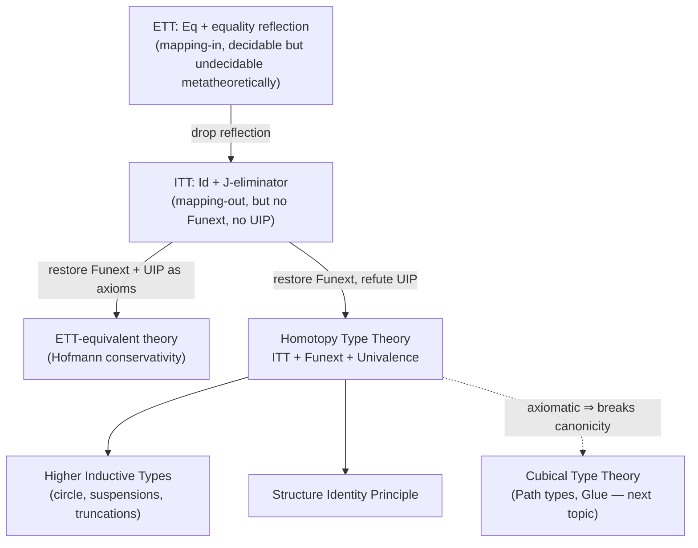

[[book-guidelines|↩ Back to guidelines]]

## Why does type theory need another axiom about equality?

By the end of Chapter 4, intensional type theory (ITT) has a working notion of
propositional equality — the $\mathrm{Id}$-type — defined not by a mapping-in universal
property (as $\mathrm{Eq}$ was in extensional type theory) but by an eliminator, `j`,
which only knows how to consume `refl`. That move bought back normalization,
canonicity, and decidable type-checking, but the bill came due immediately: ITT
lost **[[Extensionality-versus-Intensionality#Function extensionality|function extensionality]]** (pointwise-equal functions need not be identified)
and **UIP**, uniqueness of identity proofs (two proofs of the same equation need
not be identified with each other). The groupoid model showed these losses are
real, not just failures of proof search — there exist models of ITT that
genuinely refute both principles.

Univalent foundations starts from a third, even stranger gap, this one in the
identity type of the universe itself: $\mathrm{Id}(U, A, B)$. What *should* count as a
proof that two types are "the same"? Naively you might reach for isomorphism —
if `Nat` and `List(Unit)` (say) are interconvertible, shouldn't the type theory
say so? But here is the concrete failure mode the book leads with: `Bool` is
isomorphic to itself in **two different ways** — the identity map, and the map
that swaps `true` and `false`. If isomorphic types were simply *equal* in the
crude, no-further-structure sense that equality usually carries, both of these
isomorphisms would collapse into "no information," which is absurd — they are
different symmetries and code that depends on which one you use should be able
to tell. So the naive fix ("isomorphic types are identified") is not merely
under-motivated, it is one of several *inconsistent* ways of trying to state
this. Getting the statement right, without collapsing distinct isomorphisms
together, is precisely what Voevodsky's **univalence axiom** does, and doing
so requires reworking what "being an isomorphism" even means. That is the
central technical hurdle this chapter clears.

The payoff, once the definitions are in place, is enormous: univalence lets you
treat isomorphic mathematical structures — monoids, groups, categories — as
*literally* substitutable for one another in any proof, because the type theory
validates "sameness of structure implies sameness of everything you could ever
say about it" as a theorem rather than an informal convention mathematicians
have to police by hand.



---

## Homotopy propositions: propositional equality reaches "is a proposition"

Chapter 2 defined a proposition in ETT two equivalent ways: terms of $A$ are all
judgmentally equal, or the type $\mathrm{isProp}(A) := (a\,b:A) \to \mathrm{Eq}(A,a,b)$ is
inhabited. In ITT these stop being equivalent, because $\mathrm{Id}$-types lack equality
reflection by design. You now get **two distinct notions**:

- **Strict propositions**: types with one element *up to definitional equality*.
- **Homotopy propositions** ($\mathrm{IsHProp}(A) := (a\,b:A) \to \mathrm{Id}(A,a,b)$): types
  with one element *up to identification*.

**What breaks without this distinction.** If you only had strict propositions,
almost nothing would qualify — not even `Void` is a strict proposition in ITT,
because `Void` lacks a definitional $\eta$-rule (there's no definitional-equality
argument forcing two arbitrary closed terms of `Void` to coincide judgmentally —
vacuously true, but not *judgmentally* recorded). Homotopy propositions are the
usable notion: they close under most of the same connectives ETT's propositions
did, and — crucially for what follows — the predicate $\mathrm{IsHProp}(A)$ is itself
*internal*, a type you can quantify over. That internality is what lets the book
define $\mathrm{HProp}_i := \sum_{A:U_i} \mathrm{IsHProp}_i(A)$, a genuine type-theoretic
universe of propositions, setting up the rest of the chapter.

One asymmetry to hold onto: proving $\Pi$-types of homotopy propositions are
themselves homotopy propositions needs function extensionality — a first hint
that Funext and the univalent development are entangled from the start.

**[[Categorical-Semantics-of-Type-Theory#Grounding|Grounding]] (Lean).** This exact fork exists in Lean's kernel today. Lean's
`Prop` sort has **definitional proof irrelevance**: any two proofs of the same
`Prop` are definitionally equal, by kernel fiat — that's the "strict proposition"
route, baked in rather than derived. Ordinary `Type`-valued predicates that
happen to have at most one inhabitant, proved via `Subsingleton`, are Lean's
analogue of homotopy propositions — provably, not definitionally, unique.

**Grounding (Rust).** Rust has no internal notion of "this type has at most one
inhabitant" — the closest structural fact is the unit type `()` and never-type
`!`, both fixed by the type system rather than user-defined as a *property* of
arbitrary types. This is a case where forcing an analogy would mislead more
than help: Rust's type system doesn't carry propositions-as-types far enough to
have a native contrast between "defeq-unique" and "provably-unique."

---

## Propositional univalence: warming up on the well-behaved case

Before tackling the terrifying general case, the book restricts univalence to
$\mathrm{HProp}$ itself, where it is easiest to state and — unlike full univalence — is
*consistent with UIP*. The guiding intuition comes straight from set theory:
two predicates $\phi, \psi$ on a set $X$ induce equal subsets iff they are
interprovable, by the extensionality axiom of set theory. Type theory's analogue:

$$
A \Leftrightarrow B := (A \to B) \times (B \to A)
$$
$$
\mathrm{HPropIsUnivalent} := (A\ B : \mathrm{HProp}) \to (A \Leftrightarrow B) \to \mathrm{Id}(\mathrm{HProp}, A, B)
$$

This is a genuinely strong statement — Theorem 5.1.5 shows it's not just *some*
map from interprovability to identification, but an **isomorphism** between
$A \Leftrightarrow B$ and $\mathrm{Id}(\mathrm{HProp},A,B)$: the canonical map induced by `subst`
back the other way is already an inverse. The proof is a clean application of
the "idempotent maps on identity types are the identity" lemma (due to
Escardó) — worth internalizing because the same proof pattern (round-trip via
`subst`, reduce to an idempotence argument) recurs for full univalence.

**What breaks without abstraction.** The concrete $\mathrm{HPropIsUnivalent}$ statement
turns out to be *false in the set model* (Lemma 5.1.7) — because $\mathrm{HProp}$
there is interpreted as "all subsingleton sets," and there are plenty of
unequal one-element sets ($\{\star\}$ vs. $\{\{\star\}\}$) with mutual maps
between them. The fix is to stop insisting on a *specific* universe of
propositions and instead axiomatize the *shape* of one: a type $\Omega$ with a
decoding map $\mathrm{dec} : \Omega \to \mathrm{HProp}$,

$$
\mathrm{PropUniverse}_i := \sum_{\Omega:U_{i+1}} (\Omega \to \mathrm{HProp}_i)
$$

univalent if interprovable-under-$\mathrm{dec}$ implies identified, and **adequate**
if every proposition in $\mathrm{HProp}_i$ has a representative in $\Omega$ up to
interprovability. The set model *does* support an adequate, univalent universe
of propositions — take $\Omega = \{\top,\bot\}$, the two-element set, with the
obvious decoding. This is a categorical fact in disguise: an adequate,
univalent, impredicative universe of propositions is exactly a **subobject
classifier**, the type-theorist's substitute for naive set theory (Remark
5.1.12).

Stacking adequacy across all universe levels onto one fixed small universe
$\mathrm{HProp}_0$ gives **propositional resizing** — an impredicativity axiom letting
every large proposition be represented by a small one. Resizing alone is
enough to *construct* propositional truncation for the first time as a genuine
definition rather than a postulated connective:

$$
\mathrm{Trunc}(A) := \mathrm{resize}\big((X:\mathrm{HProp}_0) \to (A \to X) \to X\big)
$$

— literally the impredicative encoding of $\exists$ from second-order logic,
now made to typecheck because resizing shrinks the quantifier's universe back
down to $\mathrm{HProp}_0$. Resizing plus propositional univalence together also
recover the law of excluded middle as a *consistent, optional* axiom (not a
theorem) — LEM lives at exactly the same axiomatic tier as univalence itself.

**Grounding (Lean).** Lean's `propext : (a ↔ b) → a = b` axiom is *precisely*
$\mathrm{HPropIsUnivalent}$ specialized to Lean's built-in `Prop`, which already has
proof irrelevance baked into the kernel (so Lean gets the "strict proposition"
side for free and only needs to axiomatize the identification side).
`Classical.propDecidable`/`Classical.em` play the LEM role here — genuinely
optional axioms Lean users opt into, exactly mirroring the book's framing of
LEM as consistent-but-not-derivable.

**Grounding (Rust).** `PartialEq`/`Eq` impls on zero-sized marker or
phantom types are a weak echo: you can *declare* two marker types
interchangeable via a manual `From`/`Into` pair, but Rust's nominal type system
never derives that interchangeability automatically from "both types are
uninhabited-except-for-one-value" the way `HPropIsUnivalent` does internally.

---

## The univalence axiom proper: equivalences, not mere isomorphisms

Full univalence must characterize $\mathrm{Id}(U_i, A, B)$ for *all* types, not just
propositions — and here the naive "isomorphic types are identified" plan runs
into the `Bool`-has-two-automorphisms problem from the introduction. The fix
is to insist that the canonical map from identifications to isomorphisms is
itself an isomorphism (an equivalence), which forces every internal detail of
how the isomorphism behaves — not just its existence — to be pinned down.

**Step 1 — coercion.** Any identification $p : \mathrm{Id}(U,A,B)$ gives, via `subst`, a
cast function:

$$
\mathrm{coe} : \{A\ B : U\} \to \mathrm{Id}(U,A,B) \to A \to B \qquad \mathrm{coe}\ p := \mathrm{subst}\ \mathrm{id}\ p
$$

**Step 2 — what it means to *be* an equivalence.** The book deliberately does
*not* define "isomorphism" as "has a two-sided inverse" ($\mathrm{HasInverse}$).
Instead:

$$
\mathrm{IsContr}(X) := \sum_{x:X} (y:X) \to \mathrm{Id}(X,x,y)
$$
$$
\mathrm{IsEquiv}(f) := (b:B) \to \mathrm{IsContr}\Big(\sum_{a:A} \mathrm{Id}(B,b,f(a))\Big)
$$

$\mathrm{IsEquiv}(f)$ says every fiber of $f$ (every preimage-space $f^{-1}(b)$) is
*contractible* — not just inhabited, but inhabited by an essentially unique
witness. Lemma 5.2.8 shows $\mathrm{IsEquiv}(f)$ and $\mathrm{HasInverse}(f)$ are logically
equivalent (inhabited iff the other is), so *extensionally* they carry the
same information. The reason to prefer $\mathrm{IsEquiv}$ is a hard structural fact:
$\mathrm{IsEquiv}(f)$ **is a homotopy proposition** (Corollary 5.2.10, via
$\mathrm{IsContr}$ being a proposition), while $\mathrm{HasInverse}(f)$ in general is not —
an inverse plus round-trip proofs is *data*, not evidence of a property, and
having "too much data" floating around in the definition of univalence is what
makes the axiom inconsistent if you swap the two in.

**What breaks concretely.** Theorem 5.2.11 proves that replacing $\mathrm{IsEquiv}$
with $\mathrm{HasInverse}$ in the univalence statement — an axiom the book names
`Ambivalence` — is **outright inconsistent** with ITT + Funext. The proof
constructs two different proofs that $\mathrm{id}_A$ has an inverse and forces them to
be identified when they provably are not (using a higher inductive type like
the circle, or two nested ambivalent universes). This is the sharpest possible
demonstration of why the seemingly pedantic choice of "contractible fibers"
over "has some inverse" is load-bearing, not stylistic.

**Step 3 — the axiom.**

$$
\mathrm{idtoequiv}_i : (A\ B:U_i) \to \mathrm{Id}(U_i,A,B) \to A \simeq B \qquad
A \simeq B := \sum_{f:A\to B} \mathrm{IsEquiv}(f)
$$
$$
\mathrm{Univalence}_i := (A\ B:U_i) \to \mathrm{IsEquiv}(\mathrm{idtoequiv}_i\ A\ B)
$$

Note carefully what is being asserted: not merely that an equivalence
$A \simeq B$ *implies* $\mathrm{Id}(U,A,B)$, but that the specific canonical map
$\mathrm{idtoequiv}$ built out of `coe` is itself an equivalence — round trips in both
directions, uniquely. **Homotopy type theory (HoTT)** is then defined as ITT
extended by `funext : Funext` and `univalence_i : Univalence_i` for every
universe level — although the definition notes univalence actually *implies*
Funext, so the explicit axiom is redundant but convenient for staging the
proofs. Univalence also implies propositional univalence for every $\mathrm{HProp}_i$
(Lemma 5.2.13), so everything from the previous section becomes a *theorem* of
HoTT rather than a separate postulate. The first model validating consistency
of HoTT interprets types as Kan complexes / $\infty$-groupoids (Kapulkin–Lumsdaine)
— genuinely outside the scope of a set-theoretic or groupoid model, because
univalence is *not* validated by the set model at all: isomorphic sets are
provably not equal there.

**Grounding (Lean).** Lean's `Equiv` type (`≃`, with fields `toFun`,
`invFun`, and two round-trip proofs) is exactly `HasInverse` reified as a
structure — precisely the notion the book warns is *not* safe to build
univalence out of directly. Mathlib works around this by never assuming
univalence and instead manually `Equiv.cast`-ing along proven equivalences
wherever "transport this lemma across an isomorphic structure" is needed —
which is the concrete, everyday cost of *not* having univalence: every
transport is a manual proof obligation instead of a `rfl`.

**Grounding (Rust).** `coe` corresponds to a `From`/`Into` conversion function
induced by *knowing* two types coincide; `IsEquiv`'s fiber-contractibility
condition has no first-class Rust analogue, but the *practical* consequence —
"isomorphic-but-nominally-distinct types require an explicit, hand-written
conversion at every use site" — is exactly the newtype-pattern tax Rust
programmers pay constantly (`struct UserId(u64)` vs. raw `u64`), a tax that a
univalent kernel would, in principle, let you discharge once and transport
automatically.

---

## Homotopy levels: recovering UIP type-by-type

Univalence refutes UIP *globally* — Theorem 5.2.17 shows $U_0$ itself is not an
h-set, using exactly the two automorphisms of `Bool` that motivated this whole
chapter (`id` and `not` each induce a *different* identification
$\mathrm{Id}(U_0,\mathrm{Bool},\mathrm{Bool})$ via `ua`, and if $U_0$ had UIP those two
identifications would have to coincide, forcing `id = not` on `Bool` — a
contradiction reached via `happly`). But that's a global failure, not a
uniform one: many individual types *do* satisfy UIP, and the book organizes
this into a graded hierarchy, the **homotopy levels**:

$$
\mathrm{IsOfHLevel}\ 0\ A := \mathrm{IsContr}(A) \qquad
\mathrm{IsOfHLevel}\ (n{+}1)\ A := (a\ b:A) \to \mathrm{IsOfHLevel}\ n\ (\mathrm{Id}(A,a,b))
$$

so level 0 is contractibility, level 1 is exactly $\mathrm{IsHProp}$, level 2 is
exactly $\mathrm{HasUIP}$ — the **h-sets**, $\mathrm{HSet}_i := \sum_{A:U_i}\mathrm{HasUIP}(A)$ — and
each level up recurses into the identity types of the level below. (The book
flags, and I'll flag again: there are *three* competing numbering conventions
in the literature — homotopy $n$-types, $\mathrm{HasU(IP)}_n$, and $\mathrm{IsOfHLevel}$ — all
off by different constants from each other; when reading other HoTT sources,
check which convention is in play before trusting a stated level.)

Levels are closed under the connectives you'd hope: $\Pi$, $\Sigma$, and — this
is the useful monotonicity fact — level $n$ implies level $n{+}1$ (once your
identifications are contractible-flat, one further layer up stays flat too).
Theorem 5.2.18 (Kraus–Sattler) then generalizes the `Bool`-automorphism
argument: $U_i$ never has h-level $i+2$, so the universes form a strictly
increasing tower of homotopical complexity, and **no** finite bound $n$ makes
$\mathrm{U(IP)}_n$ a theorem of HoTT (Corollary 5.2.19).

**What breaks without this hierarchy.** Without homotopy levels, "HoTT refutes
UIP" would read as "HoTT is useless for ordinary set-level mathematics" — which
is false and would undersell the whole framework. The hierarchy is precisely
what lets you say: for *your* particular refinement-type language, where
program values live in ordinary h-sets (`Bool`, `Nat`, inductively-defined
ASTs, etc.), UIP genuinely *does* hold, locally, even while the ambient type
theory as a whole refutes it globally at the universe level. h-sets are where
"programming as usual" lives; higher h-levels are where the homotopical
content — and the extra expressive power — actually resides.

**Grounding (Rust).** Every ordinary Rust type with `#[derive(PartialEq, Eq)]`
and structural equality is, semantically, being asserted to be an h-set: "any
two equal values are equal in exactly one way" is not something Rust's type
system tracks, but it's the tacit assumption every equality-based algorithm
(hashing, deduplication, memoization) relies on. HoTT makes that assumption a
*checkable property* ($\mathrm{HasUIP}$) instead of a silent convention.

**Grounding (Python).** A five-line sketch of what it *means* to fail to be an
h-set: represent identifications of `Bool` extensionally as literal
permutations,
```python
identity, swap = lambda b: b, lambda b: not b
paths = {"p": identity, "q": swap}   # two DIFFERENT proofs that Bool ~ Bool
```
UIP would demand `paths["p"] == paths["q"]` as functions — but they disagree
on every input, so no such identification can exist. This is the whole
`Theorem 5.2.17` argument compressed into a five-line intuition pump, not a
formal proof.

---

## Higher inductive types: manufacturing genuine homotopical content

Univalent universes are, on their own, the *only* source of non-trivial
identifications — without a further extension, you can prove things like "$U_0$
is not an h-set" but you can't yet build a small, concrete type that
witnesses arbitrarily deep homotopical structure. **Higher inductive types
(HITs)** fix this: inductive types generated not only by point constructors
but by *path constructors* — freely-added elements of $\mathrm{Id}$-types.

**The circle, $S^1$.** Generated by a point $\mathrm{pt} : S^1$ and a path
$\mathrm{loop} : \mathrm{Id}(S^1,\mathrm{pt},\mathrm{pt})$. The subtlety the book is careful about:
`loop` doesn't just give you *one* nontrivial self-identification — closing
under `sym` and `trans` generates infinitely many provably-distinct elements
of $\mathrm{Id}(S^1,\mathrm{pt},\mathrm{pt})$, all "generated by" `loop` without being
definitionally reducible to it. The elimination principle mirrors ordinary
inductive elimination but must be *dependent over paths too*:

$$
\mathrm{devalS^1} : (A : S^1 \to U) \to \big((x:S^1)\to A\ x\big) \to \sum_{a:A\ \mathrm{pt}} \mathrm{Id}(A\ \mathrm{pt}, \mathrm{subst}\ A\ \mathrm{loop}\ a,\ a)
$$
$$
\mathrm{Elimination}_{S^1} := (A : S^1 \to U) \to \mathrm{IsEquiv}(\mathrm{devalS^1}\ A)
$$

The pattern from the whole chapter recurs: package the eliminator's existence,
$\beta$-rule, and $\eta$-rule together as "this canonical map is an
equivalence" rather than stating three separate conditions. A concrete payoff:
using univalence, Lemma 5.2.24 proves $\mathrm{loop}$ is **not** identified with
$\mathrm{refl}$ — build $f : S^1 \to U$ sending `pt` to `Bool` and `loop` to `ua(not)`;
if `loop = refl` then `coe(ua(not)) = coe(refl)`, i.e. `not = id`, contradiction.
Without univalence — in the set model — $S^1$ collapses to a one-element set,
consistent with global UIP: HITs alone don't force homotopical content, they
only *permit* it in the presence of univalence.

**Suspensions and $n$-spheres.** $\mathrm{Susp}\ A$ generalizes the circle: two poles
`north`/`south` joined by a *family* of meridian paths, one per element of $A$.
$n$-spheres fall out as iterated suspensions of `Bool` ($S^0 = \mathrm{Bool}$,
$S^{n+1} = \mathrm{Susp}(S^n)$), and $S^n$ refutes h-level $n{+}1$ — so the disjoint
union $\sum_{n:\mathrm{Nat}} S^n$ is a single type with **no finite h-level at all**,
something univalence alone (without HITs) cannot produce.

**Set truncation, $|A|$.** The most intricate of the three: two constructors,
a point-former $[a] : |A|$ and a *recursive* path constructor `trunc` forcing
any two paths $p, q : \mathrm{Id}(|A|,x,y)$ to be identified — i.e., `trunc` directly
imposes $\mathrm{HasUIP}(|A|)$. The elimination principle needs the full
displayed-algebra machinery from ordinary inductive types (Chapter 2), but
simplifies dramatically once you notice a displayed algebra over $|A|$ is
equivalently just a family of h-sets $B : |A| \to \mathrm{HSet}$ plus a function
$(a:A) \to B[a]$ — the higher path data is absorbed automatically because
`HasUIP` is itself a proposition. Set truncation is the universal map from
any type into the "closest h-set" — the $0$-truncation, sitting one rung above
propositional truncation ($(-1)$-truncation) in a series of $n$-truncations.

**What breaks without HITs.** Without them, you're stuck reasoning about the
handful of exotic spaces you can encode by brute-force axiom-postulation
(as `Ambivalence`'s proof sketch needed to do), with no systematic recipe.
HITs turn "define a topological space by its generators and relations" into a
first-class type-theoretic construction — the same move ordinary inductive
types make for algebraic data, now one dimension higher.

**Grounding.** This is a case where the book itself says the honest thing: HITs
are "rather exotic features for which many users of type theory lack
intuition" (5.2.4). A strained Rust or Python analogy would do more harm than
good here — there is no everyday programming construct that corresponds to
"a type generated by both point and path constructors." The closest *formal*
analogue worth naming is Lean's `Quotient` types, which impose a single-layer
version of `trunc`-like path identification (a relation forced into equality)
without the higher, iterated structure a genuine HIT carries — useful as a
signpost for how much *more* a HIT is doing, not as a faithful model of it.

---

## Synthetic homotopy theory, descent, and the structure identity principle

Three applications close out the chapter, each showing what all this
apparatus buys you.

**Synthetic homotopy theory.** Classical algebraic topology studies spaces
*analytically* — as topological spaces, simplicial sets, etc. — and extracts
algebraic invariants like the fundamental group $\pi_1(X,x)$, the set of
homotopy classes of loops based at $x$. HoTT lets you define the same
invariant *synthetically*, with no reference to real numbers, continuity, or
covering-space arguments:

$$
\pi_1(X,x) := |\mathrm{Id}(X,x,x)|
$$

— literally, the set truncation of the self-identification type. Theorem
5.2.28 (Licata–Shulman) then proves $\pi_1(S^1,\mathrm{pt}) \cong \mathbb{Z}$ *inside* type
theory, by a proof that is structurally a beefed-up version of the
`loop ≠ refl` argument, and which generalizes the earlier claim to: the
identifications of `pt` with itself are, up to identification, precisely the
$n$-fold `trans`/`sym` compositions of `loop`. Because the proof never leaves
type theory, it transfers automatically to *any* model validating HoTT —
Grothendieck $\infty$-topoi generally, not just spaces — a genuine gain in
generality over the classical, analytic proof.

**Descent.** Space-indexed families are classically encoded either as maps
into a classifying space or as total-space projections $\pi : Y \to X$.
Univalence makes these agree as types:
$\mathrm{Fam}(X) := \sum_{Y:U}(Y \to X) \simeq (X \to U)$ — and this equivalence is in
fact *interprovable* with univalence itself. Specializing to $X = S^1$
recovers a genuinely topological fact type-theoretically: families over the
circle correspond to $\mathbb{Z}$-torsors, i.e. $S^1$ is the classifying space of
$\mathbb{Z}$. Some descent facts (disjointness of Booleans via universes, for
coproducts) already hold in plain ETT; it is specifically univalence that
extends descent to *all* homotopy colimits, including genuinely higher ones
like $S^1$.

**The structure identity principle (SIP).** Perhaps the most practically
resonant consequence: for any algebraic structure built on an h-set carrier —
monoids being the book's worked example, an h-set $X$ plus a unit, a
multiplication, and propositional unit/associativity laws — identifications
of the structure are **equivalent to structure-preserving isomorphisms**
(Theorem 5.2.30). Concretely: $\mathrm{Id}(\mathrm{Mon}, X, Y)$ is equivalent to the type of
monoid isomorphisms between $X$ and $Y$. This is not a convenient convention
type theorists impose — it *falls out* of univalence plus routine
$\mathrm{Id}$-type manipulation (Lemma 5.2.12, characterizing identifications of
$\Sigma$-types). The corollary is exactly the informal principle every working
mathematician already uses without proof: any property or construction
defined on monoids automatically transfers across monoid isomorphism,
because *everything* in type theory respects identification, and
identification of monoids just *is* isomorphism now. The same pattern holds
far beyond monoids — algebraic structures generally, and (with more work)
categories and higher structures.

**What breaks without SIP.** In a non-univalent theory (or ordinary set
theory), "isomorphic structures share every property" is a metatheorem you
prove by hand, structure by structure, or simply assume as an informal working
principle ("transport of structure") that a proof assistant cannot check for
you. SIP makes that principle *literally true by identification*, so any
proof that respects `Id` — which is every proof, by construction — respects
isomorphism for free.

---

## Where this leads

This chapter is the hinge of the book's whole equality-principle throughline.
Chapters 2–4 built ETT, then ITT, motivated by wanting good metatheoretic
behavior (decidability, canonicity, normalization) at the cost of losing
reasoning principles (Funext, UIP) that ETT had for free. Univalence recovers
expressive power — arguably *more* than ETT ever had, since propositional
resizing and the structure identity principle have no ETT analogue — but does
so *axiomatically*, and axioms wreck canonicity exactly the way postulating
Funext or UIP would have. The book is explicit that this is a real cost: "it
is not difficult to encounter interesting closed elements of type `Nat`
constructed via univalence" that fail to reduce to a numeral under plain
evaluation. That unresolved tension is exactly what **[[Cubical-Type-Theory|cubical type theory]]**
(Sections 5.3–5.4, the next topic) is built to close, by redefining identity
as a mapping-in `Path` type over a new judgmental interval structure — trading
the axiom for genuine computation rule, and recovering canonicity while
still validating univalence.

For the standing project of building a Rust-based dependently-typed compiler
with a trusted kernel: this chapter is the clearest illustration in the whole
book of *why axioms are dangerous in a trusted computing base*. Postulating
`Univalence` the way this chapter does is mathematically clean but
operationally exactly the failure mode a kernel designer must avoid — a
closed, well-typed term that gets stuck rather than reducing to a canonical
value breaks the "if it typechecks, it evaluates" guarantee that makes a
kernel trustworthy. That's the direct throughline to `trusted kernels`
(`automated-reasoning`, `type-theory`): whatever equality principle your
refinement-type language settles on, the canonicity question — does every
closed term of an inductive type actually reduce? — has to be answered
constructively, not postulated. Separately, the **structure identity
principle** is a genuine design idea worth carrying into the elaborator: if
your language ever needs to decide when two structurally-defined types (two
record definitions, two instantiations of a generic) should be treated as
interchangeable by the type-checker, SIP is the type-theoretic articulation of
"decide it by isomorphism of the underlying data, not by name" — directly
relevant to how a unifier (`unification`, `type-theory`/`automated-reasoning`)
should treat definitionally-distinct-but-isomorphic types during metavariable
resolution. And the h-level hierarchy is a useful sanity check for the
refinement-type surface language itself: ordinary program data should live at
h-level 2 (h-sets), which is exactly the regime where `HasUIP` holds locally
and definitional-equality-flavored reasoning about program values stays as
simple as it normally is in a non-homotopical type checker — the homotopical
complexity this chapter surfaces is a phenomenon of the *universe*, not of
the everyday data your compiler will actually be type-checking.
