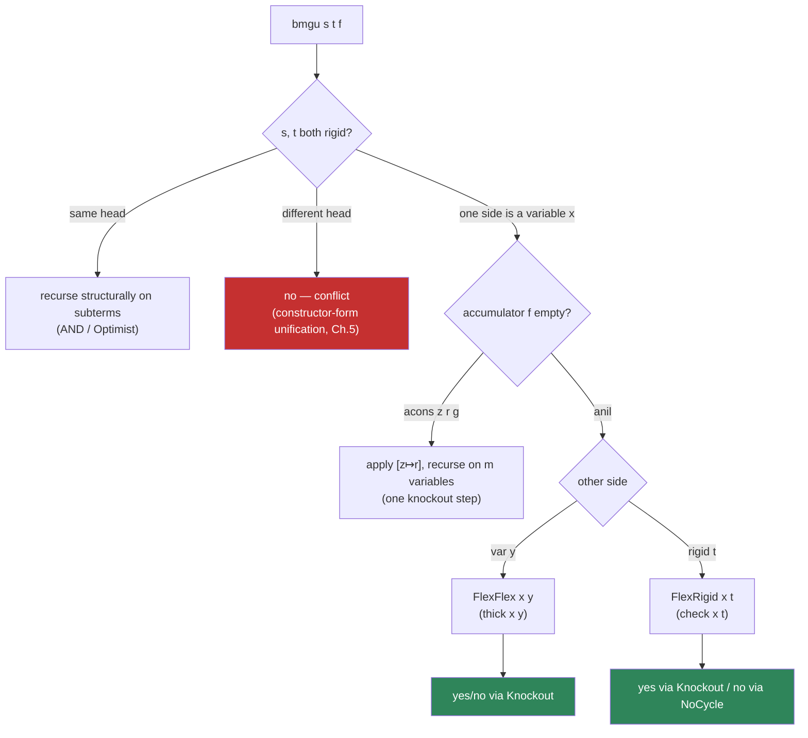

[[book-guidelines|↩ Back to guidelines]]

## Why this section exists

Every textbook treatment of first-order unification you've ever seen cheats in the same
place. The algorithm decomposes a pair of trees, and whenever it hits a variable, it
does something with `occurs-check`-then-`substitute`, and then it says "and this
terminates because the number of distinct variables strictly decreases at each step" —
and then it proves that as a *separate*, external lemma, usually by threading a natural
number through an accessibility argument or a lexicographic ordering that has nothing
to do with the recursive structure of the data the function is walking over. McBride's
name for this is blunt: the termination argument is "external to the program." The
function itself doesn't know it terminates; a bolted-on ordering does.

This matters more than it sounds like it should, because in a language whose type
checker performs termination checking as a precondition for treating a function as
total (as Coq, Agda, Lean's `#print axioms`-clean fragment, or OLEG itself all do),
"the algorithm terminates" and "the algorithm type-checks" are the same question. If
your recursion isn't visibly structural, you either need well-founded recursion
machinery (fine, but it makes the *proof of correctness* re-derive the same
termination reasoning a second time, entangled with partial correctness), or you need
to convince a totality checker your custom measure decreases — a proof obligation that
adds real weight for every unification-shaped function you ever write.

§7.3 is McBride's flagship demonstration that this externality is not intrinsic to
unification — it is an artifact of using *simply* typed (or unindexed) data structures
to represent terms. Give the terms a type that is *indexed by their own free-variable
count*, and the recursion that "obviously" decreases that count becomes recursion on
an ordinary natural number argument — visibly structural, no ordering required, no
separate termination lemma. This is the thesis's central example of the mantra stated
explicitly in the concluding chapter: "if my recursion is not structural, I am using
the wrong structure." It is also, not coincidentally, close to the beating heart of
what an elaborator's metavariable unifier has to do — so this section is one of the
most load-bearing in the whole book for anyone building a Miller-pattern-unification
engine.

## Setting the scene: terms as an indexed family

Before unification proper, McBride fixes the datatype to be unified over. It's
deliberately the simplest possible term language with variables — binary trees with
leaves and variables, no binding constructs (that complexity was already handled,
separately, in §7.2's treatment of $\lambda$-calculus substitution via `thin`/`thick`).
The number of variables is *not* discovered by traversing the term; it is a type
*parameter*, fixed before any term of that type is built:

$$
\begin{array}{ll}
\textbf{formation} & n : \mathbb{N} \vdash \mathsf{tree}\ n : \mathsf{Type} \\[4pt]
\textbf{constructors} & \dfrac{x : \mathsf{fin}\ n}{\mathsf{var}\ x : \mathsf{tree}\ n}
\qquad \mathsf{leaf}_n : \mathsf{tree}\ n
\qquad \dfrac{s, t : \mathsf{tree}\ n}{\mathsf{fork}\ s\ t : \mathsf{tree}\ n}
\end{array}
$$

Here $\mathsf{fin}\ n$ is the standard finite-set-of-size-$n$ family (the same one used
for de Bruijn indices in §7.2): a term of type $\mathsf{tree}\ n$ can only ever mention
one of the $n$ variables that its *type* already committed to. This is the load-bearing
choice. A term over $sn$ (successor of $n$, i.e. $n+1$) variables and a term over $n$
variables are literally *different types* — you cannot even state "unify these two
trees" for terms with a mismatched variable count without first relating the two counts
by a substitution.

**What breaks without this.** In an unindexed representation — say `Tree = Leaf | Fork
Tree Tree | Var Nat` — nothing in the type of `Tree` tells you how many distinct
variables a particular value of type `Tree` actually mentions. You'd have to compute
that separately (a "count the free variables" auxiliary function) every time you wanted
to argue that a substitution shrank the problem. McBride is explicit that this
auxiliary function is not a convenience the book is choosing to skip — it is *exactly*
the missing ingredient that every prior unification proof (Manna–Waldinger, Paulson,
Rouyer, Bove — surveyed in §7.3.8, see below) had to construct by hand, externally,
because their term representations didn't carry the variable count as data.

**Rust grounding — and its limit.** You can get partway there with a `usize` field, but
Rust's type system (no dependent types) cannot make the compiler *enforce* that a
`Fork`'s two children share the same bound, or that a `Var` index is provably `< n`:

```rust
// The best an ordinary (non-const-generic) Rust enum can do:
enum Tree {
    Leaf,
    Fork(Box<Tree>, Box<Tree>),
    Var(usize), // "should" be < n, but nothing enforces it
}
```

Even reaching for const generics (`Tree<const N: usize>`) only gets you a type-level
tag; Rust has no dependent elimination principle to let you pattern-match on `N` and
recurse on `N - 1` in a way the borrow/type checker recognizes as *structural* the way
it recognizes recursion on `Box<Tree>` fields as structural. This is precisely
McBride's point in his aside about "the remarkable higher-order polymorphic extensions"
of "upmarket" languages: parametric polymorphism over a fixed `N` is not the same
capability as *computing* on `N`, and only the latter licenses structural recursion on
the variable count. It's a genuinely dependently-typed capability.

**Lean grounding — the literal translation.** Lean's `Fin n` and an indexed inductive
family reproduce McBride's formation/constructor rules directly:

```lean
inductive Tree : Nat → Type where
  | var  {n : Nat} (x : Fin n) : Tree n
  | leaf {n : Nat} : Tree n
  | fork {n : Nat} (s t : Tree n) : Tree n
```

Here `Tree (n+1)` and `Tree n` are different types by construction, exactly as in
$\mathsf{tree}\ sn$ versus $\mathsf{tree}\ n$ above — and Lean's kernel will let you
recurse on the `Nat` index with the same structural legitimacy as recursing on a
constructor argument, because `Nat` itself is inductive. This is the mechanism McBride
is exploiting.

## Unification as optimization in a Kleisli category

Before writing any unification code, McBride reframes what "most general unifier"
*means* in a way that will let him reuse a single correctness lemma across every case
of the algorithm.

A **substitution** $f : m \rightsquigarrow n$ (McBride's arrow notation for "a map from
$\mathsf{fin}\ m$ into $\mathsf{tree}\ n$") is exactly a Kleisli arrow of the
substitution monad built over `tree` (constructed in §7.2 by the same general
`Concrete`/`Functor`/`Monad` machinery used for $\lambda$-calculus substitution).
Substitutions compose via monadic bind, and this composition induces a preorder:

$$ f \sqsubseteq g \iff \exists h.\ f = h \mathbin{;} g $$

read "$f$ is *no more specific than* $g$" — $g$ can be obtained from $f$ by applying a
further substitution $h$ afterward. A unifier for $s, t : \mathsf{tree}\ m$ is some
$f$ with $f^\dagger s \equiv f^\dagger t$ (applying $f$ to both sides makes them equal);
a *most general* unifier is a maximal element of that set under $\sqsubseteq$.

This is now visibly a search for a maximum under a preorder subject to a
predicate — an **optimization problem**. McBride observes that *many* algorithms have
this shape (finding the max of a list, ML principal-type inference, unification) and
that a useful subclass of them are amenable to a strategy he calls **optimistic
optimization**: guess the best answer, then walk the constraints one at a time,
narrowing the guess by only as much as each constraint demands.

### Closed constraints and the Optimist lemma

The strategy is only sound for constraints with a specific closure property. McBride
packages "a constraint on arrows out of $S$" as a record type $\mathsf{Closed}\ S$:

$$
\begin{aligned}
\mathit{Why} &: \forall T.\ (S \to T) \to \mathsf{Type} \\
\mathit{ClosedEq} &: \forall T.\ \forall f, g : S \to T.\ f \equiv g \to \mathit{Why}\ f \to \mathit{Why}\ g \\
\mathit{Closure} &: \forall T.\ \forall g : S \to T.\ \mathit{Why}\ g \to \forall U.\ \forall f : T \to U.\ \mathit{Why}\ (f \mathbin{;} g)
\end{aligned}
$$

In words: $\mathit{Why}$ is the predicate itself (respecting extensional equality of
arrows, via $\mathit{ClosedEq}$ — necessary because substitutions are represented as
functions, and intensional type theory doesn't identify extensionally-equal functions
for free); and $\mathit{Closure}$ says the predicate is **downward-closed**: if $g$
satisfies it, so does *any further refinement* $f \mathbin{;} g$. This is exactly the
"once you've solved it, anything more specific stays a solution" property that licenses
optimism — you never have to backtrack past a constraint once satisfied, because
narrowing further can't *break* it.

$\mathsf{Maximal}\ f$ (for $f$ satisfying a $\mathsf{Closed}\ S$ constraint) then bundles
"$f$ is a solution" with "every solution $g$ factors through $f$": $\exists h.\ g = h
\mathbin{;} f$. Constraints compose with $\mathsf{AND}$ (conjunction of the $\mathit{Why}$
predicates), and a constraint can be relativized to an already-accumulated guess $g$ via
$\mathsf{Bound}\ g$, which asks for solutions $f$ with $P\ (f \mathbin{;} g)$ rather than
$P\ f$ directly — i.e., "solutions to $P$ *once you've already applied* $g$."

The **Optimist lemma** is the engine that makes all of this pay off:

$$
\mathsf{Optimist} :\; \mathsf{Maximal}\ P\ g \;\to\; \mathsf{Maximal}\ (\mathsf{Bound}\ g\ P)\ f \;\to\; \mathsf{Maximal}\ (\mathsf{AND}\ P\ Q)\ (f \mathbin{;} g)
$$

i.e.: if $g$ is a maximal solution to $P$ alone, and $f$ is a maximal solution to $Q$
*relative to the bound $g$ already gives you*, then $f \mathbin{;} g$ is a maximal
solution to $P \wedge Q$ together. The proof (worked in full on pp. 213–215) is a clean
two-step factoring argument: any competing solution $k$ to $P \wedge Q$ first factors
through $g$ (by $g$'s maximality for $P$) as $k = h' \mathbin{;} g$; then, since $Q\ (h'
\mathbin{;} g)$ holds by that factoring plus $\mathit{ClosedEq}$, $h'$ factors through
$f$ (by $f$'s maximality for the bounded $Q$) as $h' = h \mathbin{;} f$; compose the two
factorings and $k = h \mathbin{;} (f \mathbin{;} g)$ as required. Notably the proof
never uses $Q$'s own closure property — only $P$'s — which is why the lemma can be
iterated: solve a conjunction of downward-closed constraints one at a time,
*accumulating the answer as you go*, and each subsequent constraint only has to be
solved *relative to what's already been fixed*.

**What breaks without this framing.** Without recognizing unification as an instance of
this general optimization pattern, you'd have to reprove "the substitution accumulated
from the left subtree composes correctly with the substitution needed for the right
subtree" by hand, freshly, for every recursive case of the algorithm (and there are
several, once flexible/variable cases are considered). The Optimist lemma abstracts that
argument once, so §7.3's later correctness proof of `bmgu` only has to *invoke*
`Optimist` at each recursive step rather than re-deriving accumulator-composition
soundness each time.


## `mgu` via an accumulator-passing `bmgu`

Casting `Unifies s t` as a `Closed m` constraint (its downward-closure follows directly
from substitution respecting composition), McBride shows the structural decomposition
of rigid-rigid problems is exactly an instance of `AND`:

$$
\mathsf{Unifies}\ (\mathsf{fork}\ s_1\ t_1)\ (\mathsf{fork}\ s_2\ t_2) \;\equiv\; \mathsf{AND}\ (\mathsf{Unifies}\ s_1\ s_2)\ (\mathsf{Unifies}\ t_1\ t_2)
$$

Following the Optimist strategy exactly, the top-level algorithm

$$ \mathsf{mgu} : \forall m.\ \mathsf{tree}\ m \to \mathsf{tree}\ m \to \mathsf{maybe}\ (\exists n.\ m \rightsquigarrow n) $$

is defined in terms of an accumulator-passing helper

$$ \mathsf{bmgu} : \forall m.\ \mathsf{tree}\ m \to \mathsf{tree}\ m \to (m \rightsquigarrow n) \to \mathsf{maybe}\ (m \rightsquigarrow n') $$

seeded with the identity substitution (the $\sqsubseteq$-largest element, so it imposes
no bound yet): $\mathsf{mgu}_m\ s\ t = \mathsf{bmgu}\ s\ t\ \langle m, \mathrm{id}\rangle$.
The rigid-rigid cases are pure structural recursion, riding on `AND`/`Optimist`:

$$
\begin{array}{lcl}
\mathsf{bmgu}\ \mathsf{leaf}\ \mathsf{leaf} & = & \lambda f.\ \mathsf{yes}\ f \\
\mathsf{bmgu}\ \mathsf{leaf}\ (\mathsf{fork}\ s\ t) & = & \lambda f.\ \mathsf{no} \\
\mathsf{bmgu}\ (\mathsf{fork}\ s\ t)\ \mathsf{leaf} & = & \lambda f.\ \mathsf{no} \\
\mathsf{bmgu}\ (\mathsf{fork}\ s_1\ t_1)\ (\mathsf{fork}\ s_2\ t_2) & = & (\lambda f.\ \mathsf{bmgu}\ t_1\ t_2\ f)^\dagger \circ \mathsf{bmgu}\ s_1\ s_2
\end{array}
$$

and this much is unremarkable — every textbook algorithm looks like this on the rigid
cases. The trouble, as McBride flags immediately, starts when a variable is one of the
two terms. The classical move is to **unload** the accumulator — apply the whole
composed substitution $g$ to both sides and recurse on $g^\dagger s$, $g^\dagger t$ —
which is provably equivalent (the `Unload` lemma: $\mathsf{Bound}\ g\ (\mathsf{Unifies}\
s\ t) \equiv \mathsf{Unifies}\ (g^\dagger s)\ (g^\dagger t)$) but *not structural*,
because applying a substitution can only ever grow a term, never shrink it. This is
exactly the point at which every prior treatment reached for an external well-founded
ordering. McBride's point: don't unload eagerly — apply the accumulator to a term only
by one variable-elimination step at a time, and let the variable-count index do the
termination bookkeeping.

## The trick: recursion on the variable-count index

Looking again at `bmgu`'s type, $\forall m.\ \mathsf{tree}\ m \to \mathsf{tree}\ m \to
\ldots$, McBride's insight is that this licenses **lexicographic recursion**, primary on
$m$, secondary on the term structure: when unifying trees over $sm$ variables and you
need to eliminate a variable, you are entitled to a fully general recursive call on
trees over *any* size of `tree m` (however structurally large), because $m < sm$. This
is recursion on an ordinary natural-number argument — as structural, and as unremarkable
to a totality checker, as `fn fact(n: usize) -> usize` recursing on `n - 1`.

To make elimination of a single variable a first-class, single-step operation, §7.2's
$[x \mapsto t]$ ("knockout") substitution is reused: it maps $\mathsf{fin}\ (sn) \to
\mathsf{tree}\ n$, sending $x$ to $t$ and every other variable $y$ (found via `thick`,
the partial inverse of the "insert a fresh variable" operation `thin`) down one level to
$\mathsf{var}\ y$:

$$
[x \mapsto t]\ y \;=\; \begin{cases} t & \text{if } \mathsf{thick}\ x\ y = \mathsf{no} \\ \mathsf{var}\ y' & \text{if } \mathsf{thick}\ x\ y = \mathsf{yes}\ y' \end{cases}
$$

with introduction rules $[x \mapsto t]\ x \simeq t$ and $[x \mapsto t]\ (\mathsf{thin}\
x\ y) \simeq \mathsf{var}\ y$, and an inversion rule `knockoutInv` (derived mechanically
from `thickInv`, per §7.2's methodology) that lets any later proof case-split on
whether a position is exactly $x$ or some thinned $y$. Composing a *sequence* of these
single-variable eliminations is precisely what shrinks the variable-count index one step
at a time, which is what makes the outer recursion on $m$ structural rather than merely
decreasing.

**What breaks without this.** If you instead unload the accumulator wholesale before
recursing (as the naive approach does), you lose the ability to say "this recursive call
is over strictly fewer variables" *structurally* — you'd only know it *semantically*,
via a separate lemma about how many variables survive a substitution, which is exactly
the auxiliary machinery McBride is eliminating.

## Association lists: a concrete, inspectable accumulator

There's a subtlety: to pattern-match on the accumulator itself (needed for the flexible
cases below, which must ask "is this accumulator empty, or does it already map this
particular variable?"), a *functional* representation of substitutions is unworkable —
you cannot case-split on an opaque function. McBride therefore introduces a concrete
datatype of accumulated substitutions, `alist m n` — simultaneously an association list
and a witness of the $\sqsubseteq$ relation between variable counts:

$$
\begin{array}{ll}
\textbf{formation} & m, n : \mathbb{N} \vdash \mathsf{alist}\ m\ n : \mathsf{Type} \\[4pt]
\textbf{constructors} & \mathsf{anil}_n : \mathsf{alist}\ n\ n
\qquad \dfrac{x : \mathsf{fin}\ (sm)\quad t : \mathsf{tree}\ m\quad g : \mathsf{alist}\ m\ n}{\mathsf{acons}\ x\ t\ g : \mathsf{alist}\ (sm)\ n}
\end{array}
$$

Note the constructor's *non-linear* index usage — `acons` both consumes an `alist m n`
and produces an `alist (sm) n`, chaining the variable-count decrease constructor-by-
constructor. McBride remarks this nonlinearity is exactly why `alist` is definable in
ALF, Coq, and OLEG but *not* in Agda or Cayenne (whose stricter positivity/return-type
restrictions, discussed in Chapter 1's survey, forbid a constructor's return-type index
from depending on data in this way). `alist` composes like ordinary list append (also
serving as transitivity of $\sqsubseteq$) and interprets into `SubstK`, the Kleisli
category of substitutions, one `acons` at a time via $[\,\cdot \mapsto \cdot\,]$:

$$ \lceil \mathsf{anil} \rceil = \mathrm{id} \qquad \lceil \mathsf{acons}\ x\ t\ f \rceil = \lceil f \rceil \mathbin{;} [x \mapsto t] $$

`from m` (the algorithm's return type, "some target size and an arrow there") becomes
$\exists n.\ \mathsf{alist}\ m\ n$, and `bmgu`'s full definition can finally handle the
variable case, using $\lceil \cdot \rceil$ to interpret the accumulator when it needs to
apply it:

$$
\mathsf{bmgu}_{sm}\ (\mathsf{var}\ x)\ (\mathsf{var}\ y)\ f =
\begin{cases}
\mathsf{yes}\ (\mathsf{FlexFlex}\ x\ y) & \text{if } f = \mathsf{anil} \\
\lceil \mathsf{Extend}\ z\ r \rceil^\dagger\ (\mathsf{bmgu}_m\ [z{\mapsto}r]^\dagger(\mathsf{var}\ x)\ [z{\mapsto}r]^\dagger(\mathsf{var}\ y)\ g) & \text{if } f = \mathsf{acons}\ z\ r\ g
\end{cases}
$$

and symmetrically for `(var x, leaf)`, `(var x, fork s t)`, and their mirror images,
each routed to `FlexRigid` once the accumulator is empty. The pattern in every flexible
case is the same: *if the accumulator already has a mapping, apply just that one
knockout to shrink the problem by one variable and recurse*; only once the accumulator
is genuinely empty (`anil`) do you actually need to synthesize a *fresh* substitution —
which is exactly the job of `FlexFlex`/`FlexRigid` below.

**Rust grounding.** The shape of `alist` is a length-indexed cons-list — precisely the
data structure a Rust implementation would reach for if it wanted an *inspectable*
substitution log instead of a `Box<dyn Fn>`:

```rust
enum AList {
    Nil,                                  // alist n n
    Cons(usize /* var */, Tree, Box<AList>), // acons x t g : alist (m+1) n
}
```

— the size indices don't type-check statically in Rust the way McBride's `alist m n`
does, but the *operational* shape (a list you can pattern-match, rather than an opaque
closure) is exactly what makes the flexible cases above implementable at all: you need
`match accumulator { Nil => ..., Cons(z, r, rest) => ... }`, not
`apply(accumulator, term)` as a black box.

## Correctness: `mguInv`/`bmguInv` and the case split

Correctness is stated, in the book's recurring style (cf. the elimination-rule
machinery of Chapter 3), as an **inversion principle** rather than a direct
implication — `mguInv` says exactly what each of `mgu`'s two possible outcomes must
mean:

$$
\mathsf{mguInv} : \Phi(\mathsf{mgu}\ s\ t) \;\Longleftarrow\; \big[\Phi(\mathsf{no}) \text{ given } \mathsf{NoUnifier}\ s\ t\big] \times \big[\Phi(\mathsf{yes}\ \langle n,f\rangle) \text{ given } \mathsf{Maximal}\ (\mathsf{Unifies}\ s\ t)\ \lceil f \rceil\big]
$$

reduced to an analogous `bmguInv` for `bmgu`, proved by recursion induction on `bmgu`
itself (McBride's standard technique: derive the specification of a function
mechanically from its own defining equations, keeping the motive universally
quantified over the accumulator) with a case split mirroring the algorithm's own
structure:

- **Rigid-rigid off-diagonal** ("conflict"): e.g. `leaf` vs. `fork s t` reduces, after
  pushing the accumulator's interpretation under the constructors, to a hypothesis
  $\mathsf{leaf} \simeq \mathsf{fork}\ \ldots$ — closed immediately by the constructor-
  form unification tactic from Chapter 5 (John Major equality's `Qnify`).
- **Rigid-rigid on-diagonal** ("injectivity"): `fork s₁ t₁` vs. `fork s₂ t₂` inverts
  *both* recursive calls via their inductive hypotheses, then reassembles the two
  partial `Maximal` witnesses into one via `Optimist` — this is the case where the
  general optimization machinery from §7.3.1 earns its keep directly.
- **Flexible cases (`acons z r g`)**: inverting the recursive call on the
  knocked-out subproblem yields either a `NoUnifier` fact that transports (via
  $\lceil \mathsf{acons}\ z\ r\ g \rceil = \lceil g \rceil \mathbin{;} [z \mapsto r]$)
  to the outer problem, or a maximality witness that transports the same way after
  some "bound shuffling and composition hacking."
- **Flex-flex / flex-rigid base cases** (accumulator is `anil`): these are the two
  cases where `bmgu` doesn't just propagate an existing witness — it has to
  *construct* one from scratch. The proof obligations here are exported as the
  specifications of `FlexFlex` and `FlexRigid`, deferred to the next two sections.

The header result of this section is worth pausing on: **"we have seen enough to know
that our unification algorithm is terminating of its own accord."** No separate
termination proof was ever written — termination is a byproduct of the fact that
`bmgu`'s definition type-checks as structural recursion on `m`, full stop.

## The occurs check as a witness-producing computation

Conventionally, the occurs check is a boolean: does `x` occur in `t`? If not, you go
ahead and substitute `t` for `x` (using ordinary, index-*unaware* substitution) and
argue separately, via that auxiliary variable-counting lemma, that this doesn't loop.
McBride's reframing: since terms are already indexed by variable count, "does `x` occur
in `t`" is the *wrong* question — the right question is "can `t`, which lives over
$sm$ variables including possibly `x`, be **re-expressed** as a term $t'$ over just the
remaining $m$ variables, thinned back up by inserting `x`?" That is, find $t'$ with

$$ [\hspace{-2pt}[\, \mathsf{thin}\ x \,]\hspace{-2pt}]^\dagger\ t' \simeq t $$

If such a $t'$ exists, $[x \mapsto t']$ is *immediately* a most general unifier of
$\mathsf{var}\ x$ and $t$ — and this is precisely what the central `Knockout` lemma
proves:

$$
\mathsf{Knockout} : \mathsf{Maximal}\ \big(\mathsf{Unifies}\ (\mathsf{var}\ x)\ ([\hspace{-2pt}[\,\mathsf{thin}\ x\,]\hspace{-2pt}]^\dagger t')\big)\ [x \mapsto t']
$$

The proof (pp. 227–229) has the same two-part shape as every `Maximal` obligation:
*holds* — $[x \mapsto t']$ applied to both sides agree, reducible by the introduction
rules for $[\,\cdot \mapsto \cdot\,]$ down to a fact about behavior at variables, closed
by the established behavior of thin/thick; and *factors* — any competing unifier $f$
must equal $g \mathbin{;} [x \mapsto t']$ for some $g$, and the natural witness $g =
\lambda y.\ f\,(\mathsf{thin}\ x\ y)$ works out via `knockoutInv` plus monadic
rewriting of $f$ as $f \mathbin{;} [\hspace{-2pt}[\,\mathsf{thin}\ x\,]\hspace{-2pt}]$.

This is the passage that most directly rewards the "mechanism, not just theory"
framing: **the occurs check stops being a decision procedure and becomes a partial
inverse of `thin`** — `check x t` (defined in §7.3.7 by structurally pushing `thick`
through `t`) either *succeeds*, returning the witness $t'$ that `Knockout` needs, or
*fails*, and failure is exactly the situation `Knockout` cannot apply to. The check and
the unifier-construction step are the same computation, not two.

## Positions, zippers, and `NoCycle`

To prove that occurs-check failure genuinely implies "no unifier exists" (rather than
just "this particular algorithm gives up"), McBride needs to formalize *occurrence*
itself — and reaches for Huet's zipper idea, reversed in direction (root-to-hole rather
than hole-to-root, which suits this proof better): a datatype `pos n` of one-hole
contexts within a `tree n`, with an operator `goes` (written postfix) that plugs a term
into the hole:

$$
\begin{array}{ll}
\textbf{constructors} & \mathsf{here}_n : \mathsf{pos}\ n
\qquad \dfrac{t : \mathsf{tree}\ n \quad \mathit{there} : \mathsf{pos}\ n}{\mathsf{left}\ \mathit{there}\ t : \mathsf{pos}\ n}
\qquad \dfrac{s : \mathsf{tree}\ n \quad \mathit{there} : \mathsf{pos}\ n}{\mathsf{right}\ s\ \mathit{there} : \mathsf{pos}\ n}
\end{array}
$$

$$
\mathsf{here}\ \mathit{it}\ \mathsf{goes} = \mathit{it} \qquad
(\mathsf{left}\ \mathit{there}\ t)\ \mathit{it}\ \mathsf{goes} = \mathsf{fork}\ (\mathit{there}\ \mathit{it}\ \mathsf{goes})\ t \qquad
(\mathsf{right}\ s\ \mathit{there})\ \mathit{it}\ \mathsf{goes} = \mathsf{fork}\ s\ (\mathit{there}\ \mathit{it}\ \mathsf{goes})
$$

`goes` interprets `pos n` as arrows of a one-object category over `tree n`, with `here`
as identity and a composition `then` matching path concatenation — proved coherent by
a routine recursion induction. The payoff is `NoCycle`: a term can only ever contain
*itself* at the root position —

$$ \mathit{it} \simeq \mathit{there}\ \mathit{it}\ \mathsf{goes} \;\Longrightarrow\; \mathit{there} \simeq \mathsf{here} $$

— proved by induction on `it`, then case analysis on `there`, with the interesting case
(`fork`/`left`) requiring a genuine trick: rotate the hypothesized cycle by
re-expressing the position `there` composed with an extra `left here t` step, so that
the *same* inductive hypothesis (about the smaller subterm `s`) applies to what started
as a fact about the whole `fork s t`. This is the categorical payoff of having defined
`then`/`goes` as a genuine (if degenerate) category in the first place — the rewriting
needed to "rotate the cycle" is just associativity of composition.

Here's the picture the position datatype is describing — `where(var x) goes` reading a
path from the root down to an occurrence of `var x`:

<svg viewBox="0 0 460 220" xmlns="http://www.w3.org/2000/svg" font-family="monospace" font-size="13">
  <circle cx="230" cy="30" r="18" fill="#2b6cb0" stroke="#1a365d" stroke-width="1.5"/>
  <text x="230" y="34" text-anchor="middle" fill="#fff">fork</text>
  <line x1="230" y1="48" x2="120" y2="90" stroke="#718096" stroke-width="2"/>
  <line x1="230" y1="48" x2="340" y2="90" stroke="#718096" stroke-width="2"/>
  <text x="150" y="72" fill="#718096">left</text>
  <text x="300" y="72" fill="#718096">right (side branch s)</text>
  <circle cx="120" cy="105" r="18" fill="#2b6cb0" stroke="#1a365d" stroke-width="1.5"/>
  <text x="120" y="109" text-anchor="middle" fill="#fff">fork</text>
  <rect x="300" y="90" width="70" height="30" rx="4" fill="#a0aec0" stroke="#4a5568"/>
  <text x="335" y="109" text-anchor="middle" fill="#1a202c">t (side)</text>
  <line x1="120" y1="123" x2="60" y2="165" stroke="#718096" stroke-width="2"/>
  <line x1="120" y1="123" x2="180" y2="165" stroke="#718096" stroke-width="2"/>
  <text x="55" y="147" fill="#718096">left</text>
  <text x="150" y="147" fill="#718096">right (side)</text>
  <rect x="30" y="165" width="60" height="30" rx="4" fill="#a0aec0" stroke="#4a5568"/>
  <text x="60" y="184" text-anchor="middle" fill="#1a202c">side</text>
  <circle cx="180" cy="180" r="18" fill="#2f855a" stroke="#22543d" stroke-width="1.5"/>
  <text x="180" y="184" text-anchor="middle" fill="#fff" font-weight="bold">x</text>
  <text x="180" y="210" text-anchor="middle" fill="#4a5568">here : pos n  (the hole)</text>
</svg>

## `FlexFlex` and `FlexRigid`

With `Knockout` and `NoCycle` in hand, the two remaining base cases are short.

**`FlexFlex`** (`var x` vs. `var y`, empty accumulator) dispatches on `thick x y`:

$$
\mathsf{FlexFlex}\ x\ y = \begin{cases} \langle sm, \mathsf{anil}\rangle & \mathsf{thick}\ x\ y = \mathsf{no} \\ \langle m, \mathsf{acons}\ x\ (\mathsf{var}\ y')\ \mathsf{anil}\rangle & \mathsf{thick}\ x\ y = \mathsf{yes}\ y' \end{cases}
$$

`thickInv` splits its correctness obligation into exactly the "identity" case ($x = y$;
the identity substitution trivially unifies a variable with itself, and every unifier
factors through the identity — free) and the "coalescence" case ($x \neq y$, thinned to
$y'$), which reduces directly to an instance of `Knockout` with $t' = \mathsf{var}\ y'$.

**`FlexRigid`** (`var x` vs. a non-variable `t`) routes through `check x t`:

$$
\mathsf{FlexRigid}\ x\ t = \begin{cases} \mathsf{yes}\ \langle m, \mathsf{acons}\ x\ t'\ \mathsf{anil}\rangle & \mathsf{check}\ x\ t = \mathsf{yes}\ t' \\ \mathsf{no} & \mathsf{check}\ x\ t = \mathsf{no} \end{cases}
$$

`checkInv` again splits into exactly two cases: success, which reduces straight to
`Knockout`; and failure, where the inversion principle hands you a *position* `where`
with $t \simeq \mathit{where}\ (\mathsf{var}\ x)\ \mathsf{goes}$ — i.e., an explicit
occurrence, not a bare "occurs = true" flag. Proving that this genuinely rules out a
unifier is where `NoCycle` fires: any hypothetical unifier $f$ forces (via
`Coherence`, the lemma that pushing a substitution through `goes` commutes with pushing
it through the position) $f\,x \simeq (f^\dagger \mathit{where})\ (f\,x)\ \mathsf{goes}$
— a term equal to something containing itself at position $f^\dagger \mathit{where}$ —
so `NoCycle` forces that position to be `here`, collapsing `t`'s occurrence position to
the root and contradicting `notVar` (the side-condition that `t` isn't itself a bare
variable). The occurs check's *failure witness* — a concrete position — is what lets
this argument go through by pure equational reasoning, rather than an appeal to a
separately-argued "occurs implies infinite/non-terminating" fact.



## §7.3.8: how this compares to prior verified unifiers

McBride closes with a deliberately generous literature comparison, identifying three
"delicate aspects" every unification proof must confront — termination, propagating a
unifier through the rest of the problem, and occurs-check failure — and locating his
contribution precisely:

- **Manna & Waldinger** (hand-synthesis, 1981) needed an externally-chosen ordering
  they admit is "not so well-motivated formally" — combining variable-set size with
  problem structure lexicographically, exactly the ordering McBride's type-indexing
  makes unnecessary.
- **Paulson** (LCF, 1985) wished for "an LCF package for well-founded induction,"
  a symptom of the same externality.
- **Rouyer** confines the well-founded part to an outer recursion on variable count,
  keeping the inner term-recursion structural — a partial anticipation of McBride's
  move, done manually rather than by indexing.
- **Bove** builds an accessibility relation whose indices are the function's own
  arguments, mechanically deriving a recursion-induction principle for a program that
  isn't visibly structural — an alternative way of internalizing the same termination
  argument, at the cost of an explicit relation rather than an indexed type.
- McBride's own move — avoiding well-founded recursion on the variable count by
  unloading the accumulator *incrementally*, one knockout at a time — is presented as
  what makes the recursion actually structural rather than merely well-founded, and he
  credits the closely related accumulator techniques of Armando–Smaill–Green's
  automated synthesis and Bove's own accumulating parameter as evidence the pattern is
  not idiosyncratic to this proof.

His summary line is worth keeping verbatim, since it's the thesis's argument in
miniature: **"Unification has always been structurally recursive — it is just that the
structure could not be made data until the right types came along."**

## Synthesis: where this sits, and why it matters for a metavariable unifier

**What this depends on.** Everything here rides on machinery built earlier in the
book: the `Concrete`/`Functor`/`Monad` packaging of substitution as a Kleisli category
(§7.1), the `thin`/`thick`/`fin` apparatus and its inversion principles (§7.2, reused
verbatim), John Major equality's constructor-form unification tactic for the rigid
conflict cases (Chapter 5), and the recursion-induction/inversion-principle
methodology for stating and proving properties of programs by structural means
(Chapter 3's `eliminate` machinery, applied here to `bmgu` itself).

**What depends on this.** Nothing later in *this* thesis builds on §7.3 directly (it's
the capstone example), but McBride's Conclusion generalizes its moral into a
methodological thesis for dependently typed programming at large: index your data by
whatever a recursive algorithm needs to measure, and termination arguments that used
to be external become structural, for free.

**For the metavariable unifier this workbench is aiming at ([[book-guidelines|Focus
Areas]]: `type-theory`, `automated-reasoning`):** this section is close to a direct
blueprint, not just an analogy. A Miller-pattern-unification-based elaborator (Lean's
kernel unifier is the canonical example) faces exactly McBride's problem in miniature:
a metavariable-solving step must apply an accumulated substitution to a term, and the
termination of the overall constraint-solving loop depends on that process not looping
forever as substitutions compose. The `alist`-as-concrete-accumulator design — refusing
to hide the substitution behind an opaque function precisely so that the *solver
itself* can pattern-match on "is there already a binding for this metavariable?" — is
the same design decision an elaborator's metavariable context (`MetavarContext` in Lean
terms) has to make. And the reframing of the occurs check from boolean predicate to
witness-producing partial inverse is the same shape as the *pattern condition* check in
Miller's fragment: pattern unification doesn't just ask "is this a valid pattern
unification problem?" — like `check`, a real implementation computes, in the same pass,
the substitution that *is* the solution when the pattern condition holds, and rejects
with structured information (not just failure) when it doesn't. If this workbench's
compiler ever implements its own metavariable-unification core, `bmgu`'s
accumulator-passing, index-shrinking structure is close to directly transliterable: the
"context" a metavariable's solution can depend on plays the role of the shrinking
variable-count index here.
