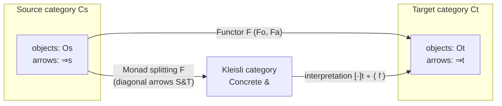
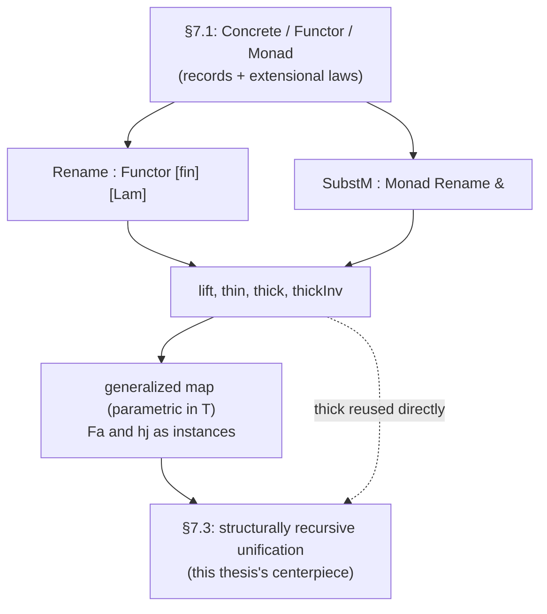

[[book-guidelines|↩ Back to guidelines]]

## Why bother with category theory at all?

By the time McBride reaches Chapter 7, he has a working recipe for *doing things with syntax*: he can define an indexed inductive datatype, derive its eliminator, and use recursion induction or inversion principles to prove things about functions defined over it. Chapter 7 is the chapter where that recipe gets exercised twice over — once for capture-avoiding substitution over de Bruijn terms, and once (in §7.3, its own article) for [[A-Structurally-Recursive-Unification-Algorithm|a structurally recursive unification algorithm]].

Both of those exercises need two closely related operations over terms: **renaming** (turning a term over one set of variables into a term over another, given a mapping between the variable sets) and **substitution** (the same idea, but the mapping sends variables to *terms* rather than to bare variables). These operations obviously have the shape of a functor and a monad — renaming is functorial in the variable set, and substitution is the Kleisli extension of renaming. But there's a wrinkle: in a system as intensional as OLEG, "the shape of a functor" cannot just mean "satisfies the functor laws up to `=`, the primitive judgmental equality." Two functions can behave identically on every input and still be distinct terms — different case trees, different orders of pattern match, different auxiliary lemmas baked in. If the functor laws are stated with `=`, you'd be forced to prove them anew every time you so much as reshuffled a proof.

**What breaks without this machinery:** without a notion of "the same function, up to what it actually computes," every syntactic operation — renaming, substitution, later the accumulating substitutions of the unifier — would need bespoke, one-off correctness lemmas that can't be reused across different concrete implementations of "the same" arrow. McBride's fix is to define categories, functors and monads as *data* — records you fill in — paired with an explicit *interpretation* into actual OLEG functions, and to make the category-theoretic laws talk about extensional equality of that interpretation, not intensional equality of the data itself. This is the whole point of §7.1: it buys reusable, extensionally-robust category theory cheaply, and it is the packaging the substitution machinery of §7.2 is built on top of.

This is also, not coincidentally, a problem you will meet again the moment you write an elaborator: `isDefEq` exists precisely because two terms that behave the same must be treated as interchangeable even though they are not the same tree. §7.1's `Concrete`/`Functor`/`Monad` records are McBride's disciplined way of making "interchangeable because extensionally equal" into a *checked property* of a piece of data, rather than an informal meta-remark.

---

## Concrete categories: objects and arrows as data, not as themselves

### The definition

McBride restricts attention to what Saunders Mac Lane calls **concrete categories** — categories whose objects are literally families of types, and whose arrows are literally functions between types in that family. But McBride relaxes even that: objects and arrows don't have to *be* types and functions, only to be *interpretable as* types and functions. This is the whole trick, and it's worth sitting with.

He fixes:

$$
\begin{aligned}
O &: \mathrm{Type} \\
{\Rightarrow} &: O \to O \to \mathrm{Type}
\end{aligned}
$$

$O$ is a type of "object codes," and $S \Rightarrow T$ is a type of "arrow codes" from $S$ to $T$. Neither is required to be a type or a function yet — that's what the record supplies:

$$
\mathrm{Concrete}\;\Rightarrow\;\left\{
\begin{aligned}
\iota &: \forall S:O.\; S \Rightarrow S \\
{\circ} &: \forall R,S,T:O.\; (S \Rightarrow T) \to (R \Rightarrow S) \to (R \Rightarrow T) \\
[\,\cdot\,] &: O \to \mathrm{Type} \\
[\,\cdot\,] &: \forall S,T:O.\; (S \Rightarrow T) \to [S] \to [T] \\
\mathrm{RespI} &: \forall S:O.\; \forall s:[S].\; [\iota_S]\,s \simeq s \\
\mathrm{RespC} &: \forall R,S,T:O.\; \forall f:S\Rightarrow T.\; \forall g:R\Rightarrow S.\; \forall r:[R].\; [f \circ g]\,r \simeq [f]\,([g]\,r)
\end{aligned}
\right.
$$

Reading this in words: a `Concrete` category supplies an identity-arrow constructor $\iota$, a composition operator $\circ$ on arrow *codes*, an interpretation $[\,\cdot\,]$ that turns an object code into an actual type and an arrow code into an actual function between the interpretations of its objects, and two laws — `RespI` and `RespC` — saying that interpretation is a homomorphism: identity codes interpret to the identity function, and composed codes interpret to composed functions. (McBride overloads $[\,\cdot\,]$ for both the object- and arrow-level interpretation; context disambiguates.)

The book's own laziest and most illuminating example: fix any family $\mathrm{Fam} : O \to \mathrm{Type}$, take arrow codes to just *be* functions between the images, $S \Rightarrow T \;{:=}\; \mathrm{Fam}\, S \to \mathrm{Fam}\, T$, and let interpretation be the identity — you get $[\mathrm{Fam}] : \mathrm{Concrete}\; \Rightarrow$, "the usual notion of functions between types in a family, represented within our defined class of category." Taking $\mathrm{Fam} = \mathrm{id}$ on $\mathrm{Type}$ gives $[\mathrm{Type}]$, the category of OLEG types and genuine functions.

But the *point* of the abstraction is that arrows need not be genuine functions at all. McBride's example: $\mathrm{Concrete}\,\dot{\mathbb{N}}$, a one-object category whose arrows *live in* $\mathbb{N}$ (via a trivial $\mathbf{1} \to \mathbf{1} \to \mathbb{N}$ indexing), interpreted as $n \mapsto (\lambda x.\, x + n)$. Composition is just `plus`, the identity is `0`, and `RespC` reduces to associativity of addition. Nothing here is a "function" in the arrow-code sense — arrows are natural numbers that merely *behave like* functions once interpreted. This foreshadows §7.3, where the arrows of the unifier's Kleisli category will be *association lists* (accumulated substitutions), not functions — exactly this pattern of "concrete but not literally functional" arrows.

### Faithfulness is free, by fiat

Mac Lane's classical definition demands a *faithful* functor into $\mathbf{Set}$ — interpretation must be injective on arrows. McBride sidesteps the question of "what is the right notion of arrow equality to check faithfulness against" by simply *defining* two arrows to be the same exactly when their interpretations agree everywhere:

$$
f \sim g \;\;:\Longleftrightarrow\;\; \forall s:[S].\; [f]\,s \simeq [g]\,s
$$

Faithfulness is then trivial, by construction — you can never have two *inequal* (under $\sim$) arrows with the same interpretation, because $\sim$ *is* "same interpretation." As he puts it, "in type theory, as in marriage, fidelity comes down to the way you see things" — OLEG's intensional equality is too fine-grained to be useful here, so the categorical laws are deliberately stated against this coarser, extensional $\sim$. The absorption and associativity laws for $\circ$ ($\iota \circ f \sim f$, $f \circ \iota \sim f$, $(f\circ g)\circ h \sim f\circ(g\circ h)$) then follow by pure reflexivity of $\sim$ — they're not new theorems, they're restatements of function composition's associativity, pushed through $[\,\cdot\,]$.

**What breaks without this move:** if the categorical laws were stated with OLEG's native `≃` (propositional/intensional equality on terms) rather than $\sim$, essentially no interesting example would satisfy them — two implementations of "the identity renaming," say, are almost never *the same term*, only the same function. Defining the equivalence at the level of interpretation is what makes the categorical structure usable at all for real syntax-manipulation code.

### Grounding: a `Concrete` category as a Rust trait

The direct translation is a trait bundling an "arrow representation" type with an interpretation function, plus the laws as (unenforced, but statable) obligations:

```rust
trait Concrete {
    type Obj;
    type Arrow<S, T>;              // arrow code from S to T (conceptually indexed by Obj)
    type Interp<O>;                // the actual type an object interprets to

    fn id<S>() -> Self::Arrow<S, S>;
    fn compose<R, S, T>(f: Self::Arrow<S, T>, g: Self::Arrow<R, S>) -> Self::Arrow<R, T>;

    fn apply<S, T>(f: &Self::Arrow<S, T>, x: Self::Interp<S>) -> Self::Interp<T>;

    // RespI: apply(id(), s) == s          (as an extensional/behavioral equality)
    // RespC: apply(compose(f, g), r) == apply(f, apply(g, r))
}
```

The reason this needs to be a trait with an explicit `apply`, rather than just "arrows are `Fn` closures," is exactly McBride's point: in the interesting cases (§7.3's association-list substitutions, or a real compiler's symbol-table-indexed renamings) the arrow representation is *data you can inspect and manipulate* — you want to pattern-match on it, not just call it. A `Concrete` category is the disciplined way to say "this data acts like a function" without forcing it to literally be a Rust closure.

### Grounding: `Concrete` as a Lean structure

Lean's own approach to categories (`CategoryTheory.Category` in Mathlib) is the "genuine" categorical version — arrows *are* the morphisms, and the laws are stated with propositional equality directly on morphisms, because Lean's `Prop`-valued equality is already extensional enough (via `Eq` plus function extensionality, or via `HEq`/`Quotient`) that McBride's detour through an explicit interpretation function is usually unnecessary. But the *shape* of McBride's record is literally Lean's `structure` mechanism:

```lean
structure Concrete (O : Type) (Arr : O → O → Type) (Interp : O → Type) where
  id      : ∀ S, Arr S S
  comp    : ∀ {R S T}, Arr S T → Arr R S → Arr R T
  apply   : ∀ {S T}, Arr S T → Interp S → Interp T
  respId  : ∀ {S} (s : Interp S), apply (id S) s = s
  respComp: ∀ {R S T} (f : Arr S T) (g : Arr R S) (r : Interp R),
              apply (comp f g) r = apply f (apply g r)
```

This is worth internalizing as a general pattern for a compiler/elaborator project: whenever you find yourself wanting "arrows that are data, plus a semantics," write it exactly this way — a `structure` bundling the operations with the laws they must satisfy, verified once and for all, then reused everywhere the structure is instantiated. It is the same discipline McBride will lean on again for `Functor` and `Monad`.

---

## Functors: preserving structure *and* extensional equality

### The definition, and the extra law that classical category theory doesn't need

A functor takes objects and arrows of a source `Concrete` category to objects and arrows of a target one, preserving identity and composition. Given source/target categories $C_s, C_t$ opened into scope, McBride's `Functor` record is:

$$
\mathrm{Functor}\;C_s\;C_t\;\left\{
\begin{aligned}
F_o &: O_s \to O_t \\
F_a &: \forall S,T.\; (S \Rightarrow_s T) \to (F_o S \Rightarrow_t F_o T) \\
\mathrm{PresEq} &: \forall f,g.\; f \sim g \to F_a\,f \sim F_a\,g \\
\mathrm{PresI} &: \forall S.\; F_a\,\iota_S \sim \iota_{F_o S} \\
\mathrm{PresC} &: \forall f,g.\; F_a\,(f\circ g) \sim (F_a\,f) \circ (F_a\,g)
\end{aligned}
\right.
$$

The first two fields, $F_o$ and $F_a$, are the classical "functor on objects, functor on arrows" data. `PresI` and `PresC` are the classical functor laws (preserve identity, preserve composition) — but stated against $\sim$, not `≃`, for exactly the reason given above. **`PresEq` is the field a `Set`-valued treatment of functors doesn't need**, and it exists purely because arrows here are *data*, not functions: it is entirely possible to write two extensionally-equal source arrows $f \sim g$ whose images $F_a\,f$ and $F_a\,g$ are computationally distinguishable (e.g. `Fa` case-splits on the internal representation of the arrow code) unless the functor's author explicitly proves it can't happen. `PresEq` is that explicit proof obligation.

### Worked example: `maybeF`

Every polymorphic (ML-sense) type constructor gives a functor on `[Type]`. McBride works out `maybe`:

$$
\mathrm{maybeF} : \mathrm{Functor}\,[\mathrm{Type}]\,[\mathrm{Type}], \qquad
F_o = \mathrm{maybe}, \qquad
F_a\,f\,x = \begin{cases} \mathrm{yes}\,(f\,s) & x = \mathrm{yes}\,s \\ \mathrm{no}\,T & x = \mathrm{no}\,S \end{cases}
$$

— i.e. `Fa` is exactly `Option::map` — and `PresEq`/`PresI`/`PresC` all fall out "by inverting `Fa`," i.e. by case-splitting on the `maybe`-typed argument implicit in the extensional equations and reducing each branch to reflexivity.

```rust
struct MaybeF;

impl Functor for MaybeF {
    type Source = TypeCat;   // objects = types, arrows = plain functions
    type Target = TypeCat;

    fn fo<T>() -> Option<T> { unreachable!("object-level; illustrative only") }

    fn fa<S, T>(f: impl Fn(S) -> T) -> impl Fn(Option<S>) -> Option<T> {
        move |x| x.map(&f)   // yes/no case split, exactly maybeF's Fa
    }
    // PresEq, PresI, PresC hold by case analysis + reflexivity, same as the book
}
```

`Option::map` in Rust is `maybeF`'s `Fa`, and the three functor laws are the (usually unstated, taken-on-faith) reasons `.map()` is safe to substitute for an equivalent hand-written match — McBride is making explicit exactly what a Rust programmer trusts implicitly about `Functor`-like combinators.

### `sameFunctor`: replacing an implementation without redoing the proof

Because the functor laws are stated purely in terms of the *extensional* behavior of `Fa`, McBride notes you can prove them once for *any* extensionally-equal replacement of `Fa`:

> "The point is that the functor properties concern only the extensional behaviour of `Fa`, so we may construct a function `sameFunctor` which takes our source functor, `Fa'`, and a proof that `Fa` and `Fa'` have the same extension, returning the functor with `Fa'` on arrows and all the same properties."

This is a small, quiet, and important lemma: it's the mechanism by which a *definitionally different but propositionally/extensionally equal* implementation of a syntax-manipulation function can be swapped in for a proof-friendly (but perhaps slower, or differently-structured) one, without re-deriving `PresI`/`PresC`/`PresEq` from scratch. It is precisely the operation an elaborator performs when it decides two terms are interchangeable via `isDefEq` and then reuses a typing derivation across the swap — `sameFunctor` is the categorical, book-scale version of "if `isDefEq(a, b)`, anything proved about `a` transfers to `b`."

---

## Concrete monads: Kleisli triples as data

### The classical shape, restated

McBride's monads are a "concrete" version of Manes' **Kleisli triple** presentation of monads (equivalent to the endofunctor-plus-natural-transformations definition, but far more convenient computationally — this is exactly why Haskell monads are defined this way too).

> **Definition (Kleisli triple).** A Kleisli triple $(T, \eta, {\rm bind})$ on a category $C$ is given by a function $T$ on objects, an object-indexed family of morphisms $\eta \in C(X, TX)$, and a family of functions ${\rm bind} : C(X,TY) \to C(TX,TY)$, satisfying
> $$
> \eta\,{\rm bind} = \mathrm{id} \qquad (f\,{\rm bind})\circ\eta = f \qquad ((f\,{\rm bind})\circ g)\,{\rm bind} = (f\,{\rm bind})\circ(g\,{\rm bind})
> $$

(McBride writes `bind` postfix as $\mathbin{\rangle\!\!\!-}$, pronounced "bind" — read $f\mathbin{\rangle\!\!\!-}$ as "the extension of $f$.") The Kleisli category built from this has the same objects as $C$, with $X \to Y$ arrows given by $C(X, TY)$; $\eta$ is the identity arrow, and Kleisli composition is $f \bullet g = (f\mathbin{\rangle\!\!\!-}) \circ g$.

### The `Monad` record: splitting a functor

McBride's twist: rather than requiring $T$ to be an endofunctor equipped with $\eta$/`bind`, he asks for a *concrete monad splitting a given functor* $F : \mathrm{Functor}\,C_s\,C_t$. This is a genuinely more general (and more useful, for §7.2) formulation, because the functor need not be an endofunctor — `Rename` below goes from `[fin]` to `[Lam]`, two *different* categories.

Fix $F$'s object and arrow parts $F_o, F_a$. A concrete monad splitting $F$ captures a family of "diagonal arrows" $S \mathbin{\&} T$ ($S,T:O_s$), interpreted in $[S]_s \to [F_o T]_t$:

$$
\mathrm{Monad}\;F\;\left\{
\begin{aligned}
\eta\;({}^{\rm doubledagger}\!\!\upharpoonleft) &: (S \Rightarrow_s T) \to S \mathbin{\&} T \\
{\rm bind}\;(\!\downharpoonright) &: (S \mathbin{\&} T) \to (F_o S \Rightarrow_t F_o T) \\
{\bullet} &: (S \mathbin{\&} T) \to (R \mathbin{\&} S) \to (R \mathbin{\&} T) \\
[\,\cdot\,] &: (S \mathbin{\&} T) \to [S]_s \to [T]_t \\
\mathrm{MonadI} &: [f\!\downharpoonright]_t\,([\eta_S]_s\,s) \simeq [f]_s\,s \\
\mathrm{MonadC} &: [f \bullet g]\,r \simeq [f\!\downharpoonright]_t\,([g]\,r) \\
\mathrm{Split} &: (\eta f)\!\downharpoonright\; \sim\; F_a\,f \\
\mathrm{FrontEq}, \mathrm{FrontC}, \mathrm{BackEq}, \mathrm{BackC} &: \text{$\eta$/bind respect $\sim$, composition, etc.}
\end{aligned}
\right.
$$

The English gloss, via McBride's own running intuition (`maybeF`, viewed as "reliable functions" in the source category and "error-aware, error-propagating functions" in the target): a diagonal arrow is an **unreliable function** — it accepts good data but might produce an error. $\eta$ turns any reliable source arrow into its unreliable image (it can't actually fail, but is typed as if it might); ${\rm bind}$ turns any unreliable arrow into an error-*aware* target arrow (it propagates an incoming error rather than trying to run on it); and `Split` is the coherence law tying this back to $F$: composing $\eta$ then ${\rm bind}$ on a reliable arrow must recover exactly what the functor's own $F_a$ would have done to it.

`Split` is worth dwelling on, because it's the law that makes "renaming is a special case of substitution" a checked fact rather than folklore — precisely the relationship §7.2 exploits to get renaming and substitution from one function.

### Worked example: `maybeM`

$$
\mathrm{maybeM} : \mathrm{Monad}\,\mathrm{maybeF}, \qquad S \mathbin{\&} T := S \to \mathrm{maybe}\,T, \qquad
\eta\,f = \mathrm{yes}\circ f, \qquad
f\!\downharpoonright(\mathrm{yes}\,s) = f\,s,\;\; f\!\downharpoonright(\mathrm{no}) = \mathrm{no}
$$

— this is exactly `Result`/`Option`'s `and_then` (`?`-operator machinery) in Rust, or `>>=` for `Maybe` in Haskell:

```rust
fn eta<S, T>(f: impl Fn(S) -> T) -> impl Fn(S) -> Option<T> {
    move |s| Some(f(s))                    // "reliable" arrow becomes "unreliable" image
}

fn bind<S, T>(f: impl Fn(S) -> Option<T>) -> impl Fn(Option<S>) -> Option<T> {
    move |x| x.and_then(&f)                // exactly hj: case analysis, error propagates
}

fn kleisli_compose<R, S, T>(
    f: impl Fn(S) -> Option<T>,
    g: impl Fn(R) -> Option<S>,
) -> impl Fn(R) -> Option<T> {
    move |r| bind(&f)(g(r))                // f • g = f↾ ∘ g
}
```

McBride notes all the laws for `maybeM` are one-line: `MonadI`, `MonadC`, `FrontC` by reflexivity; `Split`, `BackC` by case analysis then reflexivity; `FrontEq`/`BackEq` by rewriting or case analysis then rewriting. The framework is heavyweight to *state*, but cheap to *discharge* for the paradigm example — the payoff comes when the diagonal arrows are *not* plain functions (as in §7.3).

### The Kleisli category, constructed generically

McBride derives a function `Kleisli : Monad F → Concrete &`, packaging any concrete monad's diagonal arrows into an honest `Concrete` category: identity is $\eta_S$, composition is $\bullet$, and interpretation is $[\cdot]_t \circ (\!\downharpoonright)$. The two calculations he shows ("Observe...") verifying `RespI`/`RespC` for this derived category are themselves a small algebra exercise chaining `MonadI`, `Split`, `PresI`, `BackC`, `RespC` — worth reading once to see how mechanically the monad laws assemble into the category laws, since this exact "build a category from a monad's Kleisli arrows" move is what turns §7.3's accumulated-substitution association lists into a genuine category of substitutions.



---

## Substitution for the untyped λ-calculus

### Why fin-indexed terms instead of a nested datatype

The classical de Bruijn presentation of terms-with-binding relativizes terms to an arbitrary variable type $X$ (Bellegarde–Hook's datatype, called "heterogeneous" by Altenkirch–Reus and "nested" by Bird–Paterson):

$$
\dfrac{x:X}{\mathrm{var}\,x : \mathrm{Lam}\,X} \qquad
\dfrac{s,t:\mathrm{Lam}\,X}{\mathrm{app}\,s\,t : \mathrm{Lam}\,X} \qquad
\dfrac{t : \mathrm{Lam}\,(\mathrm{maybe}\,X)}{\mathrm{lam}\,t : \mathrm{Lam}\,X}
$$

This is elegant — `lam` binds by moving to `Lam` over `maybe X`, i.e. "one more possible variable" — but it needs *terms in types* (the recursive occurrence `Lam (maybe X)` requires `maybe X` to itself be a legitimate index), which most languages (SML, and dependently-typed ones with a term/type stratification) forbid, precisely because terms can diverge and types shouldn't be allowed to depend on nonterminating computation.

McBride's fix uses the tools already built in Chapters 2–4: index by the *finite type of exactly $n$ variables*, $\mathrm{fin}\,n$, rather than by an arbitrary type $X$:

$$
\dfrac{n:\mathbb{N}}{\mathrm{Lam}\,n:\mathrm{Type}} \qquad
\dfrac{x:\mathrm{fin}\,n}{\mathrm{var}\,x:\mathrm{Lam}\,n} \qquad
\dfrac{s,t:\mathrm{Lam}\,n}{\mathrm{app}\,s\,t:\mathrm{Lam}\,n} \qquad
\dfrac{t:\mathrm{Lam}\,(sn)}{\mathrm{lam}\,t:\mathrm{Lam}\,n}
$$

Since $\mathbb{N}$ is just data (no terms hiding inside it), there's no apartheid violation, and — crucially for everything that follows — recursion on $\mathrm{Lam}\,n$ over the *index* $n$ is now genuinely available, whereas recursion over an arbitrary $X$ never was. This is the same move as everywhere else in the thesis: put the right information in the index, and structural recursion becomes possible where it previously wasn't. (§7.3 will push exactly this idea further, indexing the unifier's term type by variable count to make *unification itself* structural.)

McBride places `fin` and `Lam` into the categorical setting immediately: $[\mathrm{fin}] : \mathrm{Concrete}\,\dot{\Rightarrow}_{\mathrm{fin}}$ and $[\mathrm{Lam}] : \mathrm{Concrete}\,\dot{\Rightarrow}_{\mathrm{Lam}}$, both with $\mathbb{N}$ as the object type, abbreviating $m \Rightarrow_f n := \mathrm{fin}\,m \to \mathrm{fin}\,n$ (renamings) and $m \Rightarrow_L n := \mathrm{Lam}\,m \to \mathrm{Lam}\,n$. The goal of the section is now precisely stated:

$$
\mathrm{Rename} : \mathrm{Functor}\,[\mathrm{fin}]\,[\mathrm{Lam}], \qquad
m \mathbin{\&} n := \mathrm{fin}\,m \to \mathrm{Lam}\,n \text{ (simultaneous substitutions)}, \qquad
\mathrm{SubstM} : \mathrm{Monad}\,\mathrm{Rename}\;\mathbin{\&}
$$

`Rename` is *not* an endofunctor (source is `[fin]`, target is `[Lam]`), which is exactly why the generalized "monad splits a functor" formulation of §7.1 was needed rather than the textbook endofunctor definition.

### `lift`, `thin` and `thick`: the algebra of one more variable

**`lift`.** Given a renaming $f : m \Rightarrow_f n$, pushing it under a binder means leaving the newly-bound variable (`fz`, "the zeroth of $sn$") untouched and applying $f$ (then re-embedding with `fs`) to everything else:

$$
\mathrm{lift}\,f\,(\mathrm{fz}\,m) = \mathrm{fz}\,n \qquad \mathrm{lift}\,f\,(\mathrm{fs}\,x) = \mathrm{fs}\,(f\,x)
$$

This is recognizable as an ordinary pattern-matching program, and its recursion-induction principle degenerates to an *inversion* principle `liftInv` (since `lift` isn't itself recursive — it recurses through `f`, which is opaque) that lets you unblock any computation stuck on `lift f x` by case-splitting on `x`. `lift` is exactly the arrow-part of a self-functor `Lift : Functor [fin] [fin]` with object part $\mathrm{Fo} = s$ (successor) — McBride proves `PresC` by inverting the boxed `lift` application, landing on two subgoals that both reduce to reflexivity.

**`thin`.** A **thinning** inserts a new variable into a finite set without necessarily putting it at the top — `thin x` is the renaming that shuffles the old $n$ variables around the chosen new position $x : \mathrm{fin}\,sn$, preserving their relative order:

$$
\mathrm{thin} : \forall n.\; \mathrm{fin}\,sn \to \mathrm{fin}\,n \to \mathrm{fin}\,sn, \qquad
\mathrm{thin}\,(\mathrm{fz}\,n) = \mathrm{fs}_n, \qquad
\mathrm{thin}\,(\mathrm{fs}\,x) = \mathrm{lift}\,(\mathrm{thin}\,x)
$$

Morally: $\mathrm{thin}\,x\,y = y$ if $y < x$, else $y+1$ — and, crucially, $\mathrm{thin}\,x\,y \neq x$ always. This last fact is the entire reason `thin` matters: it lets you talk about "the variable set *without* $x$" as a genuine smaller type, with a canonical embedding back in.

**`thick`.** `thin`'s job invites a partial inverse — given a candidate variable $y : \mathrm{fin}\,sn$ and a distinguished "new" variable $x$, decide whether $y$ *is* $x$ or is some `thin x`-embedded old variable, and if the latter, recover which one:

$$
\mathrm{thick} : \forall n.\; \mathrm{fin}\,sn \to \mathrm{fin}\,sn \to \mathrm{maybe}\,(\mathrm{fin}\,n)
\qquad
\mathrm{thick}\,x\,(\mathrm{thin}\,x\,y) \simeq \mathrm{yes}\,y \qquad
\mathrm{thick}\,x\,x \simeq \mathrm{no}
$$

`thick` is derived, not postulated: McBride runs recursion induction on `thin` to synthesize it, discovering along the way that the step case is forced to be $\mathrm{thick}\,(\mathrm{fs}\,x)\,(\mathrm{fs}\,y) = \eta_{sn}\!\!\upharpoonleft(\mathrm{thick}\,x\,y)$ — the recursive call's `yes`/`no` outcome is simply *relayed forward* through the `maybe` monad's `η↾` action. The resulting program:

$$
\mathrm{thick}\,(\mathrm{fz}\,n)\,(\mathrm{fz}\,n) = \mathrm{no}, \quad
\mathrm{thick}\,(\mathrm{fz}\,n)\,(\mathrm{fs}\,y) = \mathrm{yes}\,y, \quad
\mathrm{thick}\,(\mathrm{fs}\,x)\,(\mathrm{fz}\,sn) = \mathrm{yes}\,(\mathrm{fz}\,n), \quad
\mathrm{thick}\,(\mathrm{fs}\,x)\,(\mathrm{fs}\,y) = \eta\!\!\upharpoonright(\mathrm{thick}\,x\,y)
$$

`thick` is McBride's word for "a refinement of decidable equality" — it doesn't just say two variables differ, it tells you *how*, by handing back the embedded old variable when they do. This is worth flagging explicitly for anyone building a unifier: this is the exact same move a variable-elimination / substitution-application step in a unification algorithm needs — "is this the metavariable I'm eliminating, and if not, what's left of it in the smaller context" — and indeed §7.3 reuses `thick` verbatim as the mechanism behind `FlexFlex`.

**`thickInv`, the real payoff.** The corresponding non-computational inversion principle is what actually gets used downstream:

$$
\forall x:\mathrm{fin}\,sn.\;\forall \Phi : \mathrm{fin}\,sn \to \mathrm{maybe}(\mathrm{fin}\,n) \to \mathrm{Type}.\;
\Phi\,x\,\mathrm{no} \to \left(\forall y.\,\Phi\,(\mathrm{thin}\,x\,y)\,(\mathrm{yes}\,y)\right) \to \forall y.\,\Phi\,y\,(\mathrm{thick}\,x\,y)
$$

In words: to prove a property $\Phi$ of `thick x y` for every $y$, it suffices to handle the two constructor-shaped outcomes — "$y$ is $x$, and `thick` returns `no`" and "$y$ is some thinned-in old variable, and `thick` returns `yes` of it." **This is a case analysis performed on the *output* of a function, derived from its equational definition, rather than the more familiar case analysis on an *input*.** McBride flags this as the load-bearing idiom of the chapter: whenever a later proof gets stuck on a computation blocked by an as-yet-unevaluated `thick x y` — precisely because $y$ is a variable, not a constructor form — inverting via `thickInv` performs exactly the case split needed to unblock it, *without* needing to know anything about how $y$ itself was built.

This is worth connecting explicitly to the elaboration/unification side of the standing project: `thickInv` is doing the job that a **pattern-unification** step does when it decides "this metavariable occurrence is either exactly the variable I'm binding, or it's some other variable that survives after I discharge this one" — it's an inversion principle playing the role of an occurs-check-flavored case split, entirely mechanically derived from `thick`'s defining equations rather than hand-crafted.

### `[x ↦ t]`: substitution as a special case of thinning's inverse

With `thick` in hand, a single-variable ("knockout") substitution is immediate:

$$
[x \mapsto t] : \forall n.\; \mathrm{fin}\,sn \to \mathrm{Lam}\,n \to (sn \mathbin{\&} n), \qquad
[x\mapsto t]\,y = \begin{cases} t & \mathrm{thick}\,x\,y = \mathrm{no} \\ \mathrm{var}\,y' & \mathrm{thick}\,x\,y = \mathrm{yes}\,y' \end{cases}
$$

$[x \mapsto t]$ replaces $x$ by $t$ and renames every other variable down into the "remaining $n$ variables" via the $y'$ that `thick` hands back. When this later gets used in a proof, it's `thickInv` — not a generic case split on `thick`'s argument — that unblocks the computation, because what's interesting is what came *out* of `thick`, not what went in.

### One structural `map`, not two nonstructural functions

Here is the section's central engineering insight, and it is a genuinely nice one. Naively, you'd write renaming (`Fa`) and substitution (`hj`) as two separate structural recursions over `Lam`:

```text
Fa f (var x)   = var (f x)              hj f (var x)   = f x
Fa f (app s t) = app (Fa f s) (Fa f t)  hj f (app s t) = app (f↾ s) (f↾ t)
Fa f (lam t)   = lam (Fa (lift f) t)    hj f (lam t)   = lam (f' ↾ t)   -- f' : lifted substitution?
```

The trouble is the `lam` case for substitution: you need to lift a *substitution* $f : m\mathbin{\&} n$ under a binder, and the natural definition —

$$
\mathrm{slift}\,f\,(\mathrm{fz}\,m) = \mathrm{var}\,(\mathrm{fz}\,n), \qquad \mathrm{slift}\,f\,(\mathrm{fs}\,x) = \eta_{sn}\!\!\upharpoonright(f\,x)
$$

— applies `bind` *recursively to the very thing you're defining*, which isn't structural. Altenkirch–Reus's solution (which McBride cites explicitly) is to accept this and justify it with an external well-founded ordering; McBride considers that an unnecessary "carpet" hiding real proof work, and observes you'd then also be writing `Fa` and `hj` as two entirely separate functions doing extremely similar things.

His fix: **generalize the target of the map from `fin` (renaming) or `Lam` (substitution) to an arbitrary parametric family $T$**, supplying just enough structure to make one function do both jobs:

$$
T : \mathbb{N}\to\mathrm{Type}, \quad
v_T : \forall n.\,\mathrm{fin}\,n \to T\,n, \quad
T_{\mathrm{Lam}} : \forall n.\, T\,n \to \mathrm{Lam}\,n, \quad
\mathrm{thin}_T : \forall n.\,\mathrm{fin}\,sn \to T\,n \to T\,sn
$$

i.e. "$T$ knows how to embed a variable, translate itself into a term, and be thinned." Given these, lifting a $T$-valued map is uniform:

$$
\mathrm{lift}_T\,x\,x'\,f\,y = \begin{cases} v_T\,x' & \mathrm{thick}\,x\,y = \mathrm{no} \\ \mathrm{thin}_T\,x'\,(f\,y') & \mathrm{thick}\,x\,y = \mathrm{yes}\,y' \end{cases}
$$

and the map itself is a single structurally-recursive traversal of the *term*, parametric in $T$:

$$
\mathrm{map}\,f\,(\mathrm{var}\,x) = T_{\mathrm{Lam}}\,(f\,x), \qquad
\mathrm{map}\,f\,(\mathrm{app}\,s\,t) = \mathrm{app}\,(\mathrm{map}\,f\,s)\,(\mathrm{map}\,f\,t), \qquad
\mathrm{map}\,f\,(\mathrm{lam}\,t) = \mathrm{lam}\,(\mathrm{map}\,(\mathrm{lift}_T\,(\mathrm{fz}\,m)\,(\mathrm{fz}\,n)\,f)\,t)
$$

Instantiate $T = \mathrm{fin}$ (with $v_T = \mathrm{id}$, $T_\mathrm{Lam} = \mathrm{var}$, $\mathrm{thin}_T = \mathrm{thin}$) and `map` *is* `Fa` — renaming. Instantiate $T = \mathrm{Lam}$ (with $v_T = \mathrm{var}$, $T_\mathrm{Lam} = \mathrm{id}$, $\mathrm{thin}_T = \mathrm{thin}_L\, x := F_a\,(\mathrm{thin}\,x)$, i.e. renaming lifted to terms) and `map` *is* `hj` — substitution. One structural function, two instantiations, no nonstructural recursion anywhere, and — as a bonus — the earlier `lift`'s functor properties transfer for free to `liftT fin ...` via `sameFunctor`, since they're extensionally the same function (verified by inverting the shared `thick`).

```rust
// The parametric interface McBride's T stands for:
trait TermTarget {
    fn embed_var(x: Fin) -> Self;                 // vT
    fn to_lam(self, n: usize) -> Lam;              // TLam
    fn thin(self, x: Fin) -> Self;                 // thinT
}

// One structural traversal, parametric in the target family:
fn map<T: TermTarget + Clone>(f: &impl Fn(Fin) -> T, t: &Lam) -> Lam {
    match t {
        Lam::Var(x) => f(*x).to_lam(/* n */ 0),
        Lam::App(s, t) => Lam::app(map(f, s), map(f, t)),
        Lam::Lam(body) => {
            let lifted = move |y: Fin| lift_t(Fin::ZERO, Fin::ZERO, f, y);
            Lam::lam(map(&lifted, body))
        }
    }
}
// T = Fin  -> map is renaming (Fa)
// T = Lam  -> map is substitution (bind / hj)
```

This is a compiler-engineering pattern worth keeping: **the "renaming vs. substitution" duplication that shows up in essentially every hand-rolled de Bruijn implementation is not fundamental** — it is exactly the gap a single traversal parametric over "how do you turn a variable into a $T$" closes, with the two familiar operations falling out as instances. If you build a Rust-based dependent-type checker, this is the shape your `subst`/`rename` internals should take, rather than two separately-hand-maintained tree walks that quietly drift apart over time.

### `mapEq` and the "prove extensionality once, in advance" strategy

Both `Functor` and `Monad` demand that their arrow-parts respect $\sim$ (`PresEq`, `FrontEq`/`BackEq`). Since `Fa` and `hj` are both `map` at different instantiations, McBride proves the needed extensionality lemma once, for `map` itself, with $T$ still abstract:

$$
\mathrm{mapEq} : \left(\forall x:\mathrm{fin}\,m.\, f\,x \simeq g\,x\right) \to \forall t:\mathrm{Lam}\,m.\; \mathrm{map}\,f\,t \simeq \mathrm{map}\,g\,t
$$

proved by recursion induction on `map`, with the `lam` case reducing (after stripping the `lam` constructors and applying the inductive hypothesis) to a subgoal about $\mathrm{lift}_T\,(\mathrm{fz}\,m)\,(\mathrm{fz}\,n)\,f$ vs. the same with $g$ — which, after expanding `liftT`, is blocked on two occurrences of `thick (fz m) x` with the *same* argument, invertible simultaneously via `thickInv`, landing on two trivial subgoals (one reflexive, one closed by the hypothesis).

`mapEq` then pays for itself repeatedly: proving `Rename` is a functor (`PresI`, `PresC`) and `SubstM` is a monad (`Split`, `BackC`) both reduce, in their `lam` cases, to "two renamings/substitutions agree pointwise on variables," which `mapEq` converts directly into "they agree as terms" — sidestepping a second recursion induction on `t` each time. (McBride is candid that the *fully general* recursion-induction scheme for `PresI`/`PresC` gets clumsy here, because it's abstracted over an arbitrary renaming while the goal concerns one particular, intensionally-fixed renaming — so he falls back to ordinary structural induction on the term for those two, while still using `mapEq` as the workhorse lemma inside the `lam` case.)

The chapter's closing chain of lemmas (`Split`, `BackC`) bottoms out in one crucial fact still to be proven at the boundary into §7.3 — that thinning and substitution *commute*:

$$
\mathrm{thin}_L\,x'\,(f\!\downharpoonright t) \simeq (\mathrm{lift}_T\,\ldots\,f)\!\downharpoonright(\mathrm{thin}_L\,x\,t)
$$

i.e. substituting into a term and then inserting a fresh variable gives the same term as inserting the fresh variable first and then substituting with the appropriately-lifted substitution. This lemma — proved right at the printed page boundary between §7.2 and §7.3 — is what finally closes off `SubstM`'s monad laws, and it's exactly the kind of "substitution commutes with context extension" fact that reappears, unnamed, at the heart of every Hoare-logic weakening lemma and every elaborator's handling of "substituting under a new binder."

---

## Where this leads



Everything in this article is *infrastructure*: the categorical records exist so that "renaming is functorial" and "substitution is monadic" are checked, reusable facts rather than folklore, and `thin`/`thick`/`thickInv`/knockout substitution exist because they are the precise tools §7.3's unification algorithm needs — `thick` becomes the mechanism behind `FlexFlex` (unifying two flexible/metavariable terms), and the "invert on the output, not the input" idiom of `thickInv` becomes the template for `mguInv`/`bmguInv`, the inversion principles that drive the unifier's correctness proof. If you're reading this as preparation for a Rust elaborator with Miller-pattern unification: this section is the layer directly underneath that — `thick` and `thickInv` are doing, for a toy untyped calculus, exactly what your metavariable-instantiation and occurs-check logic will need to do for real, dependently-typed terms, and the generalized `map` is the template for writing your own substitution/renaming code as one function instead of two drifting ones.

This bears most directly on two Focus Areas from the standing learning goals: **`type-theory`**, via the indexed-family trick ($\mathrm{Lam}\,n$ over $\mathrm{fin}\,n$) that turns "recursion that used to need an external argument" into ordinary structural recursion — the same idea driving refinement types' index-carrying representations — and **`automated-reasoning`**, via `thickInv`'s output-directed inversion principle, which is a first-order rehearsal of the same "unblock a stuck computation by case-splitting on what a partial function returned" move that a real unifier's `mguInv` (and, eventually, a pattern-unification-based metavariable solver) depends on.
