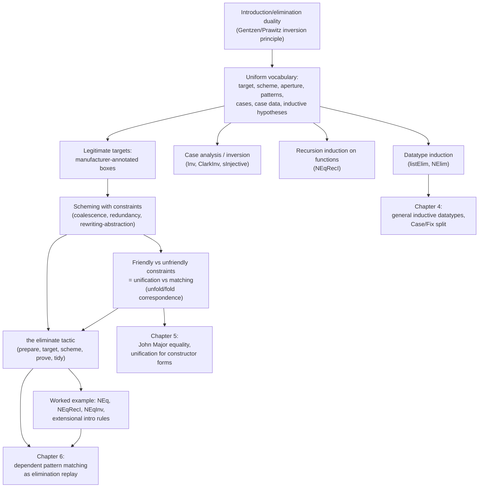

# Elimination Rules for Refinement Proof

[[book-guidelines|↩ Back to guidelines]]

## Why a chapter about *elimination* rules?

Every logic student learns the introduction/elimination duality for $\land$ and $\lor$
before they learn to think about it critically. $\land$-elimination is the boring
half: two projections, $\pi_1$ and $\pi_2$, extracting what you already believe is
there. $\lor$-elimination is the interesting half: given $P \lor Q$, and a proof of
$C$ from either disjunct, you get $C$. McBride opens the chapter with an observation
that looks like a throwaway remark but is actually the chapter's thesis in
miniature: you can *rewrite* the two boring $\land$-elimination rules as one
disjunction-shaped rule,

$$
\frac{P \land Q \qquad [P]\,[Q] \vdash C}{C}
$$

("uncurrying"), and once you do, $\land$-elim and $\lor$-elim have exactly the same
shape: *given a hypothesis of some kind, and a proof of the goal from the
"ingredients" that hypothesis guarantees, conclude the goal.* This is the shape a
machine can be taught to recognize and manipulate uniformly, and it is precisely the
shape of mathematical induction:

$$
\frac{\Phi(0) \qquad \forall n.\, \Phi(n) \to \Phi(sn)}{\forall n:\mathbb{N}.\, \Phi(n)}
$$

**What breaks without this reframing:** if you keep thinking of elimination rules as
"whatever falls out of the introduction rules by some duality principle" (the
Gentzen/Prawitz *inversion principle* McBride explicitly credits — "in eliminating a
symbol, we may use the formula ... only in the sense afforded it by the introduction
of that symbol" — see [Gen35, Pra65]), you get a zoo: some elimination rules produce
subgoals, some produce equations, some produce nothing analyzable at all. There is no
common vocabulary for a tactic to inspect a rule's *type* and extract "what am I
allowed to eliminate here, and what do I get for it?" McBride's entire project in
this chapter is to impose that common vocabulary — target, scheme, aperture,
patterns, cases, case data, inductive hypotheses — uniformly across datatype
induction, case analysis/inversion, and recursion induction on functions, so that a
single tactic, `eliminate`, can drive all three.

This is also the chapter's connection back to your compiler project (Focus Areas
`type-theory` and `automated-reasoning`, both of which this topic is tagged
against in this book's learning-goals file): what McBride calls "elimination
rules" is exactly the *dependent match/case-split* machinery that a modern
dependent type-checker's kernel exposes, and the `eliminate` tactic he builds is a
worked, historically early example of a proof-search/elaboration procedure whose
core subroutine is unification — precisely the kind of interaction between a
trusted kernel and a semi-decidable search tactic your own elaborator will need.

## The anatomy of an elimination rule

McBride's running illustration is mathematical induction, presented not as raw
natural-deduction inference but with each syntactic slot named:

$$
\boxed{n : \mathbb{N}} \quad\quad
\Phi : \forall n:\mathbb{N}.\ \mathrm{Prop}
\quad\quad
\cfrac{\Phi(0) \qquad \overset{\overset{n}{\vdots}}{\Phi(n)}\quad\Phi(sn)}{\forall n : \mathbb{N}.\ \Phi(n)}
$$

- **Target** — what the rule eliminates; McBride marks it with a box, $\boxed{n}$.
  For induction the target is the number $n$ itself.
- **Scheme** — the metavariable, here $\Phi$, standing for "the family of arbitrary
  goals this rule can prove." You can tell it's the scheme because it heads the
  rule's return type.
- **Aperture** — the scheme always has a type of the shape $\forall \vec\imath :
  \vec I.\ U$; the $\vec\imath$ are the rule's **indices**, and the indexed
  telescope $\vec I$ is the **aperture**. (For induction: one index, $n : \mathbb
  N$, aperture $\mathbb N$, target universe $\mathrm{Prop}$ — which is precisely
  why this particular rule can only prove propositions, not build data.)
- **Patterns / pattern variables** — wherever $\Phi$ is applied inside the rule
  (its arguments), those arguments are the **patterns**; the universally
  quantified variables occurring in them are **pattern variables**. Target
  selection must pin down every pattern variable appearing in the goal's
  conclusion, or there is nothing concrete to abstract into a scheme.
- **Cases, case data, inductive hypotheses** — everything above the solid
  line is a **case**, each proving $\Phi$ applied to some **case pattern**
  ($0$, $sn$). Assumptions specific to a case, shown above a dotted line (the
  "horizontal cousin of natural deduction's vertical ellipsis"), split into
  **case data** (assumptions not mentioning $\Phi$) and **inductive
  hypotheses**/**recursive calls** (assumptions that do mention $\Phi$, i.e. the
  ones that make induction inductive rather than mere case analysis — McBride's
  footnote: "it is good to think of induction as inversion augmented with
  recursive information").

McBride's own mantra for the chapter: *"Decomposition is the exposition of
construction"* — an elimination rule's cases are literally shaped like ghosts of
the corresponding introduction rules, because they must reconstruct, case by
case, whatever information the introduction rules put in.

**Rust grounding.** This vocabulary maps almost verbatim onto a `match` compiled
against an inductive `enum`, if you squint at what the compiler needs to know:

```rust
enum Nat { Zero, Succ(Box<Nat>) }

// A rule "eliminating" a Nat to prove a scheme Phi(n) is exactly a function
// that must handle every constructor shape — the case for Succ carries an
// "inductive hypothesis": Phi holds of the sub-Nat, not just the raw Box<Nat>.
fn nat_elim<T>(
    n: Nat,
    base: T,                          // case data for Zero: Phi(0)
    step: impl Fn(Nat, T) -> T,       // case data + inductive hypothesis for Succ
) -> T {
    match n {
        Nat::Zero => base,
        Nat::Succ(m) => {
            let ih = nat_elim(*m.clone(), /* recurse to get Phi(m) */ todo!(), &step);
            step(*m, ih)
        }
    }
}
```

The scheme $\Phi$ is erased here to the return type `T` because Rust's `enum`s
aren't dependently typed — there's no way to say "the type of the result depends
on which constructor `n` was." That erasure is exactly the gap dependent types
close, and it is why McBride needs $\Phi$ to be an explicit *term*, not just a
type parameter: the aperture can itself be indexed (`vect n`, `fin n`, …), and the
scheme has to track that index through every case.

**Lean grounding.** Lean's own `Nat.rec` (what its elaborator generates
automatically for every inductive type) is the formal object McBride is
describing by hand:

```
Nat.rec : {motive : Nat → Sort u} →
  motive Nat.zero →
  ((n : Nat) → motive n → motive n.succ) →
  (t : Nat) → motive t
```

Line up the vocabulary exactly: `motive` *is* McBride's scheme $\Phi$ (Lean's own
word for it is even a synonym); the last three arguments — `motive .zero`,
the step function, and `t` — are Lean's case data/inductive-hypothesis pair and
target, respectively, matching McBride's picture argument-for-argument. This is
not a coincidence or a loose analogy: McBride's dissertation is one of the
direct historical ancestors of how Lean, Agda, and Coq structure their generated
eliminators, and `motive` is the term of art that survived into all three.

## A gallery of elimination rules

McBride deliberately shows several rules with *different apertures and
target-kinds* to establish that "elimination rule" is a genuinely general
notion, not just a synonym for "induction principle."

**Parameterised elimination — `listElim`.** Lists carry a fixed element type $A$
as a **parameter** (a hypothesis the scheme and every case depend on but never
vary):

$$
\mathrm{listElim} : \forall A:\mathrm{Type}.\ \forall \Phi : (\mathrm{list}\,A) \to \mathrm{Type}.\
\Phi(\mathrm{nil}\,A) \to (\forall h:A,\,t:\mathrm{list}\,A.\ \Phi(t) \to \Phi(\mathrm{cons}\,h\,t)) \to
\forall l : \mathrm{list}\,A.\ \Phi(l)
$$

Note McBride's small but telling design choice: the case datum $h : A$ is
supplied explicitly in the `cons` case even though it already appears inside the
pattern $\mathrm{cons}\,h\,t$ — "in order to emphasise the imitation of the
constructor." The elimination rule's shape should visibly mirror the
introduction rule it inverts.

**Case analysis / inversion — `ClarkInv` and its cousin `Inv` for `≤`.** For any
notion given by introduction rules, its **inversion principle** asserts those
rules are exhaustive: one case per introduction rule, *no* inductive hypotheses.
McBride first shows the "Clark completion" style (as a disjunction of
existentially-quantified equations — the classical logic-programming
presentation of negation-as-failure's soundness side), then his own curried,
elimination-rule-shaped reformulation:

$$
\mathrm{Inv} : \forall m,n:\mathbb N.\ \mathrm{Prop} \quad\quad
\cfrac{\overset{\overset{m\le m}{\vdots}}{}\quad\overset{\overset{m\le sn}{\vdots}}{}}
{\forall m,n.\ m\le n \to \Phi(m,n)}
$$

with two cases — $m \le m$ and $m \le n \Rightarrow m \le sn$ — matching `≤`'s
two introduction rules. This is genuinely important groundwork for your
`automated-reasoning` goals: the Clark completion is the textbook link between
inductively-defined relations and the negation-as-failure semantics of Prolog-like
proof search, and McBride is showing that a *typed*, curried inversion principle
does the same completeness job with far less bookkeeping.

**Injectivity and disjointness ("no confusion") as inversion rules.** Rather than
present injectivity as an awkward projective lemma
($\forall m,n.\ sm \simeq sn \to m \simeq n$ — "directly useful only if it is
$m\simeq n$ we are trying to prove," the same complaint levied against
$\land$-elim), McBride presents it as an inversion rule for an equation:

$$
\mathrm{sInjective} : \mathrm{Prop} \quad\quad
\cfrac{m\simeq n \vdash \Phi}{sm\simeq sn \to \Phi}
$$

and disjointness of $0$ and $s\,\square$ as an elimination rule with a *fortunate
number of cases* — zero. Reading "not" as "implies false" and "false" as the
impredicative absurd proposition $\forall \Phi:\mathrm{Prop}.\Phi$, "constructors
are disjoint" *is* an elimination rule; it just happens to eliminate into any
goal whatsoever because there is nothing to case-split on. This "no confusion /
no cycle" machinery gets a full, general, mechanically-derived treatment for
*any* datatype in Chapter 5 — this chapter plants the idea that these are
elimination rules like any other.

**Recursion induction on functions — `NEqRecI`.** McBride's most important move
for the rest of the chapter: an *equational specification* of a function
(here `NEq`, boolean equality on $\mathbb N$) is itself a set of introduction
rules, with recursive calls becoming inductive premises —

```
NEq 0    0    = true
NEq (sm) 0    = false
NEq 0    (sn) = false
NEq (sm) (sn) = NEq m n
```

— so it, too, has an elimination rule, "recursion induction" (McCarthy's term):

$$
\mathrm{NEqRecI} : \forall m,n:\mathbb N.\ \forall b : 2.\ \mathrm{Prop}
$$
$$
\cfrac{\Phi(0,0,\mathrm{true}) \quad \Phi(0,sn,\mathrm{false}) \quad \Phi(sm,0,\mathrm{false}) \quad
\overset{\overset{\Phi(m,n,b)}{\vdots}}{\Phi(sm,sn,b)}}
{\forall m,n.\ \Phi(m,n,\mathrm{NEq}\,m\,n)}
$$

This is the crucial category McBride needed the whole vocabulary to notice: **a
function's own recursive structure can be packaged as a single elimination
rule** whose proof "follows the construction of the function it describes, step
by step." Once you have such a rule, proving properties of `NEq` no longer
requires re-deriving "the right combination of inductions and case analyses" —
you eliminate by `NEqRecI` once, and every case corresponds exactly to one
equation of [[Concrete-Categories-Functors-and-Monads-for-Syntax#The definition|the definition]].

**The abstraction-into-a-variable problem — targeting function applications.**
Here McBride surfaces a genuinely subtle mechanism that datatype elimination
doesn't need: when a target appears *only inside the patterns* — as `NEq m n`
does in `NEqRecI`'s conclusion, rather than as a free-standing bound variable —
the tactic must decide *whether and where to abstract that application away from
the goal* before instantiating the scheme. He marks this explicitly by boxing an
index in the scheme's own type: $\forall \boxed{b} : 2.\ \mathrm{Prop}$ tells the
tactic "please try to replace occurrences of `NEq m n` in the goal by the
variable standing in for `b`." Recursion induction alone is often "still too
close to the implementation" — you frequently want the purely *extensional*
behavior instead, which is why McBride derives a matching **inversion
principle**, `NEqInv`:

$$
\mathrm{NEqInv} : \forall m,n:\mathbb N.\ \forall \boxed{b}:2.\ \mathrm{Prop}
\quad\quad
\cfrac{\Phi(m,m,\mathrm{true}) \qquad \overset{\overset{m\not\simeq n}{\vdots}}{\Phi(m,n,\mathrm{false})}}
{\forall m,n.\ \Phi(m,n,\mathrm{NEq}\,m\,n)}
$$

Given a goal blocked on `if NEq x y then S else T` — stuck because `NEq x y` is
not a numeral, so neither `if` rule fires and neither of `NEq`'s two "extensional
introduction rules" ($\mathrm{NEq}\,x\,x \simeq \mathrm{true}$,
$x \not\simeq y \Rightarrow \mathrm{NEq}\,x\,y \simeq \mathrm{false}$) can be used
as a rewrite because you don't yet know whether $x\simeq y$ — inverting by
`NEqInv` and abstracting `NEq x y` as `b` splits the goal into exactly the two
cases where the computation *does* unblock, additionally coalescing $x$ with $y$
in the true branch. McBride's mantra for this whole move: *"Invert the blocking
computation."* This is a strict generalization of what a proof assistant calls
"do case analysis on a `Decidable` instance" or "case split on a boolean guard,"
and it is exactly the mechanism a bidirectionally-typed elaborator needs when a
definitional-equality check gets stuck on a metavariable or a neutral term —
stuck reduction is precisely where you switch from computing to reasoning.

## Legitimate targets: why the machine cannot guess

A recurring theme across the examples above: `NNElim`'s target is a bare
variable ($n$ in the pattern $\Phi(n)$), `Inv`'s target is an entire hypothesis
that *doesn't itself appear in the pattern* ($m\le n \to \Phi(m,n)$ — only the
indices $m,n$ show up, not the proof), and a function's elimination rule targets
*applications* of the function, appearing only inside patterns
($\Phi(m,n,\mathrm{NEq}\,m\,n)$). McBride's conclusion: there is no way to
recover "what does this rule eliminate?" from the rule's type alone by any
uniform algorithm — "double induction," where a rule needs *two* simultaneous
targets, makes this even sharper.

His solution: put the burden on the rule's manufacturer. Targets are annotated
explicitly at construction time — formally, by storing a boxed term/type pair
under a special binder-name `?`:

$$
\forall n:\mathbb N.\ !\,?=n:\mathbb N.\ \Phi(n)
$$

The `eliminate` tactic then asks the user (or an automated caller) to **finger**
a term to match against this annotation, in declaration order, inferring the
rule's other quantified variables by unification against the annotated
occurrence. This is worth sitting with because it is a *design decision about
trust boundaries*: the kernel need not — and, McBride argues, structurally
cannot — infer targets by inspecting types; that responsibility is deliberately
pushed to a metadata layer supplied once, by whoever builds the rule, and
consumed forever after by any tactic. It's a small but real instance of the
distinction between what a trusted kernel *checks* (that the finished term
type-checks) and what an untrusted elaboration layer merely *proposes* (which
term to try eliminating) — the same separation of concerns that keeps a modern
proof assistant's trusted computing base small while its tactic language stays
expressive and fallible.

## Scheming with constraints: from a generic rule to your specific goal

This section is the mechanical heart of the chapter, and the part with the
deepest payoff for an elaborator/unifier implementation.

**The problem.** An elimination rule's conclusion is stated with the *entire*
aperture free — $\forall m,n.\ m\le n \to \Phi(m,n)$ abstracts over *any* pair of
naturals. Real goals are rarely so accommodating. McBride's Henry-Ford epigraph
sets the tone: *"You can have any color you like, as long as it's black."* Given
a goal like

$$
\vdash \forall x.\ \boxed{x\le 0} \to x\simeq 0
$$

you need a scheme abstracted over the *entire* aperture (so it type-checks
against the generic rule) but *constrained*, via equations, to the specific
instance the goal actually needs.

**The general recipe.** For a rule proving scheme $\Phi$ at patterns
$\vec p[\vec y]$, and a goal $\forall \vec x.\ \Gamma(\vec p[\vec y])$ where
targeting has produced a substitution $\sigma$ giving the rule's pattern
variables in terms of the goal's own variables, the **basic constrained
scheme** is:

$$
\Phi := \vec\imath : \vec I.\ \forall \vec x.\ \vec\imath \simeq \vec p[\vec y] \to \Gamma(\vec p[\vec y])
$$

— abstract over the whole aperture, add fresh hypotheses $\forall \vec x$ copied
straight from the goal, and equate the rule's indices $\vec\imath$ to the
goal's own instantiated patterns via a **telescopic equation**
$\vec s \simeq \vec t \;\equiv\; \{s_j \simeq t_j\}_{j\le n}$ — McBride's
${\simeq}$ notation ("John Major equality," formally defined in Chapter 5)
exists specifically because ordinary Martin-Löf equality can't even *state* an
equation between two elements of *different but propositionally equal* types,
which is exactly what happens once your aperture is index-dependent (e.g.
comparing $v_1 : \mathrm{vect}\,n_1$ against $v_2 : \mathrm{vect}\,n_2$ when you
only know $n_1\simeq n_2$, not $n_1 \equiv n_2$ definitionally). Plug this scheme
back into the rule's conclusion and the equations you need to solve are trivially
reflexive by construction — the scheme is guaranteed sound, just clumsy.

**Why "clumsy," and the three cleanups.** The basic scheme abstracts *everything*
and constrains *everything*, which is far more machinery than a human would
write by hand. McBride gives three targeted simplifications:

1. **Coalescence (§3.5.1).** If a scheme constrains a fresh $\forall$-bound
   variable to equal an index of the *same type*, delete the constraint and
   identify the two variables. Proving $\forall n.\ \mathrm{rhubarb}(n)$
   shouldn't generate $m,n{:}\mathbb N,\ m\simeq n \to \mathrm{rhubarb}(n)$; it
   should collapse straight to $n{:}\mathbb N.\ \mathrm{rhubarb}(n)$.
   *Caveat*: if the same $\forall$-variable is constrained equal to *two
   different* indices, you must not coalesce both — that would erase a genuine
   diagonalization constraint (the indices really are forced equal to each
   other, not free).

2. **What to fix, what to abstract (§3.5.2).** Some premises *must* stay fixed
   outside the elimination (e.g. the element type `S` in `map`'s signature is
   parametric to `list`'s eliminator — you cannot vary it case by case). Some
   premises *must not* be fixed, on pain of breaking nested recursion — McBride's
   sharp example is Ackermann's function, `ack (sm) (sn) = ack m (ack (sm) n)`,
   where the outer induction on the first argument must leave the second
   argument free, because the recursive calls that decrease it also *change* the
   second argument. Beyond outright necessity, a premise can be *provably
   redundant* and safely dropped: an eliminated premise $x$ can be omitted from
   the scheme when (a) $x$ occurs among the arguments inferred by targeting,
   (b) $x$ does not occur in the instantiated patterns, and (c) nothing else in
   the goal depends on $x$ — exactly the situation for the proof-irrelevant
   hypothesis in `Inv`'s scheme, where the leftover premise $x\ne 0$ carries no
   information the scheme can use.

3. **Abstracting patterns from the goal for rewriting (§3.5.3).** When an index
   is *boxed* in the scheme's own type (as `b` is in `NEqInv`), the tactic tries
   to replace every occurrence of the corresponding pattern (`NEq x y`) in the
   goal by the fresh variable, discarding the now-useless equation once the
   replacement typechecks. McBride is candid that this can fail — abstracting a
   subterm in a *dependent* type theory is unsafe in general, because later
   parts of the type may depend on that subterm's specific intensional identity,
   not merely its propositional-equality class. If abstraction fails, the tactic
   falls back to keeping the equation as an explicit hypothesis rather than
   erroring out.

**Friendly vs. unfriendly constraints — the unification/matching split
(§3.5.4).** This is the subsection with the most direct payoff for a
unification-based elaborator, and it is tagged in this book's learning-goals
file precisely because it sits at the intersection of `type-theory` and
`automated-reasoning`. Working through weak induction for `≤` in a proof of
$\forall x,y.\ sx \le y \to x < y$, McBride distinguishes two kinds of equation
that show up in the generated subgoals:

- **Friendly constraints** appear in a subgoal's *conclusion* and involve
  variables coming from the rule's own **pattern variables** — they behave as
  a genuine **unification problem**: you can solve for variables occurring on
  *either* side of the equation, discovering, e.g., that $m \simeq sx$ forces
  $m$ to be instantiated.
- **Unfriendly constraints** appear as premises of an **inductive hypothesis**
  and involve the *scheme's own universally quantified variables* (e.g. the
  $x'$ that parameterizes the inductive hypothesis) — these behave as a
  **matching problem**: you can only determine the variable on the
  right-hand side, and only once the corresponding friendly constraint upstream
  has already been solved by unification.

Solving the friendly constraints first and then re-examining the unfriendly ones
turns out to be exactly the classical **unfold/fold transformation** from logic
programming ([TS83, GS91]): the friendly (unification) constraints in the
conclusions are what "unfolding" a logic-programming clause does; the unfriendly
(matching) constraints in the inductive hypotheses are what "folding" a
recursive call back into the transformed definition does. McBride shows the
transformed subgoals literally *read* as a recursive definition of `<` in terms
of `≤`, once written in natural-deduction style — the elimination-rule
machinery has mechanically derived a program transformation that a Prolog
partial-evaluator would do by hand. If you're building a constraint-generation
front-end for a refinement-type checker or a Horn-clause-based verifier, this
distinction — "which of my generated equations are genuine unification problems
I should solve eagerly, versus matching problems that can only be resolved once
their unification counterparts are" — is the same triage a modern SMT-based
verification-condition generator has to do when discharging clauses that mix
existentially- and universally-quantified metavariables.

**Lean grounding.** Lean's own unifier during elaboration draws exactly this
line, informally: equations between *metavariables and rigid terms* (friendly,
solvable by assignment — "pattern unification" in Miller's sense when the
metavariable is applied only to distinct free variables) are handled eagerly,
while equations that only *constrain* an already-fixed local hypothesis (closer
to McBride's "unfriendly"/matching case) are deferred or handled by
`isDefEq`'s later, more expensive fallback paths. McBride is doing the same
triage decades earlier, by hand, for a much more restricted rule-elimination
setting — but the *shape* of the distinction (solve-for-either-side vs.
solve-for-one-side-only, deferred until upstream unification narrows the
choices) is the direct ancestor of what a metavariable-context-aware unifier
does today.

## The `eliminate` tactic: five stages

Having built the vocabulary, McBride assembles it into a concrete refinement
tactic — the chapter's payoff artifact, and (per his own note) the actual design
document for an unimplemented, improved version of a tactic he had already
partially built inside LEGO. It operates in five stages, each presented as a
little rewrite rule on prover *states* (recall from Chapter 2: OLEG states are
literally contexts of typed judgments with explicit holes):

1. **Prepare** (`eliminate-prepare`) — introduce the goal's own hypotheses, then
   install a "proforma" application of the elimination rule — `elim` applied to
   a sequence of brand-new holes `?s₁ ... ?sₙ` — as a `!`-bound definition
   (`app`), to be used later to close the goal.
2. **Finger targets** (`eliminate-target`) — the user (or search procedure)
   supplies the terms to eliminate; the tactic unifies them against the rule's
   boxed target annotations, inferring the corresponding `?s` holes as
   solved `!`-bindings. Crucially, McBride notes that once early arguments are
   inferred, the *type* of the proforma application can itself reduce,
   revealing *more* premises (and possibly more targets) that need to be
   created and processed — targeting is not a single pattern-match, it's a
   fixpoint over progressively-revealed structure.
3. **Construct the scheme** (`eliminate-scheme`) — build the basic constrained
   scheme (§3.5's recipe) from the now-fully-targeted rule, then run the two
   pruning passes: drop redundant premises (working from the *end* of the
   premise list backward, since later redundancy can retroactively justify
   dropping an earlier premise — the reverse can silently break), then attempt
   coalescence and rewriting-abstraction on the remaining constraints (working
   *forward*, since simplifying an earlier constraint can unify the types
   needed to simplify a later one).
4. **Prove the goal** (`eliminate-goal`) — instantiate the pruned scheme's
   application with the goal's own original hypotheses and `refl` proofs for
   the now-reflexive equations, closing `conc`.
5. **Tidy up** (`eliminate-tidy`) — discharge the not-yet-solved subgoal holes
   out through the goal, generalizing each one over exactly the free variables
   it actually depends on (McBride is explicit that this must be *discharge*,
   which computes minimal dependency, rather than blanket *raising*, which
   would over-generalize) — and finally solve the original goal by an
   application of the elimination rule to the newly-discharged subgoal
   lemmas.

McBride walks the entire tactic through the running weak-induction-for-`≤`
example from §3.5.4, showing the literal OLEG-state transitions at each stage,
and the two final subgoals it produces are — by construction, not by
coincidence — exactly the ones a human would have written by hand. That
correspondence *is* the chapter's third Key Question, and it's the right one to
hold onto: **automatic scheme-pruning is only worth trusting if it provably
recovers the human-written scheme**, not merely *some* scheme that happens to
close the goal. This is a completeness-style correctness property for a tactic,
analogous to what you'd want to prove about an automated invariant-generation
pass: it's not enough that the generated invariant is *sound* (any invariant
that happens to hold is sound); you want it to recover the *natural* one, or at
least one no weaker than what a human would supply.

**Rust/Python sketch of the tactic's control flow** (illustrative — not a
literal implementation, since Rust's type system can't host dependent metavariable
contexts, but useful for seeing the five stages as an actual algorithm):

```python
def eliminate(goal, rule, targets):
    app = prepare(rule)                      # stage 1: proforma application
    for t in targets:
        app = finger_target(app, t)          # stage 2: unify against boxed annotations
    scheme = build_basic_scheme(app, goal)
    scheme = prune_redundant(scheme)         # backward pass
    scheme = simplify_constraints(scheme)    # forward pass: coalesce, then abstract
    conc = instantiate(app, scheme, goal)    # stage 4
    subgoals = discharge_unsolved_holes(app) # stage 5
    return subgoals, conc
```

## Worked example: building `NEq` end to end

Section 3.7 is McBride's proof that the tactic is not just elegant on paper —
it drives one running example through all four uses the chapter has
established:

1. **Programming with `eliminate`.** `NEq` is built by two *nested*
   eliminations on `NNElim` (natural-number induction doubling as its own
   primitive-recursion operator): eliminate the first argument, and inside each
   resulting case, eliminate the second. The base case (`m = 0`) needs no
   recursive call and simply returns `true`/`false`; the step case (`m = sm`)
   carries a recursive call `rec : ∀n. NEq m n` whose *type already tells you
   which pattern of `n` it's good for* — a small but real illustration of how
   dependent types make "which recursive call am I allowed to make here"
   visible in the type rather than needing an external termination check.
2. **Proving `NEqRecI`** by the identical elimination structure as the
   function's own construction — because the theorem statement is designed to
   mirror the program exactly, each subgoal reduces, by computation alone, to
   exactly one of the four fixed hypotheses ($\phi_{00}, \phi_{0s}, \phi_{s0},
   \phi_{ss}$) supplied at the top.
3. **Deriving `NEqInv`** *from* `NEqRecI` rather than re-deriving it from
   scratch — the technique McBride flags as one he'll "use relentlessly" for
   the rest of the thesis: recursion induction proofs are easy because
   computation does the work; inversion principles are proved by applying
   recursion induction with the scheme left *free inside* the induction (rather
   than fixed outside it), so that the inductive hypotheses are themselves
   instances of the inversion principle you're trying to build — using
   inversion, not raw computation, to discharge the inductive step.
4. **Proving the two "introduction rules"** (`NEqtrue`, `NEqfalse`) — the
   purely extensional characterization ($\mathrm{NEq}\,x\,x\simeq
   \mathrm{true}$; $x\not\simeq y \Rightarrow \mathrm{NEq}\,x\,y\simeq
   \mathrm{false}$) — each by a single application of `NEqInv`, closing the
   loop: you built the function by elimination, derived its recursive
   characterization by elimination, derived its extensional characterization
   from that by elimination, and now the whole tower rests on nothing but
   `NNElim` and the tactic that drives it.

## Where this leads



This chapter's vocabulary — target, aperture, scheme, friendly/unfriendly
constraint — is the load-bearing infrastructure for nearly everything that
follows in the thesis: Chapter 4 generalizes "an elimination rule" from
hand-picked examples to *any* strictly-positive inductive datatype, mechanically
generating exactly the target/scheme/case structure introduced here; Chapter 5's
"John Major" equality is the formal definition this chapter kept deferring
(§3.1), built specifically to make telescopic constraints ($\vec\imath \simeq
\vec p$) well-typed under index dependency; and Chapter 6's central theorem —
that ALF-style dependent pattern matching is *conservative* over OLEG — is
proved by literally replaying a pattern-matching definition as a sequence of
`eliminate` calls, i.e. by showing that every legitimate pattern-matching
program is secretly a disciplined use of exactly the tactic built here.

For your own project (`type-theory` + `automated-reasoning`): the
friendly/unfriendly constraint split is a genuinely reusable design principle
for any elaborator that generates and discharges equational side-conditions
during proof/program construction — treat every generated equation as either
"solve me now, I'm real unification" or "wait, I'm matching and depend on
upstream unification results," and you get McBride's unfold/fold
correspondence essentially for free. The legitimate-targets mechanism is a
small but concrete precedent for keeping your trusted kernel's job ("does this
term type-check") cleanly separated from your elaborator's job ("which term
should I even try type-checking") — exactly the boundary a Miller-pattern-style
metavariable unifier needs to respect when it decides which equations it is
licensed to solve outright versus merely postpone.
