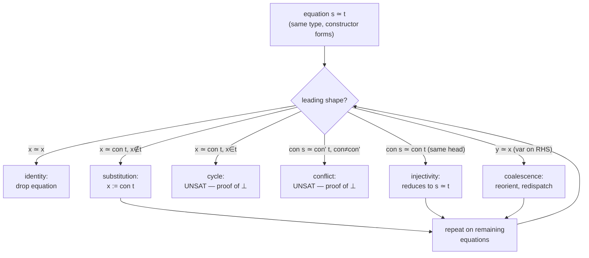

[[book-guidelines|↩ Back to guidelines]]

## Why this chapter exists: two equalities are not enough

Every dependently typed system needs a notion of *propositional* equality — a type $a = b$ that is *evidence* something holds, as opposed to the judgmental/definitional equality the typechecker decides for free. Martin-Löf gave us exactly one such type, and for simply-typed or even parametrically-polymorphic settings it is all you need. But McBride is building elimination rules and a unification-based tactic (`eliminate`, later `simplify`) that must generate and discharge equations between **indices of dependent families** — and that is precisely where the one Martin-Löf identity type starts to hurt.

Here's the concrete failure mode. Suppose you have two sequences of terms $\vec r, \vec s$ inhabiting a *telescope* $\vec T$ (a list of types where each one may depend on the previous values — think a struct where field 3's type mentions the value of field 1). You want to say "$\vec r$ and $\vec s$ are equal, component-wise." The naive thing to write is

$$r_1 = s_1,\; r_2 = s_2,\; \dots$$

but this doesn't even typecheck as stated: $r_2 : T_2[r_1]$ while $s_2 : T_2[s_1]$, and if $r_1 \neq s_1$ as raw terms (even if $r_1 = s_1$ is *provable*), then $r_2$ and $s_2$ don't inhabit the same type at all — you can't even *ask* whether they're equal with ordinary $=$, because $=$ is homogeneous: both sides must already share one type before you can form the equation.

This is the "what breaks without it" moment for the whole chapter: **dependent index equations are heterogeneous by nature**, and Martin-Löf's `=` cannot express them without you first threading a pile of coercions through every step. McBride's fix is a *relaxed*, heterogeneous equality — pronounced "John Major equality" and written $\simeq$ — that can relate elements of syntactically different (but hopefully provably-equal) types. Once you have $\simeq$, telescopic equality is just "the pointwise $\simeq$ of each component," no coercion plumbing required, and it turns out $\simeq$ is provably equivalent to ordinary `=` plus a second axiom (uniqueness of identity proofs). The rest of the chapter builds, on top of this equality, a decision procedure for unifying constructor-headed terms — the same procedure that later powers the `eliminate` tactic's automatic case-splitting, and that reappears almost unchanged as the metavariable unifier in every modern dependently-typed elaborator (Lean, Agda, Coq).

Rust readers: think of this whole chapter as answering "how does `unify()` work inside a type-checker whose types can mention values," and "why is `PartialEq` (homogeneous, same-type) the wrong shape for that job."

---

## 5.1 Two (almost) inductive definitions of equality

### 5.1.1 Martin-Löf's identity type, and `idElim` ("J")

The identity type is introduced by reflexivity and eliminated by the rule everyone calls **J**:

$$
\dfrac{a, b : A}{a = b : \mathrm{Prop}}
\qquad
\dfrac{a : A}{\mathrm{refl}_= \; a : a = a}
$$

$$
\mathrm{idElim} :
\forall A:\mathrm{Type}.\ \forall a:A.\
\forall \phi : (\forall b:A.\ (a=b) \to \mathrm{Type}).\
\phi\, a\, (\mathrm{refl}_= a) \to
\forall b:A.\ \forall q:a=b.\ \phi\, b\, q
$$

Read this the way a compiler engineer reads a `match`: $\mathrm{idElim}$ says "if you can prove the motive $\phi$ holds in the one case you *know* is inhabited — $b=a$, $q=\mathrm{refl}$ — you may conclude $\phi$ holds for *every* $b$ and *every* proof $q$." That's the whole content of the identity type: **the only closed proof of any equation is reflexivity**, so a proof by cases on $q$ only has one case. This is what makes `idElim` simultaneously an induction principle and a substitution principle — "substituting along an equality" is just the special case where $\phi$ doesn't depend on the proof.

From `idElim`, McBride derives `idSubst` (fix the motive, throw away the unused proof-relevance) and packages it as substitution/coercion sugar:

$$
[q]_{\!=}\, s \;:\; \phi\, b \qquad\text{for } q : a{=}b,\ s : \phi\, a
\qquad\qquad
[q]_{\!=}\, s \;:\; T \qquad\text{for } q : S{=}T,\ s : S
$$

with the expected computation rule $[\mathrm{refl}_=\, a]_{\!=}\, t \rightsquigarrow t$.

**Lean correspondence.** This is exactly `Eq.mpr`/`Eq.subst`/`▸` in Lean's kernel, and `idElim` is `Eq.rec` (which Lean itself derives from a large-eliminator-free `Eq` — but the shape is identical). Every time you write `h ▸ e` in Lean you are invoking `idSubst`. The elaborator's `isDefEq` doesn't call this directly — it's a *checking*-time device, used once a proof term already exists — but understanding it is a prerequisite for understanding why Lean's kernel needs `Eq.rec` as one of its few built-in eliminators at all.

```rust
// The shape of idElim as a Rust reader would recognize it: the only
// constructor of an equality-witness type is reflexivity, so matching
// on one is a match with exactly one arm — the compiler can literally
// see there is no other case.
enum Eq<A> {
    Refl(A), // the only inhabitant is `Eq::Refl(a)` for `a : a = a`
}
// "idElim" is what you get for free from this exhaustive match:
// given a proof `q : Eq<A>` connecting `a` and `b`, the only branch
// available is the one where `b` has already collapsed to `a`.
```

### 5.1.2 Uniqueness of identity proofs ("K")

Altenkirch and Streicher's `idUnique` adds a *second*, strictly stronger elimination rule:

$$
\mathrm{idUnique} :
\forall A.\ \forall a{:}A.\
\forall \phi:(a{=}a)\to\mathrm{Type}.\
\phi\,(\mathrm{refl}_=\,a) \to
\forall q:a{=}a.\ \phi\, q
$$

The difference from `idElim` is subtle but crucial. `idElim`'s motive $\phi$ ranges over the *full* two-dimensional space $A \times A$ of possible equations (its "aperture," in McBride's elimination-rule vocabulary from Chapter 3); `idUnique`'s motive only ever ranges over the *diagonal* $a = a$ — but crucially, it still quantifies over an **arbitrary proof** $q : a=a$, not just $\mathrm{refl}$. That's the actual content of "uniqueness of identity proofs" (UIP): every proof of $a=a$ is *equal to* $\mathrm{refl}$, not merely that one exists.

Hofmann and Streicher proved `idUnique` is **not derivable** from `idElim` alone (the groupoid model of type theory is the standard countermodel — types have nontrivial path structure, so there can be more than one "way" for $a$ to equal $a$). This is the load-bearing metatheoretic fact behind the whole chapter, and behind McBride's later admissibility result for ALF-style pattern matching (Chapter 6): **UIP is exactly the extra axiom conventional intensional type theory needs before dependent pattern matching becomes derivable rather than primitive.**

Streicher's converse observation is what McBride exploits structurally: `idSubst` + `idUnique` together are *equivalent in power* to `idElim` — you substitute first (collapsing $b$ to $a$), then use `idUnique` to collapse the remaining self-equation proof to `refl`. This two-phase decomposition — "proof-irrelevant substitution, then proof-relevant collapse-to-reflexivity" — is the exact template the rest of the chapter reuses for every telescopic construction.

```lean
-- Lean has both stories live at once: `Eq.rec` (idElim-shaped, no UIP
-- assumed) versus `Subsingleton`/`proof_irrel`-style reasoning, and in
-- fact Lean's `Prop` universe bakes in *definitional* proof irrelevance
-- for all of Prop, which is UIP-and-then-some for propositions. For
-- Type-valued equalities (not Prop), UIP is genuinely extra and not
-- derivable — exactly Hofmann–Streicher's result, alive in a modern
-- kernel. `Subsingleton.elim` is the closest citable analogue of idUnique.
example (a : Nat) (q : a = a) : q = rfl :=
  -- provable for Nat because Nat has decidable equality (Axiom K holds
  -- for types with decidable equality, via Hedberg's theorem) — but NOT
  -- provable for an arbitrary Type without assuming UIP as an axiom.
  Subsingleton.elim q rfl
```

### 5.1.3 $\simeq$, "John Major" equality

Now McBride reveals the payoff. **John Major equality** $\simeq$ relates elements of *any* two types, not necessarily the same one:

$$
\dfrac{a:A \qquad b:B}{a \simeq b : \mathrm{Prop}}
\qquad\qquad
\dfrac{a:A}{\mathrm{refl}_{\simeq}\, a : a \simeq a}
$$

with elimination rule

$$
\mathrm{eqElim} :
\forall A.\forall a{:}A.\
\forall \phi:(\forall a'{:}A.\ (a{\simeq}a')\to\mathrm{Type}).\
\phi\,a\,(\mathrm{refl}_{\simeq}\,a) \to
\forall a'{:}A.\ \forall l:a{\simeq}a'.\ \phi\,a'\,l
$$

Notice this is *not* the elimination rule you'd get from treating $\simeq$ as a naively-defined inductive family over two free type variables $A,B$ (which McBride calls `eqIndElim` and dismisses as "quite useless" — its motive would have to be abstracted over an *arbitrary* second type $B$, so it could never be specialized enough to substitute two values you already know share a type). `eqElim` instead eliminates only over the "type diagonal" $B = A$ — the subfamily where both sides live in the same type — which is fine, because *every inhabited instance of $\simeq$ lives there anyway* (there is no way to build a term of $a \simeq b$ when $a$ and $b$ have provably distinct types).

This is the crux of the whole design: **$\simeq$ lets you *state* a heterogeneous equation between two possibly-different types, but you can only ever *use* (eliminate) one once you're back on the diagonal.** It defers the type-equality obligation to elimination time instead of forcing it at statement time.

### 5.1.4 Equality for sequences (telescopic equations)

This is the motivating example finally paying off. For a telescope $\vec T$ (McBride's earlier notation for a dependent sequence of types — think a `struct` whose later field types can mention earlier field *values*), and $\vec r, \vec s : \vec T$, we define the **telescopic equation**

$$\vec r \simeq \vec s \;:=\; r_1 \simeq s_1,\ r_2 \simeq s_2,\ \dots$$

which typechecks unconditionally, because each $\simeq$ is heterogeneous — $r_2$ and $s_2$ can have syntactically different types (since $r_1$ and $s_1$ might differ), and $\simeq$ doesn't care. Compare this to the earlier attempt with $=$: that was a type error before you even got to ask the question. This is the entire reason the chapter bothers with $\simeq$ at all.

McBride then builds, **by recursion on telescope length $n$** (not by some clever single definition — this really is an inductive construction over the *meta-level* natural number $n$, one instance of `eqSubst`/`eqUnique` per length):

- **`eqSubst`$_n$** — substitutivity for length-$n$ telescopic equations: given a motive over the telescope and a proof of $\vec r \simeq \vec s$, transport a term along it. The base case ($n=0$) is the identity function; the step case fixes the head equation, eliminates it with `eqElim` (landing on the diagonal, where the head types now agree), then recurses with `eqSubst`$_n$ on the tail — a nested application of exactly the substitution machinery from 5.1.1, once per telescope entry.
- **`eqUnique`$_n$** — the telescopic analogue of UIP: any proof of $\vec t \simeq \vec t$ is equal to $\mathrm{refl}\,\vec t$. Built the same way, but the step case is subtler: eliminating the head equation with `eqElim` leaves the *tail* equation still burdened by two irreducible constraints (the leftover premise `s ≃ t` and `l' ≃ e`), which must be discharged first via `eqSubst`$_1$ before `eqUnique`$_n$ can finish the tail.

McBride is explicit about the "what breaks without it" comparison here: building this same telescopic machinery out of `=` instead of `≃` is *possible* but "considerably more cumbersome" — every step of the construction requires you to invoke full `idElim` (not just `idSubst`) to simultaneously substitute the term *and* instantiate the leftover proof with reflexivity, purely so the following equation's type keeps typechecking. $\simeq$ buys you the same result "without acquiring proof relevant dirt under our fingernails," in McBride's own words.

```lean
-- Lean's `HEq` (heterogeneous equality) is the direct descendant of ≃.
-- `HEq.rec` is Lean's `eqElim`; `heq_of_eq`/`eq_of_heq` (using UIP-like
-- reasoning, or decidable-equality Hedberg arguments) are the two
-- directions of McBride's equivalence proof in 5.1.5.
example {A B : Type} (a : A) (b : B) (h : HEq a b) : True := by
  cases h  -- HEq.rec forces A and B to unify, then a and b to unify
  trivial
```

```python
# A telescope, concretely: a chain of dicts whose later keys' *shapes*
# depend on earlier keys' *values*. `r ≃ s` component-wise is well-formed
# even before you know whether the shapes line up; `r = s` isn't
# expressible at all until you've already established that they do.
def telescope_row(n):
    return {"len": n, "data": tuple(range(n))}   # `data`'s type/shape
                                                   # depends on `len`'s value
```

### 5.1.5 The relationship between `=` and `≃`

McBride closes the loop with a genuine equivalence, in both directions:

**`=` from `≃` (easy direction).** Ordinary equality is *just* telescopic equality for a telescope of length 1: `idSubst := eqSubst₁`, `idUnique := eqUnique₁`. Nothing new to build.

**`≃` from `=` with `idUnique` (the interesting direction).** This is the technically meaty part of the whole section, and it's worth walking through because the technique — package a dependent pair, use substitutivity to align types, use UIP to collapse a residual proof — recurs constantly in dependently-typed metaprogramming.

Define **cells**: $\mathrm{cell} := \Sigma A{:}\mathrm{Type}.\, A$, a package of a type together with an element of it. The idea is $a \simeq b$ (for $a{:}A$, $b{:}B$) is defined to just *be* ordinary `=` between the two cells $\langle A,a\rangle$ and $\langle B,b\rangle$:

$$a \simeq b \;:=\; \langle A,a\rangle = \langle B,b\rangle$$

The hard lemma needed to recover `eqElim` from this definition is `sproj` ("second projection"): **equal cells have equal second projections.** Stating this is already awkward — the two second projections $a$ and $b$ don't have convertible types unless you already know $A = B$ — which is exactly the coercion machinery `idSubst` exists to provide:

$$
\mathrm{sproj} :
\forall (A,a),(B,b) : \mathrm{cell}.\
\forall e : \langle A,a\rangle = \langle B,b\rangle.\
\forall q : A{=}B.\
[q]_{\!=}\, a \;=\; b
$$

The proof of `sproj` eliminates $e$ with `idSubst` (aligning the two cells), then eliminates the *type* component of the aligned cell (call it `q₀ : A = A`, now reflexive on the nose) with `idUnique`, collapsing the leftover coercion to the identity — at which point the goal reduces to `refl`. This is precisely the two-phase idSubst-then-idUnique decomposition from 5.1.2, applied one level up, at the level of packaged pairs rather than bare elements.

Once `sproj` exists, `eqElim` for the cell-based `≃` follows: given `e : ⟨A,a⟩ = ⟨B,b⟩`, `sproj e (refl A)` gives `a = b` directly (feeding the trivial type-equality witness), after which ordinary `idSubst` finishes the substitution.

McBride verifies the reduction behaviour matches too: `sproj (refl ⟨A,a⟩) (refl A) ⇝ refl a`, so the whole cell-based encoding computes exactly like the primitive one would have — this "does it compute the way you'd expect" check is a running theme of the entire chapter, because these definitions aren't just being used for proofs, they're used to build *programs*, and programs must reduce correctly.

---

## 5.2 First-order unification for constructor forms

### The problem, motivated by `eliminate`

Recall from Chapter 3 that applying an elimination rule with scheme variable $\phi : \forall \vec\iota{:}\vec I.\mathrm{Type}$ to a specific goal produces a *constrained scheme* — instantiated indices get equated to the rule's patterns via fresh $\forall$-bound equations:

$$\forall \vec x.\ \vec x \simeq \vec t[\vec x] \to \phi$$

and a case of shape $\vec y : \vec Y,\ \vec s[y]$ yields, per case, a subgoal of the shape

$$\forall \vec y.\ \forall \vec x.\ \vec s[y] \simeq \vec t[\vec x] \to \phi$$

**These equational constraints are a first-order unification problem**, sitting right there as hypotheses. If it has no solution, the case is vacuous and the goal follows trivially (nobody will ever call this branch); if it has a most general unifier, that unifier tells you how to specialize the remaining $\vec y,\vec x$.

The book's own worked example is `vtail`, a vector-tail function typed to statically reject the empty vector:

$$\mathrm{vtail} : \forall n{:}\mathbb N.\ \mathrm{vect}\,(sn) \to \mathrm{vect}\, n$$

Eliminating the input vector by `vectCase` produces two cases. The `vnil` case carries the *impossible* premise $0 \simeq sn$ — the algorithm needs to recognize this as unsatisfiable (constructor `conflict`) and discharge the case for free. The `vcons` case carries $sm \simeq sn$, which the algorithm needs to *simplify* (via `injectivity`) down to $m \simeq n$ before the goal is even usable. **This is the entire reason a hand-wavy "just check the types line up" isn't good enough: real elimination requires a real decision procedure over these equations, not mere syntactic matching.** This is object-level unification precisely because it happens *inside the object logic*, discharged by object-level proof terms (conflict/injectivity theorems), not by an external meta-level algorithm as in Prolog or ML type inference.

### 5.2.1 The six transition rules

McBride's "Qnify" tactic (from his earlier [McB96] work, here extended to dependent types) eliminates a hypothetical equation $\forall\vec x.\ s \simeq t \to \phi$ between constructor forms one equation at a time. First, the key syntactic notion:

> **Definition (constructor form).** $t$ is a constructor form over variable set $V$ if either $t \in V$, or $t \equiv \mathrm{con}\,\vec t$ where every $t_i$ is itself a constructor form over $V$.

Given $s \simeq t$ where both are constructor forms over $\vec x$ (i.e., the free variables still open to unification) and both sides share a type, exactly one of six cases applies:

| leading equation | rule | condition |
|---|---|---|
| $x \simeq x$ | **identity** | drop the (trivial) equation |
| $x \simeq \mathrm{con}\,\vec t$ (variable, other side headed) | **cycle** | if $x \in \vec t$ — the equation is *unsatisfiable* |
| $x \simeq \mathrm{con}\,\vec t$ (variable, other side headed) | **substitution** | if $x \notin \vec t$ — solve $x := \mathrm{con}\,\vec t$ |
| $\mathrm{chalk}\,\vec s \simeq \mathrm{cheese}\,\vec t$ (different head symbols) | **conflict** | equation is *unsatisfiable* |
| $\mathrm{cheese}\,\vec s \simeq \mathrm{cheese}\,\vec t$ (same head symbol) | **injectivity** | reduces to $\vec s \simeq \vec t$ |
| $y \simeq x$ (variable on the wrong side) | **coalescence** (symmetry + substitution/identity) | orient, then re-dispatch |

Each of these six cases corresponds to a *provable object-level elimination rule* (Table 5.1 in the book), built out of the equality machinery from 5.1: `identity` is a trivial $\eta$-style abstraction; `coalescence`/`substitution` are direct applications of `eqSubst₁`; `conflict` and `injectivity` need the "Peano concerto" construction (5.2.3); `cycle` needs the "not a proper subterm" predicate (5.2.4).



**Lean correspondence — this is Miller pattern unification's ancestor.** The identity/substitution/injectivity/conflict/cycle taxonomy here is *exactly* the case split every first-order unifier makes (Robinson's algorithm, Prolog's WAM unification, Lean's `isDefEq` when it hits two constructor applications). The difference that matters for your elaborator project: Lean's unifier also has a **flex-flex** and **flex-rigid** case (a metavariable, not a bound variable, on one or both sides) — McBride treats that separately in Chapter 7's `mgu`/`bmgu`, where "variable" here becomes "metavariable under a mixed prefix" (Miller's terminology, referenced explicitly in the OLEG chapter). What you're looking at in *this* chapter is the sub-case where all the "variables" are ordinary bound (rigid, not meta-) variables — a warm-up for the metavariable case that follows.

### 5.2.2 Termination and correctness

Two lemmas carry the whole algorithm:

**Structure preservation.** Applying any transition rule to a constructor-form unification problem either solves the goal outright (`conflict`, `cycle`) or leaves a subgoal that is *again* a constructor-form unification problem — proved case by case by tracking exactly which variables survive and what they now range over (e.g. after `substitution`, $x$ vanishes from the variable set but the remaining terms are still constructor forms over what's left, since the substituted term $t$ contained no other unification variables by the very syntactic form of the rule).

**Termination**, by the classic well-founded-measure technique: a **lexicographic triple**

$$(\;|\vec x|,\ \#\text{constructor symbols},\ \#\text{equations}\;)$$

- `cycle`/`conflict` terminate outright (no successor state).
- `coalescence`/`substitution` strictly decrease $|\vec x|$ (a variable is eliminated).
- `injectivity` preserves $|\vec x|$ but strictly decreases the constructor-symbol count (one head symbol consumed, replaced by its arguments, net decrease since the head was one of the counted symbols).
- `identity` preserves both but strictly decreases the equation count.

**Correctness**: the algorithm computes a most general unifier. McBride's proof invariant: at every stage, the *accumulated substitution* $\sigma$ composed with an mgu of the *remaining* problem is an mgu of the *original* problem. Each rule either leaves this invariant unchanged (`identity`, `injectivity`) or updates it consistently (`coalescence`/`substitution`, verified by an explicit factorization argument: if $\tau$ is an mgu of the post-substitution remainder, then $\tau \circ [t/x]$ is an mgu of the pre-substitution remainder, and any unifier $\rho$ of the latter factors through it because $\rho$ is forced to agree with $\rho\circ[t/x]$ pointwise).

McBride flags this explicitly as a **conventional, non-structural proof** — a deliberate contrast with the fully structurally-recursive algorithm he builds in Chapter 7, where dependent types let the *termination measure itself* become an index of the datatype, eliminating the need for this kind of external well-founded argument entirely. If you're building the CSP/unification kernel for your compiler project, this is the moment to notice: **the measure-based termination proof here is the "generally recursive, needs an external ranking function" style your Rust unifier would default to; Chapter 7 shows how dependent indexing can make the same algorithm structurally recursive instead** — directly relevant to how much of your termination argument you can push into the type system versus leave as a separate proof obligation.

**What computational behaviour is preserved.** McBride is careful to check not just that each rule is *provable*, but that its associated reduction rule behaves correctly when fed `refl` proofs — because `eliminate`-constructed proofs are also *programs*, and a case's user-supplied body must be reachable by computation once the constraint's `refl` witness is substituted in. This "does the elaborated program still compute the way the source equations say it should" concern is exactly the property a bidirectional elaborator's definitional-equality checker must preserve when it discharges implicit unification constraints during term construction — get this wrong and you get a type-correct-but-behaviorally-wrong program.

### 5.2.3 Conflict and injectivity: the "Peano concerto"

The naive approach to constructor injectivity/disjointness — a suite of hand-written "predecessor" functions per constructor argument, as in [CT95, McB96] — doesn't generalize to dependent families: you can't always supply a dummy value for a predecessor function applied to the *wrong* constructor's shape (since the return type may itself be indexed and there may be no inhabitant to fall back on). McBride also objects on principle: **predecessor functions are "immoral"** — pattern matching exists precisely to expose predecessors *locally, per case*, and forcing that machinery onto arbitrary elements of the type via a global function is exactly the technique dependent pattern matching was supposed to make unnecessary.

Instead: rather than proving $n^2$ separate conflict/injectivity theorems for a datatype with $n$ constructors, build **one single theorem** — the "Peano concerto" — that computes the appropriate result *by case analysis*, on the fly, for any pair of constructors at once:

$$
\mathrm{FamPEANO} : \mathrm{Fam} \to \mathrm{Fam} \to \mathrm{Type}
\qquad
\mathrm{FamPeano} : \forall \vec\iota.\ \forall x,y{:}\mathrm{Fam}\,\vec\iota.\ (x \simeq y) \to \mathrm{FamPEANO}\,x\,y
$$

`FamPEANO`, the *statement*, is computed by eliminating both arguments with `FamCase` (the case-analysis principle derived earlier in Chapter 4). This produces $n^2$ subgoals of two flavors: **off-diagonal** ($\mathrm{Con}_i$ vs $\mathrm{Con}_j$, $i \neq j$) simply returns $\bot$ (an equation between different constructors should be absurd); **on-diagonal** ($\mathrm{Con}_i$ vs $\mathrm{Con}_i$) returns the equation between the exposed argument sequences, $\vec x \simeq \vec y \to \phi$ — literally "pair off the predecessors."

`FamPeano`, the *proof*, then eliminates the equation $x \simeq y$ (collapsing to the diagonal via `eqSubst`), then eliminates the resulting single value $x$ with `FamCase` again — at which point `FamPEANO` has *already reduced* (because it was fed concrete constructor symbols), so the case-analysis machinery for the theorem's statement and its proof line up automatically by computation, not by a separate correctness argument. This is the elegant part: because everything reduces, you get injectivity for `Con_i` for free once you plug in `hyp (refl ẑ)`.

**Why this matters for your unifier.** This single construction is what a real dependently-typed compiler needs to *derive automatically per-datatype* — you cannot hand-write $O(n^2)$ injectivity lemmas for every user-defined inductive type in your language; the Peano-concerto pattern (compute the right theorem by nested case-analysis, prove it uniformly by the same case-analysis reducing definitionally) is the template Lean's `injection` tactic and `noConfusion` machinery use internally, generated once per inductive declaration.

### 5.2.4 Cycle: the subtle one

Proving there's no cyclic equation ($n \simeq sn$, say) sounds trivial but McBride shows the naive approach fails the moment the cycle isn't perfectly symmetric. For plain $\mathbb N$, $n \not\simeq sn$ follows quickly by induction plus the Peano theorem. But introduce a *second* successor-like constructor $t$ (so the type has both $s$ and $t$), and try to prove $n \not\simeq s(tn)$: induction's step case, after `injectivity`, leaves you needing $n \simeq t(sn)$ — **the wrong inductive hypothesis** (the extra `s` migrated to the wrong position because the cycle rotated). "It is only because one successor usually looks much like another that these theorems are so easy for $\mathbb N$," as McBride puts it — the *what-breaks-without-it* case here is asymmetric or multi-constructor cycles, where naive structural induction simply doesn't close.

The fix that generalizes: define, for any inductive type, the predicate **"not a proper subterm of"** ($\mathrm{NotPSub}$) via the same *auxiliary guarded-recursion data structure* used in Chapter 4 to construct guarded fixpoints (this is a nice callback — the datatype built to let Fibonacci-style recursion typecheck is repurposed here to encode "structural non-membership"):

$$
\mathrm{IndUnequal}\; x\; y := (x \simeq y) \to \bot
\qquad
\mathrm{IndNotPSub}\; x := \mathrm{IndAux}\,(\mathrm{IndUnequal}\, x)
\qquad
\mathrm{IndNotSub}\; x\; y := \mathrm{IndUnequal}\,x\,y \times \mathrm{IndNotPSub}\,x\,y
$$

with $\mathrm{IndNotPSub}\,x\,(\mathrm{Con}_j\,\vec a\,\vec y)$ unfolding, computationally, to $\prod_k \mathrm{IndNotSub}\,x\,y_k$ over the recursive arguments — "$x$ is not a subterm of any of $y$'s recursive children, recursively." The key strengthening move, generalizing across all rotations of the cycle at once: instead of proving $\mathrm{IndNotPSub}\,x\,x$ directly by induction on $x$ (which fixes the wrong argument for the inductive step to bite on), **generalize the second argument** and induct on it separately while $x$ stays fixed — exactly the kind of "strengthen the induction hypothesis" move any experienced functional programmer recognizes from proving properties of accumulator-passing recursive functions.

Once `IndNotPSub x x` is established for all `x`, the cycle theorem for *any* equation $x \simeq p[x]$ (where $p[x]$ is a constructor form built around $x$) falls out: unfold `IndNotPSub x (p[x])` computationally, extract the contradiction `IndUnequal x x`, done. **Crucially**, this predicate is defined once per datatype and works for every cycle pattern that datatype's constructors can produce — no per-pattern theorem generation needed, unlike the earlier "quotient function" alternative McBride mentions (credited to Andrew Adams) which needs a bespoke $\mathrm{quot}_p : \mathrm{Ind} \to \mathbb N$ for each cycle shape $p$.

### 5.2.5 Beyond constructor forms

McBride closes with an honest limitations section — worth reading as a map of exactly where this technology stops working, and hence where a modern implementation (Lean, Agda, your own compiler) has to do something smarter:

- **Indices that aren't constructor forms** can appear either in a constructor's own type (e.g. `stree : ℕ → Type` sized by `s(plus x y)` rather than a bare successor) or in the type of the thing being case-split (e.g. `vprefix`'s vector indexed by `plus m n`). Neither situation is directly handled by the six transition rules, because those rules assume both sides of an equation are already headed by a constructor.
- Some such problems are **flatly beyond this technology**: no theorem like `conflict` exists at the level of *types* (you cannot disprove $\mathbb N \simeq \mathbb Z_2$ this way), and $\simeq$'s intensionality blocks even simple higher-order equational reasoning (`∀f. (∀x. f x ≃ sx) → …` is unsolvable by unification even though $f$'s extensional behavior is fully pinned down — intensional equality just isn't extensional equality, full stop).
- Others are **tractable with extra cleverness**: if the offending non-constructor-form index is built from a *defined function* like `plus`, you can case-split using that function's own **recursion-induction principle** (`plusRecI`) instead of on the raw argument — this targets the `plus m n` subterm directly and produces subgoals where the troublesome function symbol has vanished entirely, leaving genuinely constructor-form indices behind. The book's `vprefix` example makes this concrete: naive induction on the vector leaves a `0 ≃ plus m n` premise that's unsolvable in general; targeting `plus m n` with `plusRecI` instead splits immediately into two cases, both fully constructor-form.

McBride's own verdict, worth citing directly because it's exactly the boundary a serious dependently-typed compiler has to grapple with: *"dependently typed programming with non-constructor-form indices is difficult—a principled machine treatment is a long way off... for hand treatments of such problems, derived elimination rules describing the behaviour of non-constructor functions are of considerable benefit."* This is precisely why real elaborators (Lean included) fall back on unfolding/whnf-reduction heuristics, `simp`-style rewriting, or user-supplied custom eliminators when plain first-order unification of indices gets stuck — the theoretical gap McBride is describing here is still open in essentially the same shape today.

---

## Where this leads

```
Chapter 4 (inductive datatypes, FamCase, guarded recursion)
        │
        ▼
Chapter 5 (THIS): ≃, telescopic equality, unification transition
        rules, Peano concerto, cycle theorems
        │
        ├──▶ Chapter 3's `eliminate` tactic gets its unification engine
        │    (constrained-scheme equations are discharged by these six rules)
        │
        ▼
Chapter 6: pattern matching for dependent types — case-splitting via
        exactly this unification procedure is what makes ALF-style
        coverings constructible inside OLEG at all
        │
        ▼
Chapter 7: the structurally recursive `mgu`/`bmgu` — the metavariable
        (flex-flex / flex-rigid) generalization of the rigid-variable
        unification built here, now made structurally recursive by
        indexing terms on variable count
```

For the **standing project** of building a Rust elaborator with a Miller-pattern-style metavariable unifier: this chapter is the rigid-variable warm-up for exactly that unifier. The six transition rules (identity / coalescence / substitution / conflict / injectivity / cycle) are the same case split your `unify(a, b)` function will need, generalized in Chapter 7 to the case where one side can be an as-yet-unsolved metavariable rather than only a bound variable — that's the `type-theory` and `automated-reasoning` payoff directly: this *is* first-order unification, done as object-level proof construction rather than as an untyped meta-algorithm, which is what makes it directly reusable as the soundness argument for your elaborator's constraint solver rather than just an implementation detail you have to trust separately. The Peano-concerto technique is the derivation recipe your compiler needs for auto-generating `noConfusion`/injectivity lemmas per user-defined inductive type — a genuine implementation requirement, not just theory. And $\simeq$/UIP is the definitional-vs-propositional-equality distinction your kernel's `isDefEq` will have to respect: UIP is exactly the axiom that licenses treating index equality as "morally decidable enough" for pattern matching, and Hofmann–Streicher's independence result tells you it is a real design choice (à la Lean's `Prop`-level proof irrelevance) rather than a free consequence of having dependent types at all.
