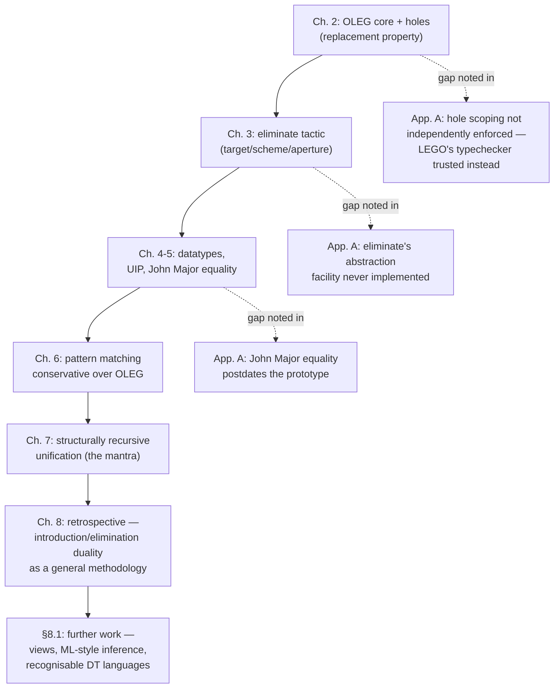

# Implementation and Reflection

[[book-guidelines|↩ Back to guidelines]]

## Why a thesis needs a chapter like this

Everything in chapters 2–7 is a piece of mathematics: a calculus (OLEG), a
tactic (`eliminate`), a family of theorems (no confusion, no cycle,
conservativity of pattern matching), a verified algorithm (structurally
recursive unification). None of that tells you whether the ideas actually
*run*. A type theory can be perfectly sound on paper and still be unusable
the moment you try to mechanize it — the gap between "this rule is
admissible" and "this rule is thirty lines of tactic code that terminates
in under a second" is exactly where most formalization projects die.

McBride closes the thesis with two short, unusually candid pieces of
writing that address that gap from opposite directions:

- **Chapter 8 (Conclusion)** steps back to ask *what was actually shown*
  and *why should anyone care* — the argument for dependent types as a
  discipline for functional programming, not just a proof-assistant
  curiosity.
- **Appendix A (Implementation)** is the opposite move: instead of
  defending the theory, it lists the places where the actual LEGO-based
  prototype **fell short** of the theory — a compact "known issues" file
  for a research artifact.

Reading them together is instructive for a specific reason relevant to
building any elaborator or kernel: the appendix is a case study in how
much slack a working system can tolerate before its metatheory catches
up with it. McBride shipped and used a tool for years whose scoping
discipline for holes was *not* independently enforced — and it worked,
because a second, independent typechecker caught anything that slipped
through. That pattern — an aggressive, not-fully-verified elaboration
layer sitting in front of a small, trusted, independently-checking
kernel — is precisely the architecture a Lean-style system uses, and it
is worth naming explicitly if you are designing one.

## The retrospective argument (Chapter 8, §8 body)

### What OLEG actually bought, according to its author

McBride is unusually explicit about *ranking* his own contributions
rather than listing them flatly. In order:

1. **OLEG itself** is called "somewhat tangential" — a means, not the
   point. Its two claimed advantages are (a) partial constructions
   (proof states containing holes) are cleanly separated from core terms
   while still enjoying the **replacement property** (any partial
   construction can be swapped for another of the same type without
   disturbing anything around it — this is what makes refinement-style
   proof search compositional), and (b) the state of a theorem prover is
   representable *exactly* as a valid context of the calculus, rather
   than as an external data structure the calculus doesn't know about.
2. **Object-level pattern-matching support for dependent types**, built
   on ordinary type theory plus uniqueness of identity proofs (UIP), is
   presented as the thesis's real technical payload. It answers a
   question Coquand had left open about what ALF's pattern matching
   actually requires — and Hofmann–Streicher had shown, on the other
   side, that *something* beyond a conventional type theory is
   necessary. McBride's contribution is pinning that "something" down to
   exactly UIP, no more.
3. **John Major equality** ($\simeq$, comparing terms of possibly
   different types, only judged equal when the types agree too) is
   flagged as a convenience discovery made *along the way*, not a
   planned goal — it just turned out to be the right tool for stating
   equations over telescopes without threading dependency through the
   equations themselves.
4. **The object-level unification algorithm**, extended from his MSc
   work to the dependently typed setting, with automatically-derived
   "no confusion" and "no cycle" theorems for arbitrary datatype
   families. This is presented as evidence that UIP wasn't a lucky
   patch — it's structurally what the unification needed.

**What breaks without this ranking.** It would be easy to read chapters
2–7 as a flat list of four independent results. McBride's own ordering
tells you the *dependency graph*: OLEG is scaffolding built to host the
pattern-matching result; John Major equality is a lemma-shaped tool that
falls out of proving that result; the unification algorithm is where the
whole machine gets exercised on a real problem. If you only remember one
sentence from this section, it should be: **the calculus exists to serve
the pattern-matching theorem, not the other way around.**

### The mantra, and its scope

The chapter's most quotable line doubles as its thesis statement:

> "If my recursion is not structural, I am using the wrong structure."

This is the payoff of chapter 7's unification algorithm: indexing terms
by their free-variable count turned a *generally* recursive algorithm
(needing an external termination measure, as in every prior unification
verification McBride surveys) into a *structurally* recursive one — the
type system's own well-founded recursion principle does the termination
argument for free, because the index strictly decreases at each
recursive call.

McBride is careful to bound the claim, in a way that's easy to miss on a
skim: he immediately concedes (in a footnote crediting Lennart
Augustsson) that some programs genuinely resist this treatment — general
recursion sometimes has to be abandoned for the sake of typechecking, and
not every "right structure" is easy to represent internally. His
response is not "always restructure your data" but "look harder before
reaching for an external termination argument" — a *default*, not a
theorem.

**What breaks without this discipline.** Without indices carrying the
information a recursive function needs to terminate, you're forced to
prove termination *externally* — a separate well-founded relation, a
separate decreasing-measure lemma, disconnected from the code. McBride's
running example (chapter 7's `bmgu`) shows the alternative: put the
count of free variables into the *type* of `tree`, and the recursive
call on a syntactically smaller index is structural by construction. The
type checker becomes the termination checker.

```rust
// The "wrong structure": arity is a runtime fact the compiler can't see.
// A termination argument (e.g. "the substitution shrinks the problem")
// has to live in a comment or a separate proof, disconnected from the code.
enum TermUntyped {
    Var(usize),
    App(Box<TermUntyped>, Box<TermUntyped>),
}

// The "right structure", McBride's mantra applied: the variable count
// is an index, not just a runtime value. A function over `Term<N>` that
// recurses into `Term<M>` with M < N is *structurally* recursive on
// that index — no external measure needed. (Rust's type system can't
// express the compile-time N==usize-value link precisely, but this is
// exactly what a dependently-typed language, or a `Vec`-of-length-N
// style refinement encoding, is doing under the hood.)
enum Term<const N: usize> {
    Var(Fin<N>),               // Fin<N>: a variable index provably < N
    App(Box<Term<N>>, Box<Term<N>>),
}
```

```lean
-- Lean makes the same point literally: `n` is a real index, not a
-- comment, and the elaborator/kernel can see it shrink.
inductive Term : Nat → Type
  | var : Fin n → Term n
  | app : Term n → Term n → Term n

-- A function like `occurs` or `thin` recursing structurally on `n`
-- needs no separate `decreasing_by` clause when the recursive call is
-- genuinely on a smaller `n` — this *is* McBride's "structural
-- recursion is termination for free."
```

### The elimination-rule philosophy, restated as a methodology

The closing pages generalize chapter 3's `eliminate` tactic into a
manifesto: specifications should say not just *what a program builds*,
but *what you're entitled to know when you use it*. McBride's complaint
is that first-order equational specifications only capture
**introduction behaviour** (how to build a value) and are silent on
**elimination behaviour** (what you can legitimately do with a value
once you have it) — and that the functional-programming and
proof-community habit of "fiddling with the primitive rules for data"
when reasoning about programs is exactly backwards, since nobody would
dream of *writing* programs at that level of primitiveness.

This is the same introduction/elimination duality that structures the
whole thesis (chapter 3's target/scheme/aperture vocabulary), now
elevated from "a proof tactic" to "a design principle for specifying any
data-manipulating program."

### Further work (§8.1)

Three threads, each picking up an unfinished argument from earlier
chapters:

1. **A recognisable dependently-typed programming language.** The
   open problem, inherited from chapter 6, is handling *empty cases*
   robustly: a stored program's equations only reflect the deducible
   behaviour of the underlying proof term, so reloading a program
   requires reloading its justification too. McBride sketches two
   directions — detecting one-step-obviously-empty argument types
   automatically, or requiring types to be explicitly "filled up" with
   badness markers in what would otherwise be empty regions — without
   committing to either.
2. **An ML-style type inference algorithm** as "an obvious next step,"
   explicitly framed as *another instance of the optimistic optimisation
   strategy* from chapter 7's unification correctness proof — i.e., not
   a new technique, but the same accumulate-a-bound-while-solving idea
   applied to a different optimization problem (principal-type finding
   instead of most-general-unifier finding).
3. **Derived elimination rules as a programming technique — "views."**
   This is the section's most forward-looking idea, and the one that
   most directly anticipates modern dependently-typed practice
   (Agda's `with`, Idris's `views`, McBride's own later "Epigram" work
   traces back to exactly this paragraph). The observation: programmers
   already write **derived constructors** — `plus`, `snoc` — that build
   data in patterns more abstract than the raw constructors offer.
   McBride's proposal, crediting Wadler's 1987 "views" paper, is to give
   programmers the dual: derived, macroscopic ways to *pattern-match*
   on data, not just build it. His closing line — "the left [-hand side]
   came into its own" — names the asymmetry directly: decades of
   attention to what goes on the right-hand side of an equation
   (construction), almost none to principled treatment of the left
   (elimination/matching).

**What breaks without this.** Without derived elimination rules /
views, a programmer who wants to case-split on, say, "the last element
of a nonempty vector" (chapter 6's `vlast` example) is stuck matching on
the datatype's *primitive* constructors even when the natural case
split doesn't align with them — exactly the gap `eliminate` was built to
paper over for proof, and which McBride is now proposing to paper over
for programs too.

## The reality check (Appendix A, pp. 245–246)

Appendix A is short — barely a page and a half — and reads like a
deliberately honest changelog. Four gaps between the theory of chapters
2–7 and the LEGO-based OLEG prototype that actually existed:

| Theory says | Prototype actually did |
|---|---|
| Partial constructions are rigidly separated from core terms (chapter 2's whole architectural point) | The separation was **not rigidly enforced** in the implementation |
| Holes have scoping conditions derived from OLEG's own metatheory (§2.7) | The prototype reused **LEGO's own unification algorithm**, so those scoping conditions were never separately checked — LEGO's independent typechecker was trusted to catch anything that slipped through |
| The `eliminate` tactic supports an abstraction facility for constructing schemes from *derived* (non-datatype) elimination rules (chapter 3) | **Never implemented** — adequate for the thesis's own examples (all built from datatype elimination rules), but derived elimination rules for functions had to be applied **by hand** |
| Equality is John Major equality $\simeq$ throughout (chapter 5) | John Major equality **postdates the prototype** — it uses traditional Martin-Löf equality plus uniqueness instead, so telescopic equations are encoded awkwardly, with each equation coercing through all previous ones to stay well typed |

Two of these deserve a closer look because they say something general
about building trustworthy proof/type-checking systems, not just about
this one prototype.

### Trusted-kernel architecture, avant la lettre

The scoping-conditions gap is the more important one. OLEG's theory
(chapter 2) is built around holes bound *explicitly in the context*,
with metatheorems establishing exactly when it's sound to instantiate
one. The prototype didn't independently enforce those conditions — it
borrowed LEGO's unification wholesale and leaned on a second,
independently-implemented component (LEGO's typechecker) to catch
anything unsound that got through. McBride's own framing is
matter-of-fact: "the complete terms generated are independently checked
by LEGO's reliable typechecker before they are trusted."

This is precisely the shape of a modern **elaborator-plus-kernel**
split: an elaborator (here, LEGO's unifier driving OLEG's tactics) is
allowed to be heuristic, aggressive, and not fully verified against the
formal system's own metatheory, *as long as* every term it produces is
re-checked from scratch by a small, independent, trusted typechecker
before anything relies on it. Lean's architecture makes this the load
-bearing design decision (a large, fast, occasionally-buggy elaborator
in front of a small, slow, carefully-verified kernel); McBride's
appendix shows the same division of labor emerging informally, as a
pragmatic concession, a decade and a half earlier.

```lean
-- The shape McBride describes, in Lean's own vocabulary:
-- 1. `elabTerm` (LEGO's unifier here) does the heavy, heuristic work —
--    metavariable resolution, tactic execution, hole scoping — without
--    itself being proof-checked against the calculus's metatheory.
-- 2. The kernel's `isDefEq` / typechecking pass re-derives that the
--    resulting term is well-typed from first principles, independent
--    of *how* the elaborator arrived at it.
-- If (1) is unsound, (2) is the only thing standing between that and
-- an accepted false theorem — which is exactly OLEG-via-LEGO's setup.
```

The anecdotal note that follows — "in all the developments I
implemented, I found that I obeyed [the restrictions on holes]" — is
McBride reporting, essentially, that his own elaborator was empirically
well-behaved even though nothing forced it to be. That's a useful data
point about how often theoretical worst cases show up in practice, but
it's exactly the kind of claim a trusted-kernel architecture is designed
to not have to rely on.

### What "never implemented" costs you

The missing abstraction facility for derived elimination rules is a
smaller but still telling gap: chapter 3's theory covers elimination
rules generally (datatype-derived *and* function-derived, like
`NEqRecI`'s recursion-induction principle), but the tactic
implementation only automated the datatype case. The thesis's examples
survive this because they're all built from datatype elimination rules
— but it's a direct, named limitation on how far `eliminate` could be
trusted to scale, and it foreshadows exactly the "further work" item
about views: automating elimination for *derived*, programmer-defined
structure (not just primitive datatypes) is unfinished business on both
the proof side (this appendix) and the programming side (§8.1's views
proposal).

## Where this leads



Chapter 8 and Appendix A don't introduce new machinery — they're the
thesis auditing itself, and that audit is worth taking as seriously as
any theorem in it. For the standing goal of building a Rust-based
dependent/refinement-type compiler with an embedded elaborator and
theorem prover, two things here are directly load-bearing rather than
merely historical:

- **The mantra** ("if my recursion is not structural, I am using the
  wrong structure") is a design heuristic for the refinement-type
  surface language itself — it's the argument for *why* indexing data
  by the facts a checker needs (variable counts, list lengths,
  invariant witnesses) turns termination and safety obligations into
  things the type system verifies for free, rather than side conditions
  the CSP/abstract-interpretation backend has to re-discover (**Type
  Theory**).
- **The elaborator/kernel split forced by Appendix A's honesty** is the
  architectural precedent for exactly the metavariable unifier this
  project's elaborator needs: it is fine — arguably necessary — for the
  unifier driving implicit-argument resolution to be heuristic and not
  separately verified against the calculus's own metatheory, *provided*
  every term it emits is re-typechecked by a small, independently
  trustworthy kernel before the theorem prover or the compiler relies on
  it (**Automated Reasoning**: proof-term reconstruction feeding a
  trusted kernel).

This is the last content chapter of the book-guidelines Topic List; the
thesis's technical arc ends at chapter 7, and these final pages are
where McBride tells you which parts of that arc he'd bet on generalizing
(structural recursion via indexed types, elimination-rule specification)
and which parts were scaffolding specific to getting OLEG built at all
(the prototype's shortcuts around hole scoping and equality).
