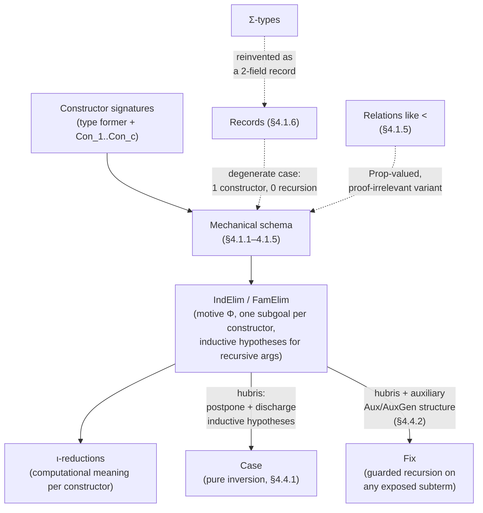

[[book-guidelines|↩ Back to guidelines]]

# Inductive Datatypes and Their Elimination

## Why this chapter exists

Chapter 3 gave you the *grammar* of elimination rules in the abstract — target, scheme,
aperture, patterns, case data, inductive hypotheses — but it never told you where an
elimination rule actually comes from. If someone hands you a brand-new datatype, how
do you *mechanically* produce its `Elim` constant and its computation rules, rather than
writing them out by hand each time the way `NElim` and `listElim` were simply asserted
earlier in the thesis? That is the entire business of Chapter 4: it is the compiler pass
that turns "here are some constructors" into "here is a sound induction principle and its
reduction behavior," for every shape of datatype OLEG needs — plain, parameterised,
higher-order recursive, dependently indexed, proof-irrelevant, and degenerate
(records).

McBride is explicit that he is mostly just formalizing Luo's ECC datatypes
[Luo94], strictly-positive schemata in the tradition of Coquand, Paulin-Mohring and
Dybjer [CPM90, Dyb91] — the datatypes of Coq, LEGO and ALF. What is novel here is not
the datatypes themselves but two things layered on top: (1) a completely uniform recipe
that scales from `N` up to dependent families without changing shape, and (2) the
derivation, from that single "traditional" one-step eliminator, of Coq's more convenient
`Case`/`Fix` split — including the "guarded fixpoint" trick needed to make efficient,
non-tail-recursive functions (the running example is Fibonacci) actually elaborate.

If you are building a compiler with a real `inductive` declaration, this chapter is
close to the literal source code of your type-checker's "elaborate this datatype
declaration" pass — Lean, Coq, and Agda all run some version of this algorithm, generating
a recursor/eliminator and reduction rules from constructor signatures alone.

## The load-bearing idea: elimination rules are generated from constructors, mechanically

Every datatype declaration McBride considers decomposes into exactly four components:

1. **The type former** — the new constant naming the type or type family (`N`, `list`, `vect`).
2. **The constructors** (introduction rules) — the means of building canonical elements (`0` and `s` for `N`).
3. **The elimination rule** (induction principle) — how to decompose an element of the datatype to construct something else (a proof, or a recursively computed value). It must carry a *target annotation* (Chapter 3, §3.4) so `eliminate` knows what it eliminates.
4. **The $\iota$-reductions** — the computational meaning of the elimination rule: what it does when actually applied to a canonical (constructor-headed) term.

What breaks without step 4: an eliminator with no $\iota$-rules is *only* an induction
principle for proving propositions — you could case-split, but a defined function built
from it would never *compute*. It is the $\iota$-reductions that turn `NElim` into
something that behaves like `match`/pattern matching at run time, not merely a
classical logical inference rule.

```rust
// The four components, Rust-shaped (informally — Rust's enums don't generate a
// dependent eliminator, but the shape of the analogy is exact):
enum Nat {          // 1. type former
    Zero,            // 2. constructors ...
    Succ(Box<Nat>),  //    ... (Con_1 = Zero, Con_2 = Succ)
}
// 3. "elimination rule" ~ the fold/catamorphism over Nat:
fn nat_elim<T>(base: T, step: impl Fn(&Nat, T) -> T, n: &Nat) -> T {
    match n {                       // 4. the ι-reductions ARE this match arms:
        Nat::Zero => base,          //    NElim Φ z s 0      ↝  z
        Nat::Succ(m) => step(m, nat_elim(base, &step, m)),
        //             ^ NElim Φ z s (s n) ↝ s n (NElim Φ z s n)
    }
}
```

```lean
-- Lean literally does this generation for you when you write `inductive`.
inductive Nat where
  | zero : Nat
  | succ : Nat → Nat

-- `Nat.rec` is exactly `NElim`, auto-generated from the constructor signatures;
-- the defining equations of `Nat.rec` on `zero`/`succ` are exactly the ι-rules.
#check @Nat.rec
-- {motive : Nat → Sort u} → motive Nat.zero →
-- ((n : Nat) → motive n → motive n.succ) → (t : Nat) → motive t
```

Reading `Nat.rec`'s type side-by-side with the book's schema below is the fastest way
to see that "elimination rule" is just the theory-internal name for what your compiler
calls a **recursor**.

## 4.1 Constructing eliminators, one generality level at a time

McBride builds up in five stages, each one generalizing the constructor signature
slightly and re-deriving the elimination rule and $\iota$-rules mechanically from it.
This section is worth reading as a single algorithm with five instantiations, not five
unrelated examples.

### 4.1.1 Simple datatypes, like $\mathbb{N}$

A simple (non-indexed, non-parameterised) datatype is a constant `Ind : Type` together
with constructors $\mathrm{Con}_1,\dots,\mathrm{Con}_c$, where each has the shape

$$
\mathrm{Con}_j : \forall \vec a : \vec A_j.\, \forall \vec x : \{\mathrm{Ind}\}^{r_j}.\, \mathrm{Ind}
$$

Here $\vec a$ are the **non-recursive arguments** (their types $\vec A_j$ may not
mention $\mathrm{Ind}$ itself, nor any universe as large as the one $\mathrm{Ind}$
inhabits — this is the strict-positivity discipline, policed by what McBride calls,
citing Harper and Pollack, "the universal policeman" [HP91]), and $\vec x$ are the $r_j$
**recursive arguments**. Think of each constructor as a labelled tree node: $r_j$
out-edges (the recursive arguments) and a label drawn from the telescope $\vec A_j$ (the
non-recursive arguments). $\mathbb{N}$ is the two-constructor case: $0 : \mathbb{N}$
($r=0$) and $s : \mathbb{N} \to \mathbb{N}$ ($r=1$, no non-recursive arguments). Note the
structural constraint: if $\mathrm{Ind}$ is to be inhabited at all, at least one
constructor must have $r_j = 0$ (a "base case").

The elimination rule is built by a completely mechanical translation: take a **motive**
$\Phi : \mathrm{Ind} \to \mathrm{Type}$ (the property/computation you want, indexed by
the element being eliminated), and for each constructor, manufacture a rule subgoal by
copying its introduction-rule shape but writing "$\Phi\,p$" everywhere the introduction
rule had "$p : \mathrm{Ind}$" — i.e., turning each recursive argument $x_i$ into an
extra hypothesis $\Phi\,x_i$ (an **inductive hypothesis**), while keeping $x_i$ itself
around too, since $\Phi\,x_i$'s type may depend on it:

$$
\mathrm{IndElim} : \forall \Phi : \mathrm{Ind}\to\mathrm{Type}.\;
\Big(\prod_{j=1}^c \forall \vec a:\vec A_j.\, \forall \vec x:\{\mathrm{Ind}\}^{r_j}.\,
\{\Phi\,x_i\}^{r_j} \to \Phi(\mathrm{Con}_j\,\vec a\,\vec x)\Big) \to
\forall x:\mathrm{Ind}.\, \Phi\,x
$$

and the $\iota$-reduction, one clause per constructor:

$$
\mathrm{IndElim}\;\Phi\;\vec\varphi\;(\mathrm{Con}_j\,\vec a\,\vec x) \;\rightsquigarrow\;
\varphi_j\,\vec a\,\vec x\,\{\mathrm{IndElim}\;\Phi\;\vec\varphi\;x_i\}^{r_j}
$$

i.e. apply the $j$-th case method to the constructor's arguments *and* to the
recursive results computed by re-running the eliminator on each recursive argument. For
$\mathbb{N}$ specifically:

$$
\mathrm{NElim} : \forall \Phi:\mathbb{N}\to\mathrm{Type}.\; \Phi\,0 \to
\big(\forall n:\mathbb{N}.\,\Phi\,n \to \Phi(sn)\big) \to \forall n:\mathbb{N}.\,\Phi\,n
$$
$$
\mathrm{NElim}\;\Phi\;z\;s\;0 \rightsquigarrow z \qquad\qquad
\mathrm{NElim}\;\Phi\;z\;s\;(sn) \rightsquigarrow s\;n\;(\mathrm{NElim}\;\Phi\;z\;s\;n)
$$

McBride's aside is worth internalizing: functional programmers will recognize the
special case where $\Phi$ is a *constant* type (not depending on the eliminated
element) as exactly the **fold** — `foldr`/`foldl`'s "combining function receives both
the substructure and the already-folded recursive result" shape is $\mathrm{NElim}$
with the dependency erased.

**What breaks without the inductive-hypothesis bookkeeping:** if the rule subgoals only
supplied $\Phi\,(\mathrm{Con}_j\,\vec a\,\vec x)$ with no access to $\Phi\,x_i$ for the
recursive $x_i$, you would have *case analysis* but not *induction/recursion* — you
could inspect the outermost constructor but never recurse into its substructure. The
inductive hypotheses are precisely what promotes a case split into strong enough
machinery to define `plus`, prove associativity, etc.

```lean
-- Motive-first signature: this is (up to argument order) literally NElim.
def natElim {motive : Nat → Sort u}
    (z : motive .zero)
    (s : (n : Nat) → motive n → motive n.succ) :
    (n : Nat) → motive n
  | .zero   => z
  | .succ n => s n (natElim z s n)
```

### 4.1.2 Parameterised datatypes, like `list`

You *could* define `Nlist`, a bespoke list-of-naturals type, by the exact simple-datatype
recipe above. But you'd rather define `list A` once for a variable parameter `A : Type`
and reuse it. Parameterisation is the easy kind of generality: the parameters $\vec p :
\vec P$ are fixed once, at the very start of the whole definition — type former,
constructors, eliminator, $\iota$-rules all just get $\vec p$ threaded through unchanged.
Contrast this with *indexing* (§4.1.4 below), where the "extra argument" is allowed to
*vary* across the different clauses — that distinction (fixed once vs. varying per
clause) is one of the most consequential design choices you'll make in a real language's
`inductive`/`data` syntax, since it determines whether a single motive can be stated at
all.

$$
\mathrm{list}\,A : \mathrm{Type} \qquad
\mathrm{nil}\,A : \mathrm{list}\,A \qquad
\dfrac{h:A \quad t:\mathrm{list}\,A}{\mathrm{cons}\,h\,t : \mathrm{list}\,A}
$$
$$
\mathrm{listElim} : \forall A.\, \forall \Phi:(\mathrm{list}\,A)\to\mathrm{Type}.\;
\Phi(\mathrm{nil}\,A) \to \big(\forall h{:}A,\,t{:}\mathrm{list}\,A.\,\Phi\,t \to
\Phi(\mathrm{cons}\,h\,t)\big) \to \forall l{:}\mathrm{list}\,A.\,\Phi\,l
$$

```rust
enum List<A> {
    Nil,
    Cons(A, Box<List<A>>),
}
// `A` is McBride's parameter ~p — fixed for the whole `impl`/definition, unlike an
// index, which could differ between Nil's and Cons's "return type."
fn list_elim<A, T>(nil: T, cons: impl Fn(&A, &List<A>, T) -> T, l: &List<A>) -> T {
    match l {
        List::Nil => nil,
        List::Cons(h, t) => cons(h, t, list_elim(nil, &cons, t)),
    }
}
```

### 4.1.3 Higher-order recursive arguments, like `ord`

The next generalization: a constructor's recursive argument doesn't have to be a single
`Ind`, it can be a *function returning* one — as long as the domain doesn't itself
mention `Ind` (this side condition is exactly **strict positivity** stated precisely; a
domain that mentioned `Ind` negatively would let you construct a paradoxical fixed
point). McBride's example is Brouwer ordinals:

$$
\mathrm{zero}:\mathrm{ord} \qquad \dfrac{x:\mathrm{ord}}{\mathrm{suc}\,x:\mathrm{ord}}
\qquad \dfrac{f:\mathbb{N}\to\mathrm{ord}}{\mathrm{sup}\,f:\mathrm{ord}}
$$

`sup` takes a *countably infinite family* of smaller ordinals as its single recursive
argument. The corresponding rule subgoal doesn't get one inductive hypothesis, it gets a
**family of them**, one for every possible index:

$$
\mathrm{ordElim} : \forall\Phi{:}\mathrm{ord}\to\mathrm{Type}.\;
\Phi\,\mathrm{zero} \to (\forall x.\,\Phi\,x\to\Phi(\mathrm{suc}\,x)) \to
\big(\forall f{:}\mathbb{N}\to\mathrm{ord}.\, (\forall n.\,\Phi(f\,n)) \to
\Phi(\mathrm{sup}\,f)\big) \to \forall x.\,\Phi\,x
$$

and computing over `sup` means *manufacturing* the family of recursive results by
$\lambda$-abstracting over the recursive call itself:

$$
\mathrm{ordElim}\;\Phi\;z\;s\;\mathrm{sup}\;(\mathrm{sup}\,f) \rightsquigarrow
\mathrm{sup}\;f\;(n{:}\mathbb{N}.\,\mathrm{ordElim}\;\Phi\;z\;s\;\mathrm{sup}\;(f\,n))
$$

```rust
// Rust makes this uncomfortable (no first-class dependent function types), but the
// *shape* is a boxed closure recursive argument:
enum Ord {
    Zero,
    Suc(Box<Ord>),
    Sup(Box<dyn Fn(u64) -> Ord>),
}
fn ord_elim<T: Clone + 'static>(
    zero: T,
    suc: impl Fn(&Ord, T) -> T + Clone + 'static,
    sup: impl Fn(&(dyn Fn(u64) -> Ord), Box<dyn Fn(u64) -> T>) -> T,
    o: &Ord,
) -> T {
    match o {
        Ord::Zero => zero.clone(),
        Ord::Suc(x) => { let r = ord_elim(zero.clone(), suc.clone(), &sup as &dyn Fn(_,_)->_, x); suc(x, r) }
        // for Sup we'd build the *family* of recursive results as a closure —
        // exactly ordElim's λn. ordElim Φ z s sup (f n)
        Ord::Sup(_f) => unimplemented!("illustrative — needs the family-of-results closure"),
    }
}
```

```lean
-- Lean handles this cleanly because Π-types are first class:
inductive Ord where
  | zero : Ord
  | suc  : Ord → Ord
  | sup  : (Nat → Ord) → Ord

-- Ord.rec's `sup` case genuinely receives `(n : Nat) → motive (f n)`,
-- a dependent function — exactly ordElim's family of inductive hypotheses.
#check @Ord.rec
```

**What breaks without strict positivity here:** if `sup`'s domain were allowed to be,
say, `Ord → Ord` (i.e. `Ind` appearing *negatively*, to the left of an arrow inside a
recursive argument's type), you could construct `Russell`-style self-referential terms
and derive a fixed-point combinator inside the *logic*, collapsing consistency. The
"strict positivity" footnote in the source text is not a stylistic nicety — it is the
one restriction standing between this whole chapter and an inconsistent type theory.

### 4.1.4 Dependent inductive families, like `fin`

This is the generalization that turns "datatype" into "indexed family of datatypes,"
and it is the one your refinement-type project will use constantly. Motivating problem:
you want a type with exactly $n$ elements, for an $n$ chosen *at the object level* (not
fixed at metalevel like `bool`, `unit`). Definition:

$$
\dfrac{}{\mathrm{fz}\,n : \mathrm{fin}(sn)} \qquad
\dfrac{x:\mathrm{fin}\,n}{\mathrm{fs}\,x : \mathrm{fin}(sn)}
$$

Crucially, `fz` and `fs` don't both target `fin n` — they target *different* instances
of the family (`fin (s n)`), and `fs`'s recursive argument lives in yet another instance
(`fin n`). This is exactly what distinguishes an **index** from a **parameter**: a
parameter is fixed once for the whole definition; an index is allowed to vary from
constructor to constructor (and even within one constructor's premises vs. conclusion).
`fin` is therefore a genuinely *mutually defined family* — `fin 0`, `fin 1`, `fin 2`,
... aren't independent inductive types, they only make sense as one simultaneous
definition, unlike `list N`, `list bool`, etc., each of which really is a standalone
inductive datatype once its parameter is fixed.

Generalizing to an arbitrary index telescope $\vec\imath : \vec I$:

$$
\mathrm{Fam} : \forall \vec\imath:\vec I.\,\mathrm{Type} \qquad
\dfrac{\vec a:\vec A \quad x_1:\mathrm{Fam}\,\vec t_1 \quad \cdots \quad x_r:\mathrm{Fam}\,\vec t_r}
      {\mathrm{Con}\,\vec a\,\vec x : \mathrm{Fam}\,\vec t_{\mathrm{con}}}
$$

The motive $\Phi$ must now range over the **entire family at once** — McBride writes
this as $\Phi : \mathrm{Fam} \to \mathrm{Type}$, using the "free telescope" abbreviation
for $\forall\vec\imath{:}\vec I.\,(\mathrm{Fam}\,\vec\imath)\to\mathrm{Type}$ — and the
final goal is $\forall \vec\imath, x{:}\mathrm{Fam}.\, \Phi\,\vec\imath\,x$. Note the
remark McBride makes explicitly: **there is still only one target-annotated argument**;
unifying the eliminated *term* against the aperture's *type* is enough to recover every
index automatically — this is the mechanism that makes `eliminate` usable interactively
without the user re-typing every index by hand, and it's the same unification machinery
Chapter 3's "friendly vs. unfriendly constraints" story depends on.

```lean
-- fin, done the way every dependently typed language actually implements it:
inductive Fin' : Nat → Type where
  | fz : {n : Nat} → Fin' (n+1)
  | fs : {n : Nat} → Fin' n → Fin' (n+1)

-- Fin'.rec's motive is `{n : Nat} → Fin' n → Sort u` — a family indexed exactly
-- as FamElim's Φ : Fam → Type, i.e. Φ : (n : Nat) → Fin' n → Type.
#check @Fin'.rec
```

Rust cannot express this directly (no dependent types), which is exactly the
motivating gap your refinement-type compiler exists to close — this is a genuinely
"say so rather than force a strained analogy" spot. The nearest Rust gets is
type-level Peano numbers with `PhantomData`, which recovers indexing but at enormous
ergonomic cost — precisely the cost dependent types exist to eliminate.

```python
# A dynamically-typed sketch is at least honest about what's being erased:
# the index becomes a runtime-checked invariant instead of a static one.
class Fin:
    def __init__(self, n, k):
        assert 0 <= k < n
        self.n, self.k = n, k
```

### 4.1.5 Inductively defined relations, like `<`

Relations look like dependent families but serve a different purpose: they are families
of *propositions*, living in `Prop`, used purely for reasoning rather than computation.
Two structural differences from §4.1.4:

- The type former ranges over the impredicative universe $\mathrm{Prop}$, so the
  eliminator's motive is also a family of propositions.
- Relations are **proof-irrelevant**: the eliminator's aperture abstracts the *indices*
  of the relation but never the *proof itself* — so the rule cases, unlike a datatype's,
  never mention which constructor built the incoming proof. This is the formal content
  of "propositions as sets, but degenerate": you get induction over how a proof was
  built without ever being able to pattern-match on *the proof term* as data.

$$
\dfrac{}{n < sn}\;(\texttt{<new}) \qquad \dfrac{m<n}{m<sn}\;(\texttt{<old})
$$
$$
\mathrm{{<}Elim} : \forall m,n:\mathbb{N}.\, \mathrm{Prop} \quad\Rightarrow\quad
\Phi(n,sn) \to \big(\forall m,n.\, m{<}n \to \Phi(m,n)\to\Phi(m,sn)\big) \to
\forall m,n.\,\forall H{:}m{<}n.\,\Phi\,m\,n
$$

This is the **strong induction principle**: note the extra premise "$m<n$" appears
explicitly in the step case, because — proof irrelevance again — the ordinary
inductive hypothesis no longer carries it implicitly the way a datatype's would. Drop
that premise and you get the (strictly weaker, but sometimes sufficient) **weak
induction principle**; McBride notes the two coincide given a good treatment of
conjunction, but the strong version is preferred in practice — "it is generally
preferable to discard unnecessary hypotheses than to reconstruct necessary ones."

McBride flags a genuine tension here that is worth surfacing explicitly for a
verifier/elaborator project: he gives $\mathrm{<Elim}$ computational $\iota$-reductions
too, purely for uniformity, but immediately says he isn't sure they should exist —
"computation belongs within the realm of datatypes." This is precisely the design fork
your compiler will face for `Prop`-sorted inductive relations used as verification
predicates: do you erase proof terms at run time (treat the relation as
computationally inert, matching McBride's instinct) or keep them reducible (treat
`Prop` uniformly with `Type`, as OLEG does here for mechanical simplicity)? Lean and
Coq both ultimately erase `Prop` at extraction/compilation time for exactly the reason
McBride gestures at.

```lean
-- Lean's `Prop`-universe inductive relations are exactly this, with proof
-- irrelevance as a *definitional* fact of the type theory (`Nat.lt` erases at runtime):
inductive Lt : Nat → Nat → Prop where
  | new : Lt n (n+1)
  | old : Lt m n → Lt m (n+1)
```

### 4.1.6 Record types as degenerate datatypes

The final generalization is really a *specialization*: a record is a one-constructor,
zero-recursion datatype — a pure tupling wrapper for its fields:

$$
\mathrm{Rec}:\mathrm{Type} \qquad \dfrac{\vec{\mathit{field}}:\vec A}{\mathrm{rec}\,\vec{\mathit{field}} : \mathrm{Rec}}
$$

with the named-tuple sugar $\langle \vec{\mathit{field}} = \vec t\rangle \Rightarrow
\mathrm{rec}\,\vec t$. The eliminator degenerates too: since there's only one
constructor and no recursion, $\mathrm{RecElim}$ just wants *a function of the fields* —
introducing the eliminator's arguments has the same effect as `open`ing a structure
(SML) or `with...do` (Pascal): it extends the local context with $\lambda$-bindings for
every field simultaneously.

$$
\mathrm{RecElim} : \forall\Phi{:}\mathrm{Rec}\to\mathrm{Type}.\;
\big(\forall \vec t{:}\vec A.\, \Phi\langle\vec{\mathit{field}}=\vec t\rangle\big) \to
\forall x{:}\mathrm{Rec}.\, \Phi\,x
$$

McBride's stylistic argument for eliminating rather than projecting: a single
elimination surfaces *all* fields at once (useful when later fields' types depend on
earlier ones), whereas repeated projection gives you one field at a time and is, in his
words, "a bit like understanding London in terms of discrete hinterlands for each tube
station." He still defines projections `(_).field` on top, built by a chain of
`RecElim` applications where each later projection's motive uses all earlier ones — the
type dependency forces the projections to be defined *in order*.

```rust
// Records-as-degenerate-datatypes maps almost too literally onto Rust structs:
struct Rec<A, B> { fst: A, snd: B }
fn rec_elim<A, B, T>(f: impl FnOnce(A, B) -> T, r: Rec<A, B>) -> T {
    f(r.fst, r.snd)   // "open"ing the record and handing both fields to f at once
}
```

```lean
structure Rec (A : Type) (B : A → Type) where
  fst : A
  snd : B fst   -- dependency between fields, exactly R[x]:t's motivation
```

### $\Sigma$-types, reinvented as records

Rather than take $\Sigma$-types as ECC primitives (as Luo does), McBride derives them as
a two-field parameterised record: $\Sigma\,B : \mathrm{Type}$ with fields `1 : A` and
`2 : B(1)` (the second field's type depends on the first — exactly the record-ordering
point above). This buys sugar (`⟨S,T⟩` for the non-dependent product,
`\|~S;T\|` for telescopes-as-nested-$\Sigma$s) essentially for free, plus a small tactic
suite (`intro-∀`, `intro-Σ`, `raise-Σ`, `raise-∀`, Table 4.4) for dragging
`?`-bindings through fake $\Sigma$-bindings in goals. The **blunderbuss tactic**
(§4.3.1) is the dual move for $\Sigma$-*hypotheses*: a depth-first search over
`∀`/`Σ`-bindings in a hypothesis, generalizing LEGO's `Refine` to also search under
`Σ`, plus a `blunder-refl` extension that opportunistically tries `refl` whenever an
equational premise shows up — exactly the situation Chapter 3's "friendly" (unifiable)
matching constraints produce.

## 4.4 From the one-step eliminator to `Case` and `Fix`

Everything above produces a single, "traditional" one-step eliminator per datatype: one
case split *and* recursion, bundled together, in one rule. Coq instead splits this into
two separate operators — `Case` (pure inversion, no recursive information) and `Fix`
(guarded recursion, checked by looking for constructor-guarded recursive calls) — and
McBride now shows both are *derivable* from the traditional eliminator, not
independent primitives. He gives two reasons this decomposition is strictly better,
not just stylistically different:

1. The argument you want to do **case analysis** on first need not be the argument you
   ultimately want to **recurse** on — the traditional eliminator welds these two
   decisions together.
2. The traditional eliminator only exposes inductive hypotheses immediately below one
   peeled-off constructor layer. `Fix` allows recursion on *any* subterm `Case` has
   exposed, which turns out to matter for more than just efficiency (see the Fibonacci
   example below).

### Deriving `Case`: proof by "hubris"

The construction technique McBride names **hubris** is genuinely elegant and worth
internalizing as a general refinement-proof trick, independent of datatypes: to build a
weaker rule from a stronger one, *boldly attempt to prove something false using the
strong rule*, fail predictably at certain subgoals, then **postpone** those failed
subgoals (turning `?`-holes into `∀`-bindings) and **discharge** them as the weaker
rule's own premises.

Concretely: from `FamElim`'s full rule (subgoals with case data *and* inductive
hypotheses), fix an arbitrary motive $\Phi$ and try to prove $\forall \vec y,y{:}\mathrm{Fam}.\,
\Phi\,\vec p$ directly — patently untrue in general, but eliminate anyway. Each
resulting subgoal $\Psi_j$ splits into case data $\vec c$ and (for our purposes, useless)
inductive hypotheses $\vec{\mathit{rec}}$; since nothing in a `Case`-shaped rule may
depend on the inductive hypotheses, delete them (`delete-unused`), postpone what
remains, and discharge. The reduction behavior falls out immediately:

$$
\mathrm{FamCase}\;\vec\psi\;\vec\imath\,(\mathrm{Con}_j\,\vec x) \rightsquigarrow
\psi_j\,\vec x
$$

— exactly a `match`/`case` with no recursive access, as promised.

### The guarded fixpoint: why the traditional eliminator can't do Fibonacci

The motivating failure case is worth walking through in full, because it's the sharpest
illustration in the chapter of *why* a seemingly-reasonable eliminator turns out to be
too weak. Try defining

$$
\mathrm{fib}\,0 = s0 \qquad \mathrm{fib}\,(s0) = s0 \qquad
\mathrm{fib}\,(ssn) = \mathrm{plus}\,(\mathrm{fib}\,n)\,(\mathrm{fib}\,(sn))
$$

directly with `NElim`. Eliminating `n` gives you a base case (fine) and a step case
whose inductive hypothesis is `Fib n → Fib (s n)` — but to define `fib (s (s n))` you
need **both** `fib n` *and* `fib (s n)` simultaneously available as data, and `NElim`'s
step case only ever exposes the *immediately preceding* value's inductive hypothesis,
buried one level too deep to reach `Fib n` directly. The naive attempt gets stuck with
`Fib n` "in the wrong place" — present in the derivation, but structurally
inaccessible.

**What breaks without a fix:** you're forced either to abandon structural recursion
(bring in an external termination measure) or to redefine `fib` in an ad hoc
accumulator style, losing the direct correspondence to the mathematical definition. The
classic remedy, going back to Burstall and Darlington [BD77], is to write an auxiliary
function `fibss` computing a *pair* of successive values by one-step recursion, then
define `fib` as one case-split on top of `fibss`:

$$
\mathrm{fibss}\;0 = \langle s0,s0\rangle \qquad
\mathrm{fibss}\;(sn) = \mathrm{let}\;\langle u,v\rangle = \mathrm{fibss}\;n\;\mathrm{in}\;\langle v, \mathrm{plus}\,u\,v\rangle
$$

Giménez [Gim94] generalizes exactly this trick into a general-purpose construction:
build an **auxiliary datatype** `Aux` that, for each `n`, stores precisely the
recursive values needed to finish the computation at `n` — then define the real
function by one step of case analysis on `n` plus one lookup into `Aux n`, and prove
`Aux` inhabited at every `n` by a genuinely one-step recursion (carrying forward
whatever needs carrying, à la `fibss`).

**Definition (guarded).** If `Con` is a constructor with non-recursive arguments $\vec
a$ and recursive arguments $\vec r$, each $r_i$ is *guarded* (by `Con`) in
$\mathrm{Con}\,\vec a\,\vec r$; and guardedness is transitive (if $r$ is guarded in $s$
and $s$ in $t$, then $r$ is guarded in $t$). This is precisely Coq's `Fix` termination
check spelled out as a relation, and it is the formal notion your compiler's
termination checker needs if you want to accept `Fix`-style definitions beyond
one-step peeling.

McBride's own choice, `NAux`, computes the auxiliary structure rather than defining it
as a separate inductive type (Giménez's original approach):

$$
\mathrm{NAux}\;\Phi\;0 = \mathbf{1} \qquad
\mathrm{NAux}\;\Phi\;(sn) = (\Phi\,n)\times(\mathrm{NAux}\;\Phi\;n)
$$

i.e. `NAux Φ n` is literally a nested tuple of *all* the `Φ`-values below `n`, "unfolding
like a wallet with too many credit cards" as case analysis proceeds — and the
`blunderbuss` tactic (§4.3.1) is exactly the tool for fishing the specific hypothesis you
need out of that accumulating nest. The rest of the construction is bureaucratic but
mechanical: prove `∀n. NAux Φ n → Φ n` by one-step recursion, hubris-postpone the "prove
`NAux Φ n` for all `n`" obligation into `NAuxGen`, and compose:

$$
\mathrm{NFix} \;\equiv\; \lambda n.\, \mathrm{body}\;n\;(\mathrm{NAuxGen}\;n)
$$

giving exactly the `Fix` operator, generalized in the chapter's closing pages to
arbitrary inductive families (`FamAux`/`FamAuxGen`/`FamFix`) and to higher-order
recursive arguments (`IndAuxho`/`IndAuxGenho`, abstracting the accumulated tuple over
the extra binder).

```rust
// The Aux-structure idea, made concrete: an explicit "memo tuple" datatype
// carrying every value fib needs below n, built by one-step recursion —
// this is NAux/NAuxGen/NFix, spelled out imperatively.
enum NAux { Base, Cons(u64, Box<NAux>) }  // (Φ n) × NAux(n-1), unrolled

fn fib_aux_gen(n: u64) -> NAux {
    match n {
        0 => NAux::Base,
        m => {
            let prev = fib_aux_gen(m - 1);      // one-step recursion (guarded!)
            let v = fib_body(m - 1, &prev);
            NAux::Cons(v, Box::new(prev))
        }
    }
}
fn fib_body(n: u64, aux: &NAux) -> u64 {
    match (n, aux) {
        (0, _) => 1,
        (1, _) => 1,
        (_, NAux::Cons(fib_n_minus_1, inner)) => match inner.as_ref() {
            NAux::Cons(fib_n_minus_2, _) => fib_n_minus_1 + fib_n_minus_2,
            NAux::Base => 1,
        },
        _ => unreachable!(),
    }
}
fn fib(n: u64) -> u64 { fib_body(n, &fib_aux_gen(n)) }
```

```lean
-- Lean's own answer to exactly this problem is well-founded / structural recursion
-- with an explicit accumulator, or `Nat.rec` on a *stronger* auxiliary motive —
-- the standard trick is to strengthen the motive to a product, which is precisely
-- McBride's NAux move made visible in the proof obligation itself:
def fibPair : Nat → Nat × Nat
  | 0 => (0, 1)
  | n + 1 => let (a, b) := fibPair n; (b, a + b)

def fib (n : Nat) : Nat := (fibPair n).1
-- fibPair *is* NAuxGen; its type Nat × Nat *is* NAux; `fib` composed on top *is* NFix.
```

## Structural summary



## Where this leads

This chapter is the load-bearing prerequisite for two of the thesis's later chapters,
and both connections matter directly for a compiler with a real elaborator and
verification pipeline (`type-theory` focus area):

- **Chapter 5 (Equality and Object-Level Unification)** needs, for *every* datatype
  produced by this chapter's construction, an automatically derivable "no confusion"
  (conflict/injectivity) and "no cycle" theorem — both are stated and proved *generically
  in terms of the constructor schema* established here (the $\vec a, \vec x$ shape of
  §4.1.1, generalized through §4.1.4). If your compiler wants Lean-style automatic
  `injection`/`no_confusion` lemmas for user-declared inductives, this chapter's uniform
  constructor schema is exactly the interface those lemmas are generated against.
- **Chapter 6 ([[Pattern-Matching-for-Dependent-Types|Pattern Matching for Dependent Types]])** builds ALF-style surface pattern
  matching entirely on top of `Case`/`Fix`/first-order unification — i.e., on the exact
  `Case` and `Fix` operators derived here by hubris and guarded auxiliary structures. The
  conservativity theorem there is a claim about *this chapter's* derived operators, not
  about the traditional eliminator directly.
- For your own elaborator: this is the concrete algorithm behind "elaborate an
  `inductive`/`data` declaration into a recursor," and the guarded-fixpoint construction
  (§4.4.2) is a *general, mechanical* recipe for compiling well-founded-looking recursive
  definitions down to structural recursion — worth remembering the next time your
  termination checker rejects an obviously-terminating function whose recursion isn't on
  a literal syntactic subterm of the *immediately preceding* argument. Its close
  cousin, dependent indexing by a decreasing measure (§4.1.4's technique, generalized),
  is exactly the trick McBride reuses in Chapter 7 to make first-order unification
  structurally recursive by indexing terms by their variable count — the same move, one
  chapter's worth of machinery later, solving a much bigger problem.
