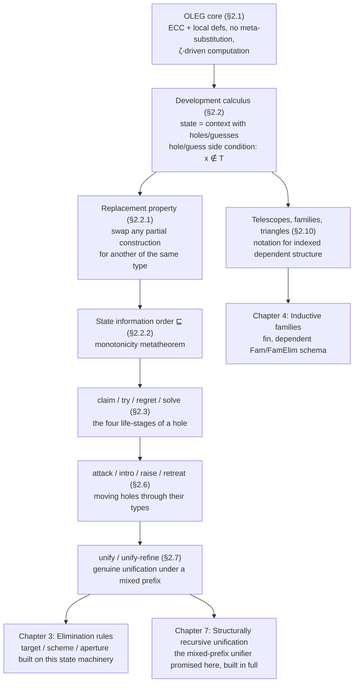

[[book-guidelines|↩ Back to guidelines]]

# The OLEG Type Theory of Holes

## Why a type theory needs a theory of its own incompleteness

Every proof assistant spends most of its life in an unfinished state: assumptions
accumulate, some claims are proven, others are still open, and the open ones
are represented by *something* — a metavariable, a placeholder, a "sorry", a
`?goal`. The awkward truth McBride starts Chapter 2 by confronting is that this
"something" is usually bolted onto the type theory from the outside, as an
implementation detail of whatever tool happens to be running the show, rather
than being a first-class citizen of the calculus itself.

LEGO, McBride's own tool's ancestor, is a concrete cautionary tale. Its
metavariables ("holes") are managed by an external ledger — a side-table
mapping each hole to its type and the context in which it may legally be
solved — plus an explicit-substitution mechanism to keep that ledger honest as
computation moves terms around. This works, but it's a *lie the type checker
tells itself*: LEGO doesn't actually verify, while a proof is in progress, that
every hole is being solved in a scope-respecting way. It only finds out for
sure when the finished term is submitted to a completely separate, external
typechecking pass. If the bookkeeping and the term have quietly drifted apart
— a genuine risk once you allow computation to shuffle subterms around — LEGO
will not tell you until the very end. This is exactly the kind of thing a
verifier's trusted kernel cannot be allowed to get away with: if the mechanism
that tracks *partial* proofs isn't itself sound, the soundness of *complete*
proofs is only established after the fact, by a different, unrelated argument.

McBride's response is $\mathrm{OLEG}$ (a pun — it stands for nothing, but LEGO
plus one letter), a type theory in which holes are not an external annotation
but an explicit **binding form of the calculus itself** — as fundamental as
`∀` or `λ`. A hole is a variable, bound in the context, exactly the way an
assumption or a local definition is a variable bound in the context. This one
design decision is the spine of the whole chapter, and it is worth stating
up front as the thesis McBride is defending:

> **If you make the state of an in-progress proof into a genuine judgment of
> the type theory (a context of bindings, one of which happens to be a hole),
> you get soundness of refinement proof "for free," as a direct corollary of
> the metatheory you'd have to prove anyway.** You don't need a separate
> external soundness argument for the tactic layer — the tactic layer *is*
> just talk about states, and states are just terms.

This is the same idea a modern elaborator faces when it decides where its
metavariables live: whether they're an ad hoc `HashMap<MetaId, MetaEntry>`
sitting beside the term representation (LEGO's answer, and — bluntly — most
production implementations' answer, including early Lean and Coq's `evar_map`)
or whether they're bound directly in the context the kernel already
understands (OLEG's answer, and closer to what a bidirectional
elaborator with in-context metavariables, à la some presentations of Agda's
or Lean 4's metacontext-as-telescope discipline, aims for). Keep this tension
in mind — it recurs at the end of this article, and it is precisely the
`trusted kernels` connection this book earns for the `automated-reasoning`
Focus Area.

## Part 1 — The OLEG core: an ordinary dependent type theory, described carefully

Before building the machinery of holes, McBride spends §2.1 pinning down the
*base* calculus with unusual notational discipline. This isn't filler — the
notation (bindings, contexts as data, contraction as computation *relative to*
a context) is exactly what makes the hole-in-context trick possible later, so
it earns close reading.

### Universes, identifiers, and terms indexed by their free variables

$$
\mathcal{U} ::= \mathrm{Prop} \mid \mathrm{Type}_j \qquad (j \in \mathbb{N})
$$

$\mathrm{Prop}$ is the universe of propositions; $\mathrm{Type}_j$ is a
cumulative hierarchy of "data" universes, indexed by a natural number $j$ to
avoid Girard's paradox (the usual "a universe of all types cannot itself be a
type in that universe" fix — same reason Lean has `Type 0`, `Type 1`, ... and
Coq has `Type@{i}`).

The unusual move is this: rather than defining "the set of terms" once and for
all, McBride defines *families* of bindings $B^x_V$ and terms $T_V$, indexed
by a finite set $V$ of variables permitted to occur free. A term is not just a
piece of syntax — it comes with a *certificate of which variables it's allowed
to mention*. This is exactly a de Bruijn-style *scope index* made explicit at
the level of the metatheory's own definitions, and it's a Chekhov's gun: it is
precisely the discipline that later lets OLEG state, syntactically, that a
hole's *type* may not mention the hole's own bound variable (§2.2's crucial
side condition).

```rust
// A first, deliberately naive Rust sketch of "terms indexed by their
// free-variable set." Real implementations use de Bruijn indices/levels
// or a scope-checked HashSet<VarId>; this is just to make McBride's V-indexing
// concrete before we get to anything dependent.
enum Term {
    Var(VarId),
    Universe(Universe),          // Prop | Type(j)
    App(Box<Term>, Box<Term>),
    Pi(VarId, Box<Term>, Box<Term>),   // ∀x:S. T
    Lam(VarId, Box<Term>, Box<Term>),  // λx:S. t
    Let(VarId, Box<Term>, Box<Term>, Box<Term>), // !x = s : S. t
}
```

McBride's four **binding operators** — $\forall$ (universal quantification /
dependent function type, sometimes written $\Pi$), $\lambda$ (functional
abstraction), and $!$ pronounced "let" (local definition) — are treated as
syntactically first-class: a binding is "a binding operator, an identifier,
and a sequence of properties" (type via `:`, value via `=`), and `.` attaches
the binding to a scope extending "as far right as possible." This is worth
lingering on because it is the seed of the development calculus: **a
binding is data**, not sugar that immediately desugars away. When McBride later
adds a fourth and fifth binding form (hole `?` and guess `?…▷`), he is
extending a syntactic category he has already set up to be extensible.

### Contexts and judgments — "Γ is with me, wherever I go"

$$
\mathrm{Ctxt} ::= \langle\rangle \mid \Gamma, x{:}S \mid \Gamma, x{=}s{:}S
$$

A context $\Gamma$ is a snoc-list (grows on the right) of typing and defining
bindings, built by two rules that both require $x \notin \Gamma$ (no shadowing
— every bound variable is globally fresh relative to its context, which is
what lets McBride talk about "the binding for $x$" unambiguously later). This
is a genuine design choice worth flagging for anyone building a checker: it
trades a small amount of implementation friction (you can't just re-push a
familiar name like `x` twice) for a much simpler metatheory, because "look up
$x$'s binding" is a total, unambiguous operation.

$\mathcal{J}_\Gamma$, the set of $\Gamma$-judgments, contains context validity
and typing:

$$
\frac{}{\mathrm{valid} \in \mathcal{J}_\Gamma}
\qquad
\frac{t, T \in T_\Gamma}{t : T \in \mathcal{J}_\Gamma}
$$

McBride's mantra — "$\Gamma$ is with me, wherever I go" — is a real technical
commitment, not just a slogan: computation (reduction) is defined **relative
to a context**, not on closed terms in isolation. This follows Goguen's typed
operational semantics, and it's the reason $\zeta$-reduction (see below) can
look up a variable's *value* from the context rather than requiring
meta-level substitution to have already happened. Concretely: **a context
behaves like a runtime stack of bound values**, and reduction is allowed to
consult that stack. This is precisely the design of an actual interpreter or
elaborator's evaluation environment — an `Env`/`Context` object that
`normalize` consults by variable lookup instead of eagerly substituting.

```rust
// Environment-relative reduction: eval consults Γ instead of substituting eagerly.
// This is McBride's "Γ is with me, wherever I go" turned into a function signature.
fn whnf(ctx: &Context, term: &Term) -> Term {
    match term {
        Term::Var(x) => match ctx.lookup_value(x) {
            Some(v) => whnf(ctx, &v),   // ζ-reduction: look up the !-bound value
            None => term.clone(),        // x is only a hypothesis; stuck
        },
        Term::App(f, a) => match whnf(ctx, f) {
            Term::Lam(x, _, body) => whnf(ctx, &subst(body, x, a)), // β
            f_whnf => Term::App(Box::new(f_whnf), a.clone()),
        },
        Term::Let(x, _, v, body) => whnf(&ctx.extend_def(x, *v.clone()), body), // ζ
        _ => term.clone(),
    }
}
```

### Contraction schemes: three kinds of computation, three kinds of "sound"

Table 2.1 gives exactly three contraction schemes:

$$
\begin{aligned}
\beta:&\quad \Gamma \vdash (\lambda x{:}S.\,t)\,s \;\rhd\; {!}x{=}s{:}S.\,t \\
\zeta:&\quad \Gamma, x{=}s{:}S, \Gamma' \vdash x \;\rhd\; s \\
\zeta_!:&\quad \Gamma \vdash {!}x{=}s{:}S.\,t \;\rhd\; t \qquad (x \notin t)
\end{aligned}
$$

What breaks without this three-way split: a conventional presentation just has
$\beta$-reduction perform capture-avoiding substitution $[s/x]t$ in one atomic
step. McBride deliberately **refuses** to do this. Instead $\beta$ first turns
an application into a `let`-binding (no substitution — just a syntactic
repackaging), then $\zeta$ handles *looking up* a bound value when a variable
is actually consulted, and $\zeta_!$ is pure garbage collection (throwing away
a `let` whose bound variable never got used). The traditional single-step
$\beta$-reduction is thus recovered only as the *composite* of all three:

$$
(\lambda x{:}S.\,t)\,s \;\rhd_\beta\; {!}x{=}s{:}S.\,t \;\rhd^*_\zeta\; {!}x{=}s{:}S.\,[s/x]t \;\rhd_{\zeta_!}\; [s/x]t
$$

Why go to this trouble? Because **meta-level substitution never has to be
defined for this reduction relation at all** — it only shows up, if at all,
as a derived notion. Everything the reduction rules need is "look up the
value bound to this name in the context," which is a context operation, not a
term-traversal operation. This is exactly the plumbing issue that any
checker/elaborator implementation has to solve — do you substitute eagerly
into ASTs (simple, but $O(n)$ per step and a magnet for capture bugs), or do
you carry an environment and substitute lazily/never (harder to state, but
this is what McBride is doing formally, and it's what real interpreters for
dependent type theories, including Lean's kernel, actually do — an
environment-passing NBE-style evaluator, not literal AST substitution)?

```lean
-- Lean's own kernel reduction is exactly this environment-relative style:
-- whnf consults the local context/environment for let-bound values rather
-- than eagerly substituting through the whole term. McBride's ζ rule is
-- literally "look up a let-bound local constant," which is what Lean's
-- `Meta.whnf` does when it hits an `Expr.fvar` bound by a `let`.
```

Compatible closure (table 2.2) is the usual "computation may happen anywhere
inside a term" congruence closure of $\rhd$ into $\to$, nothing surprising.

### Cumulativity and typical ambiguity

Table 2.3 defines a preorder $\preceq$ (following Luo) combining definitional
equality $\overset{=}{\to}$ (the reflexive-transitive-symmetric closure of
$\to$, called *conversion*) with universe inclusion:

$$
\frac{}{\Gamma \vdash \mathrm{Prop} \preceq \mathrm{Type}_j}
\qquad
\frac{j < k}{\Gamma \vdash \mathrm{Type}_j \preceq \mathrm{Type}_k}
\qquad
\frac{\Gamma \vdash S' \overset{=}{\to} S \quad \Gamma, x{:}S' \vdash T \preceq T'}
     {\Gamma \vdash \forall x{:}S.\,T \preceq \forall x{:}S'.\,T'}
$$

(Note the contravariance in the last rule's domain — standard subtyping for
function types.) Every well-typed term has a *principal type* up to $\preceq$,
which licenses **typical ambiguity**: McBride can just write $\mathrm{Type}$
and let the universe index be inferred, the same convenience Lean and Coq give
you with `Sort` / `Type` universe polymorphism and metavariables for universe
levels. In an implementation, cumulativity constraints between universe
variables are exactly what you'd store as edges in a directed graph and check
for cycles — this is a small, self-contained constraint-solving problem living
inside the type checker, a miniature of the larger unification/constraint
story that returns throughout the thesis.

### Core inference rules and metatheorems

Table 2.4 is the ordinary typing judgment (`empty`, `declare`, `define`,
`prop`, `type`, `var`, `imp`, `all`, `abs`, `app`, `let`, `cuml`) for what
McBride identifies as **Luo's ECC (Extended Calculus of Constructions) plus
local definitions, minus $\Sigma$-types** (which McBride reintroduces later,
in Chapter 4, as a derived record type rather than a primitive — a design
choice consistent with keeping the core minimal). Two points worth flagging
because they matter for anyone implementing this:

1. **No meta-level substitution appears in any core typing rule.** Where a
   textbook presentation of `app` would write
   $\Gamma \vdash f\,s : [s/x]T$, McBride's `app` rule instead produces
   $\Gamma \vdash f\,s : {!}x{=}s{:}S.\,T$ — the substitution is *deferred*,
   packaged as a `let`-binding in the *type*, to be resolved later by $\zeta$
   only if and when something actually forces the type to be inspected. This
   is, again, laziness pushed all the way into the type system's own
   inference rules.
2. `cuml` is genuinely a **subsumption rule** —
   $\dfrac{\Gamma \vdash t : S \quad \Gamma \vdash S \preceq T}{\Gamda \vdash t : T}$
   — the same shape as a bidirectional type checker's subtyping coercion
   step between the "synthesized" type and an expected type. Anyone who has
   implemented `check(e, expected_ty)` in terms of `infer(e)` plus a
   subtyping/definitional-equality check has implemented `cuml` by another
   name.

Table 2.5 lists the metatheorems that make this a sound type theory:
Church-Rosser (confluence — any two reduction paths from a common source
converge), strengthening (unused hypotheses can be dropped), subject
reduction (types are preserved by reduction — this is *the* soundness
property a type checker relies on when it decides "check up to normal form"
is equivalent to "check exactly"), strong normalisation (every well-typed term
terminates when reduced — inherited by an "add pointless β-redexes" embedding
into ECC, McBride's memorable image of "tying old tin cans onto terms"), and
**cut** — substitution admissibility:

$$
\Gamma, {!}x{=}s{:}S, \Gamma' \vdash t : T
\quad\implies\quad
\Gamma, [s/x]\Gamma' \vdash [s/x]t : [s/x]T
$$

Cut is the metatheorem that certifies "eliminating a `let` by substituting its
value everywhere and deleting the binding" is safe — precisely the operation
an optimizing compiler performs when it inlines a local definition, and
precisely the operation a kernel performs when it needs to check
definitional equality of two terms that disagree only via an intervening
`let`.

## Part 2 — Why holes need their *own* layer (and can't just live in the core)

Here McBride pivots to the chapter's real subject. §2.2 opens with the
motivating counterexample that justifies everything that follows, and it is
worth working through slowly because it is the "what breaks without this"
case for the entire chapter.

### The counterexample: holes leak into types

Suppose we have

$$
{=}_\mathbb{N} : \mathbb{N} \to \mathbb{N} \to \mathrm{Prop}, \qquad
\mathrm{refl}_\mathbb{N} : \forall n{:}\mathbb{N}.\, n =_\mathbb{N} n, \qquad
\mathrm{sym}_\mathbb{N} : \forall m,n{:}\mathbb{N}.\, m=_\mathbb{N} n \to n =_\mathbb{N} m
$$

In a *simply typed* system, an unfilled hole can safely be an anonymous `?`
symbol, because a term never appears inside a type — replacing any subterm
by another of the same type can never disturb the type of the whole. But
consider $\mathrm{sym}_\mathbb{N}\;?\;?\;(\mathrm{refl}_\mathbb{N}\;?) :
{?=_\mathbb{N}}\,?$. This typechecks fine with three *anonymous* holes — but
the three `?`s are not independent: $\mathrm{refl}_\mathbb{N}$'s argument
*must* equal $\mathrm{sym}_\mathbb{N}$'s first two arguments, because the
argument of a dependently typed function is smuggled into the *result type*.
Three unlabelled holes give you no way to say "these three must be solved
together, with the same value." Worse, if you *do* give them a shared name
(say, bind a variable $x$ for all three), a genuinely dangerous new failure
mode appears: two occurrences of a hole binding that look syntactically
identical (say $?n{:}\mathbb{N}$, appearing twice, even under different
binders) are not automatically the *same* hole, and conflating them —
solving one without the other — breaks type safety. **The problem is not
"holes can appear in types" (that's fine and often necessary — that's just
what a dependent hole is). The problem is `?`-*bindings* appearing inside
types**, because a binding is where a hole gets *solved*, and if the binding
that fixes a hole's identity sits inside the very type another hole's
solution has to match, you can no longer solve holes independently and
locally.

This distinction — "holes may leak into types, but ?-*bindings* must never
leak into types" — is the load-bearing design constraint the entire
development calculus exists to enforce, and it shows up explicitly as a
side-condition ($x \notin T$) in the `hole` and `guess` typing rules below.

### The development calculus: state as judgment

McBride's fix: introduce a fifth binding operator, `?` ("hole"), and represent
the *entire state of a theorem prover* — assumptions, proved theorems,
unproved claims, and partial proofs of those claims — as a single OLEG
**state** $\Xi$, i.e. a context, extended with two new component forms beyond
`:` (assumption) and `=` (definition):

$$
\begin{aligned}
\text{states: } &\Xi ::= \langle\rangle \mid \Xi, C \\
\text{components } C^x_V: \quad
&x{:}S \mid\; {!}x{=}s{:}S \mid\; \underbrace{{?}x{:}S}_{\text{hole (unsolved)}} \mid\; \underbrace{{?}x{\triangleright} q{:}S}_{\text{hole with a guess } q}
\end{aligned}
$$

A **partial construction** $p \in P_V$ is either an embedded core term, or a
binding $C^x.p$ over a smaller partial construction. Crucially, a guess $q$
attached to a hole via $\triangleright$ has *no computational force* — unlike
a `let`-bound value, a guess is a typechecked annotation only, invisible to
core reduction. This is the technical mechanism that keeps holes from
interacting with $\beta/\zeta/\zeta_!$ at all: **guesses are load-bearing for
typing, inert for computation.**

The development-calculus judgment $\vDash p : T$ (table 2.6) mirrors the core
exactly, with one telling asymmetry McBride flags explicitly: **holes never
appear on the right of a `:`.** Types are never partial constructions, only
terms. This isn't an incidental restriction — it encodes McBride's "analytic"
view of proof search: *we do not explain terms with types, we search for
terms inside types.* A type is a known target; a term is what's being
constructed to inhabit it. This is exactly bidirectional typing's
`check`/`infer` split read as a philosophy rather than just an algorithm:
`check(goal_type, partial_term)` makes sense; `check(partial_type, term)`
does not, because a goal with holes in its *type* is not a well-formed
question to ask a solver.

The `hole` and `guess` rules carry the crucial side condition mentioned above:

$$
\frac{\Xi, {?}x{:}S \vdash p : T \quad x \notin T}{\Xi \vdash {?}x{:}S.\,p : T}
\qquad
\frac{\Xi, {?}x{\triangleright}q{:}S \vdash p : T \quad x \notin T}{\Xi \vdash {?}x{\triangleright}q{:}S.\,p : T}
$$

$x \notin T$ is the formal expression of "the hole's own type may not mention
it" — a syntactic guarantee, checkable by a simple free-variable scan, that
recovers exactly the safety the earlier counterexample lost.

Because `?`-bindings can never occur inside applications or `let`-bound
values (they only occur in the "outer" binding spine of a partial
construction, or inside a guess), they have **zero interaction with
computation**: the only contraction rule at the partial-construction level is
$\zeta_!$ for spent `let`s; everything else is compatible closure pushing
reduction into embedded *terms*. This is McBride's "cowardice" principle made
completely precise: rather than teach reduction how to correctly handle a hole
threading through a redex (which is exactly the hard problem explicit
substitution calculi solve), OLEG simply arranges, by construction, that a
hole is never adjacent to a redex in the first place.

```rust
// A sketch of an OLEG-flavored metacontext: entries are components of a
// *state*, not a side-table. This is the structural choice a Rust
// elaborator has to make explicitly.
enum StateComponent {
    Assume   { ty: Term },                       // x : S
    Define   { value: Term, ty: Term },          // !x = s : S
    Hole     { ty: Term },                       // ?x : S   (unsolved)
    Guessed  { guess: PartialConstr, ty: Term }, // ?x ▷ q : S
}
// vs. the LEGO/typical-implementation alternative:
struct MetaEntry { ty: Term, scope: Vec<VarId> }  // an external ledger
type MetaCtx = HashMap<MetaId, MetaEntry>;        // — separate from the term!
```

### Positions and the replacement property

McBride formalizes "the place in a proof where you're working" as a
**position** $P \in \mathrm{Pos}_V$: a partial construction with exactly one
sub-partial-construction deleted (a one-hole context over the syntax tree,
in the "Huet zipper" sense — the same idea Chapter 7 later reuses literally
for term positions during unification). $P[p]$ re-plugs $p$ into the gap.

The **replacement metatheorem** is the chapter's single most important
result:

> If $\Xi \vDash P[p] : T$ follows from $\Xi; P \vDash p : R$, and
> $\Xi; P \vDash p' : R$ also holds, then $\Xi \vDash P[p'] : T$.

In words: **anywhere inside a valid development, you may swap one partial
construction for any other of the same type in the same local context, and
the whole remains valid.** This is exactly the property that fails for core
terms once dependent types are involved (McBride's own example: two
syntactically identical `?n:ℕ` bindings at different positions can't be
solved independently, because solving one changes what the other's type
"means" if they're not properly scoped) — but *does* hold for partial
constructions, precisely because of the `hole`/`guess` side condition just
discussed. The proof is a straightforward induction on the position, case
by case on which binding form the position goes under; the only nontrivial
case is `guess`, where replacing inside the guess doesn't disturb the
enclosing hole's type or side condition, because the guess is inert.

Why this metatheorem is *the* thing that makes refinement-style theorem
proving sound: every tactic in the rest of the chapter — `claim`, `try`,
`regret`, `solve`, `attack`, `intro`, `raise`, `unify` — is *justified* by
appeal to replacement (directly, or via the state information order derived
from it below). A tactic that "fills in a hole with a better partial proof"
is, formally, nothing but an instance of the replacement theorem applied at
one position. Once you have proven replacement *once*, as a metatheorem
about the calculus, you get the soundness of an entire family of tactics for
free, rather than having to separately justify each one as an ad hoc
operation on an external data structure. This is the single cleanest
illustration in the whole chapter of McBride's stated goal: refinement
proof, as a *practice*, falls directly out of a *judgment* of the type
theory, rather than needing its own bespoke soundness story.

```lean
-- The replacement property is, in spirit, exactly what licenses Lean's
-- tactic-mode `exact`/`refine`: a goal ⊢ p : T at some metavariable ?m
-- (a "position") may be closed by any p' of the same type, and the
-- ambient proof term remains well-typed — because Lean's elaborator
-- maintains precisely this invariant as a metatheorem about its
-- metavariable-assignment mechanism, not as a per-tactic ad hoc check.
```

### The state information order and monotonicity

To talk about proof *progress*, McBride defines a preorder $\Xi \sqsubseteq
\Xi'$: $\Xi'$ "knows everything $\Xi$ knows" — every typing fact and every
reduction fact provable in $\Xi$ still holds in $\Xi'$. Concretely,
$\Xi \sqsubseteq \Xi'$ holds when inserting new components, upgrading a bare
assumption or unsolved hole to a `let`, or attaching/replacing a guess never
*removes* information — only a variable that has already acquired
computational behavior (a value) can never have that behavior taken away.

The **monotonicity metatheorem** — if $\Xi \sqsubseteq \Xi'$ then every
judgment provable in $\Xi$ is provable in $\Xi'$ — is proved by induction on
derivations, and it is what justifies every *individual* state-transition rule
(`claim`, `try`, `regret`, `solve`, the "moving holes" rules) as sound without
re-deriving validity from scratch at each step: each such rule is shown to
produce a state $\sqsupseteq$ the one it started from, and monotonicity
guarantees nothing already proven is invalidated. This is precisely the
invariant a real proof-state data structure (Lean's `MetavarContext`, Coq's
`evar_map`, or a hand-rolled Rust `ElabState`) needs to preserve across every
mutation: *assigning* a metavariable, or refining the *type* of an unassigned
one, must never invalidate a typing judgment that was already established
against an earlier snapshot of that state.

## Part 3 — Life of a hole: four verbs, one soundness argument

§2.3 gives four **basic replacement operations**, memorably glossed by the
stages of a relationship:

$$
\begin{aligned}
\textbf{claim (birth):} &\quad
\frac{\vDash p : T \quad \vdash S : \mathrm{Type}}{\vDash {?}x{:}S.\,p : T} \\[4pt]
\textbf{try (marriage):} &\quad
\frac{\vDash {?}x{:}S.\,p : T \quad \vDash q : S}{\vDash {?}x{\triangleright}q{:}S.\,p : T} \\[4pt]
\textbf{regret (divorce):} &\quad
\frac{\vDash {?}x{\triangleright}q{:}S.\,p : T}{\vDash {?}x{:}S.\,p : T} \\[4pt]
\textbf{solve (death):} &\quad
\frac{\vDash {?}x{\triangleright}q{:}S.\,p : T \quad q\ \text{pure}}{\vDash {!}x{=}q{:}S.\,p : T}
\end{aligned}
$$

`claim` inserts a fresh hole; `try` attaches a candidate guess (reversibly);
`regret` discards a guess and returns to an unsolved hole; `solve` is the
death that matters — once a guess contains **no further `?`-bindings**
(McBride's technical sense of "pure," i.e. expressible as an ordinary core
term), the hole's binding operator is permanently converted from `?…▷` to
`!…=`, and the guess becomes a genuine `let`-bound value with real
computational force from then on. "Death is not the end of the journey, but
the transition by which a hole is solved, becoming a local definition" — a
line that is also a precise technical claim: solving a metavariable and
inlining a local `let` are, in OLEG, *literally the same syntactic operation*.

All four are admissible precisely because each one is monotone
($\sqsubseteq$) — they only ever add information, never retract it, except
`regret`, which is *allowed* to retract a guess specifically because a guess
carries no computational commitment yet (nothing downstream could have relied
on it). McBride then lifts this same four-rule pattern to a **position
information order** $\Xi \vdash P \sqsubseteq P'$, so that a claim/try/
regret/solve applied *anywhere* inside a development — not just at the
outermost binding — is justified the same way.

This is worth connecting explicitly to the Focus Area on **unification**:
every one of these four operations is a special case of the general move a
constraint solver makes — *strengthen the store of known facts about a
variable without disturbing anything already derived from it*. `try` is
exactly proposing a substitution for a metavariable in a constraint solver;
`solve` is exactly committing that substitution once it's been checked
consistent (`pure`, i.e. it doesn't itself still depend on unresolved
variables — the analogue of an "occurs check"-clean substitution in
unification, revisited formally in Chapter 7).

## Part 4 — Moving holes: attack, introduction, and Miller's "raising"

§2.6 (table 2.8) gives operations that change a hole's *position relative to
its own type* without changing what it will eventually prove:

- **attack**: turns a "naked" hole $?x{:}S$ into the canonical shape
  $?x{\triangleright}?x{:}S$ — a hole guessed by itself — readying it for
  introduction. (Needed because the introduction rules below only fire on
  this specific shape; `attack` is the "make the term look like what the
  rule expects" normalization step.)
- **intro-$\forall$** / **intro-!**: "animate" a hole of function type by
  pretending it has moved *underneath* a $\lambda$ or `let` binder, shortening
  its type by one argument — the formal counterpart of a tactic-mode `intro`.
- **raise-$\forall$** / **raise-!**: the reverse move, generalizing a hole
  *out* through a binder it depends on, lengthening its type. McBride credits
  this directly to Dale Miller's "raising" for existential variables under a
  mixed quantifier prefix — the same operation Miller's higher-order pattern
  unification uses to hoist a metavariable out past a universally bound
  variable it's stuck depending on.
- **retreat**: extracts a hole that has been raised all the way to the
  outermost position of a guess, turning it back into a top-level component of
  the state.

McBride's punchline: *any partial construction can be made pure by raising
and retreating all its remaining `?`-bindings* — i.e. "raise, then retreat"
is a general-purpose procedure for hoisting every unsolved hole in a
development out to the top level, where it becomes an ordinary open goal in
the state. This is the mechanical justification for why a proof assistant's
"remaining goals" list can always be presented as a flat sequence of
metavariables at the top of the context, no matter how deeply nested inside
the partial proof term they originally arose.

```lean
-- Miller's "raising" is exactly what a Lean/Agda-style elaborator must do
-- when a metavariable ?m, created inside `∀ x, ...`, needs to be solved
-- with a value that doesn't actually depend on x: the elaborator "raises"
-- ?m out past x, turning it into a metavariable of function type
-- (?m' : X → T instead of ?m : T under x), then solves ?m := ?m' x.
-- This is the McMillan/Miller "raising" trick, and it is the load-bearing
-- primitive behind higher-order pattern unification (Miller patterns) —
-- one of this book's Required Conceptual Connections.
```

## Part 5 — Refinement needs real unification, not matching

§2.7 is where the chapter earns its `automated-reasoning` tag most directly.
McBride first shows `naïve-refine`: solve a hole $?y{:}T$ by
$f\,\vec{x}$ for a known $f : \forall \vec{x}{:}\vec{S}.\,T$, inserting fresh
holes for $\vec x$ (a combination of `claim`, `try`, `solve` — try successive
argument-count guesses since convertibility is decidable, stopping at the
first that typechecks).

But then he gives a small, sharp counterexample showing this is not enough
once dependent types are in play:

$$
n:\mathbb{N},\quad
\mathrm{nsym} : \forall x{:}\mathbb{N}.\, n =_\mathbb{N} x \to x =_\mathbb{N} n,
\quad
m:\mathbb{N},\quad n_{em} : n =_\mathbb{N} m,
\quad
?y : \mathbb{N},\; ?m_{ey} : m =_\mathbb{N} y
$$

We *want* $y := n$, provable via $\mathrm{nsym}$ — but $\mathrm{nsym}\,x\,
n_{ex}$ proves $x =_\mathbb{N} n$, not $m =_\mathbb{N} y$. `naïve-refine`
cannot bridge this: it only ever produces new *argument* holes and checks the
*result* by simple matching against a known target. What's actually needed is
to build the application speculatively —
$!x{=}n_{ex}{=}\mathrm{nsym}\;x\;n_{ex} : x =_\mathbb{N} n$ — and then
**unify** its type against the goal's type $m =_\mathbb{N} y$, discovering
$x := m$ and $y := n$ *simultaneously*, by solving equations on both sides at
once. This is genuine two-sided unification, not one-sided matching against a
fixed pattern — precisely the distinction the `unify` transition rule
(table, §2.7) is built to formalize:

$$
\frac{
\Xi' \sqsupseteq \Xi
\quad \Xi' \vdash P \sqsubseteq P'
\quad \Xi'; P' \vdash S \overset{=}{\to} T
}{
\Xi;\ {?}y \triangleright P[\,{!}x{=}s{:}S.\ ?x{:}T.\,p\,] : \ldots \implies
\Xi';\ {?}y \triangleright P'[[x/x']p] : \ldots
}
$$

`unify` is deliberately left abstract — McBride explicitly imports a
first-order unifier "off the shelf" here, citing Miller's mixed-prefix
technology as the natural fit given OLEG's explicit hole-and-assumption
bindings — and defers its full construction to Chapter 7's structurally
recursive unification algorithm. The composite `unify-refine` tactic
(guess $?y$ with $f\,\vec z$ for fresh $\vec z$, then unify the guessed
result type against the goal, trying successively longer argument sequences
if needed) is, verbatim, McBride's description of *LEGO's own "Refine"
tactic* — so this section is simultaneously formal specification and
retrospective justification of an existing tool. His closing image — a
child hammering shaped blocks through a toy postbox before "the connection
between the shape of the block and the shape of the hole" clicks — is an apt
and very literal picture of what a unification-driven elaborator's search
process actually feels like from outside: violent trial refinement,
converging once the shapes actually match.

This is the single clearest place in the chapter to name the connection this
book's learning-goals file asks for explicitly: **`unify-refine` is,
structurally, the same problem as implicit-argument resolution in a
bidirectional elaborator** — guess a spine of arguments as fresh
metavariables, elaborate speculatively, then unify the inferred type against
the expected type to solve those metavariables. Anyone building "a
meta-programming elaborator that resolves implicit arguments via metavariable
unification... modeled on how Lean's elaborator and kernel unifier actually
work" (this workbench's stated standing project) is looking, in `unify-refine`,
at a 1999 formal ancestor of exactly that mechanism.

```rust
// unify-refine, sketched as an elaborator implicit-argument resolution step.
fn unify_refine(state: &mut ElabState, goal: MetaId, f: FnId) -> Result<(), Error> {
    let mut arity = 0;
    loop {
        let fresh_args: Vec<MetaId> = (0..arity).map(|_| state.fresh_hole()).collect();
        let candidate_ty = state.infer_applied_type(f, &fresh_args)?;
        match state.unify(candidate_ty, state.type_of(goal)) {
            Ok(subst) => { state.apply_substitution(subst); return Ok(()); }
            Err(_) if arity < state.max_arity(f) => arity += 1, // try one more arg
            Err(e) => return Err(e),
        }
    }
}
```

## Part 6 — Discharge, permutation, and comparison with explicit substitution

§2.8's "four discharges" (table 2.9) reconstruct LEGO's `Discharge` tactic
piecewise: pulling one binding's dependency *through* another by making
everything downstream functional over it ($\lambda$-through-$\forall$,
$\lambda$-through-$!$, $!$-through-$\forall$, $!$-through-$!$). McBride is
careful to note this is a "cinematic illusion" — the actual proof introduces
an *earlier* binding and re-expresses the later one in terms of it, rather
than literally moving anything. Table 2.10's `swap-independent` and
`delete-unused` further permute or drop arguments of a functional hole
whenever no dependency is broken — the formal license behind an IDE-style
"reorder these hypotheses" or "this argument is unused, remove it" refactor.

§2.9 then makes the comparison to explicit-substitution systems (TypeLab,
ALF) fully explicit, using the book's own diagram of the commutation failure
between $\beta$-reducing $(\lambda x{:}T.\,?)\,t$ before vs. after
instantiating `?` with $x$: reduce first and you silently lose the binding
occurrence of $x$ that the external ledger still expects to find, so a
"repair" substitution $[x{:=}t]$ has to be attached to the hole to keep the
ledger honest post hoc. OLEG's answer is not a cleverer repair — it is
**total cowardice**: holes cannot occur inside applications at all, so
there is *no* $\beta$-redex for a hole to be caught inside of in the first
place. The price is that a hole under a $\lambda$ that you want to reduce
past has to be explicitly raised and retreated first — a small, visible,
locally-checkable cost, in exchange for never having to reason about a hole's
interaction with reduction at all. McBride frames this as "a genuine
compromise between the ingenuity of explicit substitution and the pain of
representing holes as... skolem functions over the entire context" — you keep
a hole functional exactly as far, and only as far, as it is actually used
computationally.

## Part 7 — Telescopes, indexed families, and triangles: the notation the rest of the book depends on

§2.10 introduces machinery that is *purely* notational, but McBride flags
this section's content in nearly every later chapter, so it earns careful
treatment even though (per the book's own admission) "this chapter does
contain original work" mostly refers to Parts 1–6, not this notational
digression.

**Telescopes.** A sequence $\vec{T} = T_1, \ldots, T_n$ is an
$\vec{x}$-telescope when each $T_i$ may depend on the *placeholder* variables
$x_1, \ldots, x_{i-1}$ standing for the values of earlier entries — exactly
what a dependent record's field list, or a function's dependent argument
list, needs: later types can refer to earlier values.

$$
\Gamma \vdash \vec t : \vec T
\quad\text{abbreviates}\quad
\Gamma \vdash t_1 : T_1,\ \ \Gamma \vdash t_2 : [t_1/x_1]T_2,\ \ \ldots,\ \
\Gamma \vdash t_n : [t_{n-1}/x_{n-1}]\cdots[t_1/x_1]T_n
$$

This is a formalization of a **telescoping dependent tuple type** — precisely
what a Rust `struct` *cannot* express (Rust has no way for a later field's
type to depend on an earlier field's *value*) but a Lean `structure` with
dependent fields, or a Coq/Agda record, expresses natively:

```lean
-- A telescope, made concrete: later field types depending on earlier values.
-- This is exactly de Bruijn's telescope notation, field by field.
structure Telescope where
  x1 : Type
  x2 : x1 → Prop        -- depends on the *value* x1, not just its type
  x3 : ∀ y : x1, x2 y    -- depends on both x1 and x2
```

```python
# Python sketch: a telescope is a chain of dependent "and-then" steps.
# Each step's type depends on the *value* produced by the previous step —
# which is exactly what a plain tuple type (or Rust struct) cannot express.
def telescope_example(x1_choice):
    x1 = x1_choice                 # a Type
    def x2(a):  return isinstance(a, x1)   # a predicate over x1 (illustrative)
    # x3 : ∀ y : x1, x2 y  — a proof obligation, not literal runtime code
    return x1, x2
```

Telescope **application** $\vec T\,t$ instantiates the first placeholder and
shortens the telescope by one — the same operation as partially applying a
curried dependent function, or instantiating the first type parameter of a
dependent record.

**Indexed families.** An $\vec S$-indexed $T$-family is simply an inhabitant
of $\forall \vec x{:}\vec S.\,T$ — McBride's example, $\mathrm{fin}$, a
$\mathbb{N}$-indexed $\mathrm{Type}$-family (i.e., $\mathrm{fin}_n$, the
finite type with $n$ elements) is exactly Chapter 4's running example of a
dependent inductive family, previewed here purely as notation. The **free
telescope** of a family $A$, written $\forall A$, packages the indices
*together with* an element: $\vec T; (A\,\vec x)$ — "$\vec t; a : \forall A$
iff $a : A\,\vec t$" is precisely how a dependent pair type $\Sigma$
(reintroduced properly in Chapter 4) packages an index with a proof or value
at that index.

**Triangles.** Abstracting over an *arbitrary* telescope (rather than a fixed
one) requires abstracting not over a telescope of types, but over a
**telescope of type families**, since $T_2$ needs to be able to depend on a
value of $T_1$:

$$
T_1 : \mathrm{Type};\quad T_2 : T_1 \to \mathrm{Type};\quad
T_3 : \forall t_1{:}T_1.\ (T_2\,t_1) \to \mathrm{Type};\quad \ldots
$$

McBride calls this special telescope $\triangle^n\mathrm{Type}$, and any
sequence inhabiting it a **triangle** — "a sequence which represents a
telescope." The triangle/telescope correspondence (turning implicit
telescope abstractions into explicit $\lambda$-bindings, and back) is a
genuinely elegant piece of bootstrapping: it lets McBride talk about
"a function polymorphic over an arbitrary-length dependent argument list" as
an ordinary typed object, which is precisely the machinery needed to state
fully general elimination rules for indexed families in Chapter 3 and
onward — this is the direct technical reason the notation is introduced
*here*, right before elimination rules become the book's central topic.

## Where this leads



Everything downstream of this chapter is, quite literally, built *on top of*
OLEG states: Chapter 3's `eliminate` tactic manipulates states exactly the
way `claim`/`try`/`solve` do here, just with a more elaborate scheme
construction step; Chapter 4's inductive families are stated using the
telescope/triangle notation defined in §2.10; and Chapter 7's unification
algorithm is the fully worked-out version of the `unify` black box this
chapter explicitly imports and defers.

For the standing project this workbench is oriented around — a Rust-based
dependent/refinement-type compiler with a Miller-pattern-style elaborator —
this chapter is arguably the single most directly load-bearing piece of the
whole book, on both Focus Areas it is tagged with:

- **`type-theory`**: the decision of *where metavariables live* (bound in
  context vs. an external ledger) is a real architectural fork any such
  compiler has to take, and OLEG is the most fully worked-out argument in the
  literature for taking the in-context fork — with a proved soundness
  metatheorem (replacement + monotonicity) attached, rather than an informal
  argument. The `x ∉ T` side condition is the exact invariant a Rust
  `MetaContext` needs to maintain if it wants the same guarantee.
- **`automated-reasoning`**: `unify`/`unify-refine`, and the raising
  operation borrowed directly from Miller, are the historical and technical
  ancestor of the pattern-unification fragment this project's elaborator is
  meant to implement for implicit-argument resolution. The distinction McBride
  draws between one-sided matching (`naïve-refine`) and genuine two-sided
  unification is exactly the distinction between a toy elaborator that only
  ever infers arguments from a fixed template, and a real one that can solve
  for metavariables appearing on *both* sides of a definitional-equality
  constraint — the trusted-kernel-adjacent machinery (`isDefEq` plus a
  metavariable store) this project's kernel will need.
