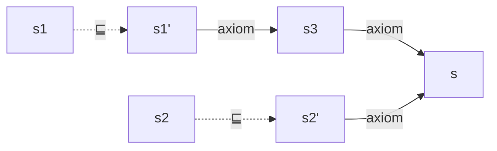
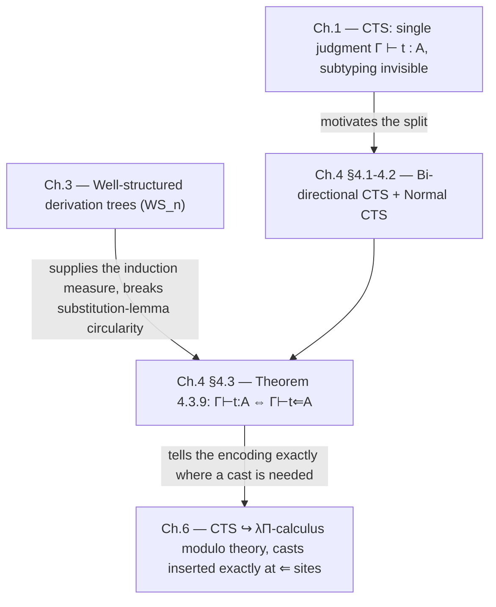

[[book-guidelines|↩ Back to guidelines]]

# Bi-Directional Type Systems

## The problem: a judgment that hides its own history

Chapter 1 gave Cumulative Type Systems (CTS) a single typing judgment, $\Gamma \vdash_{\mathcal C} t : A$, extending Pure Type Systems with a subtyping relation $A \sqsubseteq_{\mathcal C} B$ generated by cumulativity. That judgment is *declarative*: it tells you $t$ has type $A$ in context $\Gamma$, but it doesn't tell you **how** that fact was derived. In particular, staring at $\Gamma \vdash_{\mathcal C} t : A$ you cannot tell whether the proof used subtyping at all, or where.

This is fine as long as all you want is an existence statement. It stops being fine the moment you need to *translate* that derivation into another system, which is exactly the thesis's next move: Chapter 6 embeds CTS into the $\lambda\Pi$-calculus modulo theory. The $\lambda\Pi$-calculus modulo theory has a **type uniqueness** property (the same theorem holds for ordinary PTS, Theorem 1.7.12): if a term has two types, those two types must be convertible — equal up to $\beta\eta\delta$-reduction, no room for "one is a subtype of the other." CTS deliberately breaks this: a term $t$ can inhabit a sort $s$ *and* a strictly larger sort $s'$ with $s \sqsubseteq s'$, and no convertibility relates $s$ and $s'$ in general. So encoding $\Gamma \vdash_{\mathcal C} t : A$ into a type-unique target requires inserting an explicit **cast** term wherever subtyping was used — and the plain judgment doesn't say where that is. That information only lives in the *derivation tree*.

Thiré notes two ways to recover it: (1) make the translation a function *from derivation trees* to $\lambda\Pi$ judgments, so the cast-insertion points come along with the proof object, or (2) redesign the type system itself so that the judgment's syntax makes subtyping's use-sites explicit. Thiré picks a version of (1) for the actual encoding (Chapter 6, following Ali Assaf's approach), but doing so safely requires exactly the machinery this chapter builds: a *bi-directional* presentation of CTS, in which every judgment already says whether it is an inference step or a checking (and therefore possibly subtyping) step.

**What breaks without this distinction:** without a syntactic marker for "subtyping happened here," a soundness proof for the CTS-to-$\lambda\Pi$ translation has to reason globally about the whole derivation tree to find cast sites, rather than locally, rule by rule. Bi-directional CTS turns "where do I need a cast?" from a global search into a local pattern match on the last rule used.

## Two judgments instead of one

**Definition 4.1.1 (Bi-directional typing of CTS).** The single judgment $\Gamma \vdash_{\mathcal C} t : A$ is split into:

- an **inference** judgment $\Gamma \vdash_{\mathcal C} t \Rightarrow A$ — "type $A$ is *inferred* from term $t$ in context $\Gamma$" — and
- a **checking** judgment $\Gamma \vdash_{\mathcal C} t \Leftarrow A$ — "term $t$ is *checked* against type $A$ in context $\Gamma$."

The discipline is: **subtyping fires only inside a checking judgment.** You infer a type for a subterm bottom-up wherever the syntax lets you (variables, sorts, products, applications, and — importantly — abstractions, since $\lambda$ carries no type annotation to check against on its own); you check a term against an expected type only at controlled points — the end of a top-level proof, and at each argument position of an application. This is a close cousin of the bidirectional typing tradition (Pierce & Turner, cited as `[PT00]`), with one twist: in the usual literature, bidirectional typing is introduced to control *conversion* — deciding when to fire $\beta$-equality checks. Here it's used to control **subtyping** instead; the ordinary conversion rule stays in the system for simplicity (rules `C≡⇒` and `C≡⇒s` below), which is also why, unlike the textbook picture, $\Gamma \vdash_{\mathcal C} t \Rightarrow A$ is *not* a function of $\Gamma$ and $t$ — a term can still infer to several convertible types.

(Thiré also flags that this reformulates a system Ali Assaf called "minimal CTS," tied to a semantic property of the specification; Thiré prefers "bi-directional" because the presentation is closer to syntax, in Pierce's sense.)

### The rules (Figure 4.1)

Concretely, the eleven rules are:

$$
\dfrac{}{\varnothing \vdash_{\mathcal C} \Rightarrow \mathrm{wf}} \; {\small C_\varnothing^{\Rightarrow wf}}
\qquad
\dfrac{\Gamma \vdash_{\mathcal C} A \Rightarrow s \quad x \notin \Gamma}{\Gamma, x{:}A \vdash_{\mathcal C} \Rightarrow \mathrm{wf}} \; {\small C_{var}^{\Rightarrow wf}}
$$

$$
\dfrac{\Gamma \vdash_{\mathcal C} \Rightarrow \mathrm{wf} \quad (x{:}A) \in \Gamma}{\Gamma \vdash_{\mathcal C} x \Rightarrow A} \; {\small C_{var}^{\Rightarrow}}
\qquad
\dfrac{\Gamma \vdash_{\mathcal C} \Rightarrow \mathrm{wf} \quad (s_1,s_2) \in \mathcal A}{\Gamma \vdash_{\mathcal C} s_1 \Rightarrow s_2} \; {\small C_{sort}^{\Rightarrow}}
$$

$$
\dfrac{\Gamma \vdash_{\mathcal C} A \Rightarrow s_1 \quad \Gamma, x{:}A \vdash_{\mathcal C} B \Rightarrow s_2 \quad (s_1,s_2,s_3) \in \mathcal R}{\Gamma \vdash_{\mathcal C} (x{:}A) \to B \Rightarrow s_3} \; {\small C_\Pi^{\Rightarrow}}
$$

$$
\dfrac{\Gamma, x{:}A \vdash_{\mathcal C} M \Rightarrow B \quad \Gamma \vdash_{\mathcal C} (x{:}A)\to B \Rightarrow s}{\Gamma \vdash_{\mathcal C} \lambda x{:}A.\,M \Rightarrow (x{:}A)\to B} \; {\small C_\lambda^{\Rightarrow}}
\qquad
\dfrac{\Gamma \vdash_{\mathcal C} M \Rightarrow (x{:}A)\to B \quad \Gamma \vdash_{\mathcal C} N \Leftarrow A}{\Gamma \vdash_{\mathcal C} M\,N \Rightarrow B\{x \leftarrow N\}} \; {\small C_{app}^{\Rightarrow}}
$$

$$
\dfrac{\Gamma \vdash_{\mathcal C} M \Rightarrow A \quad \Gamma \vdash_{\mathcal C} B \Rightarrow s \quad A \equiv_\beta B}{\Gamma \vdash_{\mathcal C} M \Rightarrow B} \; {\small C_{\equiv}^{\Rightarrow}}
\qquad
\dfrac{\Gamma \vdash_{\mathcal C} M \Rightarrow A \quad A \equiv_\beta s}{\Gamma \vdash_{\mathcal C} M \Rightarrow s} \; {\small C_{\equiv s}^{\Rightarrow}}
$$

$$
\dfrac{\Gamma \vdash_{\mathcal C} M \Rightarrow A \quad \Gamma \vdash_{\mathcal C} B \Rightarrow s \quad A \sqsubseteq_{\mathcal C} B}{\Gamma \vdash_{\mathcal C} M \Leftarrow B} \; {\small C^{\Leftarrow}}
\qquad
\dfrac{\Gamma \vdash_{\mathcal C} M \Rightarrow A \quad A \sqsubseteq_{\mathcal C} s}{\Gamma \vdash_{\mathcal C} M \Leftarrow s} \; {\small C_s^{\Leftarrow}}
$$

Notice exactly two rules mention $\sqsubseteq_{\mathcal C}$ — `C⇐` and `Cs⇐` — and both are checking rules. Every other rule only ever propagates $\equiv_\beta$ (definitional equality), never subtyping. That is the entire point of the split: subtyping is now syntactically confined to two rules instead of being smeared invisibly across an arbitrary derivation.

The chapter's stated goal is an equivalence: $\Gamma \vdash_{\mathcal C} t : A \iff \Gamma \vdash_{\mathcal C} t \Leftarrow A$. One direction — bi-directional implies ordinary — is a routine induction, since the bi-directional system is literally a syntactic restriction of ordinary CTS typing (this is **Lemma 4.3.1**, "bi-directional typing soundness," proved by trivial induction on the derivation). The hard direction is the other way: showing that ordinary CTS typing can always be *replayed* in bi-directional form, i.e. that restricting subtyping's use-sites loses no derivable judgments.

### A subtlety the naive proof runs into

Before getting to the equivalence, Thiré flags a genuine trap (worth dwelling on, because it's a good illustration of why "obviously true" bidirectional presentations can hide broken metatheory): a direct attempt to prove the **substitution lemma** for bi-directional CTS — if $\Gamma \vdash_{\mathcal C} N \Leftarrow A$ and $\Gamma, x{:}A, \Gamma' \vdash_{\mathcal C} \lambda x{:}B.\,t \Rightarrow (x{:}B)\to C$ then the substituted term still bi-directionally checks — runs into a circularity: proving it for the abstraction case needs *subject reduction* for the bi-directional system, but subject reduction itself needs the substitution lemma. (Thiré notes this circular gap is already latent in Assaf's original thesis.) The fix is not a cleverer induction on the bi-directional system alone — it's to borrow **well-structured derivation trees**, the tool built in Chapter 3 for exactly this kind of well-founded induction. That's why this chapter is positioned right after that one: bi-directional CTS is the first place the well-structuredness machinery gets put to real use.

## Not every specification cooperates: normal CTS

Restricting subtyping to checking-time application arguments is a strong claim — it says you can always *postpone* a subtyping step until you hit an application (or a top-level check), no matter how deep in the term it originated. That's false for arbitrary CTS specifications.

**Example 4.1.** Take a specification $\mathcal G$ with sorts wired up like this (an arrow $a \to b$ meaning $(a,b)\in\mathcal A$, i.e. $a$ has type $b$; a double-line meaning cumulativity $\sqsubseteq$):



Here the ordinary judgment $Y{:}s_2 \vdash_{\mathcal G} \lambda x{:}s_1.\,Y : s_1 \to s_2'$ is derivable (typing $Y$ at $s_2$, subtyping it up to $s_2'$, then abstracting). But the corresponding checking judgment $Y{:}s_2 \vdash_{\mathcal G} \lambda x{:}s_1.\,Y \Leftarrow s_1 \to s_2'$ is **not** derivable: the subtyping step $s_2 \sqsubseteq s_2'$ has to happen on $Y$'s *own* sort before you can even give $Y$ a type at all — you can't postpone it to the application/checking site because it's needed just to type $s_2'$ itself as a *classifier* (a top-sort that itself needs a type $s$, but only reachable via a sort below it in $\sqsubseteq$).

To rule this out, **Definition 4.2.1 (CTS in normal form)** imposes two closure conditions on a specification's axioms $\mathcal A_{\mathcal C}$, rules $\mathcal R_{\mathcal C}$, and cumulativity $\sqsubseteq_{\mathcal C}^*$:

$$
\text{(NF}_A\text{)}\quad \forall (t_a,t_b)\in\mathcal A_{\mathcal C},\ (s_a,t_a)\in{\sqsubseteq_{\mathcal C}^*},\ \exists s_b,\ (s_a,s_b)\in\mathcal A_{\mathcal C} \wedge (s_b,t_b)\in{\sqsubseteq_{\mathcal C}^*}
$$

$$
\text{(NF}_R\text{)}\quad \forall (t_1,t_2,t_3)\in\mathcal R_{\mathcal C},\ (s_a,t_a)\in{\sqsubseteq_{\mathcal C}^*},\ (s_b,t_b)\in{\sqsubseteq_{\mathcal C}^*},\ \exists s_c,\ (s_a,s_b,s_c)\in\mathcal R_{\mathcal C} \wedge (s_c,t_c)\in{\sqsubseteq_{\mathcal C}^*}
$$

Read informally: (NF$_A$) says "if a sort $t_a$ below $t_b$ is reachable by subtyping from $s_a$, there must already be a *direct* axiom taking $s_a$ to some $s_b$ that itself subtypes up to $t_b$" — i.e. you can always slide the subtyping step to happen *after* an axiom instead of needing it *before*. (NF$_R$) says the same for products: given subtyping-related premises $s_a \sqsubseteq^* t_a$, $s_b \sqsubseteq^* t_b$ feeding a product rule at $(t_1,t_2,t_3)$, there's already a *direct* product rule at $(s_a,s_b,s_c)$ whose conclusion sort $s_c$ subtypes up to $t_3$. Both conditions are exactly what's needed to push a subtyping step down under an abstraction/application boundary instead of needing it to fire early, mid-term.

The example is refined twice to build intuition for why both conditions are independently necessary:

- **Example 4.2** ($\mathcal G_1$) adds enough structure to satisfy (NF$_R$) alone — still not enough; the target judgment remains underivable because $s_2$ still needs a *direct* axiom to some sort at or above $s_1 \to s_2'$'s classifying level.
- **Example 4.3** ($\mathcal G_2$) adds the missing piece so *both* conditions hold — and now $Y{:}s_2 \vdash_{\mathcal G_2} \lambda x{:}s_1.\,Y \Leftarrow s_1 \to s_2'$ **is** derivable.

Thiré states (**Conjecture 12**) that every CTS is *weakly equivalent* (in the sense of Chapter 2's embedding theory) to some CTS in normal form, with a three-step proof sketch chaining Chapter 2's functionalization/injectivization theorems, but flags that iterating those steps to reach a genuine fixpoint is not fully nailed down — it's left as future work, not a closed theorem. Practically, though, the chapter notes that the concrete CTS specifications used for Coq, Lean, Matita, and Agda (Chapter 1, §1.5) all happen to already be normal — this isn't a pathological corner case, it's the generic situation for real proof assistants.

## The equivalence proof: leaning on well-structuredness

With normal CTS pinned down, Thiré proves the hard direction of the equivalence — every ordinary CTS derivation replays as a bi-directional one — using the well-structured derivation trees ($WS_n$) from Chapter 3, by induction on the well-structuredness *level* $n$.

**Definition 4.3.1 (EBI).** The statement "equivalence holds at level $n$," $EBI_n$, packages four implications together:
- if $WS_n(\Gamma \vdash_{\mathcal C} t : A)$ then $\Gamma \vdash_{\mathcal C} t \Leftarrow A$;
- if $WS_n(\Gamma \vdash_{\mathcal C} \mathrm{wf})$ then $\Gamma \vdash_{\mathcal C} \Rightarrow \mathrm{wf}$;
- if $\Gamma \vdash_{\mathcal C} t \Leftarrow A$ then $\Gamma \vdash_{\mathcal C} t : A$ (the easy direction, structural);
- if $\Gamma \vdash_{\mathcal C} \Rightarrow \mathrm{wf}$ then $\Gamma \vdash_{\mathcal C} \mathrm{wf}$ (also easy).

$EBI$ is "$EBI_n$ for all $n$." The proof structure is a **level-indexed induction**, exactly mirroring Chapter 3's pattern: assume $EBI_n$, and use subject reduction *at level $n$* to establish the hard direction *at level $n+1$*.

The chain of lemmas doing the real work:

- **Lemma 4.3.2 (check-to-infer):** if $\Gamma \vdash_{\mathcal C} t \Leftarrow C$ then some $A$ exists with $\Gamma \vdash_{\mathcal C} t \Rightarrow A$ and $A \sqsubseteq_{\mathcal C} C$ — every checking judgment is backed by an inferred type that subtypes into the checked one. (Immediate: the last rule used to derive a checking judgment is always `C⇐` or `Cs⇐`, both of which have an inference premise.)
- **Lemmas 4.3.3–4.3.5 (inversion):** sort, product, and "sort check" inversion lemmas — mechanically identical to their ordinary-CTS counterparts, just restated for the bidirectional rule set.
- **Lemma 4.3.6** is the linchpin: assuming $EBI_n$, for a *normal* CTS, if $WS_n(\Gamma \vdash_{\mathcal C} B : s)$ and $A \sqsubseteq_{\mathcal C} B$, then there's a term $A'$ with $\Gamma \vdash_{\mathcal C} A' \Rightarrow s'$, $A \twoheadrightarrow_\beta A'$, and $s' \sqsubseteq_{\mathcal C} s$. In words: *any* subtyping relationship into a well-structured, well-sorted type can be re-derived by first $\beta$-reducing and then applying a single inference step that lands sort-below the original — this is precisely where (NF$_A$) and (NF$_R$) get used, to guarantee the "direct axiom/rule" that lets the subtyping step collapse to one inference. The proof itself case-splits on the shape of the underlying "raw" subtyping relation $\sqsubseteq_{\mathcal C}^-$ (Lemma 1.7.16's transitivity-free reformulation of $\sqsubseteq_{\mathcal C}$): reflexivity/conversion, sort-axiom steps, and product congruence — each case using confluence of $\beta$ and subject reduction at the *lower* well-structuredness level to bootstrap the induction.
- **Lemma 4.3.7** applies 4.3.6 to the two rule shapes that actually need it — the **product** case ($C_\Pi$) and the **abstraction** case ($C_\lambda$) — since these are the only two ordinary-CTS rules whose bidirectional counterparts have to *manufacture* a checking judgment for a subterm that ordinary CTS didn't need to check. Every other case (variables, applications, sorts, conversion) goes through by a direct induction hypothesis. This is where (NF$_R$) is invoked explicitly to combine two "checked-then-reinferred" sorts into a single new inferred product sort.
- The chapter's main result, stated but proved via exactly this machinery, is **Theorem 4.3.9**: for a *normal* CTS and a *well-structured* derivation tree, $\Gamma \vdash_{\mathcal C} t : A \iff \Gamma \vdash_{\mathcal C} t \Leftarrow A$.

Two hypotheses are doing indispensable work here, and it's worth being explicit that neither is free: **normality** (so subtyping can always be pushed down to a checking site) and **well-structuredness** (so the induction has a well-founded measure compatible with $\beta$-reduction, avoiding the substitution-lemma circularity flagged in §4.1). Drop either one and the equivalence theorem's proof — not just its statement — breaks down at a specific step (NF$_R$ in Lemma 4.3.7's product case; well-structuredness in the base case of Lemma 4.3.6's induction).

## Grounding: this is what a real bidirectional type checker looks like

If you've ever implemented a type checker with two entry points — one that computes a type, one that verifies against an expected type — you've already implemented the shape of this chapter. Here's the Rust skeleton that mirrors rules `Cvar⇒`/`Csort⇒`/`CΠ⇒`/`Cλ⇒`/`Capp⇒` (inference) and `C⇐`/`Cs⇐` (checking):

```rust
enum Term {
    Var(String),
    Sort(SortId),
    Pi(String, Box<Term>, Box<Term>),   // (x:A) -> B
    Lam(String, Box<Term>, Box<Term>),  // λx:A. M
    App(Box<Term>, Box<Term>),
}

// Γ ⊢ t ⇒ A : synthesize (infer) a type for `t`.
fn infer(ctx: &Context, t: &Term) -> Result<Term, TypeError> {
    match t {
        Term::Var(x) => ctx.lookup(x),                       // C_var⇒
        Term::Sort(s) => ctx.axiom(*s),                      // C_sort⇒
        Term::Pi(x, a, b) => {
            let s1 = infer(ctx, a)?.expect_sort()?;
            let s2 = infer(&ctx.extend(x, a), b)?.expect_sort()?;
            ctx.rule(s1, s2)                                  // C_Π⇒
        }
        Term::Lam(x, a, body) => {
            let b = infer(&ctx.extend(x, a), body)?;
            Ok(Term::Pi(x.clone(), a.clone(), Box::new(b)))   // C_λ⇒
        }
        Term::App(m, n) => {
            let (x, a, b) = infer(ctx, m)?.expect_pi()?;
            check(ctx, n, &a)?;                               // subtyping fires HERE, not above
            Ok(b.substitute(&x, n))                           // C_app⇒
        }
    }
}

// Γ ⊢ t ⇐ A : verify `t` against an expected type `expected`.
fn check(ctx: &Context, t: &Term, expected: &Term) -> Result<(), TypeError> {
    let inferred = infer(ctx, t)?;
    if ctx.is_subtype(&inferred, expected) {                 // C⇐ / Cs⇐ — the ONLY subtyping call site
        Ok(())
    } else {
        Err(TypeError::Mismatch { expected: expected.clone(), found: inferred })
    }
}
```

The whole point of the chapter is architecturally visible in this snippet: `is_subtype` is called from exactly one place — inside `check`, right where an argument meets a parameter — never inside `infer`. That's `NF_A`/`NF_R` normality made operational: it's only *safe* to confine subtyping to that one call site because the specification guarantees the check can always be discharged there instead of somewhere deeper in the term. A specification like $\mathcal G$ from Example 4.1, if you tried to implement its checker this way, would reject terms a *sound* type checker should accept — you'd need to sneak a subtyping call into `infer` for sorts, which is exactly the bug normality rules out.

This is also, almost verbatim, the shape of **Lean's elaborator**: `Lean.Meta.inferType` is the `infer` half, and `Lean.Meta.isDefEq`-gated elaboration with an `expectedType?` argument is the `check` half — Lean's elaborator dispatches on "do I have an expected type for this subterm or not" exactly the way `C_lam⇒` vs. `C⇐` do here. Where CTS's bidirectional split controls *subtyping*, Lean's controls a richer relation (definitional equality up to unification, including metavariable assignment) — but the architectural reason for the split is identical: an untyped $\lambda$ (or an elaboration hole) has no type to check *against* unless the surrounding context hands one down, so `infer`/`Lam` must synthesize, while argument positions and top-level goals *check*. If you're building the elaborator described in this vault's learning goals — one that resolves implicit arguments via Miller-pattern-style metavariable unification — this chapter is the minimal skeleton that elaborator's mode-dispatch logic will sit on top of: replace `is_subtype` with `isDefEq`-plus-unification, and `infer`/`check` become `elabInferType`/`elabCheckType`.

## Where this leads



This chapter is a hinge, not an endpoint. It exists purely to make Chapter 6's encoding function well-defined: once every checking judgment $\Gamma \vdash_{\mathcal C} t \Leftarrow A$ marks a syntactic cast site, the encoding into $\lambda\Pi$-calculus modulo theory can insert its `cast` term exactly there (Chapter 6, §6.1) instead of needing a global analysis of the derivation tree. The chapter also closes by conjecturing that the system could be tightened further into a fully **syntax-directed** type system (no leftover `C≡⇒`/`C≡⇒s` rules) — a refinement Thiré leaves open, listed again in the Chapter 13 future-work recap.

For the standing project in this vault, this is the cleanest worked instance in the whole thesis of **bidirectional typing as an architectural discipline** (the `type-theory` focus area's recurring thread): a mode split (infer vs. check) introduced not for pedagogical clarity but to make a *soundness proof* tractable by localizing where a semantically important relation — subtyping here, definitional equality/unification in an elaborator — is allowed to fire. The dependence on well-structured derivation trees (Chapter 3) to escape the substitution-lemma circularity is also a pattern worth remembering: any bidirectional presentation of a system with non-trivial equality/subtyping is liable to hit the same "subject reduction needs substitution needs subject reduction" trap, and needs an external well-founded measure to break it.
