[[book-guidelines|↩ Back to guidelines]]

# Case Study: Matita's Arithmetic Library to STT∀

## Why the theory needs a stress test

Every earlier chapter has been building toward a claim that sounds almost too clean: any Cumulative Type System can be soundly, conservatively embedded into $\lambda\Pi$-calculus modulo theory (Chapter 6), that embedding is decidably checkable once you have a convergent rewrite system (Chapter 8), Dkmeta can rewrite over that encoding as a meta-programming layer (Chapter 9), and Universo can automatically discharge the leftover universe-level side conditions with an SMT solver (Chapter 10). Each of those results is proven on paper, on small, well-behaved fragments.

**What breaks without a real case study:** a pipeline validated only on toy examples tells you nothing about where it actually jams — the friction always shows up in scale and in the features real libraries use that the theory quietly assumed away. Chapter 11 is Thiré's answer to "does this actually work?" — not a proof, but an engineering demonstration: take roughly 300 lemmas from Matita's arithmetic library, culminating in a genuine, nontrivial theorem (Fermat's little theorem), and push the whole thing through the pipeline by hand-plus-tooling. If this case study needs unprincipled hacks to succeed, that's a strong signal the theory has gaps; if it succeeds using only the tools already built, that's real evidence of the thesis's central claim — that structurally similar logics really can share proofs mechanically.

The target logic is **STT∀** (Chapter 7's constructive Simple Type Theory with prenex polymorphism) because it's the thesis's designated *lingua franca* — the one logic every Higher-Order-Logic-family system (Coq, Lean, Matita, PVS, OpenTheory) can receive a proof from (explored next, in Chapter 12). Matita's logic is the **Calculus of Inductive Constructions (CIC)** — a dependently-typed logic strictly more expressive than STT∀. So this case study isn't a same-logic transport; it's a genuine *downward* translation, from a rich dependent type theory into a weaker, prenex-polymorphic, non-dependent one. That's exactly the hard direction: information (dependent types, universe polymorphism) has to be shown *not actually needed* by this specific proof, then mechanically stripped.

## The three-step architecture, and where this chapter sits

The full Matita → STT∀ → (Coq/Lean/PVS/...) journey has three stages, and it's worth being precise about which one this chapter covers, because each stage reuses a different tool from earlier chapters:

1. **Matita → Dedukti.** An external tool called **Krajono** (built by Ali Assaf, extended for this thesis) implements the CTS-to-$\lambda\Pi$-modulo encoding of Chapter 6 concretely, turning Matita source into a Dedukti signature.
2. **Matita-in-Dedukti → STT∀-in-Dedukti.** This is the chapter's actual subject. It *cannot* be done by Universo alone, because Matita's CIC has inductive types and recursive functions — features outside the pure-CTS fragment Universo was designed to handle (Chapter 10 only decides universe-level embeddings for CTS judgments).
3. **STT∀-in-Dedukti → Coq/Lean/PVS/OpenTheory.** Deferred to Chapter 12 (Logipedia).

So think of stage 2 as a small **compiler pipeline with several passes**, each pass surgically removing one feature that STT∀ doesn't have. That framing — compiler passes, not one big transformation — is the chapter's own analogy, and it's the right one: each step below is a self-contained tool with its own configuration file, chained together the way you'd chain `rustc` passes or LLVM transformation passes.

```mermaid
flowchart LR
  M["Matita source<br/>(CIC, ~300 lemmas)"] -->|Krajono| D0["Dedukti<br/>(Matita's CIC encoding)"]
  D0 -->|"Dkprune<br/>(§11.2)"| D1["Dedukti<br/>(pruned to Fermat's dependencies)"]
  D1 -->|"Universo<br/>(§11.3)"| D2["Dedukti<br/>(sorts fixed to STT∀ + deps)"]
  D2 -->|"Dkpsuler<br/>(§11.4)"| D3["Dedukti<br/>(match/filter monomorphized)"]
  D3 -->|"Dkmeta, ltyped quoting<br/>(§11.5)"| D4["Dedukti<br/>(spurious deps removed)"]
  D4 -->|"axiomatize/remove rewrite rules<br/>(§11.6, manual)"| D5["Dedukti<br/>(pure STT∀ encoding)"]
  D5 -.->|"Ch. 12: Logipedia"| Exp["Coq / Lean / PVS / OpenTheory"]
```



## Fermat's little theorem: the informal proof and why it's a good benchmark

The theorem being proved, in the form the thesis actually formalizes:

**Theorem (Fermat's little theorem).** For all prime $p$ and natural number $a$, if $p$ does not divide $a$, then $a^{p-1} \equiv 1 \pmod p$.

The sketch runs through a product identity. Starting from
$$(p-1)! \times a^{p-1} = \prod_{i=0}^{p-1} i \times a$$
and using that $p$ is prime and doesn't divide $a$ to get
$$\prod_{i=0}^{p-1} (i \times a) \equiv \prod_{i=0}^{p-1} i \pmod p$$
(a permutation argument: multiplying $\{0, \ldots, p-1\}$ by $a$ modulo $p$ just permutes the residues), the two chains combine to $(p-1)! \times a^{p-1} \equiv (p-1)! \pmod p$, and cancelling $(p-1)!$ (justified by Euclid's lemma, since $p$ is prime and doesn't divide $(p-1)!$) leaves $a^{p-1} \equiv 1 \pmod p$.

Notice what this proof *needs*: products (big operators, $\prod$), factorial, congruence, and a permutation argument. None of that is exotic — but Matita's arithmetic library, imported originally from Coq's, wasn't designed around this one theorem, so these notions arrive wrapped in general machinery the library needed for other purposes. That gap between "what the theorem needs" and "what the library's general infrastructure looks like" is precisely where the translation difficulty lives.

The library itself is organized in three directories — `basics` (17 files: shared definitions, Leibniz equality as an inductive type, booleans, connectives), `arithmetics` (26 files: the core arithmetic development), and `arithmetics/chebyshev` (6 files: Chebyshev polynomials and Bertrand's theorem, unrelated to Fermat). Only `basics` and `arithmetics` are actually needed; Fermat's little theorem is named `congruent_exp_pred_SO` in the library. Rather than hand-select which files matter before importing, Thiré imports *all* of `basics` and `arithmetics` into Dedukti and prunes afterward — because pruning is itself part of the interoperability story (Section 11.2), not overhead to avoid.

## Three obstacles, and why none of them is really about the theorem

The chapter identifies exactly three reasons the Matita proof can't be exported to Higher-Order Logic as-is. It's worth internalizing that **all three are accidents of how the library encodes general-purpose machinery, not properties of Fermat's little theorem itself** — this is the chapter's real lesson about interoperability: the gap between two logics is rarely about the mathematics, it's about encoding artifacts.

**Obstacle 1 — non-prenex `bigops` polymorphism.** The library defines $\prod$ (and $\sum$) as an instance of a general `bigops` operator, polymorphic over the type it ranges over. But STT∀ only has **prenex polymorphism** (Chapter 7) — a type quantifier must appear as an outermost prefix, not nested inside the argument structure — and `bigops`'s first argument is a natural number, with the type parameter appearing *after* it. Since the later arguments don't actually depend on this type, it could in principle be moved to the front to make the definition prenex-polymorphic. Thiré explicitly punts on this one for this chapter — "we will not tackle the first problem and will assume that the original definition of bigops is in fact in STT∀" — flagging it as future work (permuting argument order automatically inside Dedukti, discussed in Section 11.7).

**Obstacle 2 — universe-polymorphic `match`.** Recall from Chapter 8's inductive-type encoding: destructing an inductive type in Dedukti goes through a constant `match` that is universe polymorphic (quantified over a sort variable), because the same destructor must serve both propositions and types. For the type `N` of natural numbers, its type is
$$(s : S) \to (P : N \to s) \to P\,0 \to ((x:N) \to P\,(n+1)) \to (z:N) \to P\,z$$
— note the quantification over sort $s$. In the library this constant is instantiated with $s = \star$ (`cic.star`, for propositions) in some places and $s = \square$ (`cic.box`, for types) in others; the type-level instantiation is exactly what forces a dependent type into existence. STT∀ can *state* this induction principle, but can't use it to *define new objects*, because doing so needs the dependent type $s$ ranges over — which STT∀ doesn't have.

**Obstacle 3 — spurious dependent types.** Even where the induction principle is used, the dependency on the motive `P` is often never actually exploited. The chapter's own minimal illustration: type-checking $N : \star \vdash_{\mathcal C} \lambda x{:}N.\ N : (x{:}N)\to \star$ genuinely requires a dependent function type — but because $x$ doesn't occur free in the body, the *equivalent*, dependency-free judgment $N:\star \vdash_{\mathcal C} N : \star$ would do just as well. The dependent type here is real in the encoding but semantically inert.

## Step 1: Pruning with Dkprune (Section 11.2)

**What breaks without pruning:** translating all ~300+ imported lemmas (plus everything transitively reachable in `basics`/`arithmetics`) when only a fraction is needed for Fermat wastes work at every downstream step — Universo's SMT constraints, Dkpsuler's duplication, Dkmeta's rewriting all scale with library size.

**Dkprune** is a small (~200 line) OCaml tool. Its input is a Dedukti *configuration file* — a Dedukti source file that can declare a sequence of identifiers (each prefixed `#GDT`) or module names (`#REQUIRE`) — and a directory holding a Dedukti library. Dkprune computes the **transitive dependency closure** ("down-closure": everything the target depends on, not everything that depends on the target) of every name listed in the configuration file, and emits only those files to an output directory. For Fermat, the configuration file is one line:

```
#GDT matita_arithmetics_fermat_little_theorem.congruent_exp_pred_SO.
```

(Dedukti's namespace mechanism is flat — it doesn't preserve Matita's directory hierarchy, so folder names get folded into the generated identifier prefix.) The result is a minimal, self-contained slice of the library containing exactly what's needed to state and prove Fermat's little theorem.

This is conceptually the same operation a Rust build does with dead-code elimination or a linker does with `--gc-sections`: compute a reachability closure over a dependency graph and discard everything outside it. The load-bearing detail is that "dependency" here means **type-checking dependency** inside a term-rewriting encoding, which is a strictly richer notion of "reachable" than a simple import graph — a symbol can depend on another purely through a rewrite rule's right-hand side.

## Step 2: Universo, targeting STT∀ (Section 11.3)

This step reuses Chapter 10's Universo pipeline (elaborate sorts to variables → generate the free CTS as constraints → solve with Z3 → reconstruct), but adapted with two wrinkles specific to going *to* STT∀ from a CIC-derived encoding.

**The completeness wrinkle.** Chapter 2's judgment-embedding decision procedure was already known to be *incomplete* (Section 2.4) — some genuinely embeddable judgments aren't found because some casts implicit in the source derivation are missing from the target's rule set. Concretely here: STT∀'s specification needs an extra derivable rule added,
$$\mathtt{cic.Rule\ cic.box\ cic.box\ cic.diamond} \longrightarrow \mathtt{cic.true}$$
which is derivable in STT∀ in principle (because $(\square,\lozenge)\in C_{\mathrm{STT}\forall}$ and $(\square,\square,\square)\in R_{\mathrm{STT}\forall}$) but only becomes *needed in practice* once explicit casts are present — the abstract derivability isn't automatically visible to the free-CTS constraint generator. Symmetrically, since every type operator in this specification has arity 0, the rule for [[STT-A-Constructive-Higher-Order-Logic#Type operators|type operators]] — and the sort $\circ$ it would need — can simply be dropped from the specification used here, a specialization of the general STT∀ CTS to what this particular library actually uses.

**The `match`/`filter` wrinkle, and a genuine design decision.** The universe-polymorphic `match` constant (Obstacle 2) is, in principle, something you could eliminate *before* running Universo, by manually instantiating it at each of its two possible sorts ($\star$ and $\square$) first. Thiré argues this is the wrong order, and the reasoning is worth internalizing as a general interoperability heuristic: **universe polymorphism gives Universo more flexibility, not less** — removing it early is equivalent to forcing more sort-variables in the free CTS (Definition 2.3.3) to be *syntactically equal* to each other before the solver ever sees the constraint problem, which only shrinks Universo's search space and can turn a solvable instance into an unsatisfiable one. Since `match`'s type isn't itself expressed inside the CTS encoding (it's already in reduced form), Universo doesn't even see this implicit dependent type as a term to worry about — so there's no configuration-file cost to deferring the instantiation. Order matters here in exactly the way it matters when a compiler chooses which optimization pass to run first: an early, over-eager normalization can foreclose choices a later pass would have needed.

The Universo configuration file for this run (elaboration/output/constraints/solver sections, per Chapter 10's four-part schema) fixes `nat`, `bool`, and `list` at the universe level just above the base ($\mathtt{cic.enum\ (cic.usucc\ cic.uzero)}$, i.e. one level up, cumulative with a free variable above it), routes solving through Z3's QF_UF logic with union-find preprocessing, and adds the derived rule above to the specification handed to the solver.

## Step 3: Dkpsuler — removing `match`'s universe polymorphism (Section 11.4)

Now that Universo has fixed concrete universe levels for the *data* in the library, the universe-*polymorphic* destructor constants (`match`, `filter`) still need to be split into concrete, sort-specific variants — because the specification given to Universo maintains the invariant that these constants are only ever applied at $\star$ or $\square$.

**Dkpsuler** is a general symbol-duplication tool: given a rewrite rule of the shape `f a --> g`, it means "wherever the pattern `f` applied to `a` occurs, replace it with a fresh symbol `g`" — and it declares `g` in the output signature with the same kind (declaration vs. definition) and type as `f a` had. It's a generic pattern-driven symbol splitter, not something specialized to `match` — the specific application here is what makes it useful for this pipeline.

The actual configuration file is auto-generated by a small bash script (Figure 11.4 in the source) that scans every module for a `def match_<name> :` declaration and, for each inductive type found, emits four Dkpsuler rules:

```
[] mod.match_ind cic.star --> mod.match_ind_star.
[] mod.match_ind cic.box   --> mod.match_ind_box.
[] mod.filter_ind cic.star --> mod.filter_ind_star.
[] mod.filter_ind cic.box   --> mod.filter_ind_box.
```

This is the mechanical realization of Obstacle 2's fix: instead of one universe-polymorphic `match_nat : (s:S) → ...`, you get two monomorphic constants `match_nat_star` and `match_nat_box`, each usable without ever quantifying over a sort. The output is post-processed with Dkmeta (to compute each fresh constant's *canonical type* — Section 9.3.2's canonical-form machinery — which is what makes any remaining dependent-type usage explicit and visible) and Dkprune again (to discard duplicated constants that end up unused, e.g. a `_box` variant nobody actually calls).

## Step 4: Removing spurious dependent types via `ltyped` quoting (Section 11.5)

This is where Obstacle 3 gets fixed, and it's the chapter's most surgical piece of engineering. The dependent types exposed by the previous step are an artifact of a **shallow encoding**: because the library's own products were encoded directly as raw Dedukti products rather than routed through the CTS encoding's `prod` constant (Chapter 8, Section 8.4.2), a use of dependent types that the CTS layer would normally track explicitly instead leaks out implicitly — invisible to Universo, but present in the term structure Dkmeta can see.

The fix rests on a clean, checkable syntactic invariant: for a product $(x{:}A)\to B$ arising from this specific encoding path (rule $(\star,\square,\square)$), check whether $x$ is free in $B$. If it never is, the dependent product is semantically just $A \to B$ with the dependency erased, and every term of that type can be rewritten to drop the dependency:

- if the inhabitant is a bare variable, its type is simply changed;
- if it's an abstraction $\lambda x{:}A.\ t$, check $x \notin \mathrm{FV}(t)$ and drop the binder;
- if an application $f\ a$ becomes ill-typed because $f$'s type was dependent, the now-unnecessary argument $a$ is simply dropped.

Chapter 9's **`ltyped` quoting function** (Section 9.2.3) is what makes this checkable as ordinary Dedukti rewriting: `ltyped` annotates every application/abstraction with enough type information (as syntactic terms Dedukti's rewrite engine *can* pattern-match against, unlike raw products or applications, which Dedukti's matcher normally can't see into) that a Dkmeta rule can be written to fire exactly on this pattern. The actual Dkmeta rules (adapted from Figure 11.5) look schematically like:

```
(; products ;)
[A,B,C] ltyped.app _ (... encoded cts.prod cts.prop cts.type cts.type cts.I ...) A
                     (cts.lam C (x => B)) --> B.

(; application ;)
[A,B,f,a] ltyped.app (cts.Term cts.type (cts.prod cts.prop cts.type cts.type cts.I A (x => B))) f a --> f.

(; abstraction ;)
[A,B,t] ltyped.lam (cts.Term cts.type (cts.prod cts.prop cts.type cts.type cts.I A (x => B))) (x => t) --> t.
```

Each rule matches one of the three cases above, expressed against the `ltyped`-quoted encoding of a product built with `cts.prod cts.prop cts.type cts.type cts.I A (x => B)`. Running this Dkmeta file over the whole library mechanically strips every spurious dependent type the encoding introduced — turning an implementation trick (a shallow, unchecked encoding of inductive-type destructors) into a solvable rewriting problem, rather than requiring a hand pass over 300 lemmas.

## Step 5: Axiomatizing inductive types and recursive functions (Section 11.6)

The final gap: even after Steps 3–4, the proofs still carry Dedukti **rewrite rules** introduced by the inductive-type and recursive-function encoding (Section 8.4.2) — but STT∀'s CTS has no mechanism to rewrite a *type*, because the head symbol of such a rewrite rule's pattern could never be well-typed inside STT∀ in the first place. So every one of these leftover rewrite rules has to be eliminated, one way or another.

The chapter gives a clean two-case argument for why this elimination is always possible without losing anything:

1. Rules whose left- and right-hand sides are typed by a **proposition**: these arise from `match` on an inductive type when the result is a proof, and the chapter observes such a rule can never actually fire on a proof term in STT∀ (a proof cannot appear as a subterm of an STT∀ term the way it can in CIC) — so it can simply be **deleted**.
2. Rules used purely for **type-checking** a proof (not literally reducing a term inside it) — these get replaced by an axiomatized **equality**, with every place the rule would have rewritten replaced instead by an explicit elimination-of-equality step.

Thiré is careful to flag this as an argument about *existence*, not a finished algorithm — "this step is on paper only," done manually for Matita's arithmetic library, with automation "currently being implemented." The claim that matters is the general one: because every leftover rewrite rule falls into one of exactly these two cases, this step is provably a **total** transformation — it always terminates with success, never gets stuck needing a rule it can't classify. The chapter draws an explicit analogy to Section 9.3.4's *rewriting traces*: removing a rewrite step and replacing it with an equality-elimination step is structurally the same operation as computing a trace of a Dkmeta computation, which is exactly the mechanism the author plans to reuse to automate this step.

## What this case study actually demonstrates

Stepping back: none of the five steps invented new theory. Every tool used — Dkprune's dependency closure, Universo's CTS-to-SMT pipeline, Dkpsuler's symbol duplication, Dkmeta's `ltyped` quoting, and the trace-computation idea behind axiomatization — was built in an earlier chapter for a different, more general purpose. What Chapter 11 demonstrates is that **chaining general-purpose tools, each addressing one specific mismatch between two logics, is enough to move a real 300-lemma proof across a genuine expressiveness gap** (dependent, universe-polymorphic CIC down to prenex-polymorphic, non-dependent STT∀) without hand-transcribing the mathematics. The three obstacles were all encoding artifacts, not mathematical obstacles — which is itself evidence for the thesis's broader claim (developed further in Chapter 13) that independently-built proof libraries look structurally similar because their underlying logics really are close, once you strip away how each system happens to encode the same ideas.

The chapter's own **Future Work** (Section 11.7) is candid about what remains: full automation of Step 5, a more principled `bigops`-polymorphism fix (Obstacle 1, punted on entirely here) via automatic argument permutation in Dedukti, and scaling concerns for both Universo's SMT step and the pipeline as a whole on much larger libraries (AFP, Mathematical Components) — plus a longer-term ambition to formalize "chain these translation steps" as a general *graph of translations* between logics, rather than the current bespoke, `make`-driven, Dedukti-expert-only workflow.

## Where this leads

This case study is the empirical payload the rest of the thesis has been building toward, and it feeds directly into Chapter 12: having a real STT∀-encoded proof (Fermat's little theorem, plus its ~300-lemma dependency closure) is the actual input Logipedia exports to Coq, Lean, Matita, PVS, and OpenTheory. It's also a direct, worked instance of two of this workbench's standing threads: the **completeness gap** in the judgment-embedding decision procedure (`type-theory`, `automated-reasoning`) shows up here not as an abstract caveat but as a concrete missing rule that had to be added by hand before Universo's constraint solver could succeed; and the **order-of-operations** insight about universe polymorphism (run Universo *before* monomorphizing `match`, because polymorphism enlarges rather than shrinks the solver's search space) is a mechanism-level lesson directly transferable to any metavariable-unification or constraint-generation pipeline (`automated-reasoning`) where premature specialization can foreclose otherwise-solvable instances — exactly the failure mode a Miller-pattern-style unifier or a CSP-based invariant generator needs to avoid.
