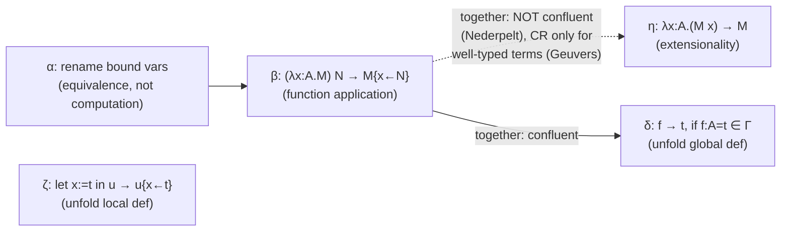
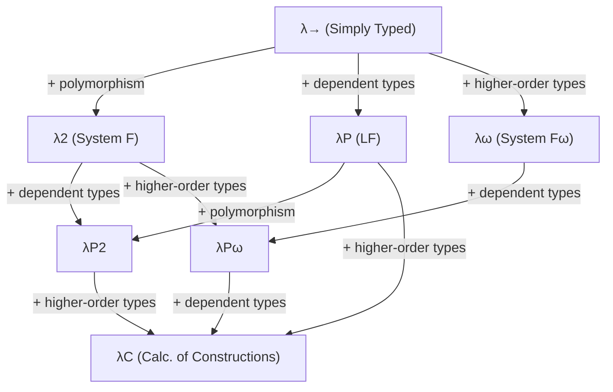
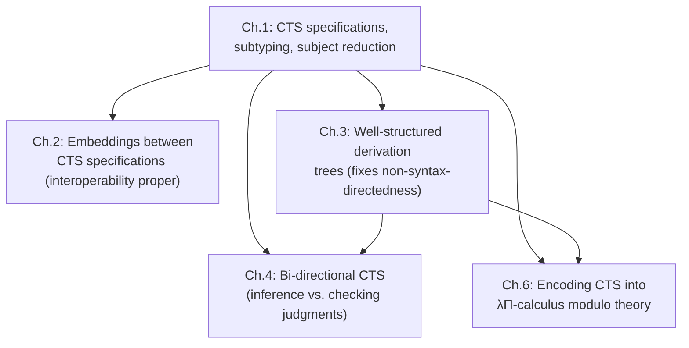

[[book-guidelines|↩ Back to guidelines]]

# Cumulative Type Systems (CTS)

## Why this chapter exists: one framework, many proof assistants

Here is the empirical puzzle that opens the thesis: Coq, Lean, Matita, and Agda are built by different teams, at different times, with different design philosophies, and yet their type theories look *strikingly alike*. Each has variables, functions, dependent products, some notion of universes, some rule about what can quantify over what. If you wanted to write a tool that moves a proof from one system to another, you'd quickly notice you're not translating between four unrelated languages — you're translating between four *parameter settings* of the same underlying machine.

That machine is the **Cumulative Type System (CTS)**, introduced by Bruno Barras and used throughout this thesis as the common meta-theoretic substrate. A CTS is not one type theory — it's a *family*, indexed by a **specification**: a small set of data (sorts, axioms, rules, cumulativity) that you plug in to get out a concrete system. Plug in the specification for the Calculus of Constructions and you get Coq's kernel (roughly). Plug in a different one and you get Agda's. This is exactly the move a compiler engineer would recognize as *parameterizing over a configuration object instead of hard-coding behavior* — and it's the reason CTS is the right vehicle for an interoperability thesis: prove a theorem once, generically over the specification, and it holds for every proof assistant that instantiates one.

Before any of that parameterization can be stated, though, the chapter has to nail down two more basic things: what a *term* looks like (syntax), and what it means for two terms to *compute to the same thing* (rewriting). Only after those are in place does the CTS specification itself get defined, followed by concrete instances (simply-typed lambda calculus, System F, LF, the Calculus of Constructions, and the real specifications behind Lean/Coq/Matita/Agda) and finally the meta-theoretic properties — chiefly subject reduction — that make the whole system trustworthy.

**What breaks without this uniform framework:** without it, "does this proof in Coq correspond to a valid proof in Lean" is not even a formalizable question — you'd be comparing two ad-hoc kernels with no shared vocabulary for what "valid" means. CTS gives you the vocabulary: a specification-indexed judgment $\Gamma \vdash_{\mathcal C} t : A$ that specializes to each system's own typing judgment.

---

## 1.1 Syntax: the shared term language

Every system in this thesis shares one grammar (Definition 1.1.1, Fig. 1.1):

$$
t, u, M, N, A, B \;::=\; x \mid s \mid M\,N \mid \lambda x{:}A.\,M \mid (x{:}A)\to B
$$

In words: a term is a **variable** $x$, a **sort** $s$ (also called a *universe* — the type of types), an **application** $M\,N$, an **abstraction** (lambda) $\lambda x{:}A.\,M$, or a **dependent product** $(x{:}A)\to B$ — read this as "for every $x$ of type $A$, produce something of type $B$," where crucially $B$ is allowed to *mention* $x$. When $x$ doesn't occur free in $B$, the book writes $A \to B$ as shorthand (Notation 2) — this is the ordinary non-dependent function type.

**Grounding.** If you've written a compiler, this is just an AST:

```rust
enum Term {
    Var(String),
    Sort(Sort),                       // s
    App(Box<Term>, Box<Term>),        // M N
    Lam(String, Box<Term>, Box<Term>),// λx:A. M
    Pi(String, Box<Term>, Box<Term>), // (x:A) → B  — dependent product
}
```

The one thing that makes this an AST for *dependent* type theory rather than a garden-variety typed lambda calculus is that `Pi`'s second field is a `Term`, not a fixed enum of primitive types — types and terms live in the same syntactic category. This single design decision is why a Rust-style `enum Type { Int, Bool, Fn(Box<Type>, Box<Type>) }` cannot represent CTS: there's no way to let a `Type` variant embed an arbitrary value the way `(x:A) → B` embeds `x` inside `B`.

In Lean, this AST is literally `Expr`: `Expr.app`, `Expr.lam`, `Expr.forallE`, `Expr.sort` are close cousins of exactly this grammar (`forallE` is Lean's own name for the dependent product former).

**Binders and $\alpha$-equivalence.** $\lambda x{:}A.\,M$ and $(x{:}A)\to B$ both *bind* $x$ — it's a local name, not observable from outside. The book treats $\lambda x.\,x$ and $\lambda y.\,y$ as literally the same term after quotienting by the relation $\equiv_\alpha$ (Definition 1.2.8), and from that point on writes plain `=` for equality-up-to-renaming (a convention this article also follows). This is precisely the problem De Bruijn indices or Higher-Order Abstract Syntax (HOAS) exist to solve in an implementation — a compiler engineer's checker never actually compares strings for variable names; it compares up to $\alpha$, usually by working with indices instead of names in the first place.

---

## 2. Rewriting: five ways a term can compute

### The general notion (§1.2.1)

A **rewriting relation** is just a relation on terms, written $t \hookrightarrow_R t'$ when it's *stable by context* — meaning if $t$ rewrites, so does any larger term containing $t$ as a subterm (Fig. 1.3 gives the congruence closure rules: rewrite under a lambda's body, under a lambda's domain, on either side of an application, on either side of a product). A term that can still be rewritten is a **redex**; a term that can't is in **normal form (NF)**. A relation is **weakly normalizing (WN)** if every term reaches *some* normal form, and **strongly normalizing (SN)** if *no* infinite rewrite sequence exists from any term — SN is strictly stronger, since WN only promises one terminating path exists, not that all paths terminate.

The property that makes rewriting well-behaved for a type checker is **confluence (Church-Rosser, CR)**: if a term $t$ can reach both $u$ and $v$ by some sequence of steps, then $u$ and $v$ can always be brought back together at some common $w$ (Definition 1.2.4). **What breaks without confluence:** a type checker that normalizes two types along different reduction strategies could get two *different* normal forms and wrongly declare them unequal — or, worse, wrongly declare unrelated types equal depending on which strategy it happened to pick. Confluence is what makes "compute the normal form and compare" a well-defined algorithm at all.

### The five relations, one at a time

**$\alpha$** — renaming of bound variables (already covered above); not really a *computation* rule, more a baseline equivalence everything else is defined modulo.

**$\beta$ (Definition 1.2.9)** — function application: $(\lambda x{:}A.\,M)\,N \hookrightarrow_\beta M\{x \leftarrow N\}$, i.e. substitute $N$ for $x$ in $M$. This is *the* computation rule; Church-Rosser for $\beta$ alone (Theorem 1.2.2) always holds, no side conditions needed.

```python
def beta_step(term):
    if isinstance(term, App) and isinstance(term.fn, Lam):
        return substitute(term.fn.body, term.fn.var, term.arg)
    return None  # not a redex
```

**$\eta$ (Definition 1.2.10)** — extensionality: $\lambda x{:}A.\,(M\,x) \hookrightarrow_\eta M$ when $x \notin FV(M)$, i.e. "a function that just re-applies $M$ to its argument *is* $M$." Here the chapter delivers its first genuine surprise, and it's exactly the kind of subtlety that matters for a from-scratch type checker: $\beta\eta$ together is **not confluent in general** (Theorem 1.2.3). The witness is Nederpelt's counterexample:

$$
\lambda x{:}N.\,x \;\overset{\beta}{\longleftarrow}\; \lambda x{:}N.\,(\lambda y{:}N{\to}N.\,y)\,x \;\overset{\eta}{\longrightarrow}\; \lambda y{:}N{\to}N.\,y
$$

The two results, $\lambda x{:}N.\,x$ (type $N \to N$) and $\lambda y{:}N{\to}N.\,y$ (type $(N{\to}N)\to(N{\to}N)$), are not joinable because $N$ and $N \to N$ are not convertible types — the counterexample only exists because the *untyped* rewriting relation is allowed to fire on a term where the two branches secretly have different types. Confluence is recovered (Theorem 1.2.4, Geuvers) once you restrict to *well-typed* terms — a striking illustration of a theme that recurs throughout this thesis: syntactic properties of an untyped relation can fail, while the *same* relation restricted to the image of a typing judgment behaves. This is one motivation, stated explicitly in the chapter's introduction, for the bi-directional typing systems of Chapter 4.

**$\delta$ (Definitions 1.2.12–1.2.13)** — global named definitions. The context is extended with entries $f : A = t$ (an entirely separate namespace $\mathcal F$ from ordinary variables, to avoid ambiguity), and $f \hookrightarrow_\delta t$ unfolds the definition. $\beta\delta$ together stays confluent (Theorem 1.2.5).

**$\zeta$ (Definitions 1.2.15–1.2.16)** — local `let`-bindings: `let (x:A) := t in u` $\hookrightarrow_\zeta u\{x \leftarrow t\}$. The book's own motivation is sharp and worth repeating: with dependent types, a local abbreviation cannot always be phased out as an ordinary $\beta$-redex (`let` is not just sugar for an immediate application), so it needs its own primitive and its own rewrite rule. This corresponds exactly to a `let`-expression in a dependently typed language like Lean, where `let x := t; u` genuinely is a distinct term former from `(fun x => u) t`, precisely because of how it interacts with unfolding during elaboration.

Real systems (Coq, Matita) combine all four computational relations ($\beta\eta\delta\zeta$), modulo $\alpha$ — but the thesis's core type system is defined with just $\beta$ (plus $\alpha$), leaving the others as implementation extensions discussed later for concrete systems.



---

## 3. CTS specifications: parameterizing the type system

Now the chapter assembles the actual object of interest.

> **Definition 1.3.1.** A CTS specification is a quadruple $\mathcal C = (S, A, R, C)$ where $S$ is a set of **sorts**, $A \subseteq S \times S$ is a relation of **axioms**, $R \subseteq S \times S \times S$ is a relation of **rules**, and $C \subseteq S \times S$ is a relation of **cumulativity**.

Read each component operationally:

- **$S$, sorts** — the "type of type" universes: `Prop`, `Type`, `Type 1`, ... .
- **$A$, axioms** — which sort types which other sort. $(s_1, s_2) \in A$ means $s_1 : s_2$ is derivable — this is what lets you write `Prop : Type` instead of hitting an infinite regress or a Russell-style paradox by making the universe hierarchy explicit and stratified.
- **$R$, rules** — the licensing condition for forming a product $(x{:}A)\to B$: given $\Gamma \vdash A : s_1$ and $\Gamma, x{:}A \vdash B : s_2$, the product itself has type $s_3$ only if $(s_1, s_2, s_3) \in R$. Different choices of $R$ are literally what distinguishes "no polymorphism" from "System F–style polymorphism" from "higher-order type constructors" — see below.
- **$C$, cumulativity** — new relative to a bare Pure Type System (PTS); this is what makes a CTS a CTS. $(s_1, s_2) \in C$ means sort $s_1$ *embeds into* sort $s_2$ (a smaller universe can always be treated as living in a bigger one). A PTS, by Definition 1.3.3, is exactly a CTS where $C = \emptyset$ — so **PTS $\subset$ CTS**, and every theorem proved about CTS specializes to PTS for free.

**What breaks without $C$:** without cumulativity, a term at universe level $37$ and a term at universe level $2$ inhabiting "the same kind of thing" are formally incompatible types, forcing you to either commit to one arbitrary universe for everything (killing polymorphism over datatypes) or duplicate every theorem at every level. Section 1.5.1 below works through exactly this pain point with a running example (monoids).

**Rust framing.** A `CtsSpec` struct is a natural checker-side representation:

```rust
struct CtsSpec<S: Eq + Hash + Clone> {
    sorts: HashSet<S>,
    axioms: HashSet<(S, S)>,           // A
    rules: HashSet<(S, S, S)>,         // R
    cumulativity: HashSet<(S, S)>,     // C
}
```

and the type checker is then generic over `CtsSpec`, exactly mirroring the thesis's claim that CTS is a parameterized family, not one theory.

The chapter names several well-behaved subclasses worth knowing because they recur as hypotheses of later theorems: **finite** ($S$ finite), **functional** ($A$, $R$ are functions, not just relations — at most one output per input), **injective** (Definition 1.3.7 — the reverse uniqueness: at most one input maps to a given output), **semi-full**/**full** (existence guarantees on $R$), and **decidable** (Definition 1.3.13 — all the relevant relations and existence-questions are decidable; this is the class that matters in practice, since without it you can't even implement a type checker).

**Top-sorts** (Definition 1.3.2) are sorts $s$ with no $(s, s') \in A$ — nothing types them. `Type` in a system without universe polymorphism is a top-sort; this detail resurfaces as a genuine wrinkle in the typing rules (§1.4.2 below).

### Predicativity and impredicativity (§1.3, "Predicativity and impredicativity")

This is one of the chapter's key semantic distinctions, and it's worth pinning down carefully because the terminology is easy to hand-wave. Informally: a sort $s$ is **impredicative** if you can manufacture an inhabitant of $s$ by quantifying over something *at least as big as* $s$ itself — i.e., a product $(s', s'', s) \in R$ exists where $s$ is not "strictly smaller" than $s'$ or $s''$ in the specification's own ordering. The book formalizes "strictly smaller" via an **ordered specification** (Definition 1.3.10, the relation $\lhd_{SS_{\mathcal C}}$ built from $A$, cumulativity, and transitivity — Fig. 1.6), and then:

> **Definition 1.3.11.** $s$ is impredicative if there exist $s', s''$ with $(s', s'', s) \in R_{\mathcal C}$ where $s \lhd_{SS_{\mathcal C}} s'$ or $s \lhd_{SS_{\mathcal C}} s''$.

Concretely: `Prop` in the Calculus of Constructions is impredicative because you can form $(A : \mathrm{Type}) \to P(A)$ — a proposition (living in `Prop`) that quantifies over `Type`, a strictly bigger sort. Contrast this with a *predicative* hierarchy (no impredicative sort exists, Definition 1.3.12), where you can only quantify over strictly smaller universes — this is the discipline Agda commits to, at the cost of losing the compact impredicative encodings available in Coq's `Prop`.

**Why it matters for consistency:** impredicativity is exactly the kind of self-reference that historically breaks logics (Russell's paradox is the prototype). The chapter later shows (§1.6) that adding *too much* impredicativity — specifically, allowing two impredicative sorts stacked in the same hierarchy — makes the whole system inconsistent (Hurkens' paradox, discussed below). So impredicativity is powerful but has to be rationed carefully; this is a genuine design-space tradeoff a from-scratch dependent type checker has to make explicitly, not an incidental detail.

---

## 4. Typing: subtyping first, then the two judgments

### 4.1 Subtyping generated by cumulativity

The point of adding $C$ was to let smaller sorts be used where bigger ones are expected. This gets lifted from a relation on *sorts* to a relation on *all terms*, written $A \sqsubseteq_{\mathcal C} B$ (Fig. 1.7, Definition 1.4.1):

$$
\frac{A \equiv_\beta B}{A \sqsubseteq_{\mathcal C} B}\ (\equiv_\beta)
\qquad
\frac{(s,s') \in C_{\mathcal C}^{*}}{s \sqsubseteq_{\mathcal C} s'}\ (C)
\qquad
\frac{B \sqsubseteq_{\mathcal C} B'}{(x{:}A)\to B \;\sqsubseteq_{\mathcal C}\; (x{:}A)\to B'}\ (\Pi)
\qquad
\frac{A \sqsubseteq_{\mathcal C} B \quad B \sqsubseteq_{\mathcal C} C}{A \sqsubseteq_{\mathcal C} C}\ (\mathrm{trans})
$$

Three things to notice, each of them load-bearing:

1. **$\beta$-convertible terms are automatically subtypes of each other** — subtyping is a genuine *extension* of definitional equality, not a separate notion bolted on top.
2. **Subtyping on products is covariant *only on the codomain*.** $(x{:}A)\to B \sqsubseteq (x{:}A)\to B'$ requires $B \sqsubseteq B'$ — but notice the *domain* $A$ is required to stay *literally the same* on both sides (not merely related by $\sqsubseteq$ in either direction). This is a deliberate, explicitly-flagged asymmetry: no contravariance on the domain. If you've done any work with subtyping in object-oriented or session-typed languages, your instinct might be "function subtyping should be contravariant in the argument, covariant in the result" (the classic OO variance rule). CTS explicitly does *not* do this for domains — the book attributes the restriction to semantic concerns (citing Lasson) rather than spelling out the failure mode in full, but flags it as a considered choice, not an oversight. (An unexpected asymmetric echo of contravariance still shows up later, via $\eta$-expansion — see §7 below.)
3. **Transitivity is a primitive rule here**, which — as the chapter itself signals it will revisit — is awkward for an implementation, because it's a non-structural rule: given a subtyping goal, there's no syntactic cue for *when* to invoke transitivity or *what* intermediate type to guess. §1.7.2 (below) shows how to eliminate it.

**Key subtyping lemmas**, stated because later chapters (2, 4, 6) lean on them directly:
- **Lemma 1.4.1**: if $A \sqsubseteq s$ (a sort), then $A$ itself reduces to some sort $s'$ with $(s', s) \in C^*$ — subtyping into a sort can only come from being convertible to a smaller sort.
- **Lemma 1.4.2, Product injectivity**: if $A \sqsubseteq (x{:}C)\to D$, then $A$ itself is $\beta$-convertible to some product $(x{:}C')\to D'$ with $C' \equiv_\beta C$ and $D' \sqsubseteq D$. This is the technical fact that makes it safe to "read off" a product's domain/codomain from a subtype — and it is exactly why $\lambda x{:}A.\,x\,x$ can never be typed in *any* CTS specification (§1.6): if it were typable, product injectivity would force a contradiction about the type of $x$ applied to itself.
- **Lemma 1.4.3**: subtyping commutes with substitution — a basic sanity property any type-checking algorithm implicitly relies on when instantiating a product's codomain.

### 4.2 The typing judgment

Typing is defined by two mutually-referencing judgments (Fig. 1.8): $\Gamma \vdash_{\mathcal C} t : A$ ("$t$ has type $A$ in context $\Gamma$") and $\Gamma \vdash_{\mathcal C} \mathrm{wf}$ ("$\Gamma$ is well-formed"). The rules are the expected ones — variable lookup, sort axioms via $A$, product formation via $R$, abstraction, application with substitution in the codomain — plus **two** conversion rules instead of the usual one:

$$
\frac{\Gamma \vdash_{\mathcal C} M : A \quad \Gamma \vdash_{\mathcal C} B : s \quad A \sqsubseteq_{\mathcal C} B}{\Gamma \vdash_{\mathcal C} M : B}\ (\sqsubseteq)
\qquad\qquad
\frac{\Gamma \vdash_{\mathcal C} M : A \quad A \sqsubseteq_{\mathcal C} s}{\Gamma \vdash_{\mathcal C} M : s}\ (\sqsubseteq_s)
$$

Why two? Because of **top-sorts** (Definition 1.3.2): a top-sort has no type of its own ($A$ gives it nothing), so the first rule — which needs to check $\Gamma \vdash_{\mathcal C} B : s$ — cannot apply when $B$ is a top-sort $s$ itself (there's no further sort above it to check). The second rule is exactly the patch for that corner case: it says "if $M : A$ and $A$ subtypes into sort $s$, then $M : s$ directly," with no obligation to also type-check $s$'s own type, since a top-sort doesn't have one. This is the kind of unglamorous edge case that a hand-rolled implementation would hit immediately and might paper over incorrectly if it weren't made explicit as its own rule.

**What this buys a Lean-style elaborator directly:** this two-judgment presentation *is* the shape of a bidirectional core typing relation before bidirectionality is imposed on it (Chapter 4 makes that split explicit into inference vs. checking modes) — and the $(\sqsubseteq)$ rule is precisely the point where a real implementation calls into its convertibility/subtyping check (Lean's `isDefEq`, generalized here to also handle universe cumulativity, not just definitional equality).

---

## 5. Programming with Pure Type Systems: the specification zoo

Section 1.5 is a guided tour of what different choices of $(S, A, R)$ buy you — before cumulativity even enters the picture (these are all PTS, $C = \emptyset$). This section is genuinely useful as a *design reference*: if you're building your own dependent type checker and wondering "what rule do I add to get feature X," this table is close to a direct answer key.

| System | $S$ | $R$ (beyond base) | What it adds | What's still missing |
|---|---|---|---|---|
| Simply Typed λ-calculus | $\{\star,\square\}$ | $(\star,\star,\star)$ | ordinary functions | no dependent products, no polymorphism |
| System F | $\{\star,\square\}$ | $+(\square,\star,\star)$ | quantify a *term* over a *type* — polymorphism | no type-level functions |
| System F$\omega$ | $\{\star,\square\}$ | $+(\square,\square,\square)$ | type constructors (e.g. `List : Type → Type`) | no dependent products |
| LF | $\{\star,\square\}$ | $(\star,\star,\star), (\star,\square,\square)$ | dependent products (types depending on *terms*, e.g. `Vector n`) | no polymorphism |
| Calculus of Constructions | $\{\star,\square\}$ | all four of the above | everything at once: dependent + polymorphic + higher-order | still only 2 sorts — the "too few universes" problem, next section |

Each entry in the $R$ relation is a *feature flag*, quite literally: $(\star,\star,\star)$ is "ordinary functions," $(\square,\star,\star)$ is "polymorphism," $(\star,\square,\square)$ is "dependent types," $(\square,\square,\square)$ is "type constructors." The eight systems obtainable by turning these four flags independently on or off form the **$\lambda$-cube** (Definition 1.5.6, Fig. 1.9) — a genuinely illuminating picture: dependent types, polymorphism, and higher-order types are *orthogonal* axes, and every combination is a coherent, nameable system.



Two non-cube outliers matter for later chapters:

- **$\lambda$HOL** (Definition 1.5.7) adds a *third* sort $\square_2$ above $\square$, giving Church's Simple Type Theory — the ancestor of the entire HOL family (HOL-Light, HOL4, Isabelle/HOL), and directly relevant since Chapter 7's target logic STT∀ is built as a variant of exactly this.
- **$\lambda\star$ / System U / System U⁻** (Definitions 1.5.8–1.5.10) are the thesis's running examples of *inconsistent* or *non-terminating* systems — the minimal specification $\lambda\star$ types literally everything (including a proof of `False`), and Hurkens' System U⁻ shows that even a single *extra* impredicative sort stacked on top of another is enough to break termination (§1.6, Theorem 1.6.1). These matter directly in Chapter 2 as canonical "bad" specifications used to stress-test the embedding theory.

### 5.1 The universe-count problem, and how real systems solve it

This subsection is the chapter's best worked example, and it earns its space: it explains *why* real proof assistants have an infinite tower of universes rather than the two or three sorts of the toy systems above.

The motivating failure: try to state "for any monoid" generically in the Calculus of Constructions. A monoid packages a carrier type, an identity, an operation, and (omitted here for simplicity) proofs of the laws:

$$
(z:\star) \to \big((A:\square) \to A \to (A \to A \to A) \to z\big) \to z
$$

This term is *ill-typed in the Calculus of Constructions*, because $(A:\square) \to \ldots$ quantifies over $\square$ itself — polymorphism over datatypes was never one of the $R$ combinations the Calculus of Constructions turned on. You can state the monoid property for a *fixed* carrier like $\mathbb N$, but not generically. And you can't just "add polymorphism at $\square$" (a $(\square,\square)$ axiom) — System U already showed that's inconsistent.

The fix real systems converge on is an infinite, cumulative tower $\square = \square_0, \square_1, \square_2, \ldots$, each with $\square_i : \square_{i+1}$, so a datatype quantifying over "any type at *some* level" can always find room in a bigger level — and **cumulativity** (finally reappearing) lets you use a monoid built at level $0$ wherever one at level $100$ is expected, without restating every theorem at every level. The alternative fix, **universe polymorphism** (quantifying explicitly over a level variable, as in $(i : L) \to \star_i \to \star_i$), is mentioned as the other solution — and the chapter notes, as a sharp factual detail, that **Coq is (at the time of writing) the only system combining both** universe polymorphism and cumulativity; Lean, Matita, and vanilla Agda pick one or the other.

**What breaks without cumulativity** is exactly the restatement problem: without $C$, "monoid with carrier at level $0$" and "monoid with carrier at level $100$" are two unrelated types, forcing either duplicated infrastructure per level or an arbitrary single level for every datatype (killing quantification over "all datatypes").

The chapter then tabulates the actual specifications (Definitions 1.5.11–1.5.15) behind Agda ($\mathcal P^A_n$, a pure PTS — no cumulativity, but universe-polymorphic, hence predicative — Theorem 1.5.1), Lean ($\mathcal C^L_n$, cumulative, with an `imax` rule making the bottom sort $\mathrm{Prop}$-like and impredicative), Coq ($\mathcal C^C_n$, adding the extraction-relevant sort `Set`), and Matita ($\mathcal{SC}^M_n$, two parallel predicative/impredicative hierarchies related by explicit specification morphisms, anticipating Chapter 2's machinery). Concretely, in each of these, $\max$ or $\mathrm{imax}$ (impredicative max — $\mathrm{imax}(i,j) = 0$ if $j=0$, else $\max(i,j)$) computes the level of a product from the levels of its domain and codomain — this is precisely the algorithm a Lean-style elaborator runs every time it needs to assign a universe level to a `Pi`-type it just built.

---

## 6. Termination (§1.6)

Two headline facts:

- **The Calculus of Constructions is strongly normalizing** (Theorem 1.6.2) — every well-typed term's reduction sequences all terminate. This is what makes it usable as a *logic* (non-termination would let you build a fixpoint combinator and prove `False` via infinite regress).
- **System U⁻ is not** (Theorem 1.6.1, Hurkens). The intuitive moral, stated directly in the text: you cannot stack two impredicative sorts on top of each other in the same hierarchy. This is the concrete cautionary tale behind the predicativity discipline of §1.3 — it's not an abstract aesthetic preference, it's the difference between a consistent logic and one where every proposition is provable.

Two conjectures are flagged as still open at the time of writing: **WN implies SN** for PTS (Barendregt/Geuvers; solved for large subclasses but not in general), and whether any CTS specification can type a genuine fixpoint combinator (open; the best known result is a non-terminating *sequence* of "loop combinators" that don't collapse to one fixed term under type erasure).

---

## 7. Meta-theory: subject reduction and the shape of a real type checker

Section 1.7 delivers the properties that justify calling any of this a trustworthy type theory. The headline is:

> **Theorem 1.7.11 (Subject reduction).** If $\Gamma \vdash_{\mathcal C} t : A$ and $t \hookrightarrow_\beta t'$, then $\Gamma \vdash_{\mathcal C} t' : A$.

In plain terms: **computation preserves typing.** If a term type-checks, every reduct of it also type-checks, at the *same* type. This is the single most load-bearing guarantee in the whole theory — it's what lets a type checker normalize a term (to compare it against another, or to check a redex disappears) without worrying that normalizing might silently change, invalidate, or misclassify the term's type. Every other structural lemma in the section — weakening (Thm 1.7.2), the four inversion lemmas for variables/sorts/products/abstractions (Thms 1.7.3–1.7.6), the substitution lemma (Thm 1.7.8), well-sortedness (Thm 1.7.9) — exists as scaffolding to prove subject reduction and to make an actual type-checking *algorithm* possible: inversion lemmas in particular are exactly what a bidirectional type checker's "infer" function implements case-by-case.

**Type uniqueness** (Theorem 1.7.12) is stated only for *functional* specifications: if $A$ and $R$ are functions, a term's type is unique up to $\beta$-conversion. This is worth flagging as a real constraint, not a footnote — a from-scratch elaborator that assumes "every term has one canonical inferred type" is implicitly assuming functionality of the specification.

### 7.1 $\eta$ strikes again: a subject-reduction failure and hidden contravariance

The chapter closes a loop it opened in §1.2.4: with subtyping in the picture, **naive $\eta$-reduction breaks subject reduction**. In the Agda specification, with $\Gamma = f : \square_2 \to \square_2$, you can derive $\Gamma \vdash_{\mathcal C} \lambda x{:}\square_0.\,f\,x : \square_0 \to \square_2$ — but $\lambda x{:}\square_0.\,f\,x \hookrightarrow_\eta f$, and $f$ itself only has type $\square_2 \to \square_2$, *not* $\square_0 \to \square_2$. Reduction changed the type! The fix used in practice (Coq's approach) is to define $\eta$ as an *expansion* instead of a reduction — and only when checking convertibility of two already-well-typed terms, side-stepping the untyped-rewriting purity that the rest of the chapter maintained. There's a pleasant payoff buried here: performing this $\eta$-expansion recovers a *contravariant*-flavored subtyping behavior on domains after all (since $\square_0 \sqsubseteq \square_2$ lets $f$ be used where a $\square_0 \to \square_2$ function is expected) — the asymmetry flagged in §4.1 turns out not to be absolute, just relocated into how conversion (rather than the primitive subtyping rule) is checked.

### 7.2 Removing transitivity (§1.7.2) — the payoff for Chapters 4 and 6

Recall the complaint from §4.1: the `trans` rule in subtyping is non-structural, hence bad for an implementation. The chapter's fix is a genuine piece of proof engineering worth understanding at the mechanism level, since **this exact result is reused twice later** (the equivalence proof of Chapter 4, and the soundness proof of Chapter 6):

1. Define $\sqsubseteq^t_{\mathcal C}$ (Fig. 1.11) — the *same* subtyping relation but with the `trans` rule deleted.
2. The easy direction ($\sqsubseteq^t \Rightarrow \sqsubseteq$) is immediate.
3. The hard direction needs an intermediate relation $\sqsubseteq^{t-}_{\mathcal C}$ (Fig. 1.12) where transitivity is *admissible* (derivable as a lemma, Lemma 1.7.15) rather than primitive — proved by induction, case-splitting on the last rule used, and leaning on product injectivity (Lemma 1.4.2) to align mismatched product decompositions.
4. A further lemma (1.7.17) shows any $\sqsubseteq^{t-}_{\mathcal C}$-derivation can be "pushed through" reduction so both sides land as $\beta$-reducts before being compared — which is exactly the operational recipe real type checkers use: *reduce both types to weak head normal form, then compare structurally.*
5. Chaining these gets the final equivalence (Lemma 1.7.19): the transitivity-free judgment is exactly as powerful as the original.

This is worth internalizing as a *pattern*, not just a one-off fact: whenever a formal system has a non-structural rule (transitivity is the classic offender — cut in sequent calculus is the same story), the standard move is to (a) delete the rule, (b) prove it's still *admissible*, and (c) get an equivalent system whose rules are all syntax-directed and hence implementable. §1.7.1 names this property explicitly — **syntax-directedness**: at most one rule can apply to a given expression, so a checking algorithm never has to guess. The chapter is candid that CTS as stated is *not* fully syntax-directed (the culprits are exactly the application rule and the two conversion rules), and flags this as the very problem Chapters 3 and 4 (well-structured derivation trees, bi-directional typing) exist to resolve.

---

## Where this leads



Chapter 1's specification apparatus $(S,A,R,C)$ is the literal input to Chapter 2's embedding theory — "can a Matita proof be re-expressed in Lean" becomes "does a specification morphism exist between $\mathcal{SC}^M$ and $\mathcal C^L$," which is unformalizable without this chapter's definitions in hand. The non-syntax-directedness flagged in §1.7.1 is the explicit motivation for both Chapter 3 (well-structured derivation trees) and Chapter 4 (bi-directional typing) — and the transitivity-elimination technique of §1.7.2 is reused directly in both. Finally, the soundness proof of Chapter 6's encoding into $\lambda\Pi$-calculus modulo theory needs derivation trees to be *well-structured* in the Chapter 3 sense, so this chapter's product-injectivity and subject-reduction lemmas are the base case that whole later argument stands on.

**For the `type-theory` focus area:** this chapter *is* the formal backbone the rest of that thread depends on. The two-judgment typing system ($\vdash t:A$ / $\vdash \mathrm{wf}$) with its conversion rules is the direct ancestor of what a bidirectional elaborator's `infer`/`check` split (Chapter 4) has to implement; product injectivity and the substitution lemma are exactly the invariants a Miller-pattern unifier or a kernel `isDefEq` needs to preserve; and the impredicativity/cumulativity machinery here is the precise vocabulary needed to decide, in a Rust-based dependent type checker, whether `Prop`-like sorts should be impredicative and whether universes should be cumulative, polymorphic, or both — a design decision this chapter shows is neither arbitrary nor free of consistency risk.
