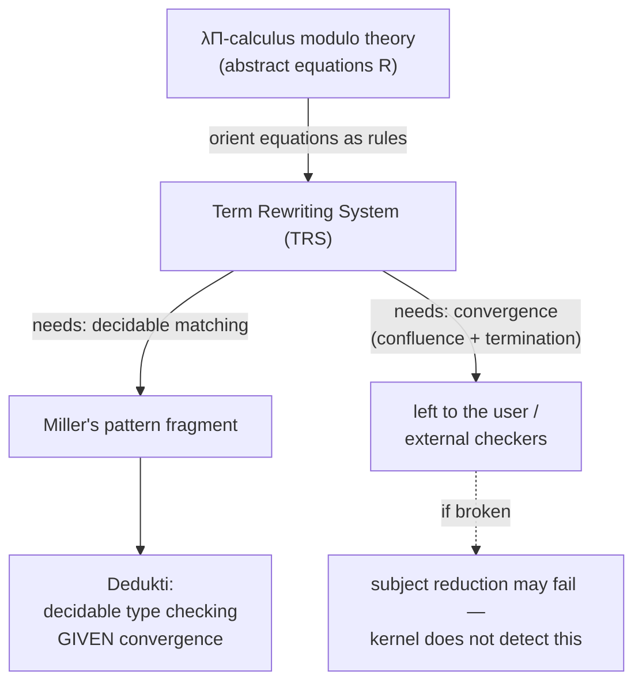
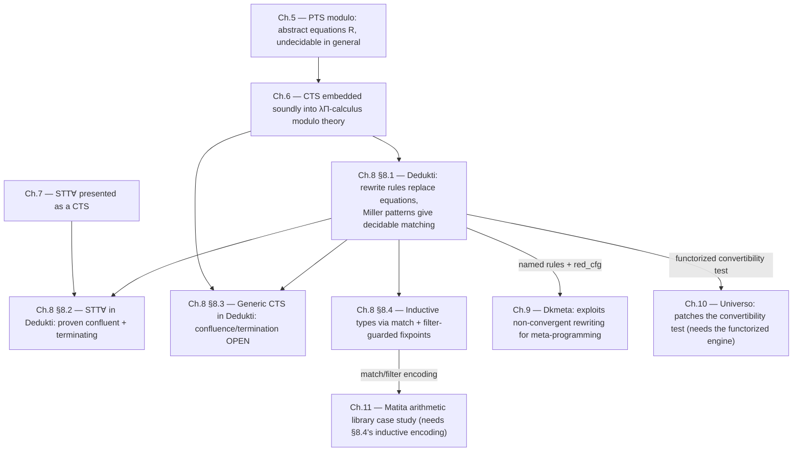

[[book-guidelines|↩ Back to guidelines]]

# Dedukti: An Implementation of λΠ-calculus Modulo Theory

## The problem: soundness bought a calculus you can't actually run

Chapter 5 gave you PTS modulo — a Pure Type System where the usual $\beta$-conversion is replaced by an *abstract* relation $R$, supplied as an arbitrary set of equations on terms. $\lambda\Pi$-calculus modulo theory is just LF instantiated with this abstract $R$. Chapter 6 then proved the thesis's central theorem: every Cumulative Type System can be soundly, conservatively embedded into $\lambda\Pi$-calculus modulo theory. That's a genuinely powerful result — it says one calculus can host Coq's logic, Matita's logic, Lean's logic, all as instances of the same host, differing only in which equations $R$ contains.

There's a catch, and it's not a small one: **type checking $\lambda\Pi$-calculus modulo theory is undecidable** in general [Bla01]. The reason is structural, not incidental: type checking a PTS-family calculus always needs to decide, at some point, whether two types are convertible (the conversion rule $R_\equiv$). When conversion is generated by $\beta$-reduction alone this is decidable (terms are strongly normalizing), but when conversion is generated by an *arbitrary* set of equations $R$, deciding "are $A$ and $B$ related by $R$" is exactly as hard as deciding equality in an arbitrary equational theory — which is, in general, undecidable. Chapter 6's soundness theorem tells you the target calculus is expressive enough; it says nothing about whether a machine can actually check a term against it.

**What breaks without a fix here:** an embedding theorem with an undecidable type checker isn't a tool, it's a mathematical curiosity. If the whole point of the thesis is *interoperability* — machine-checked proofs moving between real systems — you need an implementation whose type checker actually terminates on the cases that matter. This chapter is about closing that gap.

## The fix: orient equations as rewrite rules — and what that costs

The standard move for making equational reasoning decidable is old and general [BN99]: instead of treating an equation $l = r$ as a bidirectional fact, *orient* it into a directed rewrite rule $l \rightarrow r$, and require the resulting term rewriting system (TRS) to be **convergent** — both confluent (rewriting never "forks" into results that can't be reconciled) and terminating (rewriting always halts). A convergent TRS gives you a decidable equality test for free: normalize both sides and compare syntactically.

This is the idea behind **Dedukti**: an implementation of $\lambda\Pi$-calculus modulo theory in which the equations of $R$ are given as rewrite rules rather than raw equations. But swapping equations for rewrite rules doesn't just solve the decidability problem — it opens two new ones that the abstract PTS-modulo picture never had to worry about:

1. **Keeping type checking itself decidable.** This has three sub-requirements: the *matching problem* (does a term match a rule's left-hand side?) must be decidable; checking that a rewrite rule is itself well-typed must be decidable; and the rewrite system must terminate.
2. **Preserving subject reduction** — the property that reduction never changes a term's type. In the presence of dependent types, this comes down to proving the **injectivity of products**: if $(x{:}A) \to B$ and $(x{:}A') \to B'$ are convertible, then $A \equiv A'$ and $B \equiv B'$. Without this, two terms that "look like" the same product type via different reduction paths could silently license an ill-typed substitution.

Ronan Saillard's thesis [Sai15] is the source of the concrete solution used here: restrict rewrite-rule left-hand sides to **Miller's pattern fragment** [Uni91] — a class of higher-order terms narrow enough that matching, and the well-typedness of rules, are both decidable — while leaving convergence (confluence + termination) and product injectivity as properties the *user* is responsible for, unchecked by the kernel. This is Dedukti: a system that guarantees decidable type checking *given* a convergent rewrite system, but does not itself verify convergence. Notably, Assaf and collaborators [Ass15b][Cau16a] showed that entire proof-assistant logics — Matita, HOL-Light, Focalize — can be implemented this way as term rewriting systems, letting Dedukti double as an independent, external re-checker for proofs produced elsewhere.



Because Dedukti doesn't enforce convergence, its own specification is honest about the risk: if the rewrite system supplied by the user isn't confluent or terminating, Dedukti's behavior on that theory is *not properly well-defined*. In practice this shows up as the checker looping forever, or rejecting a term that is actually well-typed (a symptom of non-confluence — two different reduction paths from the same term disagree, and the checker happened to try the "wrong" one first). Version 2.7 (the one this chapter documents) can hand a theory off to external tools that speak the TPDB format — confluence checkers like CSI^HO [NFM17] or ACPH [ACP16], and the termination checker SCT [BGH19] — but Thiré is candid that for anything as intricate as the CTS encoding from Chapter 6, an automatic checker is unlikely to succeed. There's a deeper reason this is hard in principle, not just in practice: if an encoding of a logic into Dedukti is *conservative* (Chapter 5's Definition 5.3.2), then proving the resulting rewrite system confluent and terminating would automatically prove the *consistency* of the encoded logic. Automatically checking termination of the Calculus of Constructions' Dedukti encoding would, in effect, automatically prove normalization of the Calculus of Constructions itself — a genuinely hard theorem, not a decidable side-condition.

**Why leave the door open to unsound theories at all, instead of enforcing convergence in the kernel?** Because the freedom is a real feature, not just a gap: Chapter 9's tool Dkmeta deliberately exploits non-convergent rewriting to implement meta-programming over Dedukti terms — a use case that would be impossible if the kernel refused to load any theory it couldn't first certify.

It's also worth being precise about what checking convergence and injectivity *doesn't* buy you. Even a fully convergent, injective encoding of a logic in Dedukti is not automatically trustworthy as a proof checker for that logic, for two further reasons the chapter flags explicitly: (a) Dedukti's own `def ... := ...` mechanism is implemented via rewrite rules, so nothing currently distinguishes "this rewrite rule defines a computable function" from "this rewrite rule is secretly asserting a theorem" — a malicious or buggy encoding could smuggle an axiom in as a definition; and (b) the shallow embedding technique used throughout the thesis doesn't encode inductive-type side conditions like the positivity criterion (§8.4.2 below) — so a Dedukti signature can accept an inductive type that a real proof assistant's kernel would reject as unsound.

## The syntax, grounded

Dedukti's concrete syntax is small. Four things to learn, matched against Rust-shaped intuitions:

**Static vs. definable symbols.** A plain declaration
```
Nat : Type.
0 : Nat.
S : Nat -> Nat.
```
declares `Nat`, `0`, `S` as **static** symbols — you can never attach a rewrite rule to one. This is the Dedukti analogue of an `enum` constructor in Rust: `Nat::S(Nat)` doesn't "compute" to anything else, it's inert data. The payoff for this restriction is that a static symbol is automatically **injective** — Dedukti's type checker can freely conclude `S x` convertible to `S y` implies `x` convertible to `y`, exactly the way pattern-matching an `enum` variant is safe in Rust because constructors are injective by construction.

A **definable** symbol, marked with `def`, is a function that *can* carry rewrite rules — the Dedukti analogue of a Rust `fn`:
```
def plus : Nat -> Nat -> Nat.
[x] plus 0 x --> x.
[x,y] plus (S x) y --> S (plus x y).
```
The `-->` arrow is Dedukti's rewrite arrow, corresponding to $\hookrightarrow_\beta$-style reduction but for user rules instead of $\beta$; the bracketed `[x]`/`[x,y]` are the rule's local (pattern) variables — exactly the local typing context $\Delta$ from $\lambda\Pi$-calculus modulo theory's judgment $\Gamma, \Delta \vdash_R \cdots$. This should look immediately familiar as a Rust `match` arm compiled down to rewriting:
```rust
fn plus(a: Nat, b: Nat) -> Nat {
    match a {
        Nat::Zero => b,
        Nat::S(x) => Nat::S(Box::new(plus(*x, b))),
    }
}
```
except that in Dedukti the rewrite rules *are* the definition — there's no separate "function body" syntax except as sugar: `def 1 : Nat := S 0.` desugars to `def 1 : Nat. [] 1 --> S 0.`, and the very same sugar is used to state and prove a theorem: `def thm : type := proof.` A proof term, in this framework, is just the right-hand side of a zero-argument rewrite rule whose left-hand side is the theorem's name.

**Lambdas and applications** use `=>` for abstraction (not `->`, which is reserved for the product/arrow type):
```
A : Type.
g : A -> A.
def f : A -> A := x : A => g x.
```

**Higher-order rewrite rules and Miller's pattern fragment.** This is the crux of what makes Dedukti's matching decidable. Definition 8.1.1 (Pattern in Dedukti) states the shape informally:

1. A pattern always starts with a definable symbol.
2. It may contain local (pattern) variables, introduced in the leading `[...]`.
3. A local variable may occur more than once (non-linearity — see below).
4. A local variable may be applied to bound variables — but only ones bound by a $\lambda$ *within the pattern itself* — making it a **higher-order local variable**.
5. Each higher-order local variable must be applied to bound variables that are **pairwise distinct**.

The worked example — differentiation as a rewrite system — makes the payoff concrete:
```
def derivative : (Nat -> Nat) -> Nat -> Nat.
[]    derivative (x => x)   --> x : Nat => 1
[F]   derivative (x => F)   --> x : Nat => 0
[F,G] derivative (x => plus (F x) (G x)) -->
      x => plus (derivative (z => F z) x) (derivative (z => G z) x).
```
Here `F` and `G` are higher-order pattern variables applied to the bound variable `x` — condition 4 above. The semantics of "not applied to a bound variable" is the sharp edge to internalize: in `derivative (x => F)`, `F` is *not* applied to `x`, which means the matched term for `F` is asserted not to depend on `x` at all (this is what makes `derivative(x => c)` for a constant `c` reduce to `0`, correctly). Contrast `derivative (x => F x)`, where `F` *is* applied to `x` — there, `x` may or may not occur inside whatever `F` matches. This distinction is precisely what lets Miller's fragment stay first-order-matchable despite quantifying over functions: rather than solving general higher-order unification (undecidable, per Huet), the pattern restriction reduces matching to a syntactic, linear-time algorithm, because every metavariable's dependency on bound variables is pinned down by the pattern's own shape rather than needing to be inferred.

**Grounding — why this matters for a Rust-shaped verifier:** if you were implementing a small dependently-typed kernel with user-extensible computation rules (the load-bearing case for an elaborator that needs custom delta-reduction, e.g. for inductive eliminators), you cannot naively support arbitrary higher-order rewrite rules — matching against a rule whose LHS contains an unrestricted metavariable applied to arbitrary terms is exactly Huet's undecidable higher-order unification problem. Restricting your rule format to Miller patterns — "every metavariable, when it appears applied, is applied only to *distinct bound variables*" — is the concrete, implementable compromise that Dedukti (and, not coincidentally, most higher-order logic programming systems like $\lambda$Prolog) actually ship.

```rust
// A Miller-pattern-restricted rewrite rule, Rust-shaped
struct RewriteRule {
    // left-hand side: a definable head symbol applied to a pattern
    lhs_head: Symbol,
    lhs_args: Vec<Pattern>,
    rhs: Term,
}

enum Pattern {
    LocalVar(VarId),                      // condition 2/3: may repeat (non-linear)
    HOLocalVar(VarId, Vec<BoundVarId>),    // condition 4/5: applied only to
                                           // *distinct* bound variables from
                                           // an enclosing pattern-lambda
    Constructor(Symbol, Vec<Pattern>),
}

// Matching a Miller pattern is syntactic + a distinctness check —
// NOT general higher-order unification.
fn try_match(pat: &Pattern, term: &Term, bound: &[BoundVarId]) -> Option<Substitution> {
    match pat {
        Pattern::HOLocalVar(v, applied_to) => {
            // term must not mention any bound variable NOT in `applied_to`
            if term.free_bound_vars().is_subset(applied_to) {
                Some(Substitution::bind(*v, term.close_over(applied_to)))
            } else {
                None // outside the pattern fragment — matching fails, not "undecidable"
            }
        }
        // ... other cases are ordinary first-order matching
        _ => unimplemented!(),
    }
}
```

**Non-linear rewrite rules and brackets** relax the pattern fragment further, at the cost of turning matching into a residual conversion check rather than pure syntax. A **non-linear** rule lets a local variable repeat: `[x] f x x --> 0.` reduces `f (2 + 2) 4` to `0` because both occurrences of `x` are required to match *convertible* terms, not syntactically identical ones — each repeated variable is replaced by a fresh variable plus a deferred constraint that all its instances be convertible. **Brackets** generalize this to arbitrary terms: `[F,G] s (x => F G).` places a non-pattern term `F G` inside brackets, which Dedukti replaces with a fresh variable `X` plus a proof obligation `X = F(x \Rightarrow b)` checked at every application attempt — essentially an assertion the type checker enforces rather than a computation it performs. Both features buy expressiveness back from the pattern restriction, at the cost of making rule application a genuine (undecidable in general, but usually tractable in practice) conversion check rather than a linear-time syntactic match.

## Type checking a rewrite rule: asymmetric by design

Because a rewrite rule `l --> r` isn't a symmetric equation, checking that it's well-typed doesn't need to check that `l` and `r` have the *same* type in the naive sense — it only needs: **whenever the left-hand side is well-typed, the right-hand side is well-typed too.** This is subtler and strictly more permissive than requiring both sides to share a syntactic type, and the difference matters as soon as dependent types are in play. Figure 8.1's worked example is the canonical illustration:

```
nat : Type.
0 : nat.
S : nat -> nat.
vect : nat -> Type.
nil : vect 0.
A : Type.
cons : n:nat -> A -> vect n -> vect (S n).
def tail : n:nat -> vect (S n) -> vect n.
[n,m,a,v] tail n (cons m a v) --> v.
```
Read literally as an equation, `tail n (cons m a v) = v` looks suspect: the left side mentions both `n` and `m` as if they could be unrelated, and `tail n` demands a `vect (S n)`, while `cons m a v : vect (S m)`. Taken as a *bidirectional* equation, this rule would be ill-typed unless `n` and `m` are forced equal syntactically. But taken as a one-directional rewrite rule with the "if LHS well-typed then RHS well-typed" reading, it's fine: the left-hand side `tail n (cons m a v)` is only *well-typed at all* when `n = m` already holds (matching `vect (S n)` against `cons m a v : vect (S m)` forces this), and given that constraint, `v : vect m` and `vect m \equiv vect n`, so `v`'s type matches what `tail n` returns. The formal rule for checking this (adapted from the ordinary well-formedness rule $R_\equiv^{wf}$):
$$
\dfrac{\Gamma, \Delta \vdash_R B\sigma : T \;\text{implies}\; \Gamma,\Delta \vdash_R A\sigma : T \quad \sigma \in \Delta \to T}{\Gamma, A \hookrightarrow_\Delta B \vdash_R \mathrm{wf}} \; R^{wf}_{\equiv,\rightarrow}
$$
Dedukti implements a heuristic (documented in Saillard's thesis, refined further since) to find the substitution $\sigma$ that makes this check go through, leaning on the fact that static symbols are injective — exactly the property flagged above.

**Saillard's theorem** ties this whole machinery to soundness in one clean statement:

> **Theorem 8.1.1 (Saillard).** If Dedukti satisfies the injectivity of products, then subject reduction holds.

This is the load-bearing fact of the whole chapter, and it comes with a genuinely awkward circularity that Thiré is upfront about: injectivity of products is usually proved *from* confluence; confluence theorems usually assume *termination*; and the standard techniques for proving termination usually assume *subject reduction* — which is the very thing you were trying to establish. You can't bootstrap the usual way. The two escape routes are: prove confluence, termination, and subject reduction simultaneously (harder, but self-consistent), or prove confluence *first*, without assuming termination — the route actually used in practice, though it requires machinery beyond the textbook toolbox, since the standard Newman's-lemma argument for confluence-from-local-confluence itself relies on termination and so is unavailable here [FJ19].

## Making it fast: weak head normal form and decision trees

Decidable type checking is a precondition for a usable tool, not a guarantee of one. Comparing two terms via full normal forms is far too slow for realistic re-checking of proofs from Matita or Coq; every serious proof assistant instead computes only as much as needed — the **Weak Head Normal Form** (WHNF) — before comparing heads.

Dedukti's WHNF (**Definition 8.1.2**) needs a genuinely different definition from the textbook one, precisely *because* its rewrite systems need not be confluent. A term $t$ is in WHNF if there's a finite sequence $t_0 = t, \ldots, t_m$ where $t_m$ is a strong normal form and each step $t_i \hookrightarrow_{\beta\Gamma} t_{i+1}$ never reduces at the very head of $t_i$ — i.e., you keep reducing sub-positions until reduction is only possible at the head, and then you stop, without committing to *which* head-reducible form is "the" WHNF when several exist. Example 8.1's tiny non-confluent system (`b --> a` and `f b --> a`, with no rule for `f a`) makes the ambiguity concrete: `f b`, `f a`, and `a` are *all* legitimately WHNFs under this definition, but Dedukti's engine — closely modeled on Matita's [ARCT09], extended for higher-order rules, non-linearity, and brackets — commits to a specific one (`f b`, the first-rule-matched choice) as a matter of implementation, not specification. Add a rule `f a --> a` and `f b` stops being a valid WHNF at all, since now reduction *is* possible at the head.

Layered on top of WHNF computation are **decision trees** (adapted from Maranget's algorithm for compiling OCaml pattern matching [Mar08], implemented for Dedukti by Saillard and refined by Hondet [Hon19]): rather than trying rewrite rules for a definable symbol one at a time until one matches — an $O(n)$ approach for $n$ rules — a decision tree structures the choice as a single traversal, at the cost of more complex, harder-to-extend engine code. This is precisely the trade-off Rust's own `match` compiler makes internally: naive sequential-guard testing versus a compiled decision tree over the pattern space.

**What breaks without this:** naive normalization would make Dedukti unusable as a re-checker for realistic libraries — recomputing a full strong normal form for every convertibility check, when the terms being compared might differ only deep inside an argument that both computations never even need to inspect, would be asymptotically catastrophic on real proof terms with thousands of nested definitions.

## Extensions built for this thesis's interoperability work

Four modifications to the stock rewrite engine, all motivated by needs that arise *later* in the thesis (Chapters 9, 10, 12) rather than by Dedukti's original design brief — worth flagging now because they show how a research tool gets bent to support experiments its original authors didn't anticipate:

- **Named rewrite rules.** Dkmeta (Chapter 9) needs to distinguish "rules used to type-check a file" from "rules available for meta-rewriting," a distinction Dedukti previously had no way to express. The fix: every rule gets a name (auto-generated from file/line if the user doesn't supply one), and the rewrite engine can be parameterized by a predicate over names — effectively a rule *allowlist*. This also happens to make debugging easier, independent of the interoperability motivation.
- **A parameterizable rewrite strategy (`red_cfg`).** Exporting proofs to OpenTheory (Chapter 12) requires a *trace* of every rewrite step Dedukti performed — but the default WHNF algorithm needs to reduce **under** the head sometimes too (to discharge bracket/non-linearity constraints), so a single default strategy can't serve both the fast default type checker and a step-by-step, fully logged strategy. The fix is a configuration record:
```
type red_cfg = {
  select   : (Rule.rule_name -> bool) option;  (* which rules may fire *)
  nb_steps : int option;                       (* bound the number of steps *)
  target   : red_target;                       (* which normal form to compute *)
  strat    : red_strategy;                      (* the reduction strategy itself *)
  beta     : bool;                              (* enable/disable β *)
  logger   : position -> Rule.rule_name -> term Lazy.t -> term Lazy.t -> unit
}
```
This is a strategy-pattern object in the object-oriented sense — a Rust equivalent would be a struct of closures/trait objects injected into the reduction function, rather than a hardcoded strategy baked into the engine.
- **A functorized convertibility test.** Universo (Chapter 10) needs to *patch* Dedukti's convertibility test to compute the free CTS of Chapter 2 (treating certain symbols specially during comparison) — but maintaining a hard fork of Dedukti just to swap out one function is unsustainable. The fix is to make the type checker an OCaml **functor** over the rewrite engine: an interface (Figure 8.4) exposing `are_convertible`, `constraint_convertibility`, `conversion_step`, `reduction`, `whnf`, and `snf`, with a default implementation, but swappable. This is precisely a Rust `trait` boundary: `trait RewriteEngine { fn are_convertible(&self, sg: &Signature, t1: &Term, t2: &Term) -> bool; fn whnf(&self, sg: &Signature, t: &Term) -> Term; /* ... */ }` — the type checker becomes generic over `impl RewriteEngine`, letting Universo supply an alternate implementation without touching Dedukti's core.
- **Private symbols**, addressed at length next, because they carry real conceptual weight beyond being an engineering convenience.

## Private symbols: simulating proof irrelevance without touching the kernel

**The problem this solves:** many logics distinguish *proofs* (which carry no computational content worth inspecting — two proofs of the same proposition should be interchangeable) from *data* (which does). This is **proof irrelevance**. A natural way to simulate it inside a rewriting-based kernel is to rewrite every proof of a proposition to some single *canonical* proof — but the naive version of this idea is unsound: if you had a symbol that could produce a canonical proof of *any* proposition on demand, it would in particular produce a proof of `False`, making the encoded logic inconsistent.

**Private symbols** solve this by adding a visibility restriction rather than a new logical primitive: a symbol declared `private` can only be *written* directly inside the module (file) where it's declared; everywhere else, it can still *appear* — but only as the result of a reduction, never typed in by hand. Figure 8.5's tiny example shows the whole mechanism:
```
Prop : Type.
proof : Prop -> Type.
private hilbert : A : Prop -> proof A.
def make_proof : A : Prop -> proof A -> proof A.
[A,prf] make_proof A prf --> hilbert A.
```
Here `hilbert` is the dangerous "prove anything" symbol, made `private` so no external file can invoke it directly to conjure a proof of `False` out of thin air. `make_proof` is the *public* interface: it takes an actual proof `prf` of `A`, discards it, and canonicalizes to `hilbert A`. The soundness argument is: within the module where `hilbert` lives, the only way to obtain a `proof A` value that reduces to `hilbert A` is by *already having* a genuine proof `prf` and passing it through `make_proof` — the privacy restriction, not any type-theoretic property, is what prevents an outside module from short-circuiting straight to `hilbert`. This is the concrete tool used to implement proof irrelevance in the new CTS encoding presented next (§8.3), where every irrelevant proof is rewritten to a canonical form built from a private `make_proof`-style symbol.

**Grounding:** this is structurally the same idea as a "private" or "sealed" constructor pattern in a typed language — a Rust `enum` whose non-exhaustive variant can only be constructed inside its defining module, with a public smart-constructor function enforcing an invariant before handing out a value of the sealed type. The invariant being enforced here is semantic (proof irrelevance) rather than a simple data-shape constraint, but the access-control mechanism doing the enforcing is the same idea.

## Embedding STT∀ directly in Dedukti

Chapter 7 built STT∀ (a constructive higher-order logic) and showed it's a CTS instance, so it's automatically embeddable into $\lambda\Pi$-calculus modulo theory via Chapter 6's general CTS encoding. This section gives STT∀ a **simpler, direct** Dedukti encoding instead (Figure 8.6) — bypassing the general CTS machinery — because a hand-built encoding for one fixed logic can be far leaner than an encoding generic enough to parameterize over *any* CTS specification:
```
type    : Type.
def eta : type -> Type.

ptype    : Type.
def etap : ptype -> Type.
p        : type -> ptype.

[] eta --> t => etap (p t).

bool     : type.
def eps : eta bool -> Type.

arrow : type -> type -> type.
forallK : (type -> ptype) -> ptype.

[l,r] etap (p (arrow l r)) --> eta l -> eta r.
[f]   etap (forallK f)    --> x : type -> etap (f x).

forall : t:type -> (eta t -> eta bool) -> eta bool.
impl    : eta bool -> eta bool -> eta bool.
forallP : (type -> eta bool) -> eta bool.

[t,f] eps (forall t f) --> x:eta t -> eps (f x).
[l,r] eps (impl l r)   --> eps l -> eps r.
[f]   eps (forallP f) --> x:type -> eps (f x).
```
The two-tier `type`/`ptype` (and correspondingly `eta`/`etap`) structure is exactly the "prenex polymorphism" distinction from Chapter 7: `type` classifies *monomorphic* STT∀ types, `ptype` classifies *possibly-polymorphic* ones (via `forallK`, universal quantification over `type`), and `p : type -> ptype` is the inclusion of the former into the latter. `eta`/`etap` decode a (possibly polymorphic) type-code into the actual `Type` of its terms; `eps` similarly decodes a *proposition*-code (an `eta bool`) into the `Type` of its proofs — this `eps` family (`forall`, `impl`, `forallP`) is a direct rewrite-rule rendering of a Curry-Howard-style proposition encoding: implication becomes a function-space rewrite, universal quantification (both term-level `forall` and type-level `forallP`) becomes a dependent-product rewrite.

This system comes with a real theorem, not just a definition:

> **Lemma 8.2.1.** The rewrite system of STT∀ is terminating and confluent.
>
> *Proof.* Termination: the system is right-linear, and every rule strictly removes one occurrence of `arrow`, `forallK`, `forallP`, `impl`, or `forall` when going from left to right. Confluence: the system is left-linear and orthogonal (no overlapping left-hand sides), so confluence follows from a standard orthogonality theorem.
>
> **Theorem 8.2.2.** The rewrite system of STT∀ together with $\beta$-reduction is confluent.
>
> *Proof.* A direct consequence of Lemma 8.2.1: the combined system has no critical pairs with $\beta$ and remains left-linear [vOvR94].

This is the chapter's one genuinely *closed* metatheoretic result for a concrete encoding — everything else offered for the general CTS encoding in §8.3 is explicitly left open. (Termination of STT∀ plus $\beta$ together is only stated as **Conjecture 14**, with a plausible proof strategy borrowed from a prior termination result for Simple Type Theory in Dedukti [DHK01].) The contrast is instructive: a small, purpose-built, *orthogonal* rewrite system is tractable to analyze by hand; a large, generic, non-linear, higher-order one (next section) is not.

## Embedding CTS in Dedukti: generic, but unproven

Where §8.2 hand-encodes one fixed logic, §8.3 realizes Chapter 6's *generic* CTS-into-$\lambda\Pi$ encoding concretely as a Dedukti signature (Figure 8.7) — parameterized over an arbitrary CTS specification's sorts, axioms, rules, and cumulativity, using private symbols for the private half of the public/private signature split from Chapter 6. This generalizes Ali Assaf's earlier encoding [Ass15b], which only handled Matita specifically and, moreover, had a conservativity bug (flagged as Example 6.6) that Thiré's $\lambda\Pi$-level encoding fixes.

The signature declares `Sort`, `Univ`, `Term`, and boolean-valued relation symbols `Axiom`, `Rule`, `Cumul`, `SubType` mirroring a CTS specification's four components exactly, plus the constructors `univ`, `prod`, `cast` from Chapter 6's public signature. The interesting part, mechanically, is how casts and universes get **normalized away**: primed shadow symbols `univ'`, `prod'`, `cast'` (declared *without* the boolean side-condition argument) receive the actual rewrite rules, and the "real" `univ`/`prod`/`cast` immediately rewrite down to their primed counterparts once the side-condition proof is discharged — a pattern for separating "the data that matters computationally" from "the proof obligation that only mattered for type-checking, and can be forgotten once discharged." Rules like
```
[s]         Term _ (univ' s _)                 --> Univ s.
[s1,s2,a,b] Term _ (prod' s1 s2 _ a b)         --> x : Term s1 a -> Term s2 (b x).
```
are exactly the "decoding" equations you'd expect: the type of a term-at-a-universe-code unfolds to the actual `Univ` of that sort, and the type of a term at a `prod'`-code unfolds to a real dependent product. The cast-collapsing rules further down (e.g. `cast' _ _ A A t --> t` for a trivial cast, and several rules pushing casts through nested `prod'`/`cast'` compositions) implement exactly the kind of cast-simplification a real type checker needs to keep cast-chains from growing without bound across a long derivation.

Thiré is explicit that this system's metatheory is **not** established: "we have neither proven the confluence nor the termination of this system yet." The obstacle is structural — general results say that a rewrite system which is *both* higher-order *and* non-linear is essentially never confluent as a blanket fact [KdV89], so the only viable strategy is to prove confluence just for the sub-language of terms that actually arise as images of the encoding, not for the raw rewrite system in full generality. This remains open work.

**Example 8.2** walks the encoding through a concrete case: three universes for the Calculus of Constructions ($\star, \Box, \triangle$, with the usual axioms `Axiom star box`/`Axiom box triangle` and the eight-clause `Rule` relation for CoC's product formation), applied to translate the judgment $\vdash_C \lambda x{:}\Box.\,x \Leftarrow \Box \to \triangle$. The resulting fully-elaborated Dedukti term is large (a nested `cts.cast`/`cts.prod`/`cts.univ` tower nine lines deep) — but its **normal form** collapses to something genuinely small:
```
def id :
  (cts.Univ star) -> cts.Univ box
  :=
  x:(cts.Univ star) => cts.cast' box triangle (cts.univ' star box) (cts.univ'
    box triangle) x.
```
This gap between the elaborated term (huge) and its normal form (small) is itself a preview of Chapter 9's motivation: Dkmeta's meta-rewriting is presented later as a way to compute something like this compressed form *directly*, without going through the huge intermediate term at all.

## Embedding inductive types: match, fixpoints, and the filter trick

The final section steps back from CTS/STT∀ specifically to a more foundational question: how do you get inductive types — and the derived induction principle they enable — into a $\lambda\Pi$-style shallow encoding at all?

**Why inductive types need to exist as a primitive.** The motivating failure is concrete: the *Church encoding* of natural numbers in the plain Calculus of Constructions cannot derive the induction principle — this is provable by inspecting the normal form of any putative proof term [Str92]. The Calculus of Inductive Constructions fixes this by adding inductive types as genuinely new primitives, rather than trying to encode them from function types alone. (An alternative direction, taken by Cedille [FS18], instead enriches the ambient calculus with more primitive constructions to *derive* induction for a wide class of inductive types without adding them as primitives — a road not taken here.)

Concretely, the Calculus of Inductive Constructions adds three things: **inductive types** themselves, a **`match`** operator to deconstruct a value of one, and a **fixpoint** operator for generic recursion — plus two soundness-preserving restrictions: a **guard condition** on inductive type definitions (roughly, positivity — a constructor may not take an argument built from a strictly negative occurrence of the very type being defined) and a **syntactic termination criterion** on fixpoints (the recursive call may only be made on a *structurally smaller* argument). The recursive-function-via-fixpoint-plus-match shape should look immediately familiar from Coq:
```
Inductive nat : Type :=
| O : nat
| S : nat -> nat.

Definition plus : nat -> nat -> nat :=
fix add n {struct n} :=
match n with
| O => fun m => m
| S n => fun m => S (add n m)
end.
```
computationally, this is governed by a new conversion relation $\iota$ (distinct from $\beta$), with rules like
$$
\mathrm{fix}\ add\ O\ body \hookrightarrow_\iota body\{add \leftarrow \mathrm{fix}\ add\}
\qquad
\mathrm{fix}\ add\ (S\,n)\ body \hookrightarrow_\iota body\{add \leftarrow \mathrm{fix}\ add\}
$$
and, for `match`,
$$
\mathrm{match}\ 0\ \mathrm{with}\ |\,0 \Rightarrow f\,|\,S\,n \Rightarrow g\,n \hookrightarrow_\iota f
\qquad
\mathrm{match}\ (S\,n)\ \mathrm{with}\ |\,0 \Rightarrow f\,|\,S\,n \Rightarrow g\,n \hookrightarrow_\iota g\,n
$$
— i.e., an inductive type with $n$ constructors contributes exactly $n$ fixpoint-unfolding rules and $n$ match rules to $\iota$. Crucially, the fixpoint restriction (unfold only when the recursive argument literally starts with a constructor) is what keeps this rule terminating: `fix add x body` with `x` an unresolved *variable* simply doesn't reduce, which is exactly the guard against infinite unfolding.

### Realizing this in Dedukti (following Assaf's translation, [Ass15b])

Dedukti has no primitive notion of "inductive type," "match," or "fixpoint" — all three have to be encoded via ordinary declarations plus rewrite rules, ambient in this case in a Calculus-of-Constructions signature already given by the CTS encoding of §8.3. Working through natural numbers as the running example:

The type and constructors are ordinary `cts.Term`-typed declarations:
```
nat : cts.Term cts.sinf (cts.univ cts.box cts.sinf cts.I).
O : cts.Term cts.box nat.
S : cts.Term cts.box (cts.prod cts.box cts.box cts.box cts.I nat (_ => nat)).
```
Rather than one generic `match` symbol shared across every inductive type, Assaf's translation adds a **separate `match` symbol per inductive type** — not a real limitation in practice, since every use site of a match already statically knows which type it's eliminating:
```
def match :
  s      : cts.Sort                                           ->
  P      : (cts.Term cts.box nat -> cts.Univ s)               ->
  case_O : cts.Term s (P O)                                   ->
  case_S : (n:(cts.Term cts.box nat) -> cts.Term s (P (S n))) ->
  z      : cts.Term cts.box nat                               ->
           cts.Term s (P z)
[ s, P, case_O, case_S] match_nat s P case_O case_S O --> case_O.
[ s, P, case_O, case_S, n] match_nat s P case_O case_S (S n) --> case_S n.
```
Note the type of `match` is **universe-polymorphic** — it quantifies over an arbitrary sort `s` for the motive `P` — which places it *outside* the CTS encoding of Chapter 6 as such, since that encoding fixes concrete sorts rather than quantifying over them. Thiré flags a genuine subtlety here: instantiating `s` with `cts.box` produces a Dedukti type that type-checks fine inside Dedukti, but is **not a legitimate type of the Calculus of Constructions** proper — it corresponds to a strictly stronger system with **strong elimination** (Werner's extension of CoC with one extra universe and the products needed to support it [Wer94]). Dedukti's kernel has no way to reject this on its own; the restriction has to be enforced (or knowingly waived) by the encoding, not by the host calculus.

The **fixpoint** operator gets an even more interesting translation, precisely because Dedukti has no primitive "only unfold if the argument is headed by a constructor" restriction to lean on. Two concessions are made: (1) a fixpoint is always compiled to a **top-level, named recursive function** rather than staying anonymous — with the side effect that two anonymous fixpoints that would be convertible in Matita may fail to be convertible after translation into Dedukti, since they now carry distinct top-level names (and closing over the local context via $\lambda$-lifting introduces a further, related risk to conversion) — and (2) each inductive type gets an associated **filtering function** whose entire job is to delay computation until its argument is headed by a constructor:
```
def filter_nat :
  s           : cts.Sort                                       ->
  P           : (z:(cts.Term cts.box nat) -> cts.Univ s)       ->
  return      : (z:(cts.Term cts.box nat) -> cts.Term s (P z)) ->
  z           : (cts.Term cts.box nat)                         ->
                cts.Term s (P z).
```
`plus` is then genuinely split into two symbols — an outer function that only ever delegates to the filter, and an inner `plus_body` that does the real recursive work:
```
def plus : /* nat -> nat -> nat, as a CTS Term */ ...
def plus_body : /* same type */ ...

[n] plus n --> filter_nat box (x => /* nat -> nat */) plus_body n

[n] plus_body n -->
  m => match_nat (cts.type cts.z) (__1 => nat) m
       (p => S (plus p m))
       n.
```
The reason `plus` itself must never appear applied to a bare variable on a rule's right-hand side is termination: if `plus`'s own rule could unfold regardless of whether its argument had reached a constructor, nothing would stop `plus` from unfolding infinitely on an unresolved variable, exactly the pathology the guard condition exists to forbid in the source calculus. Routing all actual recursion through `plus_body`, reached only via the filter, reconstructs — by convention rather than by any kernel-enforced rule — the same discipline the guard condition enforces natively in Coq.

**Grounding — this is a manual reimplementation of a compiler invariant.** If you've ever implemented lazy/thunked recursion in a language without native laziness (e.g., a `deferred: Box<dyn FnOnce() -> T>` pattern to keep a Rust recursive computation from running until forced, or a two-function "trampoline" split in Python separating "the entry point" from "the step that actually recurses"), the `plus`/`plus_body` split is exactly the same idea, applied at the level of a type theory's own kernel: the recursion is only safe to unfold once you know a "when is this actually forced" precondition holds (here: the argument is headed by a constructor), so you factor the function into a guard and a body, and gate the guard's admission of the recursive call on the actual runtime shape of the data. Lean's own compiler, when it lowers a `WellFoundedRecursion`-style definition into the kernel's primitive recursor calls, is doing a structurally similar transformation — turning a user-written recursive function into kernel-primitive recursor applications that the type checker can validate directly.

## Where this leads



This chapter is the thesis's transition from theory to tooling: everything in Chapters 5–7 is a soundness argument about what *can* be embedded; this chapter is about what actually *runs*. Every later practical chapter depends on something introduced here specifically: Dkmeta (Chapter 9) is only possible because Dedukti tolerates non-convergent rewrite systems and now supports named, filterable rules; Universo (Chapter 10) is only possible because the convertibility test was functorized rather than hardcoded; and the Matita arithmetic case study (Chapter 11) directly inherits the match/filter encoding of inductive types built in §8.4, including its known rough edges (the universe-polymorphic `match`, addressed by duplicating the symbol per universe in §11.3).

For the standing project in this vault — building toward an elaborator with Miller-pattern-style unification for implicit-argument resolution (the `type-theory` and `automated-reasoning` focus areas both bear on this chapter directly) — this is close to the most concrete blueprint the whole thesis offers: a real, shipped kernel that (a) restricts rewrite-rule left-hand sides to Miller's decidable pattern fragment rather than attempting full higher-order unification, (b) factors "compute a WHNF" and "check convertibility" behind a swappable interface (the functorized rewrite engine) rather than hardcoding one algorithm, and (c) is honest in its own documentation about exactly which soundness properties (confluence, termination, injectivity of products) it does *not* verify and instead delegates to the encoding's author or to external tools. An implementation aiming for the same kind of extensible, rewrite-rule-driven kernel should expect to make the same three design decisions, and to inherit the same open obligations.
