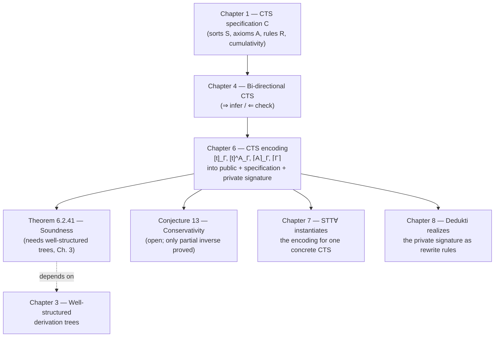

[[book-guidelines|↩ Back to guidelines]]

# Encoding CTS into λΠ-calculus Modulo Theory

## The problem this chapter has to solve

Chapter 5 gave you the target: $\lambda\Pi$-calculus modulo theory (a PTS with one product-forming sort rule, LF-style, plus an abstract congruence $\equiv_R$ you can extend with equations) is *the* universal host — Cousineau and Dowek showed any functional PTS shallow-embeds into it. If Coq, Lean, Matita and Agda are all instances of a common framework (Cumulative Type Systems, from Chapter 1), and that framework embeds into $\lambda\Pi$-calculus modulo theory, you get a two-hop path — CTS → $\lambda\Pi$ modulo theory → any other CTS — that could serve as an interoperability hub instead of writing $O(n^2)$ pairwise translators.

Chapter 6 is where that plan meets its first real obstacle, and the obstacle is worth understanding before any notation, because it's the kind of thing that would bite a compiler engineer immediately: **a CTS does not have unique typing.** In a PTS, if $\Gamma \vdash t : A$ and $\Gamma \vdash t : B$, then $A \equiv_\beta B$ — types are unique up to conversion. Cumulativity breaks this on purpose: in Coq's specification, $0 : \square_1$ and $0 : \square_2$ simultaneously, and $\square_1 \not\equiv_\beta \square_2$. That's the entire *point* of a universe hierarchy — a term can be reused at a higher universe without re-elaboration.

But $\lambda\Pi$-calculus modulo theory, as an instance of a PTS-modulo, *does* have unique typing (that's baked into its meta-theory in Chapter 5). So a naive embedding that tries to make CTS's implicit subtyping become $\lambda\Pi$'s implicit conversion is a type error waiting to happen: you'd be asking a system with unique types to represent a term that legitimately has several. If this feels familiar, it's because it's the same shape of problem a Rust compiler author knows well from subtyping/coercion: you can't fold `&'a T <: &'b T` into plain equality — you need an explicit coercion site, or the borrow checker's internal representation stops being sound. The book's answer here is exactly that: **make the coercion explicit.** Every place where a CTS derivation silently uses subtyping, the encoding inserts a first-class *cast term*. Ali Assaf's earlier encoding of Matita already tried something like this (a "lift" operator, castable only between sorts); this chapter's contribution is generalizing lift to a full cast operator that works between arbitrary types, fixing a conservativity bug that lift had (Example 6.6 below), and doing it *parametrically* — one encoding recipe that works for any CTS specification, not just Matita's.

## Building block 1: the public/private/specification signature split

Before any encoding function, the chapter has to answer: encode *into what*, exactly? A $\lambda\Pi$-calculus modulo theory judgment is checked against a typing context $\Sigma_C$ (a signature) plus a congruence it generates. Definition 6.1.1 splits this signature into three pieces, and the split itself is a design decision worth internalizing, because it's a pattern that recurs anywhere you're building a translation layer meant to serve *many* backends:

- **Public signature $\Sigma_C^{Pu}$** — fixed once and for all, shared by every CTS you ever encode this way. It declares the vocabulary the encoding functions themselves emit: sorts, universes, casts, products.
- **Specification signature $\Sigma_C^{Sp}$** — the parameter. One per concrete CTS (Coq's version differs from Lean's version differs from Matita's), it encodes *which* axioms, rules and cumulativity relation that particular logic has, as data.
- **Private signature $\Sigma_C^{Pr}$** — the judgmental equalities (in Dedukti terms: the rewrite rules) that make the whole thing actually type-check. This is allowed to vary between implementations without breaking anything downstream, *as long as* it satisfies a fixed specification (Fig. 6.4).

**What breaks without this split:** if you didn't separate public from private, every proof-system's encoding would carry its own bespoke vocabulary, and there'd be no shared surface for translating a *proof term* between two encoded logics — you'd be back to pairwise translators. The book flags this explicitly: Chapter 10's Universo tool, and cross-system interoperability generally, depends on the public signature staying identical across every CTS instance, while the private signature is swapped out per implementation (e.g., Dedukti's later, concrete rewrite-rule realization in Chapter 8) for scalability or engineering reasons. This is the same reason a compiler's IR is a stable contract that multiple backend passes target, while each backend's codegen internals can churn freely.

```rust
// A Rust sketch of the shape of this contract — not the book's formalism,
// but the same architectural idea: a fixed trait (public signature) that
// many logic-specific implementations (specification signatures) satisfy,
// backed by swappable rewrite engines (private signatures).
trait CtsEncodingTarget {
    type Sort;                     // the type S in Fig. 6.1
    fn universe(&self, s: Self::Sort) -> Term;   // U_s
    fn term_of(&self, s: Self::Sort, a: Term) -> Term; // T_s A
    fn cast(&self, s1: Self::Sort, s2: Self::Sort,
            a: Term, b: Term, proof: Term, t: Term) -> Term; // ↑ operator
}
// Coq, Lean, Matita each provide a *specification* (which (s,s') pairs are
// axioms/rules/casts — the Σ^Sp part); a Dedukti rewrite-rule file
// provides the *private* part that makes `cast` compute correctly.
```

### The public signature itself (Fig. 6.1)

Reading the public signature top to bottom tells you exactly what machinery the encoding needs, in order of introduction:

1. **`S : *`, `s_∞ : S`** — a type of sort-codes, plus one designated code $s_\infty$ used purely as *bookkeeping* so that top-sorts (sorts with no sort above them, like Coq's `Prop`'s ambient kind at the very top) still have *something* playing the role of "the sort above me." It changes neither consistency nor conservativity — it's what the book calls "(meta) syntax."
2. **`U : S → *`, `T : (s:S) → U s → *`** — the two-level encoding every dependently-typed kernel needs: `U s` is the encoded *type of CTS types living in sort $s$* (a code), and `T s A` is the encoded *type of CTS terms living in type $A$*. If $\Gamma \vdash_C A : s$ then its translation has type $U_s$; if $\Gamma \vdash_C t : A$ then its translation has type $T_s\,[A]$. This is a Tarski-style universe-as-code-plus-decoding-function pattern — precisely what a Lean-style kernel does internally when it represents `Type u` as data rather than letting the metatheory's own universes leak through. In Lean's kernel this move is *why* `Expr.sort` carries an explicit `Level` rather than being handled by the host language's own type universes.
3. **`B : *`, `□ : B → *`, `⊤ : B`, `I : ⊤`** — a tiny propositional layer purely for *irrelevant proofs*. `B` is "meta-propositions" (think: `Prop`-with-proof-irrelevance, used only to carry side-condition witnesses), `□ P` is the type of irrelevant proofs of `P`, and `⊤`/`I` are the trivially-true proposition and its unique witness.
4. **`A(_,_), R(_,_,_), C(_,_) : S → ... → B`** — these encode, as computable propositions, the three components of a CTS specification: `A(s,s')` says $(s,s') \in A_\mathcal{C}$ (an axiom), `R(s_1,s_2,s_3)` says $(s_1,s_2,s_3) \in R_\mathcal{C}$ (a product-formation rule), and `C(s,s')` says $(s,s') \in C_\mathcal{C}^*$ (cumulativity, i.e. subtyping is licensed between sorts $s$ and $s'$). This is the specification signature's payload, expressed against the public vocabulary.
5. **`u`, `π`, `↑`** — the three *term constructors* that actually appear in encoded output: `u_{s,s'} I` builds a universe code (with `I` witnessing the axiom side-condition), `π_{s1,s2,s3} I A (λx. B)` builds an encoded $\Pi$-type, and `↑` is the star of the chapter — the explicit cast: `↑^{s2,B}_{s1,A} I t` takes a term `t : T_{s1} A` and a proof `I : A ⊑ B` and re-types it as `T_{s2} B`.

**Why the cast needs a proof argument, and why that's cheap:** naively you might want `↑` to return type `max(s1,s2)` the way a max-based universe polymorphism scheme would — but that assumes the sort ordering is total, which fails once you consider universe-polymorphic or cumulative-inductive extensions. Instead the return type stays `U_{s2}` and you separately carry an *irrelevant* proof `I : C(s1,s2) ≡ ⊤` — trivial to produce by computation whenever the cast is actually legal, and thrown away at run time since `□` proofs carry no information. This is the same trick a Rust `unsafe` coercion or a refinement-type checker's "proof obligation, discharged by a decision procedure" uses: keep the value representation unchanged, attach a separately-checked certificate.

## Building block 2: bi-directional judgments as the encoding's real input

The encoding is defined over **bi-directional** CTS judgments (Chapter 4's $\Gamma \vdash t \Rightarrow A$ / $\Gamma \vdash t \Leftarrow A$), not over ordinary CTS derivation trees, and this choice is deliberate rather than incidental. Subtyping is *implicit* in ordinary CTS typing — nothing in the judgment $\Gamma \vdash t : A$ records *where* a subtyping step fired — so there's no syntactic hook to hang a cast term on. In the bi-directional presentation, the checking mode $\Gamma \vdash t \Leftarrow A$ is defined *precisely* as: infer a type, then subtype-check it against $A$ — so the last rule of any checking derivation is exactly the point where a cast belongs. This only works because Chapter 4 already proved bi-directional CTS equivalent to ordinary CTS typing for specifications in *normal form* — so the whole encoding inherits that restriction (functional, normal-form CTS specifications only).

Definition 6.1.2 introduces four translation functions, mirroring the four bi-directional forms:

$$
[t]_\Gamma \quad\text{(infer mode, from } \Gamma \vdash_C t \Rightarrow A\text{)}, \qquad [t]_\Gamma^A \quad\text{(check mode, from }\Gamma \vdash_C t \Leftarrow A\text{)}
$$
$$
\lceil A \rceil_\Gamma \quad\text{(encodes a well-sorted type)}, \qquad \lceil \Gamma \rceil \quad\text{(encodes a context)}
$$

and the judgment-level translation is:

$$
\Gamma \vdash_C t \Rightarrow A \quad\rightsquigarrow\quad \Sigma_C, \lceil\Gamma\rceil \vdash_D [t]_\Gamma : \lceil A \rceil_\Gamma
$$
$$
\Gamma \vdash_C t \Leftarrow A \quad\rightsquigarrow\quad \Sigma_C, \lceil\Gamma\rceil \vdash_D [t]_\Gamma^A : \lceil A \rceil_\Gamma
$$

The actual clauses (Fig. 6.3) are worth reading as a small interpreter, because that's exactly what they are:

```
[x]_Γ                  = x
[s]_Γ                  = u_{s,s'} I               when Γ ⊢_C s ⇒ s'
[M N]_Γ                = [M]_Γ [N]^A_Γ            when Γ ⊢_C M ⇒ (x:A)→B
[λx:A. M]_Γ            = λx:⌈A⌉_Γ. [M]_{Γ,x:A}
[(x:A)→B]_Γ            = π_{s1,s2,s3} I [A]_Γ (λx:⌈A⌉_Γ. [B]_{Γ,x:A})
                                                   when Γ⊢A⇒s1, Γ,x:A⊢B⇒s2, (s1,s2,s3)∈R

[M]^B_Γ                = ↑^{s2,[B]_Γ}_{s1,[A]_Γ} I [M]_Γ
                                                   when Γ⊢M⇒A, Γ⊢A⇒?s1, Γ⊢B⇒?s2
⌈A⌉_Γ                  = T_s [A]_Γ                when Γ ⊢_C A ⇒? s
⌈∅⌉ = ∅,   ⌈Γ,x:A⌉ = ⌈Γ⌉, x:⌈A⌉_Γ
```

The only clause that inserts a cast is `[M]^B_Γ` — checking mode — which is exactly the "last rule is subtyping" observation made concrete: infer $M$'s type $A$, then wrap the inferred term in `↑` to reach $B$. Every other clause is a direct structural translation with no coercion, because inference mode never needs one.

Two things earn a closer look:

- **The variant well-sorted predicate $\Gamma \vdash_C A \Rightarrow^? s$** (Definition 6.1.4, Fig. 6.2) is a small but important patch: the *ordinary* well-sorted predicate doesn't have a clean way to talk about top-sorts (a top-sort $s \in S_\mathcal{C}^\top$ has no sort of its own). The starred variant adds one extra rule that assigns $s_\infty$ to any top-sort, so every type — top-sorted or not — has *some* sort in the predicate's sense, which lets the translation clauses above be stated uniformly instead of case-splitting on "is this a top sort" everywhere.
- **Partiality, and why it's fine (Lemma 6.1.3):** these functions are defined by pattern-matching on side conditions (e.g. "when $\Gamma \vdash M \Rightarrow (x:A)\to B$"), so as *functions on raw syntax* they're partial — feed them an ill-typed term and there's no matching clause. The lemma proves totality restricted to well-typed input: if the corresponding CTS judgment holds, the translation is defined. This is the standard "partial function, total on the well-typed fragment" pattern every type-checker implementation relies on — you don't need `encode` to be total over `Term`, only over `Term` that already passed `infer`/`check`.

### A worked example, concretely

Example 6.1 (simply typed $\lambda$-calculus) shows the identity function $A : * \vdash \lambda x{:}A.\, x \Rightarrow A \to A$ translating to a term that is *ill-typed against the public signature alone* — you additionally need $R(*,*,*) \equiv_{\Sigma_C} \top$ and $A(*,\square) \equiv_{\Sigma_C} \top$ (facts the specification signature must supply) and you need the private signature's `T − π` equation to make $T_\star(\pi_{\star,\star,\star}\,I\,A\,(\lambda x{:}T_\star A.\,A))$ actually convert to the ordinary product type $(x:T_\star A) \to T_\star A$. Nothing type-checks from the public vocabulary in isolation — the specification and private signatures are load-bearing, not decoration. Example 6.2 (Calculus of Constructions with a cumulative hierarchy) shows the same phenomenon with a genuine cast in the output, and makes an important observation about *derivation-sensitivity*: whether subtyping fires on the variable $x$ or on the whole abstraction $\lambda x{:}0.\,x$ corresponds to two *different* derivation trees of the same bi-directional judgment, producing two syntactically different — but hopefully convertible — encoded terms. That convertibility is exactly what the canonicity equations below are for.

## Building block 3: the private signature's equations, organized as three jobs

Fig. 6.4 lists roughly a dozen judgmental equalities the private signature must satisfy (Definition 6.1.6). Rather than memorizing all of them, group them by the job each one does — the book itself organizes them this way (6.1.4):

**1. Decoding rules** — give computational meaning to each type constructor produced by the public signature:

$$
T(u_{s,\_})\equiv U_s \qquad T(\pi_{s_1,s_2,\_}\,a\,b)\equiv (x{:}T_{s_1}a)\to T_{s_2}(b\,x) \qquad T({\uparrow}_s^{\_}\,t)\equiv T_s\,t
$$

Without `T − π` specifically, an encoded $\Pi$-type would just be an opaque application of `T` to `π ...` — never reducing to an actual $\lambda\Pi$ product — so lambda terms couldn't even be *checked* against it (this is precisely what Example 6.1 shows going wrong without it).

**2. Subtyping-check rules** — make the cast's side-condition witness computable, and connect the abstract `A(_,_')`/`C(_,_')`/`R(...)` predicates to concrete subtyping between *encoded types* (not just sorts):

$$
u_{s,\_}\,u_{s',\_}\equiv C(s,s') \qquad (\pi_{s_1,s_2,\_}AB)\ (\pi_{\_,s_2',\_}A B') \equiv \forall s_1 A\,\lambda x.\, B\,x \sqsubseteq^{s_2}_{s_2'} B'\,x
$$

The `st − π` equation is the interesting one: subtyping between two $\Pi$-types is *covariant on the codomain only* (matching the CTS subtyping relation from Chapter 1, which explicitly excludes contravariance on the domain) — the encoded subtyping predicate literally re-derives that shape.

**3. Canonicity rules** — let a cast *commute* with the other constructors, which is what makes two syntactically different derivations of the same judgment (recall Example 6.2's "subtype on $x$" vs. "subtype on $\lambda x.x$") collapse to convertible encoded terms:

$$
{\uparrow}^a_a\,t \equiv t \quad (\uparrow-\text{id}) \qquad {\uparrow}^c_b({\uparrow}^b_a\,t)\equiv{\uparrow}^c_a\,t \quad (\uparrow-\uparrow)
$$

plus rules letting a cast permute past $\Pi$, past $\lambda$, and past application (`π−↑`, `↑−lam`, `↑−app`). Examples 6.3–6.5 in the book systematically construct one CTS judgment per equation and show it fails to type-check without exactly that equation — a genuinely useful debugging technique if you ever have to *implement* one of these signatures and something doesn't reduce: check which canonicity rule is missing.

**What breaks without the split into these three jobs:** if you tried to get away with only decoding rules, you'd be able to state encoded types but never *check subtyping between them* — checking mode would get stuck. If you added subtyping-check rules but no canonicity rules, the encoding would still be sound in principle but wildly *non-confluent* in practice: the same source proof, elaborated two different (both legal) ways, would produce two encoded terms that are not obviously convertible, defeating the entire point of using $\lambda\Pi$'s congruence as the interoperability substrate.

### The optimization the book flags, and its cost

A literal reading of the translation clauses inserts a cast at *every* application and every checking site, including trivial ones (casting a term to its own inferred type). Example 6.1.4's closing discussion ($N : *,\ 0:N \vdash (\lambda x{:}N.x)\ 0 \Rightarrow N$) shows this blowing up needlessly — you don't need to cast `0` to itself. The book removes identity casts as a practical optimization but is honest that this trades away part of what makes the soundness *proof* clean: identity casts turn out to be load-bearing for one lemma (substitution permutation, 6.2.25) and for making Universo's later universe-inference machinery (Chapter 10) work smoothly. This is a genuinely common tension in compiler engineering: the representation that makes the *metatheory* easiest to prove is rarely the representation you want to *emit*, and you end up documenting exactly which invariant an optimization pass is allowed to break.

## Soundness (Theorem 6.2.41): what it actually says and how it's proved

The target statement (Theorem 6.2.1, restated as 6.2.41 once all the machinery is assembled) is exactly what you'd hope:

$$
\text{If } \Gamma \vdash_C t \Rightarrow A \text{ then } \Sigma_C, \lceil\Gamma\rceil \vdash_D [t]_\Gamma : \lceil A \rceil_\Gamma
$$
$$
\text{If } \Gamma \vdash_C t \Leftarrow A \text{ then } \Sigma_C, \lceil\Gamma\rceil \vdash_D [t]_\Gamma^A : \lceil A \rceil_\Gamma
$$
$$
\text{If } \Gamma \vdash_C \Rightarrow \mathrm{wf} \text{ then } \Sigma_C, \lceil\Gamma\rceil \vdash_D \mathrm{wf}
$$

given three hypotheses: no name clash between encoding symbols and object-language variables, a *valid* specification signature ($\Sigma_C^{Pu}, \Sigma_C^{Sp} \models \Sigma_C^{Sp}$, Definition 6.1.5), and a *valid* private signature ($\models \Sigma_C^{Pr}$, Definition 6.1.6). Every one of those "valid" clauses is a proof obligation for whoever implements a concrete CTS's signature in Dedukti — the theorem is a template, not a free lunch.

**Where "well-structured" earns its keep here.** The proof needs an induction principle strong enough to survive *substitution* — specifically, Lemma 6.2.25 shows that encoding commutes with substitution up to $\equiv_{\Sigma_C}$: $[u]_{\Gamma,x:A,\Gamma'}[\sigma] \equiv_{\Sigma_C} [u\sigma]^{D\sigma}_{\Gamma,\Gamma'\sigma}$. Proving that requires knowing the *type* of a term is preserved under $\beta$-reduction along the way (subject reduction, essentially), and Chapter 3's well-structured derivation trees are precisely the tool that licenses an induction compatible with $\beta$ — recall from that chapter's own material that "well-structured" means the has-type ordering on the derivation is well-founded and compatible with reduction. Concretely, the proof is organized as two mutually supporting inductive invariants indexed by a level $n$: $WT^n$ ("preservation of typability" — the encoded term type-checks) and an auxiliary $WS_n$/$SUBST_n$/$CONV_n$ family ("preservation of computation" — convertible CTS types encode to convertible $\lambda\Pi$ types). The two key lemmas the book singles out for full detail (and marks everything else as "sketched, trust the pattern") are exactly these: **preservation of computation** (6.2.24) and **preservation of typability** (6.2.39/6.2.40, culminating in 6.2.41 by induction on $n$).

**A representative proof step, read for the technique rather than the symbols.** The application case of preservation of typability ($C^{app}_\Rightarrow$) is a good specimen: given $f\,a$ typed by inferring $f : (x{:}B)\to C$ and checking $a \Leftarrow B$, the proof (i) invokes the induction hypothesis on the smaller derivations for $f$ and $a$ to get their encodings typed, (ii) uses the `T−π` decoding equation to see the encoded product type as an actual $\lambda\Pi$ product so the application rule of $\lambda\Pi$'s own typing applies, (iii) uses the substitution-permutation lemma (6.2.25) to show the *encoded* substituted codomain $[C]_{\Gamma,x:B}[x \leftarrow [a]^B_\Gamma]$ is convertible to $[C\{x \leftarrow a\}]_\Gamma$ — i.e., that encoding and substitution really do commute — and (iv) closes with the conversion rule $R_{\equiv_\Gamma}^\beta$ of $\lambda\Pi$-calculus modulo theory. Every step is either "apply the induction hypothesis" or "invoke one specific canonicity/decoding equation by name" — which is exactly why the private signature had to be pinned down so precisely in Fig. 6.4: each equation exists because some specific proof step needs it, not for aesthetic completeness.

A corollary (6.2.42) then transports the whole theorem from bi-directional CTS back to ordinary CTS typing, using the constructive equivalence proof from Chapter 4 (Theorem 4.3.9) to pick the right derivation tree to encode.

## Conservativity: proved weaker than hoped, with an instructive counterexample

Soundness alone is a weak guarantee — the book explicitly reminds you (echoing Chapter 5's discussion) that a *trivial* embedding (map every type to `unit`, every term to `()`) is perfectly sound. What you actually want is **conservativity**: every $\lambda\Pi$-calculus-modulo-theory proof of an encoded type reflects back to an actual CTS proof. Formally (Conjecture 13):

$$
\text{If } \Sigma_C, \lceil\Gamma\rceil \vdash_D P : \lceil A \rceil_\Gamma \text{ then there exists } t \text{ such that } \Gamma \vdash_C t \Leftarrow A.
$$

This is stated as a **conjecture**, not a theorem — an honest and notable gap in a thesis whose whole thrust is practical interoperability. The stated reason is technical but important to understand: conservativity has to quantify over *every* $\lambda\Pi$ term $P$, including ones nowhere near the image of the translation, whereas everything provable so far is only about terms that *are* in that image.

What the chapter proves instead is strictly weaker but still useful: three **partial inverse functions** $|\cdot|$, $|\cdot|^\uparrow$, $\|\cdot\|$ (Definition 6.3.1) that, composed with the forward encoding, give back the identity up to $\beta$ (Lemma 6.3.1) — e.g. $|[t]_\Gamma| \equiv_\beta t$. Reading the inverse-translation equations is instructive: $|{\uparrow}\,A| := |A|^\uparrow$ and $\|A\|^\uparrow := |A|$ simply *erase* casts, which tells you plainly what information the round-trip loses — the inverse can recover the *shape* of a term (its underlying skeleton before subtyping decorated it), but not the specific coercion path used to type-check it. That's a real, useful property (it rules out the collapse-everything-to-`unit` embedding) without being conservativity.

**The counterexample that motivated the harder cast operator (Example 6.6).** This is the piece of evidence that justifies the whole chapter's added complexity over Ali Assaf's earlier lift-only encoding. With `lift` restricted to sorts, encoding a subtyping step between two *function types* (rather than two sorts) forces eta-expansion of the underlying term to push the lift down to where a sort actually appears. Concretely: with $P : 0 \to 0$ and `refl`'s only inhabitant requiring syntactically convertible arguments, the CTS type `eq P (λx:0. P x)` is *uninhabited* (P and its eta-expansion are not the same normal form, and the specification is terminating and consistent, so nothing else could inhabit it) — yet the lift-based encoding, forced to eta-expand `P` to change its universe, produces an encoded type that *is* inhabited (by the encoding of `refl` applied to the eta-expanded argument). That is a genuine conservativity failure: a real theorem gap in the source system becomes provable after translation, which is exactly the failure mode an interoperability tool cannot tolerate — it would let you "prove" things in the target that weren't provable in the source. The explicit cast-on-types operator this chapter introduces sidesteps the problem because it never needs to eta-expand anything; it casts the term directly.

## Where this leads



This chapter is the thesis's theoretical center of gravity: everything in Part II is this construction made concrete. Chapter 7 (STT∀) is literally an instance of Definition 6.1.1's specification signature. Chapter 8 (Dedukti) is where the private signature's *equalities* become oriented *rewrite rules* — trading the abstract congruence $\equiv_{\Sigma_C}$ for something a real type-checker can decide, at the cost of now worrying about confluence and termination of a rewrite system rather than an equational theory. Chapter 10 (Universo) is built directly on top of the free-CTS machinery from Chapter 2, using this chapter's encoding as the object being elaborated with sort metavariables.

**On the standing learning goals (type-theory, automated-reasoning):** this chapter is close to a worked case study of the exact mechanism your elaborator's unifier and kernel would need for **implicit-argument resolution via explicit coercions** — the cast operator here plays the same role that a coercion-insertion pass plays in a bidirectional elaborator (Lean's own elaborator inserts coercions at check-mode boundaries in essentially this shape). The soundness proof's reliance on a *substitution-commutes-with-elaboration* lemma (6.2.25) is the same lemma shape your compiler's `isDefEq`-adjacent machinery will need if a refinement-type or dependent-type checker of yours ever needs to push a well-typed substitution through an already-elaborated term. And the conservativity gap is a cautionary tale worth keeping: proving a translation *sound* is comparatively easy; proving it does not accidentally manufacture new theorems is the hard, sometimes open, part — exactly the standard your own trusted kernel will eventually be held to.
