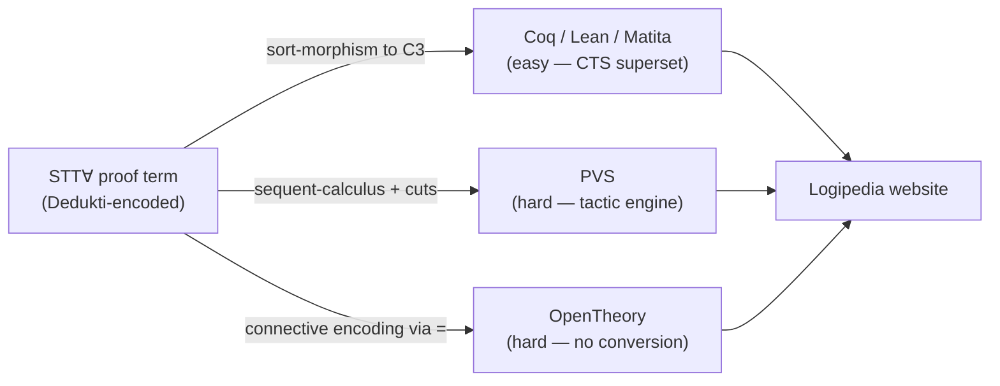
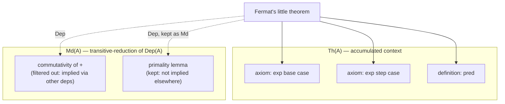

[[book-guidelines|↩ Back to guidelines]]

# Exporting Proofs Across Proof Systems

## The problem: a proof term is not a proof you can read

By Chapter 11, Thiré's pipeline has produced a real artifact: Fermat's little theorem, translated from Matita's Dedukti encoding into STT∀ — a single, logic-agnostic proof term sitting inside the $\lambda\Pi$-calculus modulo theory kernel. Chapter 12 asks the obvious next question: now what? A proof term inside a trusted kernel is only useful to the extent someone (or some other system) can *consume* it. This chapter is the thesis's reality check on its own theory — it takes the abstract embedding machinery from Chapters 2 and 6 and asks it to actually produce artifacts that Coq, Lean, Matita, PVS, and OpenTheory will accept.

What makes this chapter interesting is that it is not a uniform success story. Exporting to Coq, Lean and Matita is close to free — a direct consequence of the CTS-embedding theory. Exporting to PVS is genuinely hard, for a reason that has nothing to do with logical strength and everything to do with how the target system's proof *checker* behaves. Exporting to OpenTheory is hard for a third, completely different reason: the target system barely has a notion of "proof term" to translate into. And even where translation succeeds, the output is nearly useless to a human without a separate, unautomated step: **concept alignment**. This is the chapter where "sound in principle" and "usable in practice" visibly pull apart.

**What breaks without this chapter.** Everything in Parts I and II up to here proves *that* a sound, conservative translation exists in principle (Chapter 5's soundness/conservativity criteria, Chapter 6's CTS encoding). None of that machinery tells you whether the resulting artifact is small, fast to check, or comprehensible. Chapter 12 is where those engineering questions get asked and, mostly, answered empirically — with actual byte counts and wall-clock seconds (Table 12.1).



## Exporting to Coq, Lean and Matita: a sort-morphism is enough

Recall from Chapter 1 that a CTS specification like $C_3$ (Definition 1.5.12) sits at a fixed point in the $\lambda$-cube-adjacent hierarchy of logics, and from Chapter 2 that a **specification morphism** $\sigma$ mapping sorts to sorts, compatible with axioms/rules/cumulativity, gives you a *sound* translation for free (Theorem 2.1.1): if $\Gamma \vdash_{\mathcal C} t : A$, then $\Gamma\sigma \vdash_{\mathcal C'} t\sigma : A\sigma$.

STT∀'s CTS is exactly $C_3$, and the CTS specifications underlying Coq, Lean and Matita are all *supersets* of $C_3$ — every axiom, rule, and cumulativity edge STT∀ has, they have too, plus more. That containment is precisely what a specification morphism needs: $\sigma$ can just be close to the identity on sorts. Because the morphism is a specification-level fact, not a per-proof one, applying it to a concrete proof term requires **no type-checking at all** — you take the STT∀ proof term as a Dedukti-encoded string, rewrite its sort symbols, and print the result in the target system's concrete syntax. This is the payoff of doing the hard theoretical work (Chapters 5–6) up front: the actual export step degenerates into string manipulation.

Figure 12.2 in the book shows exactly this: the same statement of `congruent_exp_pred_SO` (a lemma en route to Fermat's little theorem), printed once for Coq, once for Lean, once for Matita, differing only in surface syntax — module-qualified names (`nat.nat`, `primes.prime`) carried straight over from the STT∀/Dedukti signature. Remark 29 flags the one genuine wrinkle: Lean requires parameters that return a `Prop` to be marked `noncomputable`, a syntactic tax with no logical content.

**Rust framing.** This is the best case of any compiler backend: your IR's type system is a strict *subset* of the target's, so code generation is a syntax-directed rewrite with no re-verification pass. Think of compiling a `no_std` subset of Rust to a full-`std` target — every construct you emit is already legal in the bigger language, so the "backend" is closer to a pretty-printer than a compiler. There is no unification, no constraint solving, nothing that could fail at this stage — soundness was already discharged once, at the specification level, and every individual proof term inherits it for free.

**Lean framing.** This is also a clean illustration of why *specification morphisms* (the strict, uniform sort map from Chapter 2) rather than the weaker *CTS embeddings* are the right tool here: because $C_3 \sqsubseteq_\sigma \mathrm{CTS}(\mathrm{Lean})$ holds at the level of a fixed, position-independent $\sigma$, you never need Chapter 2's heavier "free CTS as a constraint problem" machinery (that's reserved for Universo, Chapter 10, where the target specification is *not* a superset and sorts really do need solving for). Exporting to Lean is what interoperability looks like when Definition 2.1.1 already gives you everything.

## Exporting to PVS: when the target's automation fights your derivation

PVS's logic is, on paper, an easier target than Coq or Lean: it is a conservative extension of $\lambda\mathrm{HOL}$ with predicate subtyping, and since version 7 it has prenex polymorphism — so STT∀'s logic embeds strictly inside PVS's. The book's key observation is that logical strength is the wrong axis to worry about here. **PVS has no proof terms.** It was built to be driven by a human through tactics, and the only way to produce a checked PVS proof is to emit a tactic script that the PVS proof engine executes.

That would still be fine if PVS tactics behaved like a passive, syntax-directed replay of STT∀'s natural-deduction rules. They don't: PVS tactics **eagerly simplify the goal** whenever they can, e.g. rewriting $A \wedge \top$ down to $A$ automatically, without being asked. A tactic script written as if PVS were a dumb term-elaborator will silently diverge from what the running system actually has on the goal stack.

Example 12.1 works through exactly this failure. Given STT∀ derivations $\pi_1 : \Gamma \vdash_S A \to B \wedge \top$ and $\pi_2 : \Gamma \vdash_S A$, the rule $S{\Rightarrow}E$ (implication elimination) concludes $\Gamma \vdash_S B \wedge \top$. Translated naively into PVS's sequent calculus via a `cut` rule:

$$
\dfrac{\dfrac{|\pi_1|}{\Delta \vdash_P A \to B \wedge \top}\ \text{w-right}\quad \dfrac{\dfrac{|\pi_2|}{\Delta \vdash_P A}\ \text{w-right}}{\Delta \vdash_P A, B \wedge \top} \quad \dfrac{\Delta, B\wedge\top \vdash_P B \wedge \top}{}\ \text{axiom}}{\dfrac{\Delta, A \to B\wedge\top \vdash_P B \wedge \top}{\Delta \vdash_P B \wedge \top}\ \text{cut}}\ \text{$\Rightarrow$-left}
$$

The problem: after the `cut`, PVS's engine will *already have* simplified $B \wedge \top$ down to $B$ on the right premise before the $\Rightarrow$-left step runs — so the rule that the derivation expected to fire (matching literally on $B \wedge \top$) no longer has anything to match against. The fix is not to fight the simplifier but to route around it: introduce an *extra* cut, this time on $A$ itself, restructuring the derivation so the problematic conjunction never needs to survive as a literal syntactic target across a simplification boundary. The corrected derivation (second tree, p. 223) achieves the same conclusion by weakening $A$ into the context before applying `⇒-left`+`axiom` together, sidestepping the point where PVS would have intervened.

**What this costs.** Not correctness — the workaround derivation is still sound — but *time*: every elimination rule in the source proof now needs its own extra cut, and Table 12.1 shows PVS checking taking roughly 300 seconds against 1–6 seconds for Coq/Lean/Matita on the same theorem, by far the largest gap in the table.

**Rust/compiler framing.** This is precisely the class of bug you get compiling to a backend that performs its own constant folding or peephole optimization *before* your emitted code has finished asserting the invariants it depends on — e.g., emitting a match arm that assumes a specific discriminant layout, when the target's own optimizer has already collapsed that enum. The fix pattern is the same one compiler engineers reach for: insert an explicit barrier (here, an extra `cut`) that forces the target's own machinery to commit to an intermediate state before your translation's next step needs to pattern-match against it.

## Exporting to OpenTheory: a target with (almost) no logic of its own

OpenTheory is a harder case still, for a different reason again. Its typing system (Figure 12.3, ten rules: `Oassume`, `OabsThm`, `OappThm`, `Oaxiom`, `Obeta`, `OdeductAntiSym`, `OeqMp`, `OproveHyp`, `Orefl`, `Osubst`, `Osym`, `Otrans`) has exactly **one connective: equality.** No built-in $\wedge$, $\Rightarrow$, or $\forall$ — those have to be *defined*, not translated term-for-term. Two further gaps: OpenTheory's logic is classical (based on Church's/Andrews' $Q_0$), and — the one that actually bites — **OpenTheory has no conversion relation at all**. $\beta$-reduction is not a silent judgmental step; it has to be witnessed by an explicit `Obeta` derivation every single time it would otherwise fire silently.

### Encoding STT∀'s connectives via equality

The encoding (p. 225) defines each STT∀ connective as an equation over $Q_0$-style primitives:

$$
\top := (=) = (=) \qquad
t \wedge u := \lambda f.\, f\,t\,u = \lambda f.\, f\, \top\, \top \qquad
t \Rightarrow u := t \wedge u = t
$$
$$
\forall x{:}A.\, u := \lambda x{:}A.\, u = \lambda x{:}A.\, \top \qquad
\overset{A}{\forall} A.\, u := u
$$

The typed universal quantifier ($\overset{A}{\forall}$, quantification over a type variable) needs no explicit encoding at all, because in OpenTheory type-variable quantification is *implicit* in the signature rather than a term-level connective — there is nothing to translate because the source construct and the target's ambient polymorphism already coincide.

Soundness of this encoding is not asserted, it is *checked*: the book sketches Hilbert-style derivations showing every introduction/elimination rule for $\wedge$, $\Rightarrow$, and $\forall$ is *derivable* in OpenTheory's ten-rule kernel from these definitions. Take elimination of $\Rightarrow$ ($S{\Rightarrow}E$): from $\Gamma \vdash_O t \Rightarrow u$ (i.e., by definition, $\Gamma \vdash_O t \wedge u = t$) and $\Gamma \vdash_O t$, apply `OeqMp` to rewrite $t$ along the equation and land on $t \wedge u$, then apply the already-derived elimination of $\wedge$ to peel off $u$. Every one of these mini-proofs bottoms out in `OeqMp` (rewrite along a proven equality) and `OappThm`/`OabsThm` (congruence for application and $\lambda$-abstraction) — there is no primitive rule for "implication," because there is no such primitive in the target logic; there is only ever equality, used as the connective, the substitution mechanism, and the proof step, simultaneously.

**Lean framing — this is worth naming explicitly.** OpenTheory's design is the logical endpoint of a move Lean's own kernel makes only partially: collapsing propositional content into definitional/propositional equality wherever possible. Lean still keeps `Prop`, `∧`, `∀` as primitive inductive/Pi constructs with their own eliminators; OpenTheory goes one step further and *defines* every connective in terms of a single primitive judgment, `=`. Translating STT∀'s natural-deduction rules into OpenTheory is therefore not unlike writing a `PropExt`/`propext`-heavy Lean proof by hand where every step is `Eq.mpr` chained through `rfl`-adjacent lemmas instead of using `∧.intro`/`∧.elim` — technically faithful, but stripped of the reader-facing structure the source proof had.

### Removing $\beta$ and $\delta$ steps

Because OpenTheory has no conversion, every silent $\beta$/$\delta$-reduction step in the STT∀ proof has to become an explicit `Obeta`/definitional-unfolding proof step. The book connects this back to Chapter 3's untyped-vs-typed-conversion equivalence problem, but flags that it is strictly *easier* here: STT∀ has no dependent types, so the circularity that made Chapter 3's problem hard (subtyping needing conversion, conversion needing subtyping to be defined on well-typed terms) does not arise. Subtyping in STT∀ only ever moves a monomorphic type up to a polymorphic one; a $\beta$ or $\delta$ step never changes that status, so casts are never *introduced* by a reduction (though they can be duplicated by one). That lets the untyped/typed conversion equivalence go through by a direct induction, without needing Vincent Siles' heavier machinery from Chapter 3.

## Concept alignment: the axioms don't disappear, they move to the user

Here is the sting in the tail of the entire translation pipeline. The exported theorem for Fermat's little theorem in Coq reads, syntactically, like a real Coq statement:

```
Definition congruent_exp_pred_SO : forall (p:nat.nat), forall (a:nat.nat),
  (primes.prime p) -> (connectives.Not (primes.divides p a)) ->
  cong.congruent (exp.exp a (nat.pred p)) (nat.S nat.O) p := ...
```

But look at what's underneath: `prime`, `congruent`, and `pred` come with real *definitions* carried over from the translation, while `exp`, `Not`, `O`, and `S` are **axiomatized** — asserted with a type, but with no proof term backing them, because the export function's translation of Matita's inductive-type/recursive-function encoding does not know that `nat.nat` "is" an inductive type or that `exp` "is" a structurally recursive function; it only sees the flattened Dedukti rewrite rules those constructs compiled down to. Concretely: to make this theorem usable, a human has to hand-supply about **40 constants and 80 axioms** and prove they hold against Coq's real standard library — a roughly one-hour manual task for this one theorem, even though (the book notes) every one of those axioms turned out to be provable by reflexivity of equality, except two that needed an eta-expansion.

This cuts both ways. It's a genuine *advantage*: because the exported proof only assumes `exp` satisfies two rewrite-rule-shaped axioms (its base case and step case), a user is free to swap in *any* implementation of natural-number exponentiation that satisfies them — including switching the entire representation of naturals from unary to binary, since the proof never inspects the representation, only the axioms. It's also a genuine *cost*: this alignment step is unautomated, has to be redone by every user who downloads the proof, and there is (as of this thesis) no mechanism to parameterize the export function so that alignment, once done, is reusable.

**This is the chapter's clearest connection to the trusted-kernel question.** An exported STT∀ proof, dropped into Coq, is not epistemically equivalent to a proof written natively in Coq's standard library — it is a **proof certificate over an inflated trusted base**: every axiomatized constant is something the *user*, not the kernel, has to trust matches its intended meaning. This is the same tension that shows up whenever a proof-producing pipeline (an SMT-backed tactic, a certifying static analyzer, an elaborator emitting `sorry`-backed placeholders) hands a checker a term that type-checks but leans on unverified side-assumptions — the type-checker's "yes" is only as trustworthy as the axioms it was allowed to assume. **Proof reconstruction** here is only partial: Dedukti's kernel really did check the *shape* of the argument, but reconstructing the semantic content (that `exp` really is exponentiation) is a step the pipeline explicitly punts to a human.

## Logipedia: giving the exports somewhere to live

Logipedia (`logipedia.science`) is the website packaging all five export targets. Each entry — theorem, definition, axiom — gets a page with a pretty-printed statement, a **taxonomy** classification, its **theory**, and its **main dependencies**.

**Taxonomy.** STT∀ entries fall into five kinds: type operator (`nat`, `list`, `bool`), parameter (`plus`), definition (`2` as successor of `1`), axiom, theorem. The taxonomy is logic-specific by design — the book notes the Calculus of Inductive Constructions would need a richer taxonomy to also classify inductive types and constructors as their own kinds, which STT∀ (having no native inductive types) doesn't need.

**Theory**, $Th(A)$, is defined recursively over a symbol's dependency graph (Definition 12.5.1):

$$
Th(A) := \begin{cases}
\{D \mid \forall B,\ B \in Dep(A) \wedge D \in Th(B)\} \cup \{B\} & \text{if $B$ or $A$ is a parameter or axiom} \\
\{D \mid \forall B,\ B \in Dep(A) \wedge D \in Th(B)\} & \text{otherwise}
\end{cases}
$$

Intuitively: the theory is the accumulated context a symbol's statement genuinely depends on, but definitions get "seen through" (only their *own* dependencies propagate) while parameters and axioms are opaque and get *added into* the theory themselves — because a parameter or axiom is exactly the kind of thing a downstream user needs to know they're assuming.

**Main dependencies**, $Md(A)$, address a display problem: a theorem's *direct* Dedukti dependency list is dominated by low-level lemmas (Fermat's little theorem technically depends on commutativity of addition, but printing that as a "main" dependency would bury the interesting structure). Definition 12.5.2 filters to dependencies not already implied transitively by other dependencies in the set:

$$
Md(A) := \{B \mid B \in Dep(A) \wedge \forall C \in Md(A),\ C \neq B \Rightarrow B \notin Dep^*(C)\}
$$

where $Dep^*$ is the reflexive-transitive closure of $Dep$. This is exactly a **transitive-reduction** of the dependency DAG restricted to one node's in-edges — the book flags it isn't practically computable in general (transitive closure per entry is expensive) and suggests bounding the search depth as an approximation.



The site itself is an ordinary HTML/CSS/JS/PHP application backed by MongoDB, and — pragmatically — pre-generates downloadable proof archives for Fermat's little theorem rather than computing them on demand, because generation is slow enough (Table 12.1: up to ~300s for PVS) that on-demand generation would be a poor user experience.

## Where this leads

This chapter is the thesis's proof-of-concept payoff: everything from Chapters 2, 5, and 6 (embeddings, PTS-modulo, the CTS-into-$\lambda\Pi$ encoding) cashes out here as five concrete export pipelines, with wildly different difficulty depending on how close the target's *proof-checking mechanism* — not just its logic — is to STT∀'s. The chapter's own closing "Future Work" section (generalizing Logipedia beyond STT∀, a version-control model for proofs, a formal notion of proof equality via logic ordering $L_1 \subseteq L_2$) feeds directly into Chapter 13's broader argument about standards, and concept alignment resurfaces there as the concrete instance of "the gap between kernel-level proofs and high-level user syntax" that the thesis identifies as the field's actual remaining obstacle.

For the compiler/elaborator project this vault is building toward, the load-bearing idea here is the **proof-certificate/trusted-base distinction** (`automated-reasoning`): an exported proof term that type-checks against a small, trusted kernel is not automatically a proof you should treat as fully verified end-to-end if it leans on axiomatized constants standing in for un-reconstructed semantic content — exactly the situation a metavariable-driven elaborator is in whenever it discharges a goal via an external oracle (an SMT call, a `sorry`, a trusted extern) rather than a fully elaborated term. The `type-theory` connection is narrower but concrete: the ease of the Coq/Lean/Matita export is a direct, worked instance of Chapter 2's **specification morphism** ($C_3 \sqsubseteq_\sigma \mathrm{CTS}(\mathrm{Lean})$) doing exactly the job it was built for — a reminder that the earlier, more abstract embedding theory was not decoration, it is what makes three of these five exports a non-event.
