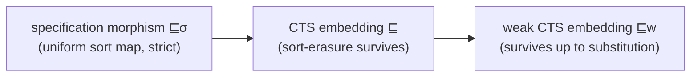
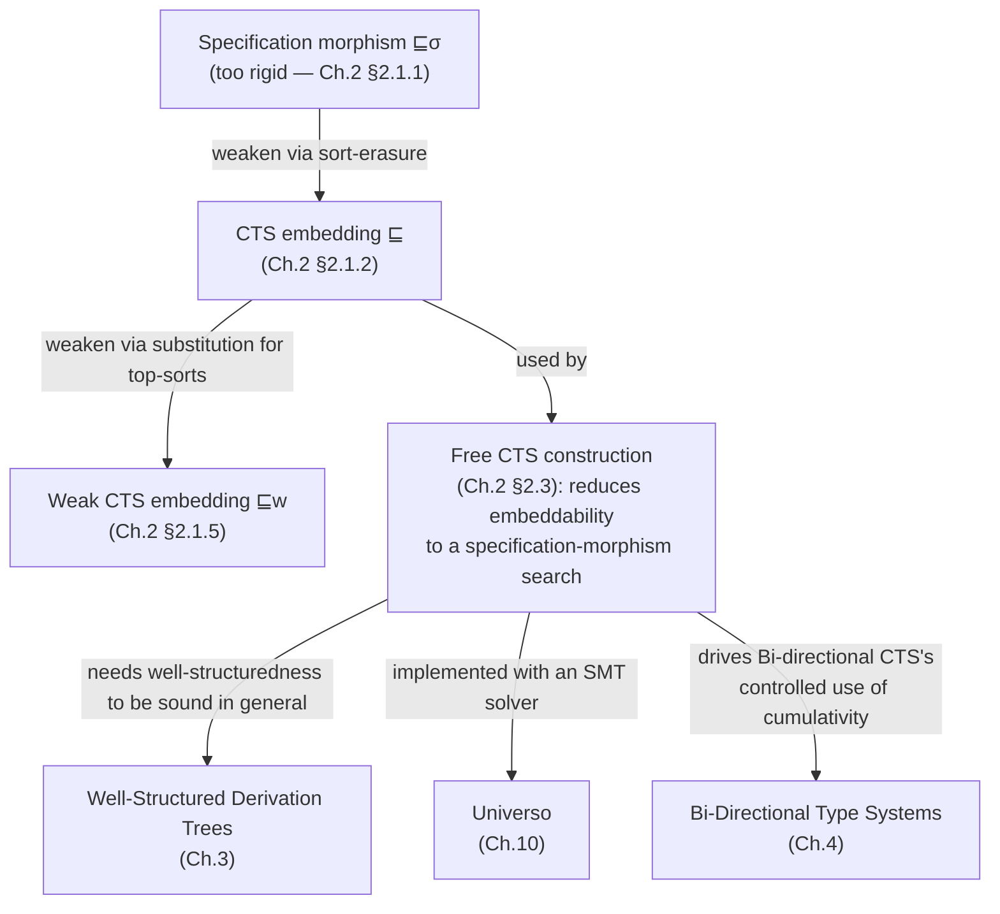

[[book-guidelines|↩ Back to guidelines]]

# Interoperability Between Type Systems

## The problem: two type checkers, one proof

Suppose you have a proof developed in Matita and you want to reuse it in Lean. Both systems are built on some Cumulative Type System (CTS) — Matita's, call it $\mathcal C$, allows an unbounded tower of universes; Lean's, call it $\mathcal C'$, has its own axioms and rules. The question "can this proof move from $\mathcal C$ to $\mathcal C'$?" sounds like it should have a crisp yes/no answer, but the obvious way of making it precise — "translate every sort of $\mathcal C$ to a sort of $\mathcal C'$, uniformly" — turns out to be too strong to be useful. This chapter is about weakening that idea just enough to get something both meaningful and (mostly) decidable, while keeping enough structure that "yes" really does mean "here is a working proof in the target system."

This matters for exactly the project a Rust-based dependent-type compiler with an embedded elaborator will eventually run into: whenever you support "trusted" imported lemmas, foreign proof terms, or multiple universe/typing disciplines feeding one kernel, you need a formal notion of *when a judgment typed under one set of typing rules is still valid under another*. That is precisely what Thiré formalizes here.

## Why a naive sort-morphism is not enough

The first, most literal idea: a function $\sigma : S_{\mathcal C} \to S_{\mathcal C'}$ mapping sorts of $\mathcal C$ to sorts of $\mathcal C'$, compatible with the axioms, rules, and cumulativity relation:

$$(s,s') \in A_{\mathcal C} \Rightarrow (\sigma(s), \sigma(s')) \in A_{\mathcal C'}$$
$$(s,s',s'') \in R_{\mathcal C} \Rightarrow (\sigma(s), \sigma(s'), \sigma(s'')) \in R_{\mathcal C'}$$
$$(s,s') \in C_{\mathcal C} \Rightarrow (\sigma(s), \sigma(s')) \in C_{\mathcal C'}$$

This is a **specification morphism**, written $\mathcal C \sqsubseteq_\sigma \mathcal C'$ (Definition 2.1.1). Extend $\sigma$ pointwise to terms and contexts, and you get a clean soundness theorem: if $\Gamma \vdash_{\mathcal C} t : A$ is derivable, then $\Gamma\sigma \vdash_{\mathcal C'} t\sigma : A\sigma$ is derivable too (Theorem 2.1.1), by a direct induction on the derivation.

**What breaks without weakening it.** Two counterexamples show a specification morphism is too rigid to capture the interoperability we actually observe in practice:

- *Cumulativity can simulate a missing rule.* Take $\mathcal D_x$ with a product rule $(s_1,s_1,s_1)$ and $\mathcal D_y$ without it, but where $s_1$ is a subtype of $s_2$ (cumulativity $s_1 \sqsubseteq s_2$) and $\mathcal D_y$ has the rule $(s_2,s_1,s_1)$. Any term typeable at $s_1$ in $\mathcal D_x$ is derivable in $\mathcal D_y$ by first *casting up* to $s_2$ and then using the wider rule. There is no sort-morphism $\mathcal D_x \to \mathcal D_y$ (nothing forces $s_1 \mapsto s_1$ to preserve the missing rule literally), yet every derivable judgment of $\mathcal D_x$ still has a derivation in $\mathcal D_y$.
- *Position-dependent translation.* Consider $\mathcal D_1$ with sorts $s_2, s_2', s_3, s_4$ and $\mathcal D_2$ with $t_1,t_2,t_2',t_3,t_3'$, where $x:s_2, y:s_2 \vdash_{\mathcal D_1} x \to y : s_4$ is derivable. To reproduce this in $\mathcal D_2$ you'd want to send the *first* occurrence of $s_2$ to $t_2$ and the *second* to $t_3$ — but a sort-morphism sends every occurrence of a given sort to the same place. A single global function of sorts cannot express "translate this sort differently depending on where it sits in the judgment."

Rust analogy: this is the difference between a single global type-substitution and a context-sensitive elaboration pass. A `HashMap<Sort, Sort>` applied uniformly is a specification morphism; what you actually want is closer to bidirectional type inference deciding, per occurrence, what a metavariable should resolve to based on its role in the surrounding term.

## CTS embedding: forget the sorts, keep the shape

The fix is to stop insisting that sorts translate *literally* and instead ask whether the *sort-erased* judgment survives. Every CTS specification has a canonical morphism into $\star$, the one-sort specification (Theorem 2.1.2) — collapse every sort to the single sort $\star$. Write $t^\star$ for the image of $t$ under this collapse (**sort erasure**, Definition 2.1.2), and $t =_\star t'$ when $t^\star = t'^\star$.

- A judgment $\Gamma \vdash_\star t : A$ is **$(\star,\mathcal C)$-embedded** if there exist $\Gamma', t', A'$ with $\Gamma' \vdash_{\mathcal C} t' : A'$ derivable and $\Gamma =_\star \Gamma'$, $t =_\star t'$, $A =_\star A'$ (Definition 2.1.3).
- A judgment $\Gamma \vdash_{\mathcal C} t : A$ is **$(\mathcal C,\mathcal C')$-embedded** if its sort-erasure $\Gamma^\star \vdash_\star t^\star : A^\star$ is $(\star,\mathcal C')$-embedded (Definition 2.1.4).
- $\mathcal C$ is **CTS embedded** into $\mathcal C'$ (written $\mathcal C \sqsubseteq \mathcal C'$) if *every* derivable judgment of $\mathcal C$ is $(\mathcal C,\mathcal C')$-embedded; two specifications are **CTS equivalent** ($\mathcal C \sim \mathcal C'$) if each embeds into the other (Definition 2.1.5).

This solves the position-dependence problem exactly: because embedding only asks for *some* re-derivation with the same underlying (sort-erased) skeleton, $x:s_2,y:s_2 \vdash_{\mathcal D_1} x \to y : s_4$ is $(\mathcal D_1,\mathcal D_2)$-embedded via $x:t_2,y:t_3 \vdash_{\mathcal D_2} x \to y : t_3$ — different sorts at different occurrences, same erased shape.

There's a strict ordering among the three notions introduced so far:

$$\sqsubseteq_\sigma \subset \sqsubseteq \subset \sqsubseteq_w$$

(specification morphism implies CTS embedding implies — as we'll see next — weak CTS embedding). All three induce equivalences, and all preserve strong normalization: if $\mathcal C \sqsubseteq_w \mathcal C'$ and $\mathcal C'$ is terminating, so is $\mathcal C$ (Theorem 2.2.3) — a property you'd want of any embedding relation used to justify reusing a target system's meta-theory.

## Weak embedding: when a variable should really be a term

Even $\sqsubseteq$ has a gap, exposed by top-sorts (sorts with no type of their own). Suppose $\mathcal D_a$ has $s_1 : s_2$ with $s_2$ a top-sort, and $\mathcal D_b$ additionally has the product rule $(s_1,s_2,s_2)$. In $\mathcal D_b$ you can derive $X:s_1, Y:s_2 \vdash_{\mathcal D_b} X \to Y : s_2$ — but this has no counterpart in $\mathcal D_a$, because $\mathcal D_a$ has no rule letting you introduce a *variable* of type $s_2$ (a top-sort can't be inhabited by a fresh variable, only, potentially, by a closed term). The fix isn't to add more structure to $\mathcal D_a$; it's to notice that if $s_2$ happens to already be inhabited by some concrete term $t$ in $\mathcal D_a$, you can just substitute $t$ for $Y$ everywhere — you don't need a *free* variable of that type, an *instance* is just as good.

This gives **weak CTS embedding**. First, **inhabitation**: a type $A$ is inhabited in $\mathcal C$ if some $\Gamma, t$ give $\Gamma \vdash_{\mathcal C} t : A$ (Definition 2.1.7); if it's inhabited, we can name a **canonical inhabitant** $[s]_{\mathcal C}$ with its own supporting context $[s]_{\mathcal C}^{\text{ctx}}$ (Definition 2.1.8). Then a substitution $[\sigma]_{\mathcal C}$ mapping variables to canonical inhabitants of top-sorts extends to contexts by $\Gamma[X \leftarrow [s]_{\mathcal C}; \sigma]_{\mathcal C} := [s]_{\mathcal C}^{\text{ctx}} \uplus \Gamma[\sigma]_{\mathcal C}$ (Definition 2.1.9, disjoint union to dodge variable capture).

- $\Gamma \vdash_\star t : A$ is **$(\star,\mathcal C)$-weakly embedded** if there's a substitution $[\sigma]_{\mathcal C}$ and $\Gamma', t', A'$ with $\Gamma' \vdash_{\mathcal C} t' : A'$ derivable and $\Gamma[\sigma]_{\mathcal C} =_\star \Gamma'$, $t\sigma =_\star t'$, $A\sigma =_\star A'$ (Definition 2.1.10).
- Lifted to two specifications exactly as before: $(\mathcal C,\mathcal C')$-weakly embedded, weak CTS embedding $\sqsubseteq_w$, weak CTS equivalence $\sim_w$ (Definitions 2.1.11–2.1.12).

When $[\sigma]_{\mathcal C}$ is empty, weak embedding collapses back to ordinary embedding (Remark 13) — so $\sqsubseteq_w$ genuinely generalizes $\sqsubseteq$, it doesn't just rename it.

Deciding top-sort inhabitation is undecidable in general (Conjecture 3), so Thiré works classically (excluded middle) here, noting that concrete cases are easy in practice. One clean structural payoff: any specification is equivalent to one where all *empty* top-sorts are simply deleted (Theorem 2.1.5), since a derivation can never actually produce an empty type as its result.

## Two normal forms every specification can be put into

Once you have an equivalence relation this flexible, you can prove that every CTS is equivalent to specifications with nicer shape — a "normalize the input" move exactly analogous to desugaring a source language into a small kernel calculus before type-checking it.

**Functionalization** ($F_{\mathcal C}$, Definition 2.2.2). A CTS is *functional* if $A$ and $R$ are functions rather than relations (Definition 1.3.6 from Chapter 1) — no sort has two distinct types, no product has two distinct results for the same domain/codomain pair. If $\mathcal C$ isn't functional, e.g. $(s_1,s_2) \in A$ and $(s_1,s_3) \in A$ with $s_2 \ne s_3$, introduce a fresh sort $s_{2,3}$, replace both axioms with $(s_1, s_{2,3})$, and recover $s_2, s_3$ as subtypes: $(s_{2,3},s_2), (s_{2,3},s_3) \in C$. The non-functionality doesn't disappear — it moves into the cumulativity relation, where subtyping can absorb it. The construction is proven CTS-equivalent to the original ($\mathcal C \sim F_{\mathcal C}$, Theorem 2.2.9), and functionalizing preserves decidability (Theorem 2.2.10). This is the "type inference must pick one type" problem turned inside out: instead of forcing determinism at the axiom level (which real logics like Coq's don't have — one sort *can* have several types via cumulative universes), you push the ambiguity into an explicit subtyping edge, exactly the same move a bidirectional type checker makes when it defers a choice to a later `<:` check instead of failing the moment `A` looks ambiguous.

**Injectivization** ($I_{\mathcal C}$, Definition 2.2.3) is the mirror image: make $R$ injective in its *result* position (no two different premises should ever produce the same output sort by different rules) by introducing fresh sorts on the way *into* the ambiguity rather than out of it. Composing both, $I_{F_{\mathcal C}}$, gives, for any CTS $\mathcal C$, an equivalent specification that is simultaneously functional and injective (Theorem 2.2.14) — the normal form Barthe's classical CTS decidability results (cited later, Section 2.5) are stated for.

A related normalization handles **top-sorts specifically for bi-directional typing** (needed in Chapter 4): a CTS is **top-sort regular** if every top-sort is inhabited by *some sort*, not just some term (Definition 2.2.4). Every CTS is weakly equivalent to a top-sort-regular one (Corollary 2.2.16, combining Theorem 2.1.5's "delete empty top-sorts" with Theorem 2.2.15's "add a fresh sort inhabiting any remaining uninhabited top-sort"). From there: any top-sort-regular CTS is weakly equivalent to one with **at most one top-sort** (Corollary 2.2.21, via $T_{\mathcal C}$, Definition 2.2.5, which merges all top-sorts under one $\top$), and further to one with **no top-sort at all** (Theorem 2.2.22, iterate). These reductions matter because bi-directional CTS (Chapter 4) wants cumulativity confined to the edges of typing derivations — top-sorts able to be typed themselves (i.e., not actually top, contradiction avoided by weak equivalence rather than strict equivalence) would let cumulativity fire in the middle of a derivation, exactly where the bi-directional discipline forbids it.

## The free CTS: turning "is this embeddable?" into constraint solving

This is the chapter's central engineering move, and the part most directly reusable in a compiler.

**What breaks without it.** Definition 2.1.4 tells you *what it means* for a judgment to be $(\mathcal C,\mathcal C')$-embedded, but not *how to check it* — the definition quantifies existentially over $\Gamma', t', A'$, which is not something you can search naively. You need a way to turn "does a re-derivation exist?" into "does a specific, finite object exist?" — the same move a Rust or Lean elaborator makes turning "does a term of this type exist?" into "does a solution to this metavariable-constraint system exist?"

**The construction.** Given a derivation tree $T$ of $\Gamma \vdash_{\mathcal C} t : A$, replace every sort occurrence with a *fresh* sort variable, and let the **free CTS** $F_T$ be the smallest specification whose axioms, rules and cumulativity make the resulting judgment $\Gamma' \vdash_{F_T} t' : A'$ derivable again (Definition 2.3.3, via a big structural recursion given in Figure 2.6 — one clause per typing rule, generating a fresh sort variable at each `Csort`/`CΠ` step and closing the specification under exactly the axioms/rules that step used).

The subtlety is that naively generating a *fresh* sort variable at every occurrence over-fragments the judgment: if `f` gets sort variable $\star_3$ for its own domain sort and `x` independently gets $\star_6$, but they were the same sort in the original derivation, the application `f x` is no longer well-typed in the free CTS. The fix is an **equivalence relation on sorts** generated from where terms provably had to share a sort — Definition 2.3.1 (for definitional/$\beta$-equality: literally walk both terms in lockstep and equate corresponding sort positions) and Definition 2.3.2 (for cumulativity: normalize both sides first — this is where the construction needs the specification to be strongly normalizing — then equate corresponding structural positions, but *only* add a cumulativity edge, not an equation, at the very last mismatched pair, since that's exactly the subtyping step that's actually doing work).

The payoff is the reduction theorem:

> **Theorem 2.3.3.** A judgment $\Gamma \vdash_{\mathcal C} t : A$ is $(\mathcal C,\mathcal C')$-embeddable if it is derivable via some tree $T$ and there is a specification morphism from $F_T$ to $\mathcal C'$.

"Is this proof embeddable in the target logic?" has been rewritten as "does a specification morphism $F_T \to \mathcal C'$ exist?" — and a specification morphism, unlike embeddability, is a search over a *finite* set of functions when $\mathcal C'$ is finite and decidable (Theorem 2.3.4: just enumerate). This is a small CSP: sort variables are the unknowns, and the free CTS's axioms/rules/cumulativity edges are the constraints they must satisfy under some assignment into $\mathcal C'$'s sorts. Thiré's own implementation (Universo, Chapter 10) hands exactly this problem to an SMT solver rather than enumerating — which is the shape you'd want for a Rust CSP kernel doing the analogous job over integer/lattice domains: build the constraint graph symbolically first, discharge it with a solver second, keep the two phases decoupled.

A worked example makes the mechanism concrete: for $x:s_2,y:s_2 \vdash_{\mathcal D_1} x \to y : s_4$, the free CTS ends up with sorts $\{\star_1,\star_1',\star_2,\star_2',\star_3,\star_4,\star_5\}$, axioms $\{(\star_1,\star_1'),(\star_2,\star_2')\}$, one rule $(\star_4,\star_5,\star_3)$, and cumulativity $\{(\star_1,\star_4),(\star_2,\star_5)\}$. A specification morphism sending $\star_1,\star_2 \mapsto t_2$, $\star_1',\star_2' \mapsto t_2'$ (wait — the text sends $\star_2' \mapsto t_3'$), $\star_4 \mapsto t_2$, $\star_5,\star_3 \mapsto t_3$ into $\mathcal D_2$ exists, confirming the judgment is $(\mathcal D_1,\mathcal D_2)$-embeddable — matching the earlier hand-derived Example 2.4 but now obtained mechanically rather than by inspection.

## Why the procedure is only *incomplete*

The reduction (Theorem 2.3.3) is a one-way implication: finding a morphism from $F_T$ proves embeddability, but failing to find one only proves *that particular derivation tree* doesn't embed — not that no derivation of the judgment does. Example 2.10 makes this concrete and important: the judgment $A:\star \vdash_{\lambda 2} \lambda x{:}A.x : A$ has a "bad" derivation $\Pi_{\text{bad}}$ that goes through an unnecessary $\beta$-expansion via $(\lambda x{:}\star.x)A$, picking up a spurious polymorphism-shaped rule $(\star_i,\star_j,\star_k)$ along the way that has no image in the simply-typed lambda calculus. But a "good" derivation $\Pi_{\text{good}}$ of the *same judgment*, without the pointless expansion, embeds into $\to$ just fine. The free CTS construction is derivation-tree-sensitive, and derivation trees for one judgment aren't unique.

**What breaks without addressing this:** you can't trust a negative result. A checker built on Theorem 2.3.3 alone would reject genuinely embeddable proofs whenever the type checker happened to produce a pathological derivation — unacceptable if you want the check to mean "this proof cannot be ported," not "the first derivation I tried didn't port."

Section 2.4 attacks this by defining a preorder on derivation trees of the same judgment,

$$T \preceq T' :\Longleftrightarrow F_T \sqsubseteq F_{T'},$$

so "smaller" means "more portable" (its free CTS embeds into more things). $\Pi_{\text{good}} \preceq \Pi_{\text{bad}}$ in the example above. The dream would be a *canonical* — minimal — derivation tree per judgment, whose free CTS embeds wherever *any* derivation's free CTS would. Thiré shows this needs two open conjectures: that any two derivations have a common lower bound (**Conjecture 4**) and that the strict order is well-founded (**Conjecture 5**) — note that $\sqsubseteq$ itself is *not* well-founded in general (Theorem 2.4.2, using Matita's infinite universe tower to build an infinite descending chain), so well-foundedness of $\prec$ can't be inherited for free and has to be argued separately, informally, via derivation-tree size.

Even "smallest by size" isn't quite the right notion of canonical, though — Example 2.13 shows a *minimal-size* derivation of $\vdash_{\mathcal D_3} s_1 \to s_1 : s_2$ that is *not* embeddable into $\mathcal D_4$, while a larger derivation that deliberately inserts extra, logically redundant cumulativity steps ($C_\sqsubseteq$) *is* embeddable — because those extra subtyping steps hand the free-CTS construction more cumulativity edges to work with, which in turn gives a specification morphism more room to land. So the right notion of canonical tree (Conjecture 6) is "minimal in size, but with every possible harmless subtyping insertion already applied" — which is exactly the engineering trick the implementation (Chapter 10) actually uses: insert identity casts wherever they could plausibly help, precisely so a deterministic type checker's single output derivation stops looking artificially non-portable.

## Where this leads

This chapter is the theoretical core the rest of the thesis's engineering sits on. The free CTS becomes the concrete artifact Universo (Chapter 10) computes and feeds to an SMT solver; the well-structuredness needed to make derivation-tree induction well-behaved is developed properly in Chapter 3; and the top-sort normalizations here are exactly the preconditions Chapter 4's bi-directional typing needs to confine cumulativity to controlled points.

For the compiler/elaborator project this vault is tracking (`type-theory`, `automated-reasoning`): this chapter is a direct blueprint for how a **trusted kernel** should treat externally-produced or cross-dialect proof terms — don't try to unify type systems wholesale (the specification-morphism failure mode); instead, erase to a common skeleton, generate a constraint problem from one accepted derivation, and discharge it with a solver, while being honest that a negative result from one derivation is not a proof of non-portability. The free-CTS-as-constraint-generation pattern is essentially the same shape as Miller-pattern metavariable generation during elaboration: both replace concrete unknowns with fresh placeholders during a structural pass and defer their resolution to a separate constraint-solving phase — worth keeping in mind when the metavariable unifier for implicit arguments is built, since "generate fresh unknowns during a typing pass, solve consistency afterward" is precisely this chapter's two-phase design.
