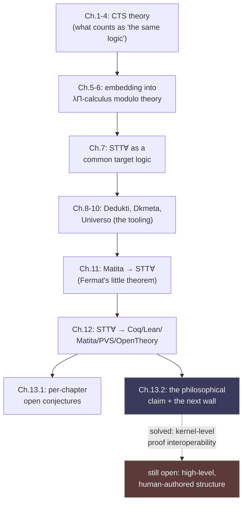
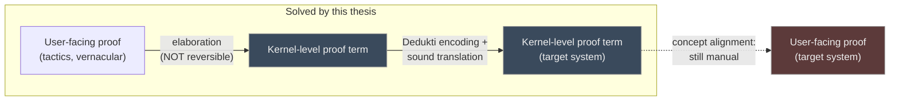

[[book-guidelines|↩ Back to guidelines]]

# Philosophy and Future of Interoperability

## Why a thesis needs a chapter that isn't a new result

Every other chapter in this book proves something: a soundness theorem, an equivalence, a working translation of a real proof through five systems. Chapter 13 proves nothing new. Its job is different — step back from the machinery and ask two questions that the machinery itself can't answer. First, a *scoping* question: for each open conjecture left dangling in Chapters 2–12, exactly what would closing it require, and does the thesis's own apparatus (well-structured derivation trees, the free CTS, bi-directional typing) already contain the tools to close it? Second, a *framing* question, much bigger than any single conjecture: why does software engineering have interoperability standards everywhere — networking, programming languages, document formats — while formal proof libraries, forty years into the field, still mostly don't? And if the thesis's central technical claim (proof-level interoperability, via a shared logical framework) is right, what's the *next* wall it runs into?

That second question is worth sitting with before the chapter's details, because it reframes everything that came before it. Chapters 1–12 built a pipeline: Cumulative Type Systems as a common meta-theory, an embedding into $\lambda\Pi$-calculus modulo theory, Dedukti as the concrete kernel, Dkmeta and Universo as the tooling, and a working export of Fermat's little theorem to five proof assistants. It would be easy to read that pipeline as "solving" interoperability. Chapter 13's second half argues, carefully, that it solves *one* layer of the problem — the kernel layer — and that a second, harder layer sits directly on top of it, untouched by anything in Chapters 1–12.

**What breaks without this chapter.** Without it, the thesis reads as a closed technical artifact: here is a translation pipeline, here is a theorem, done. Chapter 13 is what stops a reader from over-claiming on the author's behalf — it draws the boundary around what was actually shown (kernel-level, proof-term interoperability) and names, explicitly, the boundary the thesis does *not* cross (the high-level, human-authored structure of a library). That boundary is the single most important thing to carry away from the whole book, and it only gets stated here.

## Part 1 — the future-work ledger: what's actually still open

Section 13.1 walks back through every chapter and states, precisely, what remains unproven. This is worth reading closely rather than skimming, because it is not boilerplate "more work could be done" — each item names a *specific* conjecture, and in several cases sketches exactly what proving it would require.

**Chapter 2 (embeddings).** The judgment-embedding decision procedure (Section 2.3) is *incomplete*: it can say "yes, embeddable" but a "no" from the procedure doesn't mean "not embeddable." Recovering completeness needs Conjectures 4 and 5 — the existence of a **canonical derivation tree**. Concretely: Conjecture 4 says derivation trees form a join-semilattice under a partial order (so any two derivations of the same judgment have a well-defined least upper bound); Conjecture 5 says that order is well-founded (so you can't have an infinite descending chain of "more general" derivations). Together, those two facts are exactly what you'd need to pick out *the* canonical, most-general derivation tree for a judgment — which is what the free-CTS-based decision procedure is implicitly trying to approximate.

**Rust framing.** This is the shape of a *unification* completeness argument: a join-semilattice with a well-founded order is precisely the structure that guarantees a most-general unifier exists and that a unification algorithm searching "upward" through that order terminates. If you've implemented Hindley-Milner and proven termination via a well-founded decrease measure on substitutions, Conjecture 5 is asking for the same kind of artifact, just over derivation trees instead of type substitutions.

**Chapter 3 (well-structured derivation trees).** The chapter's central conjecture — that *every* derivation tree is well-structured (Conjecture 9) — is still open, backed only by empirical evidence (every derivation tree the thesis actually built turned out to satisfy it). If true, it hands you a new induction principle for free: well-structuredness gives derivation trees a **minimal level**, and the chapter flags that the *meaning* of that minimal level — what it measures about a judgment's underlying complexity — is itself unexplored territory.

**Chapters 4–7 (bi-directional CTS, PTS modulo, the CTS encoding, STT∀).** Each carries its own dangling conjecture, and they compound: whether *every* CTS specification is weakly equivalent to one in normal form (Ch. 4) would let the bi-directional/ordinary CTS equivalence (Theorem 4.3.9) apply unconditionally instead of only to "normal" specifications; whether well-structuredness (Ch. 3) can be used to *prove* injectivity of products (Ch. 5) — currently an assumption baked into the CTS-encoding soundness proof, not a derived fact; whether the CTS-encoding proof (Ch. 6) can be reformulated to route through Chapter 3's typed/untyped conversion equivalence instead of assuming well-structuredness directly, and whether that encoding is *complete* as well as sound (an open question the thesis explicitly leaves for someone to check against Ali Assaf's completeness proof for plain PTS); and whether STT∀'s completeness (conjectured, argued informally in Chapter 9, never proof-checked) can be closed. Notice the pattern: **well-structuredness, introduced almost as a technical lemma in Chapter 3, turns out to be the load-bearing assumption threading through nearly every later soundness result.** Resolving Conjecture 9 wouldn't just tidy up Chapter 3 — it would remove a hypothesis from theorems in Chapters 4, 5, and 6 simultaneously.

**Chapters 8–12 (the software).** These items are engineering roadmaps rather than open conjectures: Dkmeta could be extended to rewrite Dedukti's top-level commands (not just terms), to let users define their own quote/unquote mechanism instead of hard-coding it, and — most suggestively — to implement **metavariables**, turning Dkmeta from a pure rewriting tool into something closer to a *refiner* that fills in user-left holes. Universo's bottleneck is squarely the SMT-solving step (Z3 has scaled to comparable problems for F\*, so the ceiling isn't fundamental, but the current constraint generation isn't exploiting library modularity to split problems into smaller, independently-solvable pieces). Chapter 11's Matita-to-STT∀ pipeline has only really been exercised end-to-end on Matita; Universo has separately been tried against Coq-derived proofs, and Dkmeta has separately translated a Chapter-9-style Higher-Order-Logic embedding into STT∀ — but the *combined* pipeline as a reusable, general-purpose tool (rather than a bespoke script tuned to Matita's arithmetic library) doesn't exist yet, and the chapter names Logipedia as a plausible home for a real user-facing interface to it.

Chapter 12's item deserves its own pause, because it's the direct technical seed for Section 13.2's argument: **concept alignment** is unsolved. When Dedukti exports natural numbers, it doesn't export the target system's `nat` — it exports a type declaration, two constructor declarations, and an axiom standing in for the induction principle, because inductive types are *axiomatized*, not natively represented, in the encoding. A human (or a very careful script) has to manually recognize "this axiomatized structure is what my system calls `nat`" and rewire the proof to use the real, library-native definition instead. The proposed fix — record implicit arguments and notations as metadata, and translate the metadata alongside the proof term — is future work, not something Logipedia does today.

## Part 2 — why formal proofs are the exception, and what's next

Section 13.2 opens with an observation that's almost embarrassing once you say it out loud: **essentially every other layer of computing has converged on interoperability standards, and formal proof has not.** Two machines running entirely different operating systems exchange bytes over TCP/IP without either side knowing anything about the other's internals. A C object file links against OCaml-compiled code, or the two communicate over the filesystem, without either language's compiler needing to understand the other's type system. Pandoc turns Markdown into LaTeX into HTML, freely, because document *structure* — headings, lists, emphasis — was standardized independently of any one renderer. None of these required "one universal system that does everything." They required a shared, lower-level substrate that different systems could each honestly translate into and out of.

Formal proof libraries never got that substrate. The thesis names the one serious historical attempt — the **QED manifesto**, a 1993 proposal to build a single, universal, computer-checked repository of all of mathematics — and its fate: it generated discussion for three years and produced no lasting infrastructure. Interoperability between proof assistants acquired, in the decades since, "the reputation of being an impossible problem" (the chapter's own phrase).

The thesis's answer to *why* QED-style top-down unification failed, and what should replace it, is the book's real thesis statement, distilled to one sentence: **independently built proof libraries look structurally similar because the logics underneath them are similar** — not identical, but similar enough to share a common meta-theory (Cumulative Type Systems), which is exactly the empirical premise the whole thesis was built to formalize and exploit. Where QED tried to impose one universal system from above, this thesis's strategy works from below: find the shared structure that already exists, build a framework (CTS) precise enough to characterize *how* different systems' logics relate to each other, and use that relationship to drive translation. The Fermat's-little-theorem export — one proof, five target systems, semi-automated — is offered as the empirical demonstration that this bottom-up strategy actually produces something QED never did: a working artifact, not a position paper.

**Lean framing.** If you've ever compared Lean's kernel to Coq's, you've felt this similarity directly: both are, at bottom, variants of the Calculus of Constructions with cumulative universes, differing mostly in surface-level conveniences (Lean's `noncomputable`, elaboration order, universe polymorphism defaults) rather than in what's actually *provable*. Chapter 1's $C_3$ specification — the CTS that both Coq's and Lean's specifications turn out to be supersets of — is the formal version of exactly that felt-similarity. Section 12.1's sort-morphism export (a specification-level, no-type-checking-required translation, covered in [[Exporting-Proofs-Across-Proof-Systems]]) is only *possible* because Chapter 1 correctly diagnosed that similarity as a genuine subtyping relationship, not a coincidence.

The chapter's forward-looking claim then has two parts, and it's important to keep them separate. The first is a *scaling* claim: the Fermat export is "a first step before conducting interoperability at a larger scale," and the chapter names real targets — the Mathematical Components library, the Mizar library, the Archive of Formal Proofs — as the next tests of whether the pipeline generalizes past one arithmetic theorem. That's a claim about more engineering, more Universo runs, more Dkmeta passes; nothing conceptually new.

The second part is where the chapter earns its place as a genuine conclusion rather than a to-do list, because it names a problem the thesis's whole approach *cannot* reach. Everything Dedukti translates is **kernel-level**: raw proof terms, fully elaborated, with every implicit argument filled in and every notation expanded away. But no one actually *writes* a formal proof at that level. A Coq user writes tactic scripts and vernacular commands; a HOL-Light user writes OCaml driving the LCF-style kernel; an Agda user writes dependently-typed source code interactively, guided by the editor filling in holes. These high-level languages aren't decoration — they carry structure (what's a definition vs. an axiom vs. a derived lemma, what a name refers to in a library, what's implicit vs. explicit) that the kernel-level proof term simply does not preserve, because the whole point of elaboration is to erase exactly that structure down to something a trusted checker can verify mechanically. Translating proof terms through Dedukti's kernel, however sound, therefore produces something a human would never voluntarily write — which is precisely what concept alignment (Chapter 12, revisited here) is a symptom of.

That's the chapter's closing claim, stated almost as directly as a thesis can state anything: **kernel-level proof-term interoperability, however completely solved, does not by itself deliver interoperable libraries** — because a library isn't a proof term, it's the high-level language plus the structure that language encodes. That gap is named as "the last big piece missing in the puzzle of interoperability between proof systems."

**Python framing.** The gap is the same one you'd hit trying to interoperate two Python codebases at the *bytecode* level instead of the source level. Bytecode from two different Python versions, or two different compilation pipelines, can in principle be made semantically equivalent — but no one wants a `.pyc` diff; they want to read and edit the `def` and the docstring. Translating bytecode preserves behavior while destroying exactly the structure a human needs to work with the result. Dedukti's kernel-level export is the formal-proof analogue of shipping compiled bytecode across languages and calling the interoperability problem solved.

## Where this leads

This chapter is the thesis's own map of its boundary, and it's worth internalizing both halves of that map. Section 13.1's ledger is a checklist of exactly which load-bearing assumptions (well-structuredness above all) are still conjectural rather than proven — useful to know before leaning on any single result (say, the CTS-encoding soundness theorem of [[Encoding-CTS-Into-LambdaPi-Calculus-Modulo-Theory]]) as more than "sound modulo Conjecture 9." Section 13.2's argument is the reason the whole book bothered with a uniform meta-theory (Cumulative Type Systems, [[Cumulative-Type-Systems-(CTS)]]) instead of writing one bespoke translator per pair of systems — and simultaneously the reason that meta-theory, however successful, isn't the end of the interoperability story.

For the **automated-reasoning** thread this book feeds: the kernel/surface split this chapter names precisely is the same split that shows up wherever a **trusted kernel** sits underneath a rich, structured, user-facing language — LCF-style tactic engines, SMT solvers emitting low-level resolution proofs that a separate checker replays, Coq's kernel versus its vernacular. **Proof reconstruction** — rebuilding a checkable, structured derivation from a compressed or low-level proof trace — is exactly the problem Chapter 13 says Dedukti-based interoperability doesn't solve, only relocates: instead of reconstructing a proof from a trace, you'd be reconstructing library-level structure (definitions, implicit arguments, notations) from an axiomatized kernel term. Any system you build that produces **proof certificates** meant for external consumption inherits this same gap by default, unless you deliberately carry structure alongside the certificate rather than erasing it at emission time — which is the metadata-preserving fix Chapter 12 sketches and Chapter 13 endorses as the way forward.
