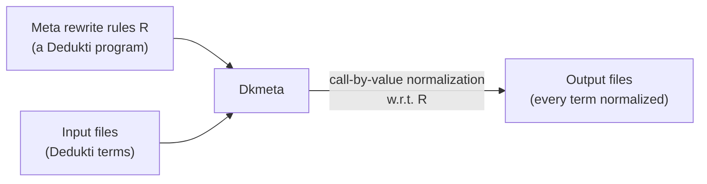
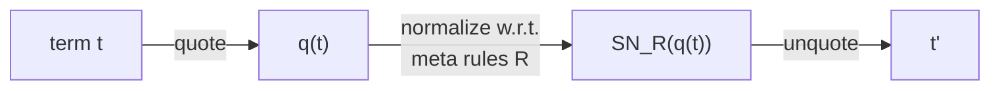
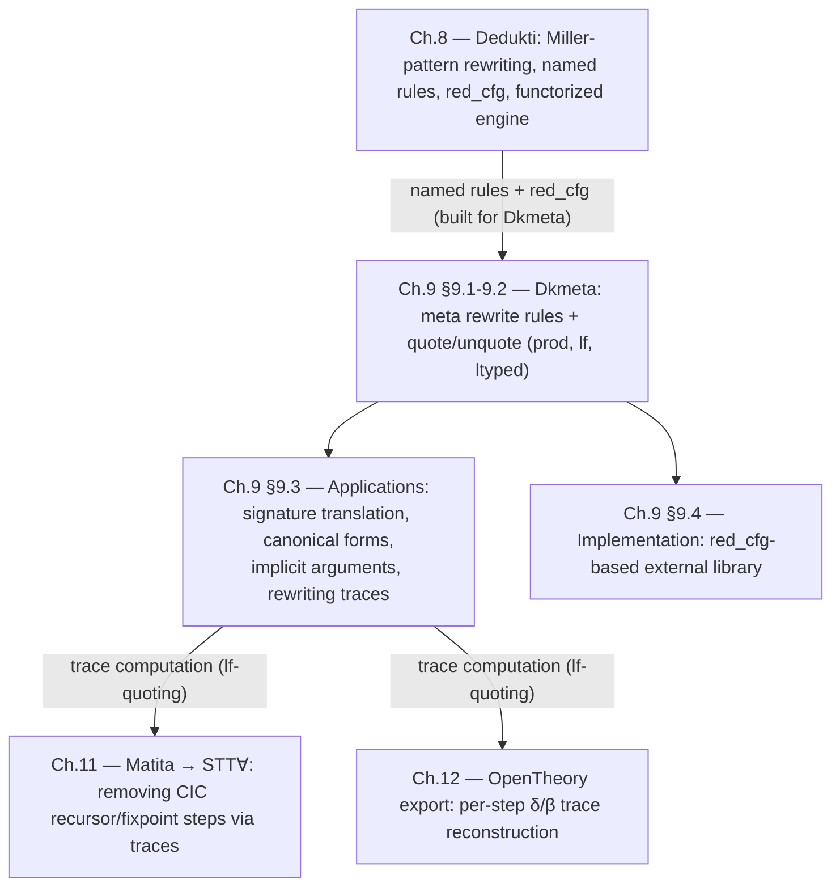

[[book-guidelines|↩ Back to guidelines]]

# Rewriting as a Meta-Programming Language (Dkmeta)

## The problem: proof transformations need a host language, and OCaml is the wrong one

Every interoperability pipeline in this thesis eventually needs to *transform* proof terms: translate a signature, strip out definitions that only existed to make an encoding readable, insert or remove implicit arguments, compute a canonical shape for a term before exporting it. Chapter 8 gave you Dedukti as a trusted, decidable re-checker; this chapter asks a different question — what language do you write the *transformations themselves* in?

The naive answer is "OCaml, since that's what Dedukti's kernel is written in." Thiré rejects this for three concrete reasons, and each one is worth sitting with because they generalize past this one thesis:

1. **Binders are painful in a first-order host language.** OCaml represents a Dedukti term as an ordinary algebraic data type, so a `λx. body` has to be encoded somehow — de Bruijn indices, or named variables with capture-avoidance machinery bolted on. Either way, every transformation that touches a binder now has to re-derive the capture-avoiding substitution logic that the *target* language (Dedukti) already has built in.
2. **You can't match on Dedukti structure directly.** A transformation that wants to say "if this is a product type, do X" has to walk OCaml's own AST type, not Dedukti's actual term structure — an unnecessary layer of indirection between the tool and the thing it's transforming.
3. **Modularity with respect to the logic is expensive.** If a translation is parameterized over which logic it's translating (the CTS-vs-STT∀ signature choice, say), a small change to that logic in OCaml means editing and recompiling the OCaml program. A translation written as *data* — rewrite rules in a file — can be swapped without touching a compiler at all.

**What breaks without a fix here:** you'd end up reimplementing, badly, inside OCaml, exactly the substitution and pattern-matching machinery that Dedukti's kernel already implements correctly and efficiently. Every proof-transformation tool in this space would carry its own private, unverified copy of capture-avoiding substitution — a duplicated trusted component in a project whose entire point is minimizing what has to be trusted.

## The idea: use Dedukti's own rewrite engine as the meta-language

Cauderlier had already shown a version of this idea works — using definable symbols as stand-ins for meta-variables (a hole for a proof term), with a user manually asking Dedukti to normalize a meta-variable and copy the result back into the source file [Cau16b][Cau18]. Thiré's move is to push this further and automate it fully: rather than writing transformations *about* Dedukti terms in a separate host language, write them *as* Dedukti rewrite rules, and let Dedukti's own kernel do the rewriting. This is **meta rewriting**, and the tool built around it is **Dkmeta**.

Concretely: **Dkmeta is a Dedukti program — a set of rewrite rules, called *meta rewrite rules* — applied to normalize a set of input files.** The rewrite rules aren't the object-level theory being checked; they're a transformation *on* whatever object-level terms are handed to Dkmeta. Given no meta rules at all, Dkmeta degenerates to ordinary normalization with respect to whatever rules the input files themselves declare.



**Grounding — this is source-to-source rewriting with the target language's own semantics as the rewrite engine.** The closest everyday analogue is a Rust `macro_rules!` or procedural macro operating on `TokenStream`/`syn::Expr` — except Dkmeta's "macros" match against fully elaborated, typed terms in the *same* calculus being transformed, using the same notion of reduction (β plus the object theory's own δ-rules) the kernel already implements, rather than a separate macro-expansion pass bolted onto the side.

```python
# The shape of what Dkmeta automates, sketched in Python for intuition only:
# a rewrite-rule interpreter closing over the SAME substitution/matching
# logic used to run the object program, rather than a bespoke AST walker.
def dkmeta_normalize(term, meta_rules):
    while True:
        for lhs, rhs, subst in match_any_rule(term, meta_rules):
            term = apply_substitution(rhs, subst)
            break
        else:
            return term  # no rule applies: strong normal form reached
```

Two properties of this normalization loop matter and are stated plainly in the chapter: it uses a **call-by-value** strategy and computes the **strong normal form** if one exists, and — crucially — **Dkmeta does not check that the meta rewrite system it is given is confluent or terminating**; that responsibility is left entirely to the user (Chapter 8's discussion of Dedukti's own honesty about unconvergent theories applies here too, but by design rather than as a regrettable gap: a meta-language that could only use convergent rewriting would be far less expressive).

## Worked example: collapsing a huge CTS-encoded term into something readable

The motivating case picks up exactly where Chapter 6's CTS encoding left off: encoding even a small CTS judgment like $\vdash_C \lambda x{:}\Box.\,x \Leftarrow \Box \to \triangle$ produces a large, deeply nested term built from `cts.cast`, `cts.prod`, `cts.univ`. Normalizing it directly collapses the term, but the normal form sits *outside* the CTS's public signature — exactly the kind of term you don't want appearing in an interoperable proof.

Dkmeta's answer is to introduce **shortcut definitions** for the recurring universe/product/cast combinations that show up in a given signature —

```
def U0 := cts.Univ star.
def U1 := cts.Univ box.
def u0 := cts.univ star box cts.I.
def pi00 := cts.prod box box box cts.I u0 (__ => u0).
```

— and then to use their *reverses* as meta rewrite rules:

```
(; meta rewrite rules ;)
[] cts.Univ star --> U0.
[] cts.univ star box cts.I --> u0.
[] cts.prod box box box cts.I u0 (__ => u0) --> pi00.
```

Applying this meta rewrite system to the huge elaborated term produces a genuinely small one:

```
def id : cts.Term triangle pi01 := castpi00pi01 (x : U0 => x).
```

This is the *first* concrete payoff of meta rewriting: definitions that would be awkward to hand-write directly in the target tool's output (because the tool generates raw `cts.*` combinators, not human-chosen names) can be introduced after the fact, purely as a rewriting pass, with no change to whatever produced the original term.

But there's a sharper problem lurking, and it's the one that motivates the rest of the chapter. Suppose instead the user had defined `def tpi01 := U0 -> U1.` — using Dedukti's own product arrow directly rather than the `cts.prod` combinator. Reversing this into a meta rule,

```
[] U0 -> U1 --> tpi01.
```

**is not a legal Dedukti rewrite rule at all**, because a product `(x : A) → B` cannot appear inside a pattern (recall Chapter 8's Definition 8.1.1: a pattern's outermost form must be a definable symbol applied to arguments — `->` is not a definable symbol, it's a term former baked into the calculus itself). This is the gap that motivates Dkmeta's central mechanism.

## Quoting and unquoting: giving the pattern language eyes it doesn't natively have

**What breaks without this:** any transformation that needs to match against a *syntactic* feature of a term — "is this literally a product," "is this literally an application of two variables," "what is this subterm's type" — has no way to express that as a Dedukti rewrite rule, because Dedukti's pattern language (Miller's fragment, per Chapter 8) is deliberately restricted to keep matching decidable and fast, and that restriction excludes exactly these constructs.

The fix, borrowed from Lisp's quoting tradition [Ste90], is to introduce a **quote function** $\lceil \cdot \rceil$ that maps an ordinary term into a *different* term — one built entirely from ordinary definable-symbol applications — in which the feature you want to match against (a product, an application, a type annotation) has been made explicit as a symbol occurrence, and hence matchable. An **unquote function** inverts this after rewriting.



This is Figure 9.1 redrawn: the actual meta rewriting happens entirely *inside* the quoted representation, where ordinary Dedukti pattern matching is expressive enough to see what the quoting has made explicit; unquoting then hands back an ordinary term. Three quoting functions are provided, each strictly more expressive — and strictly more expensive to compute — than the last.

### `prod`: quoting only products

The narrowest quote function, $\lceil \cdot \rceil_p$, makes only products (and the sort `Type`) matchable, leaving everything else structurally unchanged:

$$
\begin{aligned}
\lceil \mathit{cst} \rceil_p &:= \mathit{cst} \\
\lceil x \rceil_p &:= x \\
\lceil ? \rceil_p &:= \mathit{ty} \\
\lceil f\,a \rceil_p &:= \lceil f \rceil_p\,\lceil a \rceil_p \\
\lceil \lambda x{:}A.\,t \rceil_p &:= \lambda x{:}\lceil A \rceil_p.\,\lceil t \rceil_p \\
\lceil (x{:}A) \to B \rceil_p &:= \mathrm{prod}\ \lceil A \rceil_p\ (\lambda x.\,\lceil B \rceil_p)
\end{aligned}
$$

Only the last clause actually does work: a product becomes an ordinary application of the definable symbol `prod` to its (quoted) domain and a $\lambda$-abstraction over its (quoted) codomain — now a legal pattern head. Applied to the Leibniz-equality example from earlier chapters, `A : type -> eta A -> eta A -> eta bool` becomes `prod.prod type (A:type => prod.prod (eta A) (__:(eta A) => ...))` — same term, up to unquoting, but now every product boundary is visible to a rewrite rule's left-hand side.

### `lf`: full syntactic pattern matching

The second function, $\lceil \cdot \rceil_l$, goes further: **every** constructor gets prefixed with a tag symbol (`sym`, `db`, `app`, `lam`, `prod`), so the matching becomes purely syntactic — not modulo β at all:

$$
\begin{aligned}
\lceil \mathit{cst} \rceil_l &:= \mathrm{sym}\ \mathit{cst} \\
\lceil x \rceil_l &:= \mathrm{db}\ x \\
\lceil f\,a \rceil_l &:= \mathrm{app}\ \lceil f \rceil_l\ \lceil a \rceil_l \\
\lceil \lambda x{:}A.\,t \rceil_l &:= \mathrm{lam}\ \lambda x{:}\lceil A \rceil_l.\,\lceil t \rceil_l \\
\lceil (x{:}A) \to B \rceil_l &:= \mathrm{prod}\ \lceil A \rceil_l\ \lambda x.\,\lceil B \rceil_l
\end{aligned}
$$

This is what lets a meta rule match against, say, "an application whose head is exactly the symbol `f`" as a syntactic fact rather than something only visible after some amount of computation — the price is a term whose size grows with every subterm, since every node picks up a wrapper symbol, which makes `lf`-quoted terms slower for Dkmeta to normalize than `prod`-quoted ones.

### `ltyped`: quoting with type annotations

The third function, $\lceil \cdot \rceil^{a}_{\Gamma}$, is `lf` plus one more thing: every application `f a` is annotated with the (quoted, via `prod`) type of `f`, computed by consulting Dedukti's own type checker:

$$
\lceil f\,a \rceil^a_\Gamma := \mathrm{app}\ \lceil (x{:}A) \to B \rceil_p\ \lceil f \rceil^a_\Gamma\ \lceil a \rceil^a_\Gamma \qquad \text{where } \Gamma \vdash_D f : (x{:}A) \to B
$$

This is the only one of the three that needs a type checker at all, and the chapter is candid about the cost: applied to the Leibniz example, the term's size explodes — the worked-out quoted term for a four-line definition sprawls across nearly two pages of the thesis. The reason to pay this cost is that some transformations genuinely need to know a subterm's type to decide how to rewrite it (e.g. inserting implicit-argument placeholders correctly requires knowing what type is expected), and no amount of syntactic-only matching (`lf`) can recover that information if it isn't already present in the term itself.

**Grounding — a design axis every embedded DSL/macro system faces.** The prod/lf/ltyped ladder is a concrete instance of a trade-off that recurs anywhere you build a pattern-matching layer over an existing representation: match against a *coarse* structural view (fast, less expressive — `prod`), match against the *full concrete syntax tree* (slower, syntactic — `lf`), or match against a *typed, elaborated* view (slowest, most expressive — `ltyped`). Rust's own procedural-macro ecosystem draws exactly this line between `TokenStream`-level macros (syntactic, fast, no type information) and attribute macros that need to run after some type inference to be useful. In a Lean-style elaborator, this is the same distinction between working with pre-elaboration `Syntax` versus post-elaboration `Expr` carrying full type annotations — `ltyped` quoting is Dkmeta's version of "I need the elaborated view, not just the parse."

```rust
// The prod/lf/ltyped ladder, shaped as three progressively more
// informative views over the same underlying term.
enum QuotedTerm {
    // `prod`: only product boundaries are visible
    Prod(Box<QuotedTerm>, Box<dyn Fn(Var) -> QuotedTerm>),
    Opaque(Term), // everything else passed through unchanged

    // `lf`: every constructor is tagged -- full syntactic view
    Sym(Symbol),
    Db(Var),
    App(Box<QuotedTerm>, Box<QuotedTerm>),
    Lam(Box<QuotedTerm>, Box<dyn Fn(Var) -> QuotedTerm>),

    // `ltyped`: `lf` plus the callee's inferred type at each application
    TypedApp(ProdType, Box<QuotedTerm>, Box<QuotedTerm>),
}
```

## Applications: what meta rewriting actually buys you

Section 9.3 works through three uses, each a direct payoff of one of the mechanisms above.

### Translating between the STT∀ and CTS signatures

Chapter 8 gave STT∀ two encodings: a direct, hand-built one (§8.2) and, via Chapter 7's proof that STT∀ is a CTS instance, an indirect one through the generic CTS encoding (§8.3). Dkmeta can compute the translation between them as an ordinary (non-quoted) meta rewrite system — no quoting needed here, because both signatures are built from definable-symbol applications already:

```
[] sttfa.type --> cts.Term cts.triangle (cts.univ cts.box cts.triangle cts.I).
[] sttfa.bool --> cts.univ cts.star cts.box cts.I.
[A,B] sttfa.arrow A B --> cts.prod cts.box cts.box cts.box cts.I A (x => B).
[A,B] sttfa.forall A (x => B x) --> cts.prod cts.box cts.star cts.star cts.I A (x => B x).
```

The reverse direction — CTS back to STT∀ — is, in the easy cases, literally these same rules read right-to-left. The chapter is careful to flag that this reversal is not free: it's easy to see the forward direction defines a *total* function on the STT∀ signature, but proving the same for the reverse direction relies on a specific structural fact about STT∀'s CTS specification (its sort $\diamond$ has exactly one inhabitant). Reversibility of a rewrite system is a property that has to be argued for, not assumed just because the forward direction happened to type-check.

### Computing canonical forms with `prod`-quoting

This is where the `prod` quote function earns its keep, and it directly resolves the `U0 -> U1` problem from the worked example above. The STT∀ rules that *interpret* type codes as actual types —

```
[a,b] etap (p (arrow a b)) --> eta a -> eta b.
[f]   etap (forallK f)     --> x: type -> etap (f x).
```

— are, read right-to-left, exactly the rules you'd want to compute a **canonical representation**: the STT∀/CTS form of a term that contains *no raw Dedukti products at all*, only STT∀-signature symbols. But the right-hand sides are products, which can't head a pattern. Quoting solves this directly — quote both sides with `prod`, and the previously-illegal inverse rules become legal, because every product is now the definable symbol `prod.prod`:

```
[a,b] prod.prod (eta a) (x => eta b)    --> etap (p (arrow a b)).
[a,b] prod.prod (type) (x => eta (f x)) --> etap (forallK (x => f x)).
```

Why bother with a canonical form at all? Two reasons the chapter gives explicitly: (1) a term with no raw products is, by construction, in the image of the CTS-to-STT∀ translation — it's expressed purely in terms the target logic actually recognizes as its own vocabulary, which matters when the whole point is exporting to another system; and (2) the term's *head* symbol now tells you immediately whether you're looking at a type (`eta ...`) or a proposition (`eps ...`), a syntactic litmus test that's useless on a raw, un-canonicalized product.

Applied to Leibniz equality, the canonical form of the type collapses to `etap (forallK (A => arrow A (arrow A bool)))` — legible, signature-pure, and computed by nothing more than ordinary Dkmeta normalization over a handful of inverted, `prod`-quoted rules. The chapter notes this technique generalizes to the full CTS encoding too, at the cost of one extra wrinkle: inverting a rule like `Term _ (prod s1 s2 _ a b) --> x:Term s1 a -> Term s2 (b x)` requires computing a *new sort* `s3` from `s1`, `s2` via a user-supplied function symbol `rule`, since the CTS relation may not deterministically fix the resulting sort — and canonical forms aren't always unique in the first place: a non-functional CTS (where $(s_1,s_2,s_3)$ and $(s_1,s_2,s_4)$ can both hold) genuinely admits two different canonical representations of the same product type.

**Notation note — this is Miller's pattern fragment doing real work.** The pattern `x => Term s2 (b x)` in the last rule uses the full expressivity of the higher-order local variables from Chapter 8: `b` is a pattern variable applied to the bound variable `x`, exactly condition 4/5 of Definition 8.1.1. Nothing here is a new mechanism — it's the same decidable-matching machinery from the object-level kernel, reused unmodified at the meta level. This is the concrete instance of a thread worth keeping in view for an elaborator project: computing a canonical/normal *type* representation from a raw, product-containing type is structurally the same problem an elaborator's unifier faces when it needs to expose a metavariable's expected type in a form its instantiation heuristic can pattern-match against.

### Implicit arguments via meta rewriting

Take the Leibniz example once more, but now written with wildcards standing in for arguments the user shouldn't have to supply by hand:

```
def leibniz : A : type -> eta A -> eta A -> eta bool :=
A => x => y => forall _ (P => impl (P x) (P y)).
```

Dedukti's own type checker can already infer the types of `A`, `x`, `y` from `leibniz`'s declared type, and can even infer a type for `P` by type-checking the body — but *instantiating the wildcard* `_` (call it a metavariable `?1`) is genuinely hard: Dedukti would need to solve `eta ?1 =? eta nat -> eta bool` for `?1`, which means literally guessing that `?1` should be `arrow nat bool` — a unification problem outside anything Dedukti's kernel is designed to solve on its own.

The canonical-form technique from the previous section supplies the missing piece: the canonical representation of `eta nat -> eta bool` is exactly `eta (arrow nat bool)`, computable by the same `prod`-quoted meta rules already built. Given that, and given that `eta` is injective in the STT∀ encoding (an object-level property Chapter 8 already relies on for static symbols), the equation `eta ?1 = eta (arrow nat bool)` becomes solvable by simple injectivity, without touching Dedukti's kernel or implementing a real unification algorithm at all. Pushed one step further, Dkmeta can also automate inserting the wildcards themselves, imitating Coq's own implicit-argument convention by declaring two symbols — an implicit-arguments-elided `forall` and a fully explicit `@forall` — connected by one meta rule:

```
[P] forall P --> @forall _ P.
```

**Why this matters for the standing elaboration project.** This is the chapter's most direct hit on the `type-theory` and `automated-reasoning` focus areas: it is, in miniature, exactly the metavariable-instantiation problem a bidirectional elaborator's unifier solves for implicit-argument resolution — except here the "unification algorithm" is nothing more exotic than *type-directed rewriting to a canonical form plus injectivity of a static symbol*. The chapter is explicit that this buys real simplicity: no kernel change, and the resulting unification behavior is "predictable and very simple," precisely because it never leaves the Miller-pattern-matchable, first-order-decidable world that Chapter 8 built. A real elaborator's unifier will usually need more than this (genuine higher-order pattern unification, not just injectivity-of-a-constructor), but the shape of the trick — reduce "guess a metavariable" to "compute a canonical/normal form and read off the answer by injectivity" — is a real, reusable design pattern, not a toy simplification specific to this one example.

### Computing rewriting traces

The last application needs the `lf` quote function specifically, because it must match against a **syntactic application** — a thing `prod`-quoting alone doesn't expose. The motivating need: knowing that two terms $A$ and $A'$ are convertible is not always enough; you sometimes need to know *how* — a trace of which rule fired, where, under what substitution, on which side. Two concrete downstream uses are named: removing recursor/fixpoint-encoding rewrite steps when translating Calculus of Inductive Constructions proofs into STT∀ (this recurs in the Chapter 11 case study), and reconstructing per-step $\delta$/$\beta$ justifications when exporting a proof to OpenTheory (Chapter 12).

The chapter argues explicitly for doing this *outside* the kernel rather than instrumenting Dedukti's reduction engine directly: instrumentation slows down the common case (most rewriting doesn't need a trace), requires deep familiarity with the engine's internals to implement correctly, and is fragile — liable to break the next time the engine changes internally (e.g. by introducing more term sharing). Since performance is not the bottleneck when a trace is actually being computed, pushing the whole computation into Dkmeta-as-meta-program is the better trade.

The mechanism is a small, elegant two-stage rewrite system built entirely from `lf`-quoted terms. `get_context` introduces a fresh hole variable `h` and recurses structurally:

```
[h,t,t'] get_context t t' --> lf.lam (h => get_context' h t t').
[h,t]    get_context' h t t --> t.
[h,f,f'] get_context' h (lf.lam (x => f x)) (lf.lam (x => f' x))
            --> lf.lam (x => get_context' h (f x) (f' x)).
[h,f,f'] get_context' h (lf.prod A (x => B x)) (lf.prod A' (x => B' x))
            --> lf.prod (get_context' h A A') (get_context' h B B').
[h,f,f'] get_context' h (lf.app f a) (lf.app f' a')
            --> lf.app (get_context' h f f') (get_context' h a a').
```

Given two terms that differ by exactly one rewrite step, this walks both structures in lockstep — the `t t --> t` rule fires wherever the two terms already agree, so what survives normalization is precisely the (unique, since the two inputs differ by one step) subterm where they diverge, wrapped in an `lf.lam (h => ...)` binding a hole at exactly that position. A second rewrite pass, `get_context' h t t' --> h`, replaces that remaining instance with the hole variable itself, leaving a genuine higher-order function representing "the syntactic context both terms share." Nothing here manipulates de Bruijn indices or explicit substitution machinery directly — the higher-order rewriting does that bookkeeping implicitly, which the chapter flags as a real advantage of doing this in Dkmeta rather than by hand in OCaml.

## Implementation: from forked kernel to parameterized library

Dkmeta's implementation history is itself an argument for a design principle worth generalizing. It started as a **fork** of Dedukti — an independent reimplementation forced to re-merge every upstream Dedukti change by hand, a maintenance burden that scales badly. The fix was to make **minor, targeted modifications to Dedukti's own kernel** so that Dkmeta could instead be built as an **external library** consuming Dedukti's public interface.

The key kernel addition is a configuration record, `red_cfg`:

```ocaml
type red_cfg = {
  select    : (Rule.rule_name -> bool) option;
  target    : red_target;
  beta      : bool;
  (* ... *)
}
```

`select` lets the caller restrict *which* named rules the reduction engine is allowed to use — necessary because Dkmeta needs to distinguish "rules for type-checking the object file" from "meta rules for the transformation," a distinction Dedukti had no vocabulary for before. `target` fixes what kind of normal form is being asked for (Dkmeta always requests `Snf`, the strong normal form). `beta` lets the caller disable $\beta$-reduction entirely. This configuration flows into a single library entry point:

```ocaml
val unsafe_reduction : t -> ?red:(Reduction.red_cfg) -> term -> term
(** reduces [te] according to [red]; "unsafe" because [te] is not
    type-checked first. *)
```

A second kernel addition, the `fail_on_symbol_not_found` flag, is smaller but practically important: it lets Dkmeta treat any symbol absent from the current signature as an implicitly-declared static symbol rather than raising an error — a convenience that matters because meta rewrite rules are routinely written against signatures that don't fully exist as standalone Dedukti files.

On top of this, Dkmeta's own library exposes a `cfg` record bundling the meta rules, the $\beta$-toggle, an optional quoting-function module, and the current Dedukti environment, plus two entry points: `meta_of_rules` (install a set of meta rules into a configuration) and `mk_term` (actually normalize a term under that configuration). The layering is clean and worth internalizing as a pattern in its own right: **kernel exposes a parameterized reduction primitive; the meta-programming tool is a thin library built entirely on top of that primitive, with zero forked or duplicated kernel logic.**

**Grounding — this is the strategy pattern, made concrete as a config struct injected into a reduction function**, rather than a hardcoded algorithm baked into the engine:

```rust
struct RedCfg {
    select: Option<Box<dyn Fn(&RuleName) -> bool>>,
    target: RedTarget,      // e.g. Whnf | Snf
    strategy: RedStrategy,  // which subterms get visited, and in what order
    beta: bool,
    logger: Option<Box<dyn FnMut(Position, &RuleName, &Term, &Term)>>,
}

trait RewriteEngine {
    fn reduce(&self, sig: &Signature, cfg: &RedCfg, t: &Term) -> Term;
    fn are_convertible(&self, sig: &Signature, t1: &Term, t2: &Term) -> bool;
}
```
A Rust kernel built this way from the start — reduction as a method taking an explicit strategy object, rather than a single hardcoded WHNF routine — buys exactly what `red_cfg` bought Dedukti: a meta-programming layer, a tracing layer, and a Universo-style patched-convertibility layer (Chapter 8, §8's functorized engine) can all be built as *callers* of the same primitive, never as forks of the kernel itself.

## Dkmeta against the rest of the meta-programming landscape

Section 9.5 places Dkmeta relative to three other systems that occupy the same conceptual niche — "a meta-language for reasoning about or transforming terms of an object type theory" — and the comparison sharpens exactly what Dkmeta is (and isn't) for.

- **$\lambda$Prolog**, used as Coq's meta-language in Coq-Elpi [Tas19], has a genuine capability Dkmeta lacks natively: **backtracking**. Dkmeta can simulate backtracking, but the chapter is candid that doing so is error-prone and easy to get wrong — "writing a non-terminating program is really easy in Dkmeta, especially when one implements a backtracking algorithm." In exchange, Dkmeta permits rewrite rules that are **non-well-typed** and **non-linear**, buying flexibility $\lambda$Prolog's more disciplined setting doesn't offer as directly. The chapter flags a *future* use case — implementing a **refiner** (a tool translating user-facing syntax with elaboration holes into fully explicit kernel syntax) for Dedukti — as the place where the backtracking gap might eventually force a choice between extending Dkmeta or switching wholesale to a $\lambda$Prolog-flavored meta-language.
- **Beluga** [Pie10] extends LF with a meta-language whose terms are *contextual LF objects* — an LF term paired with its own binding context. The purpose is different in kind, not just in mechanism: Beluga's meta layer exists to **prove meta functions correct** (e.g. that a translation from higher-order abstract syntax to de Bruijn representation is faithful), not merely to compute with them. That correctness focus comes at a real cost in expressiveness — writing meta functions in Beluga is harder precisely because the type system is doing more work checking them, a gap that extensions like Cocon [PTA+19] try to narrow.
- **Meta-Coq** (formerly Template-Coq) [ABC+18] quotes Coq terms into an ordinary Coq inductive type and provides coding/decoding functions between the two — structurally the same quoting idea Dkmeta uses, but aimed at a different goal again: **certifying Coq's own type checker**, written as a meta function inside Coq itself, rather than at general-purpose proof transformation for interoperability.

The throughline: Dkmeta trades away correctness-certification machinery (Beluga, Meta-Coq) and built-in search control (λProlog) for something narrower but immediately practical — a lightweight, decidably-matchable rewriting layer, reusing the object kernel's own engine, purpose-built for the specific transformations an interoperability pipeline actually needs to perform.

## Open ends: what Dkmeta doesn't yet do

Section 9.6 is explicit about three gaps, and they're worth naming because they mark exactly where this tool's design is provisional rather than settled:

1. **Quoting functions are hard-coded, not user-definable.** All three quote functions live in Dkmeta's OCaml source; adding a fourth means recompiling the tool. The proposed fix is a *generic* quoting mechanism — informally, "an encoding of Dedukti in Dedukti" via a small signature (`type`, `eta`, `prod`, `var`, `lam`, `app`) from which every concrete quote function, including `prod` itself, could be *derived* as an ordinary meta rewrite system rather than hard-wired OCaml code. A genuinely nice detail: whether a user-defined encoding needs the type checker at all (i.e., whether it's `ltyped`-like or `prod`/`lf`-like) can be determined *statically*, just by checking whether an inferred parameter appears on a rule's right-hand side.
2. **No confluence or termination checking, at all, for meta rewrite systems.** Dkmeta offers no guarantee the user's meta rules behave sanely — flagged as an opportunity to hook in the same external tools Chapter 8 mentioned for object-level theories (confluence checkers like CSI^HO [NFM17] or ACPH [ACP16], the termination checker SCT [BGH19]).
3. **Top-level Dedukti commands aren't first-class.** Dkmeta today only normalizes *terms* — it can't manipulate declarations, rewrite-rule statements, or other top-level constructs as data. Making these first-class is named explicitly as a plausible first step toward eventually implementing a **refiner** for Dedukti directly inside Dkmeta.

## Where this leads



This chapter is the thesis's answer to "how do you actually implement a proof transformation," and it leans entirely on machinery Chapter 8 built for other reasons: Miller's decidable pattern fragment (reused unmodified at the meta level), named rules and `red_cfg` (added to the kernel *specifically* for this chapter's needs), and the general willingness to let Dedukti host non-convergent rewrite systems (a liability at the object level, a feature here). Every later practical chapter that needs a proof transformation reaches for Dkmeta rather than hand-writing OCaml: the Matita arithmetic case study (Chapter 11) uses trace computation to strip inductive-encoding artifacts, and the OpenTheory export (Chapter 12) uses it to reconstruct per-step justifications.

For the standing elaborator project, this chapter's most transferable idea isn't Dkmeta-the-tool but the **pattern** it demonstrates twice over: (a) canonical-form computation via inverted, quoted rewrite rules is a genuinely lightweight way to solve a restricted class of metavariable-instantiation problems by injectivity, without implementing real higher-order unification — a technique worth having in reserve for a bidirectional elaborator's easy cases even after a full Miller-pattern unifier exists for the hard ones (`type-theory`, `automated-reasoning`); and (b) separating "the primitive the kernel exposes" (a parameterized reduction function) from "the tool built on top of it" (Dkmeta as an ordinary library, never a fork) is exactly the architectural discipline a Rust kernel should adopt from the start if it expects to support tracing, meta-programming, or patched convertibility as later, independently-developed layers.
