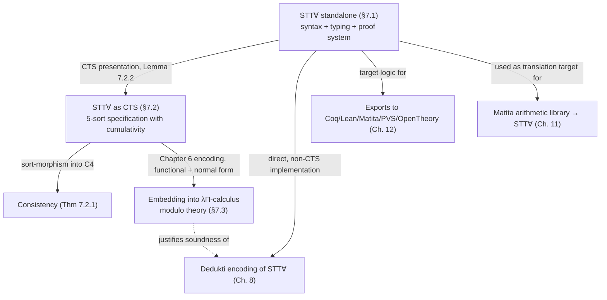

[[book-guidelines|↩ Back to guidelines]]

# STT∀: A Constructive Higher-Order Logic

## Why the thesis needs a target logic at all

Everything up through Chapter 6 has been about *machinery*: a generic notion of type system (CTS), a generic way to say one embeds in another, and a generic encoding of any CTS into the $\lambda\Pi$-calculus modulo theory. None of that machinery, by itself, gives you a place to *land*. If the goal is genuine interoperability — take a real proof out of Matita and hand it to Coq, Lean, PVS, and the HOL family — you need one fixed, modest logic that sits in the middle: something every one of those systems' logics is strong enough to interpret, so that translating *into* it is uniform and translating *out* of it is (relatively) cheap for each target.

That middle logic is **STT∀**, a constructive extension of Simple Type Theory (Church's Type Theory) with two additions: **prenex polymorphism** and **type operators**. The chapter's shape mirrors a familiar compiler-engineering move: first specify STT∀ as its own standalone system with its own syntax and rules (§7.1), then show it can *also* be presented as an instance of the generic CTS machinery (§7.2) — buying, for free, a consistency proof and a slot in the Chapter 6 encoding pipeline (§7.3). This is the same reason you'd bother writing a small typed core IR for a compiler with several front-end surface languages: pick the IR once, get correctness arguments about the IR once, and every front end benefits.

**What breaks without prenex polymorphism specifically.** Simple Type Theory, unpolymorphic, is honest but painful: without polymorphism there is a *separate* equality symbol for every type, and you re-prove reflexivity of equality once per type even though it's syntactically the same proof every time. The obvious fix — add full polymorphism, System-F style, so one `eq` works at every type — is not free. Girard showed that adding full polymorphism to Simple Type Theory makes it **logically inconsistent**; Hurkens later gave the sharpest, PTS-level version of this paradox as the specification $U^-$ (already flagged back in Chapter 1, §1.6, as non-strongly-normalizing). So full polymorphism is off the table if you want a logic you can trust as a proof kernel. **Prenex polymorphism** is the compromise: every polymorphic type can still be turned monomorphic by instantiating its type variables and duplicating the term, so a prenex-polymorphic derivation always translates back down to ordinary Simple Type Theory — no genuinely new proof-theoretic power is smuggled in, just convenient notation for something you could always have written out longhand.

---

## 7.1 STT∀ as a standalone logic

### Prenex polymorphism, concretely

"Prenex" means the $\forall$ that quantifies over *type* variables (as opposed to term variables) is only ever allowed at the very front of a type, never nested underneath an arrow. Concretely: you can write $\forall X.\, X \to X$ (the type of `id`), but you cannot write something like $(\forall X.\, X \to X) \to \mathrm{bool}$ — a polymorphic type is not allowed to appear as the *argument* of a function type. This is exactly Rust's or ML's ordinary generics discipline (`fn id<T>(x: T) -> T`, generalized only at the function's own binder) as opposed to the impredicative, first-class-polymorphic types you'd need for something like `Rank2Types` in Haskell. It's the syntactic restriction that keeps the logic on the safe side of Girard's paradox while still letting one `eq : \forall X. X \to X \to \mathrm{prop}` serve every type.

### Type operators

Prenex polymorphism alone still can't express something like `list`, which needs to be a *function from types to types* — a **type operator**, given by a name and an arity (`list` has arity 1: it consumes one type argument and produces a type). STT∀ bakes in a mechanism for declaring such operators, along with the two type formers `prop` (arity 0) and `→` (arity 2) that get special syntactic treatment because the typing judgment needs to recognize them directly.

### The grammar (Fig. 7.1)

$$
\begin{aligned}
\text{Types} \quad A, B &::= X \mid \mathrm{prop} \mid A \to B \mid p\,A_1 \ldots A_n \\
\text{PolyTypes} \quad T &::= A \mid \forall X.\,T \\
\text{Terms} \quad t, u &::= x \mid \lambda x{:}T.\,t \mid \lambda X.\,t \mid t\,u \mid t\,A \mid t \Rightarrow u \mid \forall x{:}A.\,t \mid \Lambda X.\,t \\
\text{Contexts} \quad \Gamma &::= \emptyset \mid \Gamma, x{:}A \mid \Gamma, X \mid \Gamma, (p, n) \\
\text{Hypotheses} \quad \Xi &::= \emptyset \mid \Xi, t
\end{aligned}
$$

In words, reading top to bottom: a **type** is a type variable $X$, the sort of propositions $\mathrm{prop}$, a function type $A \to B$, or a **type operator** $p$ applied to some arguments $p\,A_1 \ldots A_n$ (this is where `list nat` lives — $p = \mathrm{list}$, $n = 1$). A **polytype** is either an ordinary type or a *prenex*-quantified one, $\forall X.\,T$ — note the quantifier can only sit at this outer layer, never inside $T$'s own arrows, which is the syntactic embodiment of "prenex" above. **Terms** carry two separate abstraction/application pairs: $\lambda x{:}T.\,t$ / $t\,u$ for ordinary term-level functions, and $\lambda X.\,t$ / $t\,A$ for *type*-level abstraction and instantiation (this is genuinely System-F-shaped machinery, just restricted by the grammar to only ever produce prenex polytypes). $t \Rightarrow u$ is implication, $\forall x{:}A.\,t$ is the ordinary (term-level, not type-level) universal quantifier of first-order logic, and $\Lambda X.\,t$ is a second binder — this time at the level of *propositions*, universally quantifying a proposition over a type variable (distinct from the type-level $\lambda X.\,t$ used to build polymorphic terms). Finally, contexts accumulate term variables ($x{:}A$), type variables ($X$), and type-operator declarations ($(p,n)$); hypothesis contexts $\Xi$ separately track which propositions have been assumed, feeding the proof system below.

**Grounding.** If you're building a Rust type checker, the type/term split above is close to what you'd actually write as two mutually recursive enums, with the term-level type-abstraction pair kept syntactically distinct from ordinary lambda so a parser (and later a bidirectional checker) never has to guess which "application" rule fires:

```rust
enum Ty {
    Var(String),                    // X
    Prop,                           // prop
    Arrow(Box<Ty>, Box<Ty>),        // A -> B
    Op(String, Vec<Ty>),            // p A1 .. An  (type operator application)
}
enum PolyTy {
    Mono(Ty),                       // A
    ForallTy(String, Ty),           // forall X. A   -- prenex only: body is Ty, not PolyTy
}
enum Term {
    Var(String),
    Lam(String, PolyTy, Box<Term>), // lambda x:T. t
    TyLam(String, Box<Term>),       // Lambda X. t   (type abstraction)
    App(Box<Term>, Box<Term>),      // t u
    TyApp(Box<Term>, Ty),           // t A           (type instantiation)
    Implies(Box<Term>, Box<Term>),  // t => u
    Forall(String, Ty, Box<Term>),  // forall x:A. t
    ForallTy(String, Box<Term>),    // Forall X. t   (propositional forall over a type var)
}
```

The detail worth dwelling on is `ForallTy(String, Ty)` in `PolyTy` taking a `Ty` (not a `PolyTy`) as its body — that one type signature *is* the prenex restriction, enforced structurally rather than by a side condition the checker has to remember to verify. This is a cheap, general lesson: whenever a formal system restricts *where* a construct can appear, look first for a grammar (i.e., a type-level) encoding before reaching for a runtime check.

### Typing and proof systems (Figs. 7.2–7.3)

The typing system $\Gamma \vdash_S \cdot$ is unsurprising given the grammar: well-formedness rules for contexts ($S\emptyset_{wf}$, $Stvar$, $Styop$, $Svar$), formation rules for types ($Sprop_{type}$, $S{\to}$, $Styop$, $S\forall_A$), and typing rules for terms that mirror the grammar one-for-one — $S\lambda$/$Sapp$ for ordinary function abstraction/application, $S\lambda_T$/$SappT$ for type abstraction/instantiation (note $SappT$'s conclusion $\Gamma \vdash_S t\,A : T\{X \leftarrow A\}$ — this is literal capture-avoiding substitution of a type into a polytype, exactly what a Rust `subst_ty` function over the `PolyTy` enum above would implement), and $S{\Rightarrow}$/$S\forall$ for the logical connectives. Two term variables ($x, X$) get exactly two abstraction/application pairs each — the grammar has no fifth binder hiding anywhere.

The **proof system** $\Gamma; \Xi \vdash_S t$ (Fig. 7.3) is natural deduction over the hypothesis context $\Xi$: $S\Rightarrow_I$/$S\Rightarrow_E$ for implication introduction/elimination, $S\forall_I$/$S\forall_E$ for the term-level quantifier (note the eigenvariable side condition $x \notin \Gamma$ on introduction — the usual freshness discipline that keeps a proof of $\forall x. \phi(x)$ from illegitimately depending on some *specific* $x$ already in scope), and $S\forall_{A,I}$/$S\forall_{A,E}$ for the type-level, second-order quantifier — its introduction rule likewise demands $X \notin \Gamma$. There's also an explicit conversion rule $S{\equiv_\beta}$: if $\Gamma;\Xi \vdash_S t$ and $t \equiv_\beta u$, then $\Gamma;\Xi \vdash_S u$. This is the point where the chapter states its convertibility convention outright: **two STT∀ terms are equal exactly when they're convertible up to $\beta$ and $\delta$** (unfolding of declared constant definitions) — no $\eta$ in the base logic, which matters, because $\beta\eta$ confluence was already flagged in Chapter 1 as fragile in general.

**Why declared constants (and not just definitions) matter for interoperability.** STT∀ lets you *declare* a constant abstractly (give it a type, no body) as well as *define* one (give it a body). Declaration is deliberately weak: it hands the *target* system's user total freedom to pick whatever concrete realization of that constant they prefer — but the price is that any property the source proof relied on has to travel along as an explicit **axiom** the target user must independently discharge or accept. This tension (declared symbols travel light but drag axioms behind them) resurfaces concretely in Chapter 12's "concept alignment" problem, where roughly 40 constants and 80 axioms are needed just to re-link the exported Fermat proof to Coq's real standard-library definitions.

---

## 7.2 STT∀ presented as a CTS

Here the chapter switches lenses entirely: instead of the standalone syntax above, view STT∀ as *just another instance* of the generic Cumulative Type System machinery from Chapter 1. The payoff for doing this — get consistency for free via a sort-morphism into an already-known-consistent CTS, and slot straight into the Chapter 6 encoding into $\lambda\Pi$-calculus modulo theory — is worth the redundancy of defining the "same" logic twice.

### First attempt: $\mathrm{STT}\forall^-$

Since STT∀ extends Simple Type Theory (the PTS $\lambda\mathrm{HOL}$ from Chapter 1) with prenex polymorphism, its CTS should extend $\lambda\mathrm{HOL}$'s specification. The mechanism used to add polymorphism *safely* is exactly **cumulativity** — the subtyping relation Chapter 1 introduced for CTS.

$$
(\mathrm{STT}\forall^-) = \begin{cases}
S = \{\star, \Box, \blacktriangle, \blacklozenge\} \\
A = \{(\star, \Box), (\Box, \blacktriangle)\} \\
R = \{(\star,\star,\star),\ (\Box,\Box,\Box),\ (\Box,\star,\star),\ (\blacktriangle,\blacklozenge,\blacklozenge),\ (\blacktriangle,\star,\star)\} \\
C = \{\Box \sqsubseteq \blacklozenge\}
\end{cases}
$$

Relative to $\lambda\mathrm{HOL}$ (which only needs $\star$ and $\Box$), a **new sort** $\blacklozenge$ is added — not as the type of $\Box$, but as a *supertype* of it via cumulativity: $\Box \sqsubseteq \blacklozenge$. The reading is: $\Box$ is the sort of **monomorphic types**, $\blacklozenge$ is the sort of **polymorphic types**, and the cumulativity edge says "every monomorphic type is (also, trivially) a polymorphic type" — the same relationship a Rust `impl<T> Trait for T` gives you between a concrete type and a generic bound it satisfies.

Two sort-morphisms out of $\mathrm{STT}\forall^-$ do real work here (recall from Chapter 2: a sort-morphism existing is a *sufficient* condition for embeddability, and composing it with a *terminating* target CTS transports strong normalization, hence consistency):

- **$\mathrm{STT}\forall^- \to C_3$** (Theorem 7.2.1): this is the consistency proof — $C_3$ terminates, so `false`, $(x{:}\star) \to x$, cannot be inhabited by a normal-form term, hence isn't inhabited at all.
- **$\mathrm{STT}\forall^- \to U^-$** (merging $\blacktriangle$ and $\blacklozenge$): this one is a *negative* result used positively — it exhibits $\mathrm{STT}\forall^-$'s polymorphism as strictly weaker than $U^-$'s (Hurkens' inconsistent) full polymorphism, by showing $\mathrm{STT}\forall^-$ collapses onto it under identification. In other words: STT∀'s restriction is exactly tight enough to sit *inside* the paradox's specification without *being* the paradox.

### The gap: no type operators yet, and the overshoot of fixing it directly

$\mathrm{STT}\forall^-$ is not faithful to full STT∀ — it has no way to type a type operator like `list`, which needs type $\Box \to \Box$ in the CTS view (a function *from* monomorphic types *to* monomorphic types), and $\mathrm{STT}\forall^-$ has no rule of shape $(\Box, \Box, \cdot)$ to license that product's formation. The naive fix — add $(\blacktriangle, \blacktriangle, \blacktriangle)$ — overshoots, giving $\mathrm{STT}\forall^+$:

$$
(\mathrm{STT}\forall^+) = \begin{cases}
S = \{\star, \Box, \blacktriangle, \blacklozenge\} \\
A = \{(\star, \Box), (\Box, \blacktriangle)\} \\
R = \{(\star,\star,\star),\ (\Box,\Box,\Box),\ (\Box,\star,\star),\ (\blacktriangle,\blacklozenge,\blacklozenge),\ (\blacktriangle,\star,\star),\ (\blacktriangle,\blacktriangle,\blacktriangle)\} \\
C = \{\Box \sqsubseteq \blacklozenge\}
\end{cases}
$$

This is genuinely *more* expressive than STT∀ wants to be: $\mathrm{STT}\forall^+$ can type
$$
\vdash_{\mathrm{STT}\forall^+} (M : \Box \to \Box) \to (A : \Box) \to M\,A \to M\,A : \blacklozenge
$$
i.e. a **type variable parameterized by another type variable** — $M$ ranging over type operators, not just types. STT∀ itself has no such thing: every type variable's type is $\Box$, full stop (the sort $\blacktriangle$ is meant to have exactly one inhabitant, $\Box$ itself). $\mathrm{STT}\forall^+$'s single new rule quietly manufactures *new inhabitants* of $\blacktriangle$ that STT∀ never intended to exist.

### The faithful fix: $\mathrm{STT}\forall$, with a fresh sort $\circ$

The precise fix keeps $(\blacktriangle,\blacktriangle,\cdot)$ from landing back in $\blacktriangle$ — instead route it through a genuinely new sort $\circ$, so higher-arity type operators get typed without contaminating $\blacktriangle$'s intended single-inhabitant reading:

$$
(\mathrm{STT}\forall) = \begin{cases}
S = \{\star, \Box, \blacktriangle, \blacklozenge, \circ\} \\
A = \{(\star, \Box), (\Box, \blacktriangle)\} \\
R = \{(\star,\star,\star),\ (\Box,\Box,\Box),\ (\Box,\star,\star),\ (\Box,\blacklozenge,\blacklozenge),\ (\blacklozenge,\star,\star),\ (\blacktriangle,\circ,\circ)\} \\
C = \{(\Box,\blacklozenge),\ (\blacktriangle,\circ)\}
\end{cases}
$$

**What each sort is *for*, in order of increasing "type-ness":** $\star$ is the sort of *propositions* (the type of the term `prop`'s inhabitants, one level down from actual types); $\Box$ is the sort of *monomorphic types*; $\blacktriangle$ is the sort of *type variables themselves* — i.e., $\Box$'s only occupant, viewed as an object; $\blacklozenge$ is the sort of *polymorphic types* (things like $\forall X. X \to X$'s type); and $\circ$ is the sort needed to type *type operators of arity $\geq 2$* built by iterating $\to$ over $\blacktriangle$ (e.g. `list`'s $\Box \to \Box$, or an $n$-ary operator's $\Box \to \cdots \to \Box$, ultimately typed via $(\blacktriangle,\circ,\circ)$ rather than looping back into $\blacktriangle$). This is a genuinely five-sort universe hierarchy purpose-built to keep "type operator" and "polymorphic quantification" from bleeding into each other the way $\mathrm{STT}\forall^+$'s single extra rule accidentally let them.

**Theorem 7.2.1 (Consistency of STT∀).** All three specifications ($\mathrm{STT}\forall^-$, $\mathrm{STT}\forall^+$, $\mathrm{STT}\forall$) are logically consistent, via a sort-morphism into $C_4$ (Definition 1.5.12): $\star \mapsto 0$, $\Box \mapsto 1$, and $\blacktriangle, \blacklozenge, \circ \mapsto 2$ — collapsing the fine five-sort structure down to $C_4$'s three levels is enough, because $C_4$ is already known to be terminating (Chapter 2's Theorems 2.2.2–2.2.3 transport termination and hence consistency across a sort-morphism).

**What breaks without this fine-grained sort structure.** If you tried to get away with only $\{\star,\Box,\blacktriangle\}$ (no $\blacklozenge$, no $\circ$) and just threw in every product you needed, you'd eventually be forced into something $\blacktriangle$-to-$\blacktriangle$-shaped that either reproduces $\mathrm{STT}\forall^+$'s overshoot (spurious extra type-variable-of-type-variables terms) or, pushed further, edges toward Hurkens' $U^-$ shape outright. The five-sort structure isn't decoration — it's the minimal scaffolding that lets `list`-style type operators exist *without* also legalizing the self-referential polymorphism that breaks consistency.

### From STT∀ (standalone) to its CTS presentation (§7.2.1, Fig. 7.4)

A translation $[\cdot]$ carries every standalone-syntax construct to its CTS counterpart — types stay essentially themselves ($[\mathrm{prop}] = \star$, $[A \to B] = [A] \to [B]$, $[p\,A_1\ldots A_n] = p\,[A_1]\ldots[A_n]$), a prenex polytype becomes a dependent product over $\Box$ ($[\forall X.\,T] = (X{:}\Box) \to [T]$ — this is the crucial move: type-level quantification is *not* a new primitive in the CTS view, it's an ordinary $\Pi$-type whose domain happens to be the sort of types), and correspondingly on terms ($[\lambda X.\,t] = \lambda X.\,[t]$, $[t\,A] = [t]\,[A]$, $[\Lambda X.\,t] = \lambda X.\,[t]$, again just an ordinary CTS abstraction). **Lemma 7.2.2** confirms this translation is type- and derivability-preserving in both directions of the standalone system's four judgment forms, proved by "a straight induction on the derivation tree" — and the thesis explicitly leaves the *converse* (every CTS-side derivation comes from some standalone derivation) as a conjecture, to be revisited via Dkmeta in Chapter 9.

**Why bother presenting the same logic twice at all** (Key Question 2 from the guidelines): the standalone system is the one that's *usable* — natural to state theorems in, natural to implement a direct checker for (as Chapter 8 does for Dedukti). The CTS presentation is the one that's *provable about* — it inherits every generic CTS meta-theorem (consistency via sort-morphism, and, via §7.3, an automatic, already-proven-sound encoding into $\lambda\Pi$-calculus modulo theory) for free, at the cost of a translation lemma instead of redoing Chapters 1–6's work from scratch for STT∀ specifically. This dual-presentation pattern — a convenient object-level system, plus a translation into a generic framework purely to inherit its meta-theory — is precisely the shape you'd want for a from-scratch verifier's surface language versus its trusted kernel IR: keep the surface language pleasant to write proofs in, but *check* by translating into the smaller, already-proven-sound core.

---

## 7.3 Translation into $\lambda\Pi$-calculus modulo theory

With STT∀ now available as a CTS specification, and since that specification is **functional** and **in normal form** (the two preconditions Chapter 6's encoding needs), the Chapter 6 machinery applies *directly*: plug $\mathrm{STT}\forall$'s $(S,A,R,C)$ into the generic public/private signature encoding, and soundness and conservativity come along automatically, already proved once and for all in Chapter 6, rather than needing a bespoke re-proof for this one logic.

The chapter is candid, though, that this isn't how the *actual* Dedukti implementation of STT∀ was built historically — that implementation (detailed in Chapter 8) was derived directly from the standalone §7.1 presentation, not by running the generic CTS encoding. The CTS route exists to *justify* that the direct implementation is trustworthy, not to replace it in practice — a recurring theme in the thesis: the generic theory and the shipped tool are kept in sync by translation lemmas, not by literally compiling one from the other.

---

## 7.4 Open threads (Future Work)

Three loose ends are flagged, worth naming because they recur later in the thesis:

1. **Equivalence, not just one-way translation.** The conjecture that every CTS-side derivation of $\mathrm{STT}\forall$ traces back to a standalone-STT∀ derivation is left open here — resolving it needs to track, at the CTS level, *which product* justified a given step, information that's implicit in a CTS derivation tree but explicit in the standalone system. §9.3.1 picks this up using Dkmeta's quoting mechanism.
2. **Whether the general CTS definition itself is too permissive.** The thesis flags (echoing Chapters 3 and 4) that requiring specifications to be in normal form, plus adding an explicit top-sort typing rule ($\Gamma \vdash_C s : s^\infty$ for $s \in S_C^\top$), might give a cleaner, more symmetric definition of CTS than the one used throughout — closing with the open, almost philosophical question the chapter ends on: *"What should be the 'true' definition of CTS?"*
3. Interaction between identity casts and inductive types (carried over from Chapter 6's future work) remains empirically necessary but theoretically unexplained once inductive types (Chapter 8) enter the picture.

---

## Where this leads



STT∀ is the thesis's practical hinge: everything in Part I (Chapters 1–6) builds the generic machinery, and everything in Part II needs a concrete logic to run that machinery *on*. STT∀ is that logic — deliberately weak (only prenex polymorphism, no dependent types at all) so that translating *out* to Coq, Lean, Matita, PVS, and OpenTheory (Chapter 12) stays tractable, yet expressive enough to state and prove Fermat's little theorem (Chapter 11) starting from Matita's arithmetic library.

For the compiler/elaborator project this vault is tracking (`type-theory`, `automated-reasoning`): the prenex-polymorphism restriction is a direct, load-bearing precedent for how *any* metavariable-and-implicit-argument elaborator must scope its own polymorphism — a Miller-pattern-style unifier depends on knowing exactly where a "generic" binder can occur relative to term structure, and STT∀'s prenex discipline is the simplest non-trivial example of drawing that line correctly (permissive enough to eliminate boilerplate like repeated `eq` instances, restrictive enough to stay clear of Girard/Hurkens-style inconsistency). The double presentation of one logic — standalone system for usability, CTS instance for provability — is also the right mental model for a from-scratch verifier's split between a pleasant surface AST and a small, already-verified trusted kernel it elaborates down to.
