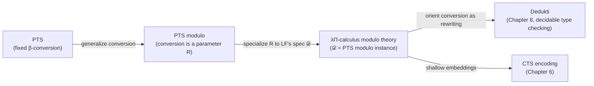
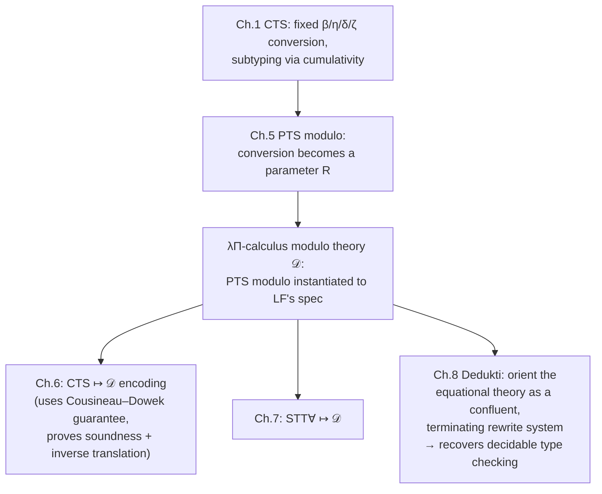

[[book-guidelines|↩ Back to guidelines]]

## Why a logical framework needs a *customizable* notion of equality

Every type system needs a way to decide when two terms it considers "the same" actually are the same — this is what lets a type checker accept `f (2 + 2)` where the expected type mentions `4`, without the user writing a proof for it. In an ordinary Pure Type System (PTS) — the family Chapter 1 built CTS on top of — that job is done by a single, fixed relation: $\beta$-reduction (plus, in some presentations, $\eta$). Two terms are convertible exactly when they $\beta$-reduce to a common term. This is baked into the type system itself; you don't get to add new equalities.

That rigidity is exactly what makes LF (the $\lambda\Pi$-calculus, i.e. dependent products over a two-sort PTS) work so well as a *logical framework* — a meta-language for encoding other logics as PTS specifications — and exactly what makes some of those encodings ugly. If the logic you're encoding has its own notion of computation or its own equational theory (arithmetic identities, structural rules, whatever), and your host framework only understands $\beta$, you're forced to encode that logic's equality as an explicit *proof-carrying* relation rather than something the type checker discovers automatically. The resulting encodings are called **deep**: every appeal to the source logic's equality becomes visible term-level plumbing in the target encoding. What you actually want, for interoperability, is a **shallow** encoding — one where a judgment of the source logic literally *becomes* a judgment of the target framework, with as little translation scaffolding as possible.

Chapter 5's move is to stop treating $\beta$ as sacred. It generalizes PTS to **PTS modulo**: a PTS parameterized by an *arbitrary, user-supplied* congruence, so the framework itself no longer commits to any one notion of computation. Specializing this generalized framework back down to LF's specification produces the **$\lambda\Pi$-calculus modulo theory** ($\lambda\Pi/\equiv$, called $\mathcal D$ in the thesis) — LF, but where the conversion relation is a parameter instead of a constant. This is the chapter's central object, and it is the logical framework the rest of the thesis's interoperability machinery (Chapters 6–12, and the Dedukti tool) is built on top of.



## PTS modulo: adding equations to the typing context, not the specification

The book is careful about *where* the new equations live. Blanqui's original presentation ([Bla01]) bakes all judgmental equalities into the specification up front. Thiré instead adds a **new context construction** — closer to how Dedukti actually works — so that equations can be introduced incrementally, one at a time, as the context grows (Definition 5.1.1, Fig. 5.1):

$$
\begin{aligned}
\text{Sorts} \quad & s \in S \\
\text{Terms} \quad & M, N, A, B \in \mathcal T ::= x \mid s \mid M\,N \mid \lambda x{:}A.\,M \mid (x{:}A) \to B \\
\text{Contexts} \quad & \Gamma, \Delta \in \mathcal G ::= \emptyset \mid \Gamma, x{:}A \mid \Gamma, A \equiv_\Delta B
\end{aligned}
$$

The only new piece is the last context former: $\Gamma, A \equiv_\Delta B$ says "for every substitution $\sigma : \Delta \to \mathcal T$, $A\sigma$ and $B\sigma$ are declared convertible, *provided* $A\sigma$ and $B\sigma$ share a common type." That last clause matters — it's not an unconditional axiom, it's an equation scoped to well-typed instances. A PTS modulo *specification* is otherwise identical to a plain PTS specification (Definition 5.1.2): the pair of sort/axiom/rule sets is unchanged, only the typing judgment's engine (how conversion is decided) is generalized.

The congruence this induces, $\equiv_{\beta\Gamma}$ (Fig. 5.2), is what you'd expect from "$\beta$ plus whatever's declared, closed under substitution, symmetry, transitivity, and congruence-in-context":

$$
\dfrac{A \equiv_\beta B}{A \equiv_{\beta\Gamma} B}\; (\equiv_{\beta\Gamma}\beta)
\qquad
\dfrac{(M \equiv_\Delta N) \in \Gamma \quad A = M\sigma \quad B = N\sigma \quad \sigma \in \Delta \to \Gamma}{A \equiv_{\beta\Gamma} B}\; (\equiv_{\beta\Gamma}\Delta)
$$

plus the usual symmetry, transitivity, congruence-under-a-hole ($C[A] \equiv_{\beta\Gamma} C[B]$), and closure under substitution. The book's worked example (Example 5.1, p.115–116) is worth internalizing because it shows how *any* equational fact — not just $\beta$-redexes — becomes a usable conversion once it's declared: given $x + x \equiv_{x:\mathbb N} 2 \times x$ and $y \equiv_{y:\mathbb N} y + 0$ in the context, one derives $z + (z + 0) \equiv_{\beta\Gamma} 2 \times z$ purely by chaining substitution instances of these two declared equations with $\equiv_{\beta\Gamma}[\cdot]$ and $\equiv_{\beta\Gamma}\mathrm{trans}$ — no $\beta$-reduction is involved at all. This is the whole point: the type system now treats domain-specific equalities exactly as first-class as $\beta$.

**What this buys a checker/verifier**, in the terms this project cares about: a PTS modulo context is doing the job of a lightweight, declarative rewrite database threaded through elaboration — structurally the same slot where a dependent type checker's `isDefEq`/`whnf` engine consults *definitional* equalities beyond plain reduction (unfolding `let`s, delta-reduction of global definitions, or theory-specific simplification lemmas). The context-indexed equation $A \equiv_\Delta B$ is a template rule (parametrized by $\Delta$) that gets instantiated by substitution at use sites — this is precisely the shape of a conditional rewrite rule in a term-rewriting-based checker, before Chapter 8 makes that connection explicit by literally compiling these equations into Dedukti's rewrite engine.

A Rust sketch of what a PTS-modulo typing context needs to carry, versus a plain PTS's:

```rust
enum CtxEntry {
    Var { name: Symbol, ty: Term },
    // The new construction: a declared equation, scoped by its own
    // local context Δ, standing for "for every σ : Δ → Γ, Aσ ≡ Bσ".
    Equation { scope: Vec<(Symbol, Term)>, lhs: Term, rhs: Term },
}

type Context = Vec<CtxEntry>;

// Deciding A ≡_{βΓ} B now means: β-reduce as usual, but additionally
// try instantiating any Equation entry in Γ (in either direction,
// since ≡ is symmetric) via unification of a subterm against lhs/rhs.
fn convertible(ctx: &Context, a: &Term, b: &Term) -> bool {
    // whnf(a) == whnf(b) under β  ...  OR  ... a rewrite-chain through
    // some Equation { lhs, rhs, .. } in ctx, closed under congruence.
    todo!()
}
```

The honest cost, spelled out in Fig. 5.3 and in the meta-theory (5.1.4), is that **deciding convertibility is no longer guaranteed decidable** — you've traded a fixed, terminating $\beta$-normalization procedure for an open-ended equational theory that a user can populate with anything. Chapter 5 flags this and defers the fix (orienting the equations into a terminating, confluent rewrite system) to Dedukti in Chapter 8. This is the general lesson that recurs in dependent type-checker design: definitional equality is exactly as decidable as whatever computation rules you let into it, and every framework that wants both expressiveness and a decidable kernel eventually needs some story — confluence, termination, or restricting to a decidable fragment — to keep `isDefEq` from becoming semi-decidable at best.

### Typing rules, and the property PTS modulo loses

The full typing system (Fig. 5.3) looks like ordinary PTS typing with two additions: a rule `R≡` for admitting a new equation into a well-formed context (checking both sides share a type $T$ in the extended context $\Gamma,\Delta$), and the conversion rule using $\equiv_{\beta\Gamma}$ instead of $\equiv_\beta$:

$$
\dfrac{\Gamma \vdash_R M : A \qquad \Gamma \vdash_R B : s \qquad A \equiv_{\beta\Gamma} B}{\Gamma \vdash_R M : B}\;(R{\equiv_{\beta\Gamma}})
$$

The meta-theoretic cost is **loss of product injectivity**. In ordinary PTS/CTS, if $(x{:}B_1)\to C_1$ and $(x{:}B_2)\to C_2$ are convertible then $B_1 \equiv B_2$ and $C_1 \equiv C_2$ — this is what lets you invert a Π-type unambiguously, and it is a load-bearing lemma for subject reduction. In PTS modulo, an arbitrary declared equation can make two syntactically unrelated products convertible without their domains or codomains being convertible at all, so injectivity has to be *assumed as a hypothesis* rather than derived. The book names this explicitly (Definitions 5.1.5–5.1.6):

- **IP($\Gamma$)** (Injectivity of Products): if $(x{:}B_1)\to C_1 \equiv_{\beta\Gamma} A \equiv_{\beta\Gamma} (x{:}B_2)\to C_2$, then $B_1\equiv_{\beta\Gamma}B_2$ and $C_1\equiv_{\beta\Gamma}C_2$.
- **SIP($\Gamma$)** (Strong IP): IP holds not just for $\Gamma$ but for *every* sub-context $\Gamma' \subseteq \Gamma$ — needed because subject reduction is proved by induction, and each inductive step may need IP to hold at a smaller context than the one you started with.

With SIP as an assumption, the chapter recovers the usual toolkit — weakening (5.1.1), context well-formedness (5.1.2), well-sortedness (5.1.3), substitution (5.1.4), subject reduction for $\beta$ (5.1.5, "if $\Gamma \vdash_R t:A$ and $t \to_\beta t'$ then $\Gamma \vdash_R t':A$"), and subject *equivalence* — a genuinely new lemma with no PTS analogue, since now reducing along a *declared* equation (not just $\beta$) also needs to preserve typing (5.1.6). **This is the direct analogue of what a Rust-based dependent checker needs to prove about its own reduction/rewrite engine**: whatever justifies "well-typed terms stay well-typed across normalization" has to be re-proved, or at minimum re-checked as a design invariant, the moment you let anything beyond $\beta$ into your definitional-equality relation — this is Saillard's theorem territory, which Chapter 8 makes precise for Dedukti's actual rewrite rules.

## The λΠ-calculus modulo theory as one specific instance

Everything so far is a *family* of type systems, parameterized by a specification $R$ and a set of declared equations. The $\lambda\Pi$-calculus modulo theory is the specific member of that family obtained by taking $R$ to be exactly LF's specification (Definition 5.1.7):

$$
\mathcal D : \quad A = \{(*,\square)\}, \qquad R = \{(*,\square,\square),\ (*,*,*)\}
$$

i.e. two sorts ($*$ for types, $\square$ for the kind of types), one axiom ($* : \square$), and two product-formation rules — dependent products over types are types ($* \to *: *$, ordinary function/Π-types), and type-families indexed by types live in $\square$ ($* \to \square : \square$). This is precisely $\lambda P$/LF (Harper–Honsell–Plotkin), plus PTS modulo's extra context construction for declared equations — hence "$\lambda\Pi$-calculus modulo theory," LF *modulo* a customizable congruence. Everything from Section 5.1 (weakening, substitution, subject reduction under SIP, etc.) specializes to this instance and is what any concrete encoding built on top of it — CTS in Chapter 6, STT∀ in Chapter 7 — inherits automatically.

The chapter is explicit about *why* this particular generalization of LF, rather than some other logical framework, is the right foundation for interoperability work: LF's chief virtue as a framework is **higher-order abstract syntax (HOAS)** — a source-logic binder like $\lambda x.\,x$ gets encoded directly as a binder of the framework itself, rather than as some hand-rolled de Bruijn-index datatype the encoding has to manage. This sidesteps "exotic functions" — extra, unwanted inhabitants that a naive first-order encoding of binders would let through — which is precisely the failure mode that breaks conservativity (below). Customizing the conversion on top of this HOAS-friendly base is what then lets an encoding be *shallow* rather than deep.

## Shallow embeddings, and the Cousineau–Dowek guarantee

**Definition 5.2.1 (Shallow encoding).** An encoding from logic $L$ into $L'$ is *shallow* if a judgment of $L$ translates to a judgment of $L'$, and a binder of $L$ translates to either a binder of $L'$, or a constant applied to arguments ending in a binder of $L'$. The second clause is what makes this a genuinely useful, checkable definition rather than a slogan: it's precisely permissive enough to let an encoding wrap a binder in some administrative constant (a common pattern when encoding, say, a dependent product that needs an explicit domain annotation the target binder doesn't carry natively) while still counting as "the binder didn't get compiled away into some encoding-specific combinator soup."

The chapter's key result — and the reason this framework can serve as a universal *target* for interoperability rather than just one framework among many — is:

**Theorem 5.2.1 (Cousineau & Dowek [CD07]).** For every functional PTS generated by a specification $\mathcal P$, there exists a shallow embedding of $\mathcal P$ into $\mathcal D$ (the $\lambda\Pi$-calculus modulo theory).

This is the theoretical justification for the whole thesis's architecture: *any* PTS-based logic — and by Chapter 1, essentially every proof assistant's core type theory can be presented as a CTS, itself PTS-based — is guaranteed to admit a shallow encoding into this one fixed framework. Chapter 6's actual CTS-to-$\mathcal D$ encoding is the concrete instance of this abstract guarantee.

## Soundness and conservativity: two very different senses of "the embedding is correct"

Section 5.3 is where the chapter earns its keep for anyone building a translation pipeline (or, in this project's terms, a trusted elaborator sitting in front of a small kernel): it separates two properties that are easy to conflate but pull in different directions.

**Definition 5.3.1 (Soundness).** An embedding $\llbracket\cdot\rrbracket$ of $L$ in $\mathcal D$ is sound if every derivable judgment $\Gamma \vdash_L t : A$ has a derivable image $\llbracket\Gamma\rrbracket \vdash_{\mathcal D} \llbracket t\rrbracket : \llbracket A\rrbracket$. This direction — "everything true in the source stays provable in the target" — is proved the ordinary way, by induction on the source derivation, checking each typing rule has a matching derivable image. The book is candid that it can still be hard in practice: computation must be *preserved* by the encoding, and (as flagged for the CTS encoding proper, in Chapter 6) proving this by straightforward induction can break down on well-foundedness grounds tied back to Chapter 3's well-structured derivation trees.

**Definition 5.3.2 (Conservativity).** An embedding is conservative if every derivable target judgment $\llbracket\Gamma\rrbracket \vdash_{\mathcal D} t : \llbracket A\rrbracket_\Gamma$ has *some* source witness — i.e., $\Gamma \vdash_L t' : A$ is derivable for some $t'$. This is the opposite direction: nothing extra becomes provable by translating into the target.

Why bother distinguishing them? Because soundness alone is trivially satisfiable by a useless embedding — the book gives an explicit "collapse everything" counterexample (p.119): in the fixed context $\Gamma = I : \star$, define $\llbracket t \rrbracket_\Gamma = I$ and $\llbracket A \rrbracket_\Gamma = \star$ for *every* $t$ and $A$. Every source judgment trivially has a derivable image (soundness holds), but the target now conflates every type and every term into one blob — it isn't remotely faithful to the source logic, and (for any consistent $L$) it is wildly non-conservative: the target proves judgments with no real source witness.

**What breaks without conservativity, concretely for interoperability:** the whole point of translating a proof from Matita into $\mathcal D$ (and back out to Coq, Lean, etc. — Chapters 6–12's actual pipeline) is that the round trip is *trustworthy*. A sound-but-not-conservative encoding can silently smuggle in provability the source system never actually licensed — exactly the kind of soundness bug that would make a translated "proof" of Fermat's little theorem meaningless as a certificate. This is the general shape of the trusted-computing-base question for any elaborator that hands proof terms to a small kernel: soundness of the *elaborator's output format* isn't enough on its own if the format itself can express more than the source language actually proves.

The book also tempers how much conservativity to demand in practice: full conservativity reasons over *every* term of $\mathcal D$, including ones with no source pre-image at all, which the text calls "a much harder property to prove" than soundness — and for interoperability purposes, often *stronger than needed*. What actually matters in practice is closer to preserving the **shape** of a type: a proof of $2+2$ should translate to something that still looks like a proof of $2+2$, even if the target framework happens to admit some additional, unrelated theorems the source couldn't prove. The book formalizes a weaker sufficient condition for this: an **inverse translation** $\llbracket\cdot\rrbracket^{-1}$ such that $A \equiv_\beta \llbracket\llbracket A\rrbracket\rrbracket^{-1}$ for every source type $A$ — proving such an inverse exists is generally *necessary* for conservativity (per [Ass15b]) without being sufficient on its own, but it does guarantee no information about the statement being proved is lost in translation. This inverse-translation move is exactly what Chapter 6 supplies for the CTS encoding (Section 6.3, "conservativity").

## Where this leads



This chapter is the hinge between the meta-theory built in Chapters 1–4 (CTS, well-structured derivation trees, bi-directional typing) and the actual interoperability machinery in Chapters 6 onward: it's where "which framework do we even translate *into*" gets answered, and where "sound" and "conservative" get pinned down precisely enough to be provable obligations rather than slogans. Directly downstream: Chapter 6 instantiates the shallow-embedding theorem for CTS specifically and discharges exactly the soundness/conservativity obligations defined here; Chapter 8's Dedukti is this same type system with the abstract congruence replaced by a concrete rewrite engine, trading the undecidability flagged in Section 5.1.4 for a burden on confluence and termination instead.

For this project's `type-theory` focus area, the connections worth carrying forward explicitly: the declared-equation context construction ($\Gamma, A \equiv_\Delta B$) is a template for how a definitional-equality/`isDefEq` engine can be made *extensible* without touching the kernel's core typing rules — precisely the design tension a Rust-based dependent/refinement-type kernel will face if it wants to support theory-specific normalization (arithmetic simplification, SMT-backed decision procedures) inside `isDefEq` rather than only as external tactics. And the soundness/conservativity split is the right vocabulary for stating what an elaborator's own translation (surface syntax → core terms handed to the trusted kernel) is obligated to guarantee: soundness alone is cheap and can be gamed by a degenerate elaborator, so a real trusted-computing-base story needs the conservativity-adjacent "shape preservation" argument this chapter introduces.
