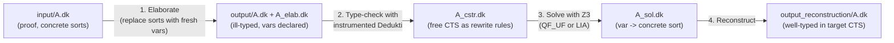

[[book-guidelines|↩ Back to guidelines]]

## Why a tool needs to *decide* an embedding at all

Chapter 2 gave you an algorithm on paper: given a derivable judgment $\Gamma \vdash_{\mathcal C} t : A$ and a target CTS $\mathcal C'$, decide whether that judgment is embeddable into $\mathcal C'$. That algorithm hinges on the **free CTS** (Definition 2.3.3) — replace every sort in the derivation with a fresh variable, and ask what constraints on those variables would make the derivation type-check again. Universo is what happens when you stop treating that as a proof-theoretic argument and start treating it as a compiler pass.

Here's the concrete problem it solves. Suppose you have a proof file written against Matita's universe hierarchy, and you want the *same proof term* to type-check against Coq's hierarchy instead. The two hierarchies don't agree on which universe things live in — Matita might put your inductive type in universe 2, Coq's rules might force it into universe 3 once you compose with everything downstream. You can't just relabel by hand once the library has hundreds of lemmas. What you actually need is: erase the universe annotations, re-derive what constraints on them are *forced* by the proof's own structure, hand those constraints to something that's good at solving them, and substitute back in. That's Universo, in one sentence: **CTS embedding-decision, generalized and automated.**

The book is explicit that this generalizes something you may already have met: Coq's own algorithm for checking that its *floating universe constraints* are consistent [Typ05]. Coq's version is special-cased to one fixed target CTS (its own, $C_{s\infty}^\infty$) and leans on Coq's specific *algebraic universes*. Universo removes both restrictions — the target CTS is a parameter, and the underlying representation of sorts is decoupled from any one proof assistant's design.

**What breaks without this:** without an automated embedding-decider, "interoperability" between two proof assistants' universe systems is a manual, per-lemma renumbering exercise that does not scale past toy examples — exactly the wall the Chapter 11 case study (300 lemmas, ending in Fermat's little theorem) would hit if it had to be crossed by hand.

## The four-step pipeline

Universo's algorithm, concretely, is:

1. **Elaborate** the judgment: replace every sort in the term by a fresh variable.
2. **Generate the free CTS**: invoke Dedukti *as a type checker*, instrumented so that every time its convertibility test would need to compare two sorts, it instead records a constraint. Feeding the ill-typed, variable-laden term through this instrumented checker reconstructs the free CTS (Section 2.3) as a literal list of constraints.
3. **Solve**: hand those constraints to an SMT solver (Z3) and ask for a sort-morphism from the free CTS into the target specification $\mathcal C'$.
4. **Reconstruct**: if a solution exists, substitute the fresh variables for their images under that morphism, producing a concrete term that type-checks in $\mathcal C'$.



Each arrow above is a separate file on disk, not just a conceptual stage — and that's a deliberate engineering decision, not an accident of implementation. Because elaboration rarely changes, but you might re-solve with a different target CTS many times, keeping the steps as separate files (`A.dk`, `A_elab.dk`, `A_cstr.dk`, `A_sol.dk`) lets you re-run only the steps that need re-running. This is the same reasoning that motivates separating a compiler's lexer/parser/typechecker/codegen into distinct passes with serializable intermediate representations, rather than one monolithic function — and it foreshadows the pipeline architecture of Chapter 11's Matita→STT∀ translation, which reuses exactly this file-based composability.

### Worked example, traced through

The book runs one running example throughout: the judgment $\vdash_{\mathcal D_3} \square_1 \to \square_1 : \square_2$ (a $\Pi$-type from sort $\square_1$ to itself, itself classified by $\square_2$), encoded via the public/private-signature CTS encoding from Chapter 6.

**Step 1 (elaboration).** Every occurrence of a sort constant (`cts.s1`, `cts.s2`, ...) in the term is replaced by a fresh metavariable, written `A_elab.?0`, `A_elab.?1`, etc. — twelve of them for this small example. This is implemented as a two-phase process itself: first Dkmeta (Chapter 9's rewrite-based meta-language) normalizes the term using rules from the configuration file, materializing placeholder constants `Universo.var`; then a second pass walks the term and replaces each occurrence of `Universo.var` with an actual fresh variable, declared in a new file (`A_elab.dk`).

**Step 2 (type checking / constraint generation).** The now ill-typed term `output/A.dk` — ill-typed because it contains raw metavariables where sorts should be — is fed to Dedukti's type checker, which has been instrumented to catch exactly the situations that would normally be type errors. For instance, encountering the CTS product `cts.prod A_elab.?1 A_elab.?2 A_elab.?3 cts.I` in the term produces the constraint
$$\texttt{cts.Rule } {?_1}\ {?_2}\ {?_3} \longrightarrow \texttt{cts.true}$$
i.e., "whatever sorts $?_1, ?_2, ?_3$ ultimately are, the CTS rule relation $R(?_1, ?_2, ?_3)$ must hold for this Pi-type to be well-formed." Running the full derivation produces a list of such constraints (Fig. 10.3 in the book): `Rule`, `Axiom`, and `Cumul` constraints, plus flat equality constraints like `A_elab.?7 --> A_elab.?4` forced by unification during type checking.

**Step 3 (solving).** These constraints — literally a Dedukti file of rewrite rules — are handed to Z3. For the running example Z3 finds a solution: `?0 ↦ s3`, `?1 ↦ s3`, `?4 ↦ s2`, `?6 ↦ s1`, and so on (Fig. 10.4).

**Step 4 (reconstruction).** Substituting these solutions back gives a concrete, well-typed term (Fig. 10.5) — and the book notes this reproduces exactly the solution given by hand in Example 2.13. The pipeline has automated what was, in Chapter 2, a hand-worked illustration.

**Grounding — this is elaboration-with-metavariables, not new machinery.** If you've internalized bidirectional elaboration (Focus Area `type-theory`), step 1–2 should look extremely familiar: it *is* the metavariable-insertion-then-constraint-collection pattern that drives Lean's or Coq's elaborator, just specialized to a single syntactic class (sorts) rather than arbitrary implicit terms. In Lean terms: `A_elab.?7` is exactly a metavariable `?m7 : Sort`, and the "instrumented convertibility test" is exactly what Lean's `isDefEq` does when it meets a metavariable on one side of a comparison — instead of failing, it *assigns* or *defers as a constraint*. The only real novelty here is what happens to the deferred constraints: instead of local unification-style assignment, they get shipped wholesale to an external SMT solver. A minimal Rust sketch of the shape of the instrumented check:

```rust
enum SortTerm {
    Var(u32),
    Const(u32), // concrete universe level
}

enum Constraint {
    Eq(u32, u32),                 // ?i = ?j
    Rule(SortTerm, SortTerm, SortTerm), // Rule(?i, ?j, ?k) = true
    Axiom(SortTerm, SortTerm),
    Cumul(SortTerm, SortTerm),
}

// The hook replaces Dedukti's ordinary convertibility test.
// Given two WHNF terms l, r that a *normal* conv-check would compare,
// it intercepts the cases mentioning sort variables, emits a constraint,
// and reports "convertible" so the type checker can keep going.
fn universo_conv_hook(l: &Term, r: &Term, constraints: &mut Vec<Constraint>) -> Option<bool> {
    match (l, r) {
        (Term::SortVar(i), Term::SortVar(j)) => {
            constraints.push(Constraint::Eq(*i, *j));
            Some(true)
        }
        (Term::Rule(a, b, c), Term::True) => {
            constraints.push(Constraint::Rule(a.clone(), b.clone(), c.clone()));
            Some(true)
        }
        // Axiom / Cumul cases follow the same shape...
        _ => None, // fall through to Dedukti's ordinary convertibility test
    }
}
```

This is the "checker as constraint generator" pattern your refinement-type compiler will need for Hoare-style verification conditions: instead of *deciding* a proposition on the spot, the checker records it as a constraint and defers the decision to a downstream solver — precisely the division of labor between an abstract interpreter/type checker (constraint *generation*) and an SMT backend (constraint *discharge*) that Focus Areas `automated-reasoning` and `sat-smt-csp` both name as a target-system component.

## Configuration: four sections, one philosophy

Universo has to work across arbitrarily many source and target logics, so nothing about "what a sort actually is" can be hard-coded. Its internal representation of sorts is just an encoding of the natural numbers — constants `uzero` and `usucc` (zero and successor), wrapped by `enum` to turn a natural number into an actual sort constant. These are *purely syntactic* to Universo itself; the user gives them meaning via a configuration file, which is itself a Dedukti file (so it can be parsed with Dedukti's own reader and can define genuine rewrite rules Dkmeta will use). Four unordered sections:

- **`elaboration`** — meta rewrite rules (run via Dkmeta) that decide which sorts get replaced by fresh variables versus left fixed. E.g. `[] cts.star --> cts.var.` marks every occurrence of `star` for elaboration; `[] cts.star --> cts.enum cts.uzero.` instead *pins* it directly to level 0. This matters practically: a sort like $\ast$ (Prop) is almost always at the bottom of the hierarchy and never actually needs to vary, so pinning it shrinks the constraint problem before the solver ever sees it — this section doubles as a preprocessing/optimization hook, not just a labeling mechanism.
- **`constraints`** — lets the user *add* constraints the free-CTS generation wouldn't produce on its own, because the free CTS under-determines the solution (the specification morphism from free CTS to target is not unique). The book's example: by default, Universo is free to sort Matita's natural numbers as either a datatype or (degenerately) as a proposition; if you want datatype behavior specifically, you add a constraint forcing its sort strictly above the proposition sort.
- **`solver`** — chooses between Z3's two supported logics: **QF_UF** (quantifier-free equality + uninterpreted functions — good for small, finite specifications, since it needs an *exhaustive* case-by-case interpretation of `Axiom`/`Rule`/`Cumul`, practically capped around 5 universes) and **LIA** (linear integer arithmetic — sorts become integers, `uzero`↦0, `usucc`↦successor; good for the large, uniform, *predicative-style* hierarchies behind Lean/Coq/Matita, via an algebra of `true, false, zero, succ, eq, max, imax, le, ite` — note `imax`, the *impredicative max* used to encode Prop's special "impredicative" collapsing behavior: $\mathrm{imax}(a,b) = \mathbf{if}\ b=0\ \mathbf{then}\ 0\ \mathbf{else}\ \max(a,b)$).
- **`output`** — maps Universo's internal `enum`-based sort representation back to the target logic's actual sort constants (e.g. `cts.enum cts.uzero --> star.`).

The QF_UF/LIA choice is a genuinely interesting encoding decision worth sitting with: it's choosing between treating "is this a valid axiom/rule triple" as an *enumerable relation over a small alphabet* versus as *arithmetic over an unbounded domain* — the same tradeoff you'll face choosing between a lookup-table-style and an arithmetic-constraint-style representation for any small, closed enumeration versus an open-ended integer domain in your own CSP kernel's constraint encoding (Focus Area `sat-smt-csp`).

## Two implementation problems worth understanding in depth

### The convertibility hook, precisely

Universo's core mechanism is a **hook placed *before* Dedukti's ordinary convertibility test**. Given two terms $l, r$ already reduced to weak head normal form (not full normal form — a real performance choice, since computing full normal forms would be far more expensive and generally isn't needed to compare heads), the hook checks for one of eight cases (four up to symmetry):

- $l = {?}_i,\ r = {?}_j \Rightarrow$ emit ${?}_i = {?}_j$
- $l = \mathrm{Rule}({?}_i,{?}_j,{?}_k),\ r = \mathtt{true} \Rightarrow$ emit $\mathrm{Rule}({?}_i,{?}_j,{?}_k)=\mathtt{true}$
- $l = \mathrm{Axiom}({?}_i,{?}_j),\ r = \mathtt{true} \Rightarrow$ emit $\mathrm{Axiom}({?}_i,{?}_j)=\mathtt{true}$
- $l = \mathrm{Cumul}({?}_i,{?}_j),\ r = \mathtt{true} \Rightarrow$ emit $\mathrm{Cumul}({?}_i,{?}_j)=\mathtt{true}$

returning `true` ("convertible, as far as Universo is concerned — and a constraint has been recorded as a side effect"), or `false`/no-answer, in which case Dedukti's own ordinary convertibility test takes over. The first bullet generates the equivalence relation underlying the free CTS; the rest encode its specification data.

As a further optimization, that first equality constraint is *also* installed as an actual Dedukti rewrite rule (not just recorded for the solver) — this speeds up subsequent type-checking of the same file, since Dedukti's own engine can now use it directly. But orienting an equality as a rewrite rule is dangerous: pick the wrong direction and you can build a non-terminating rewrite system. Universo's fix is to impose a **total order on elaborated sort variables** (matching the order they were freshly generated in, i.e. the order of the underlying natural numbers) and *always* orient the rule from the larger variable to the smaller — chosen empirically, because fewer constraints tend to accumulate on smaller universes, which keeps WHNF computation cheap. This is a small but genuine instance of a recurring theme across term-rewriting systems: an equation is sound as data, but orienting it into a *rule* imposes a directionality obligation the reasoning system must discharge separately (analogous to why Knuth-Bendix completion needs a term ordering, and worth remembering when your own compiler turns definitional-equality facts into a confluent, terminating simplification set).

### Identity casts and non-linearity — the hardest bug in the chapter

Recall from Chapter 6/8.3 that the CTS encoding makes subtyping *explicit*: instead of silent coercions, terms carry `cast` nodes, and an **identity cast rule** in the private signature — `[A,t] cast' _ _ A A t -> t.` — lets the type checker discharge a cast where source and target sort happen to coincide. This identity-cast rule is *needed* for the current inductive-types encoding to type-check some genuinely well-typed terms.

The problem: this rule is **non-linear** — the pattern `cast' _ _ A A t` requires the *same* metavariable `A` to appear twice. Once sorts are replaced by metavariables during elaboration, deciding whether this rule *matches* requires deciding whether two occurrences of "the same slot" are convertible — which routes straight back through Universo's hook, which happily says yes and emits a constraint. That would be fine in isolation, but the book shows a worked counterexample where naively firing the identity cast rule during unrelated convertibility checks (comparing `cast ?9 ?10 u0 u1 cts.I B` against `cast ?13 ?14 u0 u1 cts.I B` while type-checking an unrelated application) generates a *spurious* constraint (`?4 --> ?3`) that has nothing to do with the derivation's actual requirements — one which, in the example, rules out an otherwise-valid target CTS (Coq's 3-universe hierarchy) as a solution.

The fix is blunt but effective: **remove the identity-cast rule from the private signature entirely**, and have the hook apply it *manually*, only in the one situation where it's actually needed — when Dedukti's convertibility test is comparing a cast-headed term against a non-cast-headed term (as opposed to two cast-headed terms against each other, which is where the spurious-constraint bug arose). The author is candid that this is not an elegant solution ("We are not very pleased with this solution but it works") but it is load-bearing for Universo to function at all in practice.

**Why this matters for your unifier.** This is a directly transferable lesson for pattern unification (Focus Areas `type-theory` + `automated-reasoning`): a **non-linear pattern is exactly the case Miller's pattern fragment excludes** from tractable higher-order unification, precisely because a repeated metavariable forces you to *decide* an equality between two arbitrary subterms rather than simply reading off a substitution. Universo's identity-cast rule is a non-linear rewrite rule hiding inside what looks like an ordinary reduction system, and it silently reduces to a unification problem the moment sort variables enter the picture. The bug the book walks through — a rule firing in a context where it happens to be technically applicable but semantically wrong — is the rewriting-world cousin of an over-eager unifier assigning a metavariable in a context where the assignment isn't actually justified by the surrounding derivation. The general lesson: whenever your elaborator's convertibility/definitional-equality check can be triggered as a *side effect* of an unrelated comparison (as Dedukti's WHNF computation triggers Universo's hook here), you need an explicit account of exactly *which* structural contexts license firing a given rule — "does this pattern match" is not enough; "should this rule apply *here*" is the real question, and the identity-cast fix is essentially special-casing the answer to "no" for cast-vs-cast comparisons and "yes" only for cast-vs-non-cast.

## Scalability: modularity, laziness, and the SMT bottleneck

Three engineering notes round out the implementation section, each a small case study in taking an elegant algorithm and making it survive contact with a 300-lemma library (Chapter 11's benchmark):

- **Modularity.** Each file's generated constraints (`A_cstr.dk`) are themselves valid Dedukti/Dkmeta artifacts and can be *reused* when type-checking files that depend on it — constraint generation composes across a library's module graph rather than needing to be redone globally.
- **Laziness in decision-tree construction.** Naively, Dedukti's decision-tree-based pattern matcher (Section 8.1.3) rebuilds its decision tree every time a rule is added to a symbol — and Universo adds constraint-rules one at a time, in volume, giving quadratic blowup in the number of rules. The fix: make decision-tree construction **lazy**, computed only when the rewrite engine actually needs a WHNF for that symbol. This trades a small per-lookup slowdown for avoiding the quadratic rebuild cost — a classic amortization tradeoff that shows up any time you're incrementally growing a dispatch structure (a jump table, a trie, a decision tree) under many small insertions rather than one bulk build.
- **The SMT step is the actual bottleneck.** Constraint generation and type-checking scale roughly with proof size, but there's no way to bound the SMT solver's own running time — the book reports empirically-linear scaling on the libraries tested, but explicitly flags this as the open scalability question (echoed in the Chapter 10 Future Work: partial solving, better non-linear-rule handling, and instrumenting Z3 with incremental solving and custom tactics). This is the same shape of concern your own CSP kernel will face: constraint *generation* is usually the easy, structurally-bounded part; constraint *discharge* is where worst-case complexity actually lives, and where engineering effort (union-find preprocessing, incrementality, problem-specific tactics — all mentioned here) buys the most practical mileage.

## Where this leads

Universo is Chapter 2's embedding-decision algorithm made real, riding on Chapter 6/8's public/private CTS encoding and Chapter 9's Dkmeta for its elaboration pass. It is in turn the load-bearing tool for Chapter 11's case study: the Matita-to-STT∀ translation of Fermat's little theorem runs Universo as its main proof-transformation step, before Dkpsuler and further passes strip away the remaining non-CTS features (inductive-type polymorphism, spurious dependent types) that Universo alone can't touch.

For the standing compiler project, this chapter is worth returning to on three fronts: (1) it's a fully worked instance of "elaborate with metavariables, defer decisions as constraints, discharge with an external solver" — the exact architecture a refinement-type elaborator needs for implicit/universe-level inference feeding an SMT backend (Focus Areas `type-theory`, `sat-smt-csp`); (2) the identity-cast non-linearity bug is a concrete cautionary tale about where naive rule-firing masquerades as unification and produces unsound-looking-but-actually-incomplete behavior (Focus Area `automated-reasoning`); and (3) the QF_UF-vs-LIA and lazy-decision-tree design choices are directly analogous engineering decisions your own CSP kernel will have to make when choosing between enumerable and arithmetic constraint encodings and when building an incrementally-populated dispatch structure.
